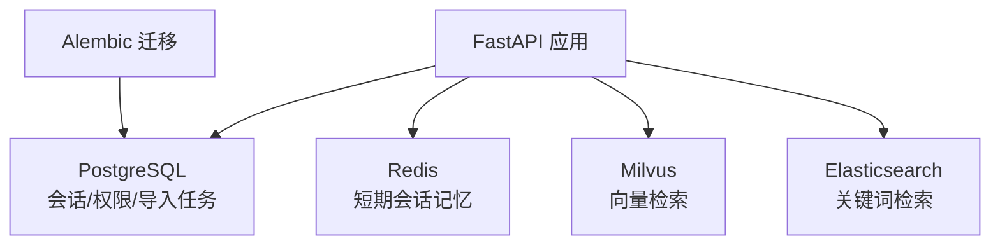
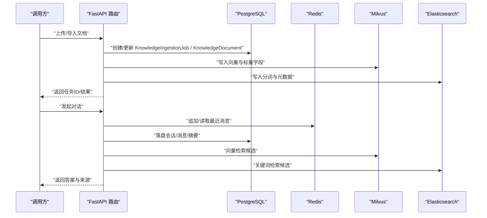
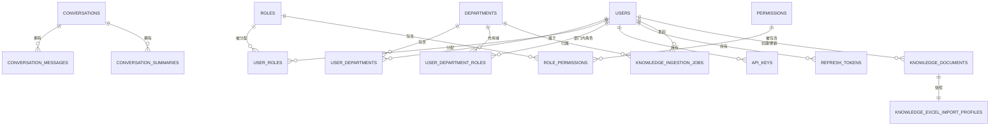
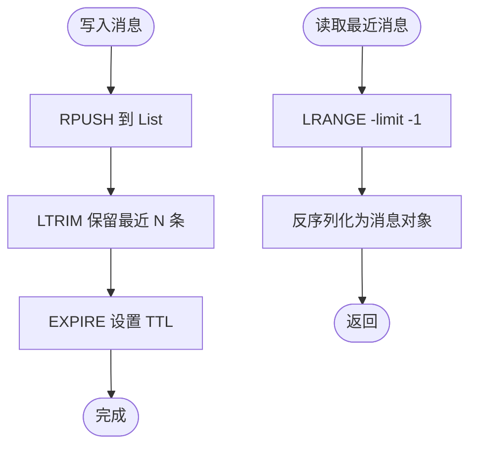
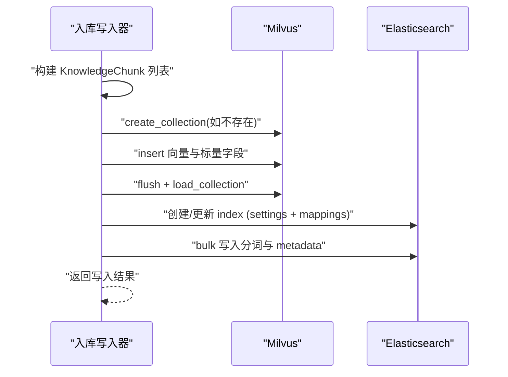
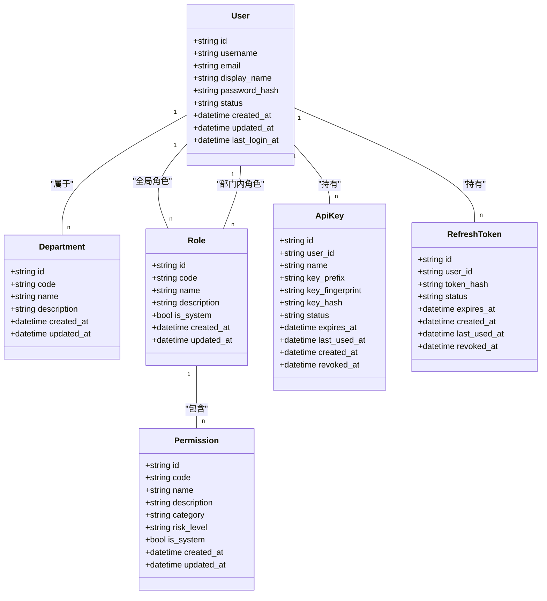
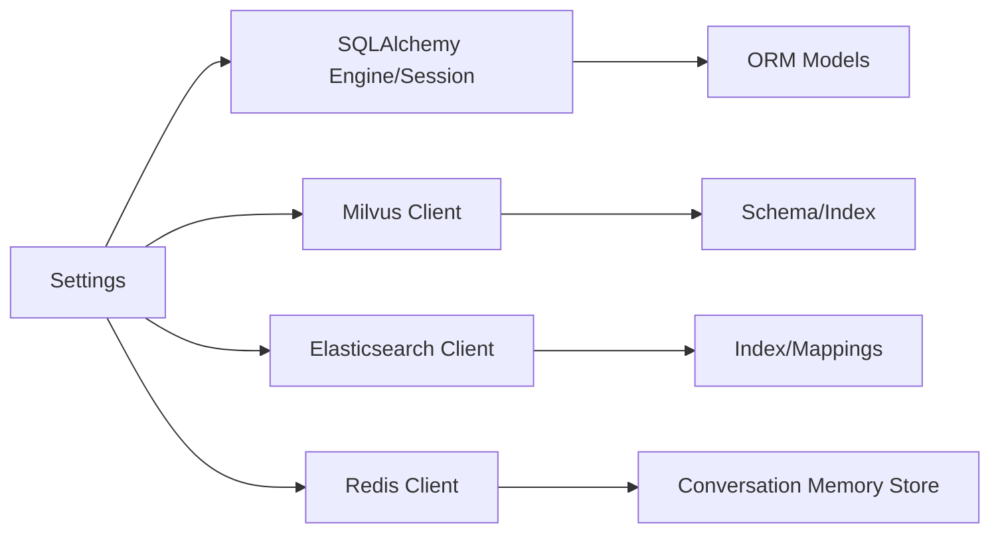

# 数据存储设计

<cite>
**本文引用的文件**
- [base.py](file://python-agent-study/src/fast_app/db/base.py)
- [session.py](file://python-agent-study/src/fast_app/db/session.py)
- [conversation_tables.py](file://python-agent-study/src/fast_app/db/conversation_tables.py)
- [auth_tables.py](file://python-agent-study/src/fast_app/db/auth_tables.py)
- [ingestion_tables.py](file://python-agent-study/src/fast_app/db/ingestion_tables.py)
- [env.py](file://python-agent-study/alembic/env.py)
- [config.py](file://python-agent-study/src/fast_app/core/config.py)
- [rag_store_schema.py](file://python-agent-study/src/fast_app/ingestion/stores/rag_store_schema.py)
- [rag_store_writer.py](file://python-agent-study/src/fast_app/ingestion/stores/rag_store_writer.py)
- [conversation_memory.py](file://python-agent-study/src/fast_app/services/conversation/conversation_memory.py)
- [conversation_models.py](file://python-agent-study/src/fast_app/domain/conversation_models.py)
- [knowledge_models.py](file://python-agent-study/src/fast_app/domain/knowledge_models.py)
- [14-2-Redis短期会话记忆-最近消息-TTL-会话状态.md](file://python-agent-study/learning-docs/phase-14/14-2-Redis短期会话记忆-最近消息-TTL-会话状态.md)
</cite>

## 目录
1. [引言](#引言)
2. [项目结构](#项目结构)
3. [核心组件](#核心组件)
4. [架构总览](#架构总览)
5. [详细组件分析](#详细组件分析)
6. [依赖关系分析](#依赖关系分析)
7. [性能考虑](#性能考虑)
8. [故障排查指南](#故障排查指南)
9. [结论](#结论)
10. [附录](#附录)

## 引言
本文件面向数据库管理员与后端开发者，系统化梳理本项目数据层设计：PostgreSQL 持久化模型、Redis 短期会话缓存、Milvus 向量检索存储、Elasticsearch 关键词索引。文档覆盖实体关系、字段定义、约束与索引策略；解释会话持久化、知识文档存储、权限数据的存储方案；并给出数据迁移管理、性能优化与一致性保障建议。

## 项目结构
数据相关代码主要分布在以下位置：
- PostgreSQL ORM 模型与连接：src/fast_app/db/*
- 配置中心：src/fast_app/core/config.py
- 知识库入库与双写（Milvus + Elasticsearch）：src/fast_app/ingestion/stores/*
- 会话短期记忆：src/fast_app/services/conversation/conversation_memory.py
- 领域模型：src/fast_app/domain/*
- 迁移入口：alembic/env.py

**图表来源**
- [session.py:11-32](file://python-agent-study/src/fast_app/db/session.py#L11-L32)
- [config.py:520-535](file://python-agent-study/src/fast_app/core/config.py#L520-L535)
- [rag_store_schema.py:147-279](file://python-agent-study/src/fast_app/ingestion/stores/rag_store_schema.py#L147-L279)
- [env.py:18-34](file://python-agent-study/alembic/env.py#L18-L34)

**章节来源**
- [session.py:11-32](file://python-agent-study/src/fast_app/db/session.py#L11-L32)
- [config.py:520-535](file://python-agent-study/src/fast_app/core/config.py#L520-L535)
- [env.py:18-34](file://python-agent-study/alembic/env.py#L18-L34)

## 核心组件
- PostgreSQL 数据模型
  - 会话与会话消息、摘要：ConversationTable、ConversationMessageTable、ConversationSummaryTable
  - 认证与权限：UserTable、DepartmentTable、RoleTable、PermissionTable、关联表、ApiKeyTable、RefreshTokenTable
  - 知识入库任务与文档：KnowledgeIngestionJobTable、KnowledgeDocumentTable、KnowledgeExcelImportProfileTable
- Redis 短期会话记忆
  - 协议 ConversationMemoryStore 与 InMemoryConversationMemoryStore 实现；文档说明 Redis 实现的关键键空间与 TTL 策略
- Milvus 向量存储
  - Collection Schema、Index 参数、输出字段集合
- Elasticsearch 索引
  - Index Settings、Mappings、IK 分词器、metadata 子字段映射

**章节来源**
- [conversation_tables.py:24-171](file://python-agent-study/src/fast_app/db/conversation_tables.py#L24-L171)
- [auth_tables.py:13-431](file://python-agent-study/src/fast_app/db/auth_tables.py#L13-L431)
- [ingestion_tables.py:24-204](file://python-agent-study/src/fast_app/db/ingestion_tables.py#L24-L204)
- [conversation_memory.py:10-45](file://python-agent-study/src/fast_app/services/conversation/conversation_memory.py#L10-L45)
- [rag_store_schema.py:44-140](file://python-agent-study/src/fast_app/ingestion/stores/rag_store_schema.py#L44-L140)
- [rag_store_schema.py:147-279](file://python-agent-study/src/fast_app/ingestion/stores/rag_store_schema.py#L147-L279)

## 架构总览
系统采用“多存储分工”的数据架构：
- PostgreSQL 负责强一致的业务事实：会话、消息、摘要、用户/部门/角色/权限、导入任务与文档元信息
- Redis 作为短期会话记忆：按 conversation_id 维护最近 N 条消息，支持 TTL 自动过期
- Milvus 承载向量检索：对 chunk 文本进行向量化，使用余弦相似度检索
- Elasticsearch 承载关键词检索：对 chunk 文本与结构化 metadata 建立全文与过滤能力
- 入库阶段将同一份 KnowledgeChunk 同时写入 Milvus 与 Elasticsearch，形成“向量+关键词”双索引

**图表来源**
- [ingestion_tables.py:24-121](file://python-agent-study/src/fast_app/db/ingestion_tables.py#L24-L121)
- [rag_store_schema.py:147-279](file://python-agent-study/src/fast_app/ingestion/stores/rag_store_schema.py#L147-L279)
- [rag_store_schema.py:71-140](file://python-agent-study/src/fast_app/ingestion/stores/rag_store_schema.py#L71-L140)
- [conversation_memory.py:10-45](file://python-agent-study/src/fast_app/services/conversation/conversation_memory.py#L10-L45)
- [conversation_tables.py:24-171](file://python-agent-study/src/fast_app/db/conversation_tables.py#L24-L171)

## 详细组件分析

### PostgreSQL 数据模型与关系
- 会话域
  - conversations：会话容器，包含 JSONB 扩展字段
  - conversation_messages：消息序列，含 sequence_no 自增、按 conversation_id + created_at 与 conversation_id + sequence_no 的复合索引
  - conversation_summaries：窗口外历史的可追溯摘要版本，含 version 索引
- 认证与权限域
  - users、departments、roles、permissions 基础主数据
  - user_departments、user_roles、user_department_roles、role_permissions 多对多关系表，均设置唯一约束与常用查询索引
  - api_keys、refresh_tokens 仅保存哈希与审计字段，降低敏感信息泄露风险
- 知识入库域
  - knowledge_ingestion_jobs：任务状态机、租约、重试次数、产物统计、错误追踪；针对活跃任务路径的唯一约束避免并发冲突
  - knowledge_documents：服务端文档身份、当前版本、状态、创建/更新人
  - knowledge_excel_import_profiles：Excel 导入 Profile 快照，按 doc_id + version 唯一

**图表来源**
- [conversation_tables.py:24-171](file://python-agent-study/src/fast_app/db/conversation_tables.py#L24-L171)
- [auth_tables.py:13-431](file://python-agent-study/src/fast_app/db/auth_tables.py#L13-L431)
- [ingestion_tables.py:24-204](file://python-agent-study/src/fast_app/db/ingestion_tables.py#L24-L204)

**章节来源**
- [conversation_tables.py:24-171](file://python-agent-study/src/fast_app/db/conversation_tables.py#L24-L171)
- [auth_tables.py:13-431](file://python-agent-study/src/fast_app/db/auth_tables.py#L13-L431)
- [ingestion_tables.py:24-204](file://python-agent-study/src/fast_app/db/ingestion_tables.py#L24-L204)

### 会话持久化与短期记忆
- 长期持久化（PostgreSQL）
  - 会话容器、消息、摘要分别落库，消息具备 sequence_no 保证顺序，摘要具备 version 可追溯
- 短期记忆（Redis）
  - 通过 ConversationMemoryStore 协议抽象，当前提供内存实现；文档说明了 Redis 实现的关键点：
    - key 命名：conversation:{id}:messages
    - 数据结构：List，RPUSH 追加、LRANGE 读取最近 N 条、LTRIM 控制长度、EXPIRE 设置 TTL
    - TTL 刷新策略：仅在写入时续期，读取不续期，避免旧会话被无意延长
  - 配置项：MEMORY_STORE_PROVIDER、REDIS_URL、MEMORY_TTL_SECONDS、MEMORY_MAX_MESSAGES、MEMORY_HISTORY_MAX_TURNS

**图表来源**
- [conversation_memory.py:10-45](file://python-agent-study/src/fast_app/services/conversation/conversation_memory.py#L10-L45)
- [14-2-Redis短期会话记忆-最近消息-TTL-会话状态.md:84-119](file://python-agent-study/learning-docs/phase-14/14-2-Redis短期会话记忆-最近消息-TTL-会话状态.md#L84-L119)
- [14-2-Redis短期会话记忆-最近消息-TTL-会话状态.md:206-246](file://python-agent-study/learning-docs/phase-14/14-2-Redis短期会话记忆-最近消息-TTL-会话状态.md#L206-L246)
- [14-2-Redis短期会话记忆-最近消息-TTL-会话状态.md:330-364](file://python-agent-study/learning-docs/phase-14/14-2-Redis短期会话记忆-最近消息-TTL-会话状态.md#L330-L364)

**章节来源**
- [conversation_memory.py:10-45](file://python-agent-study/src/fast_app/services/conversation/conversation_memory.py#L10-L45)
- [14-2-Redis短期会话记忆-最近消息-TTL-会话状态.md:84-119](file://python-agent-study/learning-docs/phase-14/14-2-Redis短期会话记忆-最近消息-TTL-会话状态.md#L84-L119)
- [14-2-Redis短期会话记忆-最近消息-TTL-会话状态.md:206-246](file://python-agent-study/learning-docs/phase-14/14-2-Redis短期会话记忆-最近消息-TTL-会话状态.md#L206-L246)
- [14-2-Redis短期会话记忆-最近消息-TTL-会话状态.md:330-364](file://python-agent-study/learning-docs/phase-14/14-2-Redis短期会话记忆-最近消息-TTL-会话状态.md#L330-L364)

### 知识文档存储与双写（Milvus + Elasticsearch）
- 领域模型
  - KnowledgeChunk：chunk id、content、source、title、metadata、可选 search_text
- Milvus 存储
  - Collection 包含向量字段、内容、标题、doc_id、source_path、document_type、chunk_index、逻辑/物理父子 ID、来源标识、版本区间、JSON metadata
  - 向量索引：AUTOINDEX + COSINE
  - 输出字段集合用于检索时只取必要字段，减少网络开销
- Elasticsearch 索引
  - 分词器：ik_max_word 索引、ik_smart 搜索
  - 字段类型：keyword、text、long、date 等
  - metadata 子字段：doc_id、chunk_id、source_path、section_path、document_type、visibility、allowed_departments、allowed_users、permission_source、content_hash、index_hash、identity_key、builder_schema_version、embedding_fingerprint、file_name、file_extension、heading_level、section_index、chunk_index、record_type、parent_id、section_key、parent_index、child_index、token_count、char_count、line_start、line_end、chunk_strategy_version
- 写入流程
  - 确保 collection/index 存在或重建
  - 批量插入向量与标量字段
  - flush 并 load collection

**图表来源**
- [rag_store_schema.py:147-279](file://python-agent-study/src/fast_app/ingestion/stores/rag_store_schema.py#L147-L279)
- [rag_store_schema.py:71-140](file://python-agent-study/src/fast_app/ingestion/stores/rag_store_schema.py#L71-L140)
- [rag_store_writer.py:528-572](file://python-agent-study/src/fast_app/ingestion/stores/rag_store_writer.py#L528-L572)

**章节来源**
- [knowledge_models.py:94-109](file://python-agent-study/src/fast_app/domain/knowledge_models.py#L94-L109)
- [rag_store_schema.py:71-140](file://python-agent-study/src/fast_app/ingestion/stores/rag_store_schema.py#L71-L140)
- [rag_store_schema.py:147-279](file://python-agent-study/src/fast_app/ingestion/stores/rag_store_schema.py#L147-L279)
- [rag_store_writer.py:528-572](file://python-agent-study/src/fast_app/ingestion/stores/rag_store_writer.py#L528-L572)

### 权限数据存储方案
- 主体与范围
  - 用户（users）、部门（departments）
- 角色与权限
  - 角色（roles）、权限（permissions），通过 role_permissions 关联
- 授权方式
  - 全局角色：user_roles
  - 部门内角色：user_department_roles
  - 用户-部门关系：user_departments
- 凭证安全
  - api_keys：仅存 key_prefix、key_fingerprint、key_hash，配合审计字段
  - refresh_tokens：仅存 token_hash，配合状态与过期时间

**图表来源**
- [auth_tables.py:13-431](file://python-agent-study/src/fast_app/db/auth_tables.py#L13-L431)

**章节来源**
- [auth_tables.py:13-431](file://python-agent-study/src/fast_app/db/auth_tables.py#L13-L431)

## 依赖关系分析
- 配置驱动
  - database_url、pool_size、max_overflow 控制 PostgreSQL 连接池
  - milvus_*、elasticsearch_*、embedding_dim 控制向量与关键词索引
  - memory_store_provider、redis_url、memory_ttl_seconds、memory_max_messages 控制短期会话行为
- 模块耦合
  - db/* 通过 Base 统一声明模型，由 Alembic 扫描并生成迁移
  - ingestion/stores/* 依赖 config 中的 collection/index 名称与维度
  - services/conversation/* 依赖 domain 模型与 redis client（若启用）

**图表来源**
- [config.py:58-82](file://python-agent-study/src/fast_app/core/config.py#L58-L82)
- [config.py:457-535](file://python-agent-study/src/fast_app/core/config.py#L457-L535)
- [session.py:11-32](file://python-agent-study/src/fast_app/db/session.py#L11-L32)
- [rag_store_schema.py:147-279](file://python-agent-study/src/fast_app/ingestion/stores/rag_store_schema.py#L147-L279)
- [rag_store_schema.py:71-140](file://python-agent-study/src/fast_app/ingestion/stores/rag_store_schema.py#L71-L140)
- [conversation_memory.py:10-45](file://python-agent-study/src/fast_app/services/conversation/conversation_memory.py#L10-L45)

**章节来源**
- [config.py:58-82](file://python-agent-study/src/fast_app/core/config.py#L58-L82)
- [config.py:457-535](file://python-agent-study/src/fast_app/core/config.py#L457-L535)
- [session.py:11-32](file://python-agent-study/src/fast_app/db/session.py#L11-L32)
- [rag_store_schema.py:147-279](file://python-agent-study/src/fast_app/ingestion/stores/rag_store_schema.py#L147-L279)
- [rag_store_schema.py:71-140](file://python-agent-study/src/fast_app/ingestion/stores/rag_store_schema.py#L71-L140)
- [conversation_memory.py:10-45](file://python-agent-study/src/fast_app/services/conversation/conversation_memory.py#L10-L45)

## 性能考虑
- PostgreSQL
  - 会话消息按 conversation_id + created_at、conversation_id + sequence_no 建复合索引，提升按会话分页与排序效率
  - 摘要按 conversation_id + version 建索引，便于获取最新版本
  - 权限表广泛使用唯一约束与单列/复合索引，加速角色/权限查找
  - 导入任务表针对活跃任务路径设置条件唯一约束，避免重复提交
- Redis
  - 使用 List 的 RPUSH/LRANGE/LTRIM 满足高吞吐追加与最近 N 条读取
  - TTL 控制会话生命周期，避免热键长期驻留
- Milvus
  - AUTOINDEX + COSINE 适合通用语义检索；输出字段最小化以减少传输
  - 批量插入与 flush/load 提升写入与检索可用性
- Elasticsearch
  - IK 分词器适配中文检索；keyword 字段用于精确过滤与聚合
  - metadata 子字段细粒度建模，便于权限与来源过滤

[本节为通用性能建议，不直接引用具体代码行]

## 故障排查指南
- 迁移失败
  - 检查 alembic env 是否正确加载所有表模型与数据库 URL
  - 确认 Base.metadata 已包含新增表定义
- 连接池耗尽
  - 调整 database_pool_size、database_max_overflow，观察慢查询与连接等待
- 会话丢失
  - 确认 Redis 服务可用、TTL 配置合理、key 命名一致
- 检索无结果
  - 核对 Milvus collection 是否已创建并 load；Elasticsearch index 是否存在且 mapping 正确
  - 检查 embedding_dim 与索引维度是否一致
- 权限异常
  - 核查 user_roles、user_department_roles、role_permissions 关联是否完整
  - 校验 departments.code 与 user_departments.department_code 一致

**章节来源**
- [env.py:18-34](file://python-agent-study/alembic/env.py#L18-L34)
- [session.py:11-32](file://python-agent-study/src/fast_app/db/session.py#L11-L32)
- [rag_store_writer.py:528-572](file://python-agent-study/src/fast_app/ingestion/stores/rag_store_writer.py#L528-L572)
- [rag_store_schema.py:147-279](file://python-agent-study/src/fast_app/ingestion/stores/rag_store_schema.py#L147-L279)
- [auth_tables.py:13-431](file://python-agent-study/src/fast_app/db/auth_tables.py#L13-L431)

## 结论
本项目以 PostgreSQL 为核心事实库，结合 Redis 短期记忆、Milvus 向量检索与 Elasticsearch 关键词检索，构建了可扩展、高性能的知识检索与对话系统。通过 Alembic 管理迁移、严格的约束与索引设计、以及清晰的领域模型与配置驱动，保障了数据一致性与可维护性。后续可按需扩展更多外部数据源与检索策略。

## 附录
- 关键配置项速查
  - PostgreSQL：DATABASE_URL、DATABASE_ECHO、DATABASE_POOL_SIZE、DATABASE_MAX_OVERFLOW
  - Redis：MEMORY_STORE_PROVIDER、REDIS_URL、MEMORY_TTL_SECONDS、MEMORY_MAX_MESSAGES、MEMORY_HISTORY_MAX_TURNS
  - Milvus：MILVUS_HOST、MILVUS_PORT、MILVUS_COLLECTION_NAME、MILVUS_VECTOR_FIELD、EMBEDDING_DIM
  - Elasticsearch：ELASTICSEARCH_URL、ELASTICSEARCH_INDEX_NAME、ELASTICSEARCH_USERNAME、ELASTICSEARCH_PASSWORD、ELASTICSEARCH_REQUEST_TIMEOUT

**章节来源**
- [config.py:58-82](file://python-agent-study/src/fast_app/core/config.py#L58-L82)
- [config.py:457-535](file://python-agent-study/src/fast_app/core/config.py#L457-L535)