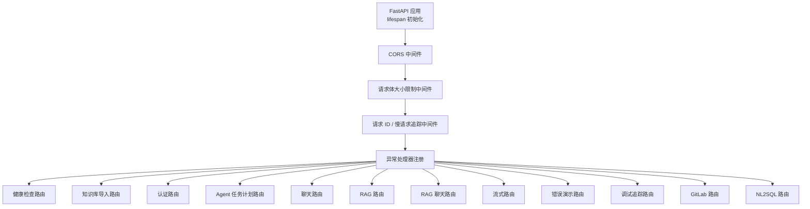
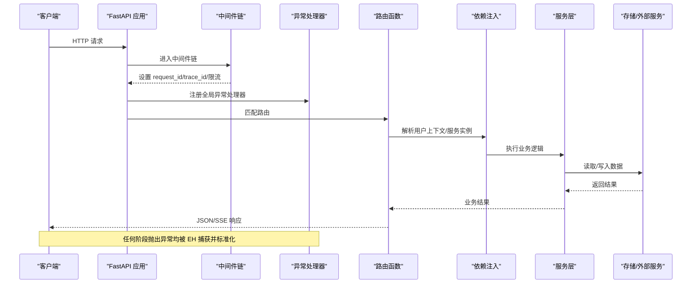
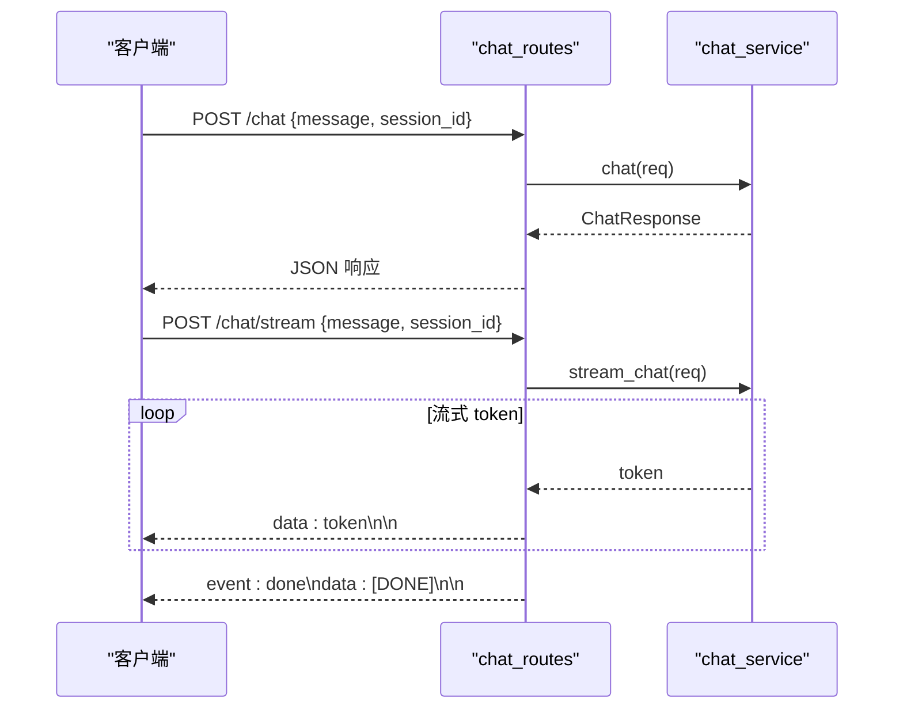
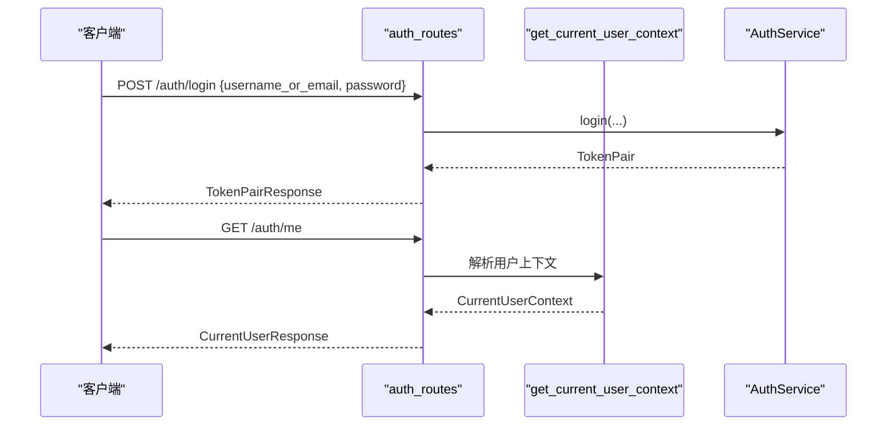
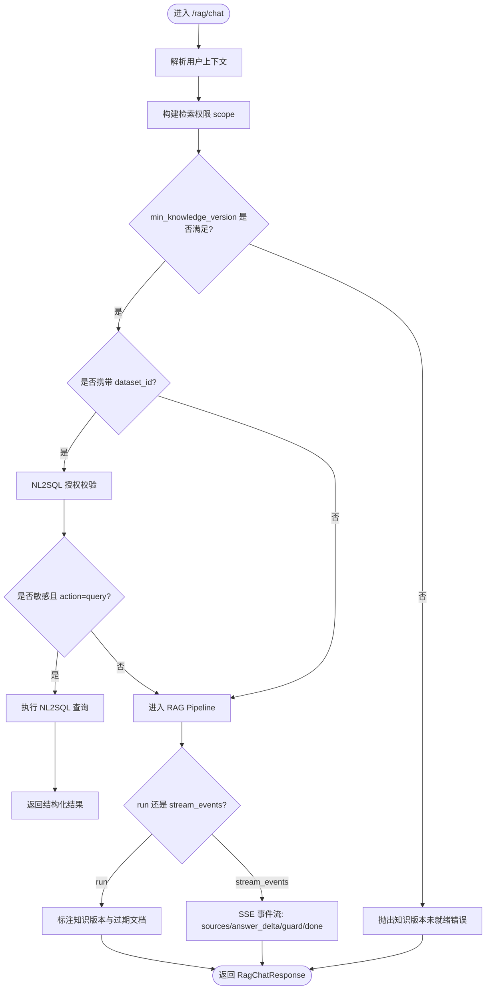
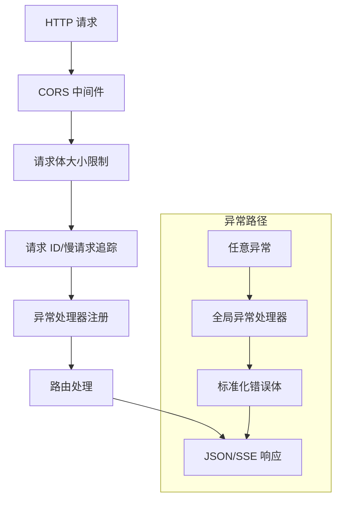
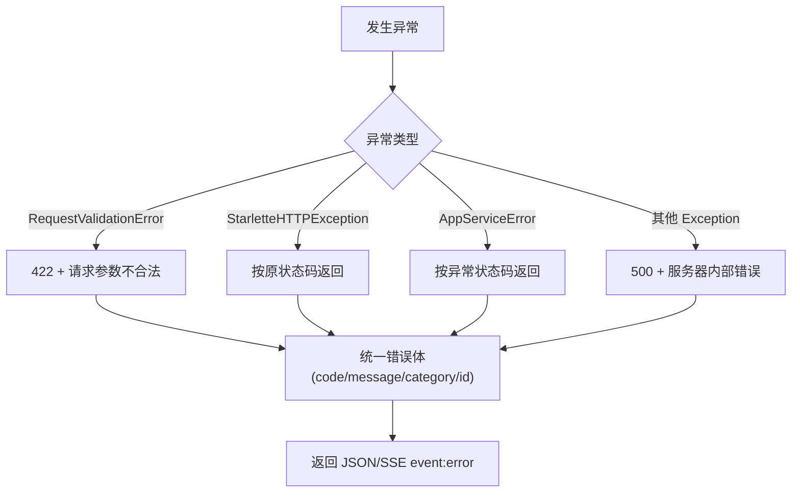
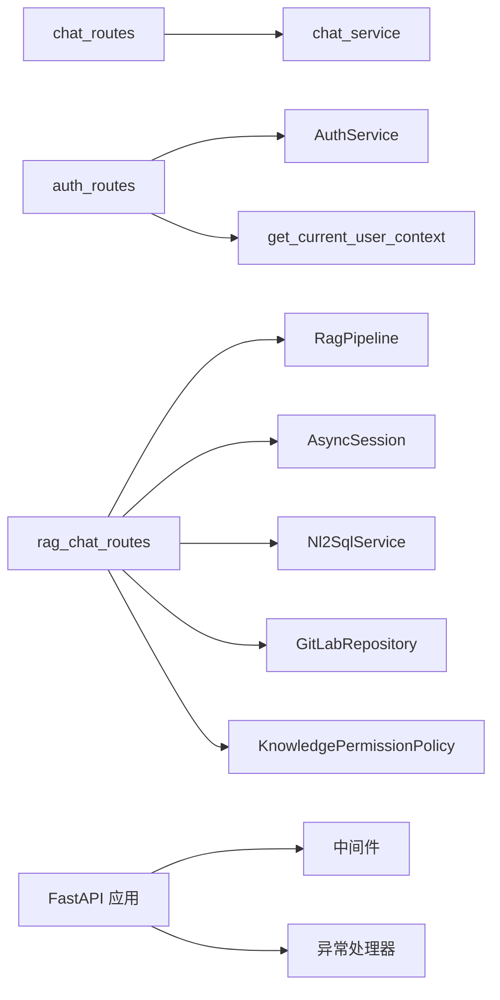

# API 层设计

<cite>
**本文引用的文件**
- [main.py](file://src/fast_app/main.py)
- [chat_routes.py](file://src/fast_app/api/chat_routes.py)
- [auth_routes.py](file://src/fast_app/api/auth_routes.py)
- [rag_chat_routes.py](file://src/fast_app/api/rag_chat_routes.py)
- [error_responses.py](file://src/fast_app/core/error_responses.py)
- [exception_handlers.py](file://src/fast_app/core/exception_handlers.py)
- [user_context.py](file://src/fast_app/dependencies/user_context.py)
- [chat_schema.py](file://src/fast_app/schemas/chat_schema.py)
- [auth_schema.py](file://src/fast_app/schemas/auth_schema.py)
- [rag_chat_schema.py](file://src/fast_app/schemas/rag_chat_schema.py)
</cite>

## 目录
1. [简介](#简介)
2. [项目结构](#项目结构)
3. [核心组件](#核心组件)
4. [架构总览](#架构总览)
5. [详细组件分析](#详细组件分析)
6. [依赖关系分析](#依赖关系分析)
7. [性能考虑](#性能考虑)
8. [故障排查指南](#故障排查指南)
9. [结论](#结论)
10. [附录](#附录)

## 简介
本文件面向 FastAPI 路由层的 API 设计，聚焦以下目标：
- 明确 RESTful 接口职责边界与模块划分（chat、auth、rag-chat 等）。
- 规范请求/响应模型定义与参数校验策略。
- 说明中间件处理流程、依赖注入机制、认证授权集成方式。
- 统一错误处理策略、状态码规范与可观测性字段。
- 提供调用时序图、数据流转图与错误处理流程图，帮助开发者快速理解并扩展接口。

## 项目结构
FastAPI 应用通过生命周期管理外部资源（向量检索、关键词检索、重排、Redis、数据库引擎等），集中注册全局中间件与异常处理器，并按功能域挂载多个路由模块。

**图表来源**
- [main.py:41-129](file://src/fast_app/main.py#L41-L129)
- [main.py:132-169](file://src/fast_app/main.py#L132-L169)

**章节来源**
- [main.py:41-129](file://src/fast_app/main.py#L41-L129)
- [main.py:132-169](file://src/fast_app/main.py#L132-L169)

## 核心组件
- 路由模块
  - chat_routes：通用聊天接口，支持同步与 SSE 流式输出。
  - auth_routes：登录、刷新令牌、当前用户信息、API Key 管理。
  - rag_chat_routes：RAG 聊天接口，包含非流式、兼容旧版流式、结构化事件流式三种模式，并集成 NL2SQL 直查分支与知识版本控制。
- 请求/响应模型
  - chat_schema：ChatRequest/ChatResponse 定义，含字段长度与空白校验。
  - auth_schema：登录/刷新/用户上下文/API Key 相关模型。
  - rag_chat_schema：RagChatRequest/RagChatResponse，含检索模式、过滤条件、NL2SQL 动作绑定、知识版本与过期文档检测。
- 认证与上下文
  - user_context：统一解析 X-API-Key、Authorization Bearer、演示头，返回 CurrentUserContext。
- 错误处理
  - error_responses：统一错误内容构建（业务错误、系统错误、HTTP 错误）。
  - exception_handlers：注册全局异常处理器，将不同异常映射为统一 JSON 格式与状态码。

**章节来源**
- [chat_routes.py:1-32](file://src/fast_app/api/chat_routes.py#L1-L32)
- [auth_routes.py:1-112](file://src/fast_app/api/auth_routes.py#L1-L112)
- [rag_chat_routes.py:1-373](file://src/fast_app/api/rag_chat_routes.py#L1-L373)
- [chat_schema.py:1-41](file://src/fast_app/schemas/chat_schema.py#L1-L41)
- [auth_schema.py:1-123](file://src/fast_app/schemas/auth_schema.py#L1-L123)
- [rag_chat_schema.py:1-268](file://src/fast_app/schemas/rag_chat_schema.py#L1-L268)
- [user_context.py:1-149](file://src/fast_app/dependencies/user_context.py#L1-L149)
- [error_responses.py:1-64](file://src/fast_app/core/error_responses.py#L1-L64)
- [exception_handlers.py:1-153](file://src/fast_app/core/exception_handlers.py#L1-L153)

## 架构总览
整体请求链路遵循“中间件 -> 异常处理器 -> 路由 -> 依赖注入 -> 服务层”的分层模式。认证在依赖注入阶段完成，RAG 路由在入口处进行权限 scope 注入与知识版本校验，随后进入 RAG Pipeline 或 NL2SQL 子路径。

**图表来源**
- [main.py:138-156](file://src/fast_app/main.py#L138-L156)
- [exception_handlers.py:26-153](file://src/fast_app/core/exception_handlers.py#L26-L153)
- [user_context.py:16-62](file://src/fast_app/dependencies/user_context.py#L16-L62)
- [rag_chat_routes.py:47-156](file://src/fast_app/api/rag_chat_routes.py#L47-L156)

## 详细组件分析

### 聊天路由（chat_routes）
- 职责边界
  - 提供基础聊天能力，不感知 RAG/NL2SQL 细节。
  - 同步接口直接返回完整回答；SSE 接口以 text/event-stream 推送 token 流并在结束时发送 done 事件。
- 请求/响应模型
  - ChatRequest：message 必填且非空白，session_id 可选，stream 开关控制流式。
  - ChatResponse：answer 与 session_id。
- 关键流程
  - POST /chat：调用服务层 chat，返回结构化响应。
  - POST /chat/stream：生成器逐 token 封装为 SSE 事件，最后发送 done。

**图表来源**
- [chat_routes.py:13-32](file://src/fast_app/api/chat_routes.py#L13-L32)
- [chat_schema.py:4-41](file://src/fast_app/schemas/chat_schema.py#L4-L41)

**章节来源**
- [chat_routes.py:1-32](file://src/fast_app/api/chat_routes.py#L1-L32)
- [chat_schema.py:1-41](file://src/fast_app/schemas/chat_schema.py#L1-L41)

### 认证路由（auth_routes）
- 职责边界
  - 提供登录、刷新令牌、当前用户信息、API Key 创建/列表/撤销。
  - 所有需要身份的操作通过依赖注入获取 CurrentUserContext。
- 请求/响应模型
  - LoginRequest/RefreshTokenRequest/TokenPairResponse：登录与刷新凭证。
  - CurrentUserResponse：当前用户上下文摘要。
  - CreateApiKeyRequest/Response、ApiKeySummary、RevokeApiKeyResponse：API Key 全生命周期。
- 关键流程
  - POST /auth/login：用户名/邮箱+密码换取 access_token 与 refresh_token。
  - POST /auth/refresh：使用 refresh_token 轮换新 token pair。
  - GET /auth/me：返回当前用户上下文。
  - POST /auth/api-keys：创建 API Key（仅本次返回明文 key）。
  - GET /auth/api-keys：列出当前用户的 API Key 摘要。
  - DELETE /auth/api-keys/{api_key_id}：撤销指定 API Key。

**图表来源**
- [auth_routes.py:22-53](file://src/fast_app/api/auth_routes.py#L22-L53)
- [user_context.py:16-62](file://src/fast_app/dependencies/user_context.py#L16-L62)
- [auth_schema.py:8-63](file://src/fast_app/schemas/auth_schema.py#L8-L63)

**章节来源**
- [auth_routes.py:1-112](file://src/fast_app/api/auth_routes.py#L1-L112)
- [auth_schema.py:1-123](file://src/fast_app/schemas/auth_schema.py#L1-L123)
- [user_context.py:1-149](file://src/fast_app/dependencies/user_context.py#L1-L149)

### RAG 聊天路由（rag_chat_routes）
- 职责边界
  - 提供三类接口：
    - 非流式：POST /rag/chat，返回最终回答与来源。
    - 兼容旧版流式：POST /rag/chat/stream（已废弃），token-only SSE。
    - 结构化事件流式：POST /rag/chat/stream/events，sources/answer_delta/guard_sanitized/guard_blocked/done 等事件。
  - 入口集成：
    - 用户上下文注入与权限 scope 构建。
    - 知识版本校验与过期文档检测。
    - NL2SQL 敏感数据集直查分支。
- 请求/响应模型
  - RagChatRequest：query、mode、top_k、min_score、candidate_k、filters、allow_web_*、min_knowledge_version、dataset_id/nl2sql_action 绑定校验。
  - RagChatResponse：request_id/trace_id/knowledge_version/stale/stale_doc_ids/query/answer/sources/route_* 等。
- 关键流程
  - 非流式：prepare_authorized_rag_request -> pipeline.run -> annotate_rag_response_version -> 返回。
  - 旧版流式：pipeline.stream -> token-only SSE -> done。
  - 结构化流式：pipeline.stream_events -> sources/answer_delta/guard_* -> done（含 stale 检测）。
  - NL2SQL 直查：authorize_action -> query -> SSE 事件 nl2sql_sql_generated/nl2sql_result/done。

**图表来源**
- [rag_chat_routes.py:47-156](file://src/fast_app/api/rag_chat_routes.py#L47-L156)
- [rag_chat_routes.py:186-311](file://src/fast_app/api/rag_chat_routes.py#L186-L311)
- [rag_chat_routes.py:336-373](file://src/fast_app/api/rag_chat_routes.py#L336-L373)
- [rag_chat_schema.py:17-134](file://src/fast_app/schemas/rag_chat_schema.py#L17-L134)

**章节来源**
- [rag_chat_routes.py:1-373](file://src/fast_app/api/rag_chat_routes.py#L1-L373)
- [rag_chat_schema.py:1-268](file://src/fast_app/schemas/rag_chat_schema.py#L1-L268)

### 中间件处理流程
- CORS 中间件：允许跨域与暴露 request_id 头。
- 请求体大小限制：限制普通请求与上传请求的 body 大小。
- 请求 ID 中间件：注入 request_id/trace_id，记录慢请求阈值。
- 异常处理器：统一捕获验证错误、HTTP 异常、业务异常与未知异常，输出标准错误体。

**图表来源**
- [main.py:138-156](file://src/fast_app/main.py#L138-L156)
- [exception_handlers.py:26-153](file://src/fast_app/core/exception_handlers.py#L26-L153)

**章节来源**
- [main.py:138-156](file://src/fast_app/main.py#L138-L156)
- [exception_handlers.py:1-153](file://src/fast_app/core/exception_handlers.py#L1-L153)

### 依赖注入机制与参数验证
- 依赖注入
  - get_current_user_context：从请求头解析 X-API-Key 或 Authorization Bearer，必要时回退到演示头或匿名用户。
  - get_rag_pipeline/get_db_session/get_nl2sql_service：由各自依赖模块提供，路由通过 Depends 声明式注入。
- 参数验证
  - Pydantic 模型强制 extra="forbid"，避免隐藏拼写错误。
  - field_validator/model_validator 对关键字段进行规范化与约束校验（如 message/query/session_id 空白校验、nl2sql_action 与 dataset_id 绑定校验）。
  - 类型与范围约束（如 top_k、min_score、candidate_k、knowledge_version）。

**章节来源**
- [user_context.py:16-62](file://src/fast_app/dependencies/user_context.py#L16-L62)
- [chat_schema.py:4-41](file://src/fast_app/schemas/chat_schema.py#L4-L41)
- [rag_chat_schema.py:17-134](file://src/fast_app/schemas/rag_chat_schema.py#L17-L134)

### 错误处理策略与状态码规范
- 分类与映射
  - 请求参数不合法：422，错误码 REQUEST_VALIDATION_ERROR，类别 user_error。
  - HTTP 异常：按原状态码返回，错误码 HTTP_{status_code}，类别根据 <500 判定。
  - 业务异常（AppServiceError）：按异常内置 status_code 返回，错误码与类别来自异常对象。
  - 未知异常：500，错误码 INTERNAL_SERVER_ERROR，类别 system_error。
- 统一错误体
  - code/message/error_category/request_id/trace_id 五元组，便于追踪与前端统一处理。
- 流式错误
  - SSE 流中通过 event:error 推送标准化错误体，保证前端可区分正常结束与异常结束。

**图表来源**
- [exception_handlers.py:26-153](file://src/fast_app/core/exception_handlers.py#L26-L153)
- [error_responses.py:7-64](file://src/fast_app/core/error_responses.py#L7-L64)
- [rag_chat_routes.py:170-181](file://src/fast_app/api/rag_chat_routes.py#L170-L181)

**章节来源**
- [exception_handlers.py:1-153](file://src/fast_app/core/exception_handlers.py#L1-L153)
- [error_responses.py:1-64](file://src/fast_app/core/error_responses.py#L1-L64)
- [rag_chat_routes.py:160-181](file://src/fast_app/api/rag_chat_routes.py#L160-L181)

### 认证授权集成
- 认证来源优先级
  - X-API-Key：优先校验 API Key 并返回用户上下文。
  - Authorization: Bearer：解析并校验 JWT，失败则继续后续分支。
  - X-Demo-User-Id：仅在配置允许时作为演示用户，is_authenticated=False。
  - 若启用认证且无有效凭据：抛出认证错误。
- 授权与权限范围
  - RAG 路由在入口处构建 RetrievalPermissionScope，限制知识库检索范围。
  - NL2SQL 敏感数据集在入口进行 authorize_action，必要时走直查分支。

**章节来源**
- [user_context.py:16-62](file://src/fast_app/dependencies/user_context.py#L16-L62)
- [rag_chat_routes.py:47-156](file://src/fast_app/api/rag_chat_routes.py#L47-L156)

## 依赖关系分析
- 路由与依赖
  - chat_routes 依赖 chat_service，无复杂依赖。
  - auth_routes 依赖 AuthService 与用户上下文依赖。
  - rag_chat_routes 依赖 RagPipeline、AsyncSession、Nl2SqlService、GitLabRepository、KnowledgePermissionPolicy。
- 外部资源
  - Milvus/Elasticsearch/httpx/Redis/PostgreSQL 在 lifespan 中创建并在关闭时释放。
- 耦合与内聚
  - 路由层保持薄，主要做参数校验、依赖注入、流程编排与日志埋点。
  - 业务逻辑下沉至 services 层，提高内聚性与可测试性。

**图表来源**
- [main.py:132-169](file://src/fast_app/main.py#L132-L169)
- [rag_chat_routes.py:47-156](file://src/fast_app/api/rag_chat_routes.py#L47-L156)
- [auth_routes.py:1-112](file://src/fast_app/api/auth_routes.py#L1-L112)
- [chat_routes.py:1-32](file://src/fast_app/api/chat_routes.py#L1-L32)

**章节来源**
- [main.py:132-169](file://src/fast_app/main.py#L132-L169)
- [rag_chat_routes.py:1-373](file://src/fast_app/api/rag_chat_routes.py#L1-L373)
- [auth_routes.py:1-112](file://src/fast_app/api/auth_routes.py#L1-L112)
- [chat_routes.py:1-32](file://src/fast_app/api/chat_routes.py#L1-L32)

## 性能考虑
- 流式输出
  - 使用异步生成器与 StreamingResponse，降低首字节延迟，提升用户体验。
  - 结构化事件流支持细粒度事件（sources/answer_delta/guard_*），便于前端增量渲染。
- 资源复用
  - 外部客户端（Milvus/Elasticsearch/httpx/Redis）在 lifespan 中创建并复用，减少连接开销。
- 限流与监控
  - 请求体大小限制防止恶意大请求。
  - 慢请求阈值与 request_id/trace_id 便于性能分析与问题定位。
- 缓存与降级
  - 可通过 Redis 短期会话记忆与 fallback 策略优化高并发场景（具体实现位于服务层）。

[本节为通用指导，不直接分析具体文件]

## 故障排查指南
- 常见问题定位
  - 422 参数校验失败：检查 Pydantic 模型约束与字段命名，确认未传入额外字段。
  - 401/403 认证失败：确认 X-API-Key 或 Authorization: Bearer 是否正确传递，检查认证配置。
  - 500 内部错误：查看日志中的 trace_id，结合异常处理器输出的错误体定位。
- 日志与追踪
  - 利用 format_log_fields 与 request_id/trace_id 串联请求链路。
  - RAG 路由在开始与结束处记录关键指标（用户、会话、查询、耗时、来源数量等）。
- 流式错误处理
  - 前端需监听 event:error 并展示标准化错误信息，同时处理 done 事件判断正常结束。

**章节来源**
- [exception_handlers.py:26-153](file://src/fast_app/core/exception_handlers.py#L26-L153)
- [rag_chat_routes.py:89-154](file://src/fast_app/api/rag_chat_routes.py#L89-L154)
- [error_responses.py:7-64](file://src/fast_app/core/error_responses.py#L7-L64)

## 结论
本 API 层设计以 FastAPI 为核心，采用清晰的路由分层、严格的参数校验、统一的错误处理与完善的可观测性。通过依赖注入解耦路由与服务层，结合中间件保障安全与性能。RAG 路由在入口处完成权限与版本控制，并提供多种流式模式以满足不同客户端需求。该设计具备良好的可扩展性，便于新增业务路由与能力增强。

## 附录
- 最佳实践建议
  - 路由函数保持简洁，只做参数校验、依赖注入与流程编排。
  - 使用 Pydantic 模型进行强类型约束，避免隐式错误。
  - 统一错误体与状态码，便于前端一致处理。
  - 在关键路径记录结构化日志，确保可追踪与可观测。
  - 流式接口务必处理异常事件与结束事件，保证前端健壮性。

[本节为通用指导，不直接分析具体文件]