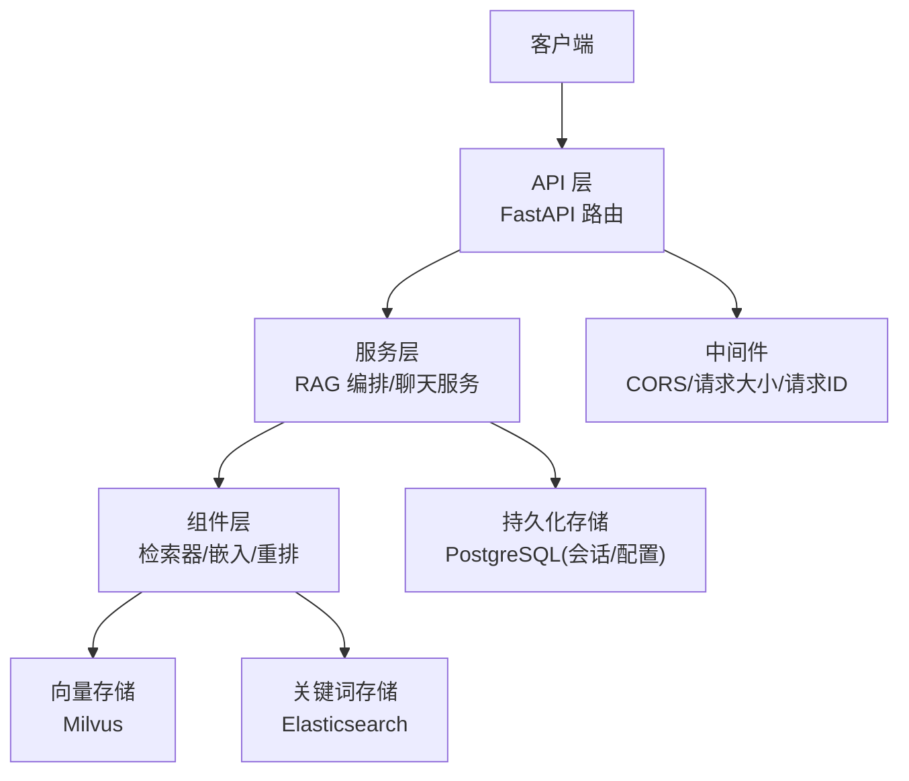
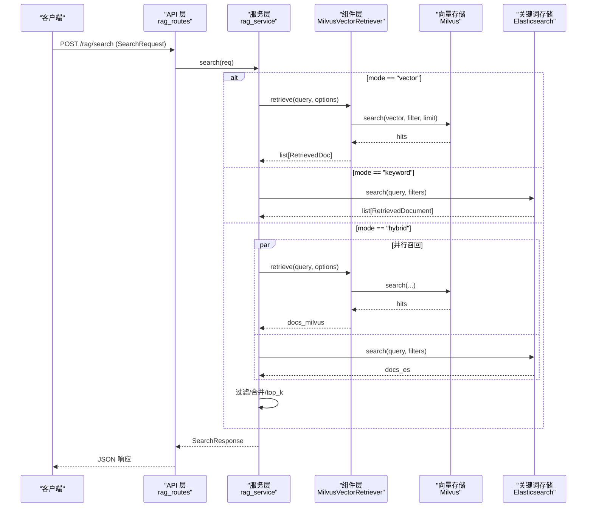
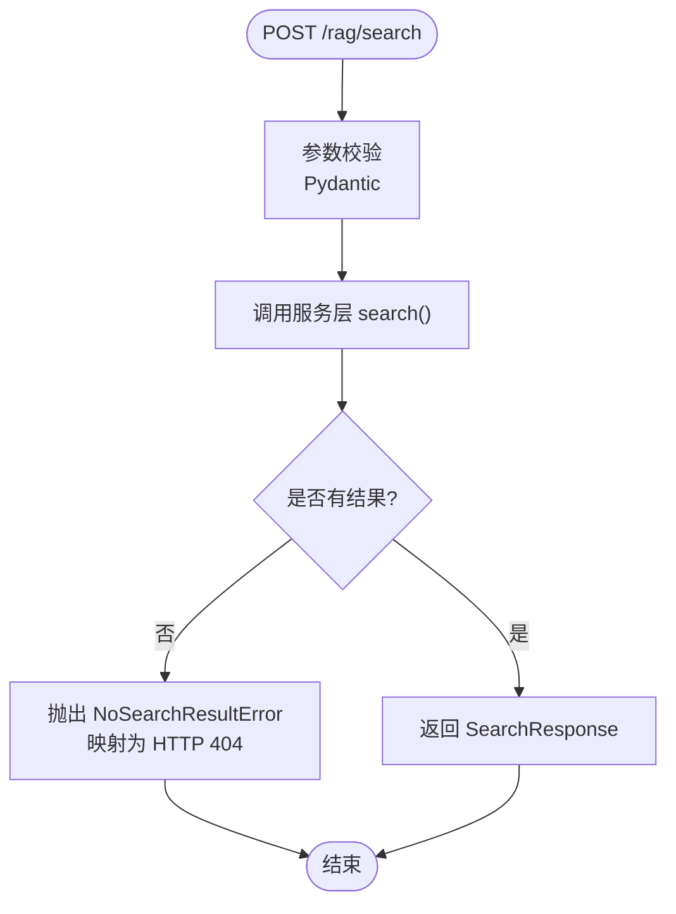
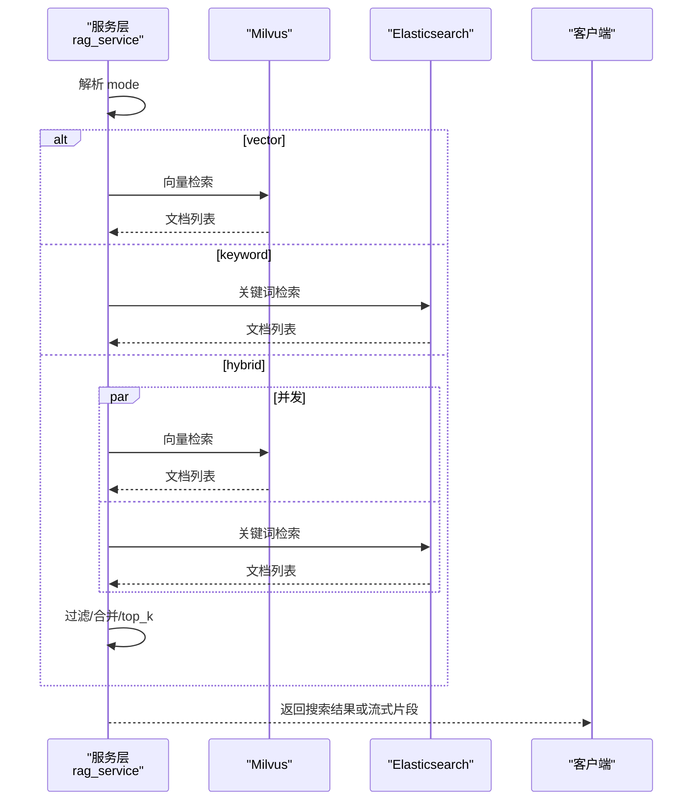
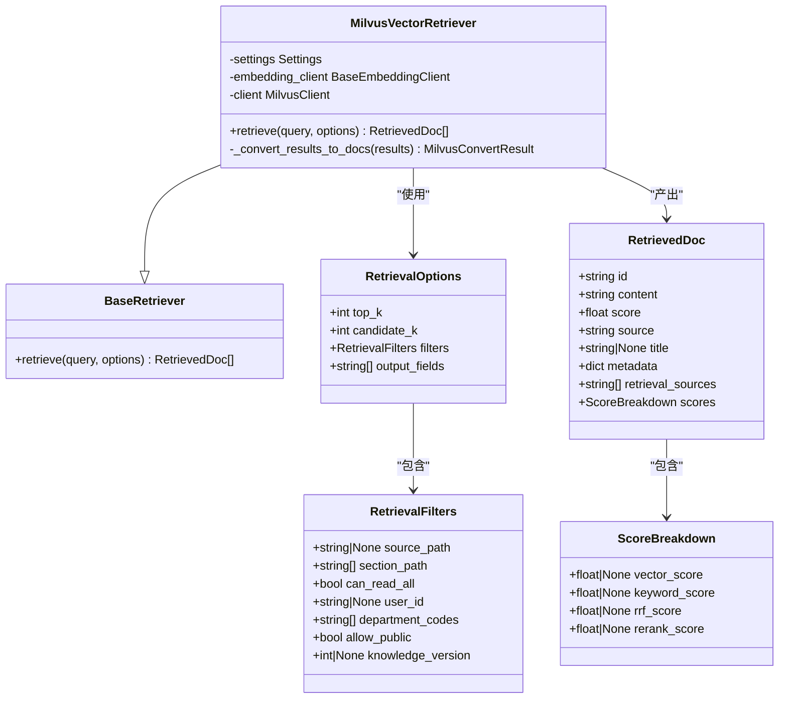
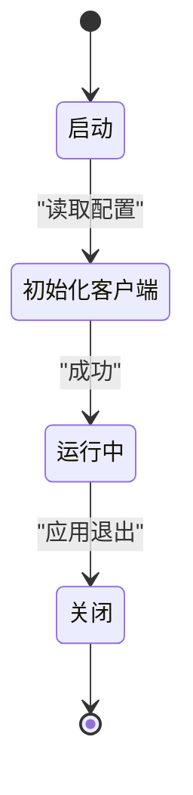
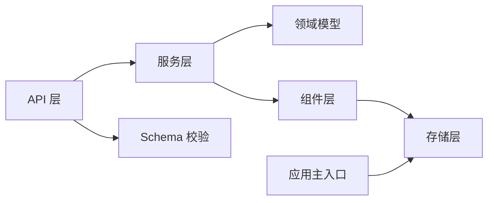

# 分层架构设计

<cite>
**本文引用的文件**
- [src/fast_app/main.py](file://src/fast_app/main.py)
- [src/fast_app/api/rag_routes.py](file://src/fast_app/api/rag_routes.py)
- [src/fast_app/services/chat_service.py](file://src/fast_app/services/chat_service.py)
- [src/fast_app/services/rag/rag_service.py](file://src/fast_app/services/rag/rag_service.py)
- [src/fast_app/domain/rag_models.py](file://src/fast_app/domain/rag_models.py)
- [src/fast_app/components/retrievers/base.py](file://src/fast_app/components/retrievers/base.py)
- [src/fast_app/components/retrievers/milvus_vector_retriever.py](file://src/fast_app/components/retrievers/milvus_vector_retriever.py)
- [src/fast_app/db/session.py](file://src/fast_app/db/session.py)
- [src/fast_app/core/config.py](file://src/fast_app/core/config.py)
- [src/fast_app/schemas/rag_schema.py](file://src/fast_app/schemas/rag_schema.py)
</cite>

## 目录
1. [简介](#简介)
2. [项目结构](#项目结构)
3. [核心组件](#核心组件)
4. [架构总览](#架构总览)
5. [详细组件分析](#详细组件分析)
6. [依赖关系分析](#依赖关系分析)
7. [性能考虑](#性能考虑)
8. [故障排查指南](#故障排查指南)
9. [结论](#结论)
10. [附录：扩展与最佳实践](#附录：扩展与最佳实践)

## 简介
本文件面向开发者，系统化阐述该项目的分层架构设计与实现要点。围绕 API 层、服务层、组件层、存储层四大层次，明确每层的职责边界、输入输出契约、错误处理策略、性能考量，以及层间依赖和数据流向（同步与异步）。同时说明如何通过依赖注入实现松耦合，并提供类图、时序图和状态转换图等可视化表达，帮助快速理解并安全扩展系统。

## 项目结构
本项目采用 FastAPI 作为 Web 框架，按“API 路由 -> 服务编排 -> 组件能力 -> 外部存储”的分层组织代码：
- API 层：定义 HTTP 接口、参数校验、异常到 HTTP 状态的映射、流式响应封装。
- 服务层：编排检索流程、合并结果、流式生成答案、调用下游组件或模拟后端。
- 组件层：抽象检索器、嵌入客户端、重排器等可插拔能力，通过统一接口接入不同实现。
- 存储层：数据库连接池、向量库客户端、关键词检索客户端、缓存等外部资源的生命周期管理。

图表来源
- [src/fast_app/main.py:132-169](file://src/fast_app/main.py#L132-L169)
- [src/fast_app/api/rag_routes.py:11-63](file://src/fast_app/api/rag_routes.py#L11-L63)
- [src/fast_app/services/rag/rag_service.py:84-173](file://src/fast_app/services/rag/rag_service.py#L84-L173)
- [src/fast_app/components/retrievers/milvus_vector_retriever.py:155-337](file://src/fast_app/components/retrievers/milvus_vector_retriever.py#L155-L337)
- [src/fast_app/db/session.py:11-32](file://src/fast_app/db/session.py#L11-L32)

章节来源
- [src/fast_app/main.py:1-170](file://src/fast_app/main.py#L1-L170)
- [src/fast_app/api/rag_routes.py:1-63](file://src/fast_app/api/rag_routes.py#L1-L63)

## 核心组件
- API 路由
  - RAG 搜索接口：接收 SearchRequest，调用服务层 search/stream_search，将领域异常转换为 HTTP 404。
  - 文档获取接口：根据 doc_id 获取 RetrievedDocument，不存在时返回 404。
  - 流式接口：使用 SSE 逐字符推送上下文与结论。
- 服务层
  - 检索编排：支持 vector/keyword/hybrid 三种模式；混合模式下并发召回、分数过滤、按 id 去重合并、top_k 截断。
  - 流式回答：基于检索结果拼接上下文，逐字符流式输出。
  - 聊天服务：示例 Echo 同步与流式接口，演示异步等待与流式生成。
- 组件层
  - 检索器抽象：BaseRetriever 定义 retrieve(query, options) 的异步契约。
  - Milvus 向量检索器：负责 embedding 维度校验、构建过滤表达式（业务+权限）、执行搜索、结果转换、慢操作日志与异常包装。
- 存储层
  - 数据库引擎与会话工厂：创建异步 Engine 和 Session 工厂，供业务层按需使用。
  - 外部客户端生命周期：在应用 lifespan 中初始化 Milvus/Elasticsearch/httpx/Redis，并在关闭时释放。

章节来源
- [src/fast_app/api/rag_routes.py:14-63](file://src/fast_app/api/rag_routes.py#L14-L63)
- [src/fast_app/services/rag/rag_service.py:12-173](file://src/fast_app/services/rag/rag_service.py#L12-L173)
- [src/fast_app/services/chat_service.py:7-24](file://src/fast_app/services/chat_service.py#L7-L24)
- [src/fast_app/components/retrievers/base.py:6-13](file://src/fast_app/components/retrievers/base.py#L6-L13)
- [src/fast_app/components/retrievers/milvus_vector_retriever.py:155-337](file://src/fast_app/components/retrievers/milvus_vector_retriever.py#L155-L337)
- [src/fast_app/db/session.py:11-32](file://src/fast_app/db/session.py#L11-L32)
- [src/fast_app/main.py:41-129](file://src/fast_app/main.py#L41-L129)

## 架构总览
下图展示从请求进入 FastAPI 到检索、合并、流式输出的完整链路，体现 API 层与服务层、组件层、存储层的交互。

图表来源
- [src/fast_app/api/rag_routes.py:14-25](file://src/fast_app/api/rag_routes.py#L14-L25)
- [src/fast_app/services/rag/rag_service.py:84-122](file://src/fast_app/services/rag/rag_service.py#L84-L122)
- [src/fast_app/components/retrievers/milvus_vector_retriever.py:182-303](file://src/fast_app/components/retrievers/milvus_vector_retriever.py#L182-L303)

## 详细组件分析

### API 层：RAG 路由
- 职责边界
  - 解析并校验入参（由 Pydantic 完成），调用服务层函数。
  - 捕获领域异常并映射为 HTTP 状态码与结构化 detail。
  - 提供流式 SSE 响应，封装 token 事件格式。
- 输入输出契约
  - 输入：SearchRequest（query、mode、top_k、min_score）。
  - 输出：SearchResponse（query、mode、documents）或 StreamingResponse。
- 错误处理策略
  - NoSearchResultError -> HTTP 404，code=NO_SEARCH_RESULT。
  - DocumentNotFoundError -> HTTP 404，code=DOCUMENT_NOT_FOUND。
- 性能考虑
  - 流式响应降低首字节延迟；SSE 事件逐 token 推送。

图表来源
- [src/fast_app/api/rag_routes.py:14-25](file://src/fast_app/api/rag_routes.py#L14-L25)
- [src/fast_app/services/rag/rag_service.py:84-122](file://src/fast_app/services/rag/rag_service.py#L84-L122)

章节来源
- [src/fast_app/api/rag_routes.py:1-63](file://src/fast_app/api/rag_routes.py#L1-L63)
- [src/fast_app/schemas/rag_schema.py:9-60](file://src/fast_app/schemas/rag_schema.py#L9-L60)

### 服务层：RAG 编排与聊天
- 职责边界
  - 根据 mode 选择检索策略；混合模式并发召回、过滤、合并、排序。
  - 构造流式回答，按字符推送，提升用户体验。
  - 聊天服务提供同步与流式两种模式，便于测试与对比。
- 输入输出契约
  - 输入：SearchRequest（含 query、mode、top_k、min_score）。
  - 输出：SearchResponse 或 AsyncGenerator[str]（流式）。
- 错误处理策略
  - 无命中时抛出 NoSearchResultError，由 API 层转为 404。
- 性能考虑
  - 使用 asyncio.gather 并发召回，减少端到端延迟。
  - 流式输出避免一次性大响应阻塞。

图表来源
- [src/fast_app/services/rag/rag_service.py:84-122](file://src/fast_app/services/rag/rag_service.py#L84-L122)
- [src/fast_app/services/rag/rag_service.py:152-173](file://src/fast_app/services/rag/rag_service.py#L152-L173)

章节来源
- [src/fast_app/services/rag/rag_service.py:12-173](file://src/fast_app/services/rag/rag_service.py#L12-L173)
- [src/fast_app/services/chat_service.py:7-24](file://src/fast_app/services/chat_service.py#L7-L24)

### 组件层：检索器抽象与 Milvus 实现
- 职责边界
  - BaseRetriever 定义统一的异步检索接口。
  - MilvusVectorRetriever 实现向量检索全流程：embedding、维度校验、过滤表达式构建、搜索、结果转换、慢操作日志、异常包装。
- 数据模型
  - RetrievalOptions/RetrievalFilters：控制 top_k、候选数、过滤条件（来源、章节、权限、版本）。
  - RetrievedDoc/ScoreBreakdown：承载 chunk 内容、分数明细、来源信息。
- 错误处理策略
  - embedding 维度不匹配 -> ExternalServiceError。
  - 其他异常 -> 记录详细日志并包装为 ExternalServiceError。
- 性能考虑
  - 过滤下推到 Milvus 查询阶段，减少无效候选。
  - 记录慢操作阈值，便于定位瓶颈。

图表来源
- [src/fast_app/components/retrievers/base.py:6-13](file://src/fast_app/components/retrievers/base.py#L6-L13)
- [src/fast_app/components/retrievers/milvus_vector_retriever.py:155-337](file://src/fast_app/components/retrievers/milvus_vector_retriever.py#L155-L337)
- [src/fast_app/domain/rag_models.py:8-80](file://src/fast_app/domain/rag_models.py#L8-L80)

章节来源
- [src/fast_app/components/retrievers/base.py:1-13](file://src/fast_app/components/retrievers/base.py#L1-L13)
- [src/fast_app/components/retrievers/milvus_vector_retriever.py:1-410](file://src/fast_app/components/retrievers/milvus_vector_retriever.py#L1-L410)
- [src/fast_app/domain/rag_models.py:1-80](file://src/fast_app/domain/rag_models.py#L1-L80)

### 存储层：数据库与外部客户端生命周期
- 职责边界
  - 应用启动时根据配置创建并缓存外部客户端（Milvus、Elasticsearch、httpx、Redis）与数据库引擎/会话工厂。
  - 应用关闭时有序释放资源，避免连接泄漏。
- 输入输出契约
  - 输入：Settings（来自配置中心）。
  - 输出：app.state 中的客户端实例与数据库工厂。
- 错误处理策略
  - 资源创建失败应在 lifespan 中尽早暴露，便于部署前发现配置问题。
- 性能考虑
  - 复用连接池与客户端实例，减少重复创建开销。
  - 合理设置超时与重试参数，避免雪崩。

图表来源
- [src/fast_app/main.py:41-129](file://src/fast_app/main.py#L41-L129)
- [src/fast_app/db/session.py:11-32](file://src/fast_app/db/session.py#L11-L32)
- [src/fast_app/core/config.py:18-1103](file://src/fast_app/core/config.py#L18-L1103)

章节来源
- [src/fast_app/main.py:41-129](file://src/fast_app/main.py#L41-L129)
- [src/fast_app/db/session.py:1-33](file://src/fast_app/db/session.py#L1-L33)
- [src/fast_app/core/config.py:18-1103](file://src/fast_app/core/config.py#L18-L1103)

## 依赖关系分析
- 层间依赖方向
  - API 层依赖服务层与 schemas。
  - 服务层依赖 domain 模型与组件层抽象，并可访问存储层客户端。
  - 组件层依赖 domain 模型与配置，直接调用存储层 SDK。
  - 存储层仅依赖配置，不反向依赖上层。
- 关键依赖链
  - rag_routes -> rag_service -> MilvusVectorRetriever -> MilvusClient。
  - main.lifespan -> create_database_engine -> SQLAlchemy AsyncEngine/Session。
- 潜在循环依赖
  - 当前结构清晰，未见循环导入；新增组件时应保持单向依赖。

图表来源
- [src/fast_app/api/rag_routes.py:1-63](file://src/fast_app/api/rag_routes.py#L1-L63)
- [src/fast_app/services/rag/rag_service.py:1-173](file://src/fast_app/services/rag/rag_service.py#L1-L173)
- [src/fast_app/components/retrievers/milvus_vector_retriever.py:1-410](file://src/fast_app/components/retrievers/milvus_vector_retriever.py#L1-L410)
- [src/fast_app/db/session.py:1-33](file://src/fast_app/db/session.py#L1-L33)
- [src/fast_app/main.py:1-170](file://src/fast_app/main.py#L1-L170)

章节来源
- [src/fast_app/main.py:1-170](file://src/fast_app/main.py#L1-L170)
- [src/fast_app/api/rag_routes.py:1-63](file://src/fast_app/api/rag_routes.py#L1-L63)
- [src/fast_app/services/rag/rag_service.py:1-173](file://src/fast_app/services/rag/rag_service.py#L1-L173)
- [src/fast_app/components/retrievers/milvus_vector_retriever.py:1-410](file://src/fast_app/components/retrievers/milvus_vector_retriever.py#L1-L410)
- [src/fast_app/db/session.py:1-33](file://src/fast_app/db/session.py#L1-L33)

## 性能考虑
- 并发与吞吐
  - 混合检索使用 asyncio.gather 并发召回，显著降低端到端延迟。
  - 流式响应逐步推送，提高首字节时间体验。
- 资源管理
  - 外部客户端与数据库连接在 lifespan 中集中创建与释放，避免重复开销。
  - 合理设置超时、重试、慢操作阈值，防止级联失败。
- 过滤下推
  - Milvus 过滤表达式在服务端构建并下推到检索阶段，减少无效候选集。
- 监控与可观测性
  - 记录 embedding 耗时、搜索耗时、命中数、跳过数、慢操作告警。
  - 可通过 LangSmith 追踪链路（可选）。

[本节为通用性能建议，无需特定文件引用]

## 故障排查指南
- 常见问题定位
  - 无搜索结果：检查 min_score、过滤条件、权限表达式是否正确；查看 NoSearchResultError 日志。
  - 向量维度不匹配：确认 embedding_dim 配置与实际模型输出一致；查看 ExternalServiceError 与日志字段。
  - 慢检索：关注 slow_retrieval_threshold_ms 告警，结合 filter_expr、output_fields、hit_count 分析瓶颈。
- 日志关键字
  - milvus.embedding.finish、milvus.search.start/finish、milvus.search.failed、milvus.hit.skipped。
- 恢复步骤
  - 调整 top_k/min_score 放宽召回。
  - 修正过滤表达式与权限范围。
  - 检查外部服务连通性与超时配置。

章节来源
- [src/fast_app/services/rag/rag_service.py:113-149](file://src/fast_app/services/rag/rag_service.py#L113-L149)
- [src/fast_app/components/retrievers/milvus_vector_retriever.py:215-337](file://src/fast_app/components/retrievers/milvus_vector_retriever.py#L215-L337)

## 结论
本项目以清晰的四层架构实现了可扩展的 RAG 能力：API 层专注契约与异常映射，服务层负责编排与流式输出，组件层提供可插拔检索能力，存储层统一管理外部资源生命周期。通过依赖注入与抽象接口，系统具备良好的解耦性与可测试性。建议在扩展新检索器或存储时，遵循现有契约与日志规范，确保可观测性与稳定性。

[本节为总结性内容，无需特定文件引用]

## 附录：扩展与最佳实践
- 新增检索器
  - 继承 BaseRetriever 并实现 retrieve 方法，返回 RetrievedDoc 列表。
  - 在 service 层按 provider 配置切换实现，保持向后兼容。
- 新增存储后端
  - 在 lifespan 中注册客户端，并通过 settings 控制启用与参数。
  - 在组件层封装适配逻辑，对外暴露统一接口。
- 错误处理
  - 统一使用领域异常与 ExternalServiceError，API 层映射为 HTTP 状态。
  - 记录结构化日志，便于追踪与告警。
- 性能优化
  - 优先使用并发与流式；过滤下推到存储侧；合理设置超时与阈值。
- 依赖注入
  - 通过 app.state 或 FastAPI dependency 注入共享客户端与配置，避免全局单例耦合。

[本节为通用指导，无需特定文件引用]