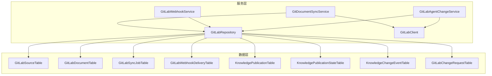
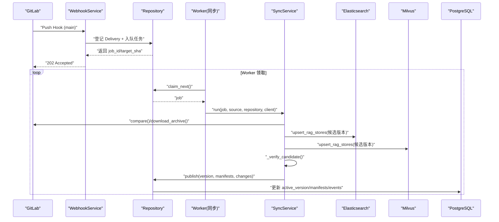
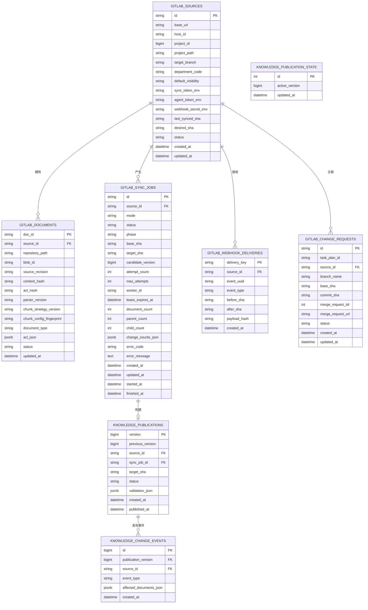
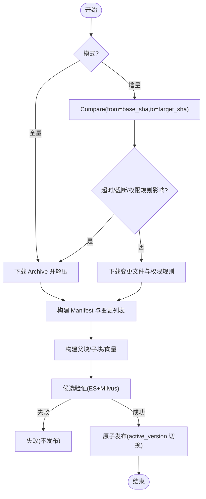
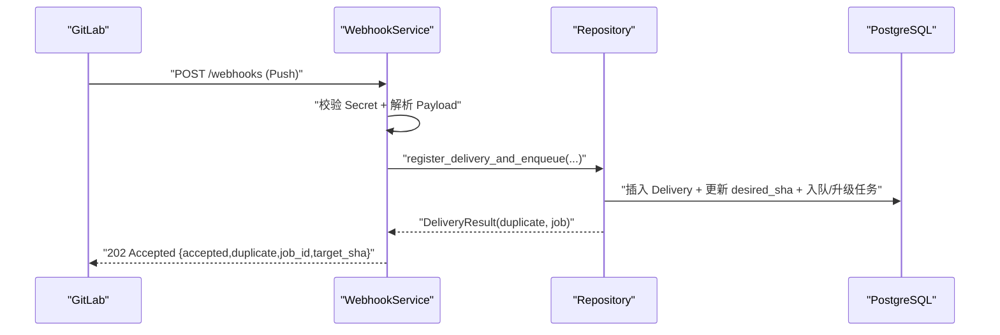
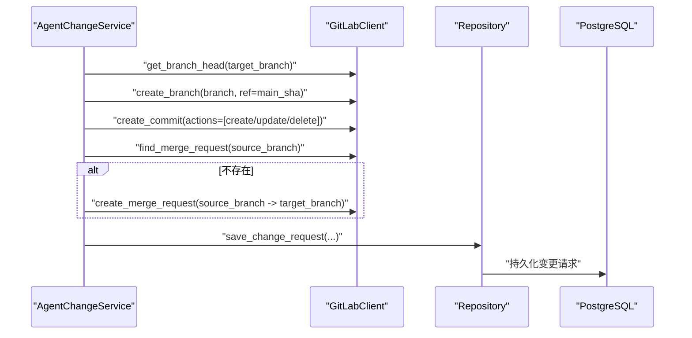
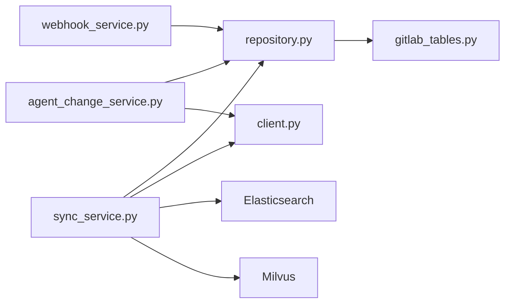

# GitLab 集成模型

<cite>
**本文引用的文件**
- [gitlab_tables.py](file://python-agent-study/src/fast_app/db/gitlab_tables.py)
- [20260726_0009_add_gitlab_enterprise_sync.py](file://python-agent-study/alembic/versions/20260726_0009_add_gitlab_enterprise_sync.py)
- [models.py](file://python-agent-study/src/fast_app/integrations/gitlab/models.py)
- [sync_service.py](file://python-agent-study/src/fast_app/integrations/gitlab/sync_service.py)
- [webhook_service.py](file://python-agent-study/src/fast_app/integrations/gitlab/webhook_service.py)
- [agent_change_service.py](file://python-agent-study/src/fast_app/integrations/gitlab/agent_change_service.py)
- [repository.py](file://python-agent-study/src/fast_app/integrations/gitlab/repository.py)
- [client.py](file://python-agent-study/src/fast_app/integrations/gitlab/client.py)
</cite>

## 目录
1. [简介](#简介)
2. [项目结构](#项目结构)
3. [核心组件](#核心组件)
4. [架构总览](#架构总览)
5. [详细组件分析](#详细组件分析)
6. [依赖关系分析](#依赖关系分析)
7. [性能与扩展性](#性能与扩展性)
8. [故障排查指南](#故障排查指南)
9. [结论](#结论)
10. [附录：数据模型与字段说明](#附录数据模型与字段说明)

## 简介
本文件面向开发者，系统化阐述 GitLab 企业集成的 SQLAlchemy 2.0 数据模型与同步机制。内容覆盖项目、仓库、文件的层级映射，Webhook 事件处理与变更追踪，增量同步优化、冲突处理、版本控制集成，以及 Merge Request 自动化流程的数据模型支持。文档同时提供扩展指南与故障排查方法，帮助在现有工程基础上安全扩展 GitLab 集成能力。

## 项目结构
GitLab 集成相关代码主要分布在以下位置：
- 数据库表定义位于数据层：src/fast_app/db/gitlab_tables.py
- 迁移脚本位于 alembic/versions/20260726_0009_add_gitlab_enterprise_sync.py
- 业务服务与编排位于 integrations/gitlab 目录：
  - sync_service.py：同步与发布编排
  - webhook_service.py：Webhook 接收与入队
  - agent_change_service.py：Agent 驱动的文档变更与 MR 创建
  - repository.py：PostgreSQL 仓储访问与并发控制
  - client.py：GitLab API v4 客户端
  - models.py：对外接口与内部数据结构（Pydantic）

图表来源
- [gitlab_tables.py:24-316](file://python-agent-study/src/fast_app/db/gitlab_tables.py#L24-L316)
- [repository.py:32-747](file://python-agent-study/src/fast_app/integrations/gitlab/repository.py#L32-L747)
- [sync_service.py:72-181](file://python-agent-study/src/fast_app/integrations/gitlab/sync_service.py#L72-L181)
- [webhook_service.py:19-88](file://python-agent-study/src/fast_app/integrations/gitlab/webhook_service.py#L19-L88)
- [agent_change_service.py:57-431](file://python-agent-study/src/fast_app/integrations/gitlab/agent_change_service.py#L57-L431)
- [client.py:20-314](file://python-agent-study/src/fast_app/integrations/gitlab/client.py#L20-L314)

章节来源
- [gitlab_tables.py:24-316](file://python-agent-study/src/fast_app/db/gitlab_tables.py#L24-L316)
- [20260726_0009_add_gitlab_enterprise_sync.py:20-170](file://python-agent-study/alembic/versions/20260726_0009_add_gitlab_enterprise_sync.py#L20-L170)

## 核心组件
- 数据模型
  - GitLabSourceTable：GitLab 企业源配置，包含 base_url、host_id、project_id、project_path、target_branch、department_code、默认可见性、令牌环境变量名、last_synced_sha、desired_sha、状态等。
  - GitLabDocumentTable：仓库内文档清单，记录 doc_id、source_id、repository_path、blob_id、source_revision、content_hash、acl_hash、解析器与分块策略版本、ACL JSON、状态。
  - GitLabSyncJobTable：同步任务，记录 mode、status、phase、base_sha、target_sha、candidate_version、重试次数、租约、统计计数、变更统计 JSON、错误信息、时间戳。
  - GitLabWebhookDeliveryTable：Webhook 投递去重与审计，记录 delivery_key、source_id、event_uuid、event_type、before_sha、after_sha、payload_hash、created_at。
  - KnowledgePublicationTable / KnowledgePublicationStateTable：知识版本发布与全局活跃版本指针。
  - KnowledgeChangeEventTable：发布后变更事件，记录 affected_documents_json 用于前端或下游消费。
  - GitLabChangeRequestTable：Agent 变更请求，记录 task_plan_id、branch_name、base_sha、commit_sha、merge_request_iid/url、状态。

- 服务与编排
  - GitDocumentSyncService：负责全量/增量准备、构建父子块与向量、候选验证、原子发布。
  - GitLabWebhookService：校验 Webhook Secret、过滤事件、登记 Delivery、合并/创建同步任务并快速返回。
  - GitLabAgentChangeService：读取文档快照、提交分支/Commit/MR，维护变更请求记录。
  - GitLabRepository：封装 PostgreSQL 事务、并发锁、任务调度、发布流程、变更事件写入。
  - GitLabClient：GitLab API v4 最小客户端，封装分页、重试、比较、归档下载、分支/提交/MR 操作。

章节来源
- [gitlab_tables.py:24-316](file://python-agent-study/src/fast_app/db/gitlab_tables.py#L24-L316)
- [sync_service.py:72-181](file://python-agent-study/src/fast_app/integrations/gitlab/sync_service.py#L72-L181)
- [webhook_service.py:19-88](file://python-agent-study/src/fast_app/integrations/gitlab/webhook_service.py#L19-L88)
- [agent_change_service.py:57-431](file://python-agent-study/src/fast_app/integrations/gitlab/agent_change_service.py#L57-L431)
- [repository.py:32-747](file://python-agent-study/src/fast_app/integrations/gitlab/repository.py#L32-L747)
- [client.py:20-314](file://python-agent-study/src/fast_app/integrations/gitlab/client.py#L20-L314)

## 架构总览
GitLab 企业集成采用“Webhook 触发 → 任务入队 → Worker 增量/全量同步 → 双库候选写入 → 候选验证 → 原子发布”的流水线。关键特性：
- 增量优先：Compare API 获取差异，必要时回退到 Archive 全量对账。
- 幂等与去重：Webhook Delivery 去重；任务按 Source 唯一活动任务；发布使用全局活跃版本行加锁。
- 版本化与可回滚：ES/Milvus 通过 valid_from_version/valid_to_version 实现多版本共存；发布仅切换指针。
- 权限与安全：ACL 与部门边界；Webhook Secret 校验；Agent Token 与 Sync Token 分离。
- 变更追踪：发布后生成 KnowledgeChangeEvent，供前端轮询或下游消费。

图表来源
- [webhook_service.py:23-78](file://python-agent-study/src/fast_app/integrations/gitlab/webhook_service.py#L23-L78)
- [repository.py:121-200](file://python-agent-study/src/fast_app/integrations/gitlab/repository.py#L121-L200)
- [sync_service.py:90-181](file://python-agent-study/src/fast_app/integrations/gitlab/sync_service.py#L90-L181)
- [repository.py:476-539](file://python-agent-study/src/fast_app/integrations/gitlab/repository.py#L476-L539)

## 详细组件分析

### 数据模型与实体关系

图表来源
- [gitlab_tables.py:24-316](file://python-agent-study/src/fast_app/db/gitlab_tables.py#L24-L316)
- [20260726_0009_add_gitlab_enterprise_sync.py:20-170](file://python-agent-study/alembic/versions/20260726_0009_add_gitlab_enterprise_sync.py#L20-L170)

章节来源
- [gitlab_tables.py:24-316](file://python-agent-study/src/fast_app/db/gitlab_tables.py#L24-L316)

### 同步流程与增量优化
- 增量路径：基于 Compare API 获取 diff，仅下载变更文件与可选权限规则；遇到 PDF、XLSX、权限规则影响范围不可信、Compare 超时/截断等情况自动回退为 Archive 全量对账。
- 全量路径：下载 Archive 并解压，扫描受支持文档类型，构建 Manifest 并与现有 Manifest 对账识别删除。
- 构建阶段：Markdown/Text/PowerPoint/Spreadsheet 分别走对应加载器与分块器；仅子块生成向量；父块用于上下文扩展。
- 候选验证：按 source_id + version 反查 ES/Milvus，校验集合一致性与关键字段一致性，失败不发布。
- 发布阶段：同一事务中应用 Manifest、更新 active_version、记录变更事件、完成 Job 统计。

图表来源
- [sync_service.py:276-408](file://python-agent-study/src/fast_app/integrations/gitlab/sync_service.py#L276-L408)
- [sync_service.py:410-532](file://python-agent-study/src/fast_app/integrations/gitlab/sync_service.py#L410-L532)
- [sync_service.py:643-796](file://python-agent-study/src/fast_app/integrations/gitlab/sync_service.py#L643-L796)
- [repository.py:476-539](file://python-agent-study/src/fast_app/integrations/gitlab/repository.py#L476-L539)

章节来源
- [sync_service.py:276-408](file://python-agent-study/src/fast_app/integrations/gitlab/sync_service.py#L276-L408)
- [sync_service.py:410-532](file://python-agent-study/src/fast_app/integrations/gitlab/sync_service.py#L410-L532)
- [sync_service.py:643-796](file://python-agent-study/src/fast_app/integrations/gitlab/sync_service.py#L643-L796)

### Webhook 事件处理与变更追踪
- 校验：HMAC Secret 校验，拒绝非法 Payload。
- 过滤：仅接受 push 事件、目标 Project、正式分支 refs/heads/{target_branch}，且非删除分支。
- 去重：使用 event_uuid 或稳定键（project_id:before:after:payload_hash）作为 delivery_key，避免重复入队。
- 入队：登记 Delivery 并更新 desired_sha；若已有活动任务则推进 target_sha，必要时升级为 full。
- 发布事件：发布成功后写入 KnowledgeChangeEvent，包含 affected_documents_json，供前端轮询。

图表来源
- [webhook_service.py:23-78](file://python-agent-study/src/fast_app/integrations/gitlab/webhook_service.py#L23-L78)
- [repository.py:121-200](file://python-agent-study/src/fast_app/integrations/gitlab/repository.py#L121-L200)

章节来源
- [webhook_service.py:23-78](file://python-agent-study/src/fast_app/integrations/gitlab/webhook_service.py#L23-L78)
- [repository.py:121-200](file://python-agent-study/src/fast_app/integrations/gitlab/repository.py#L121-L200)

### Merge Request 自动化流程的数据模型支持
- 变更请求模型：GitLabChangeRequestTable 记录 task_plan_id、branch_name、base_sha、commit_sha、merge_request_iid/url、状态。
- Agent 流程：
  - 读取当前 main 分支 HEAD 作为基线 SHA。
  - 创建临时分支（命名规范含 task_plan_id 与部门后缀），从 main 基线创建。
  - 构建 Commit Actions（create/update/delete），调用 GitLab Client 提交。
  - 查找或创建 MR，目标分支固定为配置的 target_branch（通常为 main）。
  - 保存变更请求记录，防止重复提交。
- 安全与冲突：
  - update/delete 时携带 last_commit_id，GitLab 再次校验最后提交 SHA，结合内容 hash 防止覆盖新内容。
  - 同一 MR 不允许重复修改同一文档。

图表来源
- [agent_change_service.py:169-263](file://python-agent-study/src/fast_app/integrations/gitlab/agent_change_service.py#L169-L263)
- [client.py:183-250](file://python-agent-study/src/fast_app/integrations/gitlab/client.py#L183-L250)
- [repository.py:700-735](file://python-agent-study/src/fast_app/integrations/gitlab/repository.py#L700-L735)

章节来源
- [agent_change_service.py:169-263](file://python-agent-study/src/fast_app/integrations/gitlab/agent_change_service.py#L169-L263)
- [client.py:183-250](file://python-agent-study/src/fast_app/integrations/gitlab/client.py#L183-L250)
- [repository.py:700-735](file://python-agent-study/src/fast_app/integrations/gitlab/repository.py#L700-L735)

### 版本控制集成与发布
- 候选版本：每个同步任务可构建一个候选版本，写入 ES/Milvus 时使用 valid_from_version 标记。
- 候选验证：严格校验 ES/Milvus 中的记录集合与关键字段一致性，确保父子引用正确。
- 原子发布：在同一事务中应用 Manifest、切换 active_version、记录变更事件、完成 Job 统计。
- Bootstrap：首次联合初始化多个 Source，统一发布第一个版本。

章节来源
- [sync_service.py:90-181](file://python-agent-study/src/fast_app/integrations/gitlab/sync_service.py#L90-L181)
- [repository.py:401-539](file://python-agent-study/src/fast_app/integrations/gitlab/repository.py#L401-L539)

## 依赖关系分析
- 模块耦合
  - sync_service.py 依赖 repository.py、client.py、ingestion 处理链、embedding 客户端、ES/Milvus 客户端。
  - webhook_service.py 依赖 repository.py、models.py、配置与异常。
  - agent_change_service.py 依赖 repository.py、client.py、domain 模型与用户上下文。
  - repository.py 直接依赖 gitlab_tables.py 所有表。
  - client.py 仅关注协议与重试，无业务耦合。
- 外部依赖
  - GitLab API v4：项目、分支、文件、归档、比较、MR 等。
  - Elasticsearch：父子块索引与检索。
  - Milvus：向量存储与检索。
  - PostgreSQL：主数据存储与事务一致性。

图表来源
- [sync_service.py:72-181](file://python-agent-study/src/fast_app/integrations/gitlab/sync_service.py#L72-L181)
- [webhook_service.py:19-88](file://python-agent-study/src/fast_app/integrations/gitlab/webhook_service.py#L19-L88)
- [agent_change_service.py:57-431](file://python-agent-study/src/fast_app/integrations/gitlab/agent_change_service.py#L57-L431)
- [repository.py:32-747](file://python-agent-study/src/fast_app/integrations/gitlab/repository.py#L32-L747)
- [client.py:20-314](file://python-agent-study/src/fast_app/integrations/gitlab/client.py#L20-L314)
- [gitlab_tables.py:24-316](file://python-agent-study/src/fast_app/db/gitlab_tables.py#L24-L316)

章节来源
- [sync_service.py:72-181](file://python-agent-study/src/fast_app/integrations/gitlab/sync_service.py#L72-L181)
- [repository.py:32-747](file://python-agent-study/src/fast_app/integrations/gitlab/repository.py#L32-L747)

## 性能与扩展性
- 增量优先与回退策略
  - 使用 Compare API 减少下载与解析开销；遇到超限、PDF、XLSX、权限规则影响范围不可信等情况自动回退全量。
- 并发与可靠性
  - 任务领取使用 with_for_update(skip_locked=True)，保证多 Worker 安全。
  - 租约机制防止 Worker 崩溃导致任务永久占用。
  - 发布使用全局活跃版本行加锁，避免并发发布冲突。
- 存储与检索
  - ES 父子块用于命中后扩展上下文；Milvus 仅存子块向量，避免重复召回。
  - 候选验证确保 ES/Milvus 数据一致后再切换指针。
- 扩展建议
  - 新增文档类型：在 sync_service._build_artifacts 中添加加载器与分块器；在 project_source 中声明支持类型与策略。
  - 新增权限规则：在 _prepare_incremental/_prepare_paths 中处理 .permission-rules.json 与 Sidecar 影响范围。
  - 新增 Webhook 事件：在 webhook_service.accept 中扩展过滤逻辑与入队策略。
  - 新增发布钩子：在 repository.publish/publish_bootstrap 中追加审计或通知。

[本节为通用指导，不直接分析具体文件]

## 故障排查指南
- Webhook 未触发同步
  - 检查 Secret 是否匹配；确认事件类型为 push、目标 Project 与分支正确；查看 Delivery 是否被判定为重复。
  - 参考：[webhook_service.py:23-78](file://python-agent-study/src/fast_app/integrations/gitlab/webhook_service.py#L23-L78)、[repository.py:121-200](file://python-agent-study/src/fast_app/integrations/gitlab/repository.py#L121-L200)
- 同步任务卡住或重复执行
  - 检查任务状态与租约过期时间；确认 Worker 心跳是否正常；查看是否有活动任务正在运行。
  - 参考：[repository.py:202-264](file://python-agent-study/src/fast_app/integrations/gitlab/repository.py#L202-L264)
- 增量同步结果不正确
  - 检查 Compare 是否超时/截断；确认是否因权限规则或 XLSX 触发回退全量；核对变更统计与 Manifest。
  - 参考：[sync_service.py:331-408](file://python-agent-study/src/fast_app/integrations/gitlab/sync_service.py#L331-L408)
- 发布失败或版本不一致
  - 查看候选验证日志；确认 ES/Milvus 记录集合与关键字段一致；检查 active_version 是否被其他任务抢占。
  - 参考：[sync_service.py:643-796](file://python-agent-study/src/fast_app/integrations/gitlab/sync_service.py#L643-L796)、[repository.py:476-539](file://python-agent-study/src/fast_app/integrations/gitlab/repository.py#L476-L539)
- Agent 变更冲突
  - 检查 last_commit_id 与内容 hash；确认 main 未被人工修改；查看 MR 状态与分支是否存在。
  - 参考：[agent_change_service.py:266-320](file://python-agent-study/src/fast_app/integrations/gitlab/agent_change_service.py#L266-L320)

章节来源
- [webhook_service.py:23-78](file://python-agent-study/src/fast_app/integrations/gitlab/webhook_service.py#L23-L78)
- [repository.py:121-200](file://python-agent-study/src/fast_app/integrations/gitlab/repository.py#L121-L200)
- [repository.py:202-264](file://python-agent-study/src/fast_app/integrations/gitlab/repository.py#L202-L264)
- [sync_service.py:331-408](file://python-agent-study/src/fast_app/integrations/gitlab/sync_service.py#L331-L408)
- [sync_service.py:643-796](file://python-agent-study/src/fast_app/integrations/gitlab/sync_service.py#L643-L796)
- [agent_change_service.py:266-320](file://python-agent-study/src/fast_app/integrations/gitlab/agent_change_service.py#L266-L320)

## 结论
该 GitLab 企业集成以 SQLAlchemy 2.0 模型为基础，构建了稳健的同步与发布流水线。通过增量优先、候选验证与原子发布，系统在大规模仓库与高并发场景下具备良好的一致性与可用性。Webhook 去重与变更事件机制保障了实时性与可观测性；Agent 驱动的 MR 流程实现了安全的自动化变更。建议在扩展新功能时遵循现有并发与版本化约定，确保系统稳定性。

[本节为总结，不直接分析具体文件]

## 附录：数据模型与字段说明
- GitLabSourceTable
  - 关键字段：base_url、host_id、project_id、project_path、target_branch、department_code、default_visibility、sync_token_env、agent_token_env、webhook_secret_env、last_synced_sha、desired_sha、status。
  - 用途：描述 GitLab 企业源、目标分支、部门边界、令牌环境变量与同步状态。
- GitLabDocumentTable
  - 关键字段：doc_id、source_id、repository_path、blob_id、source_revision、content_hash、acl_hash、parser_version、chunk_strategy_version、chunk_config_fingerprint、document_type、acl_json、status。
  - 用途：记录仓库内文档清单与元数据，用于 Manifest 对账与权限控制。
- GitLabSyncJobTable
  - 关键字段：mode、status、phase、base_sha、target_sha、candidate_version、attempt_count、max_attempts、worker_id、lease_expires_at、document_count、parent_count、child_count、change_counts_json、error_code、error_message。
  - 用途：跟踪同步任务生命周期、重试与统计。
- GitLabWebhookDeliveryTable
  - 关键字段：delivery_key、source_id、event_uuid、event_type、before_sha、after_sha、payload_hash。
  - 用途：Webhook 投递去重与审计。
- KnowledgePublicationTable / KnowledgePublicationStateTable
  - 关键字段：version、previous_version、source_id、sync_job_id、target_sha、status、validation_json、published_at；active_version。
  - 用途：知识版本发布与全局活跃版本指针。
- KnowledgeChangeEventTable
  - 关键字段：publication_version、source_id、event_type、affected_documents_json。
  - 用途：发布后变更事件，供前端或下游消费。
- GitLabChangeRequestTable
  - 关键字段：task_plan_id、source_id、branch_name、base_sha、commit_sha、merge_request_iid、merge_request_url、status。
  - 用途：Agent 变更请求与 MR 跟踪。

章节来源
- [gitlab_tables.py:24-316](file://python-agent-study/src/fast_app/db/gitlab_tables.py#L24-L316)
- [20260726_0009_add_gitlab_enterprise_sync.py:20-170](file://python-agent-study/alembic/versions/20260726_0009_add_gitlab_enterprise_sync.py#L20-L170)