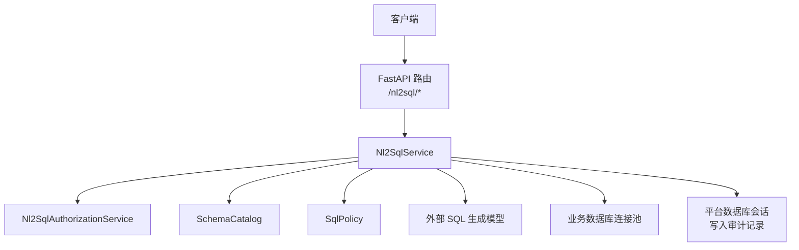
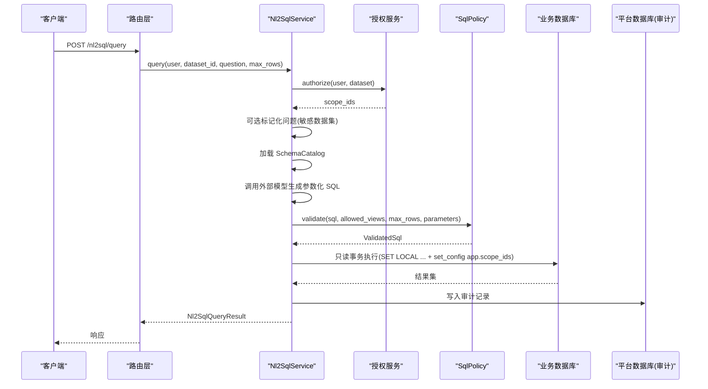
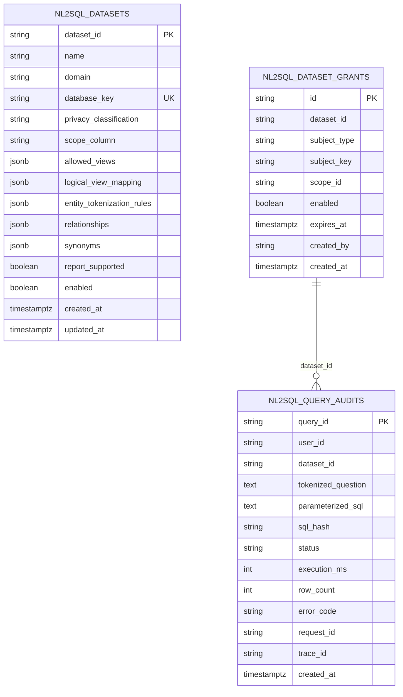
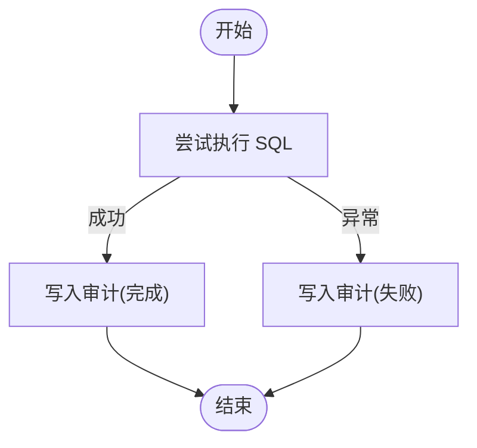
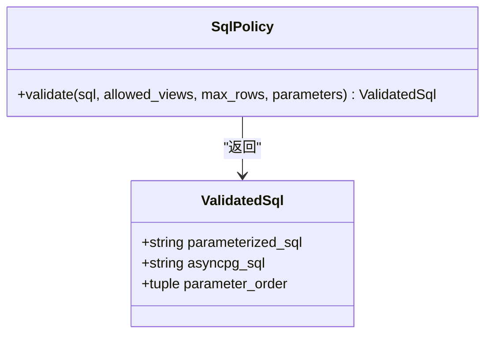
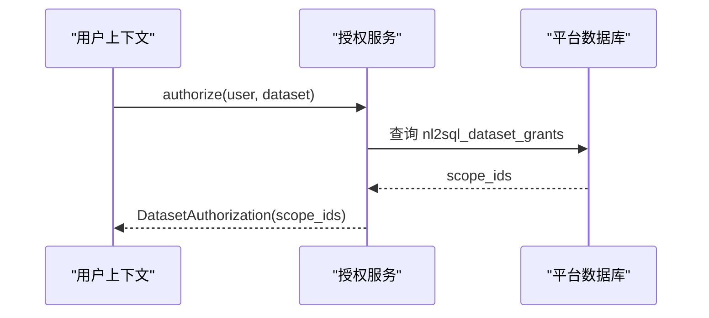
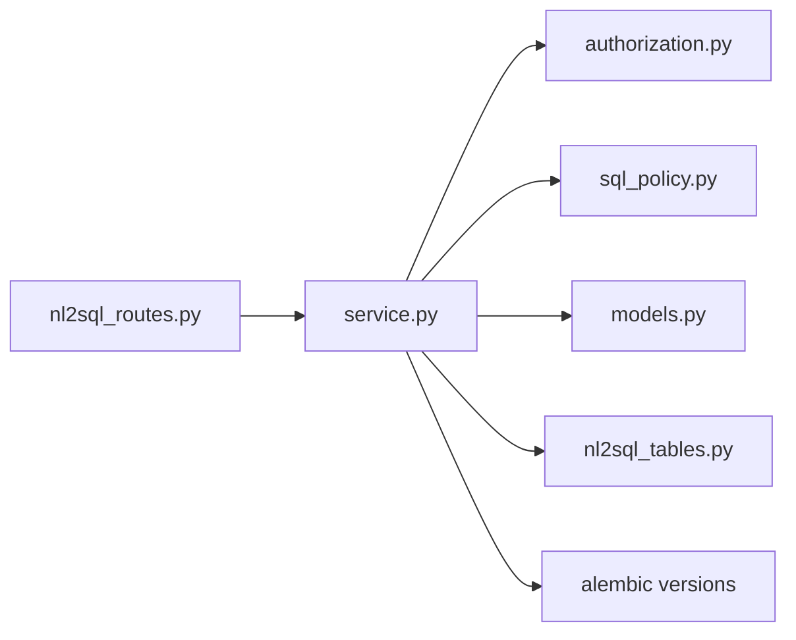

# NL2SQL 模型

<cite>
**本文引用的文件**
- [nl2sql_tables.py](file://src/fast_app/db/nl2sql_tables.py)
- [20260729_0011_add_nl2sql_rbac_and_audit.py](file://alembic/versions/20260729_0011_add_nl2sql_rbac_and_audit.py)
- [20260731_0012_add_nl2sql_datasets.py](file://alembic/versions/20260731_0012_add_nl2sql_datasets.py)
- [service.py](file://src/fast_app/services/nl2sql/service.py)
- [sql_policy.py](file://src/fast_app/services/nl2sql/sql_policy.py)
- [authorization.py](file://src/fast_app/services/nl2sql/authorization.py)
- [models.py](file://src/fast_app/services/nl2sql/models.py)
- [nl2sql_routes.py](file://src/fast_app/api/nl2sql_routes.py)
</cite>

## 目录
1. [简介](#简介)
2. [项目结构](#项目结构)
3. [核心组件](#核心组件)
4. [架构总览](#架构总览)
5. [详细组件分析](#详细组件分析)
6. [依赖关系分析](#依赖关系分析)
7. [性能与缓存](#性能与缓存)
8. [故障排查指南](#故障排查指南)
9. [结论](#结论)
10. [附录：扩展与安全最佳实践](#附录：扩展与安全最佳实践)

## 简介
本文件面向开发者，系统化说明本项目中“自然语言转 SQL”（NL2SQL）的 SQLAlchemy 2.0 数据模型、服务编排、安全策略与审计机制。重点覆盖：
- 数据集绑定机制：数据库连接键、允许视图白名单、逻辑视图映射、字段同义词与关系描述。
- 查询历史与审计追踪：参数化 SQL、执行耗时、结果行数、错误码、请求与链路追踪 ID。
- SQL Policy 安全控制：只读约束、对象白名单、函数白名单、LIMIT 上限、参数校验。
- 查询模板与结果格式化：敏感数据集本地模板回填、Markdown 表格输出、截断提示。
- 授权与 RBAC：全局权限、Dataset Grant、作用域范围（scope_ids）与 RLS 联动。

## 项目结构
NL2SQL 相关代码主要分布在以下位置：
- 数据模型与迁移：SQLAlchemy 表定义位于 db 层；迁移脚本位于 alembic 版本目录。
- 服务层：Nl2SqlService 负责端到端编排（授权、目录加载、SQL 生成、AST 校验、执行、序列化、审计）。
- 安全策略：SqlPolicy 基于 AST 对模型生成的 SQL 进行严格校验与规范化。
- 授权服务：Nl2SqlAuthorizationService 合并用户 RBAC 快照与 Dataset Grant，产出可信 scope_ids。
- API 路由：FastAPI 路由暴露数据集列表与查询接口。

图表来源
- [nl2sql_routes.py:14-39](file://src/fast_app/api/nl2sql_routes.py#L14-L39)
- [service.py:41-58](file://src/fast_app/services/nl2sql/service.py#L41-L58)
- [authorization.py:15-78](file://src/fast_app/services/nl2sql/authorization.py#L15-L78)
- [sql_policy.py:52-183](file://src/fast_app/services/nl2sql/sql_policy.py#L52-L183)

章节来源
- [nl2sql_routes.py:14-39](file://src/fast_app/api/nl2sql_routes.py#L14-L39)
- [service.py:41-58](file://src/fast_app/services/nl2sql/service.py#L41-L58)

## 核心组件
- Nl2SqlDatasetTable：控制平面中的数据集配置，包含名称、领域、数据库连接键、隐私等级、作用域列、允许视图、逻辑视图映射、实体标记化规则、关系、同义词、是否支持报告等元信息。
- Nl2SqlDatasetGrantTable：数据集/项目授权表，支持按用户、角色或部门授予特定 scope_id，并支持启用状态与过期时间。
- Nl2SqlQueryAuditTable：查询审计摘要表，记录 tokenized_question、parameterized_sql、sql_hash、status、execution_ms、row_count、error_code、request_id、trace_id 等，不保存真实参数与结果行。
- Nl2SqlService：统一入口，编排授权、目录加载、SQL 生成、AST 校验、执行、序列化、总结与审计。
- SqlPolicy：AST 级安全策略，限制语句类型、对象访问、函数使用、SELECT *、LIMIT 上限与参数一致性。
- Nl2SqlAuthorizationService：合并 RBAC 与 Dataset Grant，返回可信 scope_ids 并在只读事务中设置 RLS 上下文。
- models.py：Pydantic 模型，定义 DatasetDefinition、Nl2SqlQueryRequest、Nl2SqlQueryResult、SqlGenerationResult 等契约。

章节来源
- [nl2sql_tables.py:12-107](file://src/fast_app/db/nl2sql_tables.py#L12-L107)
- [service.py:41-586](file://src/fast_app/services/nl2sql/service.py#L41-L586)
- [sql_policy.py:52-183](file://src/fast_app/services/nl2sql/sql_policy.py#L52-L183)
- [authorization.py:15-78](file://src/fast_app/services/nl2sql/authorization.py#L15-L78)
- [models.py:12-134](file://src/fast_app/services/nl2sql/models.py#L12-L134)

## 架构总览
NL2SQL 的核心流程如下：
1. 客户端调用 /nl2sql/datasets 或 /nl2sql/query。
2. 路由层解析请求并注入当前用户上下文与服务实例。
3. 服务层先进行功能开关检查与 Dataset 注册表查找。
4. 授权服务校验用户全局权限与 Dataset Grant，计算可信 scope_ids。
5. 根据隐私等级决定是否对问题做标记化（敏感数据集），并加载 SchemaCatalog。
6. 调用外部模型生成受 Pydantic 约束的参数化 SQL。
7. SqlPolicy 对 SQL 进行 AST 校验、白名单检查、LIMIT 上限、参数一致性校验。
8. 在只读事务中设置 statement_timeout、lock_timeout、search_path 与 RLS 作用域，执行查询。
9. 序列化结果、生成 Markdown 表格、构造响应，并写入审计记录。

图表来源
- [nl2sql_routes.py:25-36](file://src/fast_app/api/nl2sql_routes.py#L25-L36)
- [service.py:95-284](file://src/fast_app/services/nl2sql/service.py#L95-L284)
- [authorization.py:21-74](file://src/fast_app/services/nl2sql/authorization.py#L21-L74)
- [sql_policy.py:55-179](file://src/fast_app/services/nl2sql/sql_policy.py#L55-L179)

## 详细组件分析

### 数据模型与迁移
- nl2sql_datasets：存储数据集元数据，包括 privacy_classification、scope_column、allowed_views、logical_view_mapping、entity_tokenization_rules、relationships、synonyms、report_supported、enabled 等。
- nl2sql_dataset_grants：存储数据集授权，subject_type 支持 user、role、department，支持 enabled 与 expires_at，唯一约束保证同一主体在同一 scope 仅一条授权。
- nl2sql_query_audits：存储审计摘要，禁止保存真实参数和结果行，记录 parameterized_sql、sql_hash、status、execution_ms、row_count、error_code、request_id、trace_id。

图表来源
- [nl2sql_tables.py:12-107](file://src/fast_app/db/nl2sql_tables.py#L12-L107)
- [20260729_0011_add_nl2sql_rbac_and_audit.py:17-71](file://alembic/versions/20260729_0011_add_nl2sql_rbac_and_audit.py#L17-L71)
- [20260731_0012_add_nl2sql_datasets.py:18-40](file://alembic/versions/20260731_0012_add_nl2sql_datasets.py#L18-L40)

章节来源
- [nl2sql_tables.py:12-107](file://src/fast_app/db/nl2sql_tables.py#L12-L107)
- [20260729_0011_add_nl2sql_rbac_and_audit.py:17-71](file://alembic/versions/20260729_0011_add_nl2sql_rbac_and_audit.py#L17-L71)
- [20260731_0012_add_nl2sql_datasets.py:18-126](file://alembic/versions/20260731_0012_add_nl2sql_datasets.py#L18-L126)

### 数据集绑定机制
- 数据库连接配置：通过 DatasetDefinition.database_key 映射到部署环境中的连接 URL，不在 Python 中硬编码业务库凭证。
- 表结构元数据：SchemaCatalog 从业务库读取 allowed_views 的结构与 COMMENT，供模型理解可用视图与字段语义。
- 字段描述信息：通过 catalog 传入模型的系统目录查询结果与同义词、关系描述，帮助模型生成更准确的参数化 SQL。
- 逻辑视图映射：敏感数据集将逻辑视图名替换为物理 analytics 视图名，避免模型直接引用内部对象。

章节来源
- [models.py:12-46](file://src/fast_app/services/nl2sql/models.py#L12-L46)
- [service.py:165-185](file://src/fast_app/services/nl2sql/service.py#L165-L185)
- [service.py:439-447](file://src/fast_app/services/nl2sql/service.py#L439-L447)

### 查询历史记录与审计追踪
- 成功路径：记录 tokenized_question、parameterized_sql、sql_hash、status="completed"、execution_ms、row_count、request_id、trace_id。
- 失败路径：记录 "[REDACTED]" 问题、空 SQL、空 hash、status="failed"、error_code、execution_ms，确保不泄露真实参数与结果。
- 索引优化：按 user_id+created_at、dataset_id+created_at 建立索引，便于按用户或数据集回溯。

图表来源
- [service.py:105-136](file://src/fast_app/services/nl2sql/service.py#L105-L136)
- [service.py:265-283](file://src/fast_app/services/nl2sql/service.py#L265-L283)
- [nl2sql_tables.py:76-100](file://src/fast_app/db/nl2sql_tables.py#L76-L100)

章节来源
- [service.py:105-136](file://src/fast_app/services/nl2sql/service.py#L105-L136)
- [service.py:265-283](file://src/fast_app/services/nl2sql/service.py#L265-L283)
- [nl2sql_tables.py:76-100](file://src/fast_app/db/nl2sql_tables.py#L76-L100)

### SQL Policy 安全控制
- 语句类型限制：仅允许 SELECT/Union/Intersect/Except，拒绝 Insert/Update/Delete/Create/Drop/Alter/Command/Copy/Transaction。
- 对象白名单：所有 Table 引用必须属于 allowed_views（含 schema.table 全限定名），CTE 临时名不受限。
- 函数白名单：匿名函数必须在 ALLOWED_FUNCTIONS 列表中，FORBIDDEN_FUNCTIONS 一律拒绝。
- 禁止 SELECT *：必须显式列出字段。
- LIMIT 上限：默认 fetch_limit = min(max_rows, 500) + 1；若模型返回 LIMIT 参数，需为正整数且不超过上限。
- 参数一致性：SQL 中出现的 :name 参数必须存在于 parameters，且不能有多余参数。
- 参数转换：将 :name 转换为 asyncpg $1/$2 位置参数，并按出现顺序绑定值。

图表来源
- [sql_policy.py:52-183](file://src/fast_app/services/nl2sql/sql_policy.py#L52-L183)

章节来源
- [sql_policy.py:52-183](file://src/fast_app/services/nl2sql/sql_policy.py#L52-L183)

### 授权与 RBAC
- 全局权限：需要 data:query:execute 权限才能使用 NL2SQL。
- Dataset Grant：支持按用户、角色或部门授予 dataset_id 下的 scope_id，支持 enabled 与 expires_at。
- 管理员特权：system_admin 可直接获得 "*" 作用域。
- RLS 联动：服务层将 scope_ids 写入 app.scope_ids，由 PostgreSQL RLS 再次限制可见行。

图表来源
- [authorization.py:21-74](file://src/fast_app/services/nl2sql/authorization.py#L21-L74)
- [20260729_0011_add_nl2sql_rbac_and_audit.py:17-71](file://alembic/versions/20260729_0011_add_nl2sql_rbac_and_audit.py#L17-L71)

章节来源
- [authorization.py:21-74](file://src/fast_app/services/nl2sql/authorization.py#L21-L74)
- [20260729_0011_add_nl2sql_rbac_and_audit.py:17-71](file://alembic/versions/20260729_0011_add_nl2sql_rbac_and_audit.py#L17-L71)

### 查询模板管理与结果格式化
- 敏感数据集：summary_template 仅允许后端已知字段（如 row_count、truncated）回填，避免向外部模型泄露真实结果。
- 非敏感数据集：可调用外部模型生成中文结论，但输入受限为 question、parameterized_sql、rows。
- 结果序列化：Decimal、date/datetime、UUID 标准化；长文本裁剪至 2000 字符并产生警告。
- Markdown 表格：后端确定性生成，用于报告证据。

章节来源
- [service.py:233-247](file://src/fast_app/services/nl2sql/service.py#L233-L247)
- [service.py:467-508](file://src/fast_app/services/nl2sql/service.py#L467-L508)
- [service.py:521-582](file://src/fast_app/services/nl2sql/service.py#L521-L582)
- [models.py:75-114](file://src/fast_app/services/nl2sql/models.py#L75-L114)

## 依赖关系分析
- 路由依赖服务：/nl2sql/routes 依赖 Nl2SqlService。
- 服务依赖：
  - 授权服务：Nl2SqlAuthorizationService。
  - 目录服务：SchemaCatalog（从业务库读取 allowed_views 结构与 COMMENT）。
  - 策略服务：SqlPolicy（AST 校验）。
  - 外部模型：ChatOpenAI（结构化输出 SqlGenerationResult）。
  - 数据库：asyncpg 连接池执行只读查询；SQLAlchemy AsyncSession 写入审计。
- 数据模型依赖：
  - nl2sql_datasets：提供 allowed_views、logical_view_mapping、synonyms、relationships 等。
  - nl2sql_dataset_grants：提供 scope_id 授权。
  - nl2sql_query_audits：记录审计摘要。

图表来源
- [nl2sql_routes.py:14-39](file://src/fast_app/api/nl2sql_routes.py#L14-L39)
- [service.py:41-586](file://src/fast_app/services/nl2sql/service.py#L41-L586)
- [nl2sql_tables.py:12-107](file://src/fast_app/db/nl2sql_tables.py#L12-L107)
- [20260729_0011_add_nl2sql_rbac_and_audit.py:17-71](file://alembic/versions/20260729_0011_add_nl2sql_rbac_and_audit.py#L17-L71)
- [20260731_0012_add_nl2sql_datasets.py:18-126](file://alembic/versions/20260731_0012_add_nl2sql_datasets.py#L18-L126)

章节来源
- [nl2sql_routes.py:14-39](file://src/fast_app/api/nl2sql_routes.py#L14-L39)
- [service.py:41-586](file://src/fast_app/services/nl2sql/service.py#L41-L586)

## 性能与缓存
- 执行超时与锁超时：每次只读事务设置 statement_timeout=8s、lock_timeout=1s，防止慢查询与死锁。
- 结果行数限制：fetch_limit = min(max_rows, 500) + 1，额外取一行判断 truncated，响应最多返回 max_rows。
- 搜索路径隔离：SET LOCAL search_path = analytics, pg_catalog，限制模型 SQL 只能访问 analytics 视图与系统目录。
- 结果序列化优化：Decimal、日期、UUID 标准化，长文本裁剪，减少响应体积。
- 缓存建议：
  - SchemaCatalog 可按 dataset_id 缓存一段时间，避免频繁读取系统目录。
  - 对相同 parameterized_sql 与参数集合可做短期缓存（注意幂等性与数据新鲜度）。
  - 审计表索引已优化，可按用户/数据集快速回溯。

[本节为通用性能建议，不直接分析具体文件]

## 故障排查指南
- 常见错误分类：
  - 语法错误：Nl2SqlRepairableSqlError，服务会尝试一次修复并重试。
  - 不安全 SQL：Nl2SqlUnsafeSqlError，通常因对象不在白名单、函数未授权、SELECT *、LIMIT 非法等。
  - 执行错误：Nl2SqlExecutionError，数据库拒绝只读查询或超时。
  - 权限不足：Nl2SqlPermissionDeniedError，缺少 data:query:execute 或 Dataset Grant。
  - 敏感报告禁用：Nl2SqlSensitiveReportForbiddenError，Dataset 不支持外部报告链路。
- 排查步骤：
  1. 查看 Nl2SqlQueryAuditTable 的 status、error_code、execution_ms、row_count。
  2. 核对 allowed_views 与 logical_view_mapping 是否正确配置。
  3. 检查 SqlPolicy 日志，确认函数白名单与 LIMIT 限制。
  4. 验证 Dataset Grant 是否生效（enabled、expires_at、subject_type/key）。
  5. 确认 RLS 作用域 app.scope_ids 是否设置正确。

章节来源
- [service.py:196-225](file://src/fast_app/services/nl2sql/service.py#L196-L225)
- [service.py:105-136](file://src/fast_app/services/nl2sql/service.py#L105-L136)
- [sql_policy.py:55-179](file://src/fast_app/services/nl2sql/sql_policy.py#L55-L179)
- [authorization.py:21-74](file://src/fast_app/services/nl2sql/authorization.py#L21-L74)

## 结论
本项目的 NL2SQL 实现以“最小信任边界”为核心：外部模型仅生成参数化 SQL，服务端通过 AST 策略严格校验、限制对象与函数、强制只读事务与 RLS 作用域，并通过审计表记录关键指标而不泄露敏感数据。数据集配置集中管理，授权与 RBAC 结合，形成多层防护。该设计兼顾安全性、可观测性与可扩展性，适合企业级数据查询场景。

[本节为总结性内容，不直接分析具体文件]

## 附录：扩展与安全最佳实践
- 扩展点：
  - 新增 Dataset：在 nl2sql_datasets 中添加 allowed_views、logical_view_mapping、synonyms、relationships 等元数据。
  - 新增授权：在 nl2sql_dataset_grants 中为用户/角色/部门授予 scope_id。
  - 新增函数白名单：在 SqlPolicy 的 _ALLOWED_FUNCTIONS 中添加必要函数。
  - 新增审计字段：在 Nl2SqlQueryAuditTable 与迁移脚本中扩展字段。
- 安全最佳实践：
  - 始终使用只读事务与 RLS，禁止写操作与系统目录访问。
  - 严格限制 allowed_views，避免模型访问内部表。
  - 对敏感数据集采用标记化与本地模板回填，不向外部模型泄露真实值。
  - 审计记录不包含真实参数与结果行，仅保留摘要与哈希。
  - 定期审查 Dataset Grant 的有效期与作用域，及时回收权限。

[本节为通用指导，不直接分析具体文件]