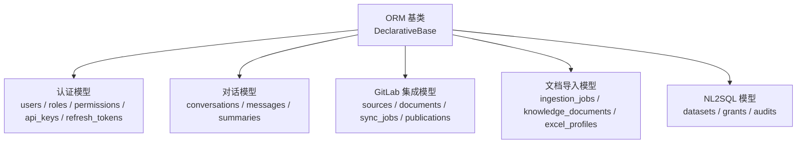
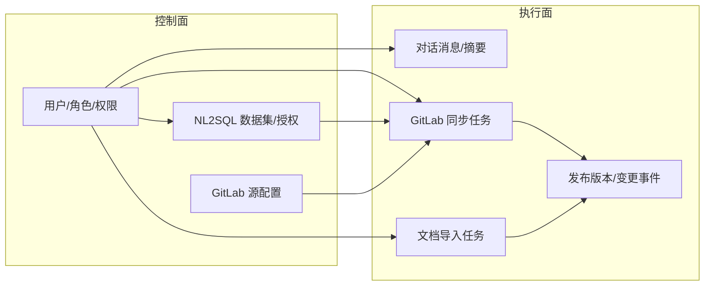
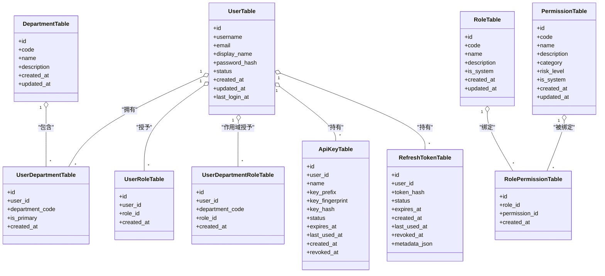
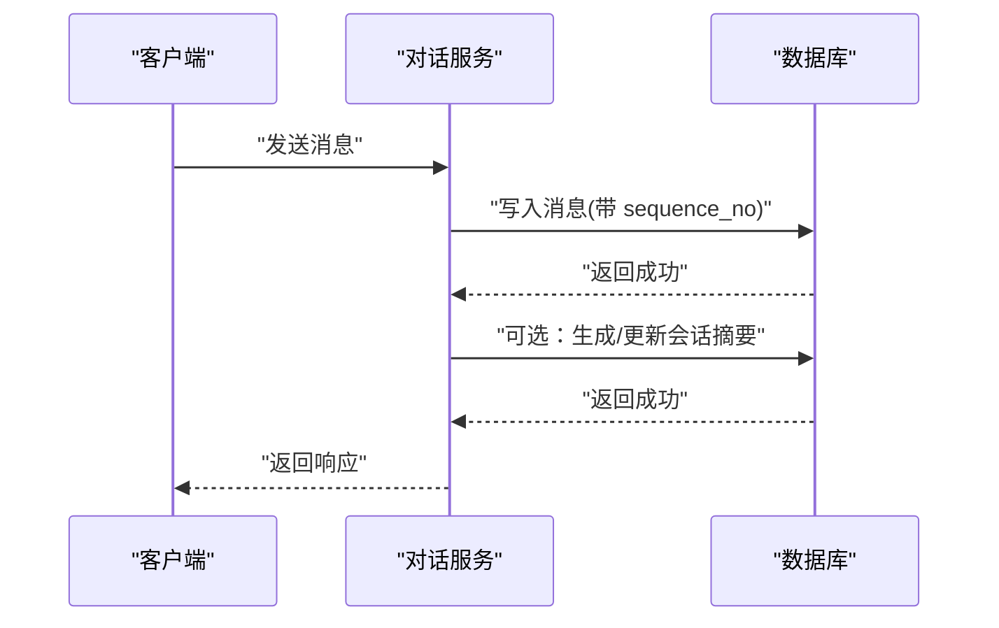
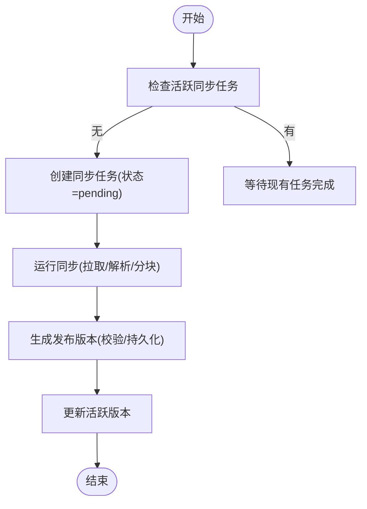
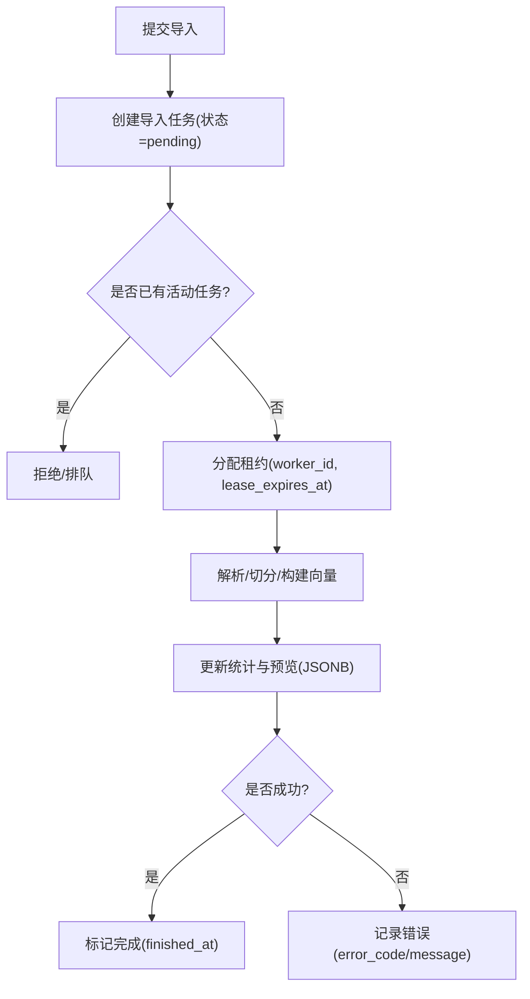
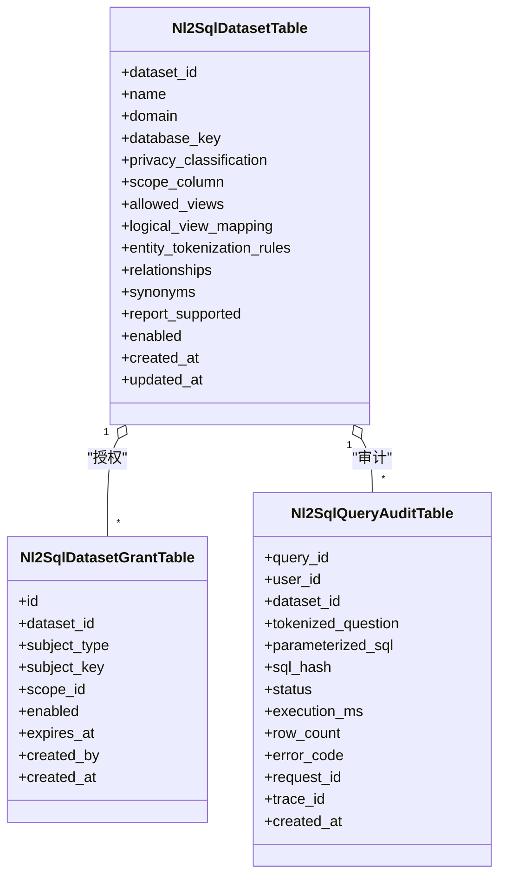
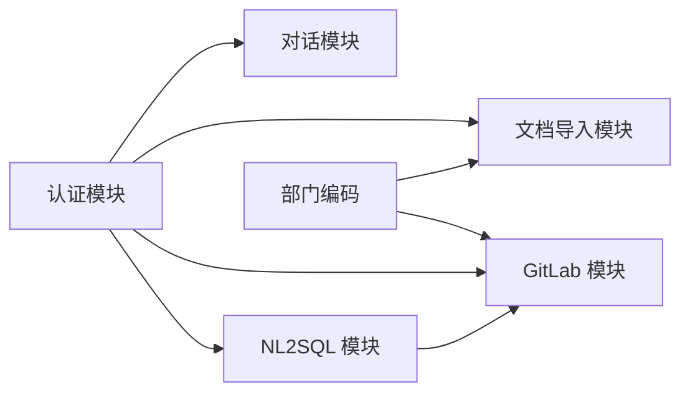

# ORM 模型设计

<cite>
**本文引用的文件**
- [base.py](file://src/fast_app/db/base.py)
- [auth_tables.py](file://src/fast_app/db/auth_tables.py)
- [conversation_tables.py](file://src/fast_app/db/conversation_tables.py)
- [gitlab_tables.py](file://src/fast_app/db/gitlab_tables.py)
- [ingestion_tables.py](file://src/fast_app/db/ingestion_tables.py)
- [nl2sql_tables.py](file://src/fast_app/db/nl2sql_tables.py)
- [20260726_0009_add_gitlab_enterprise_sync.py](file://alembic/versions/20260726_0009_add_gitlab_enterprise_sync.py)
- [20260729_0011_add_nl2sql_rbac_and_audit.py](file://alembic/versions/20260729_0011_add_nl2sql_rbac_and_audit.py)
- [20260731_0012_add_nl2sql_datasets.py](file://alembic/versions/20260731_0012_add_nl2sql_datasets.py)
</cite>

## 目录
1. [简介](#简介)
2. [项目结构](#项目结构)
3. [核心组件](#核心组件)
4. [架构总览](#架构总览)
5. [详细组件分析](#详细组件分析)
6. [依赖关系分析](#依赖关系分析)
7. [性能与索引优化](#性能与索引优化)
8. [数据验证与业务规则](#数据验证与业务规则)
9. [故障排查指南](#故障排查指南)
10. [结论](#结论)
11. [附录：扩展指南](#附录：扩展指南)

## 简介
本文件面向开发者，系统化梳理本项目基于 SQLAlchemy 2.0 的声明式 ORM 模型设计。内容覆盖表结构映射、字段类型定义、约束配置、关系映射、外键策略、索引优化、查询性能调优、数据验证规则、业务逻辑封装以及模型继承模式，并围绕以下业务模块展开：用户认证、对话历史、GitLab 集成、文档导入、NL2SQL。

## 项目结构
项目将数据库模型按业务域拆分到独立模块，统一继承自声明式基类 Base，并通过 Alembic 管理迁移演进。关键组织方式如下：
- 基础基类：所有表模型继承自统一的 DeclarativeBase。
- 领域模型：按功能域拆分为认证、对话、GitLab、文档导入、NL2SQL 等模块。
- 迁移脚本：使用 Alembic 版本化数据库结构变更，确保可回滚与可审计。

图表来源
- [base.py:1-8](file://src/fast_app/db/base.py#L1-L8)

章节来源
- [base.py:1-8](file://src/fast_app/db/base.py#L1-L8)

## 核心组件
- 认证系统：用户、部门、角色、权限、API Key、刷新令牌，支持多对多授权与作用域角色。
- 对话历史：会话容器、消息序列、窗口外摘要版本化存储。
- GitLab 集成：企业仓库源、Webhook 投递、同步任务、文档元数据、发布版本与变更事件。
- 文档导入：Office 导入任务状态机、服务端文档身份、Excel 导入配置快照。
- NL2SQL：数据集控制面、授权、安全审计（不保存真实参数与结果行）。

章节来源
- [auth_tables.py:13-431](file://src/fast_app/db/auth_tables.py#L13-L431)
- [conversation_tables.py:24-171](file://src/fast_app/db/conversation_tables.py#L24-L171)
- [gitlab_tables.py:24-317](file://src/fast_app/db/gitlab_tables.py#L24-L317)
- [ingestion_tables.py:24-204](file://src/fast_app/db/ingestion_tables.py#L24-L204)
- [nl2sql_tables.py:12-108](file://src/fast_app/db/nl2sql_tables.py#L12-L108)

## 架构总览
下图展示各模型之间的主要关系与数据流向，体现“控制面 + 执行面”的分层设计：
- 控制面：认证、NL2SQL 数据集与授权、GitLab 源配置。
- 执行面：对话消息、文档导入任务、GitLab 同步任务、发布与变更事件。

图表来源
- [auth_tables.py:13-431](file://src/fast_app/db/auth_tables.py#L13-L431)
- [conversation_tables.py:24-171](file://src/fast_app/db/conversation_tables.py#L24-L171)
- [gitlab_tables.py:24-317](file://src/fast_app/db/gitlab_tables.py#L24-L317)
- [ingestion_tables.py:24-204](file://src/fast_app/db/ingestion_tables.py#L24-L204)
- [nl2sql_tables.py:12-108](file://src/fast_app/db/nl2sql_tables.py#L12-L108)

## 详细组件分析

### 用户认证模型
- 实体与职责
  - 用户：唯一用户名、邮箱、密码哈希、状态、登录时间戳。
  - 部门：部门编码、名称、描述。
  - 用户-部门：多对多关联，支持主部门标记。
  - 角色与权限：角色目录、权限目录、角色-权限多对多。
  - 用户-角色：全局角色授予。
  - 用户-部门-角色：作用域角色（部门级）。
  - API Key：仅保存 key 前缀、指纹与哈希，支持过期与撤销。
  - 刷新令牌：仅保存 token 哈希，支持过期与撤销，附带 JSONB 元数据。
- 关系与约束
  - 一对多：用户 -> API Key、刷新令牌、部门成员、全局角色、部门角色。
  - 多对多：用户-部门、角色-权限。
  - 外键：广泛使用 ondelete=CASCADE 或 RESTRICT，保证一致性。
  - 唯一性：用户名、邮箱、部门编码、角色/权限编码、API Key 指纹、刷新令牌哈希等。
- 索引优化
  - 用户-部门、角色-权限、用户-角色、用户-部门-角色均建立复合/单列索引以加速授权查询。
  - API Key 与刷新令牌按 user_id+status 建复合索引，便于按用户快速检索活跃凭证。
- 数据验证与业务规则
  - 默认状态为 active；时间戳由服务器函数生成；敏感信息仅存哈希。
  - 通过 Alembric 注入系统角色与权限，确保 RBAC 初始一致。

图表来源
- [auth_tables.py:13-431](file://src/fast_app/db/auth_tables.py#L13-L431)

章节来源
- [auth_tables.py:13-431](file://src/fast_app/db/auth_tables.py#L13-L431)
- [20260729_0011_add_nl2sql_rbac_and_audit.py:17-120](file://alembic/versions/20260729_0011_add_nl2sql_rbac_and_audit.py#L17-L120)

### 对话历史模型
- 实体与职责
  - 会话：容器，携带 JSONB 元数据。
  - 消息：记录 role/content，sequence_no 用于顺序排序。
  - 摘要：窗口外历史的可追溯摘要，含结构化摘要、来源消息 ID 列表、覆盖范围等。
- 关系与约束
  - 一对多：会话 -> 消息、会话 -> 摘要。
  - 外键：消息与摘要均级联删除至会话。
- 索引优化
  - 消息按 conversation_id+created_at、conversation_id+sequence_no 建复合索引，支撑按会话分页与顺序读取。
  - 摘要按 conversation_id+version 建复合索引，支撑版本化查询。
- 数据验证与业务规则
  - 时间戳默认当前时间；JSONB 字段提供默认空对象；sequence_no 使用自增整数保障顺序。

图表来源
- [conversation_tables.py:24-171](file://src/fast_app/db/conversation_tables.py#L24-L171)

章节来源
- [conversation_tables.py:24-171](file://src/fast_app/db/conversation_tables.py#L24-L171)

### GitLab 集成模型
- 实体与职责
  - 源：GitLab 企业仓库连接、目标分支、可见性、同步凭据环境变量名、最近同步 SHA。
  - Webhook 投递：去重键、事件类型、前后 SHA、负载哈希。
  - 同步任务：状态机（pending/running/publishing/retry_wait）、租约、尝试次数、统计计数、变更统计 JSONB。
  - 文档：仓库路径、blob_id、内容哈希、ACL 哈希、解析与分块策略版本、ACL JSONB。
  - 变更请求：任务计划关联、分支、MR 信息。
  - 发布版本：版本号链、校验结果 JSONB、发布时间。
  - 发布状态：单例记录当前活跃版本。
  - 变更事件：按发布版本索引的事件流。
- 关系与约束
  - 一对多：源 -> 文档、源 -> 同步任务、源 -> Webhook 投递、源 -> 变更请求。
  - 一对多：同步任务 -> 发布版本。
  - 唯一性：源(host_id, project_id)、文档(source_id, repository_path)、变更请求(task_plan_id, source_id)。
  - 条件唯一：同步任务针对同一源在活跃状态下唯一，避免并发重复处理。
- 索引优化
  - 同步任务按 status+created_at 索引，便于调度器拉取待处理任务。
  - 文档按 source_id+status 索引，便于增量扫描。
  - 变更事件按 publication_version+id 索引，便于回放。
- 数据验证与业务规则
  - 默认值：目标分支 main、可见性 department、状态 pending/active/draft 等。
  - 通过 Alembic 创建表与索引，并在升级时插入初始发布状态。

图表来源
- [gitlab_tables.py:24-317](file://src/fast_app/db/gitlab_tables.py#L24-L317)
- [20260726_0009_add_gitlab_enterprise_sync.py:20-153](file://alembic/versions/20260726_0009_add_gitlab_enterprise_sync.py#L20-L153)

章节来源
- [gitlab_tables.py:24-317](file://src/fast_app/db/gitlab_tables.py#L24-L317)
- [20260726_0009_add_gitlab_enterprise_sync.py:20-153](file://alembic/versions/20260726_0009_add_gitlab_enterprise_sync.py#L20-L153)

### 文档导入模型
- 实体与职责
  - 导入任务：Office 导入的状态机、租约、尝试次数、统计计数、预览与差异 JSONB、错误信息。
  - 文档：服务端身份、目标路径、当前版本、状态、创建/更新人。
  - Excel 导入配置：用户确认后的字段身份、主键、导入模式快照，按版本保留。
- 关系与约束
  - 一对一/一对多：文档 -> 导入任务（按 target_path 活动任务唯一）；文档 -> Excel 配置（doc_id+version 唯一）。
  - 外键：任务与文档关联用户与部门；文档创建/更新人为用户。
- 索引优化
  - 任务按 user_id+created_at、status+created_at 索引，便于用户视图与调度器查询。
  - 活动任务按 target_path 条件唯一，防止同一路径并发写入。
- 数据验证与业务规则
  - 默认状态 pending/queued；JSONB 字段提供默认空对象；时间戳由服务器函数生成。

图表来源
- [ingestion_tables.py:24-204](file://src/fast_app/db/ingestion_tables.py#L24-L204)

章节来源
- [ingestion_tables.py:24-204](file://src/fast_app/db/ingestion_tables.py#L24-L204)

### NL2SQL 模型
- 实体与职责
  - 数据集：控制平面配置，包含域名、隐私分类、作用域列、允许视图、逻辑视图映射、实体分词规则、关系、同义词、报告能力开关。
  - 授权：按 subject_type(user/role/department) 与 scope_id 授予访问权限，支持过期时间。
  - 审计：记录 tokenized 问题、参数化 SQL、SQL 哈希、执行耗时、行数、错误码、追踪 ID；不保存真实参数与结果行。
- 关系与约束
  - 唯一性：dataset.database_key 唯一；授权按 dataset_id+subject_type+subject_key+scope_id 唯一。
  - 索引：授权按 dataset_id+enabled 索引；审计按 user_id+created_at、dataset_id+created_at 索引。
- 数据验证与业务规则
  - 隐私分类受检查约束限制；启用默认 true；时间戳由服务器函数生成。
  - 通过 Alembic 注入系统权限与角色，并将数据分析员角色绑定到数据查询执行权限。

图表来源
- [nl2sql_tables.py:12-108](file://src/fast_app/db/nl2sql_tables.py#L12-L108)
- [20260729_0011_add_nl2sql_rbac_and_audit.py:17-120](file://alembic/versions/20260729_0011_add_nl2sql_rbac_and_audit.py#L17-L120)
- [20260731_0012_add_nl2sql_datasets.py:18-121](file://alembic/versions/20260731_0012_add_nl2sql_datasets.py#L18-L121)

章节来源
- [nl2sql_tables.py:12-108](file://src/fast_app/db/nl2sql_tables.py#L12-L108)
- [20260729_0011_add_nl2sql_rbac_and_audit.py:17-120](file://alembic/versions/20260729_0011_add_nl2sql_rbac_and_audit.py#L17-L120)
- [20260731_0012_add_nl2sql_datasets.py:18-121](file://alembic/versions/20260731_0012_add_nl2sql_datasets.py#L18-L121)

## 依赖关系分析
- 模块内耦合
  - 认证模块内部高内聚：用户、部门、角色、权限、API Key、刷新令牌形成完整的 RBAC 体系。
  - 对话模块低耦合：会话、消息、摘要之间通过外键与索引解耦，便于水平扩展。
  - GitLab 模块中，源、任务、文档、发布、事件形成清晰的数据流水线。
  - 文档导入模块中，任务与文档、Excel 配置形成稳定的版本化快照机制。
  - NL2SQL 模块作为控制面，与认证、业务库隔离，仅保存配置与审计。
- 跨模块依赖
  - 认证用户贯穿所有模块（用户ID、部门编码）。
  - 部门编码作为权限边界，影响文档导入与 GitLab 同步的可见性。
  - NL2SQL 授权与认证角色结合，实现细粒度数据访问控制。

图表来源
- [auth_tables.py:13-431](file://src/fast_app/db/auth_tables.py#L13-L431)
- [conversation_tables.py:24-171](file://src/fast_app/db/conversation_tables.py#L24-L171)
- [gitlab_tables.py:24-317](file://src/fast_app/db/gitlab_tables.py#L24-L317)
- [ingestion_tables.py:24-204](file://src/fast_app/db/ingestion_tables.py#L24-L204)
- [nl2sql_tables.py:12-108](file://src/fast_app/db/nl2sql_tables.py#L12-L108)

章节来源
- [auth_tables.py:13-431](file://src/fast_app/db/auth_tables.py#L13-L431)
- [conversation_tables.py:24-171](file://src/fast_app/db/conversation_tables.py#L24-L171)
- [gitlab_tables.py:24-317](file://src/fast_app/db/gitlab_tables.py#L24-L317)
- [ingestion_tables.py:24-204](file://src/fast_app/db/ingestion_tables.py#L24-L204)
- [nl2sql_tables.py:12-108](file://src/fast_app/db/nl2sql_tables.py#L12-L108)

## 性能与索引优化
- 高频查询场景
  - 认证授权：用户-部门、角色-权限、用户-角色、用户-部门-角色的复合索引，减少 JOIN 开销。
  - 对话消息：按会话+时间、会话+序号的复合索引，提升分页与顺序读取性能。
  - 同步任务：按状态+时间的索引，提高调度器拉取效率；条件唯一索引避免重复任务。
  - 文档导入：按用户+时间、状态+时间的索引，便于监控与重试。
  - NL2SQL 审计：按用户+时间、数据集+时间的索引，便于审计检索。
- 建议优化
  - 对大表增加覆盖索引以减少回表。
  - 对 JSONB 字段使用表达式索引（如 PostgreSQL GIN）以支持复杂查询。
  - 定期分析慢查询，调整索引与查询计划。

章节来源
- [auth_tables.py:123-131](file://src/fast_app/db/auth_tables.py#L123-L131)
- [auth_tables.py:235-243](file://src/fast_app/db/auth_tables.py#L235-L243)
- [auth_tables.py:271-275](file://src/fast_app/db/auth_tables.py#L271-L275)
- [auth_tables.py:309-319](file://src/fast_app/db/auth_tables.py#L309-L319)
- [conversation_tables.py:94-105](file://src/fast_app/db/conversation_tables.py#L94-L105)
- [conversation_tables.py:164-170](file://src/fast_app/db/conversation_tables.py#L164-L170)
- [gitlab_tables.py:84-86](file://src/fast_app/db/gitlab_tables.py#L84-L86)
- [gitlab_tables.py:148-158](file://src/fast_app/db/gitlab_tables.py#L148-L158)
- [gitlab_tables.py:190-197](file://src/fast_app/db/gitlab_tables.py#L190-L197)
- [ingestion_tables.py:108-120](file://src/fast_app/db/ingestion_tables.py#L108-L120)
- [nl2sql_tables.py:64-73](file://src/fast_app/db/nl2sql_tables.py#L64-L73)
- [nl2sql_tables.py:97-100](file://src/fast_app/db/nl2sql_tables.py#L97-L100)

## 数据验证与业务规则
- 字段类型与约束
  - 字符串长度限制：如用户名、邮箱、角色/权限编码等。
  - 布尔字段：默认值明确，如 enabled、is_system、report_supported。
  - 时间戳：默认当前时间，更新时间自动维护。
  - JSONB：用于灵活元数据、配置快照、审计摘要。
- 业务规则
  - 活动任务唯一：通过条件唯一索引防止同一路径或同源并发任务。
  - 版本化：对话摘要、Excel 配置、GitLab 发布版本均支持版本化。
  - 安全：敏感信息仅存哈希；NL2SQL 审计不保存真实参数与结果行。
  - 权限：通过 RBAC 与 Dataset Grant 实现细粒度访问控制。

章节来源
- [auth_tables.py:18-43](file://src/fast_app/db/auth_tables.py#L18-L43)
- [auth_tables.py:322-369](file://src/fast_app/db/auth_tables.py#L322-L369)
- [conversation_tables.py:42-48](file://src/fast_app/db/conversation_tables.py#L42-L48)
- [conversation_tables.py:108-171](file://src/fast_app/db/conversation_tables.py#L108-L171)
- [gitlab_tables.py:57-63](file://src/fast_app/db/gitlab_tables.py#L57-L63)
- [gitlab_tables.py:148-158](file://src/fast_app/db/gitlab_tables.py#L148-L158)
- [ingestion_tables.py:108-120](file://src/fast_app/db/ingestion_tables.py#L108-L120)
- [nl2sql_tables.py:12-41](file://src/fast_app/db/nl2sql_tables.py#L12-L41)
- [nl2sql_tables.py:43-73](file://src/fast_app/db/nl2sql_tables.py#L43-L73)
- [nl2sql_tables.py:76-100](file://src/fast_app/db/nl2sql_tables.py#L76-L100)

## 故障排查指南
- 常见问题定位
  - 同步任务卡住：检查 gitlab_sync_jobs 的状态与租约过期时间，确认 worker_id 是否有效。
  - 导入任务失败：查看 ingestion_jobs 的错误码与错误消息，核对目标路径是否冲突。
  - 对话消息顺序错乱：确认 sequence_no 是否正确递增，检查索引是否存在。
  - NL2SQL 授权无效：检查 nl2sql_dataset_grants 的 subject_type、subject_key、scope_id 与 enabled 状态。
- 调试建议
  - 利用 JSONB 字段中的预览、差异、统计信息进行问题复现。
  - 通过审计表的 trace_id、request_id 关联日志进行端到端追踪。
  - 使用 Alembic 迁移历史回溯结构变更，确保模型与数据库一致。

章节来源
- [gitlab_tables.py:89-158](file://src/fast_app/db/gitlab_tables.py#L89-L158)
- [ingestion_tables.py:24-120](file://src/fast_app/db/ingestion_tables.py#L24-L120)
- [conversation_tables.py:60-105](file://src/fast_app/db/conversation_tables.py#L60-L105)
- [nl2sql_tables.py:43-100](file://src/fast_app/db/nl2sql_tables.py#L43-L100)

## 结论
本项目采用清晰的模块化 ORM 设计，基于 SQLAlchemy 2.0 的声明式模型，结合 Alembic 迁移管理，实现了可扩展、可审计、高性能的数据层。通过严格的约束、索引优化与业务规则封装，保障了认证、对话、GitLab 集成、文档导入、NL2SQL 等核心功能的稳定性与可维护性。

## 附录：扩展指南
- 新增模型规范
  - 继承 Base，定义 __tablename__ 与字段类型。
  - 明确外键与级联策略，添加必要索引与唯一约束。
  - 使用 JSONB 存储灵活元数据，避免过度规范化。
- 迁移最佳实践
  - 每个变更对应一个 Alembic 迁移，包含 upgrade 与 downgrade。
  - 对生产环境谨慎操作，优先添加非空字段时使用默认值。
- 查询性能调优
  - 针对高频查询添加复合索引，避免全表扫描。
  - 使用 EXPLAIN 分析查询计划，必要时调整查询结构。
- 安全与合规
  - 敏感信息仅存哈希，禁止明文存储。
  - 审计记录不包含真实参数与结果行，满足合规要求。