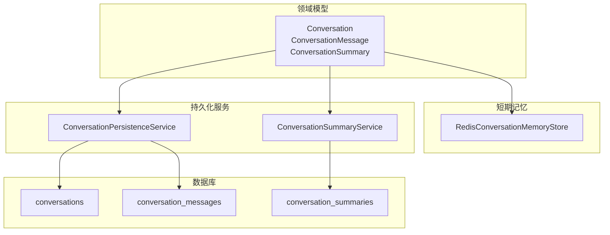
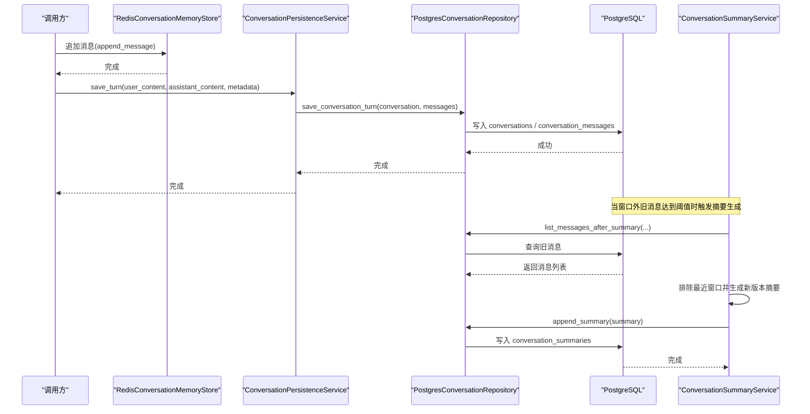
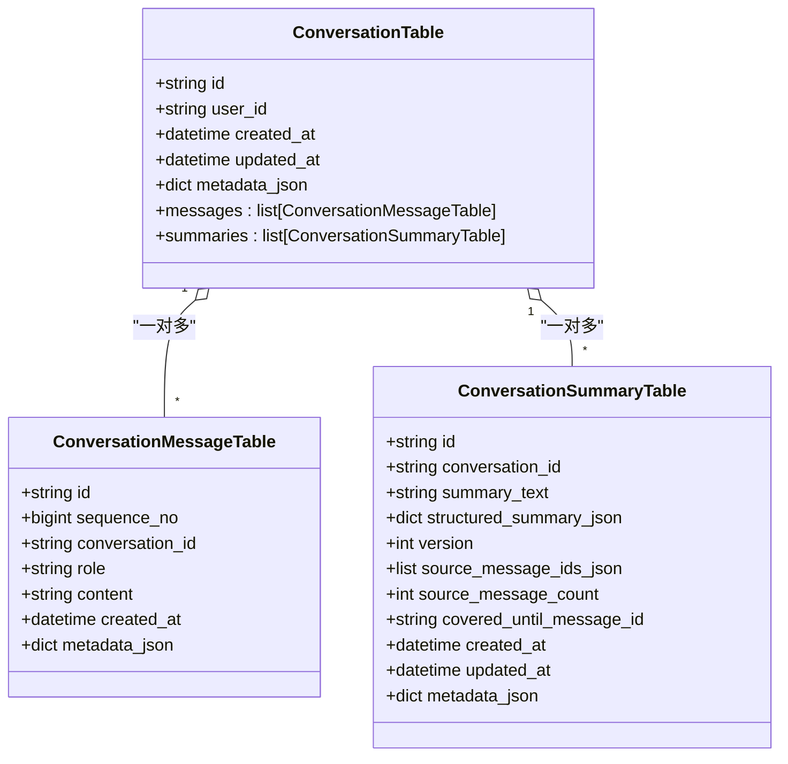
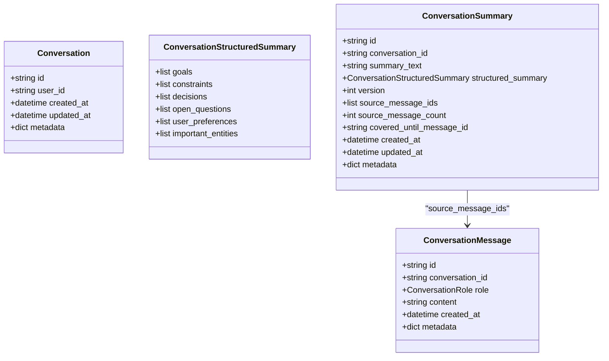
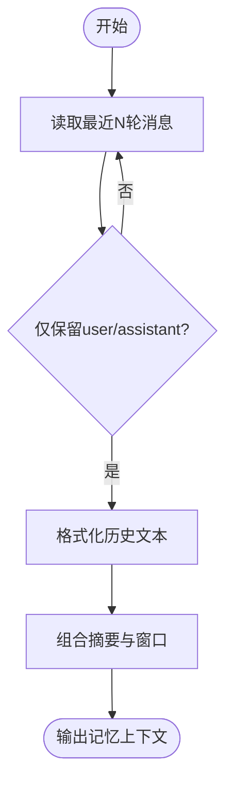
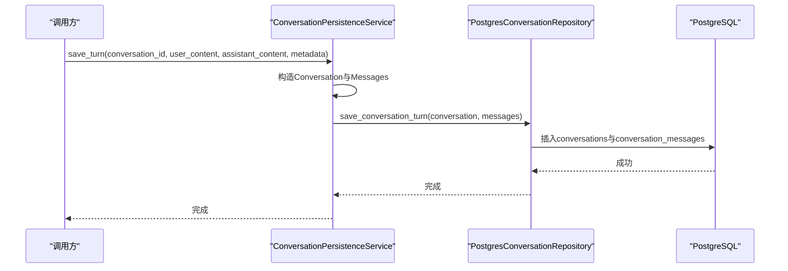
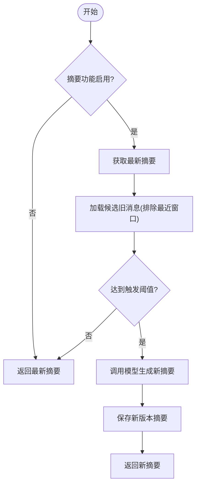
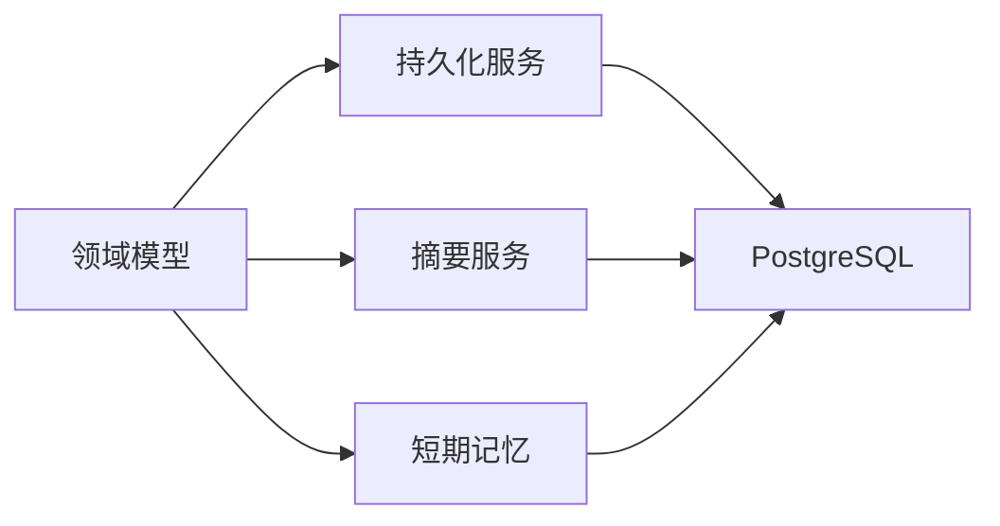

# 对话历史模型

<cite>
**本文引用的文件**
- [conversation_tables.py](file://python-agent-study/src/fast_app/db/conversation_tables.py)
- [conversation_models.py](file://python-agent-study/src/fast_app/domain/conversation_models.py)
- [conversation_memory.py](file://python-agent-study/src/fast_app/services/conversation/conversation_memory.py)
- [conversation_persistence.py](file://python-agent-study/src/fast_app/services/conversation/conversation_persistence.py)
- [conversation_history.py](file://python-agent-study/src/fast_app/services/conversation/conversation_history.py)
- [conversation_summary.py](file://python-agent-study/src/fast_app/services/conversation/conversation_summary.py)
- [20260624_0001_create_conversation_tables.py](file://python-agent-study/alembic/versions/20260624_0001_create_conversation_tables.py)
- [20260624_0002_create_conversation_summaries.py](file://python-agent-study/alembic/versions/20260624_0002_create_conversation_summaries.py)
</cite>

## 目录
1. [简介](#简介)
2. [项目结构](#项目结构)
3. [核心组件](#核心组件)
4. [架构总览](#架构总览)
5. [详细组件分析](#详细组件分析)
6. [依赖关系分析](#依赖关系分析)
7. [性能与优化](#性能与优化)
8. [故障排查指南](#故障排查指南)
9. [结论](#结论)
10. [附录：最佳实践](#附录最佳实践)

## 简介
本文件面向多轮对话系统的“对话历史模型”设计与实现，围绕 SQLAlchemy 2.0 的持久化模型、短期记忆（Redis）与长期持久化（PostgreSQL）协同机制展开。重点覆盖以下主题：
- 会话实体：ConversationTable、ConversationMessageTable、ConversationSummaryTable 的设计与关系。
- 生命周期管理：会话创建、消息追加、摘要生成、历史清理。
- 消息序列化与存储策略：文本、结构化数据、附件等类型的承载方式。
- 短期记忆与长期存储协同：Redis 最近窗口 + PostgreSQL 完整历史与摘要版本。
- 查询性能与分页：索引设计、时间窗口、序列号排序、分页策略。
- 开发者实践：如何构建和检索对话上下文，保证可追溯性与稳定性。

## 项目结构
对话历史相关代码分布在领域模型、数据库表定义、服务层与迁移脚本中：
- 领域模型：Pydantic 数据结构，用于跨层传输与校验。
- 数据库表：SQLAlchemy 2.0 ORM 映射，定义主键、外键、JSONB、索引等。
- 短期记忆：基于 Redis List 的消息队列，支持 TTL 与最大长度裁剪。
- 持久化服务：将一轮 user/assistant 对话落库，并维护会话元信息。
- 历史窗口与摘要：从短期记忆中读取最近 N 轮，必要时对窗口外旧消息进行压缩，形成带版本的可追溯摘要。
- 迁移脚本：Alembic 脚本确保数据库结构与 ORM 一致。

图表来源
- [conversation_models.py:39-115](file://python-agent-study/src/fast_app/domain/conversation_models.py#L39-L115)
- [conversation_memory.py:60-105](file://python-agent-study/src/fast_app/services/conversation/conversation_memory.py#L60-L105)
- [conversation_persistence.py:10-61](file://python-agent-study/src/fast_app/services/conversation/conversation_persistence.py#L10-L61)
- [conversation_summary.py:72-235](file://python-agent-study/src/fast_app/services/conversation/conversation_summary.py#L72-L235)
- [conversation_tables.py:24-171](file://python-agent-study/src/fast_app/db/conversation_tables.py#L24-L171)

章节来源
- [conversation_tables.py:24-171](file://python-agent-study/src/fast_app/db/conversation_tables.py#L24-L171)
- [conversation_models.py:39-115](file://python-agent-study/src/fast_app/domain/conversation_models.py#L39-L115)
- [conversation_memory.py:60-105](file://python-agent-study/src/fast_app/services/conversation/conversation_memory.py#L60-L105)
- [conversation_persistence.py:10-61](file://python-agent-study/src/fast_app/services/conversation/conversation_persistence.py#L10-L61)
- [conversation_summary.py:72-235](file://python-agent-study/src/fast_app/services/conversation/conversation_summary.py#L72-L235)

## 核心组件
- 领域模型
  - Conversation：会话容器，包含用户 ID、时间戳、扩展元数据。
  - ConversationMessage：单条消息，角色（user/assistant/system）、正文、时间戳、扩展元数据。
  - ConversationSummary：窗口外历史的可追溯摘要，含自然语言摘要、结构化摘要、版本号、来源消息 ID 列表、覆盖范围等。
- 短期记忆存储
  - InMemoryConversationMemoryStore：进程内内存存储，便于测试与最小闭环验证。
  - RedisConversationMemoryStore：基于 Redis List 的短期消息队列，支持 TTL 与最大消息数裁剪。
- 持久化服务
  - ConversationPersistenceService：封装一轮 user/assistant 对话的持久化逻辑，更新会话元信息。
- 摘要服务
  - ConversationSummaryService：根据配置与阈值触发摘要生成，增量更新版本，组合最近窗口与摘要形成 query rewrite 输入。
- 历史窗口与格式化
  - ConversationHistoryWindow / ConversationMemoryContext：封装最近窗口与格式化文本，供上层使用。

章节来源
- [conversation_models.py:39-115](file://python-agent-study/src/fast_app/domain/conversation_models.py#L39-L115)
- [conversation_memory.py:30-105](file://python-agent-study/src/fast_app/services/conversation/conversation_memory.py#L30-L105)
- [conversation_persistence.py:10-61](file://python-agent-study/src/fast_app/services/conversation/conversation_persistence.py#L10-L61)
- [conversation_summary.py:72-235](file://python-agent-study/src/fast_app/services/conversation/conversation_summary.py#L72-L235)
- [conversation_history.py:11-82](file://python-agent-study/src/fast_app/services/conversation/conversation_history.py#L11-L82)

## 架构总览
下图展示一次多轮对话从短期记忆到长期存储、再到摘要生成的整体流程。

图表来源
- [conversation_memory.py:80-105](file://python-agent-study/src/fast_app/services/conversation/conversation_memory.py#L80-L105)
- [conversation_persistence.py:20-61](file://python-agent-study/src/fast_app/services/conversation/conversation_persistence.py#L20-L61)
- [conversation_summary.py:140-218](file://python-agent-study/src/fast_app/services/conversation/conversation_summary.py#L140-L218)
- [conversation_tables.py:24-171](file://python-agent-study/src/fast_app/db/conversation_tables.py#L24-L171)

## 详细组件分析

### 数据库模型与关系
- 会话表 conversations
  - 主键 id；可选 user_id；created_at/updated_at；JSONB 元数据字段 metadata_json。
  - 通过 ORM 关系关联消息与摘要。
- 消息表 conversation_messages
  - 主键 id；自增 sequence_no；conversation_id 外键；role/content；created_at；JSONB 元数据。
  - 复合索引：按 conversation_id+created_at、conversation_id+sequence_no，优化时间窗口与顺序查询。
- 摘要表 conversation_summaries
  - 主键 id；conversation_id 外键；summary_text；structured_summary_json JSONB；version；source_message_ids_json JSONB；source_message_count；covered_until_message_id；created_at/updated_at；metadata_json。
  - 复合索引：conversation_id+version，便于获取最新版本。

图表来源
- [conversation_tables.py:24-171](file://python-agent-study/src/fast_app/db/conversation_tables.py#L24-L171)

章节来源
- [conversation_tables.py:24-171](file://python-agent-study/src/fast_app/db/conversation_tables.py#L24-L171)
- [20260624_0001_create_conversation_tables.py:20-86](file://python-agent-study/alembic/versions/20260624_0001_create_conversation_tables.py#L20-L86)
- [20260624_0002_create_conversation_summaries.py:20-85](file://python-agent-study/alembic/versions/20260624_0002_create_conversation_summaries.py#L20-L85)

### 领域模型与消息类型
- ConversationMessage：id、conversation_id、role、content、created_at、metadata。
  - 支持文本内容；结构化数据与附件可通过 metadata 字段承载（例如 JSON 描述或引用路径）。
- Conversation：id、user_id、created_at、updated_at、metadata。
- ConversationSummary：id、conversation_id、summary_text、structured_summary、version、source_message_ids、source_message_count、covered_until_message_id、created_at、updated_at、metadata。
  - structured_summary 为结构化摘要，便于 Agent 稳定读取目标、约束、决策、开放问题、偏好、重要实体等。

图表来源
- [conversation_models.py:39-115](file://python-agent-study/src/fast_app/domain/conversation_models.py#L39-L115)

章节来源
- [conversation_models.py:39-115](file://python-agent-study/src/fast_app/domain/conversation_models.py#L39-L115)

### 短期记忆（Redis）与历史窗口
- RedisConversationMemoryStore
  - 以 conversation:{conversation_id}:messages 作为 List key。
  - append_message：rpush 消息 JSON，ltrim 限制最大消息数，expire 设置 TTL。
  - list_recent_messages：lrange 取最近 N 条，反序列化为 ConversationMessage。
- load_recent_history_window
  - 从 store 读取最近 max_turns*2 条消息，过滤 user/assistant 角色，格式化文本。
- build_conversation_memory_context
  - 组合摘要与最近窗口，输出统一格式化的记忆上下文，供 query rewrite 使用。

图表来源
- [conversation_memory.py:80-105](file://python-agent-study/src/fast_app/services/conversation/conversation_memory.py#L80-L105)
- [conversation_history.py:85-107](file://python-agent-study/src/fast_app/services/conversation/conversation_history.py#L85-L107)
- [conversation_history.py:47-82](file://python-agent-study/src/fast_app/services/conversation/conversation_history.py#L47-L82)

章节来源
- [conversation_memory.py:60-105](file://python-agent-study/src/fast_app/services/conversation/conversation_memory.py#L60-L105)
- [conversation_history.py:47-107](file://python-agent-study/src/fast_app/services/conversation/conversation_history.py#L47-L107)

### 持久化服务（PostgreSQL）
- ConversationPersistenceService.save_turn
  - 构造 Conversation（更新 updated_at、记录 last_query_rewrite_reason、last_source_count 等元数据）。
  - 构造两条 ConversationMessage（user、assistant），附带 metadata。
  - 调用 repository.save_conversation_turn 写入数据库。

图表来源
- [conversation_persistence.py:20-61](file://python-agent-study/src/fast_app/services/conversation/conversation_persistence.py#L20-L61)
- [conversation_tables.py:24-105](file://python-agent-study/src/fast_app/db/conversation_tables.py#L24-L105)

章节来源
- [conversation_persistence.py:20-61](file://python-agent-study/src/fast_app/services/conversation/conversation_persistence.py#L20-L61)
- [conversation_tables.py:24-105](file://python-agent-study/src/fast_app/db/conversation_tables.py#L24-L105)

### 摘要生成与版本管理
- ConversationSummaryService.maybe_update_summary
  - 检查是否启用摘要功能。
  - 获取最新摘要，计算候选消息数量（排除最近窗口）。
  - 若达到触发阈值，调用 _generate_summary 生成新版本摘要，并保存。
- _generate_summary
  - 调用 LCEL 链（优先 json_mode 结构化输出，失败回退普通文本解析）。
  - 组装 ConversationSummary，递增 version，记录 source_message_ids、covered_until_message_id。
- 降级与容错
  - 模型不可用或结构化输出失败时，记录日志并返回已有摘要。

图表来源
- [conversation_summary.py:140-218](file://python-agent-study/src/fast_app/services/conversation/conversation_summary.py#L140-L218)
- [conversation_summary.py:238-318](file://python-agent-study/src/fast_app/services/conversation/conversation_summary.py#L238-L318)

章节来源
- [conversation_summary.py:140-218](file://python-agent-study/src/fast_app/services/conversation/conversation_summary.py#L140-L218)
- [conversation_summary.py:238-318](file://python-agent-study/src/fast_app/services/conversation/conversation_summary.py#L238-L318)

### 消息序列化与存储策略
- 文本消息：直接存储在 content 字段。
- 结构化数据：通过 metadata JSONB 字段承载，例如工具调用结果、参数、状态码等。
- 附件：建议以 metadata 中的引用路径或对象标识存储，避免在消息正文中嵌入大二进制数据。
- 短期记忆：Redis List 存储消息 JSON，支持 TTL 与最大长度裁剪，适合快速读写的最近窗口。
- 长期持久化：PostgreSQL JSONB 与 Text 字段结合，配合索引优化查询与时间窗口管理。

章节来源
- [conversation_models.py:39-115](file://python-agent-study/src/fast_app/domain/conversation_models.py#L39-L115)
- [conversation_memory.py:80-105](file://python-agent-study/src/fast_app/services/conversation/conversation_memory.py#L80-L105)
- [conversation_tables.py:60-105](file://python-agent-study/src/fast_app/db/conversation_tables.py#L60-L105)

## 依赖关系分析
- 领域模型被短期记忆、持久化服务、摘要服务共同使用，保证跨层一致性。
- 短期记忆与持久化服务解耦：短期记忆负责最近窗口，持久化服务负责完整历史。
- 摘要服务依赖持久化仓库读取旧消息，并写回摘要版本。
- 数据库表通过外键与级联删除保持数据一致性。

图表来源
- [conversation_models.py:39-115](file://python-agent-study/src/fast_app/domain/conversation_models.py#L39-L115)
- [conversation_memory.py:60-105](file://python-agent-study/src/fast_app/services/conversation/conversation_memory.py#L60-L105)
- [conversation_persistence.py:20-61](file://python-agent-study/src/fast_app/services/conversation/conversation_persistence.py#L20-L61)
- [conversation_summary.py:140-218](file://python-agent-study/src/fast_app/services/conversation/conversation_summary.py#L140-L218)

章节来源
- [conversation_models.py:39-115](file://python-agent-study/src/fast_app/domain/conversation_models.py#L39-L115)
- [conversation_memory.py:60-105](file://python-agent-study/src/fast_app/services/conversation/conversation_memory.py#L60-L105)
- [conversation_persistence.py:20-61](file://python-agent-study/src/fast_app/services/conversation/conversation_persistence.py#L20-L61)
- [conversation_summary.py:140-218](file://python-agent-study/src/fast_app/services/conversation/conversation_summary.py#L140-L218)

## 性能与优化
- 索引设计
  - conversation_messages：按 conversation_id+created_at 与 conversation_id+sequence_no 建立复合索引，优化时间窗口与顺序查询。
  - conversation_summaries：按 conversation_id+version 建立复合索引，快速获取最新版本。
- 时间窗口管理
  - 短期记忆：Redis List 的 ltrim 控制最大消息数，TTL 自动过期。
  - 摘要触发：根据 memory_history_max_turns 与 summary_memory_trigger_messages 计算候选消息，排除最近窗口后决定是否生成新摘要。
- 分页策略
  - 近期消息：使用 limit 与负索引（-limit）读取最近 N 条。
  - 旧消息：使用 after_message_id 与 limit 分页加载，避免全量扫描。
- 查询优化
  - 只加载必要字段，减少 JSONB 体积。
  - 使用 sequence_no 或 created_at 排序，保证顺序一致性。
- 并发与锁
  - 内存存储使用 asyncio.Lock 保护临界区。
  - Redis 使用 pipeline 批量操作，降低网络往返。

章节来源
- [conversation_tables.py:94-105](file://python-agent-study/src/fast_app/db/conversation_tables.py#L94-L105)
- [conversation_tables.py:164-170](file://python-agent-study/src/fast_app/db/conversation_tables.py#L164-L170)
- [conversation_memory.py:80-105](file://python-agent-study/src/fast_app/services/conversation/conversation_memory.py#L80-L105)
- [conversation_summary.py:163-187](file://python-agent-study/src/fast_app/services/conversation/conversation_summary.py#L163-L187)

## 故障排查指南
- 摘要模型不可用
  - 现象：maybe_update_summary 返回已有摘要，日志记录 model_unavailable。
  - 处理：检查 settings.summary_memory_enabled、llm_provider、openai_api_key 配置。
- 结构化输出失败
  - 现象：structured_output_failed 警告，回退到普通文本解析。
  - 处理：确认模型支持 json_mode，或调整 prompt 与 schema。
- 消息顺序异常
  - 现象：对话顺序不一致。
  - 处理：检查 sequence_no 与 created_at 索引，确认排序字段一致。
- 历史窗口过大或过小
  - 现象：query rewrite 效果不稳定。
  - 处理：调整 memory_history_max_turns 与 summary_memory_trigger_messages。

章节来源
- [conversation_summary.py:147-161](file://python-agent-study/src/fast_app/services/conversation/conversation_summary.py#L147-L161)
- [conversation_summary.py:299-318](file://python-agent-study/src/fast_app/services/conversation/conversation_summary.py#L299-L318)
- [conversation_tables.py:94-105](file://python-agent-study/src/fast_app/db/conversation_tables.py#L94-L105)

## 结论
该对话历史模型通过 SQLAlchemy 2.0 的 ORM 设计、Redis 短期记忆与 PostgreSQL 长期持久化的协同，实现了高效、可扩展的多轮对话上下文管理。摘要服务提供可追溯的版本化压缩，结合时间窗口与索引优化，满足高吞吐与低延迟的查询需求。开发者应遵循消息序列化规范、合理配置窗口与阈值，并在异常场景下利用日志与降级策略保障系统稳定性。

## 附录：最佳实践
- 消息类型承载
  - 文本：content 字段。
  - 结构化数据：metadata JSONB，明确字段命名与版本。
  - 附件：metadata 引用路径或对象标识，避免正文嵌入大二进制。
- 会话创建与初始化
  - 使用 new_conversation_id 生成唯一会话 ID，记录 user_id 与初始 metadata。
- 消息追加
  - 短期记忆：append_message 使用 pipeline 批量写入，设置 TTL 与最大长度。
  - 长期持久化：save_turn 同时写入 user 与 assistant 消息，更新会话元数据。
- 摘要生成
  - 合理设置 memory_history_max_turns 与 summary_memory_trigger_messages，平衡上下文长度与摘要频率。
  - 使用 structured_summary 稳定提取目标、约束、决策、开放问题、偏好、重要实体。
- 查询与分页
  - 使用 conversation_id+created_at 或 sequence_no 排序，limit 分页。
  - 旧消息加载使用 after_message_id 与 limit，避免全量扫描。
- 错误处理
  - 模型不可用或结构化输出失败时，记录日志并返回已有摘要。
  - 监控 Redis 与 PostgreSQL 的连接与超时，设置重试与降级策略。

章节来源
- [conversation_models.py:13-25](file://python-agent-study/src/fast_app/domain/conversation_models.py#L13-L25)
- [conversation_memory.py:80-105](file://python-agent-study/src/fast_app/services/conversation/conversation_memory.py#L80-L105)
- [conversation_persistence.py:20-61](file://python-agent-study/src/fast_app/services/conversation/conversation_persistence.py#L20-L61)
- [conversation_summary.py:140-218](file://python-agent-study/src/fast_app/services/conversation/conversation_summary.py#L140-L218)
- [conversation_tables.py:94-105](file://python-agent-study/src/fast_app/db/conversation_tables.py#L94-L105)
- [conversation_tables.py:164-170](file://python-agent-study/src/fast_app/db/conversation_tables.py#L164-L170)