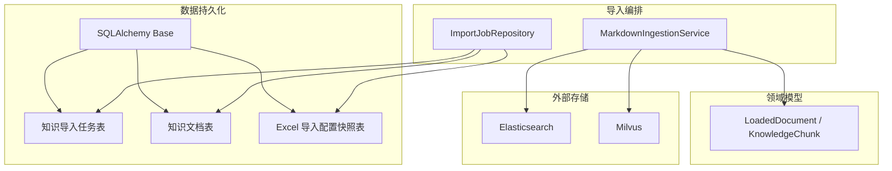
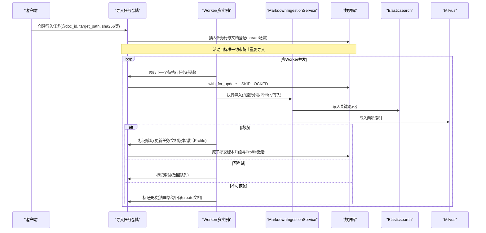
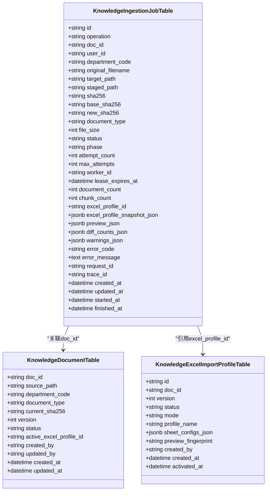
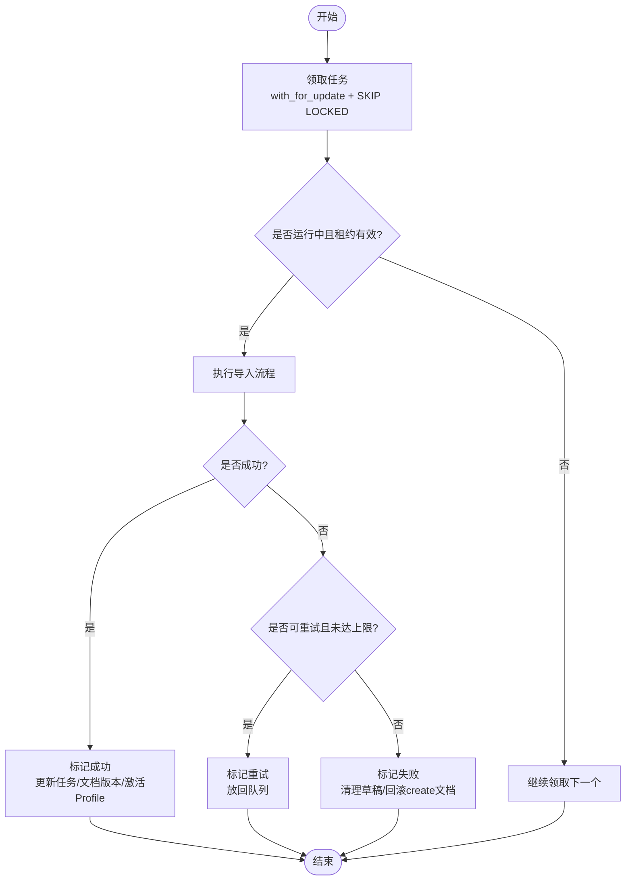
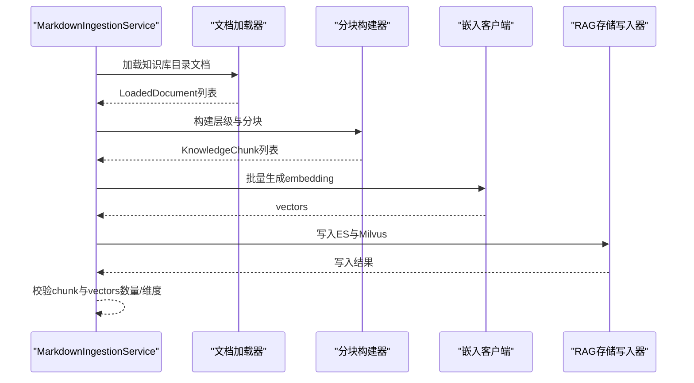
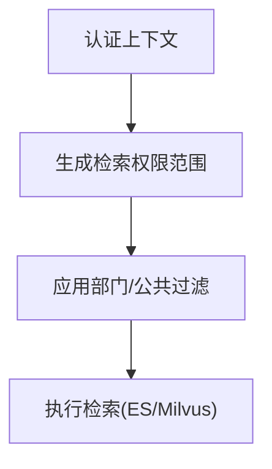
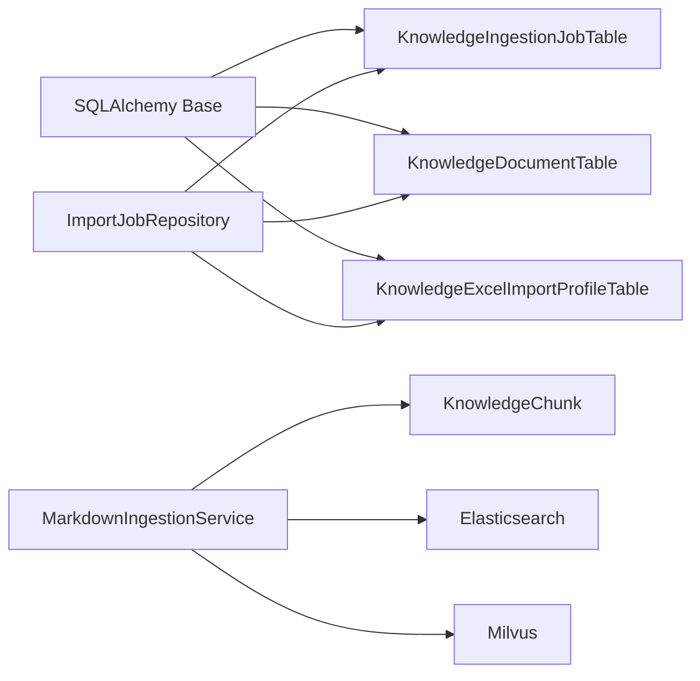

# 文档导入模型

<cite>
**本文引用的文件**
- [ingestion_tables.py](file://src/fast_app/db/ingestion_tables.py)
- [base.py](file://src/fast_app/db/base.py)
- [import_jobs.py](file://src/fast_app/import_jobs.py)
- [knowledge_models.py](file://src/fast_app/domain/knowledge_models.py)
- [markdown_ingestion_service.py](file://src/fast_app/ingestion/markdown_ingestion_service.py)
- [knowledge_permissions.py](file://src/fast_app/domain/knowledge_permissions.py)
- [20260714_0007_create_knowledge_ingestion_jobs.py](file://alembic/versions/20260714_0007_create_knowledge_ingestion_jobs.py)
</cite>

## 目录
1. [简介](#简介)
2. [项目结构](#项目结构)
3. [核心组件](#核心组件)
4. [架构总览](#架构总览)
5. [详细组件分析](#详细组件分析)
6. [依赖关系分析](#依赖关系分析)
7. [性能与扩展建议](#性能与扩展建议)
8. [故障排查指南](#故障排查指南)
9. [结论](#结论)

## 简介
本文件面向“知识文档导入”的数据模型与处理流程，重点说明基于 SQLAlchemy 2.0 的表模型设计、文档版本管理、批量导入作业的状态机与并发控制、权限继承与访问控制的数据支撑，以及大文件处理、并发导入控制、存储空间管理与可扩展性优化。目标是帮助开发者理解并安全扩展文档导入管道。

## 项目结构
围绕文档导入的核心代码分布在以下位置：
- 数据模型与迁移：SQLAlchemy 表定义位于 db 层，迁移脚本位于 alembic 版本目录。
- 领域模型：用于描述加载后的文档、切片（chunk）等中间数据结构。
- 导入任务仓储与状态机：封装任务的创建、领取、续租、重试、完成与失败清理。
- 文档处理服务：Markdown 导入主编排流程，负责加载、分块、向量化与双写存储。
- 权限范围模型：为检索阶段提供部门级权限过滤的数据契约。

图表来源
- [base.py:1-8](file://src/fast_app/db/base.py#L1-L8)
- [ingestion_tables.py:24-120](file://src/fast_app/db/ingestion_tables.py#L24-L120)
- [ingestion_tables.py:123-196](file://src/fast_app/db/ingestion_tables.py#L123-L196)
- [markdown_ingestion_service.py:32-142](file://src/fast_app/ingestion/markdown_ingestion_service.py#L32-L142)
- [import_jobs.py:86-525](file://src/fast_app/import_jobs.py#L86-L525)

章节来源
- [base.py:1-8](file://src/fast_app/db/base.py#L1-L8)
- [ingestion_tables.py:24-196](file://src/fast_app/db/ingestion_tables.py#L24-L196)
- [import_jobs.py:86-525](file://src/fast_app/import_jobs.py#L86-L525)
- [markdown_ingestion_service.py:32-142](file://src/fast_app/ingestion/markdown_ingestion_service.py#L32-L142)

## 核心组件
- 知识导入任务表（KnowledgeIngestionJobTable）：记录一次导入作业的输入、目标路径、哈希、类型、大小、状态、阶段、重试次数、租约信息、结果统计、警告与错误、追踪信息等。支持活动目标唯一约束，避免同一路径并发冲突。
- 知识文档表（KnowledgeDocumentTable）：维护服务端文档身份、目标路径、当前已提交版本、活跃 Excel Profile 指针、创建/更新人与时间戳。
- Excel 导入配置快照表（KnowledgeExcelImportProfileTable）：保存用户确认的字段映射、模式、工作表配置快照及预览指纹，支持版本化与激活/替代状态。
- 导入任务仓储（KnowledgeImportJobRepository）：封装任务生命周期操作，包括创建、查询、领取、续租、阶段推进、成功/重试/失败标记、Excel 配置确认与草稿管理等。
- 领域模型（LoadedDocument、KnowledgeChunk 等）：描述加载后的原始文档与切分后的片段，承载内容、标题、来源、元数据与可选检索文本。
- Markdown 导入服务（MarkdownIngestionService）：编排加载、层级构建、分块、向量化、写入 ES/Milvus 的统一流程，并提供结果汇总。

章节来源
- [ingestion_tables.py:24-196](file://src/fast_app/db/ingestion_tables.py#L24-L196)
- [import_jobs.py:86-525](file://src/fast_app/import_jobs.py#L86-L525)
- [knowledge_models.py:8-109](file://src/fast_app/domain/knowledge_models.py#L8-L109)
- [markdown_ingestion_service.py:32-142](file://src/fast_app/ingestion/markdown_ingestion_service.py#L32-L142)

## 架构总览
下图展示从上传到入库的端到端流程，包含任务创建、并发领取、分块与向量化、双写存储与版本升级。

图表来源
- [import_jobs.py:94-158](file://src/fast_app/import_jobs.py#L94-L158)
- [import_jobs.py:297-338](file://src/fast_app/import_jobs.py#L297-L338)
- [import_jobs.py:379-452](file://src/fast_app/import_jobs.py#L379-L452)
- [import_jobs.py:454-525](file://src/fast_app/import_jobs.py#L454-L525)
- [markdown_ingestion_service.py:73-142](file://src/fast_app/ingestion/markdown_ingestion_service.py#L73-L142)

## 详细组件分析

### 数据模型与版本管理
- 知识导入任务表
  - 关键字段：id、operation、doc_id、user_id、department_code、original_filename、target_path、staged_path、sha256、base_sha256、new_sha256、document_type、file_size、status、phase、attempt_count、max_attempts、worker_id、lease_expires_at、document_count、chunk_count、excel_profile_id、excel_profile_snapshot_json、preview_json、diff_counts_json、warnings_json、error_code、error_message、request_id、trace_id、created_at、updated_at、started_at、finished_at。
  - 关键约束：针对 target_path 的活动任务唯一索引，限制 pending/running/awaiting_configuration 状态下的并发冲突。
  - 用途：跟踪单次导入的全生命周期，支持重试、续租、进度上报与审计。

- 知识文档表
  - 关键字段：doc_id、source_path、department_code、document_type、current_sha256、version、status、active_excel_profile_id、created_by、updated_by、created_at、updated_at。
  - 用途：维护服务端文档身份与当前活跃版本；通过 version 与 current_sha256 实现乐观版本控制。

- Excel 导入配置快照表
  - 关键字段：id、doc_id、version、status、mode、profile_name、sheet_configs_json、preview_fingerprint、created_by、created_at、activated_at。
  - 用途：保存用户确认的导入配置快照，支持版本化与激活/替代状态切换。

图表来源
- [ingestion_tables.py:24-120](file://src/fast_app/db/ingestion_tables.py#L24-L120)
- [ingestion_tables.py:123-196](file://src/fast_app/db/ingestion_tables.py#L123-L196)

章节来源
- [ingestion_tables.py:24-196](file://src/fast_app/db/ingestion_tables.py#L24-L196)
- [20260714_0007_create_knowledge_ingestion_jobs.py:21-78](file://alembic/versions/20260714_0007_create_knowledge_ingestion_jobs.py#L21-L78)

### 批量导入作业的状态机与并发控制
- 状态与阶段
  - 状态：pending、running、awaiting_configuration、succeeded、failed。
  - 阶段：queued、profiling、completed 等细粒度进度。
- 并发与租约
  - 使用 with_for_update(skip_locked=True) 进行无阻塞行级领取。
  - 租约过期时间 lease_expires_at 配合 worker_id 保证任务归属与崩溃恢复。
  - 活动目标唯一约束防止同一路径同时存在多个活动任务。
- 重试机制
  - attempt_count 与 max_attempts 控制最大重试次数。
  - 可重试错误将任务重新置为 pending；耗尽重试的任务仍允许被领取一次以清理产物并落为 failed。
- 成功与失败
  - 成功时原子更新任务、文档版本与 Excel Profile 激活状态。
  - 失败时清理草稿 Profile，并在 create 场景下删除未激活的文档登记。

图表来源
- [import_jobs.py:297-338](file://src/fast_app/import_jobs.py#L297-L338)
- [import_jobs.py:379-452](file://src/fast_app/import_jobs.py#L379-L452)
- [import_jobs.py:454-525](file://src/fast_app/import_jobs.py#L454-L525)

章节来源
- [import_jobs.py:297-338](file://src/fast_app/import_jobs.py#L297-L338)
- [import_jobs.py:379-452](file://src/fast_app/import_jobs.py#L379-L452)
- [import_jobs.py:454-525](file://src/fast_app/import_jobs.py#L454-L525)

### 文档版本管理：原始存储、分块、元数据与版本控制
- 原始文档存储
  - 通过 staged_path 与 target_path 区分暂存与最终目标路径，结合 sha256/base_sha256/new_sha256 保障一致性。
- 分块处理
  - MarkdownIngestionService 负责加载文档、构建层级、切分为 KnowledgeChunk，并为每个 chunk 生成 embedding。
  - 支持父子分块策略与 legacy 分块策略，统一输出 KnowledgeChunk 列表。
- 元数据提取
  - LoadedDocument/KnowledgeChunk 携带 metadata，包含来源、标题、部门权限等信息，便于后续检索与溯源。
- 版本控制
  - 成功提交时递增文档 version，更新 current_sha256 与 status，并激活最新 Excel Profile（如适用）。
  - 失败或冲突时回滚或清理中间状态，确保数据一致。

图表来源
- [markdown_ingestion_service.py:73-142](file://src/fast_app/ingestion/markdown_ingestion_service.py#L73-L142)
- [knowledge_models.py:8-109](file://src/fast_app/domain/knowledge_models.py#L8-L109)

章节来源
- [markdown_ingestion_service.py:73-142](file://src/fast_app/ingestion/markdown_ingestion_service.py#L73-L142)
- [knowledge_models.py:8-109](file://src/fast_app/domain/knowledge_models.py#L8-L109)

### 权限继承与访问控制的数据模型支持
- 检索权限范围模型（RetrievalPermissionScope）
  - can_read_all：是否允许读取全部知识库文档。
  - user_id：当前检索用户 ID，用于私有文档或审计扩展。
  - department_codes：用户可读取的部门 code 列表，会下推到检索过滤条件。
  - allow_public：是否允许读取公共范围文档。
- 数据模型支撑
  - 文档与任务均绑定 department_code，便于在检索阶段按部门过滤。
  - 通过权限范围模型在服务端转换为检索条件，实现部门级可见性与公共文档的灵活组合。

图表来源
- [knowledge_permissions.py:4-16](file://src/fast_app/domain/knowledge_permissions.py#L4-L16)
- [ingestion_tables.py:123-136](file://src/fast_app/db/ingestion_tables.py#L123-L136)

章节来源
- [knowledge_permissions.py:4-16](file://src/fast_app/domain/knowledge_permissions.py#L4-L16)
- [ingestion_tables.py:123-136](file://src/fast_app/db/ingestion_tables.py#L123-L136)

## 依赖关系分析
- 表模型依赖 SQLAlchemy DeclarativeBase，所有表共享基类。
- 导入任务仓储依赖表模型与异步会话，封装事务边界与并发控制。
- Markdown 导入服务依赖领域模型、嵌入客户端与存储客户端，不直接耦合底层存储细节。
- 迁移脚本确保数据库结构与表索引与代码模型一致。

图表来源
- [base.py:1-8](file://src/fast_app/db/base.py#L1-L8)
- [ingestion_tables.py:24-196](file://src/fast_app/db/ingestion_tables.py#L24-L196)
- [import_jobs.py:86-525](file://src/fast_app/import_jobs.py#L86-L525)
- [markdown_ingestion_service.py:32-142](file://src/fast_app/ingestion/markdown_ingestion_service.py#L32-L142)

章节来源
- [base.py:1-8](file://src/fast_app/db/base.py#L1-L8)
- [ingestion_tables.py:24-196](file://src/fast_app/db/ingestion_tables.py#L24-L196)
- [import_jobs.py:86-525](file://src/fast_app/import_jobs.py#L86-L525)
- [markdown_ingestion_service.py:32-142](file://src/fast_app/ingestion/markdown_ingestion_service.py#L32-L142)

## 性能与扩展建议
- 大文件处理优化
  - 使用 staged_path 与 target_path 分离暂存与最终路径，避免长事务占用资源。
  - 对 Office 文档（PPTX/XLSX）采用专用 Loader/Builder，减少内存峰值。
  - 在 MarkdownIngestionService 中先校验 embedding 数量与维度，提前拦截不一致导致的写入失败。
- 并发导入控制
  - 利用 with_for_update(skip_locked=True) 提升多 Worker 并发领取效率。
  - 设置合理的 LEASE_SECONDS 与 HEARTBEAT_SECONDS，平衡任务抢占与心跳开销。
  - 通过活动目标唯一约束避免同一路径重复导入。
- 存储空间管理
  - 记录 document_count、chunk_count 与 diff_counts_json，便于容量规划与增量重建。
  - 使用 JSONB 字段存储预览、警告与差异计数，降低额外表结构复杂度。
- 扩展指南
  - 新增文档类型：扩展 DocumentType 与 Loader/Builder，复用现有分块与写入流程。
  - 新增权限维度：在 RetrievalPermissionScope 中扩展过滤条件，并在检索层应用。
  - 自定义重试策略：根据错误码分类，调整 mark_retry 与 mark_failed 的行为。
- 调优建议
  - 调整 chunk 大小与重叠参数，平衡检索精度与索引体积。
  - 合理设置 max_attempts 与并发 Worker 数，避免数据库与外部服务过载。
  - 监控 ES/Milvus 写入延迟与失败率，必要时引入降级与重试队列。

[本节为通用指导，不直接分析具体文件]

## 故障排查指南
- 常见错误与定位
  - 任务冲突：同名文档已有活动导入任务或同一路径存在活动任务，检查活动目标唯一约束与状态。
  - 预览变更：Excel 预览指纹变化导致确认失败，需刷新后重新确认。
  - 版本冲突：客户端基于的文档版本已经不是数据库中的活动版本，需拉取最新版本后重试。
  - 文件过大：分块读取发现实际大小超过上传上限，检查上传限制与流式处理。
  - 维度不匹配：embedding 维度与配置不一致，导致 Milvus 写入失败，检查嵌入模型与 settings.embedding_dim。
- 排查步骤
  - 查看任务状态与阶段：pending/running/awaiting_configuration/succeeded/failed。
  - 检查租约与 worker_id：确认任务是否被正确领取与续租。
  - 核对文档版本与哈希：对比 current_sha256 与 job.sha256/base_sha256/new_sha256。
  - 审查警告与错误：warnings_json、error_code、error_message 提供详细线索。
  - 验证存储写入：ES 成功计数与 Milvus 插入详情，定位写入失败原因。

章节来源
- [import_jobs.py:29-75](file://src/fast_app/import_jobs.py#L29-L75)
- [import_jobs.py:379-452](file://src/fast_app/import_jobs.py#L379-L452)
- [import_jobs.py:454-525](file://src/fast_app/import_jobs.py#L454-L525)
- [markdown_ingestion_service.py:144-165](file://src/fast_app/ingestion/markdown_ingestion_service.py#L144-L165)

## 结论
本方案通过 SQLAlchemy 2.0 表模型与导入任务仓储实现了稳健的知识文档导入管道：具备清晰的版本控制、细粒度的状态与阶段跟踪、可靠的并发控制与重试机制，以及面向检索的权限过滤数据支撑。结合 MarkdownIngestionService 的分块与双写流程，系统在大文件处理、并发导入与存储空间管理方面具备良好的扩展性与调优空间。开发者可在此基础上按需扩展文档类型、权限维度与重试策略，持续提升导入管道的稳定性与性能。