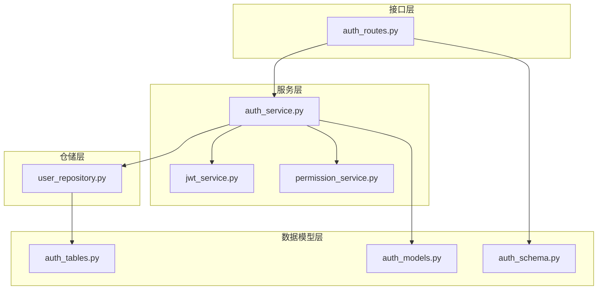
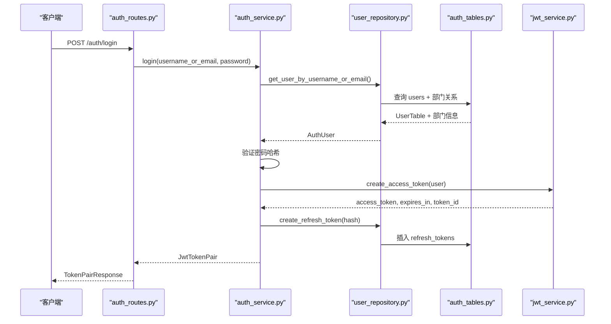
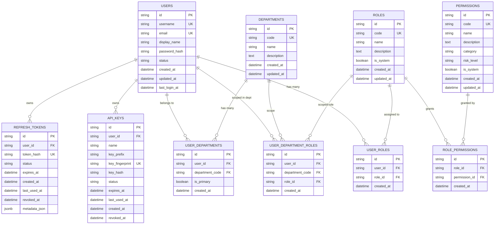
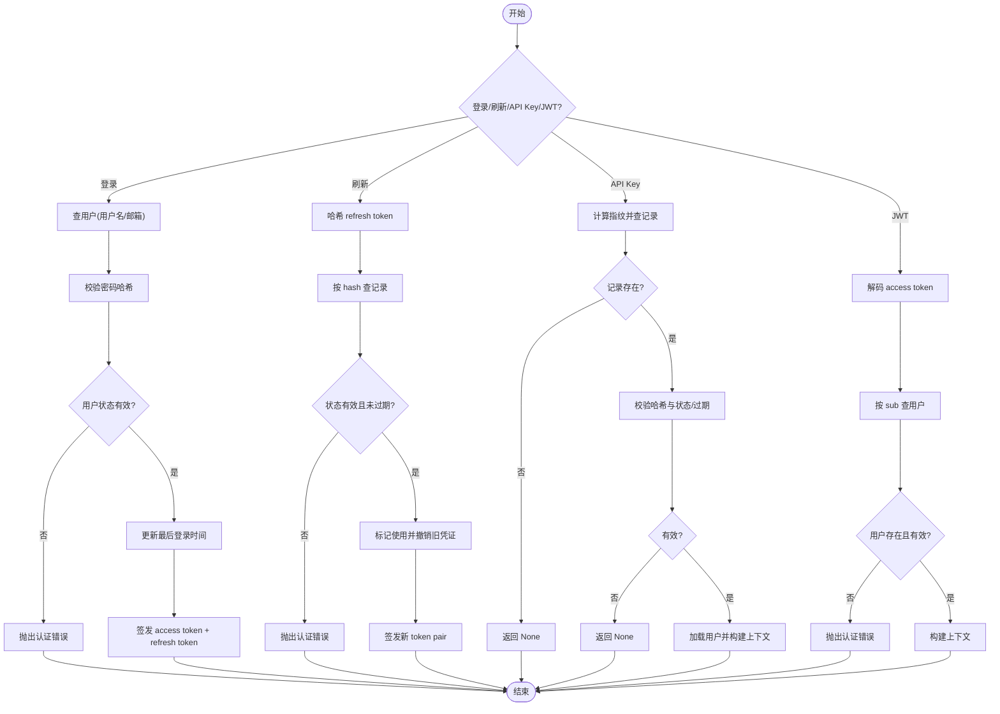
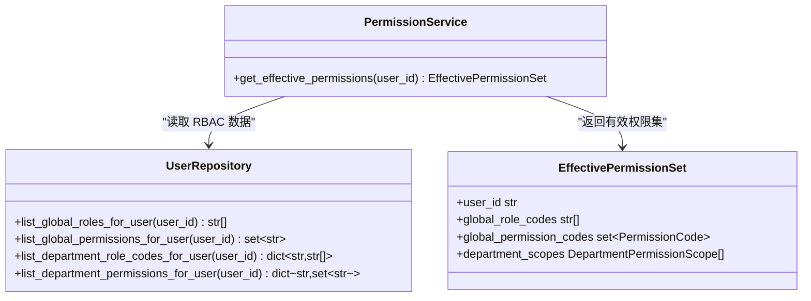
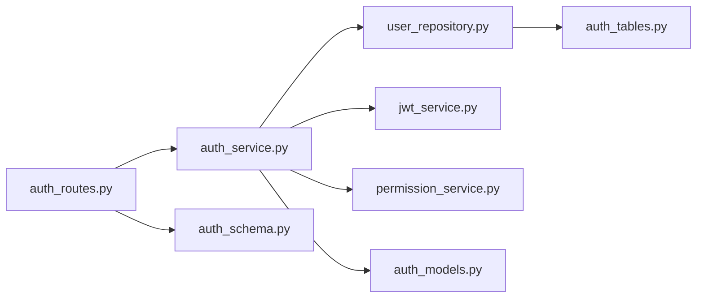

# 认证授权模型

<cite>
**本文引用的文件**
- [auth_tables.py](file://src/fast_app/db/auth_tables.py)
- [auth_models.py](file://src/fast_app/domain/auth_models.py)
- [auth_schema.py](file://src/fast_app/schemas/auth_schema.py)
- [auth_routes.py](file://src/fast_app/api/auth_routes.py)
- [auth_service.py](file://src/fast_app/services/auth/auth_service.py)
- [jwt_service.py](file://src/fast_app/services/auth/jwt_service.py)
- [user_repository.py](file://src/fast_app/services/auth/user_repository.py)
- [permission_service.py](file://src/fast_app/services/auth/permission_service.py)
</cite>

## 目录
1. [简介](#简介)
2. [项目结构](#项目结构)
3. [核心组件](#核心组件)
4. [架构总览](#架构总览)
5. [详细组件分析](#详细组件分析)
6. [依赖关系分析](#依赖关系分析)
7. [性能与索引优化](#性能与索引优化)
8. [故障排查指南](#故障排查指南)
9. [结论](#结论)
10. [附录：扩展与安全最佳实践](#附录：扩展与安全最佳实践)

## 简介
本文件面向开发者，系统化说明本项目基于 SQLAlchemy 2.0 声明式模型的认证与授权设计。内容覆盖用户、部门、角色、权限等核心实体，多对多关系映射，RBAC 权限模型（全局角色与部门级角色），以及 API Key 与 Refresh Token 的安全存储机制（哈希、指纹、过期管理）。同时提供索引策略、外键约束与级联删除规则说明，并给出权限扩展指南与安全最佳实践。

## 项目结构
认证授权相关代码按职责分层组织：
- 数据模型层：SQLAlchemy 表定义位于 db/auth_tables.py
- 领域模型层：Pydantic 领域对象位于 domain/auth_models.py
- 接口契约层：请求/响应 Schema 位于 schemas/auth_schema.py
- 路由层：FastAPI 路由位于 api/auth_routes.py
- 服务层：认证业务逻辑位于 services/auth/auth_service.py，JWT 签发校验在 jwt_service.py，权限计算在 permission_service.py
- 仓储层：数据库访问封装在 user_repository.py

图表来源
- [auth_routes.py:1-112](file://src/fast_app/api/auth_routes.py#L1-L112)
- [auth_service.py:35-327](file://src/fast_app/services/auth/auth_service.py#L35-L327)
- [jwt_service.py:13-89](file://src/fast_app/services/auth/jwt_service.py#L13-L89)
- [permission_service.py:11-64](file://src/fast_app/services/auth/permission_service.py#L11-L64)
- [user_repository.py:27-380](file://src/fast_app/services/auth/user_repository.py#L27-L380)
- [auth_tables.py:13-431](file://src/fast_app/db/auth_tables.py#L13-L431)
- [auth_models.py:9-158](file://src/fast_app/domain/auth_models.py#L9-L158)
- [auth_schema.py:8-123](file://src/fast_app/schemas/auth_schema.py#L8-L123)

章节来源
- [auth_routes.py:1-112](file://src/fast_app/api/auth_routes.py#L1-L112)
- [auth_service.py:35-327](file://src/fast_app/services/auth/auth_service.py#L35-L327)
- [auth_tables.py:13-431](file://src/fast_app/db/auth_tables.py#L13-L431)

## 核心组件
- 用户与部门
  - 用户表 users：包含用户名、邮箱、密码哈希、状态、时间戳等字段，并通过关系持有 API Key、Refresh Token、部门关联、全局角色与部门角色。
  - 部门表 departments：部门编码、名称、描述等。
  - 用户-部门多对多：通过 user_departments 表维护，支持主部门标记 is_primary。
- 角色与权限
  - 角色表 roles：角色编码、名称、描述、是否系统内置。
  - 权限表 permissions：权限编码、名称、分类、风险等级、是否系统内置。
  - 角色-权限多对多：role_permissions 表。
- 用户与角色
  - 用户全局角色：user_roles 表，表示用户在全局范围的角色。
  - 用户在部门内的作用域角色：user_department_roles 表，表示用户在特定部门的角色。
- 凭证安全存储
  - API Key：仅保存 key_prefix、key_fingerprint、key_hash，不保存明文；支持状态、过期时间、最近使用时间、撤销时间。
  - Refresh Token：仅保存 token_hash，支持状态、过期时间、最近使用时间、撤销时间与元数据 JSONB。

章节来源
- [auth_tables.py:13-431](file://src/fast_app/db/auth_tables.py#L13-L431)
- [auth_models.py:9-158](file://src/fast_app/domain/auth_models.py#L9-L158)

## 架构总览
认证流程以 AuthService 为核心，统一处理登录、刷新、API Key 认证、JWT 认证，并构建统一的 CurrentUserContext。PermissionService 负责从 RBAC 表计算有效权限集合。UserRepository 封装所有数据库操作，使用 SQLAlchemy 2.0 异步会话。

图表来源
- [auth_routes.py:22-33](file://src/fast_app/api/auth_routes.py#L22-L33)
- [auth_service.py:75-90](file://src/fast_app/services/auth/auth_service.py#L75-L90)
- [user_repository.py:50-67](file://src/fast_app/services/auth/user_repository.py#L50-L67)
- [auth_tables.py:13-64](file://src/fast_app/db/auth_tables.py#L13-L64)
- [jwt_service.py:19-46](file://src/fast_app/services/auth/jwt_service.py#L19-L46)

## 详细组件分析

### 数据模型与关系映射
- 多对多关系
  - 用户与部门：通过 user_departments 表建立，含唯一约束 (user_id, department_code)，并建索引加速查询。
  - 用户与角色：通过 user_roles 表建立，含唯一约束 (user_id, role_id)，并建索引。
  - 角色与权限：通过 role_permissions 表建立，含唯一约束 (role_id, permission_id)，并建索引。
  - 用户在部门的作用域角色：通过 user_department_roles 表建立，含唯一约束 (user_id, department_code, role_id)，并建索引。
- 外键与级联
  - 所有关联表的外键均配置 ondelete="CASCADE"，保证删除父记录时级联清理子记录。
- 索引优化
  - 针对高频查询列创建单列索引，如 user_id、department_code、role_id、permission_id。
  - 组合索引 idx_api_keys_user_status、idx_refresh_tokens_user_status 用于按用户+状态快速筛选活跃凭证。

图表来源
- [auth_tables.py:13-431](file://src/fast_app/db/auth_tables.py#L13-L431)

章节来源
- [auth_tables.py:93-131](file://src/fast_app/db/auth_tables.py#L93-L131)
- [auth_tables.py:208-243](file://src/fast_app/db/auth_tables.py#L208-L243)
- [auth_tables.py:246-319](file://src/fast_app/db/auth_tables.py#L246-L319)
- [auth_tables.py:322-416](file://src/fast_app/db/auth_tables.py#L322-L416)

### 认证服务与令牌流转
- 登录流程
  - 根据用户名或邮箱查询用户，校验密码哈希，检查用户状态，更新最后登录时间，签发 access token 与 refresh token。
- 刷新流程
  - 对客户端提交的 refresh token 进行哈希匹配，校验状态与过期时间，标记已使用并撤销旧凭证，再签发新 token pair。
- API Key 认证
  - 计算指纹查找记录，校验哈希与状态/过期时间，加载用户并构建上下文。
- JWT 认证
  - 解码 access token，提取用户 ID 与 token ID，加载用户并构建上下文。
- 当前用户上下文
  - 将用户信息与实时 RBAC 全局权限合并为 CurrentUserContext，供后续鉴权使用。

图表来源
- [auth_service.py:75-170](file://src/fast_app/services/auth/auth_service.py#L75-L170)
- [auth_service.py:172-267](file://src/fast_app/services/auth/auth_service.py#L172-L267)
- [jwt_service.py:19-89](file://src/fast_app/services/auth/jwt_service.py#L19-L89)

章节来源
- [auth_service.py:75-170](file://src/fast_app/services/auth/auth_service.py#L75-L170)
- [auth_service.py:172-267](file://src/fast_app/services/auth/auth_service.py#L172-L267)
- [jwt_service.py:19-89](file://src/fast_app/services/auth/jwt_service.py#L19-L89)

### RBAC 权限模型
- 全局角色与全局权限
  - 通过 user_roles 与 role_permissions 表，为用户计算全局角色与全局权限集合。
- 部门级角色与部门级权限
  - 通过 user_department_roles 与部门维度权限，为用户在每个部门内赋予作用域角色与权限。
- 有效权限集
  - PermissionService 聚合全局角色、全局权限与部门作用域权限，生成 EffectivePermissionSet，供上层鉴权使用。

图表来源
- [permission_service.py:11-64](file://src/fast_app/services/auth/permission_service.py#L11-L64)

章节来源
- [permission_service.py:11-64](file://src/fast_app/services/auth/permission_service.py#L11-L64)

### API Key 与 Refresh Token 安全存储
- API Key
  - 仅保存 key_prefix、key_fingerprint、key_hash，不保存明文。
  - 使用指纹进行快速定位，使用哈希进行认证比对。
  - 支持状态 active/revoked、过期时间、最近使用时间、撤销时间。
- Refresh Token
  - 仅保存 token_hash，支持状态、过期时间、最近使用时间、撤销时间与元数据 JSONB。
  - 刷新时标记使用并撤销旧凭证，防止重放攻击。
- 密码与密钥
  - 密码采用哈希存储，认证时使用哈希校验。
  - API Key 与 Refresh Token 的哈希计算可结合 pepper 增强安全性。

章节来源
- [auth_tables.py:322-416](file://src/fast_app/db/auth_tables.py#L322-L416)
- [auth_service.py:114-151](file://src/fast_app/services/auth/auth_service.py#L114-L151)
- [auth_service.py:172-208](file://src/fast_app/services/auth/auth_service.py#L172-L208)
- [auth_service.py:269-292](file://src/fast_app/services/auth/auth_service.py#L269-L292)

## 依赖关系分析
- 路由依赖服务：auth_routes 依赖 AuthService 暴露登录、刷新、API Key 管理等接口。
- 服务依赖仓储与 JWT：AuthService 依赖 UserRepository 进行数据访问，依赖 JwtService 进行令牌签发与校验，依赖 PermissionService 计算权限。
- 仓储依赖表模型：UserRepository 直接操作 auth_tables 中的 ORM 模型。
- 领域模型与 Schema：domain/auth_models 提供领域对象，schemas/auth_schema 提供接口契约。

图表来源
- [auth_routes.py:1-112](file://src/fast_app/api/auth_routes.py#L1-L112)
- [auth_service.py:35-327](file://src/fast_app/services/auth/auth_service.py#L35-L327)
- [user_repository.py:27-380](file://src/fast_app/services/auth/user_repository.py#L27-L380)
- [jwt_service.py:13-89](file://src/fast_app/services/auth/jwt_service.py#L13-L89)
- [permission_service.py:11-64](file://src/fast_app/services/auth/permission_service.py#L11-L64)
- [auth_tables.py:13-431](file://src/fast_app/db/auth_tables.py#L13-L431)
- [auth_models.py:9-158](file://src/fast_app/domain/auth_models.py#L9-L158)
- [auth_schema.py:8-123](file://src/fast_app/schemas/auth_schema.py#L8-L123)

章节来源
- [auth_routes.py:1-112](file://src/fast_app/api/auth_routes.py#L1-L112)
- [auth_service.py:35-327](file://src/fast_app/services/auth/auth_service.py#L35-L327)

## 性能与索引优化
- 单列索引
  - user_departments.user_id、user_departments.department_code
  - user_roles.user_id、user_roles.role_id
  - user_department_roles.user_id、user_department_roles.department_code、user_department_roles.role_id
  - role_permissions.role_id、role_permissions.permission_id
- 组合索引
  - api_keys.user_id + status：快速筛选某用户的活跃/撤销 API Key
  - refresh_tokens.user_id + status：快速筛选某用户的活跃/撤销 Refresh Token
- 外键与级联
  - 所有关联表外键配置 ondelete="CASCADE"，确保删除用户或部门时自动清理关联记录，避免孤儿数据。
- 查询优化建议
  - 使用仓储方法按需加载部门与角色信息，避免 N+1 查询。
  - 对高频过滤条件（如 status、expires_at）考虑复合索引或分区策略（视数据规模而定）。

章节来源
- [auth_tables.py:93-131](file://src/fast_app/db/auth_tables.py#L93-L131)
- [auth_tables.py:208-243](file://src/fast_app/db/auth_tables.py#L208-L243)
- [auth_tables.py:246-319](file://src/fast_app/db/auth_tables.py#L246-L319)
- [auth_tables.py:322-416](file://src/fast_app/db/auth_tables.py#L322-L416)

## 故障排查指南
- 登录失败
  - 检查用户名/邮箱是否存在，密码哈希是否匹配，用户状态是否为 active。
  - 参考路径：[auth_service.py:75-90](file://src/fast_app/services/auth/auth_service.py#L75-L90)
- 刷新失败
  - 检查 refresh token 哈希是否存在，状态是否为 active，是否已过期。
  - 参考路径：[auth_service.py:92-112](file://src/fast_app/services/auth/auth_service.py#L92-L112)
- API Key 认证失败
  - 检查指纹是否匹配，哈希是否一致，状态与过期时间是否有效。
  - 参考路径：[auth_service.py:114-151](file://src/fast_app/services/auth/auth_service.py#L114-L151)
- JWT 认证失败
  - 检查 JWT 签名、类型、受众、发行者、过期时间等声明是否正确。
  - 参考路径：[jwt_service.py:48-89](file://src/fast_app/services/auth/jwt_service.py#L48-L89)
- 权限不足
  - 检查用户的全局角色与权限集合，确认是否具备所需权限。
  - 参考路径：[auth_service.py:314-323](file://src/fast_app/services/auth/auth_service.py#L314-L323)

章节来源
- [auth_service.py:75-170](file://src/fast_app/services/auth/auth_service.py#L75-L170)
- [jwt_service.py:48-89](file://src/fast_app/services/auth/jwt_service.py#L48-L89)
- [auth_service.py:314-323](file://src/fast_app/services/auth/auth_service.py#L314-L323)

## 结论
本项目采用清晰的层次化设计与 SQLAlchemy 2.0 声明式模型，实现了稳健的用户认证与 RBAC 授权体系。通过哈希与指纹安全存储 API Key 与 Refresh Token，结合过期与撤销机制，保障凭证安全。索引与外键约束优化了查询性能与数据一致性。PermissionService 提供的有效权限集简化了上层鉴权逻辑，便于扩展部门级权限与全局权限。

## 附录：扩展与安全最佳实践
- 权限扩展指南
  - 新增权限：在 permissions 表添加新权限编码与分类，并在 roles 或部门作用域中分配。
  - 新增角色：在 roles 表添加新角色，并在 role_permissions 中绑定权限。
  - 部门级权限：在 user_department_roles 中为特定部门授予角色，或在部门维度扩展权限集合。
  - 参考路径：[permission_service.py:17-50](file://src/fast_app/services/auth/permission_service.py#L17-L50)
- 安全最佳实践
  - 密码与凭证
    - 始终使用哈希存储密码与凭证，禁止保存明文。
    - 使用强随机数生成 API Key 与 Refresh Token，并结合 pepper 提升抗碰撞能力。
  - 令牌管理
    - Access Token 短期有效，Refresh Token 长期但可撤销；刷新后立即撤销旧凭证。
    - 定期清理过期与撤销的凭证，减少攻击面。
  - 审计与追踪
    - 记录 last_used_at、revoked_at、token_id、api_key_id 等审计字段，便于问题定位。
  - 最小权限原则
    - 默认授予最小必要权限，按需扩展；区分全局与部门级权限，避免过度授权。
  - 配置安全
    - 严格管理 JWT 密钥、算法、受众、发行者等配置，避免泄露。
  - 参考路径：
    - [auth_service.py:172-208](file://src/fast_app/services/auth/auth_service.py#L172-L208)
    - [auth_service.py:269-292](file://src/fast_app/services/auth/auth_service.py#L269-L292)
    - [jwt_service.py:19-89](file://src/fast_app/services/auth/jwt_service.py#L19-L89)