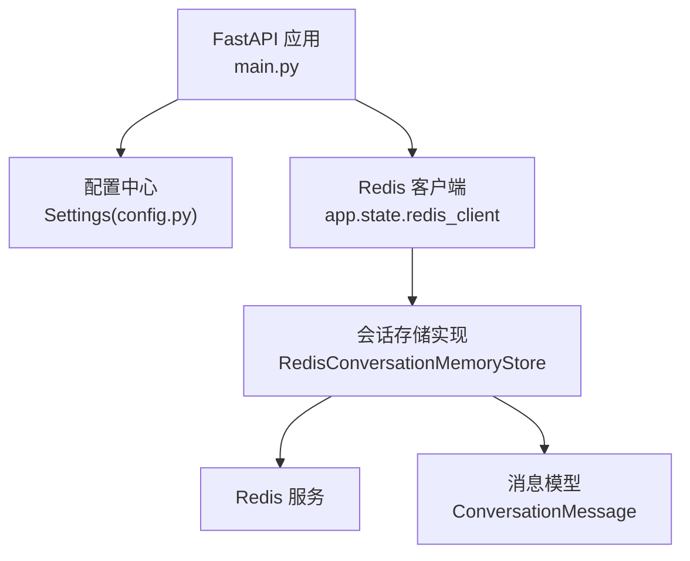
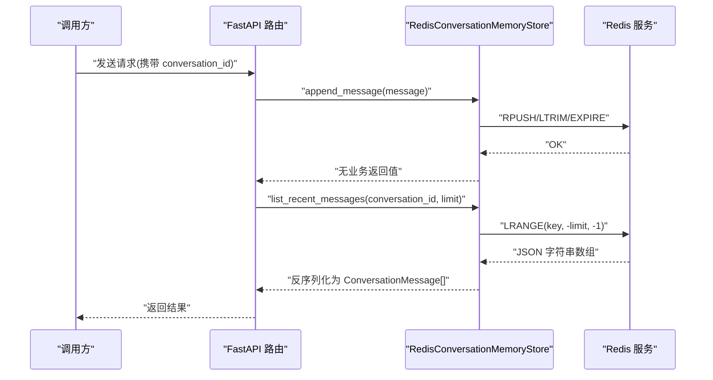
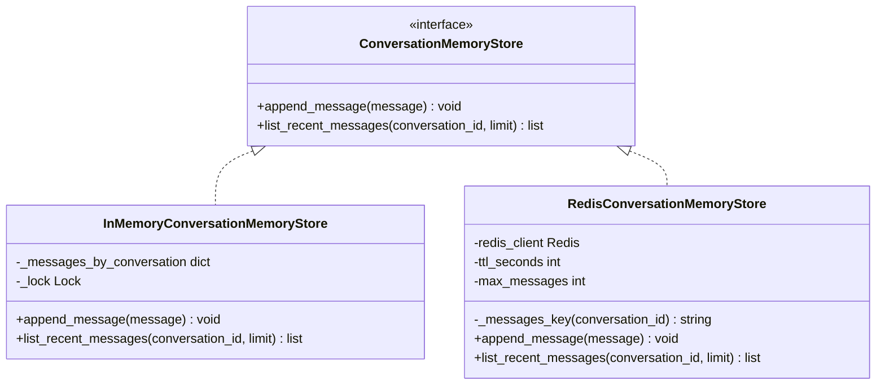
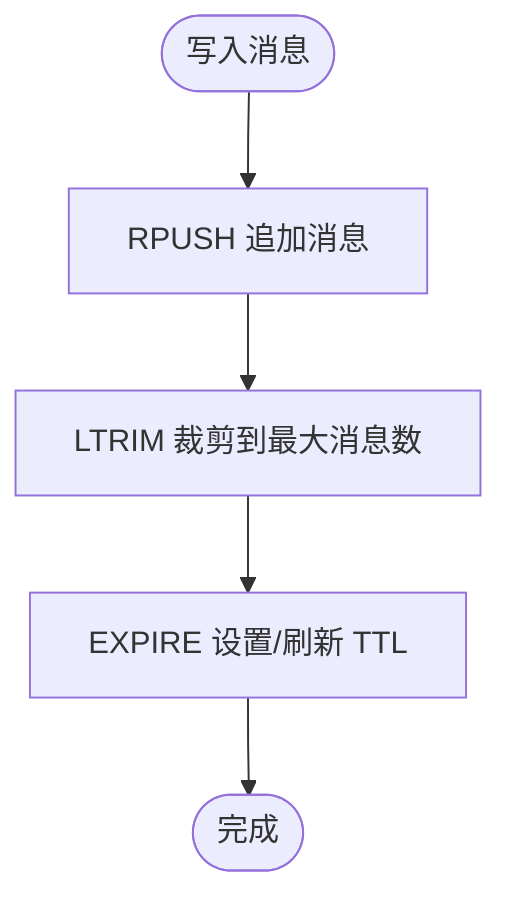
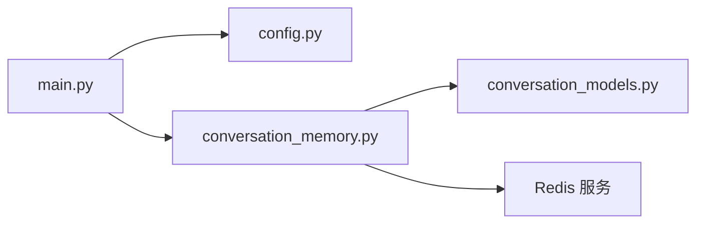

# Redis 会话存储

<cite>
**本文引用的文件**
- [conversation_memory.py](file://python-agent-study/src/fast_app/services/conversation/conversation_memory.py)
- [config.py](file://python-agent-study/src/fast_app/core/config.py)
- [main.py](file://python-agent-study/src/fast_app/main.py)
- [conversation_models.py](file://python-agent-study/src/fast_app/domain/conversation_models.py)
- [14-2-Redis短期会话记忆-最近消息-TTL-会话状态.md](file://python-agent-study/learning-docs/phase-14/14-2-Redis短期会话记忆-最近消息-TTL-会话状态.md)
</cite>

## 目录
1. [简介](#简介)
2. [项目结构](#项目结构)
3. [核心组件](#核心组件)
4. [架构总览](#架构总览)
5. [详细组件分析](#详细组件分析)
6. [依赖关系分析](#依赖关系分析)
7. [性能与内存优化](#性能与内存优化)
8. [故障排查指南](#故障排查指南)
9. [结论](#结论)
10. [附录：配置与最佳实践](#附录配置与最佳实践)

## 简介
本文件围绕项目中“Redis 会话存储”的实现与使用进行系统化说明，重点覆盖：
- 短期会话记忆：用 Redis List 保存最近若干条对话消息，支持按顺序追加与读取。
- 会话状态管理：通过 TTL 控制会话生命周期，避免旧会话长期占用内存。
- 数据结构与序列化：以 JSON 序列化 ConversationMessage，使用 Redis List 组织消息序列。
- 缓存策略：写入时裁剪列表长度并刷新 TTL；读取不刷新 TTL，避免无意续期。
- 分布式与会话共享：基于进程外 Redis，天然支持多 worker、多实例共享同一会话历史。
- 持久化与备份恢复：结合 Redis 自身持久化机制（RDB/AOF）实现短期会话的落盘与恢复。
- 监控与可观测性：建议通过 Redis 指标与日志观察命中率、延迟与资源占用。

## 项目结构
当前项目的会话短期记忆由“协议 + 两种实现”构成：
- 协议层：定义最小能力边界，屏蔽底层存储差异。
- 内存实现：用于本地学习与测试。
- Redis 实现：用于生产或需要跨进程共享的场景。
- 配置与生命周期：通过 Settings 注入连接参数，应用启动时创建 Redis client，关闭时释放。

图表来源
- [main.py:70-75](file://python-agent-study/src/fast_app/main.py#L70-L75)
- [config.py:457-476](file://python-agent-study/src/fast_app/core/config.py#L457-L476)
- [conversation_memory.py:60-105](file://python-agent-study/src/fast_app/services/conversation/conversation_memory.py#L60-L105)
- [conversation_models.py:39-52](file://python-agent-study/src/fast_app/domain/conversation_models.py#L39-L52)

章节来源
- [main.py:70-75](file://python-agent-study/src/fast_app/main.py#L70-L75)
- [config.py:457-476](file://python-agent-study/src/fast_app/core/config.py#L457-L476)
- [conversation_memory.py:60-105](file://python-agent-study/src/fast_app/services/conversation/conversation_memory.py#L60-L105)
- [conversation_models.py:39-52](file://python-agent-study/src/fast_app/domain/conversation_models.py#L39-L52)

## 核心组件
- 会话存储协议与实现
  - 协议：定义 append_message 与 list_recent_messages 两个方法，屏蔽具体存储细节。
  - 内存实现：InMemoryConversationMemoryStore，适合单进程学习与验证。
  - Redis 实现：RedisConversationMemoryStore，使用 Redis List 存储消息 JSON，支持 TTL 与长度裁剪。
- 配置与生命周期
  - Settings 提供 memory_store_provider、redis_url、memory_ttl_seconds、memory_max_messages 等开关与阈值。
  - main.py 在 lifespan 中根据 provider 创建/关闭 Redis client，统一资源管理。
- 数据模型
  - ConversationMessage：包含 id、conversation_id、role、content、created_at、metadata。
  - 序列化：使用 Pydantic 的 model_dump_json / model_validate_json 完成对象与 JSON 的互转。

章节来源
- [conversation_memory.py:10-27](file://python-agent-study/src/fast_app/services/conversation/conversation_memory.py#L10-L27)
- [conversation_memory.py:30-58](file://python-agent-study/src/fast_app/services/conversation/conversation_memory.py#L30-L58)
- [conversation_memory.py:60-105](file://python-agent-study/src/fast_app/services/conversation/conversation_memory.py#L60-L105)
- [config.py:457-476](file://python-agent-study/src/fast_app/core/config.py#L457-L476)
- [main.py:70-75](file://python-agent-study/src/fast_app/main.py#L70-L75)
- [conversation_models.py:39-52](file://python-agent-study/src/fast_app/domain/conversation_models.py#L39-L52)

## 架构总览
Redis 会话存储在系统中的角色是“短期记忆”，负责保存最近若干条消息，供后续多轮对话、查询改写等逻辑消费。

图表来源
- [conversation_memory.py:80-105](file://python-agent-study/src/fast_app/services/conversation/conversation_memory.py#L80-L105)
- [conversation_models.py:39-52](file://python-agent-study/src/fast_app/domain/conversation_models.py#L39-L52)

## 详细组件分析

### 会话存储协议与实现
- 协议设计
  - 仅暴露追加消息与读取最近消息两个能力，保持最小接口，便于替换存储后端。
- 内存实现
  - 使用字典+锁维护每个会话的消息列表，适合单进程学习验证。
- Redis 实现
  - Key 设计：conversation:{conversation_id}:messages
  - Value 结构：List[str]，每个元素为 ConversationMessage 的 JSON 字符串
  - 写入流程：RPUSH 追加 -> LTRIM 裁剪到 max_messages -> EXPIRE 设置 TTL
  - 读取流程：LRANGE 取最近 N 条 -> 反序列化为 ConversationMessage 列表

图表来源
- [conversation_memory.py:10-27](file://python-agent-study/src/fast_app/services/conversation/conversation_memory.py#L10-L27)
- [conversation_memory.py:30-58](file://python-agent-study/src/fast_app/services/conversation/conversation_memory.py#L30-L58)
- [conversation_memory.py:60-105](file://python-agent-study/src/fast_app/services/conversation/conversation_memory.py#L60-L105)

章节来源
- [conversation_memory.py:10-27](file://python-agent-study/src/fast_app/services/conversation/conversation_memory.py#L10-L27)
- [conversation_memory.py:30-58](file://python-agent-study/src/fast_app/services/conversation/conversation_memory.py#L30-L58)
- [conversation_memory.py:60-105](file://python-agent-study/src/fast_app/services/conversation/conversation_memory.py#L60-L105)

### 会话数据结构与序列化
- 数据结构
  - 每条消息为 ConversationMessage，包含 id、conversation_id、role、content、created_at、metadata。
- 序列化格式
  - 写入：message.model_dump_json() 转为 JSON 字符串存入 Redis List。
  - 读取：对每个 JSON 字符串执行 model_validate_json 还原为 ConversationMessage。
- 优势
  - 类型安全：Pydantic 校验保证字段完整性与时区正确性。
  - 可读性：JSON 便于调试与审计。

章节来源
- [conversation_models.py:39-52](file://python-agent-study/src/fast_app/domain/conversation_models.py#L39-L52)
- [conversation_memory.py:80-105](file://python-agent-study/src/fast_app/services/conversation/conversation_memory.py#L80-L105)

### TTL 过期策略与生命周期
- TTL 设置
  - 每次写入后刷新 TTL，确保活跃会话持续有效。
  - 读取不刷新 TTL，避免只读操作延长会话寿命。
- 过期语义
  - 会话长时间无交互将自动过期，释放 Redis 内存。
- 配置项
  - memory_ttl_seconds：会话存活时间（秒）。
  - memory_max_messages：单会话保留的最大消息数。

图表来源
- [conversation_memory.py:80-88](file://python-agent-study/src/fast_app/services/conversation/conversation_memory.py#L80-L88)
- [14-2-Redis短期会话记忆-最近消息-TTL-会话状态.md:357-364](file://python-agent-study/learning-docs/phase-14/14-2-Redis短期会话记忆-最近消息-TTL-会话状态.md#L357-L364)

章节来源
- [conversation_memory.py:80-88](file://python-agent-study/src/fast_app/services/conversation/conversation_memory.py#L80-L88)
- [14-2-Redis短期会话记忆-最近消息-TTL-会话状态.md:357-364](file://python-agent-study/learning-docs/phase-14/14-2-Redis短期会话记忆-最近消息-TTL-会话状态.md#L357-L364)

### 分布式会话同步与会话共享
- 共享机制
  - 所有应用实例共享同一个 Redis 服务，通过相同的 key 命名空间访问同一会话历史。
- 多 worker 支持
  - 由于 Redis 是进程外存储，不同 uvicorn worker 或容器实例均可读写同一会话。
- 隔离策略
  - 通过 conversation_id 区分不同会话，避免交叉污染。

章节来源
- [conversation_memory.py:60-78](file://python-agent-study/src/fast_app/services/conversation/conversation_memory.py#L60-L78)
- [14-2-Redis短期会话记忆-最近消息-TTL-会话状态.md:25-42](file://python-agent-study/learning-docs/phase-14/14-2-Redis短期会话记忆-最近消息-TTL-会话状态.md#L25-L42)

### 配置与生命周期管理
- 配置项
  - memory_store_provider：选择 in_memory 或 redis。
  - redis_url：Redis 连接地址。
  - memory_ttl_seconds：TTL 秒数。
  - memory_max_messages：单会话最大消息数。
- 生命周期
  - 启动：根据 provider 创建 Redis client 并挂载到 app.state。
  - 关闭：统一关闭 Redis client 与其他外部资源。

章节来源
- [config.py:457-476](file://python-agent-study/src/fast_app/core/config.py#L457-L476)
- [main.py:70-75](file://python-agent-study/src/fast_app/main.py#L70-L75)
- [main.py:109-112](file://python-agent-study/src/fast_app/main.py#L109-L112)

## 依赖关系分析
- 模块耦合
  - main.py 依赖 config.py 获取配置，并在 lifespan 中创建 Redis client。
  - conversation_memory.py 依赖 redis.asyncio.Redis 与 ConversationMessage。
  - 上层路由或服务通过依赖注入获取 store 实例，屏蔽存储细节。
- 外部依赖
  - Redis 作为外部服务，需保证高可用与低延迟。
  - Pydantic 用于数据模型与序列化。

图表来源
- [main.py:70-75](file://python-agent-study/src/fast_app/main.py#L70-L75)
- [conversation_memory.py:60-105](file://python-agent-study/src/fast_app/services/conversation/conversation_memory.py#L60-L105)
- [conversation_models.py:39-52](file://python-agent-study/src/fast_app/domain/conversation_models.py#L39-L52)

章节来源
- [main.py:70-75](file://python-agent-study/src/fast_app/main.py#L70-L75)
- [conversation_memory.py:60-105](file://python-agent-study/src/fast_app/services/conversation/conversation_memory.py#L60-L105)
- [conversation_models.py:39-52](file://python-agent-study/src/fast_app/domain/conversation_models.py#L39-L52)

## 性能与内存优化
- 写入路径优化
  - 使用 pipeline 批量执行 RPUSH、LTRIM、EXPIRE，减少网络往返。
- 列表长度控制
  - LTRIM 限制每会话消息数量，防止无限增长。
- TTL 策略
  - 写入刷新 TTL，读取不刷新，避免误续期导致内存泄漏。
- 序列化开销
  - JSON 序列化带来 CPU 与内存开销，可通过压缩或二进制编码进一步优化（如 msgpack），但需权衡兼容性与可读性。
- 连接复用
  - Redis client 由 lifespan 统一管理，避免重复创建连接。
- 监控建议
  - 关注 Redis 内存使用、键数量、命中率、延迟分布。
  - 记录慢查询与异常重试次数，定位瓶颈。

章节来源
- [conversation_memory.py:80-88](file://python-agent-study/src/fast_app/services/conversation/conversation_memory.py#L80-L88)
- [14-2-Redis短期会话记忆-最近消息-TTL-会话状态.md:330-342](file://python-agent-study/learning-docs/phase-14/14-2-Redis短期会话记忆-最近消息-TTL-会话状态.md#L330-L342)

## 故障排查指南
- 常见问题
  - Redis 不可用：检查连接地址、网络连通性与认证信息。
  - 会话未生效：确认 conversation_id 一致且 key 命名规范。
  - 内存增长：检查 memory_max_messages 是否过小，或是否存在异常高频写入。
  - TTL 失效：确认写入路径是否执行 expire，读取路径不应刷新 TTL。
- 诊断步骤
  - 查看 Redis 键是否存在与过期时间。
  - 检查应用日志中的 client 创建与关闭流程。
  - 对比配置项与实际运行值，确保 provider 切换正确。

章节来源
- [main.py:70-75](file://python-agent-study/src/fast_app/main.py#L70-L75)
- [main.py:109-112](file://python-agent-study/src/fast_app/main.py#L109-L112)
- [conversation_memory.py:80-105](file://python-agent-study/src/fast_app/services/conversation/conversation_memory.py#L80-L105)

## 结论
本项目通过协议抽象与 Redis 实现，构建了轻量、可扩展的短期会话记忆方案。其特点包括：
- 明确的数据结构与序列化方式，便于调试与演进。
- 合理的 TTL 与列表裁剪策略，保障内存可控与会话自动清理。
- 进程外共享能力，天然支持分布式部署与多实例协作。
- 统一的配置与生命周期管理，降低运维复杂度。

## 附录：配置与最佳实践
- 配置建议
  - 开发环境：MEMORY_STORE_PROVIDER=in_memory，快速验证。
  - 生产环境：MEMORY_STORE_PROVIDER=redis，配置 REDIS_URL、MEMORY_TTL_SECONDS、MEMORY_MAX_MESSAGES。
- 最佳实践
  - 合理设置 TTL：根据用户活跃度与业务需求调整，避免过短导致频繁重建上下文。
  - 控制消息数量：根据模型上下文窗口与成本预算设定 memory_max_messages。
  - 监控与告警：对 Redis 内存、键数量、延迟与错误率设置阈值告警。
  - 备份与恢复：启用 RDB/AOF 持久化，定期快照与异地备份，制定灾难恢复预案。
  - 安全与隔离：通过 conversation_id 与命名空间隔离不同租户或业务线。

章节来源
- [config.py:457-476](file://python-agent-study/src/fast_app/core/config.py#L457-L476)
- [14-2-Redis短期会话记忆-最近消息-TTL-会话状态.md:206-245](file://python-agent-study/learning-docs/phase-14/14-2-Redis短期会话记忆-最近消息-TTL-会话状态.md#L206-L245)