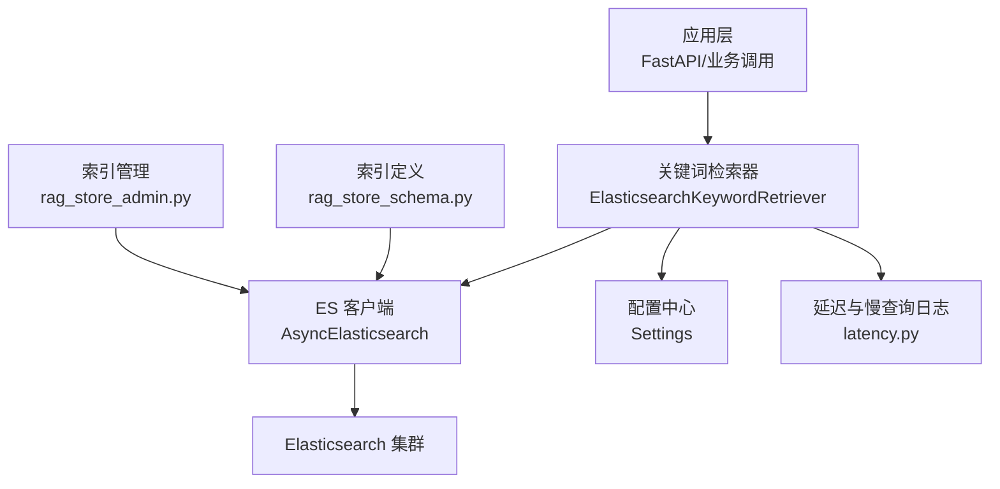
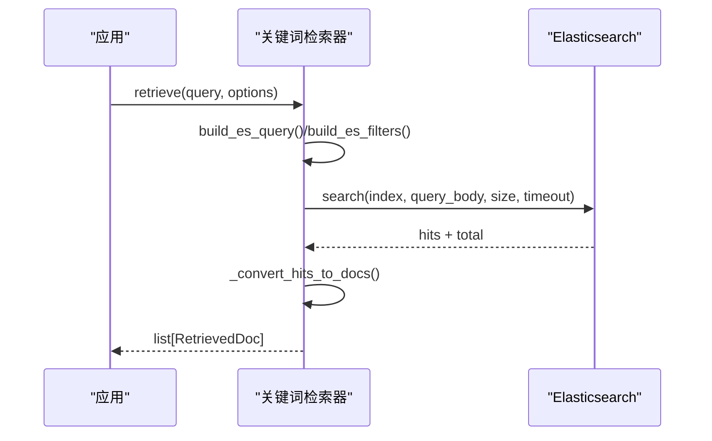
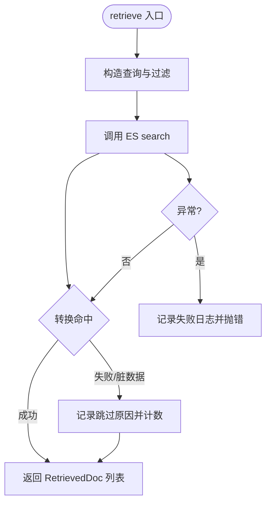
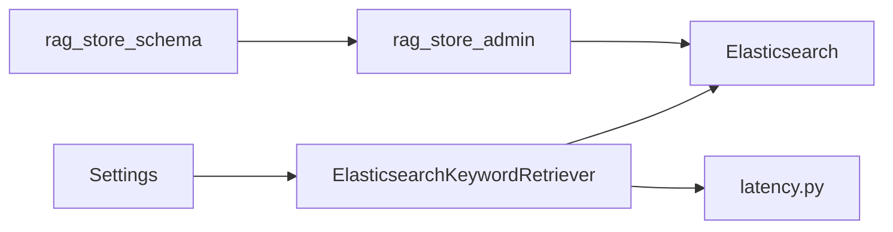

# 关键词搜索存储

<cite>
**本文引用的文件**
- [elasticsearch_keyword_retriever.py](file://src/fast_app/components/retrievers/elasticsearch_keyword_retriever.py)
- [rag_store_schema.py](file://src/fast_app/ingestion/stores/rag_store_schema.py)
- [rag_store_admin.py](file://src/fast_app/ingestion/stores/rag_store_admin.py)
- [config.py](file://src/fast_app/core/config.py)
- [latency.py](file://src/fast_app/core/latency.py)
- [elasticsearch_keyword_retriever_demo.py](file://src/app/elasticsearch_keyword_retriever_demo.py)
- [ingest_elasticsearch_docs.py](file://src/app/ingest_elasticsearch_docs.py)
</cite>

## 目录
1. [简介](#简介)
2. [项目结构](#项目结构)
3. [核心组件](#核心组件)
4. [架构总览](#架构总览)
5. [详细组件分析](#详细组件分析)
6. [依赖关系分析](#依赖关系分析)
7. [性能与优化](#性能与优化)
8. [故障排查指南](#故障排查指南)
9. [结论](#结论)
10. [附录：索引字段与查询要点](#附录：索引字段与查询要点)

## 简介
本文件面向开发者，系统化说明本项目中基于 Elasticsearch 的关键词检索能力。内容覆盖索引管理、分词器配置、全文检索、文档索引构建、元数据映射、查询语法、混合检索中的关键词匹配与相关性评分、结果排序、索引优化策略、查询性能调优以及集群管理建议。目标是帮助你在 RAG 系统中稳定、高效地使用 ES 进行关键词召回，并与向量检索协同工作。

## 项目结构
围绕关键词检索的关键代码分布在以下位置：
- 检索实现：components/retrievers 下的 Elasticsearch 关键词检索器
- 索引与映射：ingestion/stores 下的 ES mapping、settings、analyzer 常量与工具函数
- 索引管理：ingestion/stores 下的重置/重建入口（含 IK 分词器校验）
- 配置：core/config.py 中的 ES URL、索引名、超时等
- 演示与脚本：app 下的检索示例与批量写入脚本

图表来源
- [elasticsearch_keyword_retriever.py:210-345](file://src/fast_app/components/retrievers/elasticsearch_keyword_retriever.py#L210-L345)
- [rag_store_schema.py:58-140](file://src/fast_app/ingestion/stores/rag_store_schema.py#L58-L140)
- [rag_store_admin.py:53-93](file://src/fast_app/ingestion/stores/rag_store_admin.py#L53-L93)
- [config.py:71-81](file://src/fast_app/core/config.py#L71-L81)
- [latency.py:19-38](file://src/fast_app/core/latency.py#L19-L38)

章节来源
- [elasticsearch_keyword_retriever.py:1-399](file://src/fast_app/components/retrievers/elasticsearch_keyword_retriever.py#L1-L399)
- [rag_store_schema.py:1-140](file://src/fast_app/ingestion/stores/rag_store_schema.py#L1-L140)
- [rag_store_admin.py:1-162](file://src/fast_app/ingestion/stores/rag_store_admin.py#L1-L162)
- [config.py:71-81](file://src/fast_app/core/config.py#L71-L81)
- [latency.py:1-38](file://src/fast_app/core/latency.py#L1-L38)

## 核心组件
- 关键词检索器：封装 ES 查询构造、权限下推、结果转换、耗时统计与异常处理
- 索引与映射：定义 text/keyword 字段、IK 分词器、metadata 子字段、版本与可见性字段
- 索引管理：安全删除/重建索引并校验 IK 分词器可用性
- 配置：ES 连接、索引名、请求超时、慢查询阈值等
- 演示与导入：快速创建索引、批量写入、简单搜索验证

章节来源
- [elasticsearch_keyword_retriever.py:47-207](file://src/fast_app/components/retrievers/elasticsearch_keyword_retriever.py#L47-L207)
- [rag_store_schema.py:58-140](file://src/fast_app/ingestion/stores/rag_store_schema.py#L58-L140)
- [rag_store_admin.py:53-93](file://src/fast_app/ingestion/stores/rag_store_admin.py#L53-L93)
- [config.py:71-81](file://src/fast_app/core/config.py#L71-L81)
- [elasticsearch_keyword_retriever_demo.py:9-34](file://src/app/elasticsearch_keyword_retriever_demo.py#L9-L34)
- [ingest_elasticsearch_docs.py:12-159](file://src/app/ingest_elasticsearch_docs.py#L12-L159)

## 架构总览
关键词检索在 RAG 链路中的角色：
- 接收 query 与过滤条件（如 source_path、section_path、权限）
- 使用 multi_match 对标题、搜索文本、正文加权匹配
- 通过 bool.filter 下推权限与业务过滤，不参与评分
- 返回 RetrievedDoc，携带 keyword_score，供后续混合检索/RRF/重排使用

图表来源
- [elasticsearch_keyword_retriever.py:176-207](file://src/fast_app/components/retrievers/elasticsearch_keyword_retriever.py#L176-L207)
- [elasticsearch_keyword_retriever.py:227-309](file://src/fast_app/components/retrievers/elasticsearch_keyword_retriever.py#L227-L309)
- [elasticsearch_keyword_retriever.py:347-398](file://src/fast_app/components/retrievers/elasticsearch_keyword_retriever.py#L347-L398)

## 详细组件分析

### 关键词检索器（ElasticsearchKeywordRetriever）
职责
- 构造 ES 查询：multi_match 对 title^2、search_text^3、content 加权
- 构造过滤：source_path、section_path、知识版本区间、权限（public/部门/用户）
- 执行搜索：带 request_timeout，记录开始/结束日志与慢查询告警
- 结果转换：提取 id/content/title/metadata/_score，跳过脏命中并计数
- 异常处理：统一抛出外部服务错误，附带上下文日志

关键设计点
- 权限过滤下推到 ES filter，避免召回后再过滤
- 父块不参与初始关键词召回，仅用于命中后扩展
- 日志包含 query_body、filter_count、hit_count、total_value/total_relation、top_doc_ids 等

图表来源
- [elasticsearch_keyword_retriever.py:227-345](file://src/fast_app/components/retrievers/elasticsearch_keyword_retriever.py#L227-L345)
- [elasticsearch_keyword_retriever.py:347-398](file://src/fast_app/components/retrievers/elasticsearch_keyword_retriever.py#L347-L398)

章节来源
- [elasticsearch_keyword_retriever.py:47-207](file://src/fast_app/components/retrievers/elasticsearch_keyword_retriever.py#L47-L207)
- [elasticsearch_keyword_retriever.py:227-345](file://src/fast_app/components/retrievers/elasticsearch_keyword_retriever.py#L227-L345)
- [elasticsearch_keyword_retriever.py:347-398](file://src/fast_app/components/retrievers/elasticsearch_keyword_retriever.py#L347-L398)

### 索引与映射（rag_store_schema.py）
- 分词器：索引用 ik_max_word，搜索用 ik_smart，兼顾细粒度切分与精准搜索
- 文本字段：content/search_text 为 text；title 同时提供 keyword 子字段用于精确匹配或聚合
- 元数据：metadata 内嵌 doc_id、chunk_id、source_path、section_path、visibility、allowed_departments、allowed_users 等，均为 keyword 类型，便于 term/terms 过滤
- 版本控制：valid_from_version/valid_to_version 支持按版本范围过滤
- 索引设置：单分片、无副本，适合单机/开发环境；生产可按规模调整

章节来源
- [rag_store_schema.py:44-75](file://src/fast_app/ingestion/stores/rag_store_schema.py#L44-L75)
- [rag_store_schema.py:78-140](file://src/fast_app/ingestion/stores/rag_store_schema.py#L78-L140)

### 索引管理（rag_store_admin.py）
- 安全校验：重置前要求 confirm=True，防止误删
- IK 校验：通过 analyze API 验证 ik_max_word/ik_smart 可用
- 删除与重建：存在则删除，按需重建 mapping
- 结果对象：结构化返回 existed_before/dropped/created，便于审计

章节来源
- [rag_store_admin.py:21-35](file://src/fast_app/ingestion/stores/rag_store_admin.py#L21-L35)
- [rag_store_admin.py:45-93](file://src/fast_app/ingestion/stores/rag_store_admin.py#L45-L93)

### 配置（config.py）
- ES 地址与索引名：ELASTICSEARCH_URL、ELASTICSEARCH_INDEX_NAME
- 认证：用户名/密码（可选）
- 超时：ELASTICSEARCH_REQUEST_TIMEOUT，避免慢查询阻塞链路
- 慢检索阈值：SLOW_RETRIEVAL_THRESHOLD_MS，配合 latency 模块输出告警

章节来源
- [config.py:71-81](file://src/fast_app/core/config.py#L71-L81)
- [config.py:628-632](file://src/fast_app/core/config.py#L628-L632)

### 演示与导入脚本
- 检索演示：展示如何实例化检索器、发起检索、打印结果
- 导入脚本：创建索引、批量写入、执行简单搜索冒烟测试

章节来源
- [elasticsearch_keyword_retriever_demo.py:9-34](file://src/app/elasticsearch_keyword_retriever_demo.py#L9-L34)
- [ingest_elasticsearch_docs.py:12-159](file://src/app/ingest_elasticsearch_docs.py#L12-L159)

## 依赖关系分析
- 检索器依赖：
  - Settings：读取 ES 地址、索引名、超时
  - 领域模型：RetrievalFilters/RetrievalOptions/RetrievedDoc/ScoreBreakdown
  - ES 客户端：AsyncElasticsearch
  - 日志与延迟：format_log_fields、log_slow_operation
- 索引定义被管理模块复用，确保一致性与可维护性

图表来源
- [elasticsearch_keyword_retriever.py:1-32](file://src/fast_app/components/retrievers/elasticsearch_keyword_retriever.py#L1-L32)
- [rag_store_schema.py:58-140](file://src/fast_app/ingestion/stores/rag_store_schema.py#L58-L140)
- [rag_store_admin.py:53-93](file://src/fast_app/ingestion/stores/rag_store_admin.py#L53-L93)
- [latency.py:19-38](file://src/fast_app/core/latency.py#L19-L38)

章节来源
- [elasticsearch_keyword_retriever.py:1-32](file://src/fast_app/components/retrievers/elasticsearch_keyword_retriever.py#L1-L32)
- [rag_store_schema.py:58-140](file://src/fast_app/ingestion/stores/rag_store_schema.py#L58-L140)
- [rag_store_admin.py:53-93](file://src/fast_app/ingestion/stores/rag_store_admin.py#L53-L93)
- [latency.py:19-38](file://src/fast_app/core/latency.py#L19-L38)

## 性能与优化
- 查询优化
  - 使用 bool.must 承载全文匹配，bool.filter 承载权限与业务过滤，filter 不参与评分，提升性能与准确性
  - 多字段加权：search_text^3、title^2、content，提高标题与搜索文本的权重
  - 限制 size 与使用 request_timeout，避免大结果集与慢查询拖垮链路
- 索引优化
  - 文本字段使用 IK 分词器，中文检索更准确
  - 元数据字段使用 keyword，利于精确过滤与聚合
  - 单分片无副本适合本地/开发；生产根据数据量与吞吐调整 shards/replicas
- 监控与诊断
  - 记录 query_body、filter_count、hit_count、total_value/total_relation、top_doc_ids
  - 慢操作告警：超过阈值的检索会输出 slow_operation 日志
- 集群管理建议
  - 健康检查：定期 verify ES 连通性与分词器可用性
  - 容量规划：根据 QPS、数据增长、查询复杂度评估节点数与分片数
  - 安全：启用认证与最小权限访问，生产环境关闭 debug

章节来源
- [elasticsearch_keyword_retriever.py:176-207](file://src/fast_app/components/retrievers/elasticsearch_keyword_retriever.py#L176-L207)
- [elasticsearch_keyword_retriever.py:227-309](file://src/fast_app/components/retrievers/elasticsearch_keyword_retriever.py#L227-L309)
- [rag_store_schema.py:71-75](file://src/fast_app/ingestion/stores/rag_store_schema.py#L71-L75)
- [latency.py:19-38](file://src/fast_app/core/latency.py#L19-L38)
- [config.py:628-632](file://src/fast_app/core/config.py#L628-L632)

## 故障排查指南
常见问题与定位方法
- 中文关键词召回差
  - 确认 IK 分词器已安装且可用（analyze 校验）
  - 检查 content/search_text/title 是否配置了正确的 analyzer/search_analyzer
- 权限过滤不生效
  - 检查 metadata.visibility、allowed_departments、allowed_users 是否正确写入
  - 确认 RetrievalFilters 中 can_read_all、department_codes、user_id 是否传入
- 命中为空或结果异常
  - 查看 skipped_hit_count 与 elasticsearch.hit.skipped 日志，定位缺失 id/content 的脏数据
  - 核对 must_not 排除规则（如 markdown_parent）是否符合预期
- 慢查询
  - 关注 elasticsearch.search.slow 日志，结合 size、filter_count、query_body 分析
  - 适当缩小 size、增加 request_timeout、优化过滤条件

章节来源
- [rag_store_admin.py:53-60](file://src/fast_app/ingestion/stores/rag_store_admin.py#L53-L60)
- [elasticsearch_keyword_retriever.py:347-398](file://src/fast_app/components/retrievers/elasticsearch_keyword_retriever.py#L347-L398)
- [elasticsearch_keyword_retriever.py:273-307](file://src/fast_app/components/retrievers/elasticsearch_keyword_retriever.py#L273-L307)

## 结论
本项目通过统一的关键词检索器、清晰的索引映射与安全的管理接口，实现了稳定高效的 ES 关键词检索。借助 IK 分词器、布尔查询与权限下推，既能保证中文检索质量，又能将权限与业务约束高效下推到 ES。配合慢查询监控与合理的索引设置，可在不同规模环境中获得良好的检索体验。建议在生产环境进一步评估分片与副本策略，并结合向量检索与重排形成完整的混合检索方案。

## 附录：索引字段与查询要点
- 字段类型
  - 文本字段：content/search_text 使用 text + IK 分词；title 同时提供 keyword 子字段
  - 元数据：metadata.* 多为 keyword，便于 term/terms 过滤
  - 版本：valid_from_version/valid_to_version 支持范围过滤
- 查询要点
  - multi_match 加权：search_text^3、title^2、content
  - bool.filter 下推：source_path、section_path、权限（public/部门/用户）、版本区间
  - must_not：排除父块参与初始召回
- 管理与监控
  - 重建前校验 IK 分词器
  - 记录 query_body、filter_count、hit_count、total、top_doc_ids
  - 慢查询阈值告警

章节来源
- [rag_store_schema.py:58-140](file://src/fast_app/ingestion/stores/rag_store_schema.py#L58-L140)
- [elasticsearch_keyword_retriever.py:176-207](file://src/fast_app/components/retrievers/elasticsearch_keyword_retriever.py#L176-L207)
- [rag_store_admin.py:53-93](file://src/fast_app/ingestion/stores/rag_store_admin.py#L53-L93)
- [elasticsearch_keyword_retriever.py:273-307](file://src/fast_app/components/retrievers/elasticsearch_keyword_retriever.py#L273-L307)