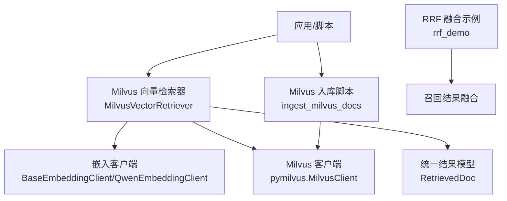
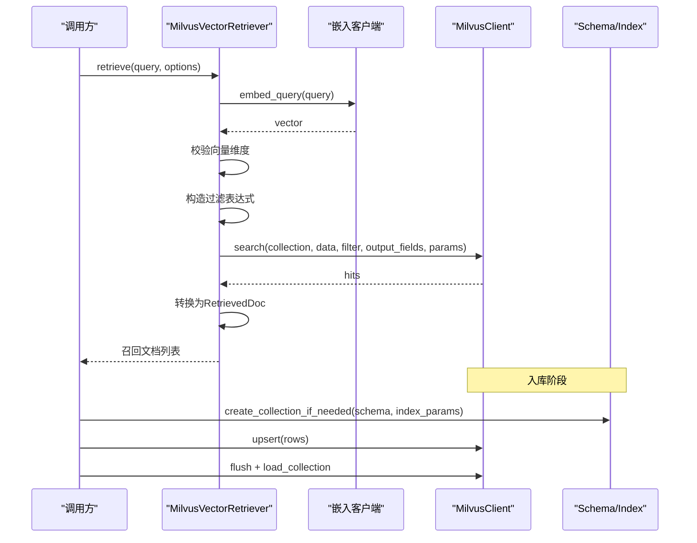
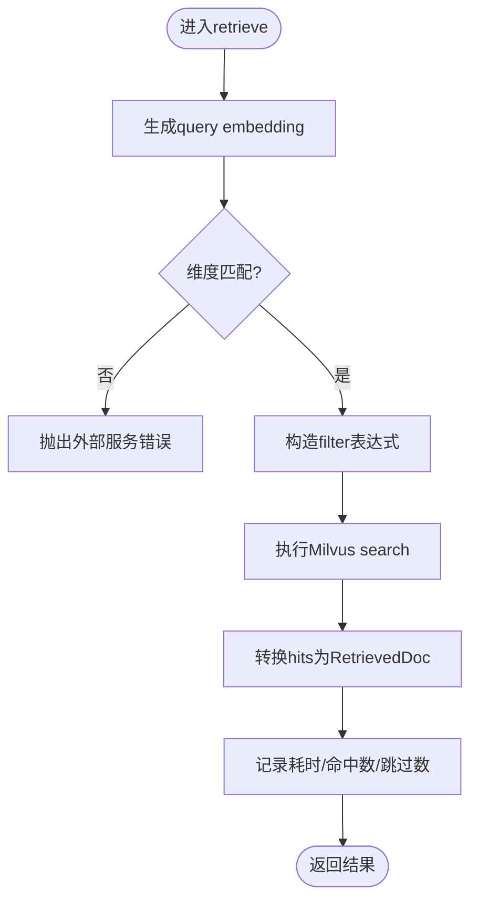
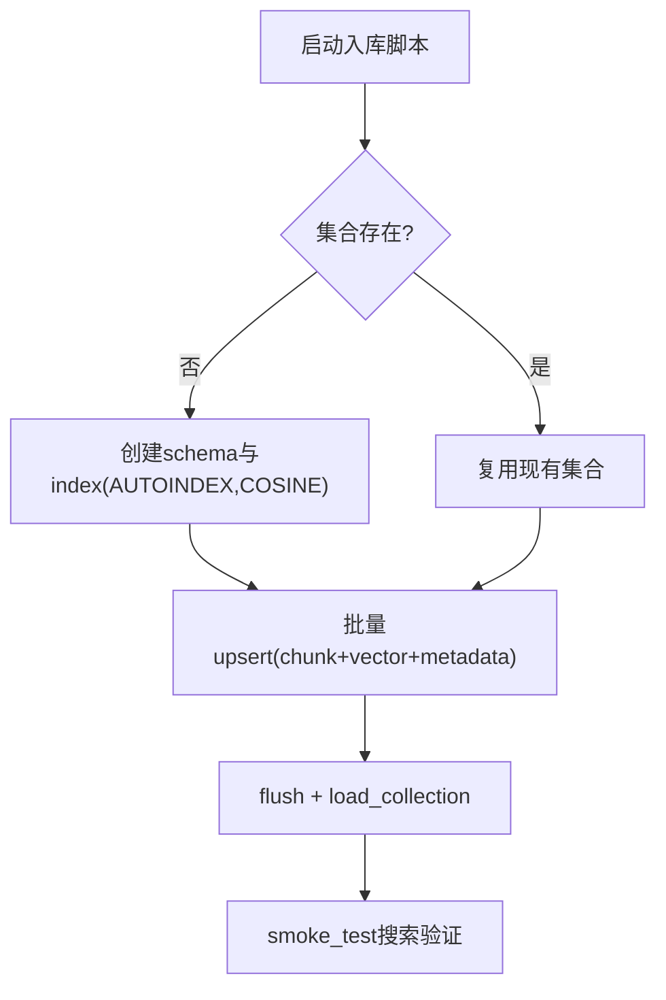
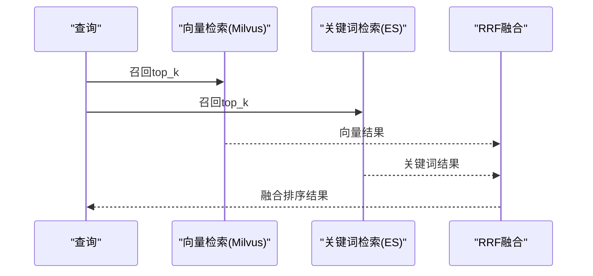
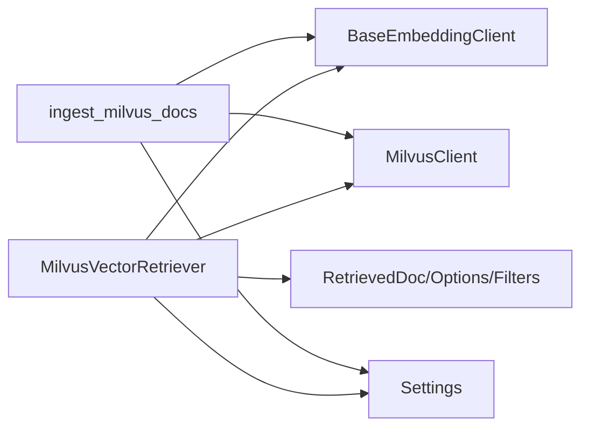

# 向量搜索存储

<cite>
**本文引用的文件**
- [milvus_vector_retriever.py](file://src/fast_app/components/retrievers/milvus_vector_retriever.py)
- [rag_store_schema.py](file://src/fast_app/ingestion/stores/rag_store_schema.py)
- [config.py](file://src/fast_app/core/config.py)
- [ingest_milvus_docs.py](file://src/app/ingest_milvus_docs.py)
- [milvus_vector_retriever_demo.py](file://src/app/milvus_vector_retriever_demo.py)
- [rrf_demo.py](file://src/app/rrf_demo.py)
</cite>

## 目录
1. [简介](#简介)
2. [项目结构](#项目结构)
3. [核心组件](#核心组件)
4. [架构总览](#架构总览)
5. [详细组件分析](#详细组件分析)
6. [依赖关系分析](#依赖关系分析)
7. [性能考虑](#性能考虑)
8. [故障排查指南](#故障排查指南)
9. [结论](#结论)
10. [附录](#附录)

## 简介
本文件面向开发者，系统化说明项目中基于 Milvus 的向量搜索存储实现与优化实践。内容覆盖集合管理、索引构建、相似度检索、文档分块向量化、元数据存储、批量写入优化、混合检索策略与结果融合、查询优化参数、向量维度选择、索引类型配置等。通过代码级分析与图示，帮助读者快速理解并高效落地向量检索链路。

## 项目结构
本项目将向量检索能力以“检索器”形式抽象，Milvus 作为向量存储后端之一，配合嵌入模型客户端完成 query embedding 生成，并通过统一的 RetrievedDoc 模型向上层 RAG 管线提供标准化结果。数据入库脚本负责创建集合、构建索引、批量 upsert 与 flush/load，确保可观测性与可用性。

图表来源
- [milvus_vector_retriever.py:155-337](file://src/fast_app/components/retrievers/milvus_vector_retriever.py#L155-L337)
- [ingest_milvus_docs.py:14-158](file://src/app/ingest_milvus_docs.py#L14-L158)
- [rrf_demo.py:1-65](file://src/app/rrf_demo.py#L1-L65)

章节来源
- [milvus_vector_retriever.py:155-337](file://src/fast_app/components/retrievers/milvus_vector_retriever.py#L155-L337)
- [ingest_milvus_docs.py:14-158](file://src/app/ingest_milvus_docs.py#L14-L158)
- [rrf_demo.py:1-65](file://src/app/rrf_demo.py#L1-L65)

## 核心组件
- Milvus 向量检索器：封装 query embedding 生成、过滤表达式构造、search 调用、结果转换与慢操作日志。
- 入库脚本：按需创建集合、定义 schema、准备索引、批量 upsert、flush 与 load collection，并提供 smoke test 搜索。
- 配置中心：集中管理 Milvus 连接、集合名、字段名、向量维度、阈值等关键参数。
- 结果融合：提供 RRF（倒数排名融合）示例，用于混合检索后的结果排序。

章节来源
- [milvus_vector_retriever.py:155-337](file://src/fast_app/components/retrievers/milvus_vector_retriever.py#L155-L337)
- [ingest_milvus_docs.py:14-158](file://src/app/ingest_milvus_docs.py#L14-L158)
- [config.py:58-68](file://src/fast_app/core/config.py#L58-L68)
- [rrf_demo.py:1-65](file://src/app/rrf_demo.py#L1-L65)

## 架构总览
下图展示从用户查询到 Milvus 检索再到统一结果返回的关键流程，以及入库时集合与索引的初始化过程。

图表来源
- [milvus_vector_retriever.py:182-337](file://src/fast_app/components/retrievers/milvus_vector_retriever.py#L182-L337)
- [ingest_milvus_docs.py:14-158](file://src/app/ingest_milvus_docs.py#L14-L158)

## 详细组件分析

### Milvus 向量检索器
职责
- 生成 query embedding 并校验维度一致性。
- 将业务过滤条件与权限过滤条件组合为 Milvus filter 表达式。
- 执行 search，记录详细日志与慢检索告警。
- 将原始 hits 转换为统一的 RetrievedDoc，保留多阶段分数以便后续融合或重排。

关键点
- 过滤表达式包含 source_path、section_path、知识版本区间、权限控制（public/部门/用户白名单），全部下推到 Milvus 侧执行，避免后处理开销。
- 使用 COSINE 相似度度量；输出字段由配置与选项共同决定。
- 对缺失 id 或 content 的 hit 进行跳过计数，便于发现脏数据。

图表来源
- [milvus_vector_retriever.py:182-337](file://src/fast_app/components/retrievers/milvus_vector_retriever.py#L182-L337)

章节来源
- [milvus_vector_retriever.py:56-133](file://src/fast_app/components/retrievers/milvus_vector_retriever.py#L56-L133)
- [milvus_vector_retriever.py:182-337](file://src/fast_app/components/retrievers/milvus_vector_retriever.py#L182-L337)

### 集合管理与索引构建
职责
- 在首次使用时检查并创建集合，定义主键、向量、内容、标题、来源等字段。
- 使用 AUTOINDEX 与 COSINE 度量构建向量索引。
- 批量 upsert 数据，flush 后 load collection，确保可立即检索。
- 提供 smoke test 验证写入与检索链路。

要点
- 向量维度必须与配置一致，否则入库或检索会失败。
- 写入完成后需 flush 并 load，保证新数据立即可查。

图表来源
- [ingest_milvus_docs.py:14-158](file://src/app/ingest_milvus_docs.py#L14-L158)

章节来源
- [ingest_milvus_docs.py:14-158](file://src/app/ingest_milvus_docs.py#L14-L158)

### 文档分块向量化与元数据存储
- 分块向量化：由上层 chunk 构建器产出文本片段，再由嵌入客户端批量生成向量。入库脚本中按 chunk 组装行数据，包含 id、content、source、title 等字段。
- 元数据存储：检索器导入 rag_store_schema 中的常量，表明 Milvus 侧还存储了 title、source_path、document_type、chunk_index、version 区间、可见性、允许部门/用户等元信息，用于精确过滤与溯源。
- 维度选择：embedding_dim 来自配置，需与模型输出维度严格一致；检索器会在维度不匹配时提前报错，避免无效请求。

章节来源
- [ingest_milvus_docs.py:75-158](file://src/app/ingest_milvus_docs.py#L75-L158)
- [milvus_vector_retriever.py:13-23](file://src/fast_app/components/retrievers/milvus_vector_retriever.py#L13-L23)
- [config.py:598-603](file://src/fast_app/core/config.py#L598-L603)

### 批量写入优化
- 批量 upsert：将所有 chunk 与其向量打包为 rows 一次性写入，减少网络往返。
- flush 与 load：写入后立即 flush 并 load collection，确保新数据可被检索。
- 幂等与覆盖：upsert 支持按主键覆盖更新，适合增量重建场景。

章节来源
- [ingest_milvus_docs.py:129-158](file://src/app/ingest_milvus_docs.py#L129-L158)

### 混合检索策略与结果融合
- 混合检索：同时使用向量检索（Milvus）与关键词检索（如 Elasticsearch），各自召回候选集。
- 结果融合：采用 RRF（倒数排名融合）将不同源的结果合并排序，提升召回稳定性与鲁棒性。
- 示例：rrf_demo 展示了如何对 Milvus 与 ES 的召回结果进行融合。

图表来源
- [rrf_demo.py:1-65](file://src/app/rrf_demo.py#L1-L65)

章节来源
- [rrf_demo.py:1-65](file://src/app/rrf_demo.py#L1-L65)

### 查询优化与参数调优
- 相似度度量：COSINE，适用于归一化向量场景。
- 候选数量：candidate_k 控制召回规模，影响延迟与召回率。
- 输出字段：仅选择必要字段，降低网络与序列化开销。
- 过滤下推：将业务与权限过滤放入 Milvus filter，减少无效候选。
- 慢检索告警：通过 slow_retrieval_threshold_ms 监控异常延迟。

章节来源
- [milvus_vector_retriever.py:235-301](file://src/fast_app/components/retrievers/milvus_vector_retriever.py#L235-L301)
- [config.py:41-44](file://src/fast_app/core/config.py#L41-L44)

## 依赖关系分析
- MilvusVectorRetriever 依赖：
  - 嵌入客户端：负责将 query 转为向量。
  - MilvusClient：执行 search。
  - 配置 Settings：提供连接、集合、字段、维度、阈值等。
  - 领域模型：RetrievedDoc、RetrievalFilters、RetrievalOptions、ScoreBreakdown。
- 入库脚本依赖：
  - pymilvus：创建集合、索引、upsert、flush、load。
  - 嵌入客户端：批量生成向量。
  - 配置 Settings：读取 Milvus 与嵌入模型参数。

图表来源
- [milvus_vector_retriever.py:155-180](file://src/fast_app/components/retrievers/milvus_vector_retriever.py#L155-L180)
- [ingest_milvus_docs.py:1-12](file://src/app/ingest_milvus_docs.py#L1-L12)
- [config.py:58-68](file://src/fast_app/core/config.py#L58-L68)

章节来源
- [milvus_vector_retriever.py:155-180](file://src/fast_app/components/retrievers/milvus_vector_retriever.py#L155-L180)
- [ingest_milvus_docs.py:1-12](file://src/app/ingest_milvus_docs.py#L1-L12)
- [config.py:58-68](file://src/fast_app/core/config.py#L58-L68)

## 性能考虑
- 向量维度一致性：务必保证 embedding_dim 与模型输出一致，避免检索失败与无效计算。
- 过滤下推：将 source_path、section_path、版本区间、权限条件放入 filter，减少候选集大小。
- 输出字段裁剪：只请求必要字段，降低传输与解析成本。
- 批量写入：一次 upsert 多条记录，减少网络往返；写入后 flush 并 load 以提升首查性能。
- 指标与告警：利用慢检索阈值与日志事件（embedding.finish、search.start/finish/slow）定位瓶颈。
- 索引类型：当前使用 AUTOINDEX 与 COSINE，适合快速上手；生产可根据数据规模与延迟要求评估更合适的索引与参数。

[本节为通用指导，不直接分析具体文件]

## 故障排查指南
常见问题与定位
- 向量维度不匹配：检索器会在维度不一致时抛出外部服务错误，并记录实际维度与期望维度。检查嵌入模型与配置的 embedding_dim。
- 命中被跳过：当 hit 缺少 id 或 content 时会被跳过并计数，检查入库数据完整性。
- 权限过滤过严：若结果为空，检查权限表达式是否过于严格，确认 visibility、allowed_departments、allowed_users 等元数据是否正确。
- 检索超时或慢：关注 slow_retrieval_threshold_ms 与日志中的 latency_ms，结合 candidate_k、output_fields、filter 复杂度进行分析。

章节来源
- [milvus_vector_retriever.py:215-233](file://src/fast_app/components/retrievers/milvus_vector_retriever.py#L215-L233)
- [milvus_vector_retriever.py:353-370](file://src/fast_app/components/retrievers/milvus_vector_retriever.py#L353-L370)
- [milvus_vector_retriever.py:288-301](file://src/fast_app/components/retrievers/milvus_vector_retriever.py#L288-L301)

## 结论
本项目以检索器为中心，将 Milvus 向量检索能力与嵌入模型、配置、领域模型解耦，形成可复用、可观测、可扩展的向量检索组件。通过严格的维度校验、过滤下推、批量写入与慢检索告警，兼顾了正确性与性能。结合 RRF 融合，可在混合检索场景下进一步提升召回质量。建议在生产环境中根据数据规模与延迟目标评估索引类型与参数，持续监控关键指标并迭代优化。

## 附录
- 运行示例：可通过 demo 脚本快速体验 Milvus 检索流程，验证环境连通性与基本功能。
- 配置项：Milvus 主机、端口、集合名、字段名、向量维度、阈值等均在配置中心统一管理，便于环境与实例隔离。

章节来源
- [milvus_vector_retriever_demo.py:8-34](file://src/app/milvus_vector_retriever_demo.py#L8-L34)
- [config.py:58-68](file://src/fast_app/core/config.py#L58-L68)