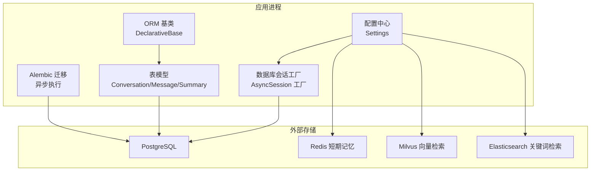
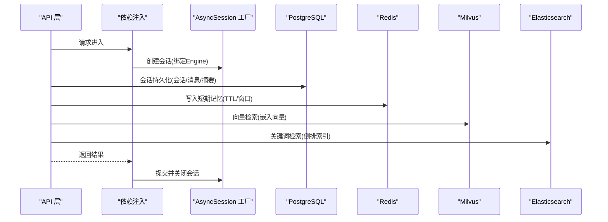
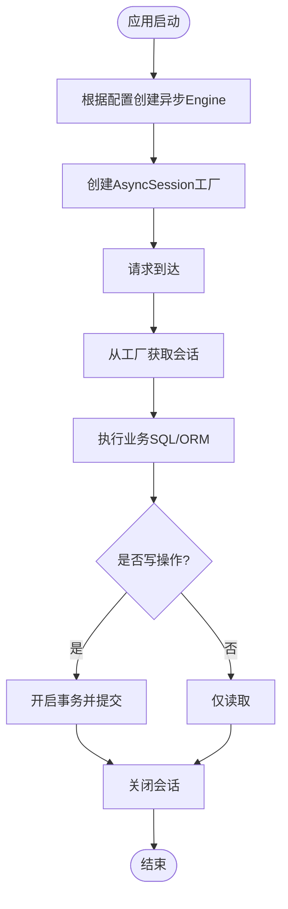
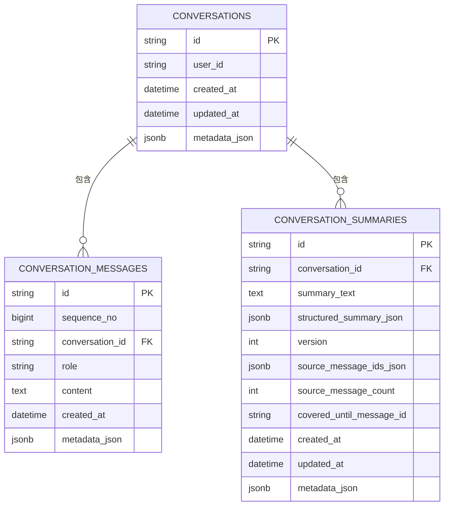
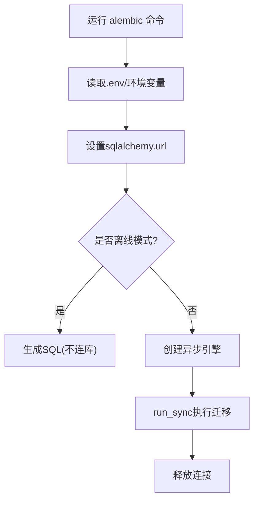
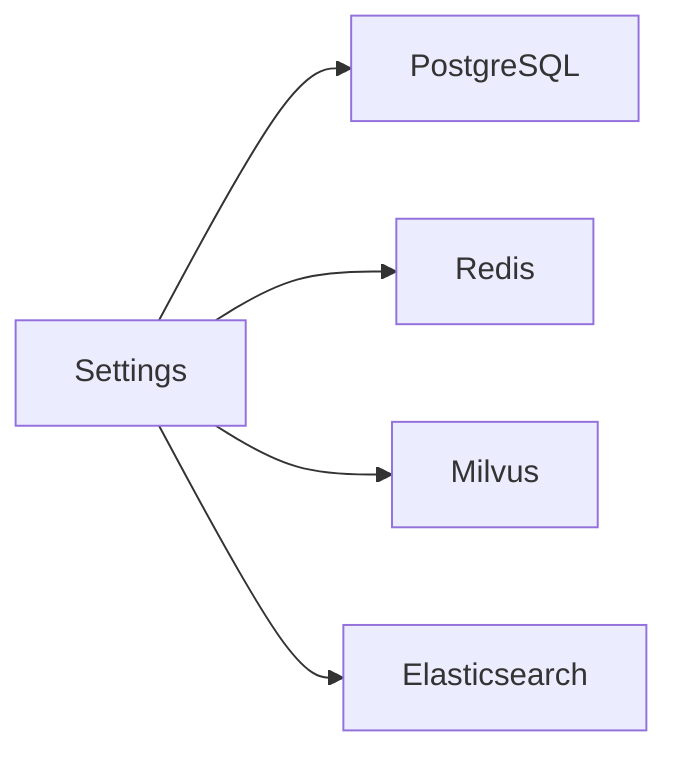
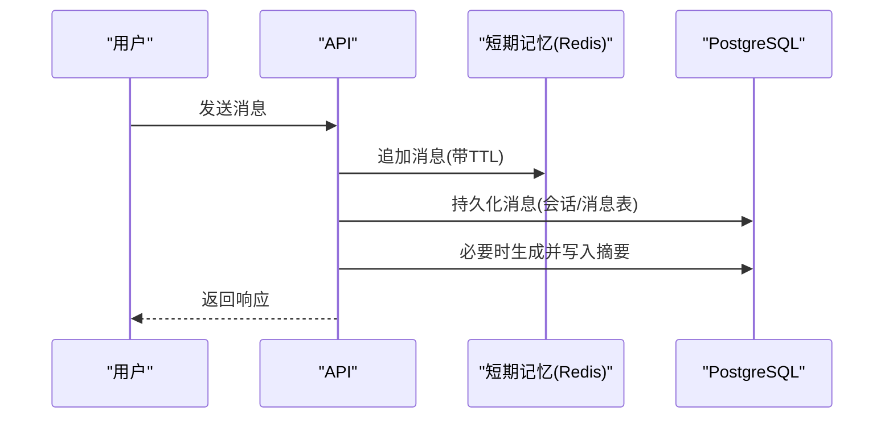
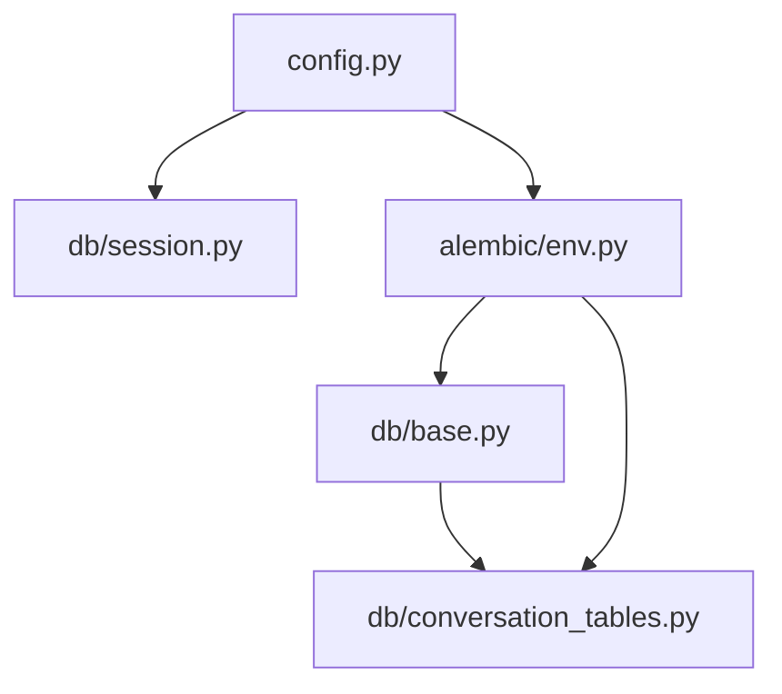

# 存储层设计

<cite>
**本文引用的文件**
- [session.py](file://src/fast_app/db/session.py)
- [base.py](file://src/fast_app/db/base.py)
- [conversation_tables.py](file://src/fast_app/db/conversation_tables.py)
- [env.py](file://alembic/env.py)
- [config.py](file://src/fast_app/core/config.py)
</cite>

## 目录
1. [简介](#简介)
2. [项目结构](#项目结构)
3. [核心组件](#核心组件)
4. [架构总览](#架构总览)
5. [详细组件分析](#详细组件分析)
6. [依赖关系分析](#依赖关系分析)
7. [性能考虑](#性能考虑)
8. [故障排查指南](#故障排查指南)
9. [结论](#结论)
10. [附录](#附录)

## 简介
本文件面向开发者，系统化阐述该项目的存储层设计与多后端适配模式。内容覆盖：
- 数据存储抽象层：数据库连接管理、ORM 模型设计、迁移策略
- 多存储后端集成：PostgreSQL、Redis、Milvus、Elasticsearch
- 会话管理与短期记忆：TTL、窗口化历史、摘要记忆
- 连接池配置与查询优化策略
- 数据一致性、事务处理、备份恢复机制
- 架构图、数据流图与性能优化建议

## 项目结构
存储相关代码主要分布在以下位置：
- 数据库连接与会话工厂：src/fast_app/db/session.py
- ORM 基类与表模型：src/fast_app/db/base.py、src/fast_app/db/conversation_tables.py
- 迁移入口与异步执行：alembic/env.py
- 全局配置（含各后端连接参数）：src/fast_app/core/config.py

**图示来源**
- [session.py:11-32](file://src/fast_app/db/session.py#L11-L32)
- [base.py:1-8](file://src/fast_app/db/base.py#L1-L8)
- [conversation_tables.py:24-171](file://src/fast_app/db/conversation_tables.py#L24-L171)
- [env.py:18-34,61-77:18-34](file://alembic/env.py#L18-L34)
- [config.py:58-82,457-484,520-535:58-82](file://src/fast_app/core/config.py#L58-L82)

**章节来源**
- [session.py:11-32](file://src/fast_app/db/session.py#L11-L32)
- [base.py:1-8](file://src/fast_app/db/base.py#L1-L8)
- [conversation_tables.py:24-171](file://src/fast_app/db/conversation_tables.py#L24-L171)
- [env.py:18-34,61-77:18-34](file://alembic/env.py#L18-L34)
- [config.py:58-82,457-484,520-535:58-82](file://src/fast_app/core/config.py#L58-L82)

## 核心组件
- 数据库连接与会话
  - 通过 Settings 读取 PostgreSQL 连接串与连接池参数，创建异步 Engine 和 AsyncSession 工厂，由请求级依赖负责打开与关闭。
- ORM 模型
  - 基于 DeclarativeBase 的 Base 作为所有表的基类；会话、消息、摘要等表模型定义字段、关系与索引。
- 迁移
  - Alembic 通过 env.py 加载 Settings 中的 database_url，导入所有表模型元数据，使用异步引擎执行迁移。
- 多后端配置
  - 统一在 Settings 中集中声明 Milvus、Elasticsearch、Redis 的连接与行为参数，便于运行时切换与扩展。

**章节来源**
- [session.py:11-32](file://src/fast_app/db/session.py#L11-L32)
- [base.py:1-8](file://src/fast_app/db/base.py#L1-L8)
- [conversation_tables.py:24-171](file://src/fast_app/db/conversation_tables.py#L24-L171)
- [env.py:18-34,61-77:18-34](file://alembic/env.py#L18-L34)
- [config.py:58-82,457-484,520-535:58-82](file://src/fast_app/core/config.py#L58-L82)

## 架构总览
存储层采用“配置驱动 + 异步会话 + ORM 模型 + 迁移”的统一抽象，上层业务通过依赖注入获取会话，读写持久化数据；同时通过 Settings 接入 Redis、Milvus、Elasticsearch 等专用存储，形成“关系型 + 缓存 + 向量 + 全文检索”的多模态存储体系。

**图示来源**
- [session.py:11-32](file://src/fast_app/db/session.py#L11-L32)
- [conversation_tables.py:24-171](file://src/fast_app/db/conversation_tables.py#L24-L171)
- [config.py:58-82,457-484,520-535:58-82](file://src/fast_app/core/config.py#L58-L82)

## 详细组件分析

### 数据库连接与会话管理
- 连接创建
  - 使用 Settings.database_url、database_pool_size、database_max_overflow、database_echo 等参数创建异步 Engine，启用 pool_pre_ping 提升健壮性。
- 会话工厂
  - 通过 async_sessionmaker 创建请求级会话工厂，expire_on_commit=False 避免提交后对象失效，配合 FastAPI 依赖在请求结束时关闭会话。
- 事务边界
  - 建议在业务层以显式事务包裹写操作，确保一致性；读操作可复用只读路径或独立事务。

**图示来源**
- [session.py:11-32](file://src/fast_app/db/session.py#L11-L32)

**章节来源**
- [session.py:11-32](file://src/fast_app/db/session.py#L11-L32)
- [config.py:520-535](file://src/fast_app/core/config.py#L520-L535)

### ORM 模型设计（会话、消息、摘要）
- 会话容器
  - conversations：会话主键、用户标识、时间戳、JSONB 元数据，关联消息与摘要。
- 消息记录
  - conversation_messages：角色、内容、序列号、时间戳、JSONB 元数据；按 conversation_id + created_at、conversation_id + sequence_no 建立索引，优化查询与排序。
- 摘要版本
  - conversation_summaries：保存窗口外历史的可追溯摘要，包含结构化摘要、版本、来源消息集合、覆盖范围等，并按 conversation_id + version 建索引。

**图示来源**
- [conversation_tables.py:24-171](file://src/fast_app/db/conversation_tables.py#L24-L171)

**章节来源**
- [conversation_tables.py:24-171](file://src/fast_app/db/conversation_tables.py#L24-L171)

### 迁移策略（Alembic 异步执行）
- 环境初始化
  - env.py 将 Settings.database_url 注入到 Alembic 配置，导入所有表模型元数据，以便生成/执行迁移。
- 在线/离线模式
  - 离线模式仅生成 SQL；在线模式通过异步引擎连接数据库并执行迁移。
- 最佳实践
  - 每次变更表结构新增独立迁移脚本；保持幂等与回滚能力；生产环境先离线校验再在线执行。

**图示来源**
- [env.py:18-34,61-77:18-34](file://alembic/env.py#L18-L34)

**章节来源**
- [env.py:18-34,61-77:18-34](file://alembic/env.py#L18-L34)

### 多后端集成模式（PostgreSQL、Redis、Milvus、Elasticsearch）
- PostgreSQL
  - 通过 Settings.database_url 与连接池参数构建异步 Engine；会话工厂提供请求级会话；表模型与索引支撑高并发读写。
- Redis（短期会话记忆）
  - 通过 Settings.memory_store_provider、redis_url、memory_ttl_seconds、memory_max_messages、memory_history_max_turns 控制短期记忆提供者、TTL、消息上限与历史窗口。
- Milvus（向量检索）
  - 通过 Settings.milvus_host/port/collection/vector/content/id field 等配置，结合 embedding 维度与检索参数进行向量相似度检索。
- Elasticsearch（关键词检索）
  - 通过 Settings.elasticsearch_url/index_name/username/password/request_timeout 配置客户端与索引名，支持关键词匹配与过滤。

**图示来源**
- [config.py:58-82,457-484,520-535:58-82](file://src/fast_app/core/config.py#L58-L82)

**章节来源**
- [config.py:58-82,457-484,520-535:58-82](file://src/fast_app/core/config.py#L58-L82)

### 会话管理与短期记忆
- 长期会话
  - 使用 conversations 表持久化会话容器，messages 表记录每轮对话，summaries 表维护窗口外摘要版本，支持溯源与回溯。
- 短期记忆
  - 使用 Redis 存储最近消息列表，按 TTL 自动过期；通过 memory_max_messages 限制长度，memory_history_max_turns 控制后续逻辑可见的历史轮数。
- 摘要记忆
  - 当超过阈值时触发摘要生成，落盘 summaries 表，减少上下文膨胀，提高检索与生成效率。

**图示来源**
- [conversation_tables.py:24-171](file://src/fast_app/db/conversation_tables.py#L24-L171)
- [config.py:457-484](file://src/fast_app/core/config.py#L457-L484)

**章节来源**
- [conversation_tables.py:24-171](file://src/fast_app/db/conversation_tables.py#L24-L171)
- [config.py:457-484](file://src/fast_app/core/config.py#L457-L484)

### 数据一致性、事务与备份恢复
- 一致性
  - 写操作建议使用显式事务；对跨存储的写（如同时更新 PostgreSQL 与检索索引）采用“先写主存、再写索引”的策略，失败时回滚主存。
- 事务
  - 会话级事务保证原子性；长事务需避免持有锁过久；批量写入建议分批提交。
- 备份恢复
  - PostgreSQL：定期逻辑/物理备份；迁移脚本用于结构演进与回滚。
  - Redis：利用 TTL 与持久化策略；关键会话状态可双写到 PostgreSQL。
  - Milvus/ES：定期快照与重建索引流程；增量同步需保证幂等。

[本节为通用指导，不直接引用具体文件]

### 查询优化策略
- 索引设计
  - 针对高频查询列建立复合索引，如 conversation_id + created_at、conversation_id + sequence_no、conversation_id + version。
- 分页与窗口
  - 使用 sequence_no 或 created_at 进行分页；短期记忆通过 memory_max_messages 限制长度。
- 只读路径
  - 读多写少场景可使用只读副本或缓存；向量与关键词检索走专门后端，减轻主库压力。
- 批处理
  - 批量插入/更新时使用批量接口，降低往返开销。

**章节来源**
- [conversation_tables.py:94-105,164-170:94-105](file://src/fast_app/db/conversation_tables.py#L94-L105)
- [config.py:457-484](file://src/fast_app/core/config.py#L457-L484)

## 依赖关系分析
- 模块耦合
  - session.py 依赖 config.py 提供的数据库连接参数；env.py 依赖 config.py 与 db.base 的元数据；conversation_tables.py 依赖 base.py 的 Base。
- 外部依赖
  - PostgreSQL、Redis、Milvus、Elasticsearch 均通过 Settings 配置，解耦实现细节，便于替换与测试。
- 潜在循环依赖
  - 当前结构清晰，无循环导入风险；迁移入口集中管理依赖。

**图示来源**
- [session.py:11-32](file://src/fast_app/db/session.py#L11-L32)
- [base.py:1-8](file://src/fast_app/db/base.py#L1-L8)
- [conversation_tables.py:24-171](file://src/fast_app/db/conversation_tables.py#L24-L171)
- [env.py:18-34](file://alembic/env.py#L18-L34)
- [config.py:520-535](file://src/fast_app/core/config.py#L520-L535)

**章节来源**
- [session.py:11-32](file://src/fast_app/db/session.py#L11-L32)
- [base.py:1-8](file://src/fast_app/db/base.py#L1-L8)
- [conversation_tables.py:24-171](file://src/fast_app/db/conversation_tables.py#L24-L171)
- [env.py:18-34](file://alembic/env.py#L18-L34)
- [config.py:520-535](file://src/fast_app/core/config.py#L520-L535)

## 性能考虑
- 连接池调优
  - 根据并发量调整 database_pool_size 与 database_max_overflow；启用 pool_pre_ping 提升稳定性。
- 索引与查询
  - 充分利用复合索引；避免全表扫描；合理使用 JSONB 字段与表达式索引。
- 缓存与分层
  - 热点数据优先走 Redis；向量与关键词检索走 Milvus/ES，降低主库压力。
- 超时与重试
  - 合理设置外部调用超时与重试次数，避免雪崩；对慢查询进行监控与告警。
- 批处理与分页
  - 批量写入减少网络往返；分页查询控制单次负载。

[本节为通用指导，不直接引用具体文件]

## 故障排查指南
- 连接问题
  - 检查 database_url、端口、认证信息；确认连接池耗尽前未出现泄漏。
- 迁移失败
  - 使用离线模式生成 SQL 预检；核对目标库权限与版本；逐步执行并记录日志。
- 会话丢失
  - 检查 Redis TTL 与持久化策略；必要时将关键会话状态双写到 PostgreSQL。
- 检索异常
  - 验证 Milvus/ES 索引与映射；检查嵌入维度与字段对齐；对比向量与关键词结果一致性。

**章节来源**
- [session.py:11-32](file://src/fast_app/db/session.py#L11-L32)
- [env.py:61-77](file://alembic/env.py#L61-L77)
- [config.py:58-82,457-484,520-535:58-82](file://src/fast_app/core/config.py#L58-L82)

## 结论
本项目存储层以配置为中心、异步会话为纽带、ORM 模型为抽象、迁移为演进手段，构建了稳定可扩展的多后端存储体系。通过合理的索引设计、缓存分层与超时重试策略，兼顾了性能与可靠性。未来可在更多业务域引入统一的存储适配器，进一步屏蔽后端差异，提升可维护性与可测试性。

[本节为总结性内容，不直接引用具体文件]

## 附录
- 常用配置项速查
  - PostgreSQL：DATABASE_URL、DATABASE_POOL_SIZE、DATABASE_MAX_OVERFLOW、DATABASE_ECHO
  - Redis：REDIS_URL、MEMORY_TTL_SECONDS、MEMORY_MAX_MESSAGES、MEMORY_HISTORY_MAX_TURNS
  - Milvus：MILVUS_HOST、MILVUS_PORT、MILVUS_COLLECTION_NAME、MILVUS_VECTOR_FIELD
  - Elasticsearch：ELASTICSEARCH_URL、ELASTICSEARCH_INDEX_NAME、ELASTICSEARCH_USERNAME、ELASTICSEARCH_PASSWORD、ELASTICSEARCH_REQUEST_TIMEOUT

**章节来源**
- [config.py:58-82,457-484,520-535:58-82](file://src/fast_app/core/config.py#L58-L82)