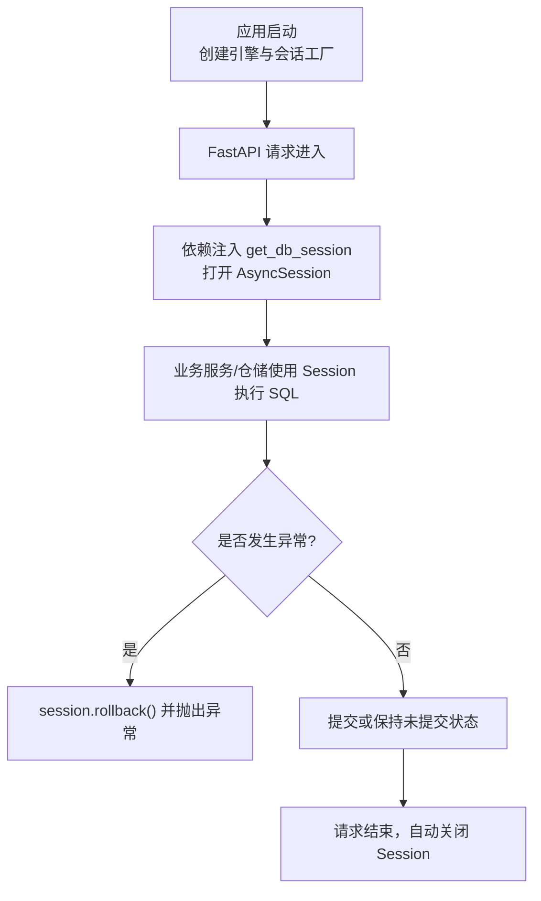
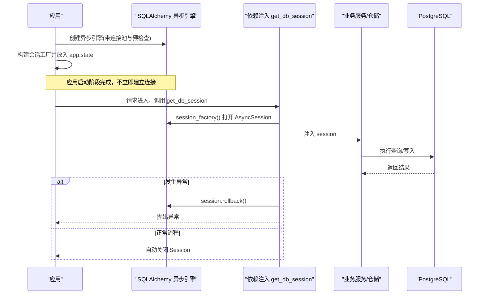
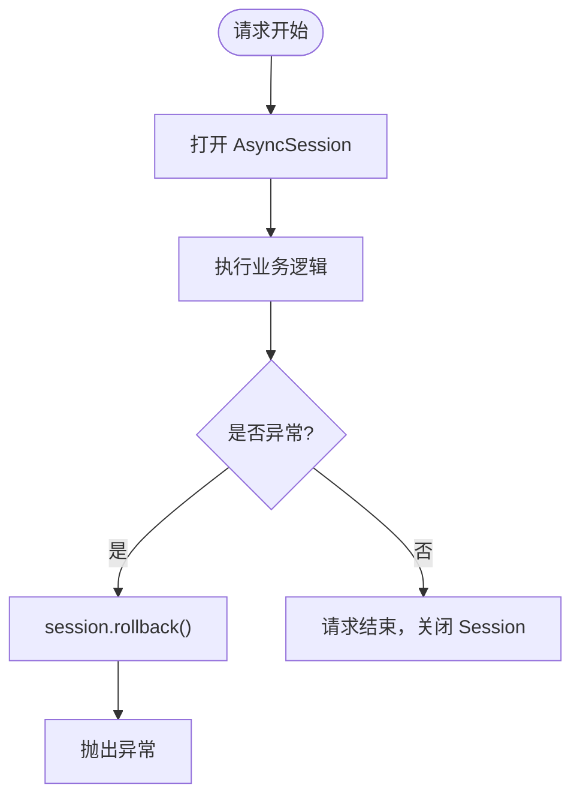
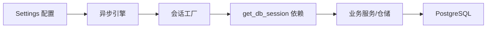

# 数据库连接管理

<cite>
**本文引用的文件**
- [src/fast_app/db/session.py](file://src/fast_app/db/session.py)
- [src/fast_app/core/config.py](file://src/fast_app/core/config.py)
- [src/fast_app/dependencies/rag_dependencies.py](file://src/fast_app/dependencies/rag_dependencies.py)
- [src/fast_app/db/base.py](file://src/fast_app/db/base.py)
</cite>

## 目录
1. [简介](#简介)
2. [项目结构](#项目结构)
3. [核心组件](#核心组件)
4. [架构总览](#架构总览)
5. [详细组件分析](#详细组件分析)
6. [依赖关系分析](#依赖关系分析)
7. [性能与调优](#性能与调优)
8. [故障排查指南](#故障排查指南)
9. [结论](#结论)
10. [附录：最佳实践与常见问题](#附录最佳实践与常见问题)

## 简介
本文件聚焦于本项目中基于 SQLAlchemy 2.0 的异步数据库连接与会话管理，覆盖以下主题：
- 异步 Engine 与 AsyncSession 工厂的配置与生命周期
- PostgreSQL 连接参数、连接池设置、预检查与健康探测
- 请求级会话上下文管理器、事务边界与异常回滚策略
- 并发安全保证与 FastAPI 依赖注入集成
- 连接池性能调优建议、监控指标收集思路与故障转移策略
- 面向开发者的最佳实践与常见问题解决方案

## 项目结构
本项目将数据库连接与会话管理集中在 db 层，并通过配置模块提供可外部化的连接参数；在依赖注入层为每个请求提供独立的异步会话。

图示来源
- [src/fast_app/db/session.py:11-32](file://src/fast_app/db/session.py#L11-L32)
- [src/fast_app/dependencies/rag_dependencies.py:196-208](file://src/fast_app/dependencies/rag_dependencies.py#L196-L208)

章节来源
- [src/fast_app/db/session.py:11-32](file://src/fast_app/db/session.py#L11-L32)
- [src/fast_app/dependencies/rag_dependencies.py:196-208](file://src/fast_app/dependencies/rag_dependencies.py#L196-L208)

## 核心组件
- 异步引擎与会话工厂
  - 通过 create_async_engine 创建异步引擎，传入数据库 URL、日志开关、连接池大小、溢出上限以及 pool_pre_ping 健康探测。
  - 通过 async_sessionmaker 创建请求级会话工厂，绑定引擎，禁用 commit 后自动过期，便于后续读取已提交对象。
- 配置中心
  - 使用 Pydantic Settings 集中管理数据库 URL、echo、pool_size、max_overflow 等参数，支持环境变量与 .env 文件加载。
- 请求级会话依赖
  - 在 FastAPI 依赖函数中，从 app.state 获取会话工厂，使用 async with 打开会话，异常时执行回滚，确保资源释放与事务一致性。
- ORM 基类
  - 提供 DeclarativeBase 作为所有表模型的共同基类，便于 Alembic 迁移与模型声明。

章节来源
- [src/fast_app/db/session.py:11-32](file://src/fast_app/db/session.py#L11-L32)
- [src/fast_app/core/config.py:520-535](file://src/fast_app/core/config.py#L520-L535)
- [src/fast_app/dependencies/rag_dependencies.py:196-208](file://src/fast_app/dependencies/rag_dependencies.py#L196-L208)
- [src/fast_app/db/base.py:1-8](file://src/fast_app/db/base.py#L1-L8)

## 架构总览
下图展示了从应用启动到请求处理的完整数据流与控制流，包括引擎创建、会话工厂装配、请求级会话生命周期与异常处理。

图示来源
- [src/fast_app/db/session.py:11-32](file://src/fast_app/db/session.py#L11-L32)
- [src/fast_app/dependencies/rag_dependencies.py:196-208](file://src/fast_app/dependencies/rag_dependencies.py#L196-L208)

## 详细组件分析

### 异步引擎与会话工厂（SQLAlchemy 2.0）
- 异步引擎
  - 使用 create_async_engine 创建，传入 database_url、echo、pool_size、max_overflow、pool_pre_ping。
  - pool_pre_ping=True 会在每次借出连接前执行轻量探测，有助于快速发现断开的连接并触发重建。
- 会话工厂
  - 使用 async_sessionmaker 绑定引擎，class_=AsyncSession，expire_on_commit=False，避免提交后对象被自动刷新导致额外查询。
- 生命周期
  - 引擎和会话工厂在应用启动时创建一次，放入 app.state，供依赖注入复用。
  - 每个请求通过依赖函数打开一个 AsyncSession，并在请求结束时关闭。

章节来源
- [src/fast_app/db/session.py:11-32](file://src/fast_app/db/session.py#L11-L32)

### 配置与连接参数
- 数据库 URL
  - 默认使用 postgresql+asyncpg 协议，可通过 DATABASE_URL 环境变量覆盖。
- 连接池
  - pool_size 控制常驻连接数，max_overflow 允许临时超出池大小的连接数。
- 调试与日志
  - echo 控制是否输出 SQL 日志，便于开发与问题定位。
- 健康探测
  - pool_pre_ping 开启连接有效性检测，降低“僵尸连接”风险。

章节来源
- [src/fast_app/core/config.py:520-535](file://src/fast_app/core/config.py#L520-L535)
- [src/fast_app/db/session.py:11-20](file://src/fast_app/db/session.py#L11-L20)

### 请求级会话与事务管理
- 会话上下文
  - get_db_session 使用 async with session_factory() 打开会话，确保请求结束后关闭。
- 事务语义
  - 当前实现未显式 begin/commit，由 SQLAlchemy 根据操作类型自动管理事务。
  - 若业务需要明确事务边界，可在仓储或服务层使用 session.begin() 包裹一组写操作。
- 异常回滚
  - 依赖函数捕获异常并执行 rollback，防止部分写入残留。

图示来源
- [src/fast_app/dependencies/rag_dependencies.py:196-208](file://src/fast_app/dependencies/rag_dependencies.py#L196-L208)

章节来源
- [src/fast_app/dependencies/rag_dependencies.py:196-208](file://src/fast_app/dependencies/rag_dependencies.py#L196-L208)

### ORM 基类与模型组织
- Base 继承自 DeclarativeBase，作为所有表模型的统一基类，便于 Alembic 扫描与迁移生成。
- 各表模型文件位于 db 目录下，按功能域拆分，提升可维护性。

章节来源
- [src/fast_app/db/base.py:1-8](file://src/fast_app/db/base.py#L1-L8)

## 依赖关系分析
- 配置依赖
  - 引擎与会话工厂依赖 Settings 中的数据库相关字段。
- 依赖注入依赖
  - get_db_session 依赖 app.state 中的会话工厂，并由上层应用负责初始化。
- 服务层依赖
  - 仓储与服务通过 Depends(get_db_session) 获取会话，避免手动管理连接。

图示来源
- [src/fast_app/core/config.py:520-535](file://src/fast_app/core/config.py#L520-L535)
- [src/fast_app/db/session.py:11-32](file://src/fast_app/db/session.py#L11-L32)
- [src/fast_app/dependencies/rag_dependencies.py:196-208](file://src/fast_app/dependencies/rag_dependencies.py#L196-L208)

章节来源
- [src/fast_app/core/config.py:520-535](file://src/fast_app/core/config.py#L520-L535)
- [src/fast_app/db/session.py:11-32](file://src/fast_app/db/session.py#L11-L32)
- [src/fast_app/dependencies/rag_dependencies.py:196-208](file://src/fast_app/dependencies/rag_dependencies.py#L196-L208)

## 性能与调优
- 连接池参数
  - pool_size：建议设置为并发度与数据库承载能力的平衡点，通常略大于最大并发连接需求。
  - max_overflow：用于应对突发流量，但应谨慎设置以避免耗尽数据库连接资源。
- 健康探测
  - pool_pre_ping 开启后可减少因网络抖动导致的连接失效问题。
- 超时与重试
  - 当前代码未直接设置连接超时与重试策略，建议在驱动层或客户端层补充（例如 asyncpg 的连接超时参数）。
- 监控指标
  - 建议采集：活跃连接数、等待队列长度、连接创建/销毁次数、查询延迟分布、错误率。
  - 可通过 SQLAlchemy 事件监听器或第三方库（如 prometheus-client）暴露指标。
- 故障转移策略
  - 主从或多实例部署时，可在应用层实现多 URL 轮询或按权重路由，结合 pool_pre_ping 快速剔除不可用节点。
  - 对幂等读操作可实施有限重试；写操作需结合事务与唯一约束避免重复提交。

[本节为通用指导，不直接分析具体文件]

## 故障排查指南
- 常见症状
  - 连接池耗尽：表现为请求阻塞或超时，检查 pool_size 与 max_overflow 是否过小，是否存在长事务或未释放会话。
  - 连接断开：pool_pre_ping 可帮助快速发现，必要时增加重试与降级逻辑。
  - 慢查询：开启 echo 或启用数据库慢查询日志，结合索引优化与查询改写。
- 定位步骤
  - 确认应用启动时是否正确创建引擎与会话工厂。
  - 检查 get_db_session 是否在异常路径执行了 rollback。
  - 核对 Settings 中的数据库 URL、池大小、溢出上限是否符合预期。
- 改进建议
  - 为关键写操作添加显式事务边界，确保失败时整体回滚。
  - 引入连接池监控与告警，及时感知资源紧张。
  - 对不稳定外部依赖（如数据库、向量检索）增加超时与重试策略。

章节来源
- [src/fast_app/db/session.py:11-32](file://src/fast_app/db/session.py#L11-L32)
- [src/fast_app/dependencies/rag_dependencies.py:196-208](file://src/fast_app/dependencies/rag_dependencies.py#L196-L208)
- [src/fast_app/core/config.py:520-535](file://src/fast_app/core/config.py#L520-L535)

## 结论
本项目采用 SQLAlchemy 2.0 的异步引擎与会话工厂，结合 FastAPI 依赖注入实现了请求级会话管理与异常回滚。通过配置中心统一管理数据库连接参数，配合连接池健康探测，提升了连接的稳定性与可观测性。生产环境建议进一步补充连接超时、重试、监控指标与故障转移策略，以增强系统的韧性与可运维性。

[本节为总结性内容，不直接分析具体文件]

## 附录：最佳实践与常见问题
- 最佳实践
  - 始终通过依赖注入获取会话，避免全局共享或手动管理连接。
  - 对写操作使用显式事务边界，确保原子性与一致性。
  - 合理设置连接池大小与溢出上限，结合压测确定最优值。
  - 开启 pool_pre_ping，并结合监控及时发现连接问题。
  - 使用 alembic 管理数据库变更，保持模型与迁移一致。
- 常见问题
  - 为什么没有显式 begin/commit？
    - 当前实现依赖 SQLAlchemy 自动事务管理；如需更细粒度控制，可在服务层显式管理事务。
  - 如何增加连接超时？
    - 可在驱动层（如 asyncpg）配置连接超时参数，或在客户端层封装重试与超时逻辑。
  - 如何监控连接池？
    - 通过 SQLAlchemy 事件监听器或第三方库暴露指标，结合监控系统进行告警。
  - 如何处理数据库重启或网络抖动？
    - 利用 pool_pre_ping 快速剔除坏连接，结合重试与降级策略提高可用性。

[本节为通用指导，不直接分析具体文件]