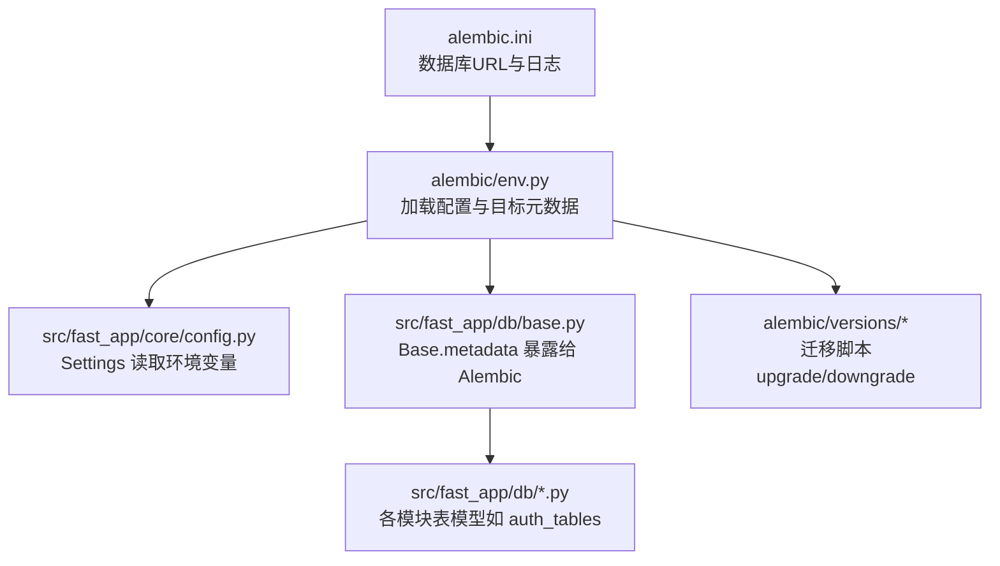
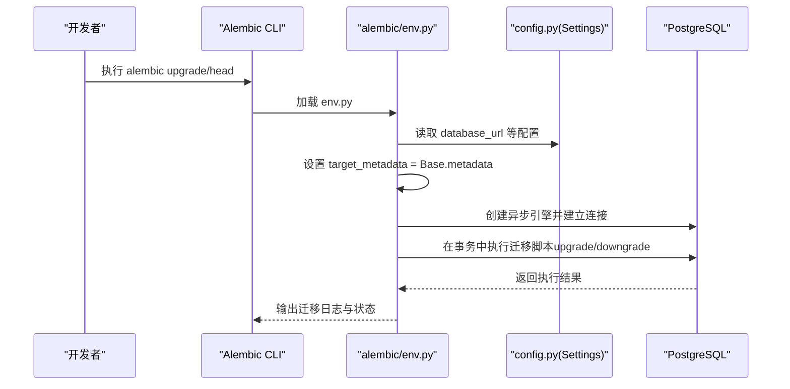
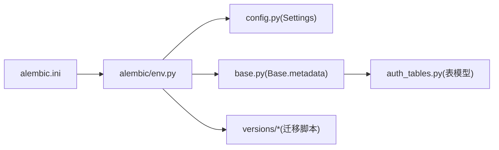

# 迁移策略

<cite>
**本文引用的文件**
- [alembic.ini](file://python-agent-study/alembic.ini)
- [env.py](file://python-agent-study/alembic/env.py)
- [20260624_0001_create_conversation_tables.py](file://python-agent-study/alembic/versions/20260624_0001_create_conversation_tables.py)
- [20260731_0012_add_nl2sql_datasets.py](file://python-agent-study/alembic/versions/20260731_0012_add_nl2sql_datasets.py)
- [20260729_0011_add_nl2sql_rbac_and_audit.py](file://python-agent-study/alembic/versions/20260729_0011_add_nl2sql_rbac_and_audit.py)
- [base.py](file://python-agent-study/src/fast_app/db/base.py)
- [session.py](file://python-agent-study/src/fast_app/db/session.py)
- [auth_tables.py](file://python-agent-study/src/fast_app/db/auth_tables.py)
- [config.py](file://python-agent-study/src/fast_app/core/config.py)
</cite>

## 目录
1. [简介](#简介)
2. [项目结构](#项目结构)
3. [核心组件](#核心组件)
4. [架构总览](#架构总览)
5. [详细组件分析](#详细组件分析)
6. [依赖关系分析](#依赖关系分析)
7. [性能考虑](#性能考虑)
8. [故障排查指南](#故障排查指南)
9. [结论](#结论)
10. [附录](#附录)

## 简介
本文件面向团队提供一套标准化的数据库版本管理与协作开发流程，基于 Alembic 对 PostgreSQL 进行可回滚、可审计的迁移管理。文档覆盖版本控制、迁移脚本生成与编写规范、环境配置、生产执行与灰度发布策略、数据一致性保证、冲突解决、依赖关系管理以及自动化测试集成等主题，帮助团队在复杂业务演进中安全地推进数据库变更。

## 项目结构
本项目采用“配置 + ORM 模型 + 迁移脚本”的分层组织方式：
- 配置层：通过 Pydantic Settings 集中管理数据库连接参数与环境变量，Alembic 运行时从配置注入数据库 URL。
- ORM 层：所有表模型继承统一基类，便于 Alembic 自动发现元数据并生成/应用迁移。
- 迁移层：按时间戳命名版本，每个版本包含 upgrade/downgrade，支持增量 DDL 与少量数据初始化。

图示来源
- [alembic.ini:1-42](file://python-agent-study/alembic.ini#L1-L42)
- [env.py:1-84](file://python-agent-study/alembic/env.py#L1-L84)
- [config.py:520-535](file://python-agent-study/src/fast_app/core/config.py#L520-L535)
- [base.py:1-8](file://python-agent-study/src/fast_app/db/base.py#L1-L8)

章节来源
- [alembic.ini:1-42](file://python-agent-study/alembic.ini#L1-L42)
- [env.py:1-84](file://python-agent-study/alembic/env.py#L1-L84)
- [config.py:520-535](file://python-agent-study/src/fast_app/core/config.py#L520-L535)
- [base.py:1-8](file://python-agent-study/src/fast_app/db/base.py#L1-L8)

## 核心组件
- Alembic 配置与运行入口
  - alembic.ini 指定脚本位置、SQLAlchemy URL、日志级别等。
  - env.py 负责导入 ORM 模型、设置目标元数据、在线/离线模式切换、异步引擎创建与迁移执行。
- ORM 模型与元数据
  - base.py 定义 DeclarativeBase，所有表模型继承该基类，使 Alembic 能扫描到完整 metadata。
  - auth_tables.py 等模块定义了认证、权限、部门等核心表结构。
- 配置中心
  - config.py 使用 Settings 集中管理 DATABASE_URL、池大小、是否打印 SQL 等，供 Alembic 与业务代码复用。

章节来源
- [alembic.ini:1-42](file://python-agent-study/alembic.ini#L1-L42)
- [env.py:1-84](file://python-agent-study/alembic/env.py#L1-L84)
- [base.py:1-8](file://python-agent-study/src/fast_app/db/base.py#L1-L8)
- [auth_tables.py:1-431](file://python-agent-study/src/fast_app/db/auth_tables.py#L1-L431)
- [config.py:520-535](file://python-agent-study/src/fast_app/core/config.py#L520-L535)

## 架构总览
下图展示了从命令行触发迁移到实际执行 SQL 的端到端流程，包括配置加载、异步引擎创建、事务包裹与迁移执行。

图示来源
- [env.py:31-83](file://python-agent-study/alembic/env.py#L31-L83)
- [config.py:520-535](file://python-agent-study/src/fast_app/core/config.py#L520-L535)

## 详细组件分析

### Alembic 环境与异步执行
- 配置注入：env.py 通过 get_settings() 获取数据库 URL，并覆盖 alembic.ini 中的 sqlalchemy.url，确保多环境一致。
- 元数据绑定：target_metadata 指向 Base.metadata，确保所有表模型被纳入迁移检测。
- 在线/离线模式：
  - 离线模式：仅生成 SQL，不连接数据库，适合 CI 或预览。
  - 在线模式：通过 asyncpg 创建异步引擎，使用 run_sync 将同步迁移逻辑绑定到异步连接上执行。
- 事务包裹：迁移在 begin_transaction 中执行，失败自动回滚，保障原子性。

章节来源
- [env.py:18-34](file://python-agent-study/alembic/env.py#L18-L34)
- [env.py:37-83](file://python-agent-study/alembic/env.py#L37-L83)

### 迁移脚本结构与规范
- 版本标识：revision、down_revision、branch_labels、depends_on 明确版本链与分支依赖。
- 升级与回滚：每个脚本必须实现 upgrade 与 downgrade，确保可逆。
- 数据操作：
  - 小量数据初始化可使用 bulk_insert。
  - 复杂数据迁移建议拆分为独立脚本，并在 downgrade 中提供反向清理。
- 约束与索引：DDL 变更应显式声明约束、索引，避免隐式行为。

示例参考路径
- [20260624_0001_create_conversation_tables.py:20-86](file://python-agent-study/alembic/versions/20260624_0001_create_conversation_tables.py#L20-L86)
- [20260731_0012_add_nl2sql_datasets.py:18-126](file://python-agent-study/alembic/versions/20260731_0012_add_nl2sql_datasets.py#L18-L126)
- [20260729_0011_add_nl2sql_rbac_and_audit.py:17-139](file://python-agent-study/alembic/versions/20260729_0011_add_nl2sql_rbac_and_audit.py#L17-L139)

章节来源
- [20260624_0001_create_conversation_tables.py:1-86](file://python-agent-study/alembic/versions/20260624_0001_create_conversation_tables.py#L1-L86)
- [20260731_0012_add_nl2sql_datasets.py:1-126](file://python-agent-study/alembic/versions/20260731_0012_add_nl2sql_datasets.py#L1-L126)
- [20260729_0011_add_nl2sql_rbac_and_audit.py:1-139](file://python-agent-study/alembic/versions/20260729_0011_add_nl2sql_rbac_and_audit.py#L1-L139)

### ORM 模型与迁移联动
- 基类设计：Base 作为所有表的共同基类，Alembic 通过 Base.metadata 扫描全部表结构。
- 表模型组织：按领域拆分模块（如 auth_tables），便于维护与迁移生成。
- 字段与关系：使用 SQLAlchemy 类型、约束、外键与索引，确保迁移生成的 DDL 与 ORM 一致。

章节来源
- [base.py:1-8](file://python-agent-study/src/fast_app/db/base.py#L1-L8)
- [auth_tables.py:13-431](file://python-agent-study/src/fast_app/db/auth_tables.py#L13-L431)

### 配置与数据库连接
- 配置来源：Settings 从 .env 与环境变量读取 DATABASE_URL、池大小、是否打印 SQL 等。
- 引擎与会话：业务侧通过 create_async_engine 与 async_sessionmaker 创建连接与会话；迁移侧通过 env.py 的异步引擎执行迁移。
- 环境隔离：不同环境通过环境变量切换数据库地址与调试开关，保证迁移与运行一致性。

章节来源
- [config.py:520-535](file://python-agent-study/src/fast_app/core/config.py#L520-L535)
- [session.py:11-33](file://python-agent-study/src/fast_app/db/session.py#L11-L33)

### 迁移流程与回滚策略
- 版本链管理：通过 revision 与 down_revision 形成线性版本链；必要时使用 branch_labels 与 depends_on 表达分支与依赖。
- 回滚策略：
  - 优先保证 downgrade 可逆，删除索引、表、约束的顺序应与创建相反。
  - 数据清理应在 downgrade 中显式处理，避免残留脏数据。
- 大表变更：
  - 新增非空列时提供默认值或分步迁移（先允许为空，再回填，最后加约束）。
  - 重建索引或分区建议在低峰期执行，并监控锁等待。

章节来源
- [20260624_0001_create_conversation_tables.py:79-86](file://python-agent-study/alembic/versions/20260624_0001_create_conversation_tables.py#L79-L86)
- [20260731_0012_add_nl2sql_datasets.py:124-126](file://python-agent-study/alembic/versions/20260731_0012_add_nl2sql_datasets.py#L124-L126)
- [20260729_0011_add_nl2sql_rbac_and_audit.py:123-139](file://python-agent-study/alembic/versions/20260729_0011_add_nl2sql_rbac_and_audit.py#L123-L139)

### 生产环境迁移执行与灰度发布
- 执行时机：服务启动前执行 alembic upgrade head，确保数据库与代码版本一致。
- 灰度策略：
  - 分批滚动更新实例，先迁移数据库，再逐步发布新版本服务。
  - 对于破坏性变更，采用双写/兼容字段过渡，旧版本仍可读写新字段。
- 一致性保证：
  - 迁移在事务中执行，失败自动回滚。
  - 关键数据变更配合幂等脚本与重试机制，避免重复执行导致不一致。

章节来源
- [env.py:61-83](file://python-agent-study/alembic/env.py#L61-L83)

### 数据一致性校验与审计
- 约束与检查：DDL 中使用 CheckConstraint、UniqueConstraint 与 Index 保证数据完整性与查询性能。
- 审计记录：为敏感操作引入审计表（如查询审计），记录用户、数据集、SQL 哈希、执行耗时等。
- 权限与角色：通过 RBAC 表结构限制数据访问范围，结合 Dataset Grant 实现细粒度授权。

章节来源
- [20260729_0011_add_nl2sql_rbac_and_audit.py:17-121](file://python-agent-study/alembic/versions/20260729_0011_add_nl2sql_rbac_and_audit.py#L17-L121)
- [auth_tables.py:134-431](file://python-agent-study/src/fast_app/db/auth_tables.py#L134-L431)

### 迁移冲突解决与依赖管理
- 冲突识别：当多人并行修改同一表或存在循环依赖时，需合并版本链。
- 解决步骤：
  - 锁定相关表，暂停无关变更。
  - 重新规划版本顺序，调整 down_revision 与 depends_on。
  - 在本地与测试环境验证后，合并至主干。
- 依赖管理：
  - 使用 depends_on 显式声明跨分支依赖。
  - 对公共基础表变更，优先创建独立迁移，再由功能迁移引用。

章节来源
- [env.py:18-34](file://python-agent-study/alembic/env.py#L18-L34)

### 自动化测试集成
- 单元测试：使用内存或临时数据库执行迁移，验证 schema 与约束。
- 集成测试：在 CI 中拉起真实数据库，执行 alembic upgrade head 后运行用例。
- 回滚测试：对关键迁移编写 downgrade 验证，确保可逆。
- 数据种子：对需要初始数据的迁移，提供幂等的 seed 脚本，避免重复插入。

章节来源
- [env.py:37-83](file://python-agent-study/alembic/env.py#L37-L83)

## 依赖关系分析

图示来源
- [alembic.ini:1-42](file://python-agent-study/alembic.ini#L1-L42)
- [env.py:18-34](file://python-agent-study/alembic/env.py#L18-L34)
- [base.py:1-8](file://python-agent-study/src/fast_app/db/base.py#L1-L8)
- [auth_tables.py:13-431](file://python-agent-study/src/fast_app/db/auth_tables.py#L13-L431)

章节来源
- [alembic.ini:1-42](file://python-agent-study/alembic.ini#L1-L42)
- [env.py:18-34](file://python-agent-study/alembic/env.py#L18-L34)

## 性能考虑
- 连接池：通过 Settings 配置 pool_size 与 max_overflow，避免连接耗尽。
- 索引策略：为大表查询添加合适索引，迁移中显式创建与维护。
- 批量写入：使用 bulk_insert 减少往返开销。
- 迁移窗口：大表 DDL 建议在低峰期执行，并监控锁等待与慢查询。

章节来源
- [config.py:520-535](file://python-agent-study/src/fast_app/core/config.py#L520-L535)
- [20260731_0012_add_nl2sql_datasets.py:58-121](file://python-agent-study/alembic/versions/20260731_0012_add_nl2sql_datasets.py#L58-L121)

## 故障排查指南
- 迁移失败
  - 检查 alembic 日志级别与 SQLAlchemy 日志，定位具体 SQL 错误。
  - 确认数据库连接与权限正确，环境变量未泄露或拼写错误。
- 版本不一致
  - 使用 alembic current 查看当前版本，对比期望版本。
  - 若出现分支冲突，手动调整 down_revision 并合并。
- 回滚问题
  - 确保 downgrade 实现完整且幂等。
  - 对数据清理脚本增加条件判断，避免误删。
- 性能退化
  - 检查新增索引是否命中，是否存在全表扫描。
  - 评估大表变更是否需要分阶段执行。

章节来源
- [alembic.ini:18-42](file://python-agent-study/alembic.ini#L18-L42)
- [env.py:37-83](file://python-agent-study/alembic/env.py#L37-L83)

## 结论
本项目通过 Alembic 实现了标准化、可回滚、可审计的数据库迁移体系。结合统一的 ORM 模型与集中化配置，团队能够在多环境、多分支下安全推进数据库变更。建议在生产环境中严格执行“先迁移、后发布”的流程，配合灰度发布与自动化测试，确保数据一致性与系统稳定性。

## 附录
- 常用命令
  - 生成迁移：根据模型变更生成新脚本。
  - 应用迁移：升级到最新版本或指定版本。
  - 查看历史：列出迁移历史与当前版本。
  - 回滚：回退到上一版本或指定版本。
- 最佳实践
  - 每个迁移只完成一个清晰的目标。
  - 保持 upgrade 与 downgrade 对称。
  - 对数据变更进行幂等设计。
  - 在 CI 中执行迁移与测试，确保质量门禁。