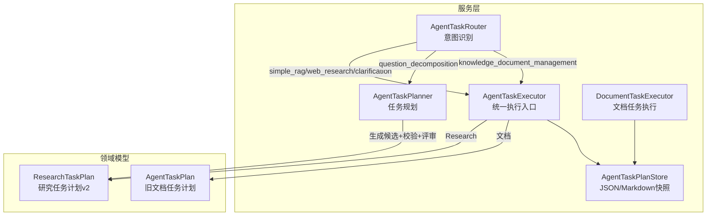
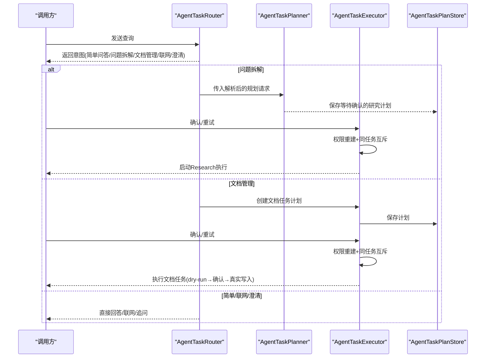
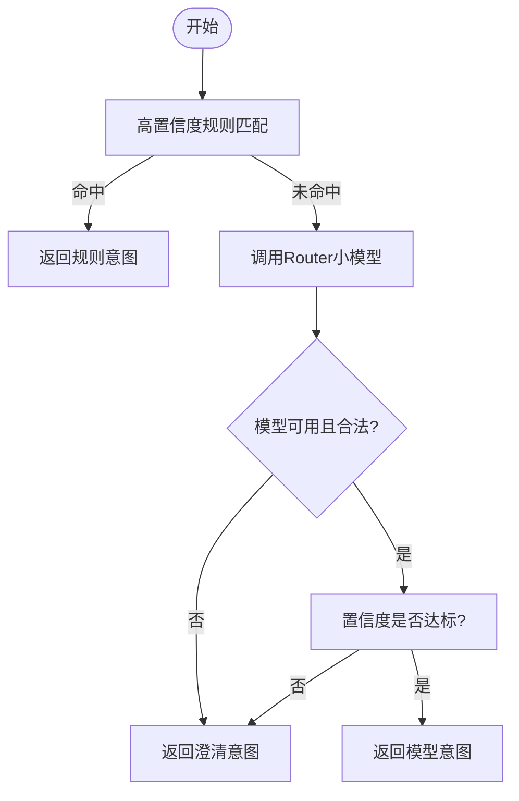
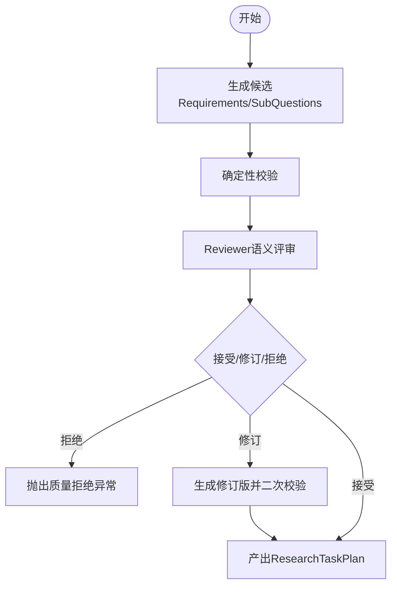
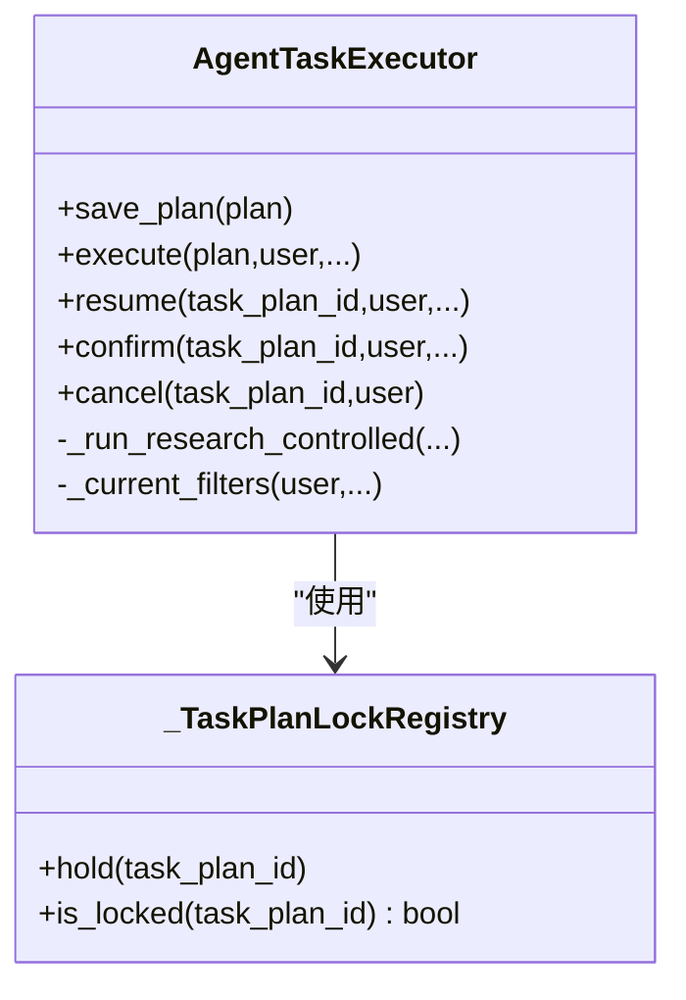
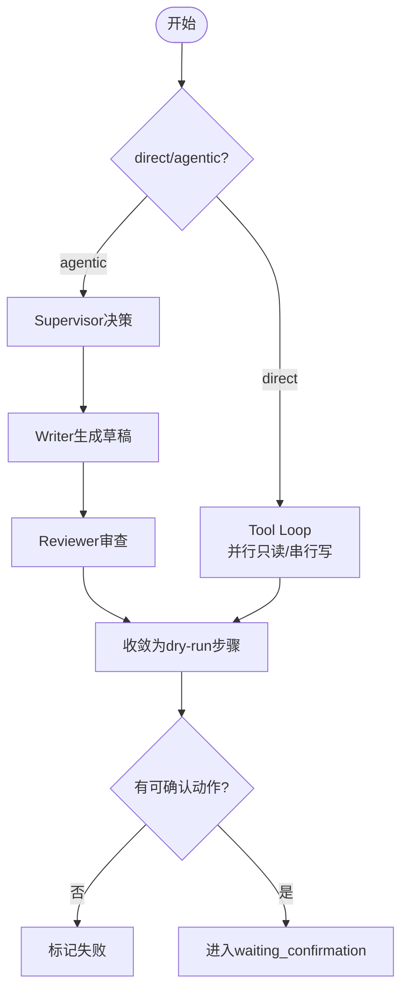
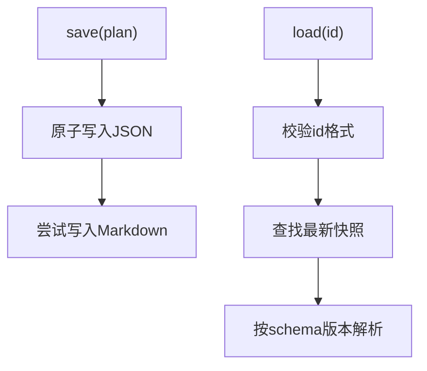
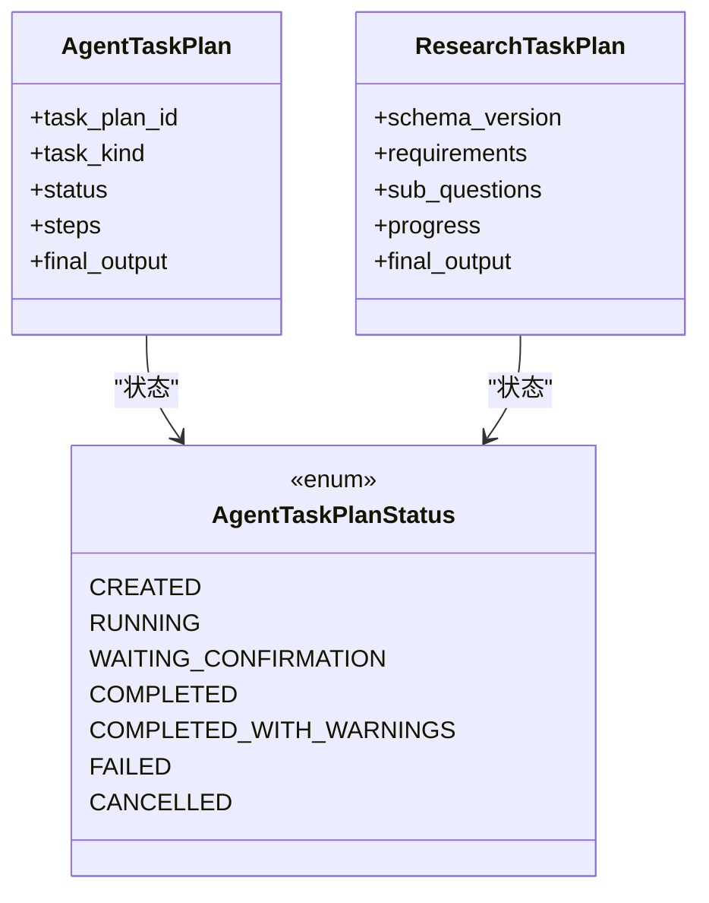
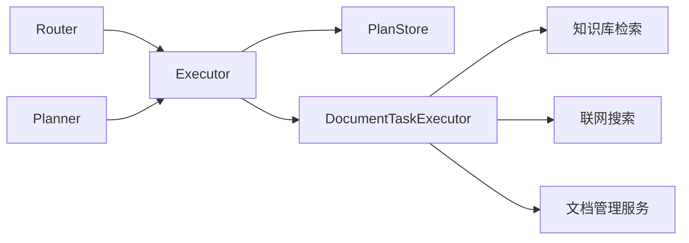

# Agent 任务服务

<cite>
**本文引用的文件**
- [agent_task_router.py](file://python-agent-study/src/fast_app/services/agent_tasks/agent_task_router.py)
- [agent_task_planner.py](file://python-agent-study/src/fast_app/services/agent_tasks/agent_task_planner.py)
- [agent_task_executor.py](file://python-agent-study/src/fast_app/services/agent_tasks/agent_task_executor.py)
- [document_task_executor.py](file://python-agent-study/src/fast_app/services/agent_tasks/document_task_executor.py)
- [agent_task_plan_store.py](file://python-agent-study/src/fast_app/services/agent_tasks/agent_task_plan_store.py)
- [agent_task_plan.py](file://python-agent-study/src/fast_app/domain/agent_task_plan.py)
- [research_task_plan.py](file://python-agent-study/src/fast_app/domain/research_task_plan.py)
</cite>

## 目录
1. [简介](#简介)
2. [项目结构](#项目结构)
3. [核心组件](#核心组件)
4. [架构总览](#架构总览)
5. [详细组件分析](#详细组件分析)
6. [依赖关系分析](#依赖关系分析)
7. [性能与并发控制](#性能与并发控制)
8. [故障排查指南](#故障排查指南)
9. [结论](#结论)
10. [附录：开发者指南](#附录开发者指南)

## 简介
本服务提供多 Agent 协作的任务编排能力，覆盖意图识别、任务分解、并行执行与结果聚合。其核心由三类角色组成：
- 路由层：AgentTaskRouter，负责将用户请求分类为简单问答、问题拆解、文档管理、联网检索或需要澄清等意图。
- 规划层：AgentTaskPlanner，将复杂问题拆分为可验证的 Requirement 与 SubQuestion，并经过校验与评审后生成可确认的计划。
- 执行层：AgentTaskExecutor 作为统一入口，按任务类型分派到 Research 执行器或文档任务执行器，负责并发控制、权限重建、取消与恢复。

该体系通过结构化模型、确定性校验与人工确认点，确保计划质量与安全执行；同时支持研究任务的依赖波次并行与文档任务的 dry-run 确认机制。

## 项目结构
围绕 Agent 任务服务的核心代码主要位于 fast_app/services/agent_tasks 与 fast_app/domain 两个层次：
- services/agent_tasks：实现路由、规划、执行、存储与具体任务执行逻辑。
- domain：定义任务计划、证据、状态、策略等数据模型。

图表来源
- [agent_task_router.py:178-308](file://python-agent-study/src/fast_app/services/agent_tasks/agent_task_router.py#L178-L308)
- [agent_task_planner.py:88-269](file://python-agent-study/src/fast_app/services/agent_tasks/agent_task_planner.py#L88-L269)
- [agent_task_executor.py:135-496](file://python-agent-study/src/fast_app/services/agent_tasks/agent_task_executor.py#L135-L496)
- [document_task_executor.py:105-268](file://python-agent-study/src/fast_app/services/agent_tasks/document_task_executor.py#L105-L268)
- [agent_task_plan_store.py:23-104](file://python-agent-study/src/fast_app/services/agent_tasks/agent_task_plan_store.py#L23-L104)
- [agent_task_plan.py:26-323](file://python-agent-study/src/fast_app/domain/agent_task_plan.py#L26-L323)
- [research_task_plan.py:787-800](file://python-agent-study/src/fast_app/domain/research_task_plan.py#L787-L800)

章节来源
- [agent_task_router.py:178-308](file://python-agent-study/src/fast_app/services/agent_tasks/agent_task_router.py#L178-L308)
- [agent_task_planner.py:88-269](file://python-agent-study/src/fast_app/services/agent_tasks/agent_task_planner.py#L88-L269)
- [agent_task_executor.py:135-496](file://python-agent-study/src/fast_app/services/agent_tasks/agent_task_executor.py#L135-L496)
- [document_task_executor.py:105-268](file://python-agent-study/src/fast_app/services/agent_tasks/document_task_executor.py#L105-L268)
- [agent_task_plan_store.py:23-104](file://python-agent-study/src/fast_app/services/agent_tasks/agent_task_plan_store.py#L23-L104)
- [agent_task_plan.py:26-323](file://python-agent-study/src/fast_app/domain/agent_task_plan.py#L26-L323)
- [research_task_plan.py:787-800](file://python-agent-study/src/fast_app/domain/research_task_plan.py#L787-L800)

## 核心组件
- AgentTaskRouter：基于规则与小模型进行意图分类，输出结构化决策，包含置信度与澄清问题；在不可用或低置信度时安全降级为澄清。
- AgentTaskPlanner：调用大模型生成 Requirements 与 SubQuestion 候选，随后进行确定性校验与 Reviewer 评审，必要时修订一次，最终产出可进入 waiting_confirmation 的研究计划。
- AgentTaskExecutor：统一对外 API，负责同任务互斥锁、归属鉴权、权限重建、取消与恢复；根据 task_kind 分派到 Research 执行器或文档任务执行器。
- DocumentTaskExecutor：实现文档任务的 Tool Loop、dry-run 与确认执行；支持 direct 模式与 agentic 工作流（Supervisor/Writer/Reviewer），并将模型建议收敛为可确认步骤。
- AgentTaskPlanStore：原子写入 JSON 与 Markdown 快照，提供加载与渲染能力，保证读取一致性。

章节来源
- [agent_task_router.py:178-308](file://python-agent-study/src/fast_app/services/agent_tasks/agent_task_router.py#L178-L308)
- [agent_task_planner.py:88-269](file://python-agent-study/src/fast_app/services/agent_tasks/agent_task_planner.py#L88-L269)
- [agent_task_executor.py:135-496](file://python-agent-study/src/fast_app/services/agent_tasks/agent_task_executor.py#L135-L496)
- [document_task_executor.py:105-268](file://python-agent-study/src/fast_app/services/agent_tasks/document_task_executor.py#L105-L268)
- [agent_task_plan_store.py:23-104](file://python-agent-study/src/fast_app/services/agent_tasks/agent_task_plan_store.py#L23-L104)

## 架构总览
下图展示从用户输入到任务执行的端到端流程，包括路由、规划、确认、执行与撤销。

图表来源
- [agent_task_router.py:178-308](file://python-agent-study/src/fast_app/services/agent_tasks/agent_task_router.py#L178-L308)
- [agent_task_planner.py:102-269](file://python-agent-study/src/fast_app/services/agent_tasks/agent_task_planner.py#L102-L269)
- [agent_task_executor.py:310-496](file://python-agent-study/src/fast_app/services/agent_tasks/agent_task_executor.py#L310-L496)
- [agent_task_plan_store.py:29-86](file://python-agent-study/src/fast_app/services/agent_tasks/agent_task_plan_store.py#L29-L86)

## 详细组件分析

### 意图识别：AgentTaskRouter
- 职责：仅判断意图，不生成计划或工具参数；优先使用高置信度规则，否则调用独立小模型并按严格 schema 输出。
- 关键行为：
  - 规则短路：明确文档操作或特定语义直接命中。
  - 结构化输出：intent、confidence、reason、clarification_question。
  - 安全兜底：模型不可用、置信度低于阈值、或绑定 Dataset 时的非法意图，均转为澄清。
- 集成点：上游 Pipeline 的 Query Rewriter 已处理 query；Router 不读取历史上下文。

图表来源
- [agent_task_router.py:178-308](file://python-agent-study/src/fast_app/services/agent_tasks/agent_task_router.py#L178-L308)
- [agent_task_router.py:331-380](file://python-agent-study/src/fast_app/services/agent_tasks/agent_task_router.py#L331-L380)

章节来源
- [agent_task_router.py:178-308](file://python-agent-study/src/fast_app/services/agent_tasks/agent_task_router.py#L178-L308)
- [agent_task_router.py:331-380](file://python-agent-study/src/fast_app/services/agent_tasks/agent_task_router.py#L331-L380)

### 任务规划：AgentTaskPlanner
- 职责：生成 Requirements 与 SubQuestion 候选，经 Validator 与 Reviewer 双重把关，必要时修订一次，最终产出可确认的研究计划。
- 关键行为：
  - 构造内部规划上下文，限制模型可见能力范围。
  - 生成候选后进行确定性校验，再交由 Reviewer 做语义质量检查。
  - 若被拒绝或存在错误，抛出质量拒绝异常；若修订成功，再次校验并产出正式计划。
  - 将 web_usage 由信息源提示与服务端策略推导得出。
- 输出：ResearchTaskPlan，状态为 waiting_confirmation，附带质量审查记录与进度骨架。

图表来源
- [agent_task_planner.py:88-269](file://python-agent-study/src/fast_app/services/agent_tasks/agent_task_planner.py#L88-L269)
- [research_task_plan.py:527-535](file://python-agent-study/src/fast_app/domain/research_task_plan.py#L527-L535)

章节来源
- [agent_task_planner.py:88-269](file://python-agent-study/src/fast_app/services/agent_tasks/agent_task_planner.py#L88-L269)
- [research_task_plan.py:527-535](file://python-agent-study/src/fast_app/domain/research_task_plan.py#L527-L535)

### 统一执行：AgentTaskExecutor
- 职责：对外保持统一 TaskPlan API，负责同任务互斥、归属鉴权、当前 ACL 重建、取消与恢复；按 task_kind 分派到 Research 或文档执行器。
- 并发控制：
  - _TaskPlanLockRegistry：进程内按 task_plan_id 的 fail-fast 互斥，避免重复 confirm/retry。
  - _ACTIVE_RESEARCH_TASK_PLAN_IDS：进程内 Research 重入保护。
- 权限重建：confirm/resume 时重新计算 RetrievalFilters，不复用创建时的旧 ACL。
- 取消：立即写入 CANCELLED 并清理未完成步骤，运行中的节点在安全边界停止。

图表来源
- [agent_task_executor.py:81-132](file://python-agent-study/src/fast_app/services/agent_tasks/agent_task_executor.py#L81-L132)
- [agent_task_executor.py:135-496](file://python-agent-study/src/fast_app/services/agent_tasks/agent_task_executor.py#L135-L496)

章节来源
- [agent_task_executor.py:81-132](file://python-agent-study/src/fast_app/services/agent_tasks/agent_task_executor.py#L81-L132)
- [agent_task_executor.py:135-496](file://python-agent-study/src/fast_app/services/agent_tasks/agent_task_executor.py#L135-L496)

### 文档任务执行：DocumentTaskExecutor
- 职责：实现文档任务的 Tool Loop、dry-run 与确认执行；支持 direct 与 agentic 两种模式。
- 关键行为：
  - direct 模式：多轮 ToolMessage 循环，只读工具可并行，写操作每轮单独调用，产出待确认步骤。
  - agentic 模式：Supervisor 决定交付物，Writer/Reviewer 生产草稿与审查，再将 Proposal 收敛为 dry-run 步骤。
  - 安全检查：update/delete 必须基于授权候选与原文快照，防止 TOCTOU；同一文档禁止冲突动作。
  - 恢复：支持 checkpoint 恢复，避免半完成状态。

图表来源
- [document_task_executor.py:105-268](file://python-agent-study/src/fast_app/services/agent_tasks/document_task_executor.py#L105-L268)
- [document_task_executor.py:625-800](file://python-agent-study/src/fast_app/services/agent_tasks/document_task_executor.py#L625-L800)

章节来源
- [document_task_executor.py:105-268](file://python-agent-study/src/fast_app/services/agent_tasks/document_task_executor.py#L105-L268)
- [document_task_executor.py:625-800](file://python-agent-study/src/fast_app/services/agent_tasks/document_task_executor.py#L625-L800)

### 计划存储：AgentTaskPlanStore
- 职责：原子写入 JSON 与 Markdown 快照，提供加载与渲染；Markdown 用于人工审查，JSON 是唯一事实源。
- 关键行为：
  - 原子替换：临时文件写入后 os.replace，避免读到半份快照。
  - 加载校验：task_plan_id 前缀校验，schema_version 校验，区分 Research v2 与旧计划。
  - 渲染：将子问题、步骤、证据、错误等信息渲染为可读视图。

图表来源
- [agent_task_plan_store.py:23-104](file://python-agent-study/src/fast_app/services/agent_tasks/agent_task_plan_store.py#L23-L104)
- [agent_task_plan_store.py:108-367](file://python-agent-study/src/fast_app/services/agent_tasks/agent_task_plan_store.py#L108-L367)

章节来源
- [agent_task_plan_store.py:23-104](file://python-agent-study/src/fast_app/services/agent_tasks/agent_task_plan_store.py#L23-L104)
- [agent_task_plan_store.py:108-367](file://python-agent-study/src/fast_app/services/agent_tasks/agent_task_plan_store.py#L108-L367)

### 数据模型概览
- 旧计划：AgentTaskPlan，面向知识库文档管理，包含步骤、工具调用轨迹、风险等级与确认字段。
- 新计划：ResearchTaskPlan v2，面向问题拆解研究，包含 Requirements、SubQuestions、证据注册表、Worker 进度与最终输出。

图表来源
- [agent_task_plan.py:26-323](file://python-agent-study/src/fast_app/domain/agent_task_plan.py#L26-L323)
- [research_task_plan.py:787-800](file://python-agent-study/src/fast_app/domain/research_task_plan.py#L787-L800)

章节来源
- [agent_task_plan.py:26-323](file://python-agent-study/src/fast_app/domain/agent_task_plan.py#L26-L323)
- [research_task_plan.py:787-800](file://python-agent-study/src/fast_app/domain/research_task_plan.py#L787-L800)

## 依赖关系分析
- Router 依赖配置与小模型，输出结构化决策；不依赖 Planner 或 Executor。
- Planner 依赖 LLM、Validator、Reviewer，产出 ResearchTaskPlan。
- Executor 依赖 Store、CapabilityService、Permission/Audit 服务，以及 Research 与文档执行器。
- DocumentTaskExecutor 依赖知识检索、Web 搜索、文档管理服务与权限审计。
- Store 依赖 Settings 与 Pydantic 模型，提供原子读写。

图表来源
- [agent_task_executor.py:135-201](file://python-agent-study/src/fast_app/services/agent_tasks/agent_task_executor.py#L135-L201)
- [document_task_executor.py:105-137](file://python-agent-study/src/fast_app/services/agent_tasks/document_task_executor.py#L105-L137)
- [agent_task_plan_store.py:23-29](file://python-agent-study/src/fast_app/services/agent_tasks/agent_task_plan_store.py#L23-L29)

章节来源
- [agent_task_executor.py:135-201](file://python-agent-study/src/fast_app/services/agent_tasks/agent_task_executor.py#L135-L201)
- [document_task_executor.py:105-137](file://python-agent-study/src/fast_app/services/agent_tasks/document_task_executor.py#L105-L137)
- [agent_task_plan_store.py:23-29](file://python-agent-study/src/fast_app/services/agent_tasks/agent_task_plan_store.py#L23-L29)

## 性能与并发控制
- 意图识别优化：先规则后模型，减少不必要的大模型调用；Router 超时与重试受配置控制。
- 规划质量门禁：Validator 与 Reviewer 提前拦截低质量计划，降低后续执行成本。
- 执行并发：
  - 同任务互斥：_TaskPlanLockRegistry 保证同一 task_plan_id 不被重复 confirm/retry。
  - Research 重入保护：_ACTIVE_RESEARCH_TASK_PLAN_IDS 防止进程内重复执行。
  - 文档任务并行：只读工具可同轮并行，写操作串行化，避免冲突。
- 资源调度：
  - Research 依赖波次：SubQuestion 按依赖分组，支持并行执行与重试。
  - 检索参数：mode/top_k/candidate_k/min_score/source_path/section_path 控制证据获取范围与数量。
- 取消与恢复：
  - cancel 立即写入状态，运行节点在安全边界停止。
  - resume 基于持久化 checkpoint 恢复，避免丢失中间状态。

[本节为通用性能讨论，无需特定文件引用]

## 故障排查指南
- Router 不可用或低置信度：
  - 现象：返回 clarification_required，附带原因码 router_unavailable 或 router_low_confidence。
  - 处理：检查 Router 模型配置与可用性；调整置信度阈值。
- 计划质量被拒绝：
  - 现象：抛出质量拒绝异常，包含校验问题与 Reviewer 发现。
  - 处理：查看 initial_validation_findings 与 reviewer_findings，修正需求覆盖、来源对齐或依赖质量。
- 权限不足：
  - 现象：confirm/resume 时报权限拒绝。
  - 处理：确认当前用户身份与 RBAC；检查 dataset_scope 与 required_source_types。
- 文档任务无动作：
  - 现象：agentic 模式结束后没有可确认步骤，标记失败。
  - 处理：检查 Supervisor 决策与 Writer/Reviewer 输出；确认模型是否产生有效 Proposal。
- 取消无效：
  - 现象：任务仍在运行。
  - 处理：确认 cancel 是否被阻塞；检查是否在安全边界停止；查看 Store 中最新状态。

章节来源
- [agent_task_router.py:249-308](file://python-agent-study/src/fast_app/services/agent_tasks/agent_task_executor.py#L249-L308)
- [agent_task_planner.py:162-198](file://python-agent-study/src/fast_app/services/agent_tasks/agent_task_planner.py#L162-L198)
- [agent_task_executor.py:212-278](file://python-agent-study/src/fast_app/services/agent_tasks/agent_task_executor.py#L212-L278)
- [document_task_executor.py:507-552](file://python-agent-study/src/fast_app/services/agent_tasks/document_task_executor.py#L507-L552)

## 结论
该 Agent 任务服务通过“路由-规划-执行”三层解耦，结合结构化模型、确定性校验与人工确认点，实现了高质量的多 Agent 协作任务编排。Router 保障意图安全，Planner 保障计划质量，Executor 保障执行一致性与安全性。系统支持研究任务的依赖并行与文档任务的 dry-run 确认，具备完善的取消与恢复能力，适合企业级场景下的复杂任务自动化。

[本节为总结性内容，无需特定文件引用]

## 附录：开发者指南

### 开发自定义任务
- 新增意图：扩展 Router 的意图清单与规则，并在测试中同步覆盖。
- 新增规划能力：在 Planner 中增加新的 Requirement 类型与 ExpectedEvidence 约束，并在 Validator/Reviewer 中补充校验规则。
- 新增执行路径：在 Executor 中按 task_kind 分派到新执行器，并确保权限重建与并发控制。

### 编写自定义任务
- 遵循结构化模型：所有输入输出必须符合 Pydantic 模型，避免自由文本扩散。
- 明确依赖与来源：SubQuestion 需声明 depends_on 与 information_source_hint；Requirement 需声明 source_policy 与 completion_policy。
- 安全边界：写操作必须通过 dry-run 与确认；更新操作需校验 base_sha256 与当前版本。

### 性能调优建议
- Router：合理设置置信度阈值与超时，避免频繁 fallback。
- Planner：限制 max_requirements/max_sub_questions，控制模型负载。
- 执行：
  - Research：调整 top_k/candidate_k/min_score，平衡证据质量与延迟。
  - 文档：利用只读工具并行，减少轮次；限制最大工具调用次数。
- 存储：确保文件系统稳定，避免 Markdown 写入失败影响主流程。

[本节为通用指导，无需特定文件引用]