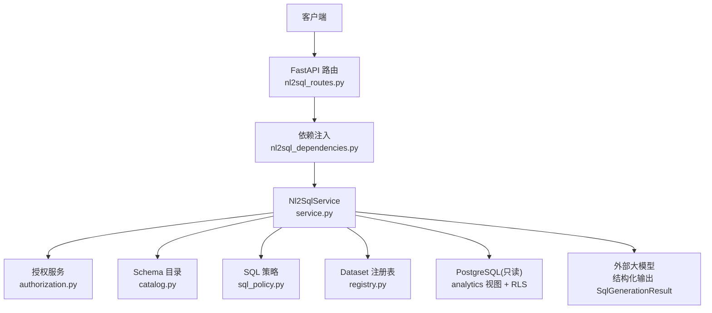
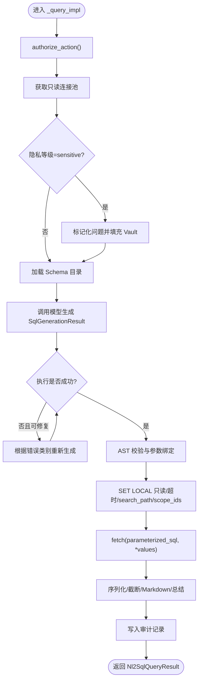
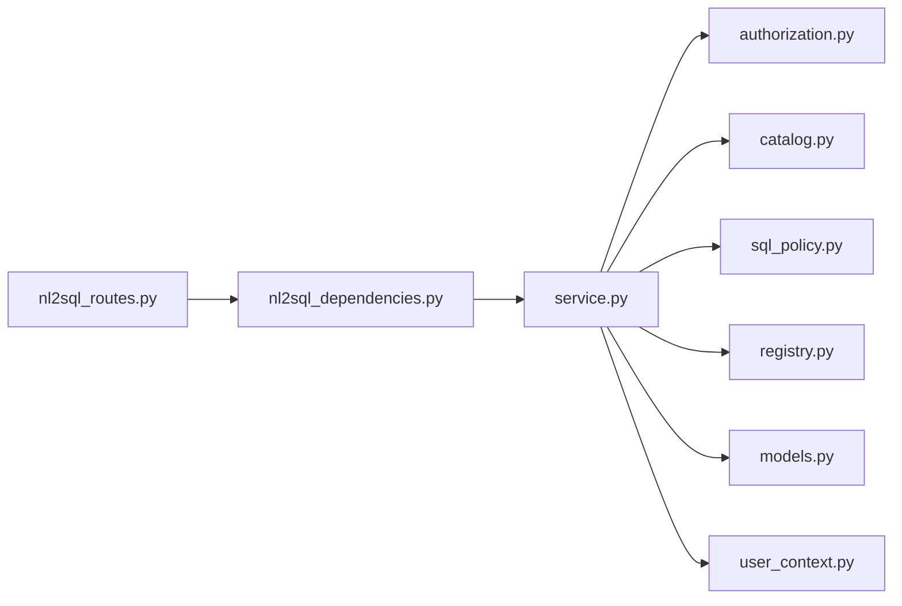

# NL2SQL 查询服务

<cite>
**本文引用的文件**
- [nl2sql_routes.py](file://python-agent-study/src/fast_app/api/nl2sql_routes.py)
- [nl2sql_dependencies.py](file://python-agent-study/src/fast_app/dependencies/nl2sql_dependencies.py)
- [service.py](file://python-agent-study/src/fast_app/services/nl2sql/service.py)
- [models.py](file://python-agent-study/src/fast_app/services/nl2sql/models.py)
- [registry.py](file://python-agent-study/src/fast_app/services/nl2sql/registry.py)
- [authorization.py](file://python-agent-study/src/fast_app/services/nl2sql/authorization.py)
- [catalog.py](file://python-agent-study/src/fast_app/services/nl2sql/catalog.py)
- [sql_policy.py](file://python-agent-study/src/fast_app/services/nl2sql/sql_policy.py)
- [user_context.py](file://python-agent-study/src/fast_app/domain/user_context.py)
</cite>

## 目录
1. [简介](#简介)
2. [项目结构](#项目结构)
3. [核心组件](#核心组件)
4. [架构总览](#架构总览)
5. [详细组件分析](#详细组件分析)
6. [依赖关系分析](#依赖关系分析)
7. [性能与只读限制](#性能与只读限制)
8. [故障排查指南](#故障排查指南)
9. [结论](#结论)
10. [附录：API 使用与配置建议](#附录api-使用与配置建议)

## 简介
本文件面向开发者，系统化说明 NL2SQL 查询服务的实现机制与使用方式。重点覆盖：
- 自然语言到 SQL 的完整链路：意图识别、Schema 构建、参数化 SQL 生成、AST 安全校验、RLS 范围控制、只读执行与结果格式化。
- Dataset 绑定与权限控制：通过 Dataset 注册表、RBAC 快照与 Grant 合并出可信 scope_ids，并在数据库层以 RLS 再次约束。
- 安全策略：AST 白名单、禁止写入命令、函数白名单、LIMIT 上限、参数化绑定与敏感数据标记化。
- 结果输出：行截断、长文本裁剪、Markdown 表格与中文总结模板。

## 项目结构
NL2SQL 能力位于 FastAPI 应用的服务层，对外暴露 REST 接口，内部由服务编排、授权、目录、策略与执行子模块协作完成。



图表来源
- [nl2sql_routes.py:1-40](file://python-agent-study/src/fast_app/api/nl2sql_routes.py#L1-L40)
- [nl2sql_dependencies.py:1-27](file://python-agent-study/src/fast_app/dependencies/nl2sql_dependencies.py#L1-L27)
- [service.py:41-586](file://python-agent-study/src/fast_app/services/nl2sql/service.py#L41-L586)
- [authorization.py:15-78](file://python-agent-study/src/fast_app/services/nl2sql/authorization.py#L15-L78)
- [catalog.py:8-106](file://python-agent-study/src/fast_app/services/nl2sql/catalog.py#L8-L106)
- [sql_policy.py:52-183](file://python-agent-study/src/fast_app/services/nl2sql/sql_policy.py#L52-L183)
- [registry.py:24-128](file://python-agent-study/src/fast_app/services/nl2sql/registry.py#L24-L128)

章节来源
- [nl2sql_routes.py:1-40](file://python-agent-study/src/fast_app/api/nl2sql_routes.py#L1-L40)
- [nl2sql_dependencies.py:1-27](file://python-agent-study/src/fast_app/dependencies/nl2sql_dependencies.py#L1-L27)

## 核心组件
- Nl2SqlService：单一入口，编排授权、目录加载、SQL 生成、AST 校验、参数回填、RLS 执行、结果序列化与审计。
- DatasetRegistry：从平台主库加载 Dataset 定义，维护业务库连接池，拒绝将平台主库注册为 Dataset。
- Nl2SqlAuthorizationService：基于 CurrentUserContext 的全局权限快照与 Dataset Grant 合并，产出可信 scope_ids。
- SchemaCatalog：按 allowed_views 读取 analytics 视图字段类型与 COMMENT，组装模型可见的 Schema 提示。
- SqlPolicy：基于 SQLGlot AST 的强约束校验器，确保只读、白名单对象、白名单函数、LIMIT 上限与参数一致性。
- 数据模型：统一描述 Dataset、授权、请求与响应契约，避免额外字段泄露。

章节来源
- [service.py:41-586](file://python-agent-study/src/fast_app/services/nl2sql/service.py#L41-L586)
- [registry.py:24-128](file://python-agent-study/src/fast_app/services/nl2sql/registry.py#L24-L128)
- [authorization.py:15-78](file://python-agent-study/src/fast_app/services/nl2sql/authorization.py#L15-L78)
- [catalog.py:8-106](file://python-agent-study/src/fast_app/services/nl2sql/catalog.py#L8-L106)
- [sql_policy.py:52-183](file://python-agent-study/src/fast_app/services/nl2sql/sql_policy.py#L52-L183)
- [models.py:12-134](file://python-agent-study/src/fast_app/services/nl2sql/models.py#L12-L134)

## 架构总览
下图展示一次 NL2SQL 查询从 HTTP 请求到数据库返回的端到端流程，包含权限校验、Schema 构建、LLM 生成、AST 校验、RLS 执行与结果格式化。

```mermaid
sequenceDiagram
participant C as "客户端"
participant R as "FastAPI 路由"
participant S as "Nl2SqlService"
participant A as "授权服务"
participant G as "Dataset 注册表"
participant K as "Schema 目录"
participant M as "外部大模型"
participant P as "SQL 策略"
participant D as "PostgreSQL(只读)"
C->>R : POST /nl2sql/query
R->>S : query(user, dataset_id, question, max_rows)
S->>A : authorize(user, dataset)
A-->>S : scope_ids
S->>G : pool(dataset)
G-->>S : asyncpg.Pool
S->>K : load(connection, dataset, logical_names?)
K-->>S : schema 提示文本
S->>M : 生成 SqlGenerationResult(parameterized_sql, parameters)
M-->>S : SqlGenerationResult
S->>P : validate(sql, allowed_views, max_rows, parameters)
P-->>S : ValidatedSql(asyncpg_sql, parameter_order)
S->>D : SET LOCAL ...; 设置 search_path/app.scope_ids; fetch(..., *values)
D-->>S : records
S-->>R : Nl2SqlQueryResult(rows, truncated, summary, markdown_table)
R-->>C : JSON 响应
```

图表来源
- [nl2sql_routes.py:17-36](file://python-agent-study/src/fast_app/api/nl2sql_routes.py#L17-L36)
- [service.py:95-284](file://python-agent-study/src/fast_app/services/nl2sql/service.py#L95-L284)
- [authorization.py:21-74](file://python-agent-study/src/fast_app/services/nl2sql/authorization.py#L21-L74)
- [catalog.py:11-77](file://python-agent-study/src/fast_app/services/nl2sql/catalog.py#L11-L77)
- [sql_policy.py:55-179](file://python-agent-study/src/fast_app/services/nl2sql/sql_policy.py#L55-L179)
- [registry.py:102-114](file://python-agent-study/src/fast_app/services/nl2sql/registry.py#L102-L114)

## 详细组件分析

### Nl2SqlService：从意图到结果的编排者
- 功能开关与可见数据集：当功能未启用时直接返回空；否则遍历已启用 Dataset，逐项进行授权过滤后返回可见列表。
- 授权动作：区分 query/report 动作，report 需 Dataset 显式支持；失败时抛出专用错误。
- 查询主流程：
  - 获取 Dataset 与授权 scope_ids。
  - 敏感问题标记化：将真实实体替换为带类型的占位符，真实值仅保存在本地 Vault。
  - 加载 Schema 目录：仅允许 allowed_views，敏感场景使用逻辑视图名隐藏物理细节。
  - 调用外部模型生成 SqlGenerationResult（参数化 SQL 与参数）。
  - 执行前修复：捕获可修复错误（语法、列不存在、类型不匹配）后重试一次。
  - 执行：转换 :pN 为 $N 位置参数，设置只读事务、超时、search_path 与 app.scope_ids，执行 fetch。
  - 结果处理：截断、长文本裁剪、Markdown 表格生成、敏感模板回填或结果摘要。
  - 审计：成功路径记录 tokenized_question、parameterized_sql、sql_hash、耗时与行数；失败路径记录最小必要信息。



图表来源
- [service.py:138-284](file://python-agent-study/src/fast_app/services/nl2sql/service.py#L138-L284)
- [service.py:286-360](file://python-agent-study/src/fast_app/services/nl2sql/service.py#L286-L360)
- [service.py:362-465](file://python-agent-study/src/fast_app/services/nl2sql/service.py#L362-L465)
- [service.py:521-582](file://python-agent-study/src/fast_app/services/nl2sql/service.py#L521-L582)

章节来源
- [service.py:57-284](file://python-agent-study/src/fast_app/services/nl2sql/service.py#L57-L284)
- [service.py:286-465](file://python-agent-study/src/fast_app/services/nl2sql/service.py#L286-L465)
- [service.py:521-582](file://python-agent-study/src/fast_app/services/nl2sql/service.py#L521-L582)

### DatasetRegistry：可信 Dataset 与连接池管理
- 启动期校验：拒绝将平台主库注册为 Dataset，防止自由 SQL 触达用户与权限数据。
- 运行时刷新：从平台主库加载 Dataset 定义，组合 enabled、allowed_views、relationships、synonyms 等。
- 连接池复用：按 database_key 创建并缓存 asyncpg.Pool，限制最大池大小与命令超时。
- 安全辅助：提供 safe_database_name 用于诊断但不暴露敏感信息。

章节来源
- [registry.py:24-128](file://python-agent-study/src/fast_app/services/nl2sql/registry.py#L24-L128)

### Nl2SqlAuthorizationService：RBAC + Grant 合并
- 全局权限检查：要求具备 data:query:execute 权限。
- 角色豁免：系统管理员获得全量 scope。
- Grant 合并：基于当前用户的 user_id、全局角色、部门代码查询有效 Grant，得到 scope_ids。
- 安全边界：scope_ids 仅在只读事务中作为 app.scope_ids 下发给数据库，不会持久化到日志或 Prompt。

章节来源
- [authorization.py:15-78](file://python-agent-study/src/fast_app/services/nl2sql/authorization.py#L15-L78)
- [user_context.py:9-55](file://python-agent-study/src/fast_app/domain/user_context.py#L9-L55)

### SchemaCatalog：模型可见的“受限”元数据
- 仅查询 analytics 模式下 allowed_views 的列信息与 COMMENT。
- 敏感 Dataset 使用逻辑视图名，隐藏物理命名细节。
- 附加业务关系与同义词，帮助模型理解 JOIN 与术语映射。

章节来源
- [catalog.py:8-106](file://python-agent-study/src/fast_app/services/nl2sql/catalog.py#L8-L106)

### SqlPolicy：AST 级安全策略
- 解析与类型：必须能解析为单条 SELECT/Union/Intersect/Except，禁止写操作与控制命令。
- 对象白名单：所有 Table 引用必须在 allowed_views 内，CTE 临时名除外。
- 函数白名单：匿名函数需在允许集合内，内置危险函数一律禁止。
- LIMIT 保护：强制上限，参数型 LIMIT 需为正整数且不超过上限。
- 参数一致性：SQL 中出现的 :name 必须与 parameters 完全一致，防止校验与执行不一致。
- 参数转换：将 :name 转换为 $N 位置参数，供 asyncpg 安全绑定。

章节来源
- [sql_policy.py:52-183](file://python-agent-study/src/fast_app/services/nl2sql/sql_policy.py#L52-L183)

### 数据模型契约
- DatasetDefinition：服务端可信配置，包含 domain、database_key、privacy_classification、scope_column、allowed_views、logical_view_mapping、entity_tokenization_rules、relationships、synonyms、report_supported、enabled。
- Nl2SqlQueryRequest/Nl2SqlQueryResult：输入限定 question 长度与 max_rows 范围；输出包含 columns、rows、row_count、truncated、execution_ms、attempt_count、summary、warnings、markdown_table。
- SqlGenerationResult：外部模型唯一允许输出的结构化结果，包含 parameterized_sql、parameters、summary_template。
- DatasetAuthorization：仅包含 dataset_id 与可信 scope_ids。

章节来源
- [models.py:12-134](file://python-agent-study/src/fast_app/services/nl2sql/models.py#L12-L134)

## 依赖关系分析
- 路由层依赖：FastAPI 路由通过依赖注入获取 Nl2SqlService 与当前用户上下文。
- 服务层依赖：Nl2SqlService 依赖 Settings、DatasetRegistry、AsyncSession、授权服务、目录服务、SQL 策略。
- 外部依赖：asyncpg 连接池、LangChain ChatOpenAI 结构化输出、SQLGlot AST 校验。
- 数据库依赖：analytics 模式下的白名单视图、COMMENT 元数据、RLS 与 set_config(app.scope_ids)。



图表来源
- [nl2sql_routes.py:1-40](file://python-agent-study/src/fast_app/api/nl2sql_routes.py#L1-L40)
- [nl2sql_dependencies.py:1-27](file://python-agent-study/src/fast_app/dependencies/nl2sql_dependencies.py#L1-L27)
- [service.py:41-586](file://python-agent-study/src/fast_app/services/nl2sql/service.py#L41-L586)

章节来源
- [nl2sql_routes.py:1-40](file://python-agent-study/src/fast_app/api/nl2sql_routes.py#L1-L40)
- [nl2sql_dependencies.py:1-27](file://python-agent-study/src/fast_app/dependencies/nl2sql_dependencies.py#L1-L27)
- [service.py:41-586](file://python-agent-study/src/fast_app/services/nl2sql/service.py#L41-L586)

## 性能与只读限制
- 只读事务：每次执行在 readonly 事务中进行，禁止写操作。
- 超时控制：语句级与锁级超时通过 SET LOCAL 设置，避免长查询与锁等待。
- 搜索路径：限定 analytics、pg_catalog，防止访问其他 schema。
- 范围隔离：app.scope_ids 在事务内生效，连接归还池后自动失效，避免跨用户泄漏。
- 结果限制：默认与最大行限制、超长字段裁剪、Markdown 表格生成，降低响应体积。
- 重试策略：对可修复错误最多重试一次，减少二次 LLM 调用成本。

[本节为通用性能与安全讨论，不直接分析具体文件]

## 故障排查指南
- 常见错误分类
  - 功能未启用：返回空数据集或抛出禁用错误。
  - 权限不足：缺少 data:query:execute 或无 Dataset Grant。
  - 非白名单对象/函数：AST 校验拒绝。
  - 参数缺失或不一致：参数集合与 SQL 中出现的位置不匹配。
  - 数据库拒绝：只读事务被拒或查询超时。
- 定位步骤
  - 查看 Nl2SqlQueryResult 中的 attempt_count、execution_ms、warnings。
  - 核对 Dataset 的 allowed_views、relationships、synonyms 是否与模型生成一致。
  - 检查 SQL 是否包含 SELECT *、写操作、危险函数或超出 LIMIT。
  - 确认 app.scope_ids 是否正确设置，RLS 是否拦截。
  - 对于敏感 Dataset，确认问题标记化与 Vault 回填是否符合预期。

章节来源
- [service.py:95-284](file://python-agent-study/src/fast_app/services/nl2sql/service.py#L95-L284)
- [sql_policy.py:55-179](file://python-agent-study/src/fast_app/services/nl2sql/sql_policy.py#L55-L179)
- [authorization.py:21-74](file://python-agent-study/src/fast_app/services/nl2sql/authorization.py#L21-L74)

## 结论
该 NL2SQL 服务通过“受控 Schema + 结构化模型输出 + AST 白名单 + 只读事务 + RLS 范围”的多层防护，实现了从自然语言到安全只读 SQL 的完整闭环。敏感数据采用标记化与本地 Vault，避免真实值进入外部模型或日志。结果侧提供行截断、长文本裁剪与 Markdown 表格，便于下游消费与报告生成。

[本节为总结性内容，不直接分析具体文件]

## 附录：API 使用与配置建议

### API 使用指南
- 列出可用数据集
  - 方法：GET /nl2sql/datasets
  - 作用：返回当前用户可见的 Dataset 列表（受 RBAC 与 Grant 控制）。
- 执行查询
  - 方法：POST /nl2sql/query
  - 请求体关键字段：dataset_id、question、max_rows（1-500，默认 200）。
  - 响应关键字段：parameterized_sql、columns、rows、row_count、truncated、execution_ms、attempt_count、summary、warnings、markdown_table。

章节来源
- [nl2sql_routes.py:17-36](file://python-agent-study/src/fast_app/api/nl2sql_routes.py#L17-L36)
- [models.py:58-114](file://python-agent-study/src/fast_app/services/nl2sql/models.py#L58-L114)

### 数据集配置方法
- 在平台主库中维护 Dataset 定义，包含：
  - dataset_id、name、domain、database_key、privacy_classification、scope_column、allowed_views、logical_view_mapping、entity_tokenization_rules、relationships、synonyms、report_supported、enabled。
- 连接池与 URL：
  - 通过环境变量映射 database_key 到只读数据库 URL，禁止将平台主库映射为 Dataset。
- 权限授予：
  - 通过 Dataset Grant 表为用户、角色或部门授予 scope_ids，支持过期时间控制。

章节来源
- [registry.py:58-114](file://python-agent-study/src/fast_app/services/nl2sql/registry.py#L58-L114)
- [authorization.py:41-74](file://python-agent-study/src/fast_app/services/nl2sql/authorization.py#L41-L74)
- [models.py:12-46](file://python-agent-study/src/fast_app/services/nl2sql/models.py#L12-L46)

### 查询优化建议
- 明确 allowed_views 与 relationships，减少模型误用无关视图。
- 完善字段 COMMENT 与 synonyms，提高模型生成准确率。
- 合理设置 nl2sql_default_max_rows 与 nl2sql_model_timeout_seconds，平衡性能与准确性。
- 对复杂查询，优先在 analytics 层建立聚合视图，降低 SQL 复杂度。
- 对敏感 Dataset，充分利用逻辑视图映射与实体标记化，避免真实值外泄。

[本节为通用优化建议，不直接分析具体文件]