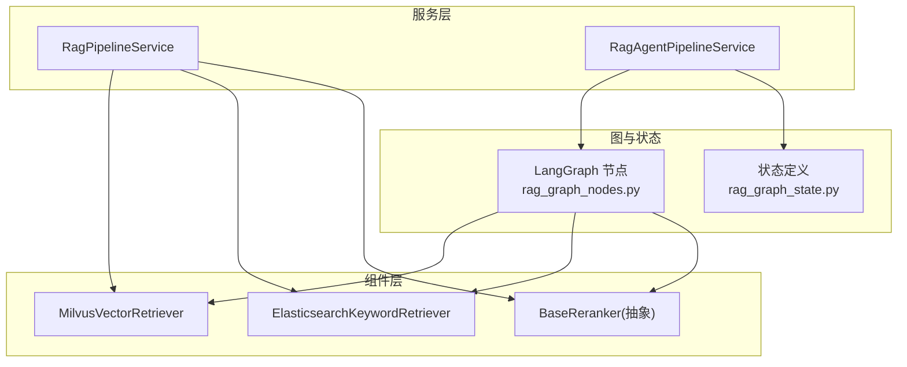
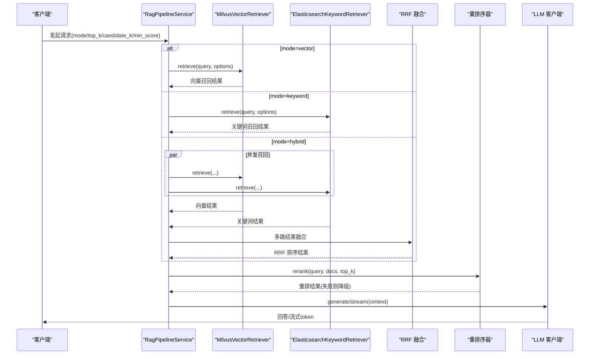
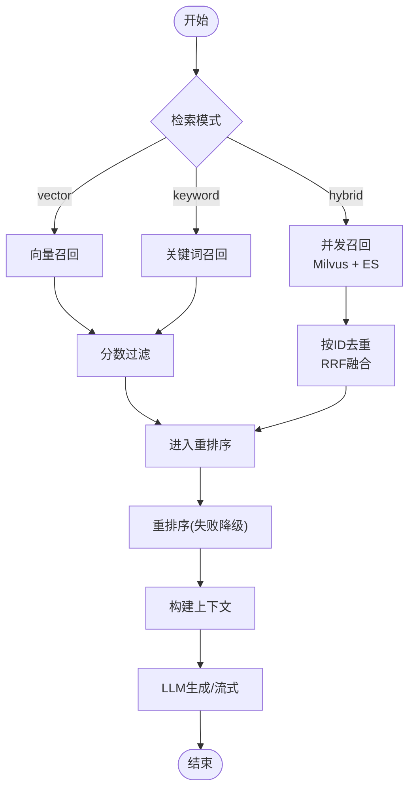
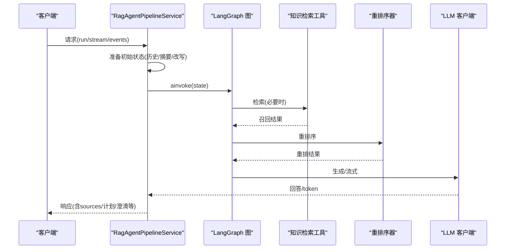
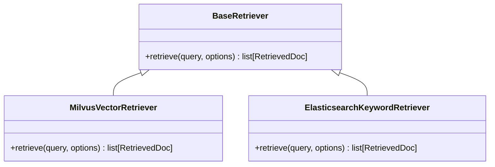
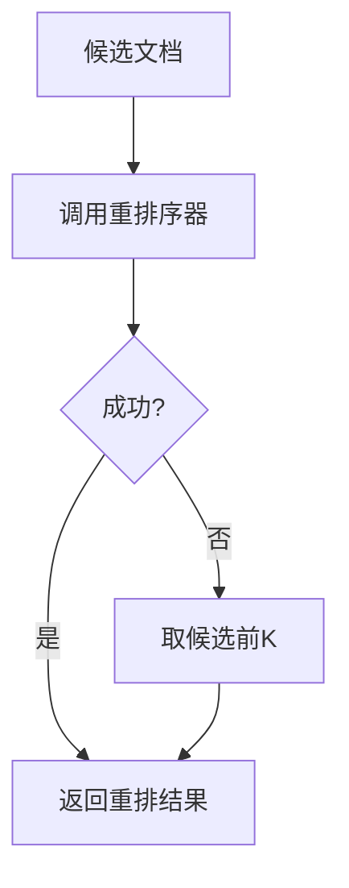
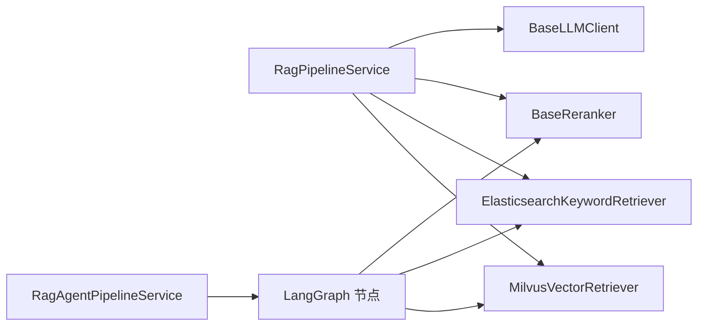

# RAG 检索服务

<cite>
**本文引用的文件**
- [rag_pipeline_service.py](file://src/fast_app/services/rag/rag_pipeline_service.py)
- [rag_agent_pipeline_service.py](file://src/fast_app/services/rag/rag_agent_pipeline_service.py)
- [base.py](file://src/fast_app/components/retrievers/base.py)
- [milvus_vector_retriever.py](file://src/fast_app/components/retrievers/milvus_vector_retriever.py)
- [elasticsearch_keyword_retriever.py](file://src/fast_app/components/retrievers/elasticsearch_keyword_retriever.py)
- [retrieval_fusion.py](file://src/fast_app/services/rag/retrieval_fusion.py)
- [rag_graph_state.py](file://src/fast_app/graph/rag/rag_graph_state.py)
- [rag_graph_nodes.py](file://src/fast_app/graph/rag/rag_graph_nodes.py)
</cite>

## 目录
1. [简介](#简介)
2. [项目结构](#项目结构)
3. [核心组件](#核心组件)
4. [架构总览](#架构总览)
5. [详细组件分析](#详细组件分析)
6. [依赖关系分析](#依赖关系分析)
7. [性能考量](#性能考量)
8. [故障排查指南](#故障排查指南)
9. [结论](#结论)
10. [附录：使用与配置](#附录使用与配置)

## 简介
本仓库实现了一套企业级 RAG（检索增强生成）检索服务，支持向量检索、关键词检索以及两者的混合检索；提供上下文构建、重排序、流式输出与安全审计能力。系统通过可插拔的检索器、重排序器和 LLM 客户端，将“召回—融合—重排—上下文—生成”链路标准化，并以两种管线形态对外提供服务：
- 经典管线 RagPipelineService：面向传统流程编排，适合快速接入和稳定交付。
- Agent 管线 RagAgentPipelineService：基于 LangGraph 的显式状态机，具备查询改写、会话记忆、任务路由、直接回答、澄清、工具调用等高级能力。

## 项目结构
RAG 相关代码主要分布在以下模块：
- 服务层：services/rag 下的管线与服务，负责编排检索、上下文、生成与流式输出。
- 组件层：components/retrievers 与 components/rerankers，定义统一的检索器与重排序接口及具体实现。
- 图与状态：graph/rag 与 graph/rag_agent，定义 LangGraph 节点、状态与边，驱动复杂工作流。
- 领域模型：domain.rag_models 等，统一文档、分数、过滤条件等数据结构。

图表来源
- [rag_pipeline_service.py:558-800](file://src/fast_app/services/rag/rag_pipeline_service.py#L558-L800)
- [rag_agent_pipeline_service.py:92-197](file://src/fast_app/services/rag/rag_agent_pipeline_service.py#L92-L197)
- [milvus_vector_retriever.py:155-338](file://src/fast_app/components/retrievers/milvus_vector_retriever.py#L155-L338)
- [elasticsearch_keyword_retriever.py:210-341](file://src/fast_app/components/retrievers/elasticsearch_keyword_retriever.py#L210-L341)
- [rag_graph_nodes.py:398-590](file://src/fast_app/graph/rag/rag_graph_nodes.py#L398-L590)
- [rag_graph_state.py:15-65](file://src/fast_app/graph/rag/rag_graph_state.py#L15-L65)

章节来源
- [rag_pipeline_service.py:558-800](file://src/fast_app/services/rag/rag_pipeline_service.py#L558-L800)
- [rag_agent_pipeline_service.py:92-197](file://src/fast_app/services/rag/rag_agent_pipeline_service.py#L92-L197)
- [milvus_vector_retriever.py:155-338](file://src/fast_app/components/retrievers/milvus_vector_retriever.py#L155-L338)
- [elasticsearch_keyword_retriever.py:210-341](file://src/fast_app/components/retrievers/elasticsearch_keyword_retriever.py#L210-L341)
- [rag_graph_nodes.py:398-590](file://src/fast_app/graph/rag/rag_graph_nodes.py#L398-L590)
- [rag_graph_state.py:15-65](file://src/fast_app/graph/rag/rag_graph_state.py#L15-L65)

## 核心组件
- 检索器抽象 BaseRetriever：统一 retrieve(query, options) 接口，所有检索器必须实现该异步方法。
- Milvus 向量检索器：将查询转为向量，构造过滤表达式（含权限下推），执行相似度搜索并转换为 RetrievedDoc。
- Elasticsearch 关键词检索器：构造 multi_match 查询与 bool filter（业务过滤+权限过滤），返回 keyword_score 并转换为 RetrievedDoc。
- 重排序器 BaseReranker：对候选文档进行二次排序，失败时降级为原候选前 K。
- 检索融合 retrieval_fusion：RRF（倒数秩融合）合并多路召回结果，保留最高原始分与来源集合。
- 上下文构建与组装：将 RetrievedDoc 拼接为 LLM 可读的上下文，支持父块扩展与元数据清洗。
- 流式输出与防护：GuardedStreamState 与 guarded_answer_delta_events 保障 token 流安全与审计。

章节来源
- [base.py:1-13](file://src/fast_app/components/retrievers/base.py#L1-L13)
- [milvus_vector_retriever.py:155-338](file://src/fast_app/components/retrievers/milvus_vector_retriever.py#L155-L338)
- [elasticsearch_keyword_retriever.py:210-341](file://src/fast_app/components/retrievers/elasticsearch_keyword_retriever.py#L210-L341)
- [retrieval_fusion.py:8-80](file://src/fast_app/services/rag/retrieval_fusion.py#L8-L80)
- [rag_pipeline_service.py:558-800](file://src/fast_app/services/rag/rag_pipeline_service.py#L558-L800)

## 架构总览
RAG 服务以“检索—融合—重排—上下文—生成”为主线，支持三种模式：
- 向量检索：仅走 Milvus。
- 关键词检索：仅走 ES。
- 混合检索：并发召回 Milvus 与 ES，按文档 ID 去重后做 RRF 融合，再进入重排序与上下文构建。

图表来源
- [rag_pipeline_service.py:236-328](file://src/fast_app/services/rag/rag_pipeline_service.py#L236-L328)
- [retrieval_fusion.py:8-80](file://src/fast_app/services/rag/retrieval_fusion.py#L8-L80)
- [milvus_vector_retriever.py:182-338](file://src/fast_app/components/retrievers/milvus_vector_retriever.py#L182-L338)
- [elasticsearch_keyword_retriever.py:227-341](file://src/fast_app/components/retrievers/elasticsearch_keyword_retriever.py#L227-L341)

## 详细组件分析

### RagPipelineService（经典管线）
职责与流程
- 根据请求模式选择检索策略，支持 vector/keyword/hybrid。
- 对单路或混合召回结果进行过滤、合并与去重。
- 调用重排序器，异常时降级为候选前 K。
- 构建 LLM 上下文，调用 LLM 生成回答或流式 token。
- 输出包含 sources、scores breakdown 的结构化响应。

关键实现要点
- 混合检索并发召回与异常容错：任一源失败不影响其他源，最终无成功源则抛出外部服务错误。
- 分数拆分与来源规范化：保留 vector/keyword/rrf/rerank 各阶段分数，兼容旧字段。
- 上下文构建：将 RetrievedDoc 拼接为带来源与分数的文本片段，便于引用与溯源。
- 流式输出：结合 GuardedStreamState 对 token 流进行安全审计与拦截。

图表来源
- [rag_pipeline_service.py:236-328](file://src/fast_app/services/rag/rag_pipeline_service.py#L236-L328)
- [rag_pipeline_service.py:657-753](file://src/fast_app/services/rag/rag_pipeline_service.py#L657-L753)
- [rag_pipeline_service.py:755-800](file://src/fast_app/services/rag/rag_pipeline_service.py#L755-L800)

章节来源
- [rag_pipeline_service.py:236-328](file://src/fast_app/services/rag/rag_pipeline_service.py#L236-L328)
- [rag_pipeline_service.py:558-800](file://src/fast_app/services/rag/rag_pipeline_service.py#L558-L800)

### RagAgentPipelineService（LangGraph Agent 管线）
职责与流程
- 在经典管线基础上引入显式状态机，支持查询改写、会话记忆、任务路由、直接回答、澄清、工具调用、NL2SQL 等。
- 非流式 run：通过 compiled graph 一次性执行到 END，最后组装 API 响应。
- 流式 stream/events：手动推进前置节点，先发 sources，再生成 token，保持 token-only 协议。

关键实现要点
- 初始状态准备：校验用户输入、加载历史窗口、生成摘要、执行 query rewrite，并对改写后的查询再次进行 Prompt Guard 扫描。
- 决策与路由：决定 direct_answer、clarification_required、final_error_answer 或直接进入检索。
- 检索与重排：复用知识检索工具与重排序节点，记录工具调用结果与错误。
- 持久化：短期 Redis 记忆与长期 PostgreSQL 会话落盘，失败不阻塞已发送的流式响应。

图表来源
- [rag_agent_pipeline_service.py:92-197](file://src/fast_app/services/rag/rag_agent_pipeline_service.py#L92-L197)
- [rag_agent_pipeline_service.py:604-763](file://src/fast_app/services/rag/rag_agent_pipeline_service.py#L604-L763)
- [rag_graph_nodes.py:398-590](file://src/fast_app/graph/rag/rag_graph_nodes.py#L398-L590)

章节来源
- [rag_agent_pipeline_service.py:92-197](file://src/fast_app/services/rag/rag_agent_pipeline_service.py#L92-L197)
- [rag_agent_pipeline_service.py:604-763](file://src/fast_app/services/rag/rag_agent_pipeline_service.py#L604-L763)
- [rag_graph_nodes.py:398-590](file://src/fast_app/graph/rag/rag_graph_nodes.py#L398-L590)

### 检索器组件集成
- 向量检索器 MilvusVectorRetriever
  - 将查询嵌入为向量，校验维度，构造过滤表达式（source_path/section_path/knowledge_version/权限）。
  - 执行 search 并将 hits 转换为 RetrievedDoc，记录 embedding 耗时、命中数、跳过数等指标。
- 关键词检索器 ElasticsearchKeywordRetriever
  - 构造 multi_match 查询与 bool filter（业务过滤+权限过滤），避免父块参与初始召回。
  - 将 _score 作为 keyword_score 写入 scores，转换 hit 为 RetrievedDoc。
- 权限下推
  - 两者均在检索阶段完成权限过滤，避免召回后再在后端删除，提升效率与安全性。

图表来源
- [base.py:1-13](file://src/fast_app/components/retrievers/base.py#L1-L13)
- [milvus_vector_retriever.py:155-338](file://src/fast_app/components/retrievers/milvus_vector_retriever.py#L155-L338)
- [elasticsearch_keyword_retriever.py:210-341](file://src/fast_app/components/retrievers/elasticsearch_keyword_retriever.py#L210-L341)

章节来源
- [milvus_vector_retriever.py:155-338](file://src/fast_app/components/retrievers/milvus_vector_retriever.py#L155-L338)
- [elasticsearch_keyword_retriever.py:210-341](file://src/fast_app/components/retrievers/elasticsearch_keyword_retriever.py#L210-L341)

### 重排序算法与降级
- 重排序器调用：对候选文档进行二次排序，记录候选数量、top_k、延迟与是否降级。
- 降级策略：当重排序器抛出外部服务错误时，回退为候选前 K，保证主链路可用性。
- 评估快照：记录 rerank 阶段的中间结果，便于离线评测与回归对比。

图表来源
- [rag_pipeline_service.py:657-753](file://src/fast_app/services/rag/rag_pipeline_service.py#L657-L753)
- [rag_graph_nodes.py:247-386](file://src/fast_app/graph/rag/rag_graph_nodes.py#L247-L386)

章节来源
- [rag_pipeline_service.py:657-753](file://src/fast_app/services/rag/rag_pipeline_service.py#L657-L753)
- [rag_graph_nodes.py:247-386](file://src/fast_app/graph/rag/rag_graph_nodes.py#L247-L386)

### 缓存策略
- 当前代码未实现应用侧检索结果缓存。若需提升吞吐，可在检索器外层增加基于 query+filters+top_k 的缓存层（如 Redis），注意失效策略与版本隔离。
- 建议：对高频短查询启用短时缓存；对长尾查询禁用缓存以避免污染热点。

[本节为通用建议，不直接分析具体文件]

### 流式输出处理
- GuardedStreamState：维护流式状态，确保 token 流安全与审计。
- 流式事件：stream_events 模式下先 emit sources，再逐步推送 token，保持 token-only 协议。
- 审计：在 legacy token 流结束后审计完整回答内容，防止敏感信息泄露。

章节来源
- [rag_agent_pipeline_service.py:765-800](file://src/fast_app/services/rag/rag_agent_pipeline_service.py#L765-L800)
- [rag_pipeline_service.py:755-800](file://src/fast_app/services/rag/rag_pipeline_service.py#L755-L800)

## 依赖关系分析
- 组件耦合
  - RagPipelineService 依赖 BaseRetriever、BaseReranker、BaseLLMClient，解耦良好，便于替换实现。
  - RagAgentPipelineService 依赖 LangGraph 节点与状态，封装了更复杂的决策与工具调用路径。
- 外部依赖
  - Milvus 与 Elasticsearch 作为存储后端，均实现了权限下推与慢查询日志。
  - LLM 客户端用于生成回答，支持同步与流式。
- 循环依赖
  - 未发现明显循环依赖；节点与管线通过工厂函数与闭包注入依赖，降低耦合。

图表来源
- [rag_pipeline_service.py:558-800](file://src/fast_app/services/rag/rag_pipeline_service.py#L558-L800)
- [rag_agent_pipeline_service.py:92-197](file://src/fast_app/services/rag/rag_agent_pipeline_service.py#L92-L197)
- [rag_graph_nodes.py:398-590](file://src/fast_app/graph/rag/rag_graph_nodes.py#L398-L590)

章节来源
- [rag_pipeline_service.py:558-800](file://src/fast_app/services/rag/rag_pipeline_service.py#L558-L800)
- [rag_agent_pipeline_service.py:92-197](file://src/fast_app/services/rag/rag_agent_pipeline_service.py#L92-L197)
- [rag_graph_nodes.py:398-590](file://src/fast_app/graph/rag/rag_graph_nodes.py#L398-L590)

## 性能考量
- 并发召回：混合检索并发执行向量与关键词召回，减少端到端延迟。
- 权限下推：在 Milvus/ES 检索阶段完成权限过滤，避免无效召回。
- 慢操作监控：对检索、重排序、embedding 等关键步骤记录延迟与阈值告警。
- 降级策略：重排序失败时回退候选前 K，保证可用性。
- 建议优化
  - 调整 candidate_k 与 top_k 平衡召回率与延迟。
  - 合理设置 min_score 过滤低质量结果。
  - 对高频查询考虑应用侧缓存（见“缓存策略”）。
  - 对大文档上下文进行截断与摘要，控制 LLM 输入长度。

[本节为通用指导，不直接分析具体文件]

## 故障排查指南
- 检索无结果
  - 检查 min_score 是否过高；确认 mode 与 filters 是否正确。
  - 查看向量维度是否匹配；检查 Milvus/ES 索引是否存在脏数据（skipped_hit_count）。
- 重排序失败
  - 关注 fallback 日志；确认重排序服务健康；必要时临时关闭重排序以提升稳定性。
- 权限问题
  - 检查 RetrievalFilters 中的 department_codes、user_id、visibility 等字段；确认权限表达式正确下推。
- 流式异常
  - 关注 GuardedStreamState 与审计日志；确认 token 流未被安全策略阻断。

章节来源
- [milvus_vector_retriever.py:194-338](file://src/fast_app/components/retrievers/milvus_vector_retriever.py#L194-L338)
- [elasticsearch_keyword_retriever.py:227-341](file://src/fast_app/components/retrievers/elasticsearch_keyword_retriever.py#L227-L341)
- [rag_pipeline_service.py:657-753](file://src/fast_app/services/rag/rag_pipeline_service.py#L657-L753)

## 结论
本 RAG 检索服务通过清晰的管线设计与可插拔组件，实现了向量/关键词/混合检索的统一编排，并提供重排序、上下文构建、流式输出与安全审计能力。RagPipelineService 适合快速接入与稳定交付；RagAgentPipelineService 借助 LangGraph 提供更强的交互与任务处理能力。建议在工程实践中结合业务场景调优候选集大小、过滤条件与降级策略，以获得更好的召回质量与性能表现。

[本节为总结性内容，不直接分析具体文件]

## 附录：使用与配置
- 基本用法
  - 初始化 RagPipelineService：传入 Settings、向量检索器、关键词检索器、LLM 客户端、重排序器与可选的 PromptGuard。
  - 调用 run() 获取非流式回答；调用 stream()/stream_events() 获取流式 token。
- 配置选项
  - top_k：最终返回文档数。
  - candidate_k：召回候选数，影响 RRF 与重排序输入规模。
  - min_score：最低相关性阈值，用于过滤低质量结果。
  - rerank_top_k：重排序输出数量。
  - slow_*_threshold_ms：慢操作阈值，用于性能监控。
- 最佳实践
  - 混合检索优先：在知识库较丰富时开启 hybrid，提升召回鲁棒性。
  - 权限下推：确保 RetrievalFilters 正确传递，利用存储层过滤提升效率。
  - 流式体验：使用 stream_events 先发 sources，再推送 token，改善首字延迟。
  - 降级与监控：关注重排序与检索的慢操作日志，及时调整参数或服务。

章节来源
- [rag_pipeline_service.py:558-800](file://src/fast_app/services/rag/rag_pipeline_service.py#L558-L800)
- [rag_agent_pipeline_service.py:92-197](file://src/fast_app/services/rag/rag_agent_pipeline_service.py#L92-L197)
- [rag_graph_state.py:15-65](file://src/fast_app/graph/rag/rag_graph_state.py#L15-L65)