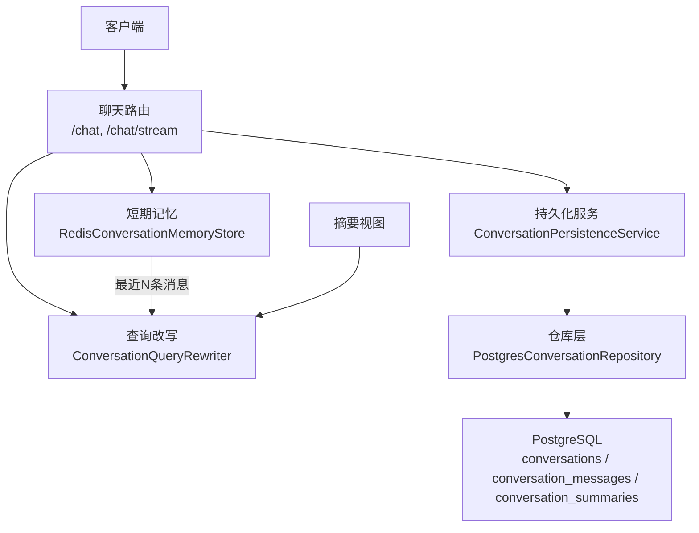
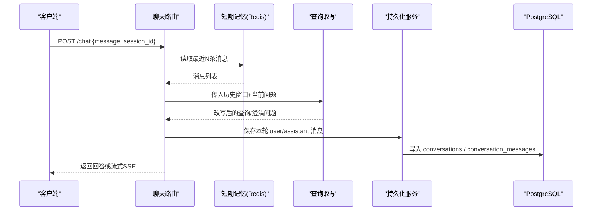
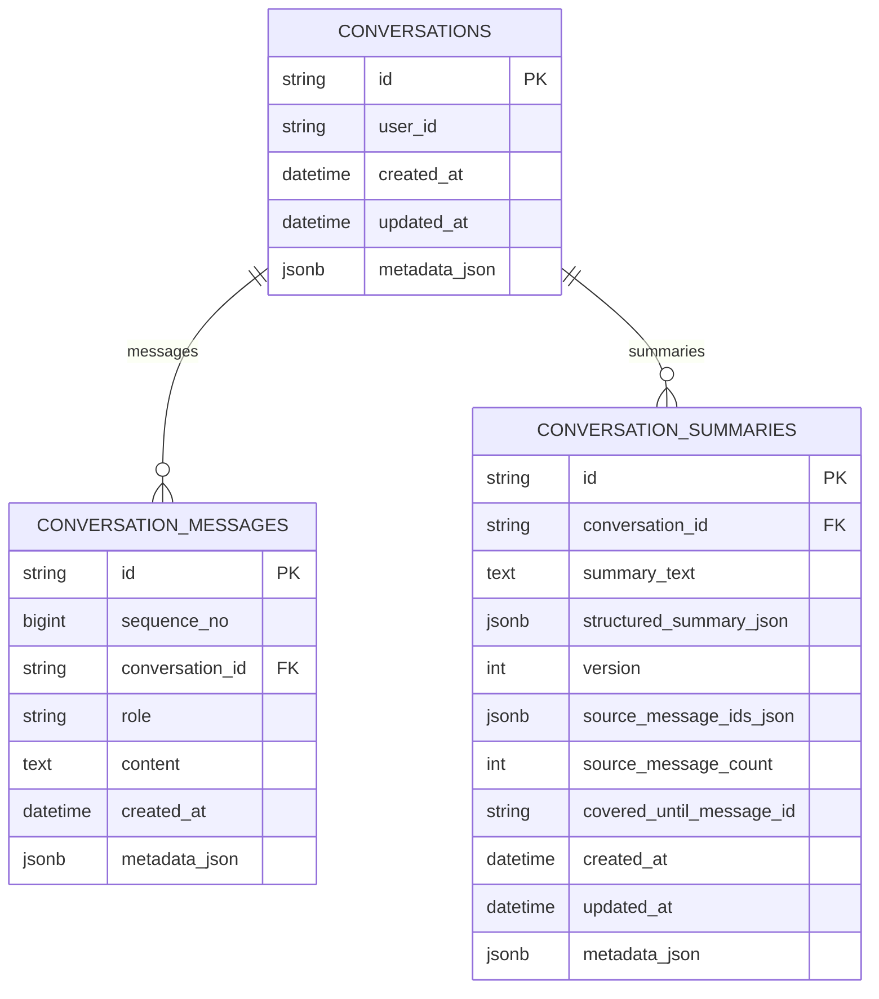
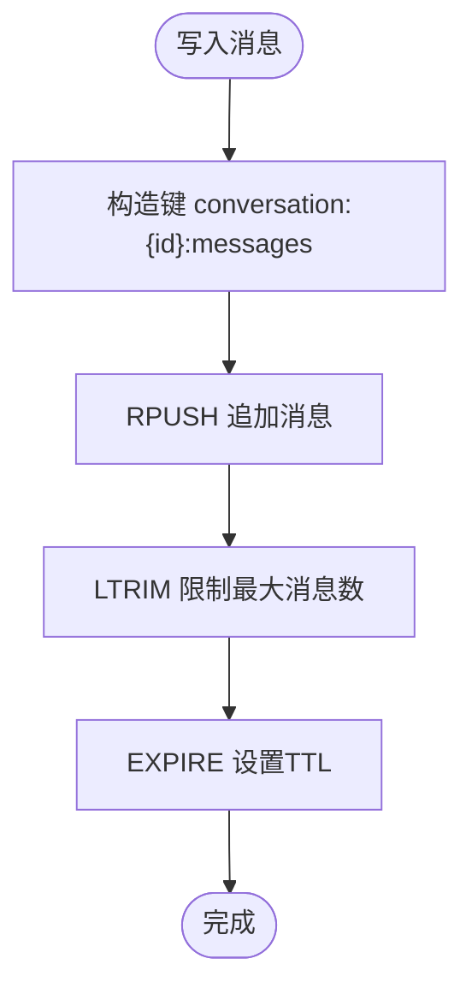
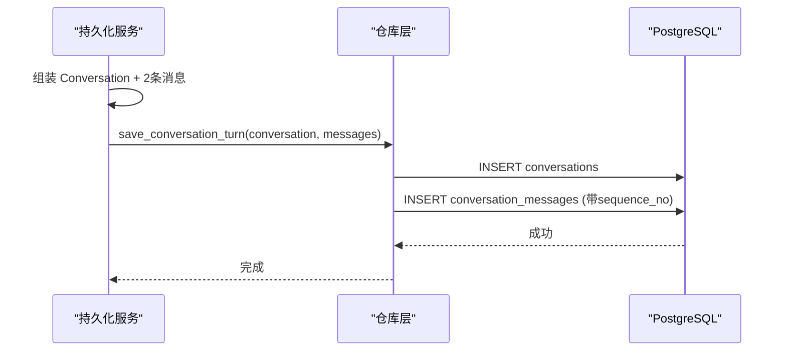
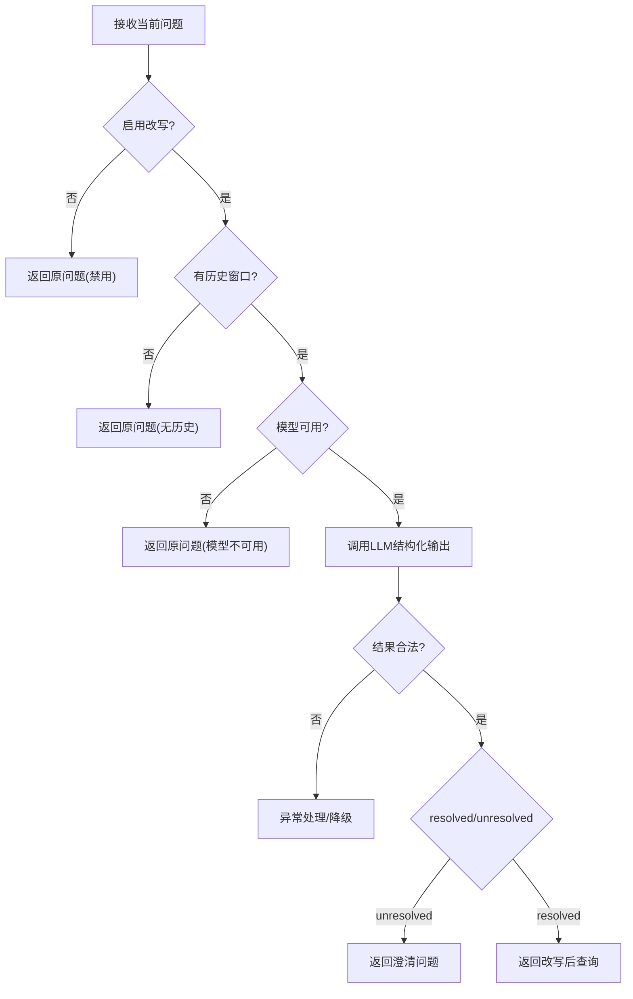
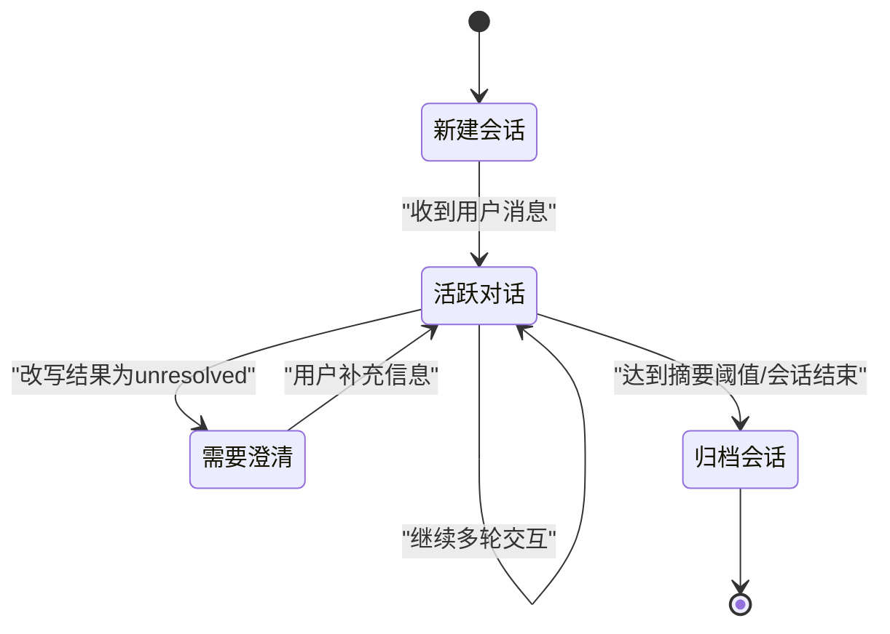
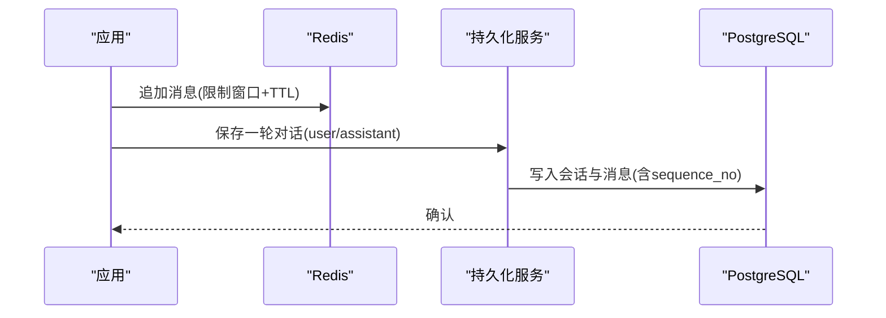
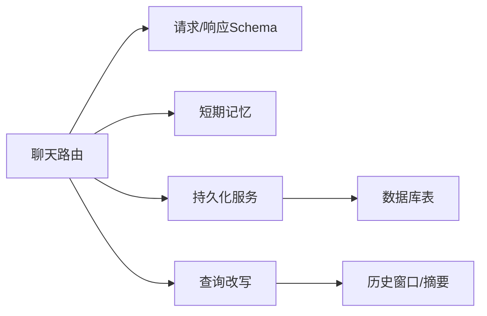

# 对话管理服务

<cite>
**本文引用的文件**
- [conversation_models.py](file://python-agent-study/src/fast_app/domain/conversation_models.py)
- [conversation_tables.py](file://python-agent-study/src/fast_app/db/conversation_tables.py)
- [conversation_memory.py](file://python-agent-study/src/fast_app/services/conversation/conversation_memory.py)
- [conversation_persistence.py](file://python-agent-study/src/fast_app/services/conversation/conversation_persistence.py)
- [query_rewrite.py](file://python-agent-study/src/fast_app/services/conversation/query_rewrite.py)
- [chat_routes.py](file://python-agent-study/src/fast_app/api/chat_routes.py)
- [chat_schema.py](file://python-agent-study/src/fast_app/schemas/chat_schema.py)
</cite>

## 目录
1. [简介](#简介)
2. [项目结构](#项目结构)
3. [核心组件](#核心组件)
4. [架构总览](#架构总览)
5. [详细组件分析](#详细组件分析)
6. [依赖关系分析](#依赖关系分析)
7. [性能与内存管理](#性能与内存管理)
8. [故障排查指南](#故障排查指南)
9. [结论](#结论)
10. [附录：API 使用指南与最佳实践](#附录api-使用指南与最佳实践)

## 简介
本文件面向开发者，系统化说明“对话管理服务”的多轮对话管理机制，包括会话状态维护、短期记忆（Redis）与长期持久化（PostgreSQL）的协作模式、Query Rewrite 机制、对话摘要生成、消息序列化管理，以及对话状态机、数据持久化流程与内存管理策略。文档同时提供 API 使用指南与最佳实践，帮助快速集成与稳定运行。

## 项目结构
对话管理相关代码主要分布在以下模块：
- 领域模型：定义会话、消息、摘要等数据结构
- 数据库表：PostgreSQL 会话、消息、摘要的 ORM 映射与索引
- 短期记忆：基于 Redis 的消息窗口存储（TTL + 最大长度）
- 持久化服务：将一轮 user/assistant 对话写入 PostgreSQL
- Query Rewrite：结合历史窗口与摘要，产出可独立检索的问题
- API 路由与 Schema：对外暴露聊天接口与流式输出

图表来源
- [chat_routes.py:10-32](file://python-agent-study/src/fast_app/api/chat_routes.py#L10-L32)
- [conversation_memory.py:60-105](file://python-agent-study/src/fast_app/services/conversation/conversation_memory.py#L60-L105)
- [conversation_persistence.py:10-61](file://python-agent-study/src/fast_app/services/conversation/conversation_persistence.py#L10-L61)
- [conversation_tables.py:24-171](file://python-agent-study/src/fast_app/db/conversation_tables.py#L24-L171)
- [query_rewrite.py:128-284](file://python-agent-study/src/fast_app/services/conversation/query_rewrite.py#L128-L284)

章节来源
- [chat_routes.py:10-32](file://python-agent-study/src/fast_app/api/chat_routes.py#L10-L32)
- [conversation_memory.py:30-105](file://python-agent-study/src/fast_app/services/conversation/conversation_memory.py#L30-L105)
- [conversation_persistence.py:10-61](file://python-agent-study/src/fast_app/services/conversation/conversation_persistence.py#L10-L61)
- [conversation_tables.py:24-171](file://python-agent-study/src/fast_app/db/conversation_tables.py#L24-L171)
- [query_rewrite.py:128-284](file://python-agent-study/src/fast_app/services/conversation/query_rewrite.py#L128-L284)

## 核心组件
- 领域模型：会话、消息、结构化摘要与派生摘要视图，统一 ID 生成与时间戳策略
- 短期记忆存储：内存版与 Redis 版实现，支持追加、限制窗口大小、TTL 过期
- 持久化服务：封装一轮对话的 user/assistant 消息落库，附带元数据
- 查询改写：基于 LLM 的结构化输出，结合历史窗口与摘要，产出可独立检索的问题
- API 路由：同步与流式两种聊天入口，承载请求校验与 SSE 事件封装

章节来源
- [conversation_models.py:28-115](file://python-agent-study/src/fast_app/domain/conversation_models.py#L28-L115)
- [conversation_memory.py:10-105](file://python-agent-study/src/fast_app/services/conversation/conversation_memory.py#L10-L105)
- [conversation_persistence.py:10-61](file://python-agent-study/src/fast_app/services/conversation/conversation_persistence.py#L10-L61)
- [query_rewrite.py:62-126](file://python-agent-study/src/fast_app/services/conversation/query_rewrite.py#L62-L126)
- [chat_routes.py:10-32](file://python-agent-study/src/fast_app/api/chat_routes.py#L10-L32)

## 架构总览
对话管理采用“短期记忆 + 长期持久化 + 查询改写”的分层设计：
- 短期记忆（Redis）：保存最近 N 条消息，具备 TTL 自动清理能力，用于低延迟上下文构建
- 长期持久化（PostgreSQL）：完整记录会话、消息与摘要版本，支持审计与回溯
- 查询改写：在检索前对当前问题做指代消解与上下文补全，提升 RAG 检索质量
- 摘要生成：对窗口外历史进行压缩，保留可追溯的来源消息 ID 与结构化事实

图表来源
- [chat_routes.py:13-32](file://python-agent-study/src/fast_app/api/chat_routes.py#L13-L32)
- [conversation_memory.py:80-105](file://python-agent-study/src/fast_app/services/conversation/conversation_memory.py#L80-L105)
- [query_rewrite.py:162-284](file://python-agent-study/src/fast_app/services/conversation/query_rewrite.py#L162-L284)
- [conversation_persistence.py:20-61](file://python-agent-study/src/fast_app/services/conversation/conversation_persistence.py#L20-L61)
- [conversation_tables.py:24-105](file://python-agent-study/src/fast_app/db/conversation_tables.py#L24-L105)

## 详细组件分析

### 领域模型与数据契约
- 会话 Conversation：唯一 ID、用户标识、创建/更新时间、扩展元数据
- 消息 ConversationMessage：角色（user/assistant/system）、内容、时间、元数据
- 摘要 ConversationSummary：自然语言摘要、结构化摘要、版本号、来源消息 ID 集合、覆盖范围
- 结构化摘要 ConversationStructuredSummary：目标、约束、决策、未决问题、偏好、重要实体

这些模型为短期记忆序列化、持久化落库与摘要版本控制提供统一契约。

章节来源
- [conversation_models.py:28-115](file://python-agent-study/src/fast_app/domain/conversation_models.py#L28-L115)

### 数据库表与索引设计
- conversations：会话容器，JSONB 元数据，级联删除
- conversation_messages：消息明细，包含 sequence_no 自增序号，按 conversation_id + created_at、conversation_id + sequence_no 建立索引，便于顺序读取与窗口查询
- conversation_summaries：摘要版本表，JSONB 结构化摘要与来源消息 ID 列表，按 conversation_id + version 索引

图表来源
- [conversation_tables.py:24-171](file://python-agent-study/src/fast_app/db/conversation_tables.py#L24-L171)

章节来源
- [conversation_tables.py:24-171](file://python-agent-study/src/fast_app/db/conversation_tables.py#L24-L171)

### 短期记忆存储（Redis）
- 协议边界：ConversationMemoryStore 定义 append_message 与 list_recent_messages 两个最小能力
- 内存实现：InMemoryConversationMemoryStore，进程内字典 + 异步锁，适合学习与测试
- Redis 实现：RedisConversationMemoryStore，以 List 存储消息 JSON，rpush 追加，ltrim 限制窗口大小，expire 设置 TTL；读取时 lrange 取最近 N 条并反序列化为模型

图表来源
- [conversation_memory.py:60-105](file://python-agent-study/src/fast_app/services/conversation/conversation_memory.py#L60-L105)

章节来源
- [conversation_memory.py:10-105](file://python-agent-study/src/fast_app/services/conversation/conversation_memory.py#L10-L105)

### 持久化服务（PostgreSQL）
- 职责边界：仅负责 durable storage，不处理短期窗口；RAG 主链路通过它保存完整会话记录
- 写入流程：封装一次 user/assistant turn，生成 Conversation 与两条 ConversationMessage，调用仓库层批量保存
- 元数据透传：将 query rewrite 原因、来源数量等关键信息写入会话元数据，便于追踪

图表来源
- [conversation_persistence.py:20-61](file://python-agent-study/src/fast_app/services/conversation/conversation_persistence.py#L20-L61)
- [conversation_tables.py:60-105](file://python-agent-study/src/fast_app/db/conversation_tables.py#L60-L105)

章节来源
- [conversation_persistence.py:10-61](file://python-agent-study/src/fast_app/services/conversation/conversation_persistence.py#L10-L61)

### 查询改写（Query Rewrite）
- 输入：当前问题、历史窗口（最近消息）、可选摘要上下文
- 处理：通过结构化输出模型限定 LLM 返回字段，强制 resolved/unresolved 分支校验；验证 relevant_message_ids 必须来自真实历史消息集合
- 输出：改写后的查询、是否使用历史/摘要、原因、必要时返回澄清问题
- 降级：当配置关闭、模型不可用或调用失败时，回退为原问题并记录原因

图表来源
- [query_rewrite.py:128-284](file://python-agent-study/src/fast_app/services/conversation/query_rewrite.py#L128-L284)

章节来源
- [query_rewrite.py:62-126](file://python-agent-study/src/fast_app/services/conversation/query_rewrite.py#L62-L126)
- [query_rewrite.py:162-284](file://python-agent-study/src/fast_app/services/conversation/query_rewrite.py#L162-L284)

### 对话状态机
对话生命周期从创建到结束，涉及短期窗口与长期摘要的协同：

[该图为概念性状态机，不直接映射具体源码文件]

### 数据持久化流程
- 写入路径：短期记忆优先（低延迟），随后持久化服务将完整 turn 写入 PostgreSQL
- 窗口管理：Redis 侧通过 ltrim 控制最大消息数，避免无限增长；TTL 保证过期清理
- 序列号：PostgreSQL 侧使用自增 sequence_no，确保消息顺序稳定可查

图表来源
- [conversation_memory.py:80-105](file://python-agent-study/src/fast_app/services/conversation/conversation_memory.py#L80-L105)
- [conversation_persistence.py:20-61](file://python-agent-study/src/fast_app/services/conversation/conversation_persistence.py#L20-L61)
- [conversation_tables.py:60-105](file://python-agent-study/src/fast_app/db/conversation_tables.py#L60-L105)

章节来源
- [conversation_memory.py:60-105](file://python-agent-study/src/fast_app/services/conversation/conversation_memory.py#L60-L105)
- [conversation_persistence.py:20-61](file://python-agent-study/src/fast_app/services/conversation/conversation_persistence.py#L20-L61)
- [conversation_tables.py:60-105](file://python-agent-study/src/fast_app/db/conversation_tables.py#L60-L105)

## 依赖关系分析
- 路由层依赖 Schema 校验与 Service 调用
- 短期记忆与持久化服务相互独立，分别对接 Redis 与 PostgreSQL
- 查询改写依赖历史窗口与摘要上下文，并通过结构化输出约束 LLM 行为
- 数据库表之间通过外键与级联删除保持数据一致性

图表来源
- [chat_routes.py:10-32](file://python-agent-study/src/fast_app/api/chat_routes.py#L10-L32)
- [chat_schema.py:4-41](file://python-agent-study/src/fast_app/schemas/chat_schema.py#L4-L41)
- [conversation_memory.py:60-105](file://python-agent-study/src/fast_app/services/conversation/conversation_memory.py#L60-L105)
- [conversation_persistence.py:10-61](file://python-agent-study/src/fast_app/services/conversation/conversation_persistence.py#L10-L61)
- [query_rewrite.py:128-284](file://python-agent-study/src/fast_app/services/conversation/query_rewrite.py#L128-L284)
- [conversation_tables.py:24-171](file://python-agent-study/src/fast_app/db/conversation_tables.py#L24-L171)

章节来源
- [chat_routes.py:10-32](file://python-agent-study/src/fast_app/api/chat_routes.py#L10-L32)
- [chat_schema.py:4-41](file://python-agent-study/src/fast_app/schemas/chat_schema.py#L4-L41)
- [conversation_memory.py:60-105](file://python-agent-study/src/fast_app/services/conversation/conversation_memory.py#L60-L105)
- [conversation_persistence.py:10-61](file://python-agent-study/src/fast_app/services/conversation/conversation_persistence.py#L10-L61)
- [query_rewrite.py:128-284](file://python-agent-study/src/fast_app/services/conversation/query_rewrite.py#L128-L284)
- [conversation_tables.py:24-171](file://python-agent-study/src/fast_app/db/conversation_tables.py#L24-L171)

## 性能与内存管理
- 短期记忆优化
  - 使用 Redis List 的 rpush/ltrim 控制窗口大小，避免内存膨胀
  - 通过 expire 设置 TTL，自动清理过期会话消息
  - 读取时使用 lrange 负索引高效获取最近 N 条
- 持久化优化
  - 使用自增 sequence_no 保障消息顺序，配合复合索引加速按会话与时间/序号查询
  - 摘要版本表按 conversation_id + version 索引，便于增量更新与回溯
- 内存管理策略
  - 短期记忆仅保留必要窗口，降低上下文成本
  - 长会话通过摘要压缩窗口外历史，减少 LLM 输入长度
  - 结构化摘要只保存明确出现的事实，避免模型猜测污染长期记忆

[本节为通用性能建议，不直接分析具体文件]

## 故障排查指南
- 查询改写失败
  - 检查是否启用改写、模型是否可用、API Key 与 Base URL 配置是否正确
  - 关注日志中的事件标记与错误类型，定位具体失败阶段
- 历史消息缺失
  - 确认 Redis 键是否存在、TTL 是否过短、max_messages 是否过小
  - 核对 list_recent_messages 的 limit 参数与窗口大小
- 持久化失败
  - 检查数据库连接、事务与外键约束
  - 查看 sequence_no 是否递增、索引是否生效
- 流式输出异常
  - 确认 SSE 事件格式与客户端解析逻辑
  - 检查服务端生成器是否正常 yield 与结束事件

章节来源
- [query_rewrite.py:162-284](file://python-agent-study/src/fast_app/services/conversation/query_rewrite.py#L162-L284)
- [conversation_memory.py:80-105](file://python-agent-study/src/fast_app/services/conversation/conversation_memory.py#L80-L105)
- [conversation_tables.py:60-105](file://python-agent-study/src/fast_app/db/conversation_tables.py#L60-L105)
- [chat_routes.py:18-32](file://python-agent-study/src/fast_app/api/chat_routes.py#L18-L32)

## 结论
对话管理服务通过短期记忆与长期持久化的分层设计，结合查询改写与摘要生成，实现了高效、可追溯、可扩展的多轮对话能力。Redis 提供低延迟上下文，PostgreSQL 提供稳定审计与回溯，Query Rewrite 提升检索质量，整体架构清晰、职责边界明确，便于后续演进与维护。

## 附录：API 使用指南与最佳实践
- 接口概览
  - 同步聊天：POST /chat，返回完整回答与会话 ID
  - 流式聊天：POST /chat/stream，返回 SSE 事件流
- 请求参数
  - message：用户输入，必填，长度限制与空白字符校验
  - session_id：可选，用于关联会话
  - stream：是否启用流式输出
- 使用建议
  - 合理设置 session_id，避免跨用户混用
  - 根据业务需求调整短期窗口大小与 TTL，平衡上下文与成本
  - 开启 Query Rewrite 以提升复杂追问的检索效果；若模型不可用，系统会降级为原问题
  - 定期观察摘要版本与来源消息 ID，确保摘要可追溯
  - 监控 Redis 与 PostgreSQL 的容量与延迟，及时扩容与优化索引

章节来源
- [chat_routes.py:10-32](file://python-agent-study/src/fast_app/api/chat_routes.py#L10-L32)
- [chat_schema.py:4-41](file://python-agent-study/src/fast_app/schemas/chat_schema.py#L4-L41)