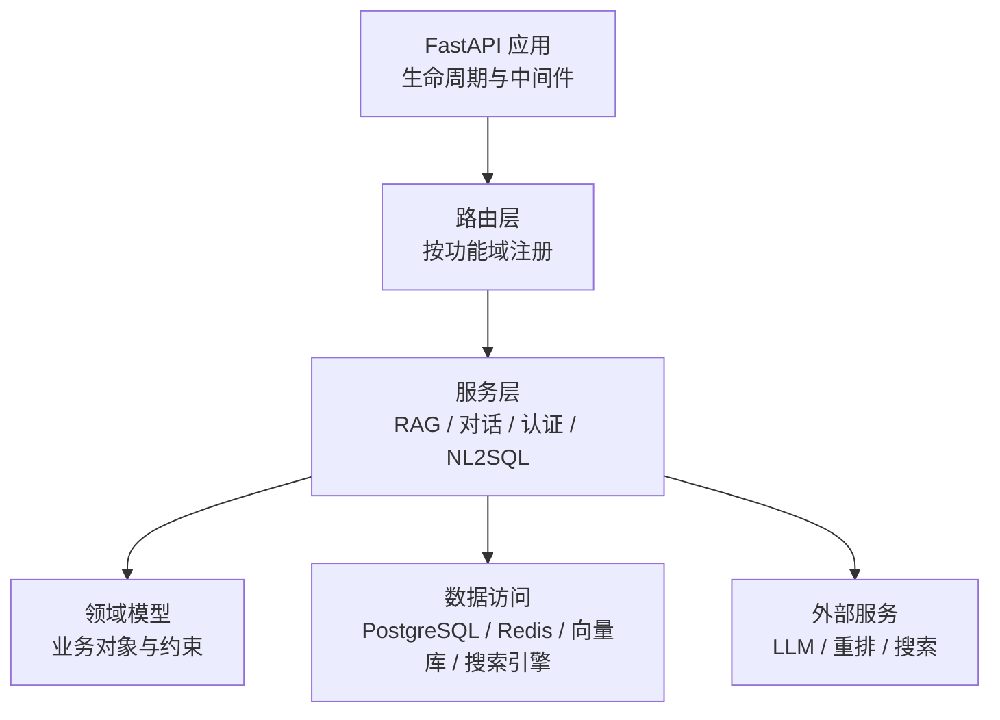
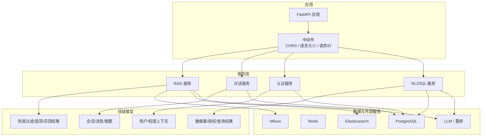
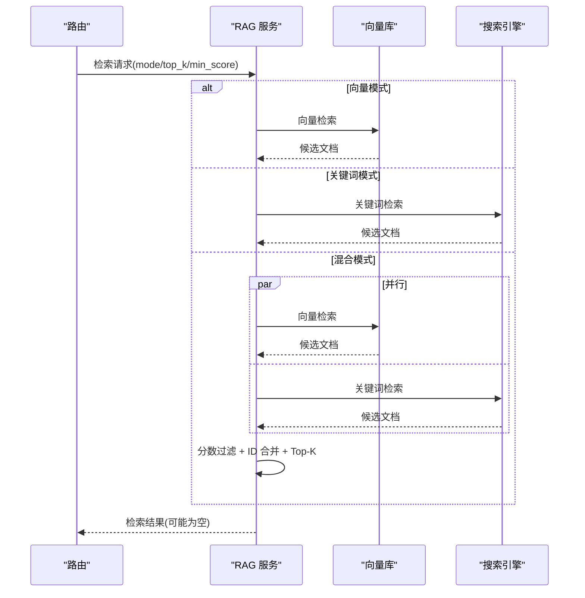
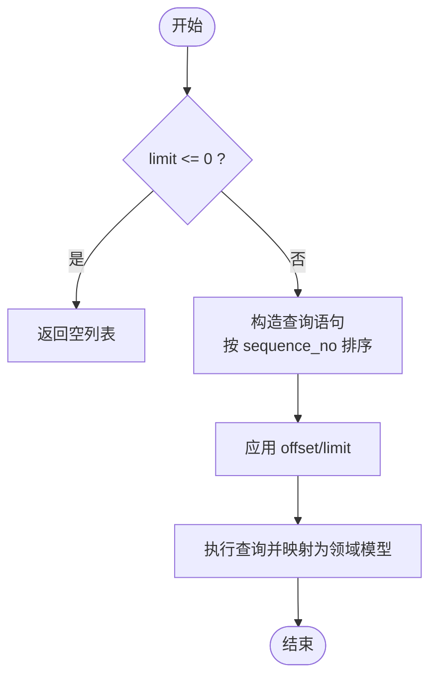
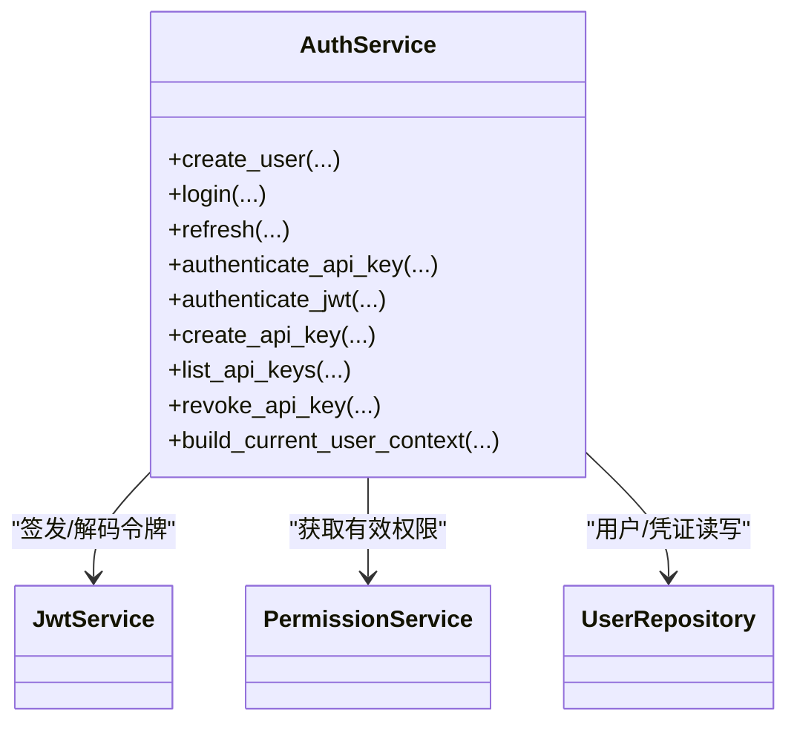
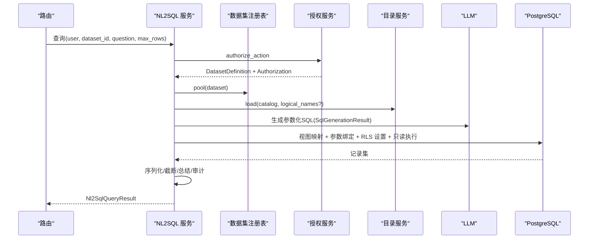
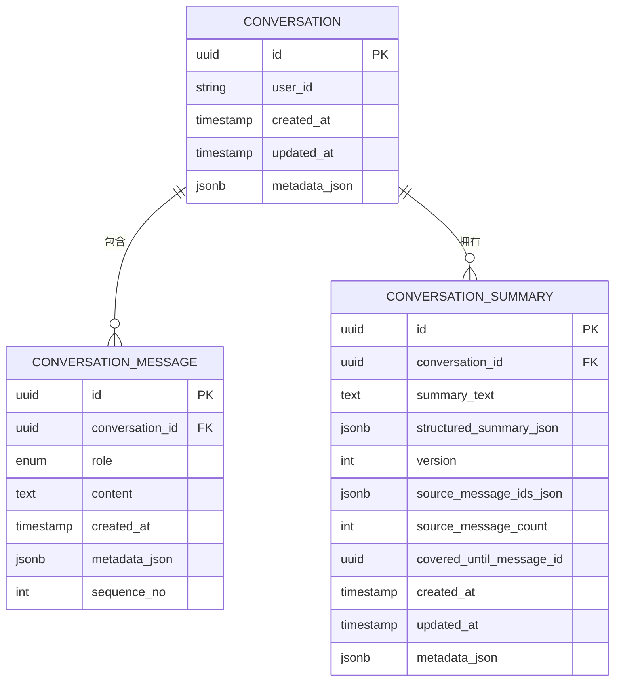
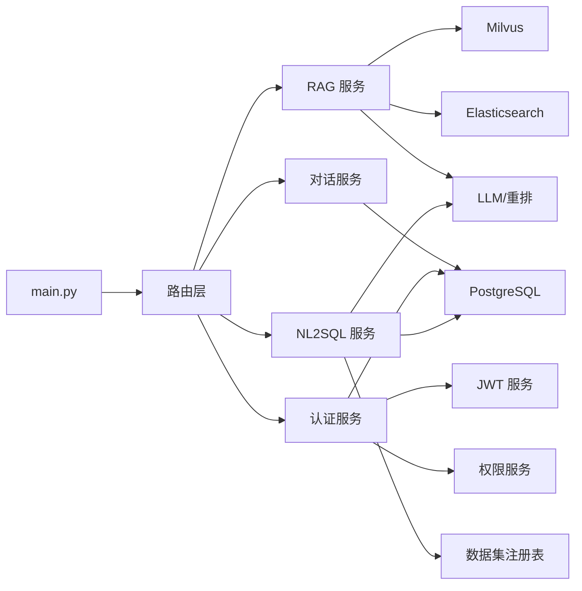

# 服务层设计

<cite>
**本文引用的文件**
- [main.py](file://python-agent-study/src/fast_app/main.py)
- [rag_service.py](file://python-agent-study/src/fast_app/services/rag/rag_service.py)
- [conversation_repository.py](file://python-agent-study/src/fast_app/services/conversation/conversation_repository.py)
- [auth_service.py](file://python-agent-study/src/fast_app/services/auth/auth_service.py)
- [service.py](file://python-agent-study/src/fast_app/services/nl2sql/service.py)
- [rag_models.py](file://python-agent-study/src/fast_app/domain/rag_models.py)
</cite>

## 目录
1. [简介](#简介)
2. [项目结构](#项目结构)
3. [核心组件](#核心组件)
4. [架构总览](#架构总览)
5. [详细组件分析](#详细组件分析)
6. [依赖关系分析](#依赖关系分析)
7. [性能考虑](#性能考虑)
8. [故障排查指南](#故障排查指南)
9. [结论](#结论)
10. [附录](#附录)

## 简介
本文件面向开发者，系统化梳理 FastAPI 应用的服务层设计。重点说明业务逻辑层的职责边界、服务类组织模式、领域模型抽象与业务流程编排；明确 RAG、对话、认证、NL2SQL 等模块的职责划分与协作方式；并给出事务管理、异常处理、缓存策略的实践建议。文档包含服务架构图、领域模型图与关键业务流程时序图，帮助读者快速理解并扩展系统。

## 项目结构
FastAPI 应用通过 lifespan 统一创建和释放外部资源（向量库、搜索引擎、重排器、Redis、数据库连接池、NL2SQL 数据集注册表等），并在启动时完成日志、追踪、配置校验与中间件注册。路由按功能域拆分，服务层位于 src/fast_app/services，领域模型位于 src/fast_app/domain，数据访问通过仓储/会话封装。

图表来源
- [main.py:41-129](file://python-agent-study/src/fast_app/main.py#L41-L129)

章节来源
- [main.py:1-170](file://python-agent-study/src/fast_app/main.py#L1-L170)

## 核心组件
- 应用入口与资源管理：在 lifespan 中初始化 Milvus、Elasticsearch、重排客户端、Redis、数据库引擎与 NL2SQL 数据集注册表，并在关闭时安全释放。
- 服务层：
  - RAG：检索、融合、流式上下文组装与答案生成。
  - 对话：会话容器、消息持久化、摘要与历史窗口管理。
  - 认证：用户、API Key、JWT、权限上下文构建与校验。
  - NL2SQL：授权、标记化、SQL 生成、AST/策略校验、RLS 执行与安全审计。
- 领域模型：统一的业务数据结构，如检索过滤条件、召回结果、对话实体、认证上下文等。

章节来源
- [main.py:41-129](file://python-agent-study/src/fast_app/main.py#L41-L129)
- [rag_service.py:84-122](file://python-agent-study/src/fast_app/services/rag/rag_service.py#L84-L122)
- [conversation_repository.py:18-81](file://python-agent-study/src/fast_app/services/conversation/conversation_repository.py#L18-L81)
- [auth_service.py:35-51](file://python-agent-study/src/fast_app/services/auth/auth_service.py#L35-L51)
- [service.py:41-56](file://python-agent-study/src/fast_app/services/nl2sql/service.py#L41-L56)
- [rag_models.py:8-80](file://python-agent-study/src/fast_app/domain/rag_models.py#L8-L80)

## 架构总览
服务层以“路由 -> 服务 -> 领域模型 -> 数据访问/外部服务”的分层组织。服务负责编排业务流程、组合多个子系统能力、保证一致性与可观测性；领域模型承载业务不变量；数据访问通过仓储或会话隔离具体存储实现。

图表来源
- [main.py:41-129](file://python-agent-study/src/fast_app/main.py#L41-L129)
- [rag_service.py:84-122](file://python-agent-study/src/fast_app/services/rag/rag_service.py#L84-L122)
- [conversation_repository.py:18-81](file://python-agent-study/src/fast_app/services/conversation/conversation_repository.py#L18-L81)
- [auth_service.py:75-170](file://python-agent-study/src/fast_app/services/auth/auth_service.py#L75-L170)
- [service.py:95-284](file://python-agent-study/src/fast_app/services/nl2sql/service.py#L95-L284)

## 详细组件分析

### RAG 服务
- 职责边界
  - 接收检索请求，支持向量、关键词、混合三种模式。
  - 对多源召回结果进行分数过滤与 ID 级合并，返回 Top-K。
  - 提供同步与流式两种接口，便于前端增量渲染。
- 关键流程
  - 根据 mode 选择单一或并行检索。
  - 基于最小分数阈值过滤。
  - 按文档 ID 去重并排序取 Top-K。
  - 无结果时抛出领域异常。
- 数据模型
  - 使用领域模型表达检索过滤、选项、召回结果与上下文。
- 异常与错误
  - 未命中时抛出“无搜索结果”异常；获取文档不存在时抛出“文档不存在”。

图表来源
- [rag_service.py:84-122](file://python-agent-study/src/fast_app/services/rag/rag_service.py#L84-L122)

章节来源
- [rag_service.py:12-173](file://python-agent-study/src/fast_app/services/rag/rag_service.py#L12-L173)
- [rag_models.py:8-80](file://python-agent-study/src/fast_app/domain/rag_models.py#L8-L80)

### 对话服务
- 职责边界
  - 会话容器与消息的增删改查。
  - 一轮对话的原子写入（会话 + 消息）。
  - 摘要版本管理与“摘要后消息”读取。
  - 按 user_id 限制的数据访问，避免越权。
- 事务与一致性
  - save_conversation_turn 在一个事务内保存会话与消息，失败回滚，避免半成功状态。
- 数据模型
  - 会话、消息、摘要均映射到领域模型，仓储负责 ORM 转换。

图表来源
- [conversation_repository.py:83-105](file://python-agent-study/src/fast_app/services/conversation/conversation_repository.py#L83-L105)

章节来源
- [conversation_repository.py:18-222](file://python-agent-study/src/fast_app/services/conversation/conversation_repository.py#L18-L222)

### 认证服务
- 职责边界
  - 统一认证入口：用户名密码登录、Refresh Token 轮换、API Key 认证、JWT 认证。
  - 构建当前用户上下文（CurrentUserContext），聚合全局权限快照。
  - 管理 API Key 的创建、列举与撤销。
- 安全与权限
  - 密码与密钥哈希、指纹与过期校验。
  - 通过权限服务获取有效权限，注入上下文供下游使用。
- 异常处理
  - 认证失败、用户禁用、凭证无效或过期等场景抛出明确的认证异常。

图表来源
- [auth_service.py:35-51](file://python-agent-study/src/fast_app/services/auth/auth_service.py#L35-L51)
- [auth_service.py:75-170](file://python-agent-study/src/fast_app/services/auth/auth_service.py#L75-L170)
- [auth_service.py:172-267](file://python-agent-study/src/fast_app/services/auth/auth_service.py#L172-L267)

章节来源
- [auth_service.py:35-327](file://python-agent-study/src/fast_app/services/auth/auth_service.py#L35-L327)

### NL2SQL 服务
- 职责边界
  - 单入口编排：授权检查、敏感问题标记化、Schema 目录加载、SQL 生成、AST/策略校验、RLS 执行、结果序列化与总结、审计记录。
  - 严格的安全边界：模型不直接访问数据库；真实值通过 Vault 在执行前回填；只读事务与超时控制。
- 业务流程
  - 授权：校验功能开关、Dataset 可见性与报告能力。
  - 标记化：将敏感问题中的实体替换为占位符，真实值保存在内存 Vault。
  - SQL 生成：调用 LLM 生成带参数的结构化 SQL。
  - 执行：视图映射、参数顺序绑定、RLS 作用域设置、只读事务执行。
  - 结果：截断、Markdown 表格、敏感模板总结、审计落库。
- 异常与重试
  - 捕获可修复的 SQL 错误，触发一次修复重试；数据库拒绝或超时报错。

图表来源
- [service.py:95-284](file://python-agent-study/src/fast_app/services/nl2sql/service.py#L95-L284)
- [service.py:362-465](file://python-agent-study/src/fast_app/services/nl2sql/service.py#L362-L465)

章节来源
- [service.py:41-586](file://python-agent-study/src/fast_app/services/nl2sql/service.py#L41-L586)

### 领域模型与数据流转
- RAG 领域模型
  - RetrievalFilters/RetrievalOptions：限定检索范围、输出字段与候选规模。
  - RetrievedDoc/ScoreBreakdown/RagContext：描述召回结果、分数明细与最终上下文。
- 对话领域模型
  - Conversation/ConversationMessage/ConversationSummary：会话容器、消息与摘要版本。
- 认证领域模型
  - AuthUser/ApiKeyCredential/JwtTokenPair/CurrentUserContext：用户、凭证、令牌与请求上下文。
- NL2SQL 领域模型
  - DatasetDefinition/DatasetAuthorization/Nl2SqlQueryResult/SqlGenerationResult：数据集定义、授权、查询结果与 SQL 生成产物。

图表来源
- [conversation_repository.py:225-310](file://python-agent-study/src/fast_app/services/conversation/conversation_repository.py#L225-L310)

章节来源
- [rag_models.py:8-80](file://python-agent-study/src/fast_app/domain/rag_models.py#L8-L80)
- [conversation_repository.py:225-310](file://python-agent-study/src/fast_app/services/conversation/conversation_repository.py#L225-L310)

## 依赖关系分析
- 应用层依赖
  - main.py 在 lifespan 中集中装配外部客户端与会话工厂，并通过 app.state 共享。
  - 路由层按功能域引入对应 router，统一注册异常处理器与中间件。
- 服务层依赖
  - RAG 服务依赖向量库与搜索引擎，必要时依赖重排器。
  - 对话服务依赖 PostgreSQL 会话与领域模型。
  - 认证服务依赖 JWT 服务、权限服务与用户仓储。
  - NL2SQL 服务依赖数据集注册表、授权服务、目录服务、LLM 与数据库连接池。
- 耦合与内聚
  - 服务层通过领域模型降低对外部实现的耦合。
  - 数据访问通过仓储/会话封装，避免在业务逻辑中散落 SQL。

图表来源
- [main.py:41-129](file://python-agent-study/src/fast_app/main.py#L41-L129)
- [rag_service.py:84-122](file://python-agent-study/src/fast_app/services/rag/rag_service.py#L84-L122)
- [conversation_repository.py:18-81](file://python-agent-study/src/fast_app/services/conversation/conversation_repository.py#L18-L81)
- [auth_service.py:75-170](file://python-agent-study/src/fast_app/services/auth/auth_service.py#L75-L170)
- [service.py:95-284](file://python-agent-study/src/fast_app/services/nl2sql/service.py#L95-L284)

章节来源
- [main.py:1-170](file://python-agent-study/src/fast_app/main.py#L1-L170)

## 性能考虑
- 并发检索：RAG 混合模式下并行调用向量库与搜索引擎，减少端到端延迟。
- 结果裁剪：Top-K 与最小分数阈值控制响应体积与计算成本。
- 只读事务与超时：NL2SQL 使用只读事务与语句/锁超时，防止慢查询影响系统。
- 资源复用：应用启动时创建并复用客户端与连接池，避免请求级开销。
- 流式输出：RAG 流式接口逐步返回上下文与答案，提升首字节时间体验。

[本节为通用指导，不直接分析具体文件]

## 故障排查指南
- RAG
  - 无检索结果：检查 min_score 与 top_k 配置；确认向量/关键词检索是否返回数据。
  - 文档不存在：核对 doc_id 是否存在于后端模拟存储或实际存储。
- 对话
  - 写入失败：检查 save_conversation_turn 的事务提交与外键约束；查看会话是否存在。
  - 越权访问：确保使用 list_messages_for_user/get_conversation_for_user 等带 user_id 的方法。
- 认证
  - 登录失败：核对用户名/邮箱与密码哈希；检查用户状态是否为激活。
  - Refresh 失败：检查 refresh token 哈希匹配、状态与过期时间。
  - API Key 无效：核对指纹与哈希验证、过期时间与用户状态。
- NL2SQL
  - 查询被拒绝/超时：检查数据库只读策略、RLS 作用域与语句超时设置。
  - 敏感问题：确认标记化与 Vault 回填是否正确；避免真实值进入模型 Prompt。
  - 审计缺失：失败路径会记录审计但脱敏；成功路径记录参数化 SQL 与结果统计。

章节来源
- [rag_service.py:113-149](file://python-agent-study/src/fast_app/services/rag/rag_service.py#L113-L149)
- [conversation_repository.py:52-81](file://python-agent-study/src/fast_app/services/conversation/conversation_repository.py#L52-L81)
- [auth_service.py:75-170](file://python-agent-study/src/fast_app/services/auth/auth_service.py#L75-L170)
- [service.py:104-136](file://python-agent-study/src/fast_app/services/nl2sql/service.py#L104-L136)
- [service.py:186-225](file://python-agent-study/src/fast_app/services/nl2sql/service.py#L186-L225)

## 结论
该服务层以清晰的分层与职责边界组织业务逻辑：路由仅负责接入与路由，服务层编排跨子系统流程，领域模型承载业务不变量，数据访问通过仓储/会话隔离。RAG 强调多源检索与融合，对话强调事务一致性与历史窗口，认证强调统一上下文与权限快照，NL2SQL 强调安全边界与审计。整体设计兼顾可扩展性、安全性与可观测性，适合持续演进与企业化部署。

[本节为总结性内容，不直接分析具体文件]

## 附录
- 建议的缓存策略
  - 短期会话记忆：使用 Redis 缓存最近消息与会话状态，结合 TTL 管理生命周期。
  - 检索结果缓存：对高频查询按 query+filters 维度缓存 Top-K 结果，注意失效与一致性。
  - 权限快照：在认证服务中缓存用户的有效权限，缩短鉴权路径。
- 建议的事务边界
  - 对话一轮写入：会话与消息在同一事务中提交。
  - NL2SQL 审计：成功路径记录审计，失败路径记录脱敏审计。
- 建议的异常分类
  - 用户错误：参数非法、权限不足。
  - 外部服务错误：LLM/向量库/搜索引擎超时或不可用。
  - 系统错误：数据库连接异常、内部逻辑错误。

[本节为通用指导，不直接分析具体文件]