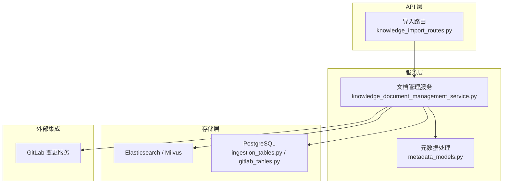
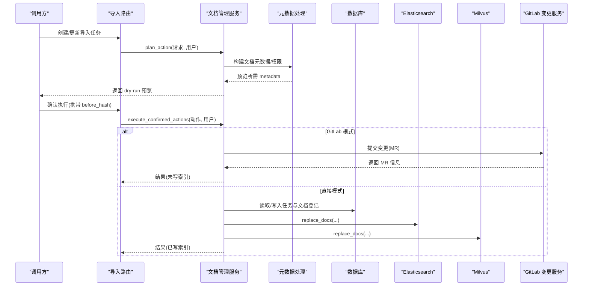
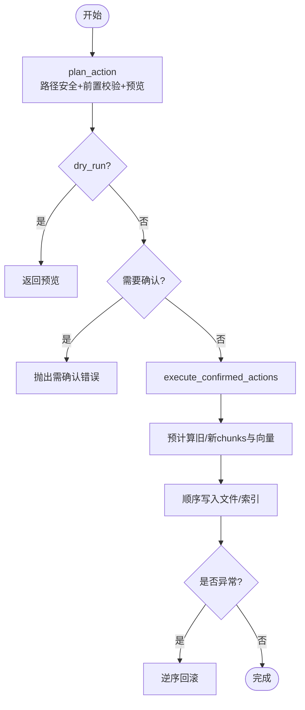
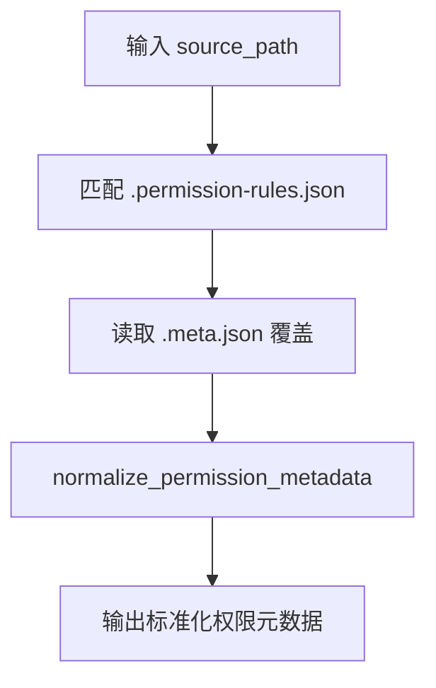
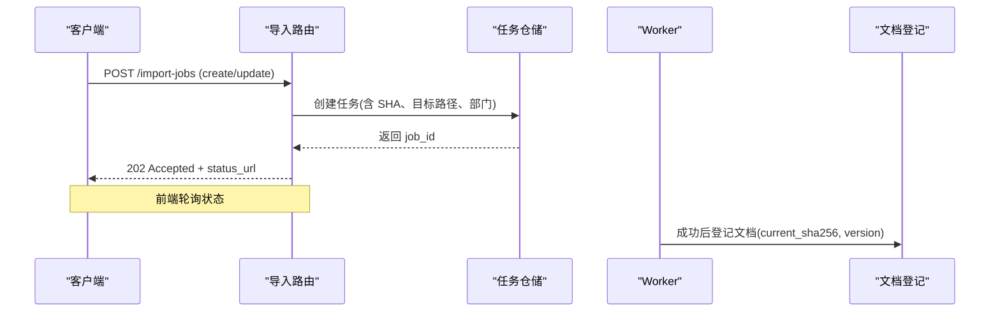
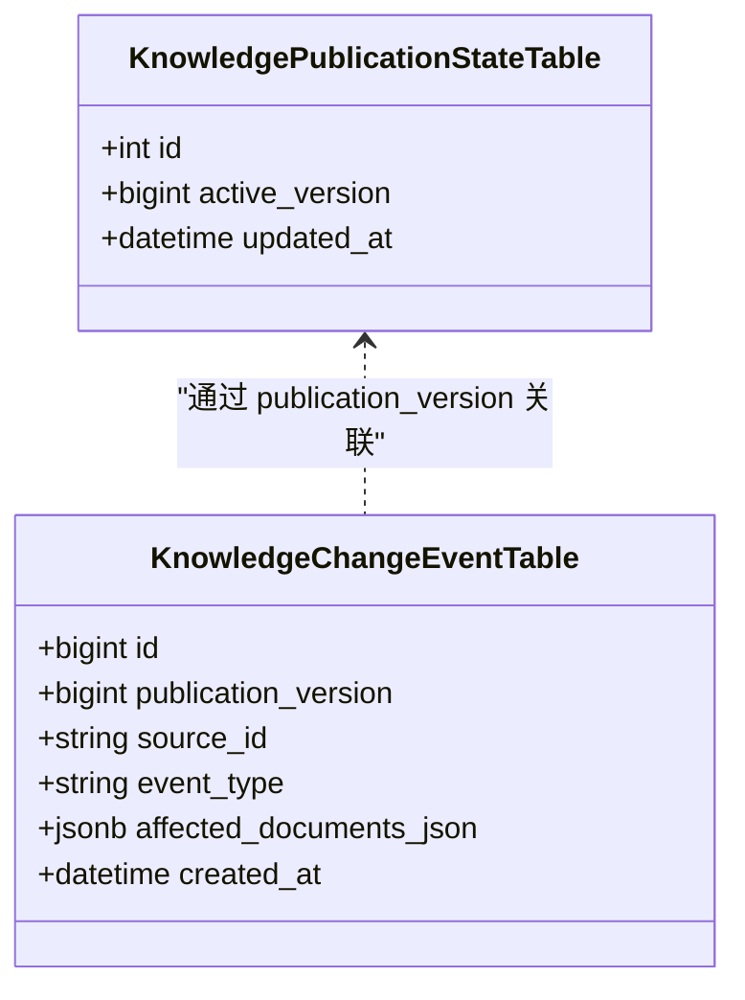
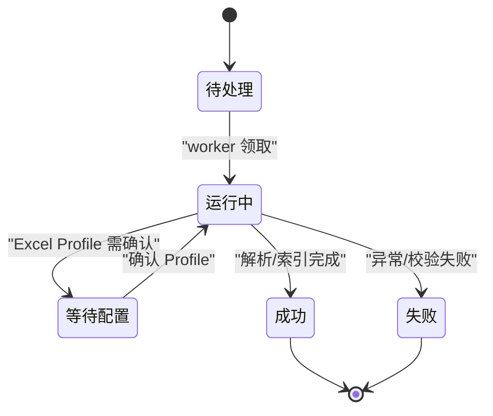
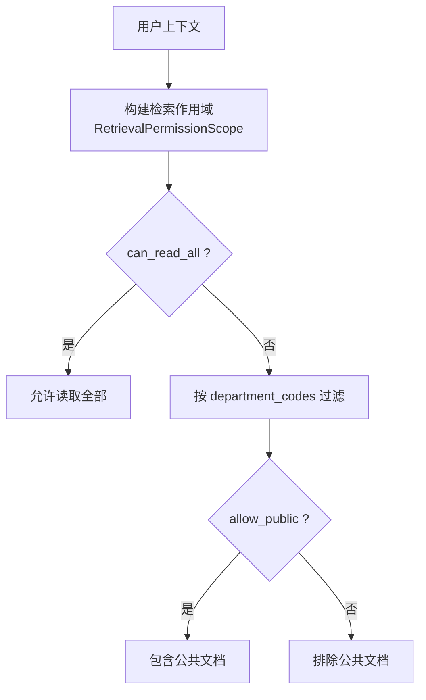
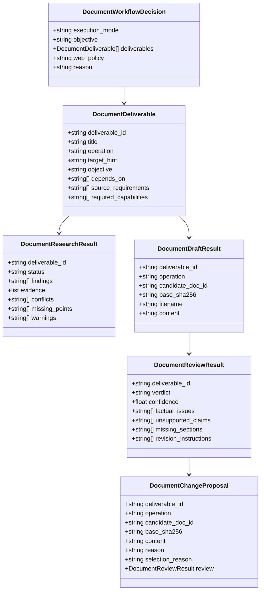
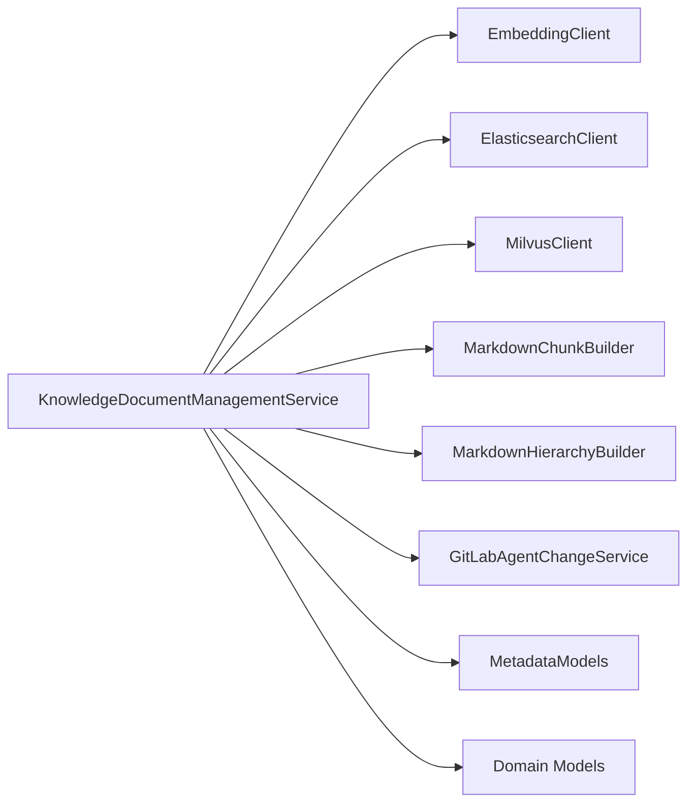

# 知识管理服务

<cite>
**本文引用的文件**
- [knowledge_document_management_service.py](file://src/fast_app/services/knowledge/knowledge_document_management_service.py)
- [metadata_models.py](file://src/fast_app/ingestion/processing/metadata_models.py)
- [knowledge_import_routes.py](file://src/fast_app/api/knowledge_import_routes.py)
- [document_workflow.py](file://src/fast_app/domain/document_workflow.py)
- [knowledge_permissions.py](file://src/fast_app/domain/knowledge_permissions.py)
- [gitlab_tables.py](file://src/fast_app/db/gitlab_tables.py)
- [ingestion_tables.py](file://src/fast_app/db/ingestion_tables.py)
- [20260715_0008_add_incremental_office_ingestion.py](file://alembic/versions/20260715_0008_add_incremental_office_ingestion.py)
- [20260726_0009_add_gitlab_enterprise_sync.py](file://alembic/versions/20260726_0009_add_gitlab_enterprise_sync.py)
- [seed_and_test_rbac_accounts.py](file://scripts/phase_15/seed_and_test_rbac_accounts.py)
</cite>

## 目录
1. [简介](#简介)
2. [项目结构](#项目结构)
3. [核心组件](#核心组件)
4. [架构总览](#架构总览)
5. [详细组件分析](#详细组件分析)
6. [依赖关系分析](#依赖关系分析)
7. [性能考虑](#性能考虑)
8. [故障排查指南](#故障排查指南)
9. [结论](#结论)
10. [附录：API 使用与最佳实践](#附录api-使用与最佳实践)

## 简介
本文件面向开发者，系统化阐述知识管理服务的文档全生命周期管理能力，包括文档导入、版本控制、权限管理与发布流程。重点解析 KnowledgeDocumentManagementService 的设计模式与执行策略，以及权限决策流程（KnowledgePermissionPolicy 思想在检索作用域中的体现）。同时覆盖文档元数据处理、批量操作、变更追踪机制、文档状态机、版本管理策略，并提供 API 使用指南、处理最佳实践和权限配置方法。

## 项目结构
知识管理相关能力分布在服务层、领域模型、导入路由、入库处理、数据库表与迁移脚本中：
- 服务层：KnowledgeDocumentManagementService 负责路径安全校验、预览、批量预计算、确认执行与回滚、ES/Milvus 同步。
- 领域模型：文档工作流契约、检索权限作用域、文档类型与分块数据结构。
- 导入路由：提供 Office 文档上传、增量更新、Excel Profile 确认等 REST 接口。
- 入库处理：元数据构建、权限规则匹配、sidecar 覆盖、chunk 生成。
- 数据库与迁移：导入任务、文档登记、GitLab 企业同步的发布版本与变更事件表。

**图表来源**
- [knowledge_import_routes.py:207-311](file://src/fast_app/api/knowledge_import_routes.py#L207-L311)
- [knowledge_document_management_service.py:114-396](file://src/fast_app/services/knowledge/knowledge_document_management_service.py#L114-L396)
- [metadata_models.py:49-99](file://src/fast_app/ingestion/processing/metadata_models.py#L49-L99)
- [ingestion_tables.py:108-126](file://src/fast_app/db/ingestion_tables.py#L108-L126)
- [gitlab_tables.py:263-304](file://src/fast_app/db/gitlab_tables.py#L263-L304)

**章节来源**
- [knowledge_import_routes.py:207-311](file://src/fast_app/api/knowledge_import_routes.py#L207-L311)
- [knowledge_document_management_service.py:114-396](file://src/fast_app/services/knowledge/knowledge_document_management_service.py#L114-L396)
- [metadata_models.py:49-99](file://src/fast_app/ingestion/processing/metadata_models.py#L49-L99)
- [ingestion_tables.py:108-126](file://src/fast_app/db/ingestion_tables.py#L108-L126)
- [gitlab_tables.py:263-304](file://src/fast_app/db/gitlab_tables.py#L263-L304)

## 核心组件
- KnowledgeDocumentManagementService：统一入口，负责计划（dry-run）、预览、批量预计算、确认执行、失败回滚、双写 ES/Milvus、GitLab 变更提交。
- 元数据处理模块：构建 doc_id/chunk_id、文档级 metadata、权限规则匹配、sidecar 覆盖、规范化权限字段。
- 导入路由：创建/更新导入任务、Excel Profile 确认、任务查询与列表，结合权限服务进行部门级授权。
- 领域模型：文档工作流契约（研究-写作-审查-变更建议）、检索权限作用域、分块数据结构。
- 数据库与迁移：导入任务表、文档登记表、GitLab 发布版本与变更事件表，支撑版本化与可追溯。

**章节来源**
- [knowledge_document_management_service.py:85-113](file://src/fast_app/services/knowledge/knowledge_document_management_service.py#L85-L113)
- [metadata_models.py:21-75](file://src/fast_app/ingestion/processing/metadata_models.py#L21-L75)
- [knowledge_import_routes.py:207-311](file://src/fast_app/api/knowledge_import_routes.py#L207-L311)
- [document_workflow.py:14-87](file://src/fast_app/domain/document_workflow.py#L14-L87)
- [knowledge_permissions.py:4-19](file://src/fast_app/domain/knowledge_permissions.py#L4-L19)

## 架构总览
知识管理采用“计划-确认-执行”的安全闭环：
- 计划阶段：路径安全校验、业务前置条件检查、生成 dry-run 预览（包含影响范围、风险等级、权限元数据、before/after hash）。
- 确认阶段：TaskPlan 或人工确认后，携带 before_hash 与确认预览进入执行。
- 执行阶段：预计算旧/新 chunks 与向量，顺序写入源文件、sidecar、ES/Milvus；任一失败按逆序回滚。
- GitLab 模式：当启用 GitLab Agent 变更时，提交 MR，合并前不修改索引。

**图表来源**
- [knowledge_import_routes.py:207-311](file://src/fast_app/api/knowledge_import_routes.py#L207-L311)
- [knowledge_document_management_service.py:114-396](file://src/fast_app/services/knowledge/knowledge_document_management_service.py#L114-L396)
- [metadata_models.py:49-99](file://src/fast_app/ingestion/processing/metadata_models.py#L49-L99)
- [gitlab_tables.py:263-304](file://src/fast_app/db/gitlab_tables.py#L263-L304)

## 详细组件分析

### 文档管理服务：KnowledgeDocumentManagementService
- 设计要点
  - 安全路径解析：拒绝路径穿越、限制知识库根目录、白名单后缀、禁止编辑权限控制文件。
  - 操作前置校验：create/update/delete 的语义约束与内容大小限制。
  - Dry-run 预览：冻结权限元数据、估算影响范围、生成 before/after hash。
  - 批量预计算：一次性准备所有变更（旧/新 chunks、向量），失败不写任何数据。
  - 顺序执行与回滚：严格按 TaskPlan 顺序执行，异常时逆序恢复源文件、sidecar 与索引。
  - 双写一致性：仅当 embedding/ES/Milvus 三者均存在时才同步索引；否则仅写文件用于测试。
  - GitLab 集成：启用时走 MR 流程，合并前不写索引。

**图表来源**
- [knowledge_document_management_service.py:114-396](file://src/fast_app/services/knowledge/knowledge_document_management_service.py#L114-L396)

**章节来源**
- [knowledge_document_management_service.py:114-396](file://src/fast_app/services/knowledge/knowledge_document_management_service.py#L114-L396)

### 元数据处理与权限策略
- 文档 ID 与 Chunk ID：基于 source_path 与 section_path 稳定生成，便于替换与去重。
- 文档级 Metadata：包含 doc_id、source_path、document_type、file_name/file_extension，并注入权限字段。
- 权限来源优先级：
  - 知识库根目录 .permission-rules.json 规则匹配（path_prefix 最长优先）。
  - sidecar .meta.json 覆盖（仅允许 visibility/allowed_departments/allowed_users/permission_source）。
  - 默认策略：public 目录或 default_policy。
- 规范化：强制 visibility 为 public/department/restricted，列表字段规范化为字符串数组。

**图表来源**
- [metadata_models.py:78-99](file://src/fast_app/ingestion/processing/metadata_models.py#L78-L99)
- [metadata_models.py:136-198](file://src/fast_app/ingestion/processing/metadata_models.py#L136-L198)
- [metadata_models.py:275-323](file://src/fast_app/ingestion/processing/metadata_models.py#L275-L323)

**章节来源**
- [metadata_models.py:21-75](file://src/fast_app/ingestion/processing/metadata_models.py#L21-L75)
- [metadata_models.py:78-99](file://src/fast_app/ingestion/processing/metadata_models.py#L78-L99)
- [metadata_models.py:136-198](file://src/fast_app/ingestion/processing/metadata_models.py#L136-L198)
- [metadata_models.py:275-323](file://src/fast_app/ingestion/processing/metadata_models.py#L275-L323)

### 导入与版本控制：Office 文档与增量更新
- 创建任务：校验文件名与类型、目标路径安全、权限检查、暂存文件、OOXML 校验、落库任务。
- 更新任务：校验 expected_sha256 与当前版本一致、类型一致、无活动任务冲突，支持重新配置 Excel Profile。
- Excel Profile：Record/Section/Mixed 模式，逐 Sheet 配置主键与字段映射，确认指纹防过期。
- 版本登记：成功完成后登记 knowledge_documents，维护 current_sha256/version/status。

**图表来源**
- [knowledge_import_routes.py:207-311](file://src/fast_app/api/knowledge_import_routes.py#L207-L311)
- [ingestion_tables.py:108-126](file://src/fast_app/db/ingestion_tables.py#L108-L126)
- [20260715_0008_add_incremental_office_ingestion.py:80-134](file://alembic/versions/20260715_0008_add_incremental_office_ingestion.py#L80-L134)

**章节来源**
- [knowledge_import_routes.py:207-311](file://src/fast_app/api/knowledge_import_routes.py#L207-L311)
- [ingestion_tables.py:108-126](file://src/fast_app/db/ingestion_tables.py#L108-L126)
- [20260715_0008_add_incremental_office_ingestion.py:80-134](file://alembic/versions/20260715_0008_add_incremental_office_ingestion.py#L80-L134)

### 发布流程与变更追踪：GitLab 企业同步
- 发布版本：knowledge_publication_state 维护 active_version，knowledge_publications 记录版本快照。
- 变更事件：knowledge_change_events 记录每次发布涉及的受影响文档集合与事件类型。
- 流程：Agent 提交变更 -> 生成 MR -> 合并后触发发布 -> 记录版本与事件 -> 更新索引。

**图表来源**
- [gitlab_tables.py:263-304](file://src/fast_app/db/gitlab_tables.py#L263-L304)
- [20260726_0009_add_gitlab_enterprise_sync.py:141-153](file://alembic/versions/20260726_0009_add_gitlab_enterprise_sync.py#L141-L153)

**章节来源**
- [gitlab_tables.py:263-304](file://src/fast_app/db/gitlab_tables.py#L263-L304)
- [20260726_0009_add_gitlab_enterprise_sync.py:141-153](file://alembic/versions/20260726_0009_add_gitlab_enterprise_sync.py#L141-L153)

### 文档状态机
- 导入任务状态：pending -> running -> awaiting_configuration -> succeeded/failed。
- 文档登记状态：active（当前生效版本），配合 current_sha256/version 实现版本控制。
- 发布状态：active_version 指向当前生效发布版本，变更事件可追溯。

**图表来源**
- [knowledge_import_routes.py:403-427](file://src/fast_app/api/knowledge_import_routes.py#L403-L427)
- [ingestion_tables.py:108-126](file://src/fast_app/db/ingestion_tables.py#L108-L126)

**章节来源**
- [knowledge_import_routes.py:403-427](file://src/fast_app/api/knowledge_import_routes.py#L403-L427)
- [ingestion_tables.py:108-126](file://src/fast_app/db/ingestion_tables.py#L108-L126)

### 权限决策流程（检索作用域）
- RetrievalPermissionScope：由认证后的用户上下文转换得到，包含 can_read_all、user_id、department_codes、allow_public。
- 工具权限：基于 RBAC 的角色与部门角色组合，决定对 create/update/delete 的 DENY/CONFIRMATION_REQUIRED/EXECUTE_ALLOWED。
- 测试用例验证了不同角色在不同部门的授权行为。

**图表来源**
- [knowledge_permissions.py:4-19](file://src/fast_app/domain/knowledge_permissions.py#L4-L19)
- [seed_and_test_rbac_accounts.py:174-262](file://scripts/phase_15/seed_and_test_rbac_accounts.py#L174-L262)

**章节来源**
- [knowledge_permissions.py:4-19](file://src/fast_app/domain/knowledge_permissions.py#L4-L19)
- [seed_and_test_rbac_accounts.py:174-262](file://scripts/phase_15/seed_and_test_rbac_accounts.py#L174-L262)

### 复杂文档工作流契约
- Supervisor 决策：execution_mode（direct/agentic）、deliverables（create/update/delete）、web_policy。
- 三阶段：Researcher（证据摘要）、Writer（草稿）、Reviewer（审查结论 approved/revision_required/rejected）。
- 变更建议：只有 Reviewer approved 的草稿才能形成 DocumentChangeProposal，供服务端验证与确认执行。

**图表来源**
- [document_workflow.py:14-87](file://src/fast_app/domain/document_workflow.py#L14-L87)
- [document_workflow.py:89-271](file://src/fast_app/domain/document_workflow.py#L89-L271)

**章节来源**
- [document_workflow.py:14-87](file://src/fast_app/domain/document_workflow.py#L14-L87)
- [document_workflow.py:89-271](file://src/fast_app/domain/document_workflow.py#L89-L271)

## 依赖关系分析
- 服务层依赖：Settings、EmbeddingClient、ElasticsearchClient、MilvusClient、MarkdownChunkBuilder、MarkdownHierarchyBuilder、GitLabAgentChangeService。
- 领域依赖：LoadedDocument/KnowledgeChunk、RetrievalPermissionScope、DocumentWorkflow* 模型。
- 存储依赖：PostgreSQL（导入任务、文档登记、发布版本与事件）、ES/Milvus（索引与向量）。
- 外部依赖：GitLab（MR 提交与变更拉取）。

**图表来源**
- [knowledge_document_management_service.py:93-113](file://src/fast_app/services/knowledge/knowledge_document_management_service.py#L93-L113)
- [metadata_models.py:49-75](file://src/fast_app/ingestion/processing/metadata_models.py#L49-L75)
- [knowledge_permissions.py:4-19](file://src/fast_app/domain/knowledge_permissions.py#L4-L19)
- [document_workflow.py:14-87](file://src/fast_app/domain/document_workflow.py#L14-L87)

**章节来源**
- [knowledge_document_management_service.py:93-113](file://src/fast_app/services/knowledge/knowledge_document_management_service.py#L93-L113)
- [metadata_models.py:49-75](file://src/fast_app/ingestion/processing/metadata_models.py#L49-L75)
- [knowledge_permissions.py:4-19](file://src/fast_app/domain/knowledge_permissions.py#L4-L19)
- [document_workflow.py:14-87](file://src/fast_app/domain/document_workflow.py#L14-L87)

## 性能考虑
- 预计算与分批：批量动作先预计算所有变更，再顺序执行，避免中间态不一致。
- 向量生成缓存：旧/新向量在预计算阶段生成，执行阶段复用，减少重复开销。
- 双写一致性：仅在三个 client 均存在时同步索引，避免部分写入导致的不一致。
- 文件与索引分离：GitLab 模式下合并前不写索引，降低频繁变更的性能压力。
- 大文件与分块：Office 文档通过 Profile 与 Record/Section 模式控制分块粒度，提升检索效率。

[本节为通用指导，无需特定文件引用]

## 故障排查指南
- 路径与安全
  - 目标路径不在知识库根目录或包含 ..：检查 _resolve_safe_target_path 与 allowed_extensions。
  - 尝试修改权限控制文件或 sidecar：被 _reject_permission_control_file 拒绝。
- 操作前置校验
  - create/update/delete 内容与存在性不符：检查 _validate_operation_requirements。
  - 内容过大：超过最大字符限制。
- 版本冲突
  - expected_sha256 与当前版本不一致：更新接口会拒绝。
  - 同一目标路径已有活动任务：并发保护。
- 索引不一致
  - ES/Milvus 权限 metadata 不一致：_load_stored_permission_metadata 会报错。
  - 双写缺失：确保 embedding/ES/Milvus 三者均配置。
- 权限问题
  - 工具权限不足：DENY/CONFIRMATION_REQUIRED，检查 RBAC 角色与部门角色。
  - 检索作用域受限：确认 can_read_all、department_codes、allow_public。

**章节来源**
- [knowledge_document_management_service.py:478-561](file://src/fast_app/services/knowledge/knowledge_document_management_service.py#L478-L561)
- [knowledge_document_management_service.py:563-601](file://src/fast_app/services/knowledge/knowledge_document_management_service.py#L563-L601)
- [knowledge_document_management_service.py:773-800](file://src/fast_app/services/knowledge/knowledge_document_management_service.py#L773-L800)
- [knowledge_import_routes.py:252-311](file://src/fast_app/api/knowledge_import_routes.py#L252-L311)
- [seed_and_test_rbac_accounts.py:174-262](file://scripts/phase_15/seed_and_test_rbac_accounts.py#L174-L262)

## 结论
知识管理服务通过“计划-确认-执行”的安全闭环、严格的元数据与权限策略、稳定的版本控制与发布机制，实现了从导入到检索的全链路可控。KnowledgeDocumentManagementService 以批处理与回滚保障一致性，元数据处理模块确保权限一致性与可追溯，导入路由与数据库迁移支撑 Office 文档的增量更新与企业级发布流程。开发者应遵循最佳实践，合理配置权限规则与 Profile，并在生产环境启用确认执行与 GitLab 变更流程。

[本节为总结，无需特定文件引用]

## 附录：API 使用与最佳实践

### 导入 API
- 创建导入任务：POST /knowledge-documents/import-jobs
  - 参数：file、department_code
  - 权限：KNOWLEDGE_DOCUMENT_CREATE
  - 响应：job_id、status_url
- 更新导入任务：POST /knowledge-documents/{doc_id}/import-jobs
  - 参数：file、expected_sha256、reconfigure_excel_profile
  - 权限：KNOWLEDGE_DOCUMENT_UPDATE
- 确认 Excel Profile：POST /knowledge-documents/import-jobs/{job_id}/excel-profile/confirm
  - 参数：preview_fingerprint、mode、profile_name、sheets
- 查询任务：GET /knowledge-documents/import-jobs/{job_id}
- 列出任务：GET /knowledge-documents/import-jobs?status=...&limit=...

**章节来源**
- [knowledge_import_routes.py:207-311](file://src/fast_app/api/knowledge_import_routes.py#L207-L311)
- [knowledge_import_routes.py:314-427](file://src/fast_app/api/knowledge_import_routes.py#L314-L427)

### 文档管理 API（Agent 工具）
- 计划动作：plan_action(request, user)
  - 返回 dry-run 预览，包含影响范围、风险等级、权限元数据、before/after hash。
- 确认执行：execute_confirmed_action(s, user, expected_before_hash)
  - 携带 before_hash 防止确认后被篡改。
- 批量执行：execute_confirmed_actions(actions, user, task_plan_id, confirmed_previews)
  - 预计算整批变更，失败回滚。

**章节来源**
- [knowledge_document_management_service.py:114-396](file://src/fast_app/services/knowledge/knowledge_document_management_service.py#L114-L396)

### 权限配置方法
- 知识库根目录 .permission-rules.json
  - rules：path_prefix 到权限元数据的映射，最长 path_prefix 优先。
  - default：未命中规则时的默认策略。
- sidecar .meta.json
  - 仅允许 visibility、allowed_departments、allowed_users、permission_source。
- 检索作用域
  - can_read_all：全局读取权限。
  - department_codes：部门级过滤。
  - allow_public：是否包含公共文档。

**章节来源**
- [metadata_models.py:136-198](file://src/fast_app/ingestion/processing/metadata_models.py#L136-L198)
- [metadata_models.py:275-323](file://src/fast_app/ingestion/processing/metadata_models.py#L275-L323)
- [knowledge_permissions.py:4-19](file://src/fast_app/domain/knowledge_permissions.py#L4-L19)

### 最佳实践
- 始终使用 dry-run 预览评估影响范围与风险。
- 在生产环境启用 require_confirmation 与 dry_run_only=false 的受控执行。
- 使用 GitLab 变更流程，合并前不写索引，降低风险。
- 规范 Excel Profile，明确主键与字段映射，避免歧义。
- 定期审计权限规则与 sidecar，确保权限最小化。

[本节为通用指导，无需特定文件引用]