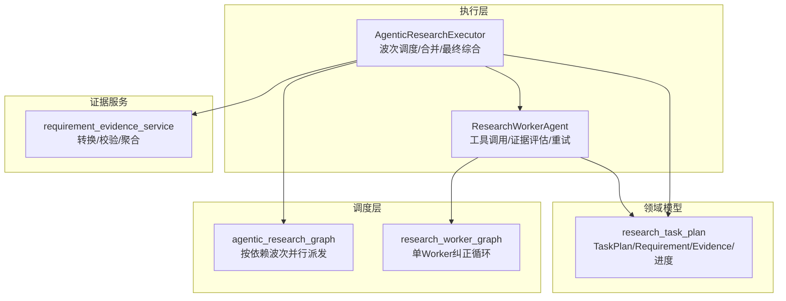
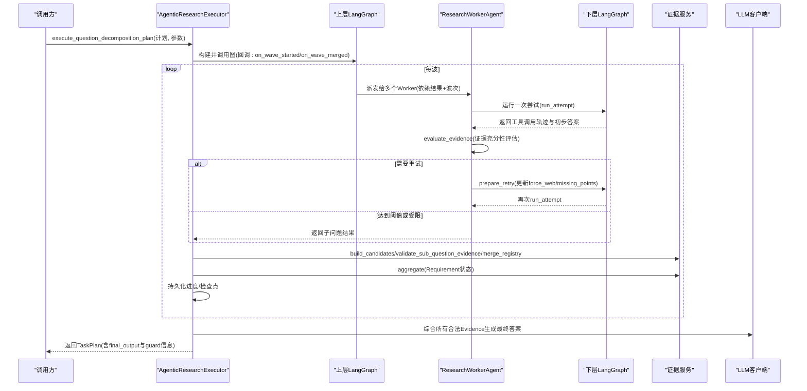
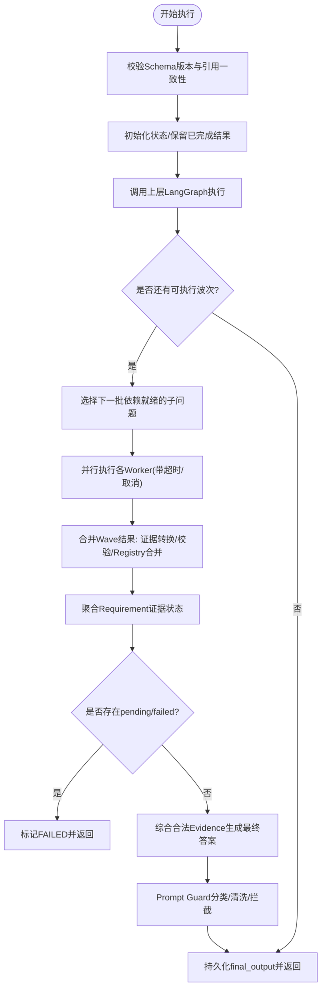
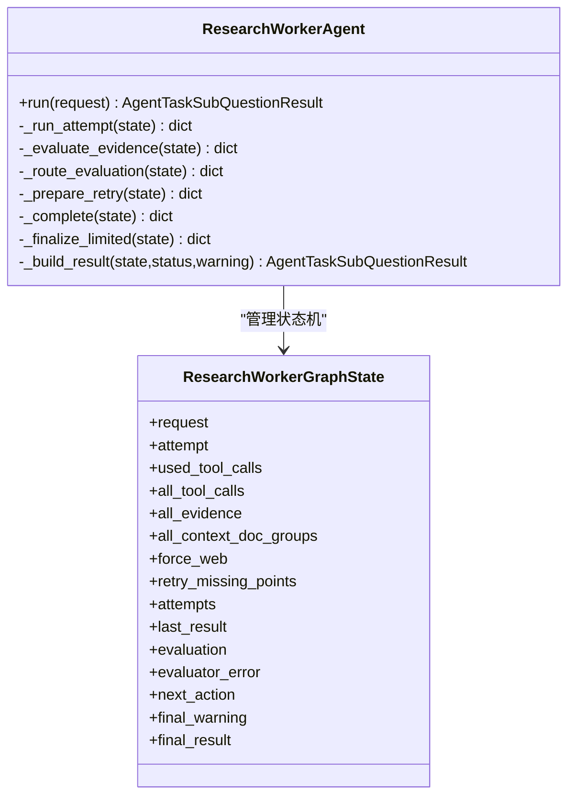
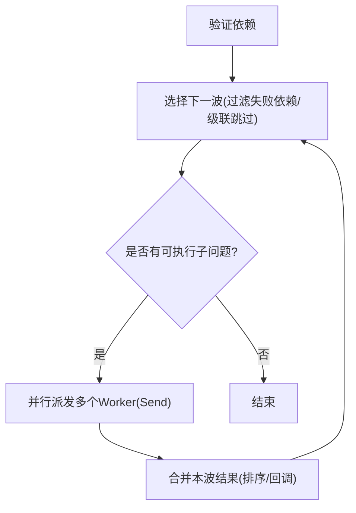
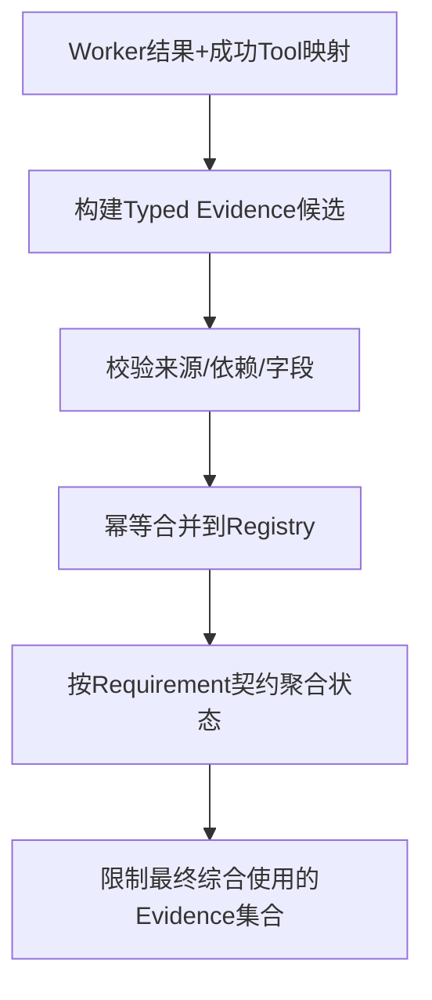
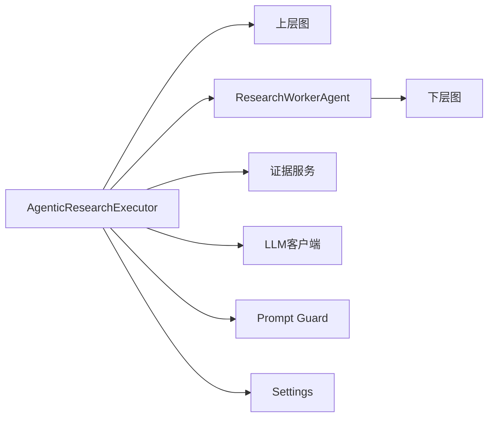

# 研究服务

<cite>
**本文引用的文件**
- [agentic_research_executor.py](file://python-agent-study/src/fast_app/services/research/agentic_research_executor.py)
- [research_worker_agent.py](file://python-agent-study/src/fast_app/services/research/research_worker_agent.py)
- [research_task_plan.py](file://python-agent-study/src/fast_app/domain/research_task_plan.py)
- [agentic_research_graph.py](file://python-agent-study/src/fast_app/graph/research/agentic_research_graph.py)
- [research_worker_graph.py](file://python-agent-study/src/fast_app/graph/research/research_worker_graph.py)
- [requirement_evidence_service.py](file://python-agent-study/src/fast_app/services/research/requirement_evidence_service.py)
</cite>

## 目录
1. [简介](#简介)
2. [项目结构](#项目结构)
3. [核心组件](#核心组件)
4. [架构总览](#架构总览)
5. [详细组件分析](#详细组件分析)
6. [依赖关系分析](#依赖关系分析)
7. [性能与并发特性](#性能与并发特性)
8. [故障排查指南](#故障排查指南)
9. [结论](#结论)
10. [附录：使用指南与扩展建议](#附录使用指南与扩展建议)

## 简介
本文件面向开发者，系统化说明“复杂研究任务”的自动分解、并行执行、证据评估与结构化报告生成机制。重点解释 AgenticResearchExecutor 与 ResearchWorkerAgent 的职责边界、协作模式、错误处理与可恢复性设计；并提供研究流程图、任务分解策略与质量评估机制说明，帮助快速上手和二次开发。

## 项目结构
研究服务围绕“计划-执行-评估-综合”的主线组织：
- 领域模型集中在 domain.research_task_plan，定义 TaskPlan、Requirement、SubQuestion、Evidence、进度与检查点等。
- 调度层在 graph.research，用 LangGraph 实现按依赖波次的并行派发与合并。
- 执行层在 services.research，包含 AgenticResearchExecutor（波次调度与最终综合）、ResearchWorkerAgent（单子问题工具循环与证据评估）。
- 证据契约与聚合由 requirement_evidence_service 提供，保证证据来源可信、幂等合并与 Requirement 级状态判定。

图表来源
- [agentic_research_graph.py:111-276](file://python-agent-study/src/fast_app/graph/research/agentic_research_graph.py#L111-L276)
- [research_worker_graph.py:45-79](file://python-agent-study/src/fast_app/graph/research/research_worker_graph.py#L45-L79)
- [agentic_research_executor.py:57-519](file://python-agent-study/src/fast_app/services/research/agentic_research_executor.py#L57-L519)
- [research_worker_agent.py:61-121](file://python-agent-study/src/fast_app/services/research/research_worker_agent.py#L61-L121)
- [research_task_plan.py:787-800](file://python-agent-study/src/fast_app/domain/research_task_plan.py#L787-L800)
- [requirement_evidence_service.py:41-183](file://python-agent-study/src/fast_app/services/research/requirement_evidence_service.py#L41-L183)

章节来源
- [agentic_research_graph.py:111-276](file://python-agent-study/src/fast_app/graph/research/agentic_research_graph.py#L111-L276)
- [research_worker_graph.py:45-79](file://python-agent-study/src/fast_app/graph/research/research_worker_graph.py#L45-L79)
- [agentic_research_executor.py:57-519](file://python-agent-study/src/fast_app/services/research/agentic_research_executor.py#L57-L519)
- [research_worker_agent.py:61-121](file://python-agent-study/src/fast_app/services/research/research_worker_agent.py#L61-L121)
- [research_task_plan.py:787-800](file://python-agent-study/src/fast_app/domain/research_task_plan.py#L787-L800)
- [requirement_evidence_service.py:41-183](file://python-agent-study/src/fast_app/services/research/requirement_evidence_service.py#L41-L183)

## 核心组件
- AgenticResearchExecutor：负责 v2 ResearchTaskPlan 的波次调度、证据合并、Requirement 聚合、最终答案合成与安全输出控制。
- ResearchWorkerAgent：封装单个子问题的研究循环，包括工具调用、证据评估、重试决策与结果收敛。
- 研究图（LangGraph）：上层图按依赖计算波次并扇出 Worker；下层图为单 Worker 的“尝试-评估-路由-重试/完成”状态机。
- 证据服务：将工具产出转换为 Typed Evidence，进行来源溯源校验、Registry 幂等合并，并按 Requirement 契约计算满足状态。
- 领域模型：统一描述 TaskPlan、Requirement、SubQuestion、Evidence、进度事件与检查点，贯穿全链路。

章节来源
- [agentic_research_executor.py:57-519](file://python-agent-study/src/fast_app/services/research/agentic_research_executor.py#L57-L519)
- [research_worker_agent.py:61-121](file://python-agent-study/src/fast_app/services/research/research_worker_agent.py#L61-L121)
- [agentic_research_graph.py:111-276](file://python-agent-study/src/fast_app/graph/research/agentic_research_graph.py#L111-L276)
- [research_worker_graph.py:45-79](file://python-agent-study/src/fast_app/graph/research/research_worker_graph.py#L45-L79)
- [requirement_evidence_service.py:41-183](file://python-agent-study/src/fast_app/services/research/requirement_evidence_service.py#L41-L183)
- [research_task_plan.py:787-800](file://python-agent-study/src/fast_app/domain/research_task_plan.py#L787-L800)

## 架构总览
研究服务采用“编排-执行-评估-综合”的分层架构：
- 编排层（AgenticResearchExecutor + 上层图）：解析计划、计算依赖波次、限制并发、收集结果、合并证据、评估 Requirement、生成最终答案。
- 执行层（ResearchWorkerAgent + 下层图）：对每个子问题驱动工具循环，基于证据评估器决定重试或收敛，维护内部检查点。
- 数据层（领域模型 + 证据服务）：以 Typed Evidence 为唯一事实源，严格校验来源与契约，支持幂等合并与可恢复快照。

图表来源
- [agentic_research_executor.py:86-519](file://python-agent-study/src/fast_app/services/research/agentic_research_executor.py#L86-L519)
- [agentic_research_graph.py:111-276](file://python-agent-study/src/fast_app/graph/research/agentic_research_graph.py#L111-L276)
- [research_worker_agent.py:83-121](file://python-agent-study/src/fast_app/services/research/research_worker_agent.py#L83-L121)
- [research_worker_graph.py:45-79](file://python-agent-study/src/fast_app/graph/research/research_worker_graph.py#L45-L79)
- [requirement_evidence_service.py:41-183](file://python-agent-study/src/fast_app/services/research/requirement_evidence_service.py#L41-L183)

## 详细组件分析

### AgenticResearchExecutor：波次调度与最终综合
- 职责
  - 校验并初始化 v2 ResearchTaskPlan，清理未完成任务，保留已完成子问题结果。
  - 通过上层 LangGraph 按依赖计算波次，限制最大并行 Worker 数。
  - 在每个 Wave 结束后，调用证据服务将 Worker 产出转换为 Typed Evidence，进行合法性校验与 Registry 幂等合并。
  - 聚合 Requirement 证据状态，若存在 pending/failed 则终止并标记失败；否则进入最终综合。
  - 最终答案经 Prompt Guard 分类与清洗/拦截后写入 final_output。
- 关键流程
  - 进度事件与检查点：通过 append_progress_event/save_worker_checkpoint 将 Worker 阶段、ToolCall、Evidence 摘要持久化到 TaskPlan 快照。
  - 超时与取消：对 Worker 设置超时，捕获超时转为 WORKER_TIMEOUT；周期性同步取消状态，避免继续外部调用。
  - 派生子问题：当 information_source_hint=none 且存在依赖时，仅基于依赖结果进行综合，不调用外部 Tool。
- 输出
  - 返回完整 ResearchTaskPlan，包含 sub_question_results、evidence_registry、requirement_evidence_statuses、progress、worker_checkpoints 与 final_output。

图表来源
- [agentic_research_executor.py:86-519](file://python-agent-study/src/fast_app/services/research/agentic_research_executor.py#L86-L519)
- [agentic_research_graph.py:131-251](file://python-agent-study/src/fast_app/graph/research/agentic_research_graph.py#L131-L251)

章节来源
- [agentic_research_executor.py:86-519](file://python-agent-study/src/fast_app/services/research/agentic_research_executor.py#L86-L519)

### ResearchWorkerAgent：单子问题研究与纠正循环
- 职责
  - 为每个子问题维护独立 LangGraph 状态机，驱动工具调用、证据评估与重试。
  - 根据评估器推荐动作决定是否强制 Web、改写本地查询或结合两者。
  - 维护 attempt、used_tool_calls、all_evidence、attempts 等上下文，确保有限预算内收敛。
- 工作流
  - run_attempt：调用 ResearchToolLoop 执行一次尝试，累积工具调用与证据。
  - evaluate_evidence：调用证据评估器，记录评估结果与错误。
  - route_evaluation：依据 verdict/confidence/recommended_action 路由到 complete/retry/limited。
  - prepare_retry：根据 missing_points 与 web_policy 准备下一次尝试。
  - finalize_limited：当达到预算或受限，产出 partial/failed 结果。
- 输出
  - 返回 AgentTaskSubQuestionResult，包含 status、answer、tool_calls、evidence、evaluation、warnings、error_code 等。

图表来源
- [research_worker_agent.py:61-121](file://python-agent-study/src/fast_app/services/research/research_worker_agent.py#L61-L121)
- [research_worker_graph.py:18-37](file://python-agent-study/src/fast_app/graph/research/research_worker_graph.py#L18-L37)

章节来源
- [research_worker_agent.py:83-464](file://python-agent-study/src/fast_app/services/research/research_worker_agent.py#L83-L464)
- [research_worker_graph.py:45-79](file://python-agent-study/src/fast_app/graph/research/research_worker_graph.py#L45-L79)

### 上层图：依赖波次与并行派发
- 依赖校验：拒绝重复 ID、缺失依赖与循环依赖。
- 波次选择：基于已完成结果动态计算下一批可并行子问题，考虑失败依赖的级联跳过。
- 扇出与合并：使用 Send 并行派发 Worker，结果通过 operator.add 安全汇总；合并阶段排序以保证稳定展示。
- 取消保护：每次派发前检查 should_stop，避免取消后继续外部调用。

图表来源
- [agentic_research_graph.py:56-108](file://python-agent-study/src/fast_app/graph/research/agentic_research_graph.py#L56-L108)
- [agentic_research_graph.py:131-251](file://python-agent-study/src/fast_app/graph/research/agentic_research_graph.py#L131-L251)

章节来源
- [agentic_research_graph.py:56-108](file://python-agent-study/src/fast_app/graph/research/agentic_research_graph.py#L56-L108)
- [agentic_research_graph.py:131-251](file://python-agent-study/src/fast_app/graph/research/agentic_research_graph.py#L131-L251)

### 证据契约与聚合：Requirement 级质量评估
- 证据转换：将 ToolLoop 产出的 legacy evidence 转换为 Typed Evidence（knowledge_chunk/web_citation/sql_query_result/derived_synthesis），并进行字段校验。
- 来源溯源：校验 Evidence 的 source_type 必须来自成功调用的 Tool；派生证据需匹配 depends_on 且前置 SubQuestion 已终态。
- Registry 幂等合并：同 ID 不同内容视为损坏并报错。
- Requirement 聚合：按 source_policy(mode=all_of/any_of/none)、expected_evidence(minimum_count/required_attributes) 计算 satisfied/partially_satisfied/pending/failed，并区分 security_blocked。
- 最终综合约束：仅允许使用被 Requirement 接受的合法 Evidence，并在部分满足时明确说明限制。

图表来源
- [requirement_evidence_service.py:41-183](file://python-agent-study/src/fast_app/services/research/requirement_evidence_service.py#L41-L183)
- [requirement_evidence_service.py:185-348](file://python-agent-study/src/fast_app/services/research/requirement_evidence_service.py#L185-L348)

章节来源
- [requirement_evidence_service.py:41-183](file://python-agent-study/src/fast_app/services/research/requirement_evidence_service.py#L41-L183)
- [requirement_evidence_service.py:185-348](file://python-agent-study/src/fast_app/services/research/requirement_evidence_service.py#L185-L348)

### 领域模型要点
- TaskPlan v2：固定 schema_version=2，task_kind=question_decomposition，包含 requirements、sub_questions、policy、progress、evidence_registry、worker_checkpoints、final_output。
- Requirement：source_policy(mode/source_types)、expected_evidence(evidence_type/minimum_count/required_attributes/requires_query_id)、completion_policy(strict/allow_partial)。
- SubQuestion：order、depends_on、covers_requirement_ids、information_source_hint、web_usage。
- EvidenceRef：类型化字段约束（如 sql_query_result 必须 query_id、web_citation 必须 HTTP(S) URL）。
- Progress/Checkpoint：公开安全的 stage、active_operations、tool_call_count、evidence_count，以及内部 tool_calls/evidence 摘要用于超时恢复。

章节来源
- [research_task_plan.py:142-213](file://python-agent-study/src/fast_app/domain/research_task_plan.py#L142-L213)
- [research_task_plan.py:216-244](file://python-agent-study/src/fast_app/domain/research_task_plan.py#L216-L244)
- [research_task_plan.py:299-359](file://python-agent-study/src/fast_app/domain/research_task_plan.py#L299-L359)
- [research_task_plan.py:631-784](file://python-agent-study/src/fast_app/domain/research_task_plan.py#L631-L784)
- [research_task_plan.py:787-800](file://python-agent-study/src/fast_app/domain/research_task_plan.py#L787-L800)

## 依赖关系分析
- 耦合与内聚
  - Executor 与图解耦：Executor 只传入回调，图仅负责编排；提高可测试性与复用性。
  - Worker 与工具解耦：通过 ResearchToolLoop 抽象工具调用，便于替换与扩展。
  - 证据服务独立：不感知具体工具，仅基于契约与来源映射进行校验与聚合。
- 外部依赖
  - LLM 客户端：用于最终综合与派生综合；兼容 langchain_config 注入。
  - Prompt Guard：对最终输出进行分类、清洗或拦截。
  - 配置 Settings：控制超时、最大工具调用次数、最大并行 Worker 数、纠正轮次等。
- 潜在循环依赖
  - 代码中通过回调与函数式组合避免循环；图节点之间单向流转，无环。

图表来源
- [agentic_research_executor.py:57-519](file://python-agent-study/src/fast_app/services/research/agentic_research_executor.py#L57-L519)
- [research_worker_agent.py:61-121](file://python-agent-study/src/fast_app/services/research/research_worker_agent.py#L61-L121)
- [agentic_research_graph.py:111-276](file://python-agent-study/src/fast_app/graph/research/agentic_research_graph.py#L111-L276)
- [research_worker_graph.py:45-79](file://python-agent-study/src/fast_app/graph/research/research_worker_graph.py#L45-L79)

章节来源
- [agentic_research_executor.py:57-519](file://python-agent-study/src/fast_app/services/research/agentic_research_executor.py#L57-L519)
- [research_worker_agent.py:61-121](file://python-agent-study/src/fast_app/services/research/research_worker_agent.py#L61-L121)

## 性能与并发特性
- 并行度控制
  - max_parallel_workers：限制每波并发 Worker 数量，避免外部工具过载。
  - 依赖波次：按 Kahn 算法计算波次，保证依赖正确性的前提下最大化并行。
- 资源预算
  - agent_research_max_tool_calls_per_worker：限制单个 Worker 的工具调用次数。
  - agent_research_max_correction_rounds：限制纠正轮次，防止无限重试。
  - agent_research_worker_timeout_seconds：防止长尾阻塞。
- 成本优化
  - force_web：仅在评估器建议或策略要求时启用 WebSearch，减少不必要的外部调用。
  - 派生综合：对于 information_source_hint=none 的子问题，直接基于依赖结果综合，避免额外检索。
- 可观测性
  - progress.events 与 worker_checkpoints：记录阶段、操作、工具调用计数与证据计数，便于定位瓶颈。

[本节为通用性能讨论，无需特定文件引用]

## 故障排查指南
- 常见错误码与含义
  - WORKER_TIMEOUT：Worker 在返回完整结果前超时；查看 checkpoint 中的 last_tool_name 与 active_operations。
  - DEPENDENCY_FAILED：前置子问题失败导致当前子问题跳过；检查依赖链路与上游错误码。
  - REQUIREMENT_EVIDENCE_INSUFFICIENT：Requirement 未达契约；查看 missing_source_types 与 reason_codes。
  - TOOL_PERMISSION_DENIED/NL2SQL_PERMISSION_DENIED/PROMPT_INJECTION_BLOCKED/AGENT_TASK_SOURCE_UNAVAILABLE：安全或权限阻断；检查用户上下文与策略。
- 定位步骤
  - 查看 plan.progress.workers 中对应 sub_question 的 stage、active_operations、tool_call_count、evidence_count。
  - 查看 plan.worker_checkpoints 中的 tool_calls 与 evidence 摘要，确认最后完成的工具与证据。
  - 查看 plan.requirement_evidence_statuses 中每个 Requirement 的 satisfied/missing 与 reason_codes。
  - 若最终答案被拦截，查看 final_output.guard_action 与 guard_reason_codes。
- 恢复与重试
  - 支持 resume：保留 completed 子问题结果，清空未完成项与检查点，重新执行。
  - 调整策略：放宽 web_policy、提升 top_k/candidate_k、降低 min_score、增加 max_tool_calls_per_worker 或 correction rounds。

章节来源
- [agentic_research_executor.py:228-250](file://python-agent-study/src/fast_app/services/research/agentic_research_executor.py#L228-L250)
- [agentic_research_executor.py:443-508](file://python-agent-study/src/fast_app/services/research/agentic_research_executor.py#L443-L508)
- [requirement_evidence_service.py:236-284](file://python-agent-study/src/fast_app/services/research/requirement_evidence_service.py#L236-L284)
- [research_task_plan.py:631-784](file://python-agent-study/src/fast_app/domain/research_task_plan.py#L631-L784)

## 结论
该研究服务以“Typed Evidence + Requirement 契约”为核心，实现了复杂研究任务的可靠分解、可控并行、可恢复执行与结构化输出。通过上层图的依赖波次调度与下层图的纠正循环，系统在准确性、可观测性与安全性之间取得平衡。开发者可基于现有接口扩展工具、评估器与策略，快速定制研究流程。

[本节为总结性内容，无需特定文件引用]

## 附录：使用指南与扩展建议
- 使用流程
  - 创建 v2 ResearchTaskPlan：定义 requirements、sub_questions、policy 与 filters。
  - 调用 AgenticResearchExecutor.execute_question_decomposition_plan：传入 settings、llm_client、task_plan_store、worker_agent 及可选 prompt_guard/evidence_service。
  - 监控进度：订阅/轮询 plan.progress.events 与 worker_checkpoints。
  - 获取结果：读取 plan.final_output.answer、evidence_ids、used_tools、warnings、guard_action。
- 自定义研究工具
  - 在 ResearchToolLoop 中注册新工具，并确保其返回符合 Legacy Evidence 结构的摘要。
  - 在 requirement_evidence_service._TOOL_SOURCE/_EVIDENCE_SOURCE 中映射 source_type 与 evidence_type。
  - 在 EvidenceRef 校验逻辑中补充字段约束（如新增证据类型的 required_attributes）。
- 结果分析方法
  - 按 Requirement 维度分析 satisfied/partially_satisfied/failed，结合 missing_source_types 定位缺口。
  - 按 SubQuestion 维度分析 tool_calls 与 evidence，识别低效工具或不足证据。
  - 结合 progress.events 的时间序列，定位耗时环节与失败路径。
- 最佳实践
  - 合理设置 web_policy 与 dataset_scope，避免不必要的网络调用。
  - 使用 derived_synthesis 减少对外部工具的依赖，提升稳定性。
  - 利用 checkpoint 与 resume 能力，增强长任务鲁棒性。

[本节为通用指导，无需特定文件引用]