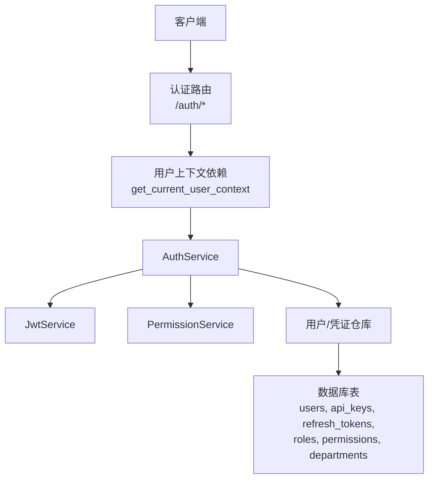
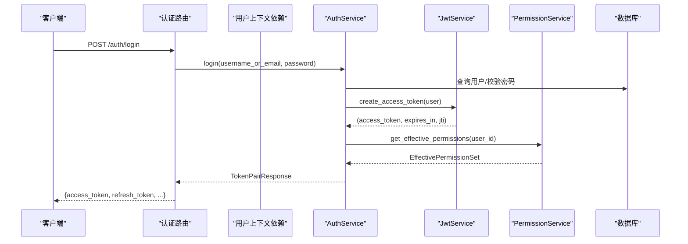
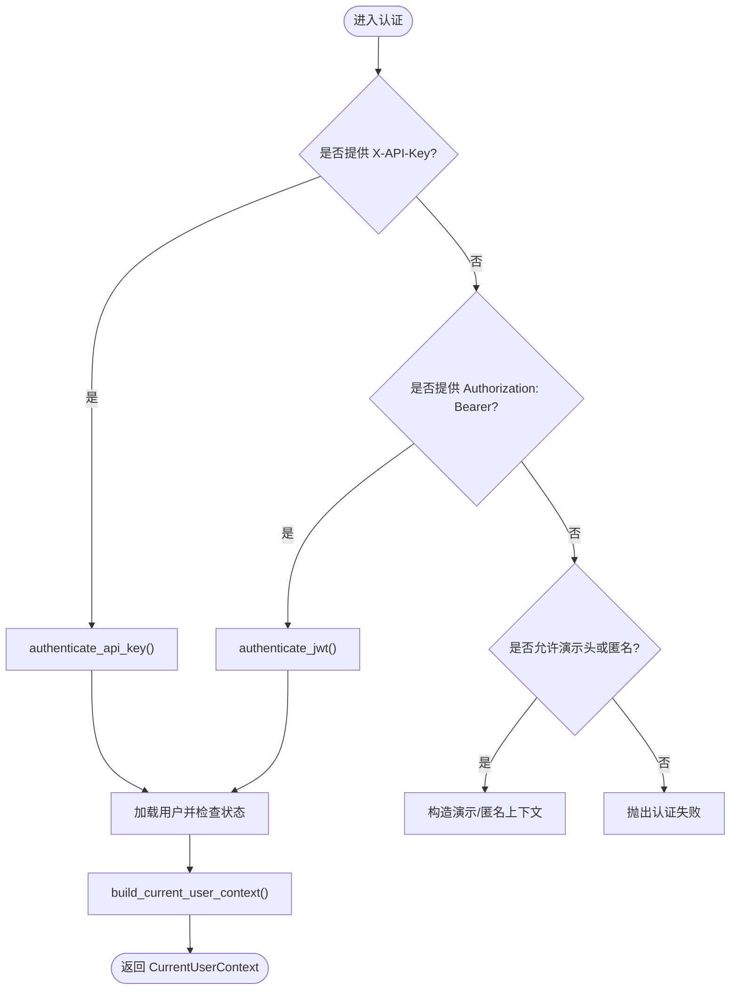
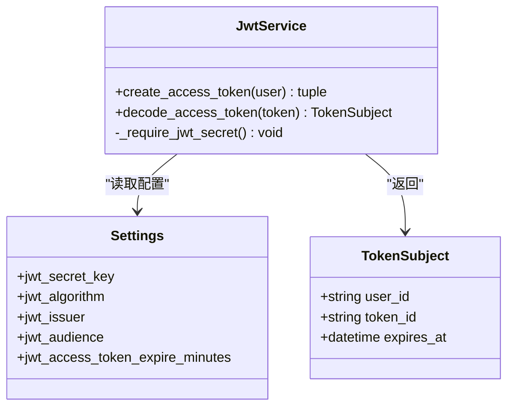
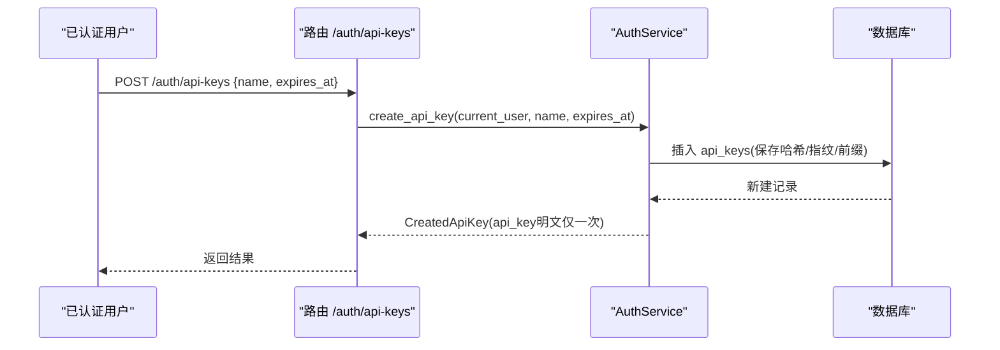
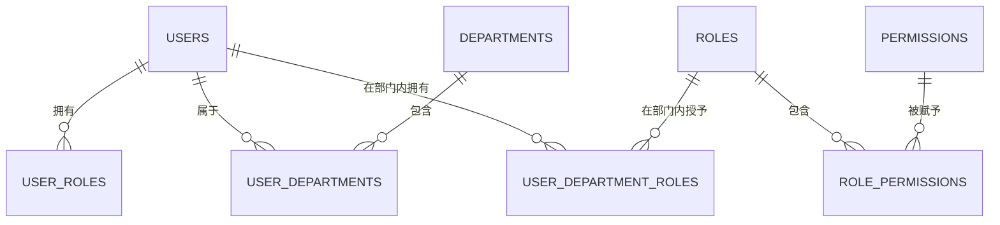
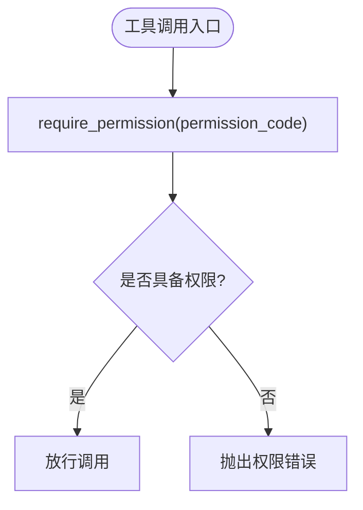
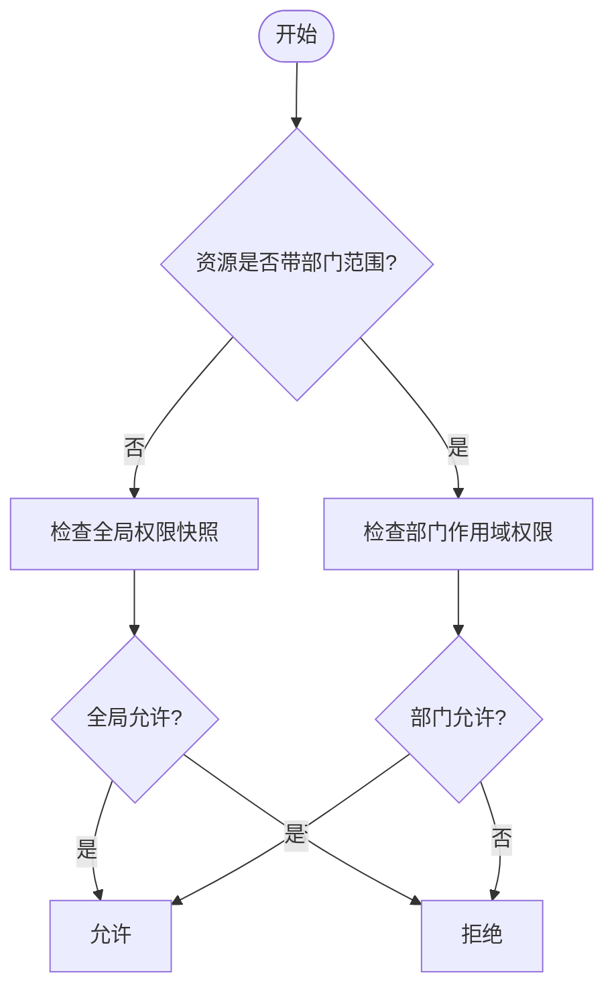
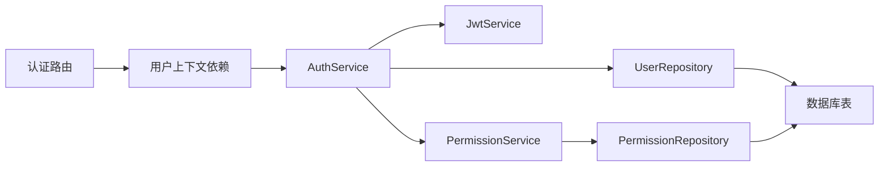

# 认证授权服务

<cite>
**本文引用的文件**
- [auth_routes.py](file://python-agent-study/src/fast_app/api/auth_routes.py)
- [auth_service.py](file://python-agent-study/src/fast_app/services/auth/auth_service.py)
- [jwt_service.py](file://python-agent-study/src/fast_app/services/auth/jwt_service.py)
- [permission_service.py](file://python-agent-study/src/fast_app/services/auth/permission_service.py)
- [user_context.py](file://python-agent-study/src/fast_app/domain/user_context.py)
- [user_context_dependency.py](file://python-agent-study/src/fast_app/dependencies/user_context.py)
- [auth_models.py](file://python-agent-study/src/fast_app/domain/auth_models.py)
- [auth_tables.py](file://python-agent-study/src/fast_app/db/auth_tables.py)
</cite>

## 目录
1. [简介](#简介)
2. [项目结构](#项目结构)
3. [核心组件](#核心组件)
4. [架构总览](#架构总览)
5. [详细组件分析](#详细组件分析)
6. [依赖关系分析](#依赖关系分析)
7. [性能与安全考虑](#性能与安全考虑)
8. [故障排查指南](#故障排查指南)
9. [结论](#结论)
10. [附录：集成与配置指南](#附录：集成与配置指南)

## 简介
本文件面向开发者，系统化说明认证授权服务的职责、流程与设计。重点覆盖：
- JWT 认证流程（登录、刷新、鉴权）
- API Key 管理机制（创建、校验、撤销）
- RBAC 权限控制模型（全局角色/权限 + 部门级作用域）
- AuthService、JwtService、PermissionService 的职责划分与协作
- 用户上下文获取、部门级 ACL 权限检查、工具调用权限验证
- 认证流程图、权限决策树与安全策略设计
- 集成指南、权限配置方法与最佳实践

## 项目结构
认证授权相关代码按“路由层 -> 依赖注入 -> 服务层 -> 领域模型 -> 数据表”分层组织：
- 路由层：暴露 /auth 接口，负责参数校验与响应封装
- 依赖注入：统一解析请求头中的 X-API-Key、Authorization、演示头，产出 CurrentUserContext
- 服务层：AuthService 编排认证流程；JwtService 处理 JWT；PermissionService 计算有效权限
- 领域模型：AuthUser、CurrentUserContext、TokenSubject、ApiKeyCredential 等
- 数据表：users、api_keys、refresh_tokens、roles、permissions、departments、user_roles、role_permissions、user_department_roles 等

图表来源
- [auth_routes.py:22-108](file://python-agent-study/src/fast_app/api/auth_routes.py#L22-L108)
- [user_context_dependency.py:16-62](file://python-agent-study/src/fast_app/dependencies/user_context.py#L16-L62)
- [auth_service.py:35-52](file://python-agent-study/src/fast_app/services/auth/auth_service.py#L35-L52)
- [jwt_service.py:13-17](file://python-agent-study/src/fast_app/services/auth/jwt_service.py#L13-L17)
- [permission_service.py:11-15](file://python-agent-study/src/fast_app/services/auth/permission_service.py#L11-L15)
- [auth_tables.py:13-431](file://python-agent-study/src/fast_app/db/auth_tables.py#L13-L431)

章节来源
- [auth_routes.py:22-108](file://python-agent-study/src/fast_app/api/auth_routes.py#L22-L108)
- [user_context_dependency.py:16-62](file://python-agent-study/src/fast_app/dependencies/user_context.py#L16-L62)
- [auth_service.py:35-52](file://python-agent-study/src/fast_app/services/auth/auth_service.py#L35-L52)
- [jwt_service.py:13-17](file://python-agent-study/src/fast_app/services/auth/jwt_service.py#L13-L17)
- [permission_service.py:11-15](file://python-agent-study/src/fast_app/services/auth/permission_service.py#L11-L15)
- [auth_tables.py:13-431](file://python-agent-study/src/fast_app/db/auth_tables.py#L13-L431)

## 核心组件
- AuthService：认证业务编排者，负责登录、刷新、API Key 认证、JWT 认证、构建当前用户上下文、签发 token pair、权限快照装配。
- JwtService：JWT access token 的签发与解码，包含算法、签发者、受众、过期时间、类型校验等。
- PermissionService：从 RBAC 表加载并合并全局角色/权限与部门作用域权限，输出 EffectivePermissionSet。
- CurrentUserContext：跨链路传递的统一用户上下文，携带认证来源、全局角色/权限快照、部门范围、展示信息等。
- 领域模型与数据表：AuthUser、ApiKeyCredential、RefreshTokenRecord、TokenSubject、JwtTokenPair 以及对应的持久化表。

章节来源
- [auth_service.py:35-327](file://python-agent-study/src/fast_app/services/auth/auth_service.py#L35-L327)
- [jwt_service.py:13-89](file://python-agent-study/src/fast_app/services/auth/jwt_service.py#L13-L89)
- [permission_service.py:11-64](file://python-agent-study/src/fast_app/services/auth/permission_service.py#L11-L64)
- [user_context.py:6-55](file://python-agent-study/src/fast_app/domain/user_context.py#L6-L55)
- [auth_models.py:9-158](file://python-agent-study/src/fast_app/domain/auth_models.py#L9-L158)
- [auth_tables.py:13-431](file://python-agent-study/src/fast_app/db/auth_tables.py#L13-L431)

## 架构总览
认证授权采用“入口依赖解析 -> 服务编排 -> 权限计算 -> 上下文透传”的分层架构。所有业务接口通过 FastAPI 依赖注入获取 CurrentUserContext，再基于该上下文进行资源访问控制与审计。

图表来源
- [auth_routes.py:22-33](file://python-agent-study/src/fast_app/api/auth_routes.py#L22-L33)
- [auth_service.py:75-90](file://python-agent-study/src/fast_app/services/auth/auth_service.py#L75-L90)
- [jwt_service.py:19-46](file://python-agent-study/src/fast_app/services/auth/jwt_service.py#L19-L46)
- [permission_service.py:17-50](file://python-agent-study/src/fast_app/services/auth/permission_service.py#L17-L50)
- [auth_tables.py:13-431](file://python-agent-study/src/fast_app/db/auth_tables.py#L13-L431)

## 详细组件分析

### 认证流程与用户上下文
- 登录：校验用户名/邮箱与密码，更新最后登录时间，签发 access_token 与 refresh_token，返回 TokenPair。
- 刷新：校验 refresh_token hash、状态与过期时间，标记使用并撤销旧凭证，重新签发 token pair。
- API Key 认证：指纹匹配、哈希校验、状态与过期检查，加载用户并构建上下文，记录最近使用时间。
- JWT 认证：解码 access_token，校验类型与必要声明，加载用户并构建上下文。
- 上下文构建：合并全局角色/权限快照与部门范围，生成 CurrentUserContext。

图表来源
- [user_context_dependency.py:16-62](file://python-agent-study/src/fast_app/dependencies/user_context.py#L16-L62)
- [auth_service.py:114-170](file://python-agent-study/src/fast_app/services/auth/auth_service.py#L114-L170)
- [auth_service.py:236-267](file://python-agent-study/src/fast_app/services/auth/auth_service.py#L236-L267)

章节来源
- [auth_routes.py:22-108](file://python-agent-study/src/fast_app/api/auth_routes.py#L22-L108)
- [user_context_dependency.py:16-62](file://python-agent-study/src/fast_app/dependencies/user_context.py#L16-L62)
- [auth_service.py:75-170](file://python-agent-study/src/fast_app/services/auth/auth_service.py#L75-L170)
- [auth_service.py:236-267](file://python-agent-study/src/fast_app/services/auth/auth_service.py#L236-L267)

### JWT 服务
- 签发：设置 sub、iss、aud、iat、exp、jti、typ=access，使用配置的密钥与算法编码。
- 解码：校验签名、issuer、audience、类型、必要字段，提取 user_id、token_id、expires_at。
- 安全：未配置密钥时拒绝使用；类型不匹配或缺少必要声明时报错。

图表来源
- [jwt_service.py:13-89](file://python-agent-study/src/fast_app/services/auth/jwt_service.py#L13-L89)
- [auth_models.py:114-129](file://python-agent-study/src/fast_app/domain/auth_models.py#L114-L129)

章节来源
- [jwt_service.py:13-89](file://python-agent-study/src/fast_app/services/auth/jwt_service.py#L13-L89)
- [auth_models.py:114-129](file://python-agent-study/src/fast_app/domain/auth_models.py#L114-L129)

### API Key 管理
- 创建：生成随机 key，计算前缀、指纹、哈希，持久化后仅一次返回明文 key。
- 列表：返回当前用户的 API Key 摘要（不含明文）。
- 撤销：仅允许撤销自己的 API Key。
- 认证：指纹查找、哈希比对、状态与过期检查，成功后记录 last_used_at。

图表来源
- [auth_routes.py:56-69](file://python-agent-study/src/fast_app/api/auth_routes.py#L56-L69)
- [auth_service.py:172-208](file://python-agent-study/src/fast_app/services/auth/auth_service.py#L172-L208)
- [auth_tables.py:322-368](file://python-agent-study/src/fast_app/db/auth_tables.py#L322-L368)

章节来源
- [auth_routes.py:56-108](file://python-agent-study/src/fast_app/api/auth_routes.py#L56-L108)
- [auth_service.py:172-234](file://python-agent-study/src/fast_app/services/auth/auth_service.py#L172-L234)
- [auth_tables.py:322-368](file://python-agent-study/src/fast_app/db/auth_tables.py#L322-L368)

### RBAC 权限模型与部门级 ACL
- 全局角色/权限：从 roles、permissions、role_permissions、user_roles 计算用户的全局角色与权限快照。
- 部门作用域：从 user_department_roles、user_departments、departments 计算用户在特定部门的角色与权限。
- 权限集合：PermissionService 合并全局与部门权限，输出 EffectivePermissionSet，供上层进行资源访问控制。
- 部门代码：DepartmentCode 用于稳定标识部门，避免中文名称变更影响权限判断。

图表来源
- [auth_tables.py:133-319](file://python-agent-study/src/fast_app/db/auth_tables.py#L133-L319)
- [auth_models.py:27-82](file://python-agent-study/src/fast_app/domain/auth_models.py#L27-L82)
- [permission_service.py:17-50](file://python-agent-study/src/fast_app/services/auth/permission_service.py#L17-L50)

章节来源
- [auth_tables.py:133-319](file://python-agent-study/src/fast_app/db/auth_tables.py#L133-L319)
- [auth_models.py:27-82](file://python-agent-study/src/fast_app/domain/auth_models.py#L27-L82)
- [permission_service.py:17-50](file://python-agent-study/src/fast_app/services/auth/permission_service.py#L17-L50)

### 工具调用权限验证
- 工具调用前需检查当前请求的 RBAC 全局权限快照，确保具备执行该工具的权限。
- 可使用 require_permission 快速校验，若缺失则抛出权限错误。
- 结合部门范围与工具元数据，可在更细粒度处实现“某工具仅在指定部门可用”。

图表来源
- [auth_service.py:314-323](file://python-agent-study/src/fast_app/services/auth/auth_service.py#L314-L323)
- [user_context.py:43-51](file://python-agent-study/src/fast_app/domain/user_context.py#L43-L51)

章节来源
- [auth_service.py:314-323](file://python-agent-study/src/fast_app/services/auth/auth_service.py#L314-L323)
- [user_context.py:43-51](file://python-agent-study/src/fast_app/domain/user_context.py#L43-L51)

### 权限决策树（概念图）

[此图为概念性决策流程，不直接映射具体源码]

## 依赖关系分析
- 路由依赖：auth_routes 通过 Depends(get_auth_service) 注入 AuthService，并通过 get_current_user_context 解析认证头。
- 服务依赖：AuthService 依赖 UserRepository、PermissionService、JwtService；PermissionService 依赖 PermissionRepository。
- 数据依赖：所有持久化操作通过 SQLAlchemy 表模型映射到数据库。

图表来源
- [auth_routes.py:1-17](file://python-agent-study/src/fast_app/api/auth_routes.py#L1-L17)
- [user_context_dependency.py:1-149](file://python-agent-study/src/fast_app/dependencies/user_context.py#L1-L149)
- [auth_service.py:35-52](file://python-agent-study/src/fast_app/services/auth/auth_service.py#L35-L52)
- [permission_service.py:11-15](file://python-agent-study/src/fast_app/services/auth/permission_service.py#L11-L15)
- [auth_tables.py:13-431](file://python-agent-study/src/fast_app/db/auth_tables.py#L13-L431)

章节来源
- [auth_routes.py:1-17](file://python-agent-study/src/fast_app/api/auth_routes.py#L1-L17)
- [user_context_dependency.py:1-149](file://python-agent-study/src/fast_app/dependencies/user_context.py#L1-L149)
- [auth_service.py:35-52](file://python-agent-study/src/fast_app/services/auth/auth_service.py#L35-L52)
- [permission_service.py:11-15](file://python-agent-study/src/fast_app/services/auth/permission_service.py#L11-L15)
- [auth_tables.py:13-431](file://python-agent-study/src/fast_app/db/auth_tables.py#L13-L431)

## 性能与安全考虑
- 性能
  - 认证路径尽量短：优先命中 API Key 或 JWT，减少分支。
  - 权限快照在认证阶段一次性计算并缓存于 CurrentUserContext，避免重复查询。
  - 数据库索引：users、api_keys、refresh_tokens、user_roles、role_permissions、user_department_roles 均有关键索引，提升查询效率。
- 安全
  - 密码与敏感凭证一律哈希存储，禁止明文落库。
  - JWT 必须配置密钥、算法、签发者与受众，类型严格限制为 access。
  - API Key 仅返回一次明文，后续仅能使用前缀与指纹识别。
  - Refresh Token 单次使用后撤销，防止重放攻击。
  - 禁用账号立即拒绝认证，避免越权。

章节来源
- [auth_tables.py:133-416](file://python-agent-study/src/fast_app/db/auth_tables.py#L133-L416)
- [jwt_service.py:19-85](file://python-agent-study/src/fast_app/services/auth/jwt_service.py#L19-L85)
- [auth_service.py:92-112](file://python-agent-study/src/fast_app/services/auth/auth_service.py#L92-L112)
- [auth_service.py:172-208](file://python-agent-study/src/fast_app/services/auth/auth_service.py#L172-L208)

## 故障排查指南
- 登录失败
  - 检查用户名/邮箱是否存在、密码是否正确、用户状态是否为 active。
  - 参考路径：登录校验与状态检查。
- 刷新失败
  - 检查 refresh token 是否存在、状态是否为 active、是否过期。
  - 参考路径：刷新流程与撤销逻辑。
- API Key 认证失败
  - 检查 header 是否传入、key 是否匹配指纹、哈希是否一致、状态与过期时间。
  - 参考路径：API Key 认证流程。
- JWT 校验失败
  - 检查密钥配置、算法、签发者、受众、类型是否为 access、是否缺少必要声明。
  - 参考路径：JWT 解码与校验。
- 权限不足
  - 检查当前用户是否具备所需全局权限或部门权限。
  - 参考路径：权限快照与 require_permission。

章节来源
- [auth_service.py:75-170](file://python-agent-study/src/fast_app/services/auth/auth_service.py#L75-L170)
- [jwt_service.py:48-85](file://python-agent-study/src/fast_app/services/auth/jwt_service.py#L48-L85)
- [auth_service.py:314-323](file://python-agent-study/src/fast_app/services/auth/auth_service.py#L314-L323)

## 结论
本认证授权服务以 CurrentUserContext 为核心，将认证协议细节与业务解耦，通过 RBAC 与部门级 ACL 实现细粒度权限控制。JWT 与 API Key 双通道认证满足 Web 与程序化访问场景，配合完善的审计字段与幂等刷新机制，兼顾安全性与可用性。建议在生产环境严格配置密钥、启用强认证策略，并结合业务需求扩展部门级权限与工具调用策略。

## 附录：集成与配置指南
- 集成步骤
  - 在路由中通过 Depends(get_current_user_context) 获取当前用户上下文。
  - 需要权限控制的接口调用 require_permission(permission_code) 进行校验。
  - 对敏感操作可结合部门范围与工具元数据进行二次校验。
- 权限配置方法
  - 在全局角色与权限表中定义系统能力，并在 user_roles、role_permissions 中为用户分配。
  - 在部门范围内通过 user_department_roles、user_departments 限定资源访问范围。
- 安全最佳实践
  - 强制 HTTPS，保护传输安全。
  - 定期轮换 JWT 密钥与 API Key，监控异常使用。
  - 最小权限原则：仅授予必要的角色与权限。
  - 审计日志：记录认证事件、权限决策与工具调用。

章节来源
- [user_context_dependency.py:16-62](file://python-agent-study/src/fast_app/dependencies/user_context.py#L16-L62)
- [auth_service.py:314-323](file://python-agent-study/src/fast_app/services/auth/auth_service.py#L314-L323)
- [auth_tables.py:133-319](file://python-agent-study/src/fast_app/db/auth_tables.py#L133-L319)