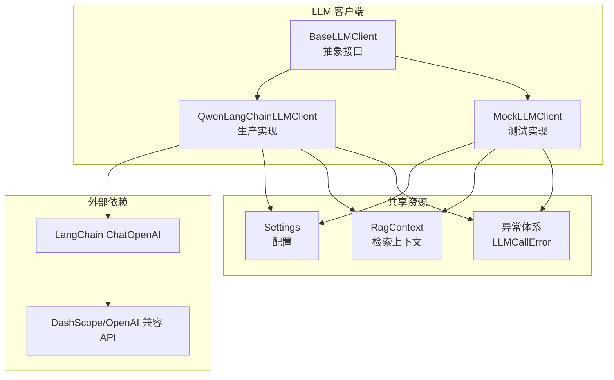
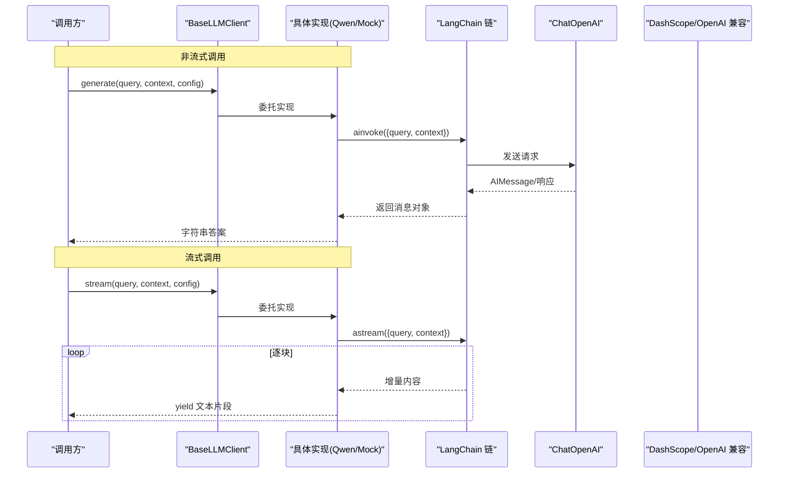
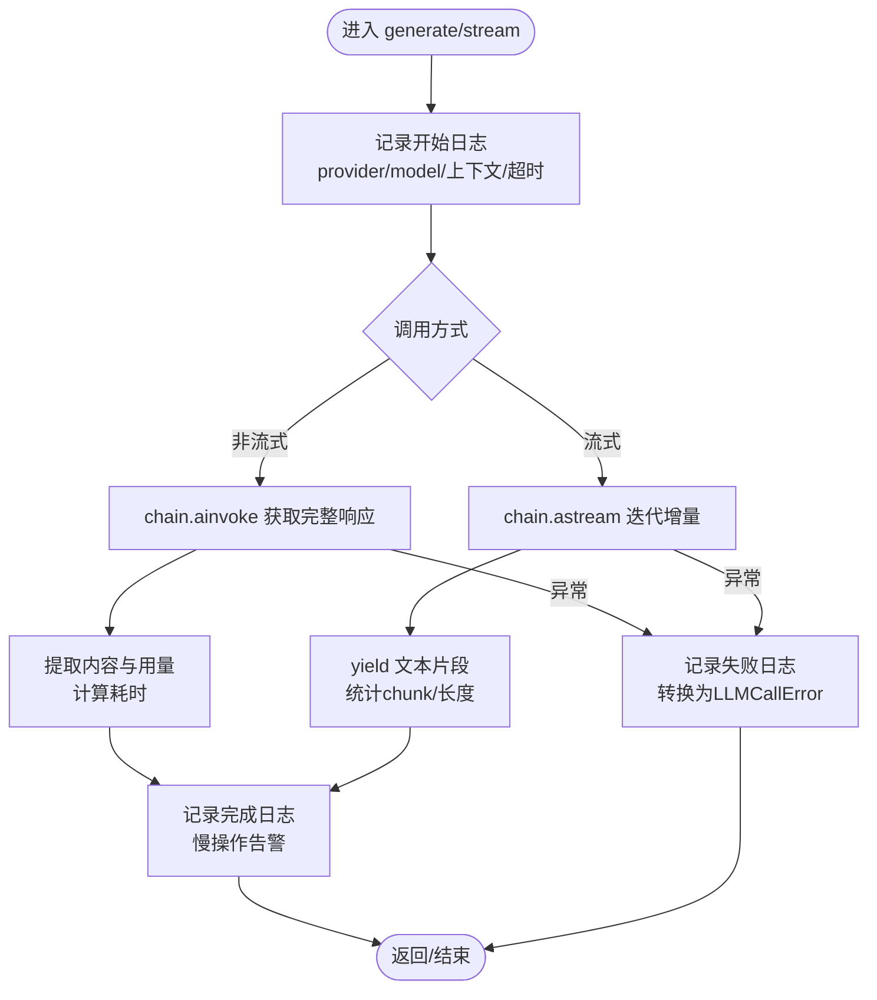
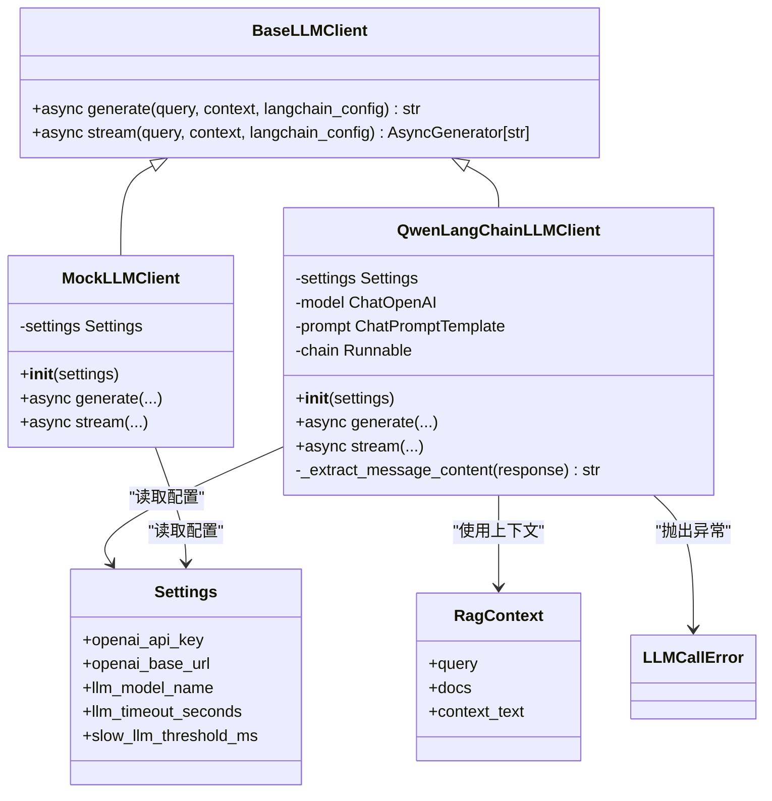

# LLM 客户端

<cite>
**本文引用的文件**
- [base.py](file://src/fast_app/components/llms/base.py)
- [qwen_langchain_llm_client.py](file://src/fast_app/components/llms/qwen_langchain_llm_client.py)
- [mock_llm_client.py](file://src/fast_app/components/llms/mock_llm_client.py)
- [config.py](file://src/fast_app/core/config.py)
- [rag_models.py](file://src/fast_app/domain/rag_models.py)
- [exceptions.py](file://src/fast_app/services/exceptions.py)
</cite>

## 目录
1. [简介](#简介)
2. [项目结构](#项目结构)
3. [核心组件](#核心组件)
4. [架构总览](#架构总览)
5. [详细组件分析](#详细组件分析)
6. [依赖关系分析](#依赖关系分析)
7. [性能与可靠性](#性能与可靠性)
8. [故障排查指南](#故障排查指南)
9. [结论](#结论)
10. [附录：自定义 LLM 客户端开发指南](#附录自定义-llm-客户端开发指南)

## 简介
本文件面向 LLM 客户端组件，系统性说明抽象接口、统一调用方式、流式响应处理、错误与重试策略、超时控制、配置项、连接与并发管理，以及与 LangChain 的集成方式。代码库提供了统一的 BaseLLMClient 抽象，并实现了 Qwen LangChain 客户端和 Mock 客户端，便于在开发与测试阶段无缝切换。

## 项目结构
LLM 客户端位于 fast_app/components/llms 目录下，采用“抽象 + 多实现”的结构：
- 抽象层：定义 generate 与 stream 两个异步方法，统一输入输出契约。
- 实现层：QwenLangChainLLMClient 对接 OpenAI 兼容接口（通过 DashScope），MockLLMClient 提供本地模拟行为。
- 数据模型：RagContext 作为检索上下文传入 LLM。
- 配置中心：Settings 集中管理模型名称、基地址、超时、慢操作阈值等。
- 异常体系：LLMCallError 等用于向上层暴露一致的错误语义。

图表来源
- [base.py:9-26](file://src/fast_app/components/llms/base.py#L9-L26)
- [qwen_langchain_llm_client.py:107-133](file://src/fast_app/components/llms/qwen_langchain_llm_client.py#L107-L133)
- [mock_llm_client.py:17-19](file://src/fast_app/components/llms/mock_llm_client.py#L17-L19)
- [config.py:230-238](file://src/fast_app/core/config.py#L230-L238)
- [rag_models.py:72-80](file://src/fast_app/domain/rag_models.py#L72-L80)
- [exceptions.py:144-148](file://src/fast_app/services/exceptions.py#L144-L148)

章节来源
- [base.py:9-26](file://src/fast_app/components/llms/base.py#L9-L26)
- [qwen_langchain_llm_client.py:107-133](file://src/fast_app/components/llms/qwen_langchain_llm_client.py#L107-L133)
- [mock_llm_client.py:17-19](file://src/fast_app/components/llms/mock_llm_client.py#L17-L19)
- [config.py:230-238](file://src/fast_app/core/config.py#L230-L238)
- [rag_models.py:72-80](file://src/fast_app/domain/rag_models.py#L72-L80)
- [exceptions.py:144-148](file://src/fast_app/services/exceptions.py#L144-L148)

## 核心组件
- BaseLLMClient：定义统一的异步生成与流式接口，要求所有实现提供 generate(query, context, langchain_config) 与 stream(query, context, langchain_config)。
- QwenLangChainLLMClient：基于 LangChain 的 ChatOpenAI 适配 DashScope 兼容端点，封装 Prompt 模板与链式调用，负责日志、慢操作告警、用量元数据提取与异常转换。
- MockLLMClient：不依赖网络，按字符粒度模拟流式输出，便于端到端联调与压测。
- RagContext：承载查询、检索文档列表与拼接后的上下文文本，是 LLM 调用的核心输入。
- Settings：集中管理模型名、基地址、API Key、超时、慢阈值等关键参数。
- 异常体系：LLMCallError 将底层 SDK 异常转换为一致的领域异常。

章节来源
- [base.py:9-26](file://src/fast_app/components/llms/base.py#L9-L26)
- [qwen_langchain_llm_client.py:107-133](file://src/fast_app/components/llms/qwen_langchain_llm_client.py#L107-L133)
- [mock_llm_client.py:17-19](file://src/fast_app/components/llms/mock_llm_client.py#L17-L19)
- [rag_models.py:72-80](file://src/fast_app/domain/rag_models.py#L72-L80)
- [config.py:230-238](file://src/fast_app/core/config.py#L230-L238)
- [exceptions.py:144-148](file://src/fast_app/services/exceptions.py#L144-L148)

## 架构总览
下图展示从上游调用到 LLM 客户端的完整链路，包括非流式与流式两种路径，以及日志、慢操作监控与异常转换。

图表来源
- [base.py:9-26](file://src/fast_app/components/llms/base.py#L9-L26)
- [qwen_langchain_llm_client.py:136-167](file://src/fast_app/components/llms/qwen_langchain_llm_client.py#L136-L167)
- [qwen_langchain_llm_client.py:241-279](file://src/fast_app/components/llms/qwen_langchain_llm_client.py#L241-L279)
- [mock_llm_client.py:21-78](file://src/fast_app/components/llms/mock_llm_client.py#L21-L78)
- [mock_llm_client.py:110-145](file://src/fast_app/components/llms/mock_llm_client.py#L110-L145)

## 详细组件分析

### 抽象接口 BaseLLMClient
- 职责：定义统一的异步生成与流式接口，屏蔽下游差异。
- 输入：query（用户问题）、context（RagContext，包含检索结果与上下文文本）、langchain_config（可选的 LangChain 运行配置）。
- 输出：generate 返回完整字符串；stream 返回异步生成器，逐块产出文本。
- 设计要点：
  - 使用 AsyncGenerator 支持流式消费，降低首字延迟。
  - 通过 RunnableConfig 透传追踪、限流等运行时能力。

章节来源
- [base.py:9-26](file://src/fast_app/components/llms/base.py#L9-L26)

### QwenLangChainLLMClient
- 初始化：
  - 校验 API Key 是否配置，缺失时抛出 LLMCallError。
  - 构建 ChatOpenAI 实例，使用 Settings 中的模型名、API Key、Base URL 与温度。
  - 构建 ChatPromptTemplate，注入 RAG 系统提示与人类提示，组合为 chain。
- 非流式 generate：
  - 记录开始日志（含 provider、model、查询长度、上下文长度、超时等）。
  - 通过 chain.ainvoke 发起调用，提取消息内容、用量元数据、耗时。
  - 记录完成日志与慢操作告警。
  - 捕获异常并转换为 LLMCallError。
- 流式 stream：
  - 通过 chain.astream 迭代增量内容，yield 文本片段。
  - 统计 chunk 数量与输出长度，记录完成日志与慢操作告警。
  - 捕获异常并转换为 LLMCallError。
- 防御性适配：
  - _extract_message_content 兼容 AIMessage 或任意带 content 属性的响应对象。

图表来源
- [qwen_langchain_llm_client.py:136-238](file://src/fast_app/components/llms/qwen_langchain_llm_client.py#L136-L238)
- [qwen_langchain_llm_client.py:241-340](file://src/fast_app/components/llms/qwen_langchain_llm_client.py#L241-L340)
- [qwen_langchain_llm_client.py:343-357](file://src/fast_app/components/llms/qwen_langchain_llm_client.py#L343-L357)

章节来源
- [qwen_langchain_llm_client.py:107-133](file://src/fast_app/components/llms/qwen_langchain_llm_client.py#L107-L133)
- [qwen_langchain_llm_client.py:136-238](file://src/fast_app/components/llms/qwen_langchain_llm_client.py#L136-L238)
- [qwen_langchain_llm_client.py:241-340](file://src/fast_app/components/llms/qwen_langchain_llm_client.py#L241-L340)
- [qwen_langchain_llm_client.py:343-357](file://src/fast_app/components/llms/qwen_langchain_llm_client.py#L343-L357)

### MockLLMClient
- 非流式 generate：
  - 模拟固定回答，包含对检索上下文的引用。
  - 记录开始/完成日志与慢操作告警。
- 流式 stream：
  - 按字符粒度模拟流式输出，间隔 sleep 以模拟网络延迟。
  - 统计 chunk 数量与输出长度，记录完成日志与慢操作告警。
- 适用场景：单元测试、端到端联调、性能基准测试。

章节来源
- [mock_llm_client.py:21-78](file://src/fast_app/components/llms/mock_llm_client.py#L21-L78)
- [mock_llm_client.py:110-145](file://src/fast_app/components/llms/mock_llm_client.py#L110-L145)

### 数据模型与配置
- RagContext：
  - query：实际参与回答的问题（可能经过改写）。
  - docs：检索到的文档列表。
  - context_text：拼接后传给 LLM 的上下文文本。
- Settings（与 LLM 相关的关键字段）：
  - openai_api_key、openai_base_url、llm_model_name：模型凭据与端点。
  - llm_timeout_seconds：单次 LLM 调用超时秒数。
  - slow_llm_threshold_ms：慢操作阈值，触发告警日志。
  - rag_use_mock：是否启用 Mock 模式（由上层决定选择哪个客户端）。

章节来源
- [rag_models.py:72-80](file://src/fast_app/domain/rag_models.py#L72-L80)
- [config.py:230-238](file://src/fast_app/core/config.py#L230-L238)
- [config.py:620-634](file://src/fast_app/core/config.py#L620-L634)

## 依赖关系分析
- 抽象与实现：BaseLLMClient 被 QwenLangChainLLMClient 与 MockLLMClient 继承实现。
- 外部依赖：QwenLangChainLLMClient 依赖 LangChain 的 ChatOpenAI，并通过 base_url 指向 DashScope 兼容端点。
- 配置依赖：两者均依赖 Settings 读取模型名、API Key、超时、慢阈值等。
- 异常依赖：QwenLangChainLLMClient 将底层异常转换为 LLMCallError，便于上层统一处理。

图表来源
- [base.py:9-26](file://src/fast_app/components/llms/base.py#L9-L26)
- [qwen_langchain_llm_client.py:107-133](file://src/fast_app/components/llms/qwen_langchain_llm_client.py#L107-L133)
- [mock_llm_client.py:17-19](file://src/fast_app/components/llms/mock_llm_client.py#L17-L19)
- [config.py:230-238](file://src/fast_app/core/config.py#L230-L238)
- [rag_models.py:72-80](file://src/fast_app/domain/rag_models.py#L72-L80)
- [exceptions.py:144-148](file://src/fast_app/services/exceptions.py#L144-L148)

章节来源
- [base.py:9-26](file://src/fast_app/components/llms/base.py#L9-L26)
- [qwen_langchain_llm_client.py:107-133](file://src/fast_app/components/llms/qwen_langchain_llm_client.py#L107-L133)
- [mock_llm_client.py:17-19](file://src/fast_app/components/llms/mock_llm_client.py#L17-L19)
- [config.py:230-238](file://src/fast_app/core/config.py#L230-L238)
- [rag_models.py:72-80](file://src/fast_app/domain/rag_models.py#L72-L80)
- [exceptions.py:144-148](file://src/fast_app/services/exceptions.py#L144-L148)

## 性能与可靠性
- 流式响应：
  - QwenLangChainLLMClient 使用 astream 逐块产出内容，显著降低首字延迟。
  - MockLLMClient 按字符粒度模拟流式，便于验证下游流式消费逻辑。
- 超时控制：
  - Settings.llm_timeout_seconds 提供统一超时配置，可在上层结合调用策略使用。
  - 当前实现未内置自动重试；建议在调用侧根据业务容忍度增加重试与熔断。
- 慢操作监控：
  - 通过 log_slow_operation 记录超过阈值的耗时，便于定位瓶颈。
- 并发与连接池：
  - 当前客户端未显式维护连接池；LangChain/HTTPX 内部会复用连接。
  - 高并发场景建议在上层限制并发度（如信号量或任务队列），避免瞬时打满下游。
- 重试机制：
  - 代码中未实现自动重试；可参考外部服务通用重试策略（指数退避、最大重试次数）在调用处封装。
- 用量与元数据：
  - generate 路径提取 token 用量与 finish_reason，便于成本与质量分析。

章节来源
- [qwen_langchain_llm_client.py:136-238](file://src/fast_app/components/llms/qwen_langchain_llm_client.py#L136-L238)
- [qwen_langchain_llm_client.py:241-340](file://src/fast_app/components/llms/qwen_langchain_llm_client.py#L241-L340)
- [config.py:620-634](file://src/fast_app/core/config.py#L620-L634)

## 故障排查指南
- 常见错误类型：
  - LLMCallError：表示大模型调用失败，通常由网络、鉴权或模型服务异常引起。
  - ExternalServiceTimeoutError：外部服务超时。
- 排查步骤：
  - 检查 Settings 中的 openai_api_key、openai_base_url、llm_model_name 是否正确。
  - 查看开始/完成/失败日志，确认 provider、model、上下文长度、耗时与错误类型。
  - 若为流式失败，关注 chunk_count 与 output_length，判断是否部分成功。
  - 调整 slow_llm_threshold_ms 观察慢请求分布。
  - 在高并发下，适当降低并发度或增加超时与重试上限。
- 恢复策略：
  - 对于临时不可用，可在调用侧增加重试与降级（例如切换到备用模型或返回兜底答案）。
  - 对于鉴权失败，优先刷新或更换 API Key。

章节来源
- [exceptions.py:144-154](file://src/fast_app/services/exceptions.py#L144-L154)
- [qwen_langchain_llm_client.py:205-238](file://src/fast_app/components/llms/qwen_langchain_llm_client.py#L205-L238)
- [qwen_langchain_llm_client.py:311-340](file://src/fast_app/components/llms/qwen_langchain_llm_client.py#L311-L340)

## 结论
该 LLM 客户端组件通过抽象接口统一了生成与流式调用，结合 LangChain 的链式编排，实现了清晰的日志、慢操作监控与异常转换。Qwen 实现面向生产环境，Mock 实现便于开发与测试。当前版本未内置重试与连接池管理，建议在上层根据业务需求补充，以获得更强的鲁棒性与可控的并发表现。

## 附录：自定义 LLM 客户端开发指南
- 接口适配：
  - 继承 BaseLLMClient，实现 generate 与 stream。
  - 保持输入输出与现有实现一致：query、RagContext、RunnableConfig。
- 认证处理：
  - 从 Settings 读取 API Key、Base URL、模型名等。
  - 在构造时校验必要凭据，缺失时抛出 LLMCallError。
- 流式处理：
  - 使用异步生成器逐块产出文本，确保下游可实时消费。
  - 统计 chunk 数量与输出长度，记录完成日志。
- 超时与重试：
  - 使用 Settings.llm_timeout_seconds 设置超时。
  - 在调用处封装重试策略（指数退避、最大重试次数、可重试错误分类）。
- 监控与可观测性：
  - 记录开始/完成/失败日志，包含 provider、model、上下文长度、耗时、错误类型。
  - 使用慢操作告警工具记录超阈值的耗时。
- 与 LangChain 集成最佳实践：
  - 使用 ChatPromptTemplate 组织 system/human 提示，便于版本化与回滚。
  - 通过 RunnableConfig 传递追踪、限流等运行时能力。
  - 对响应进行防御性解析，兼容不同 SDK 的返回结构。
- 连接池与并发：
  - 若底层 HTTP 客户端支持连接池，尽量复用实例。
  - 在上层通过并发控制（信号量、队列）限制并发度，避免下游过载。
- 测试与回归：
  - 使用 MockLLMClient 进行单元测试与端到端联调。
  - 针对流式与非流式分别编写用例，覆盖正常、超时、鉴权失败等场景。

章节来源
- [base.py:9-26](file://src/fast_app/components/llms/base.py#L9-L26)
- [qwen_langchain_llm_client.py:107-133](file://src/fast_app/components/llms/qwen_langchain_llm_client.py#L107-L133)
- [qwen_langchain_llm_client.py:136-238](file://src/fast_app/components/llms/qwen_langchain_llm_client.py#L136-L238)
- [qwen_langchain_llm_client.py:241-340](file://src/fast_app/components/llms/qwen_langchain_llm_client.py#L241-L340)
- [config.py:230-238](file://src/fast_app/core/config.py#L230-L238)
- [config.py:620-634](file://src/fast_app/core/config.py#L620-L634)
- [exceptions.py:144-154](file://src/fast_app/services/exceptions.py#L144-L154)