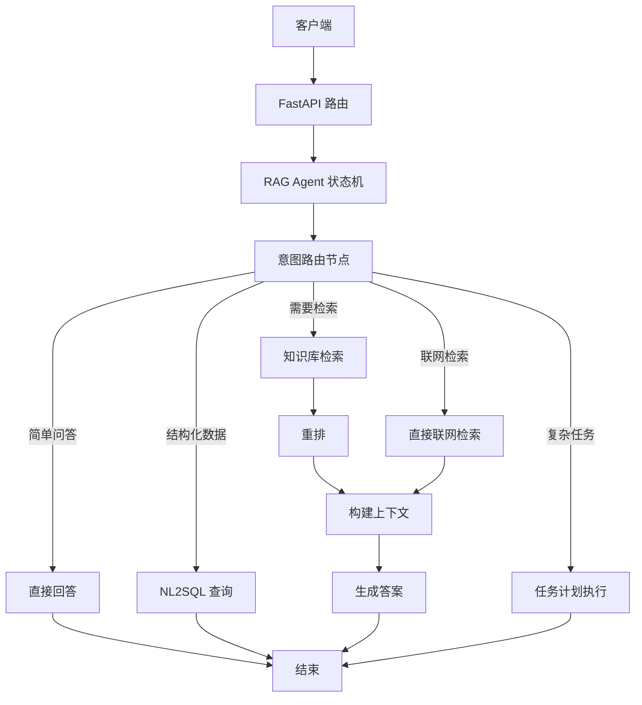
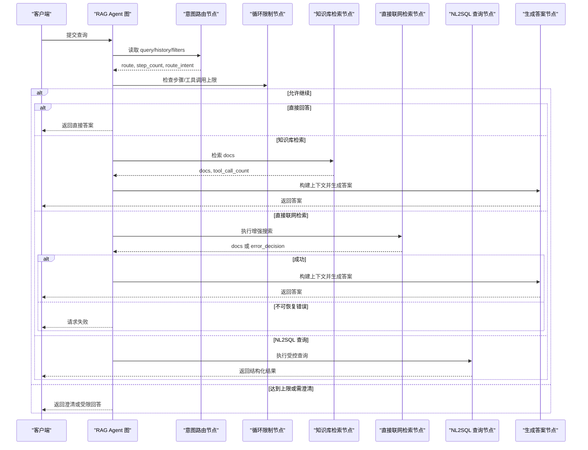
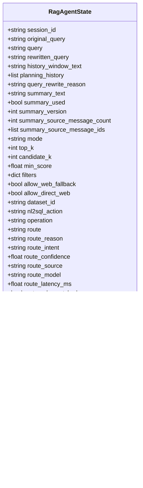
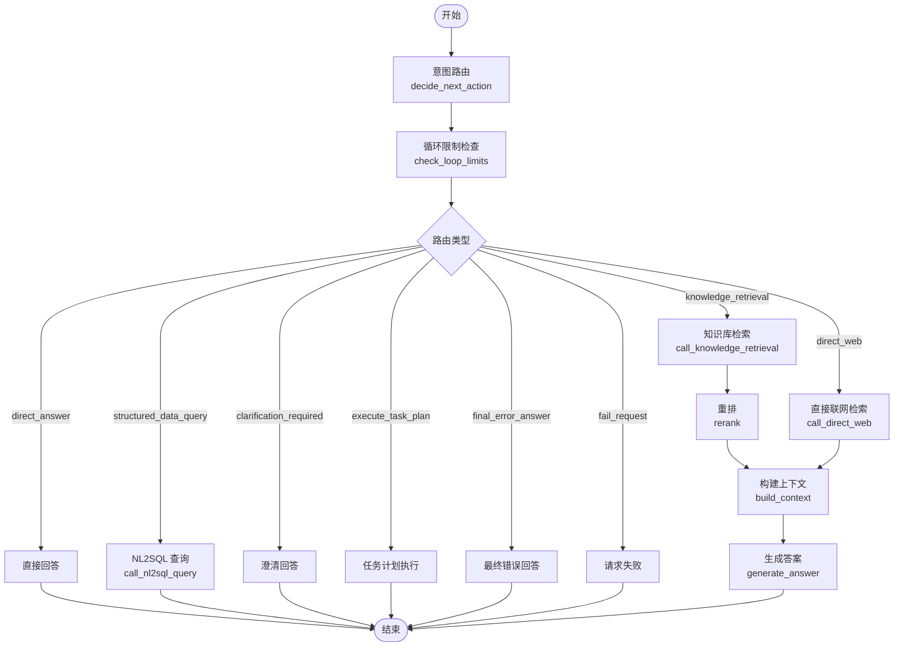
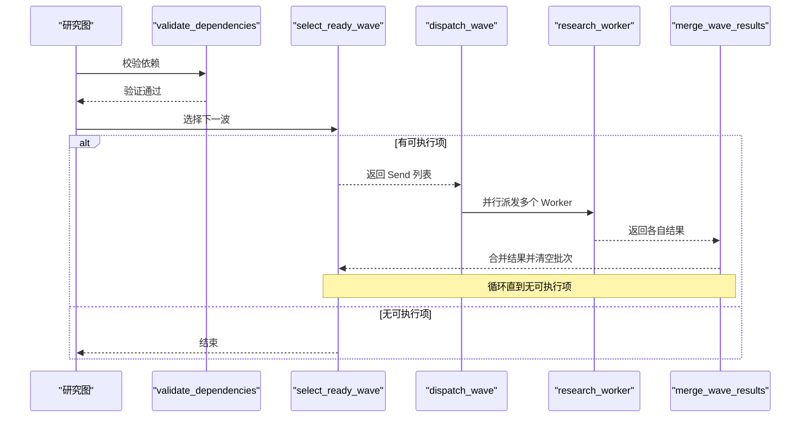
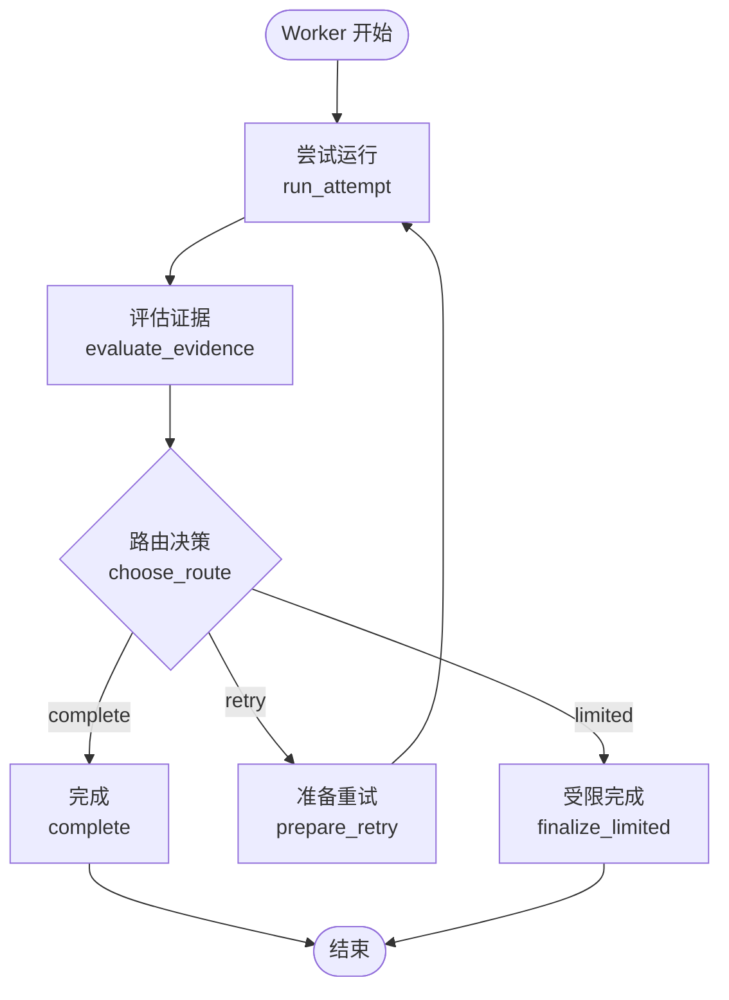
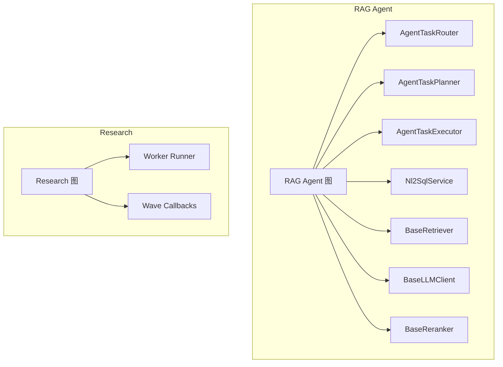

# LangGraph 状态机

<cite>
**本文引用的文件**
- [README.md](file://python-agent-study/README.md)
- [rag_agent_state.py](file://python-agent-study/src/fast_app/graph/rag_agent/rag_agent_state.py)
- [rag_agent_nodes.py](file://python-agent-study/src/fast_app/graph/rag_agent/rag_agent_nodes.py)
- [rag_agent_builder.py](file://python-agent-study/src/fast_app/graph/rag_agent/rag_agent_builder.py)
- [agentic_research_graph.py](file://python-agent-study/src/fast_app/graph/research/agentic_research_graph.py)
- [research_worker_graph.py](file://python-agent-study/src/fast_app/graph/research/research_worker_graph.py)
</cite>

## 目录
1. [简介](#简介)
2. [项目结构](#项目结构)
3. [核心组件](#核心组件)
4. [架构总览](#架构总览)
5. [详细组件分析](#详细组件分析)
6. [依赖关系分析](#依赖关系分析)
7. [性能考虑](#性能考虑)
8. [故障排查指南](#故障排查指南)
9. [结论](#结论)
10. [附录：自定义状态机开发指南](#附录自定义状态机开发指南)

## 简介
本仓库实现了一个面向企业知识场景的 RAG Agent 后端，使用 LangGraph 显式构建“RAG Agent”和“Agentic Research”两条主线。RAG Agent 负责意图路由、检索、结构化数据查询、直接联网检索与回答生成；Agentic Research 负责将复杂问题拆解为子问题，按依赖波次并行调度 Research Worker，并聚合证据与结果。文档聚焦于状态机设计模式、状态定义、节点函数、条件边、循环控制机制、错误恢复策略、调试方法与性能优化。

**章节来源**
- [README.md:29-67](file://python-agent-study/README.md#L29-L67)

## 项目结构
- FastAPI API 层接收请求后进入 RAG Agent Pipeline，再根据业务意图路由到不同分支。
- LangGraph 图由“状态 + 节点 + 条件边”组成，所有副作用集中在节点中，条件边仅做决策。
- Research 子图通过 Send 扇出多个独立 Worker，按依赖波次执行并合并结果。

**图表来源**
- [rag_agent_builder.py:56-199](file://python-agent-study/src/fast_app/graph/rag_agent/rag_agent_builder.py#L56-L199)
- [agentic_research_graph.py:111-276](file://python-agent-study/src/fast_app/graph/research/agentic_research_graph.py#L111-L276)

**章节来源**
- [README.md:99-124](file://python-agent-study/README.md#L99-L124)

## 核心组件
- RAG Agent 状态：集中承载用户输入、会话快照、检索参数、路由信息、工具调用计数、错误决策、最终答案等。
- RAG Agent 节点：意图路由、循环限制检查、知识库检索、NL2SQL 查询、直接联网检索、重排、上下文构建、答案生成、澄清回答、错误回答、请求失败等。
- RAG Agent 图：以 StateGraph 组装节点与边，START 进入 decide_next_action，经 check_loop_limits 分流到具体分支，最终汇聚到 END。
- Agentic Research 图：校验依赖、选择可执行波次、Send 扇出多个 Worker、合并结果、循环直到完成或取消。
- Research Worker 图：单个子问题的纠正循环，包含尝试运行、评估证据、路由决策、重试准备、完成或受限完成。

**章节来源**
- [rag_agent_state.py:16-203](file://python-agent-study/src/fast_app/graph/rag_agent/rag_agent_state.py#L16-L203)
- [rag_agent_builder.py:37-199](file://python-agent-study/src/fast_app/graph/rag_agent/rag_agent_builder.py#L37-L199)
- [agentic_research_graph.py:34-276](file://python-agent-study/src/fast_app/graph/research/agentic_research_graph.py#L34-L276)
- [research_worker_graph.py:18-79](file://python-agent-study/src/fast_app/graph/research/research_worker_graph.py#L18-L79)

## 架构总览
RAG Agent 的主线流程如下：
- 入口：START → decide_next_action（意图路由）
- 控制点：check_loop_limits（循环与工具调用上限）
- 分支：direct_answer / clarification_required / call_knowledge_retrieval / call_nl2sql_query / call_direct_web / execute_task_plan
- 成功路径：call_knowledge_retrieval → rerank → build_context → generate_answer → END
- 错误路径：final_error_answer / fail_request → END

Research 子图的主线流程如下：
- 入口：START → validate_dependencies → select_ready_wave
- 扇出：dispatch_wave（Send 多个 research_worker）
- 合并：merge_wave_results → select_ready_wave（循环）
- 终止：finish → END

**图表来源**
- [rag_agent_builder.py:140-199](file://python-agent-study/src/fast_app/graph/rag_agent/rag_agent_builder.py#L140-L199)
- [rag_agent_nodes.py:416-691](file://python-agent-study/src/fast_app/graph/rag_agent/rag_agent_nodes.py#L416-L691)
- [rag_agent_nodes.py:779-800](file://python-agent-study/src/fast_app/graph/rag_agent/rag_agent_nodes.py#L779-L800)

**章节来源**
- [rag_agent_builder.py:56-199](file://python-agent-study/src/fast_app/graph/rag_agent/rag_agent_builder.py#L56-L199)
- [rag_agent_nodes.py:416-800](file://python-agent-study/src/fast_app/graph/rag_agent/rag_agent_nodes.py#L416-L800)

## 详细组件分析

### RAG Agent 状态机
- 状态字段
  - 输入与上下文：session_id、original_query、query、rewritten_query、history_window_text、summary_text、mode、top_k、candidate_k、min_score、filters、allow_web_fallback、allow_direct_web、dataset_id、nl2sql_action
  - 路由与控制：route、route_reason、route_intent、route_confidence、route_source、route_model、route_latency_ms、route_rule_matched、clarification_required、clarification_code、clarification_question、step_count、tool_call_count、loop_decision、error_decision
  - 中间产物与输出：tool_name、tool_error、docs、context、nl2sql_result、answer、current_user、agent_task_plan、agent_task_plan_id、requires_confirmation、final_reason
- 初始状态构造：从 RagChatRequest 冻结会话与权限范围，统一初始化所有字段，避免跨请求共享状态。

**图表来源**
- [rag_agent_state.py:16-140](file://python-agent-study/src/fast_app/graph/rag_agent/rag_agent_state.py#L16-L140)
- [rag_agent_state.py:142-203](file://python-agent-study/src/fast_app/graph/rag_agent/rag_agent_state.py#L142-L203)

**章节来源**
- [rag_agent_state.py:16-203](file://python-agent-study/src/fast_app/graph/rag_agent/rag_agent_state.py#L16-L203)

### RAG Agent 节点与条件边
- 意图路由节点：decide_next_action
  - 读取 query、history、filters，调用 AgentTaskRouter 决定意图；必要时创建 TaskPlan；对 web_research 进行能力校验；对简单问题判断是否需要检索。
  - 输出 route、step_count、路由元信息。
- 循环限制节点：check_loop_limits
  - 基于配置计算最大步骤与工具调用次数；对 direct_answer 放宽工具上限；到达上限写入 error_decision 并进入 final_error_answer。
- 工具节点：
  - call_knowledge_retrieval：复用 agents/tools 的知识检索工具，产出 docs。
  - call_direct_web：执行增强联网检索，异常分类为 error_decision。
  - call_nl2sql_query：在已绑定 Dataset 下执行受控只读查询。
- 后续处理：
  - rerank：对 docs 重排。
  - build_context：组装提示词上下文，支持父块扩展与 Prompt Guard。
  - generate_answer：生成最终答案。
  - clarification_required：返回澄清问题。
  - final_error_answer / fail_request：错误收口。

**图表来源**
- [rag_agent_builder.py:56-199](file://python-agent-study/src/fast_app/graph/rag_agent/rag_agent_builder.py#L56-L199)
- [rag_agent_nodes.py:416-800](file://python-agent-study/src/fast_app/graph/rag_agent/rag_agent_nodes.py#L416-L800)

**章节来源**
- [rag_agent_builder.py:56-199](file://python-agent-study/src/fast_app/graph/rag_agent/rag_agent_builder.py#L56-L199)
- [rag_agent_nodes.py:88-800](file://python-agent-study/src/fast_app/graph/rag_agent/rag_agent_nodes.py#L88-L800)

### Agentic Research 图
- 状态：sub_questions、results（reducer 追加）、current_wave、batch_ids、max_parallel_workers。
- 节点：
  - validate_dependencies：校验重复 ID、缺失依赖、循环依赖。
  - select_ready_wave：根据已完成结果选择下一批可并行执行的子问题，支持级联跳过。
  - dispatch_wave：使用 Send 扇出多个 research_worker。
  - research_worker：执行单个子问题，返回结果并入全局 results。
  - merge_wave_results：收集当前波次结果，持久化进度并清空 batch_ids。
  - finish：无副作用终止。
- 循环：merge_wave_results → select_ready_wave，直到没有可执行项。

**图表来源**
- [agentic_research_graph.py:56-276](file://python-agent-study/src/fast_app/graph/research/agentic_research_graph.py#L56-L276)

**章节来源**
- [agentic_research_graph.py:34-276](file://python-agent-study/src/fast_app/graph/research/agentic_research_graph.py#L34-L276)

### Research Worker 图
- 状态：request、attempt、used_tool_calls、all_tool_calls、all_evidence、all_context_doc_groups、force_web、retry_missing_points、attempts、last_result、evaluation、evaluator_error、next_action、final_warning、final_result。
- 节点：run_attempt → evaluate_evidence → route_evaluation → choose_route → prepare_retry → complete / finalize_limited。
- 循环：prepare_retry → run_attempt，直到 complete 或 limited。

**图表来源**
- [research_worker_graph.py:18-79](file://python-agent-study/src/fast_app/graph/research/research_worker_graph.py#L18-L79)

**章节来源**
- [research_worker_graph.py:18-79](file://python-agent-study/src/fast_app/graph/research/research_worker_graph.py#L18-L79)

## 依赖关系分析
- RAG Agent 图依赖：
  - 外部服务：BaseRetriever、BaseLLMClient、BaseReranker、PromptGuardService、MarkdownParentContextExpander、AgentTaskRouter、AgentTaskPlanner、AgentTaskExecutor、Nl2SqlService、AgentTaskCapabilityService。
  - 内部模块：agents/tools、services/rag、services/nl2sql、domain/models、core/config、core/langsmith、core/latency、core/logging。
- Research 图依赖：
  - 回调：worker_runner、on_wave_started、on_wave_merged、should_stop。
  - 领域模型：ResearchTaskSubQuestion、AgentTaskSubQuestionResult。

**图表来源**
- [rag_agent_builder.py:37-51](file://python-agent-study/src/fast_app/graph/rag_agent/rag_agent_builder.py#L37-L51)
- [agentic_research_graph.py:111-122](file://python-agent-study/src/fast_app/graph/research/agentic_research_graph.py#L111-L122)

**章节来源**
- [rag_agent_builder.py:37-51](file://python-agent-study/src/fast_app/graph/rag_agent/rag_agent_builder.py#L37-L51)
- [agentic_research_graph.py:111-122](file://python-agent-study/src/fast_app/graph/research/agentic_research_graph.py#L111-L122)

## 性能考虑
- 并发与波次：Research 图通过 max_parallel_workers 限制每波并发度，避免外部工具过载；依赖解析保证最小等待时间。
- 重排与上下文：rerank 减少候选数量，build_context 控制上下文长度与来源，降低 LLM 成本与延迟。
- 循环限制：check_loop_limits 防止无限循环与过度工具调用，保障稳定性。
- 追踪与观测：每个节点使用 LangSmith 子 run 记录输入输出与耗时，便于定位瓶颈。
- 流式与事件：stream_events 提供结构化事件流，减少前端渲染压力。

[本节为通用指导，不直接分析具体文件]

## 故障排查指南
- 工具失败分类：工具节点捕获异常并分类为 AgentErrorDecision，区分可恢复与不可恢复错误；最终进入 final_error_answer 或 fail_request。
- 循环上限：当 step_count 或 tool_call_count 达到配置上限时，写入 error_decision 并停止执行。
- 依赖失败级联：Research 图中前置子问题失败会导致后续依赖的子问题被标记为 skipped，便于定位根因。
- 取消执行：should_stop 在派发前与 Worker 开始前检查，避免无效外部调用。
- 调试建议：
  - 查看 LangSmith trace 中的 step_index 与 run_name，确认节点顺序与耗时。
  - 检查 state 中的 route、route_reason、error_decision、final_reason，理解流转原因。
  - 关注 logs 中的 rag_agent_* 事件，快速定位失败分支。

**章节来源**
- [rag_agent_nodes.py:88-158](file://python-agent-study/src/fast_app/graph/rag_agent/rag_agent_nodes.py#L88-L158)
- [rag_agent_nodes.py:365-413](file://python-agent-study/src/fast_app/graph/rag_agent/rag_agent_nodes.py#L365-L413)
- [agentic_research_graph.py:131-189](file://python-agent-study/src/fast_app/graph/research/agentic_research_graph.py#L131-L189)

## 结论
该项目的 LangGraph 状态机以“状态驱动、节点纯函数、条件边决策”为核心原则，实现了 RAG Agent 与 Agentic Research 的可观察、可扩展、可恢复的执行框架。RAG Agent 通过意图路由与循环控制确保稳定与可控；Research 图通过依赖波次与并行 Worker 提升效率与鲁棒性。结合 LangSmith 追踪与结构化日志，便于调试与优化。

[本节为总结，不直接分析具体文件]

## 附录：自定义状态机开发指南
- 节点设计
  - 单一职责：每个节点只做一件事，如检索、重排、生成、路由。
  - 纯函数倾向：尽量不修改外部状态，仅返回 state 更新字典。
  - 错误分类：捕获异常并转换为统一的错误决策，便于统一收口。
- 状态管理
  - 明确状态字段：输入、中间产物、控制标志、输出；避免隐式共享。
  - 初始状态集中构造：在入口处一次性初始化，便于审计与测试。
  - 使用 reducer：对列表型状态使用 operator.add 安全合并。
- 调试方法
  - 使用 LangSmith 子 run 记录节点输入输出与耗时。
  - 在条件边与节点中记录 route_reason、error_decision、final_reason。
  - 利用 step_index 与 run_name 对齐多入口链路。
- 与业务服务集成
  - 通过依赖注入传入外部服务（检索器、LLM、重排器、NL2SQL 服务等）。
  - 保持图与业务解耦：图只编排，业务逻辑在服务层实现。
- 性能优化技巧
  - 限制并发：通过 max_parallel_workers 控制外部调用并发。
  - 减少上下文：rerank 与上下文构建控制 token 消耗。
  - 缓存与降级：对可缓存的结果进行缓存，对外部失败进行降级与 fallback。
  - 流式输出：优先使用 stream_events 提供结构化事件，提升用户体验。

[本节为通用指导，不直接分析具体文件]