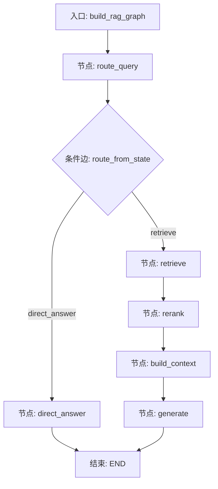
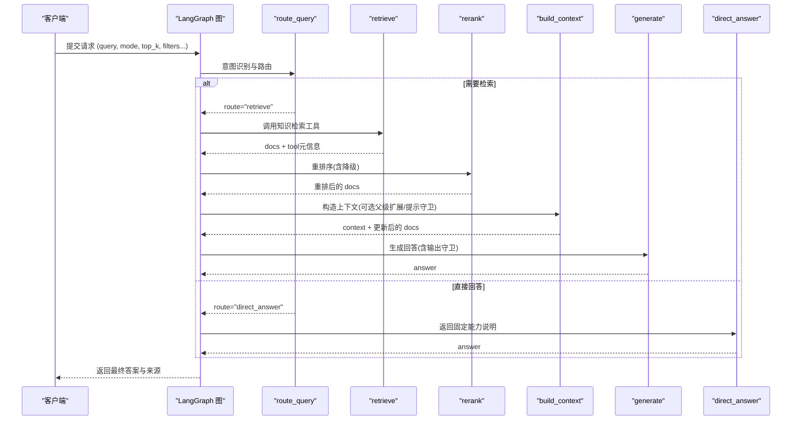
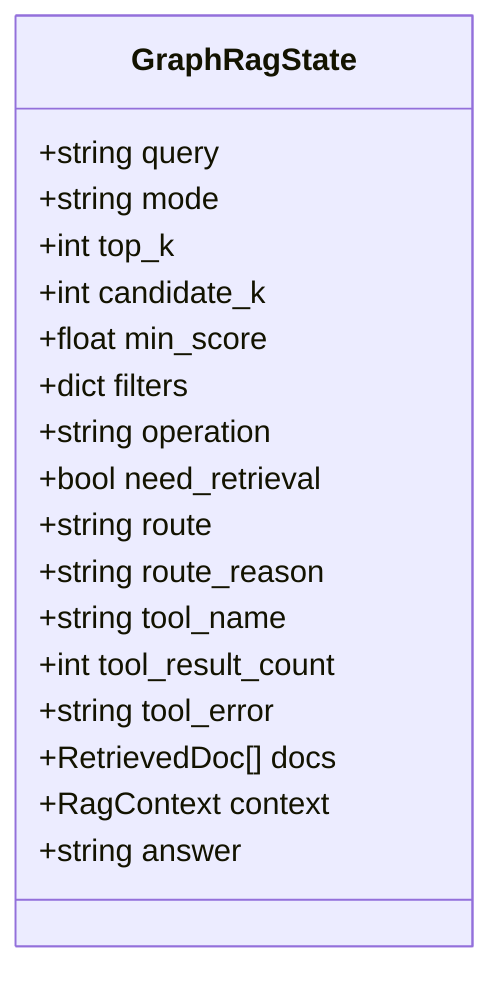
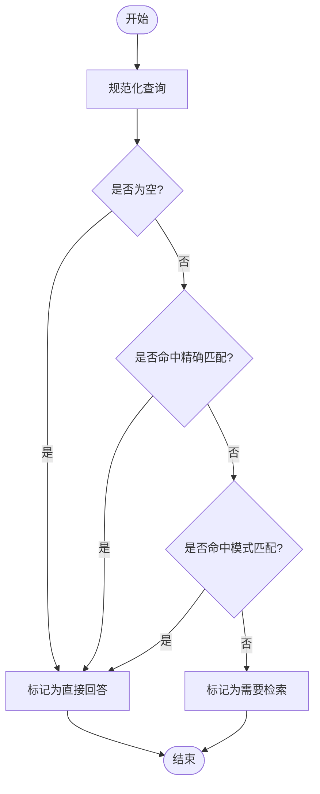
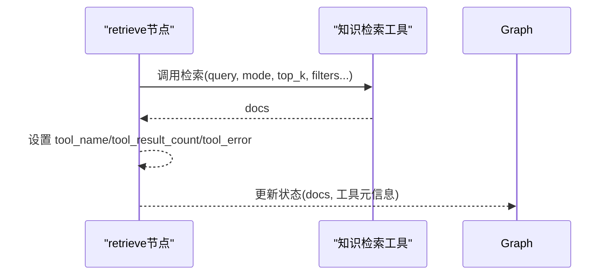
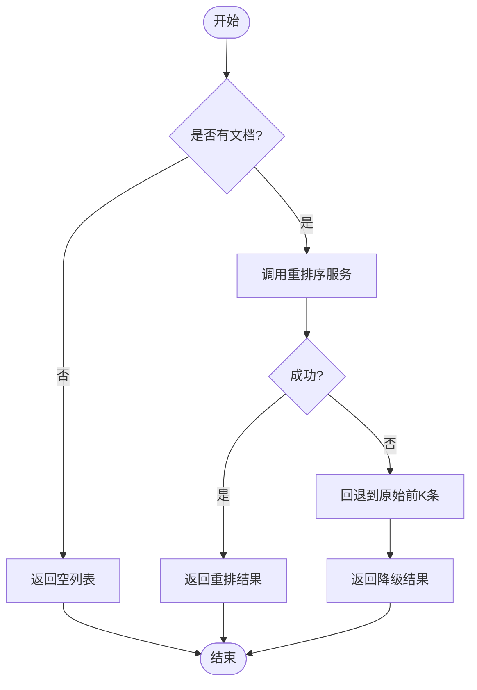
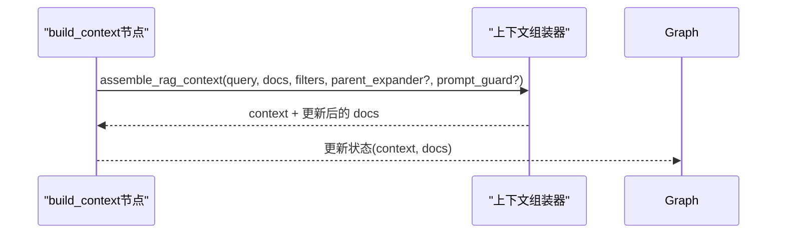
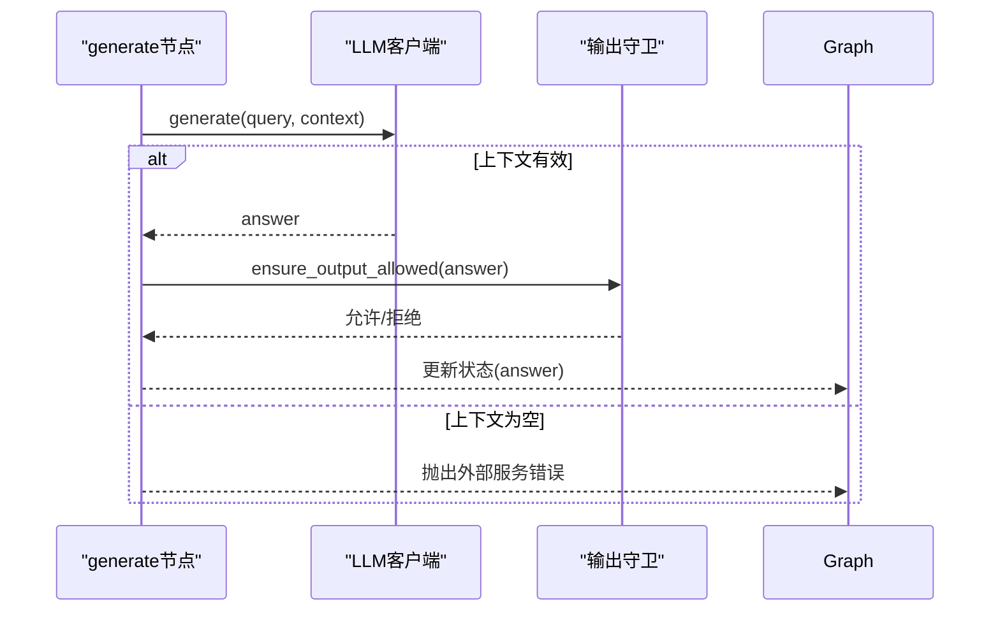
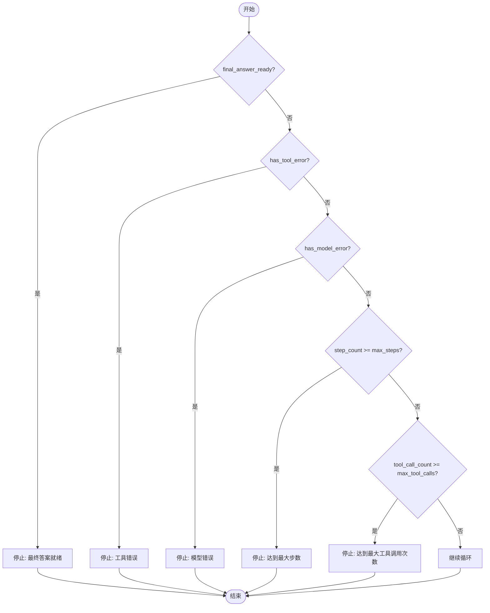
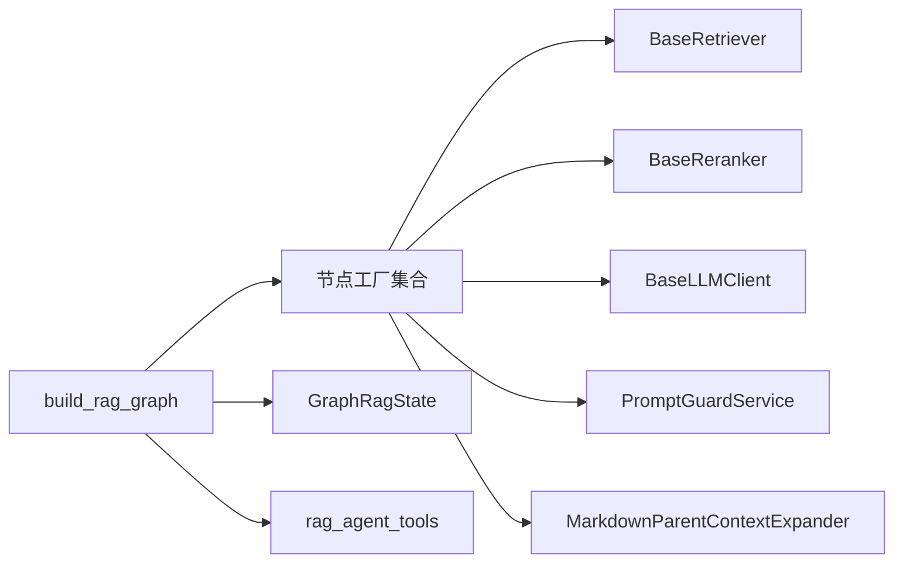

# RAG Agent 状态机

<cite>
**本文引用的文件**
- [rag_graph_builder.py](file://python-agent-study/src/fast_app/graph/rag/rag_graph_builder.py)
- [rag_graph_nodes.py](file://python-agent-study/src/fast_app/graph/rag/rag_graph_nodes.py)
- [rag_graph_state.py](file://python-agent-study/src/fast_app/graph/rag/rag_graph_state.py)
- [agent_loop_control.py](file://python-agent-study/src/fast_app/agents/runtime/agent_loop_control.py)
- [rag_agent_tools.py](file://python-agent-study/src/fast_app/agents/tools/rag_agent_tools.py)
</cite>

## 目录
1. [简介](#简介)
2. [项目结构](#项目结构)
3. [核心组件](#核心组件)
4. [架构总览](#架构总览)
5. [详细组件分析](#详细组件分析)
6. [依赖关系分析](#依赖关系分析)
7. [性能与并行策略](#性能与并行策略)
8. [故障恢复与错误处理](#故障恢复与错误处理)
9. [Agent 行为定制指南](#agent-行为定制指南)
10. [业务服务集成与监控追踪](#业务服务集成与监控追踪)
11. [结论](#结论)

## 简介
本文件面向 RAG Agent 主管道的状态机设计与实现，聚焦以下目标：
- 解释意图识别、任务路由、工具调用、结果聚合等关键节点的职责与数据流。
- 说明 RagAgentState（即 GraphRagState）状态模型字段含义与生命周期。
- 阐述循环控制机制、终止条件判断与最大步数/工具调用限制。
- 给出复杂工作流的状态流转图、并行执行策略与错误恢复机制。
- 提供 Agent 行为定制指南（节点扩展、工具集成、权限控制）。
- 说明与业务服务的集成方式以及监控追踪方法。

## 项目结构
RAG Agent 主管道基于 LangGraph 的 StateGraph 构建，核心文件位于 graph/rag 目录：
- 状态定义：GraphRagState 描述一次请求在图中的完整上下文。
- 节点工厂：route_query、retrieve、rerank、build_context、generate、direct_answer。
- 图构建：build_rag_graph 将节点与边组装为可运行图。
- 循环控制：AgentLoopLimits/AgentLoopSnapshot/should_continue_agent_loop 提供通用终止规则。
- 工具集成：通过 rag_agent_tools 暴露检索工具名称与调用封装。

图表来源
- [rag_graph_builder.py:21-89](file://python-agent-study/src/fast_app/graph/rag/rag_graph_builder.py#L21-L89)
- [rag_graph_nodes.py:162-202](file://python-agent-study/src/fast_app/graph/rag/rag_graph_nodes.py#L162-L202)
- [rag_graph_nodes.py:398-465](file://python-agent-study/src/fast_app/graph/rag/rag_graph_nodes.py#L398-L465)
- [rag_graph_nodes.py:247-386](file://python-agent-study/src/fast_app/graph/rag/rag_graph_nodes.py#L247-L386)
- [rag_graph_nodes.py:468-531](file://python-agent-study/src/fast_app/graph/rag/rag_graph_nodes.py#L468-L531)
- [rag_graph_nodes.py:534-589](file://python-agent-study/src/fast_app/graph/rag/rag_graph_nodes.py#L534-L589)

章节来源
- [rag_graph_builder.py:21-89](file://python-agent-study/src/fast_app/graph/rag/rag_graph_builder.py#L21-L89)
- [rag_graph_state.py:15-64](file://python-agent-study/src/fast_app/graph/rag/rag_graph_state.py#L15-L64)
- [rag_graph_nodes.py:162-202](file://python-agent-study/src/fast_app/graph/rag/rag_graph_nodes.py#L162-L202)
- [rag_graph_nodes.py:398-465](file://python-agent-study/src/fast_app/graph/rag/rag_graph_nodes.py#L398-L465)
- [rag_graph_nodes.py:247-386](file://python-agent-study/src/fast_app/graph/rag/rag_graph_nodes.py#L247-L386)
- [rag_graph_nodes.py:468-531](file://python-agent-study/src/fast_app/graph/rag/rag_graph_nodes.py#L468-L531)
- [rag_graph_nodes.py:534-589](file://python-agent-study/src/fast_app/graph/rag/rag_graph_nodes.py#L534-L589)

## 核心组件
- 状态模型 GraphRagState：承载用户输入、运行模式、检索参数、过滤条件、中间结果（docs/context/answer）、路由信息（route/route_reason）、工具元信息（tool_name/tool_result_count/tool_error）等。
- 节点集合：
  - route_query：意图识别与路由决策（是否需要检索）。
  - retrieve：知识检索工具调用，产出 docs 并记录工具元信息。
  - rerank：重排序，支持外部服务异常时的降级回退。
  - build_context：上下文组装，可选父级上下文扩展与提示词守卫。
  - generate：LLM 生成回答，支持输出守卫。
  - direct_answer：直接回答固定能力说明，跳过检索链路。
- 循环控制：AgentLoopLimits/AgentLoopSnapshot/should_continue_agent_loop 提供统一终止规则，防止无限循环。
- 图构建：build_rag_graph 将上述节点与边装配成可执行图。

章节来源
- [rag_graph_state.py:15-64](file://python-agent-study/src/fast_app/graph/rag/rag_graph_state.py#L15-L64)
- [rag_graph_nodes.py:162-202](file://python-agent-study/src/fast_app/graph/rag/rag_graph_nodes.py#L162-L202)
- [rag_graph_nodes.py:398-465](file://python-agent-study/src/fast_app/graph/rag/rag_graph_nodes.py#L398-L465)
- [rag_graph_nodes.py:247-386](file://python-agent-study/src/fast_app/graph/rag/rag_graph_nodes.py#L247-L386)
- [rag_graph_nodes.py:468-531](file://python-agent-study/src/fast_app/graph/rag/rag_graph_nodes.py#L468-L531)
- [rag_graph_nodes.py:534-589](file://python-agent-study/src/fast_app/graph/rag/rag_graph_nodes.py#L534-L589)
- [agent_loop_control.py:18-85](file://python-agent-study/src/fast_app/agents/runtime/agent_loop_control.py#L18-L85)

## 架构总览
下图展示 RAG Agent 主流程从入口到结束的完整状态流转，包括条件分支与关键节点职责。

图表来源
- [rag_graph_builder.py:21-89](file://python-agent-study/src/fast_app/graph/rag/rag_graph_builder.py#L21-L89)
- [rag_graph_nodes.py:162-202](file://python-agent-study/src/fast_app/graph/rag/rag_graph_nodes.py#L162-L202)
- [rag_graph_nodes.py:398-465](file://python-agent-study/src/fast_app/graph/rag/rag_graph_nodes.py#L398-L465)
- [rag_graph_nodes.py:247-386](file://python-agent-study/src/fast_app/graph/rag/rag_graph_nodes.py#L247-L386)
- [rag_graph_nodes.py:468-531](file://python-agent-study/src/fast_app/graph/rag/rag_graph_nodes.py#L468-L531)
- [rag_graph_nodes.py:534-589](file://python-agent-study/src/fast_app/graph/rag/rag_graph_nodes.py#L534-L589)

## 详细组件分析

### 状态模型 GraphRagState
- 输入字段：query、mode、top_k、candidate_k、min_score、filters（合并权限范围后的检索过滤）。
- 运行上下文：operation（run/stream/stream_events）、need_retrieval、route、route_reason、tool_name、tool_result_count、tool_error。
- 结果字段：docs、context、answer。
- 初始状态构建：build_graph_initial_state 将请求映射为图状态，并注入权限相关过滤条件。

图表来源
- [rag_graph_state.py:15-64](file://python-agent-study/src/fast_app/graph/rag/rag_graph_state.py#L15-L64)

章节来源
- [rag_graph_state.py:15-64](file://python-agent-study/src/fast_app/graph/rag/rag_graph_state.py#L15-L64)

### 意图识别与任务路由（route_query）
- 功能：根据 query 规则判断是否需要检索；若为空或命中直接问答模式，则走 direct_answer，否则进入 retrieve。
- 输出：need_retrieval、route、route_reason。
- 日志与追踪：记录路由事件与原因，便于审计与调试。

图表来源
- [rag_graph_nodes.py:134-151](file://python-agent-study/src/fast_app/graph/rag/rag_graph_nodes.py#L134-L151)
- [rag_graph_nodes.py:162-202](file://python-agent-study/src/fast_app/graph/rag/rag_graph_nodes.py#L162-L202)

章节来源
- [rag_graph_nodes.py:134-151](file://python-agent-study/src/fast_app/graph/rag/rag_graph_nodes.py#L134-L151)
- [rag_graph_nodes.py:162-202](file://python-agent-study/src/fast_app/graph/rag/rag_graph_nodes.py#L162-L202)

### 工具调用与检索（retrieve）
- 功能：调用知识检索工具（KNOWLEDGE_RETRIEVAL_TOOL_NAME），产出 docs，并记录工具元信息（tool_name、tool_result_count、tool_error）。
- 追踪：记录检索阶段快照与耗时，便于评估与回溯。
- 权限：filters 已合并权限范围，确保仅检索授权文档。

图表来源
- [rag_graph_nodes.py:398-465](file://python-agent-study/src/fast_app/graph/rag/rag_graph_nodes.py#L398-L465)
- [rag_agent_tools.py](file://python-agent-study/src/fast_app/agents/tools/rag_agent_tools.py)

章节来源
- [rag_graph_nodes.py:398-465](file://python-agent-study/src/fast_app/graph/rag/rag_graph_nodes.py#L398-L465)

### 重排序（rerank）与降级
- 功能：对 docs 进行重排序，提升后续上下文质量。
- 降级：当外部重排序服务抛出异常时，回退到原始 docs 的前 top_k 条，保证链路可用性。
- 追踪：记录候选数量、结果数量、延迟与降级标志。

图表来源
- [rag_graph_nodes.py:247-386](file://python-agent-study/src/fast_app/graph/rag/rag_graph_nodes.py#L247-L386)

章节来源
- [rag_graph_nodes.py:247-386](file://python-agent-study/src/fast_app/graph/rag/rag_graph_nodes.py#L247-L386)

### 上下文构建（build_context）
- 功能：将 docs 组装为结构化上下文，支持 Markdown 父级上下文扩展与提示词守卫。
- 追踪：记录上下文文档数量与文本长度，便于评估上下文质量。
- 注意：stream 模式下可能禁用父级上下文扩展以优化吞吐。

图表来源
- [rag_graph_nodes.py:468-531](file://python-agent-study/src/fast_app/graph/rag/rag_graph_nodes.py#L468-L531)

章节来源
- [rag_graph_nodes.py:468-531](file://python-agent-study/src/fast_app/graph/rag/rag_graph_nodes.py#L468-L531)

### 生成回答（generate）
- 功能：基于上下文生成回答，支持输出守卫以确保合规。
- 错误：若上下文为空，抛出外部服务错误，阻止无效生成。
- 追踪：记录答案长度与来源数量。

图表来源
- [rag_graph_nodes.py:534-589](file://python-agent-study/src/fast_app/graph/rag/rag_graph_nodes.py#L534-L589)

章节来源
- [rag_graph_nodes.py:534-589](file://python-agent-study/src/fast_app/graph/rag/rag_graph_nodes.py#L534-L589)

### 直接回答（direct_answer）
- 功能：对于问候、能力询问等简单问题，直接返回固定说明，避免不必要的检索与生成开销。
- 追踪：记录答案长度与来源数量（通常为0）。

章节来源
- [rag_graph_nodes.py:205-243](file://python-agent-study/src/fast_app/graph/rag/rag_graph_nodes.py#L205-L243)

### 循环控制与终止条件
- 状态快照：step_count、tool_call_count、final_answer_ready、has_tool_error、has_model_error。
- 终止规则：优先检查 final_answer_ready、工具错误、模型错误；其次检查 max_steps 与 max_tool_calls；否则继续。
- 配置：AgentLoopLimits 可从全局 Settings 构建，默认上限可调整。

图表来源
- [agent_loop_control.py:18-85](file://python-agent-study/src/fast_app/agents/runtime/agent_loop_control.py#L18-L85)

章节来源
- [agent_loop_control.py:18-85](file://python-agent-study/src/fast_app/agents/runtime/agent_loop_control.py#L18-L85)

## 依赖关系分析
- 图构建依赖：
  - 节点工厂：create_route_query_node、create_retrieve_node、create_rerank_node、create_build_context_node、create_generate_node、create_direct_answer_node。
  - 组件：BaseRetriever（向量/关键词）、BaseReranker、BaseLLMClient、PromptGuardService、MarkdownParentContextExpander。
- 运行时依赖：
  - 权限策略：merge_permission_scope_into_filter_dict、build_retrieval_filters_from_mapping。
  - 工具：KNOWLEDGE_RETRIEVAL_TOOL_NAME 及 retrieve_knowledge_docs。
- 追踪与日志：
  - langsmith 步骤追踪、慢操作日志、检索阶段快照记录。

图表来源
- [rag_graph_builder.py:21-89](file://python-agent-study/src/fast_app/graph/rag/rag_graph_builder.py#L21-L89)
- [rag_graph_nodes.py:398-465](file://python-agent-study/src/fast_app/graph/rag/rag_graph_nodes.py#L398-L465)
- [rag_graph_nodes.py:247-386](file://python-agent-study/src/fast_app/graph/rag/rag_graph_nodes.py#L247-L386)
- [rag_graph_nodes.py:468-531](file://python-agent-study/src/fast_app/graph/rag/rag_graph_nodes.py#L468-L531)
- [rag_graph_nodes.py:534-589](file://python-agent-study/src/fast_app/graph/rag/rag_graph_nodes.py#L534-L589)

章节来源
- [rag_graph_builder.py:21-89](file://python-agent-study/src/fast_app/graph/rag/rag_graph_builder.py#L21-L89)
- [rag_graph_nodes.py:398-465](file://python-agent-study/src/fast_app/graph/rag/rag_graph_nodes.py#L398-L465)
- [rag_graph_nodes.py:247-386](file://python-agent-study/src/fast_app/graph/rag/rag_graph_nodes.py#L247-L386)
- [rag_graph_nodes.py:468-531](file://python-agent-study/src/fast_app/graph/rag/rag_graph_nodes.py#L468-L531)
- [rag_graph_nodes.py:534-589](file://python-agent-study/src/fast_app/graph/rag/rag_graph_nodes.py#L534-L589)

## 性能与并行策略
- 串行流水线：当前图以顺序为主（retrieve → rerank → build_context → generate），适合大多数场景且易于追踪。
- 潜在并行点：
  - 若未来引入多路检索（如同时向量+关键词），可在 retrieve 层并行执行后合并结果。
  - 重排序与上下文构建之间无强依赖时可考虑并行，但需权衡内存与一致性。
- 降级与限流：
  - 重排序失败自动降级，保障可用性。
  - 通过 AgentLoopLimits 限制步数与工具调用次数，防止资源耗尽。

[本节为通用性能建议，不直接分析具体文件]

## 故障恢复与错误处理
- 重排序异常：捕获 ExternalServiceError，回退到原始 docs 前 K 条，并记录降级事件。
- 生成阶段异常：若上下文为空，抛出外部服务错误，阻止无效生成。
- 工具调用异常：retrieve 节点捕获异常并记录 tool_error，便于上层决策。
- 循环终止：通过 should_continue_agent_loop 统一判断，避免无限循环。

章节来源
- [rag_graph_nodes.py:247-386](file://python-agent-study/src/fast_app/graph/rag/rag_graph_nodes.py#L247-L386)
- [rag_graph_nodes.py:534-589](file://python-agent-study/src/fast_app/graph/rag/rag_graph_nodes.py#L534-L589)
- [agent_loop_control.py:18-85](file://python-agent-study/src/fast_app/agents/runtime/agent_loop_control.py#L18-L85)

## Agent 行为定制指南
- 节点扩展：
  - 新增自定义节点：在 build_rag_graph 中添加 add_node 与 add_edge，并在 nodes 中实现对应工厂函数。
  - 条件边：使用 add_conditional_edges 实现动态路由（参考 route_from_state）。
- 工具集成：
  - 通过 rag_agent_tools 注册新工具名称与调用逻辑，并在 retrieve 或自定义节点中调用。
  - 在状态中记录 tool_name、tool_result_count、tool_error，便于追踪与诊断。
- 权限控制：
  - 在初始状态构建时合并权限范围到 filters，确保检索与生成均受权限约束。
  - 可通过 PromptGuardService 对输入/输出进行内容安全校验。
- 循环控制：
  - 调整 AgentLoopLimits 的 max_steps 与 max_tool_calls，适应不同复杂度任务。
  - 在节点中设置 final_answer_ready 或 has_tool_error/has_model_error 以触发终止。

章节来源
- [rag_graph_builder.py:21-89](file://python-agent-study/src/fast_app/graph/rag/rag_graph_builder.py#L21-L89)
- [rag_graph_state.py:15-64](file://python-agent-study/src/fast_app/graph/rag/rag_graph_state.py#L15-L64)
- [rag_graph_nodes.py:398-465](file://python-agent-study/src/fast_app/graph/rag/rag_graph_nodes.py#L398-L465)
- [agent_loop_control.py:18-85](file://python-agent-study/src/fast_app/agents/runtime/agent_loop_control.py#L18-L85)

## 业务服务集成与监控追踪
- 业务服务集成：
  - 检索：通过 BaseRetriever 接入向量/关键词检索后端。
  - 重排序：通过 BaseReranker 接入重排序服务，支持降级。
  - 生成：通过 BaseLLMClient 接入大模型服务，支持输出守卫。
  - 权限：通过权限策略合并 filters，确保数据访问合规。
- 监控追踪：
  - LangSmith 步骤追踪：每个节点通过 graph_langsmith_step_trace 记录输入、输出与耗时。
  - 慢操作日志：log_slow_operation 记录超过阈值的耗时操作。
  - 检索快照：record_snapshot_retrieval_stage 记录各阶段结果，便于评测与回溯。
  - 结构化日志：format_log_fields 统一日志格式，便于集中采集与分析。

章节来源
- [rag_graph_nodes.py:114-131](file://python-agent-study/src/fast_app/graph/rag/rag_graph_nodes.py#L114-L131)
- [rag_graph_nodes.py:247-386](file://python-agent-study/src/fast_app/graph/rag/rag_graph_nodes.py#L247-L386)
- [rag_graph_nodes.py:468-531](file://python-agent-study/src/fast_app/graph/rag/rag_graph_nodes.py#L468-L531)
- [rag_graph_nodes.py:534-589](file://python-agent-study/src/fast_app/graph/rag/rag_graph_nodes.py#L534-L589)

## 结论
该 RAG Agent 状态机以 LangGraph 为核心，围绕 GraphRagState 组织意图识别、任务路由、工具调用、结果聚合等关键节点，具备清晰的边界与可扩展性。通过统一的循环控制与终止规则，系统在保证可用性的同时避免了无限循环风险。结合权限控制、降级策略与完善的监控追踪，能够满足企业级 RAG 场景的稳定运行与持续优化需求。