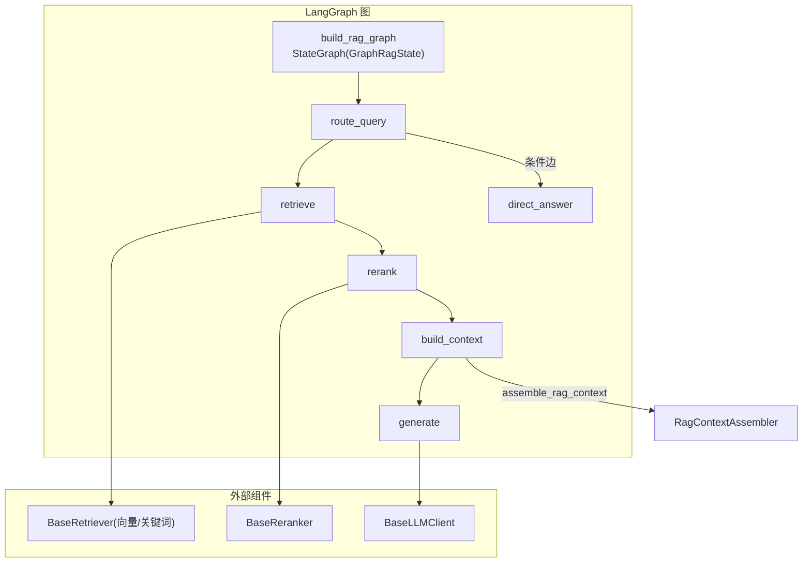
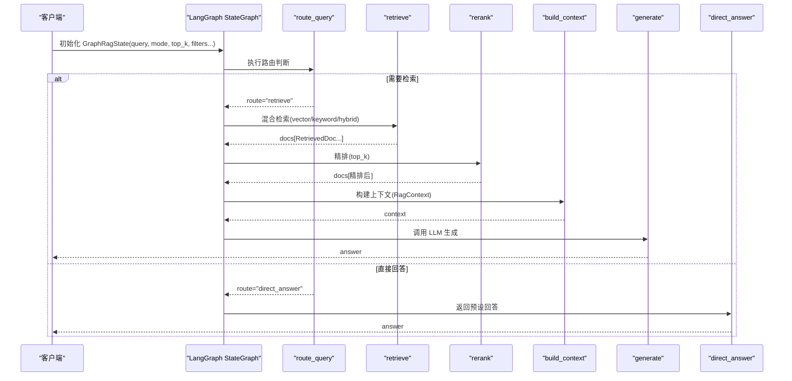
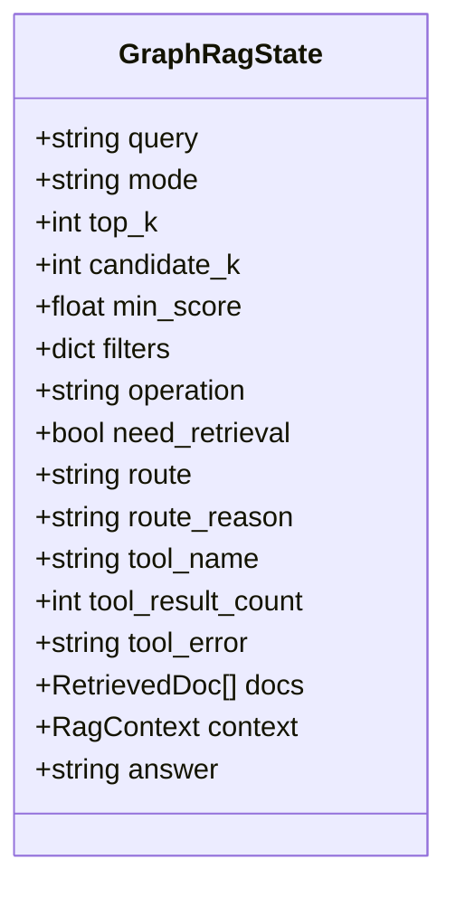
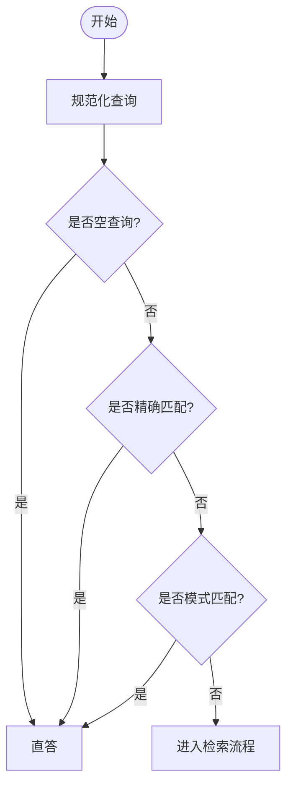
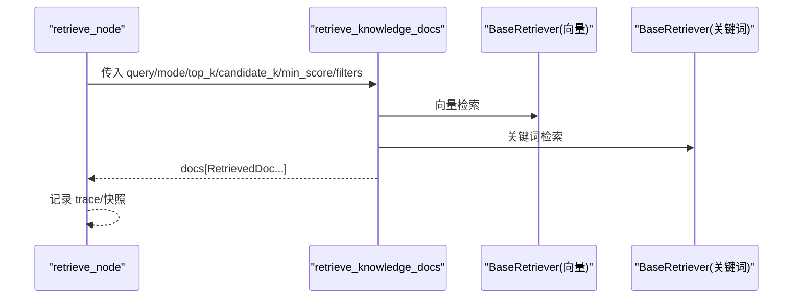
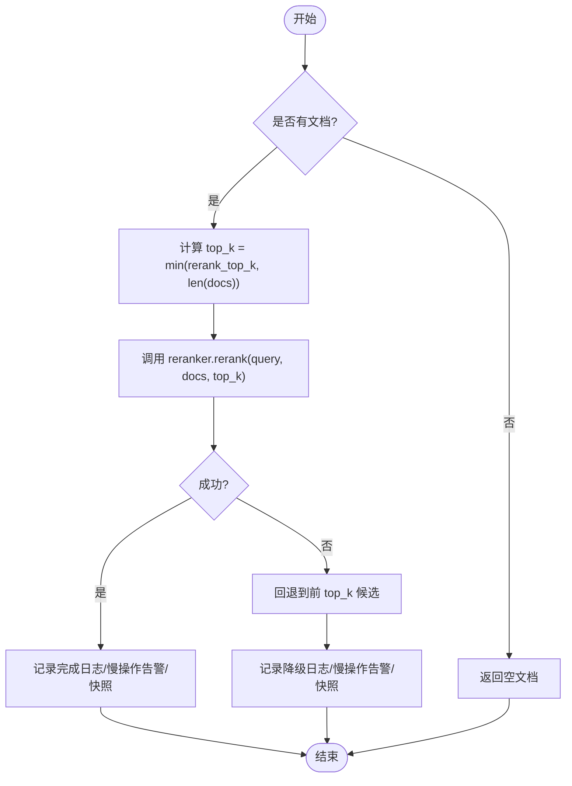
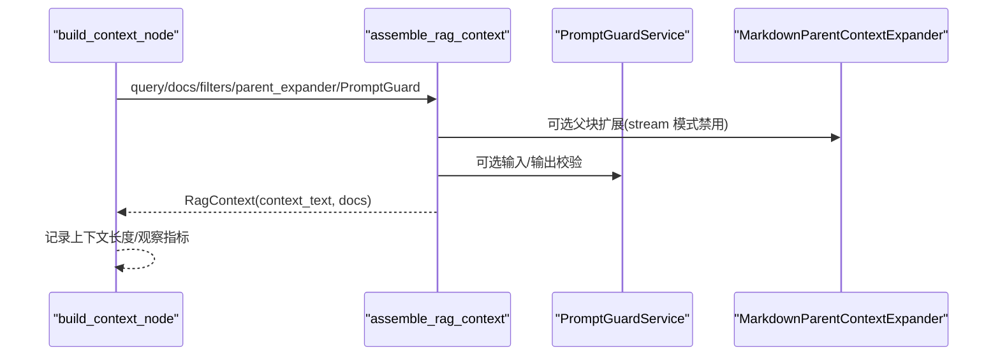
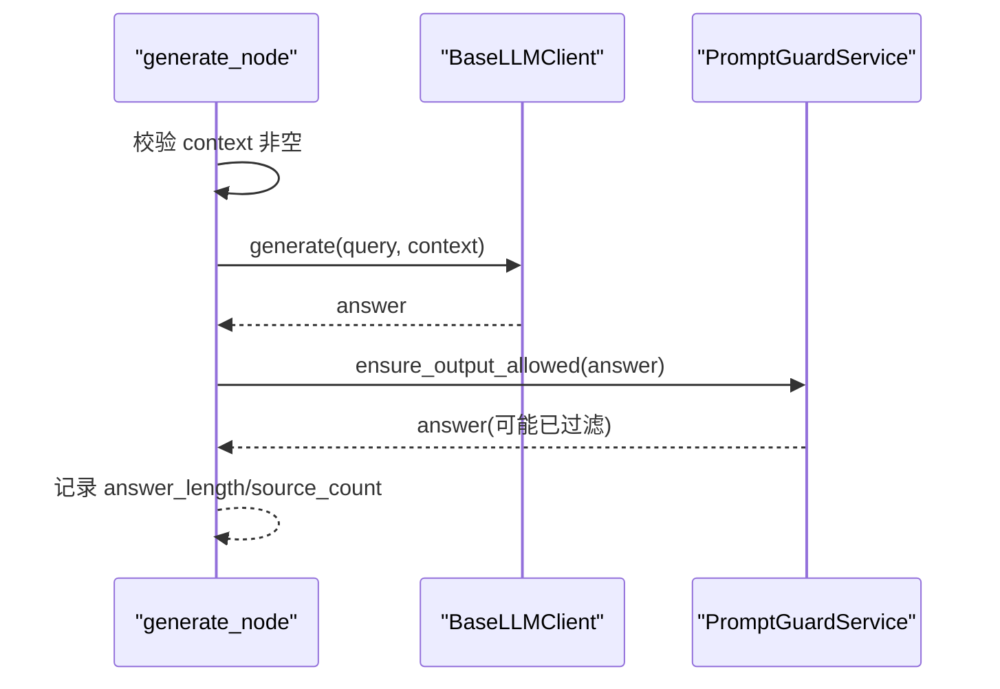
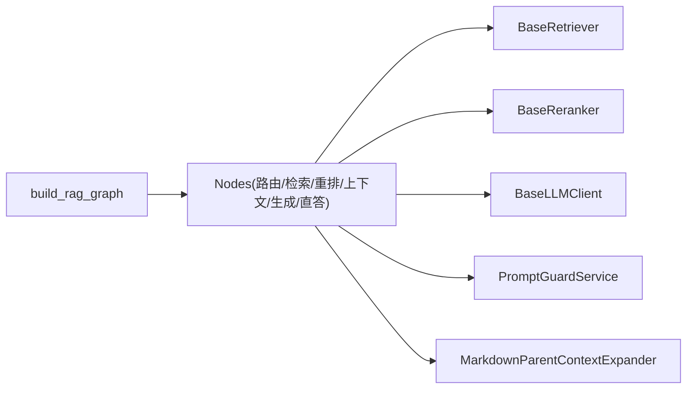

# RAG 状态机

<cite>
**本文引用的文件**
- [rag_graph_builder.py](file://python-agent-study/src/fast_app/graph/rag/rag_graph_builder.py)
- [rag_graph_nodes.py](file://python-agent-study/src/fast_app/graph/rag/rag_graph_nodes.py)
- [rag_graph_state.py](file://python-agent-study/src/fast_app/graph/rag/rag_graph_state.py)
- [rag_state.py](file://python-agent-study/src/fast_app/graph/rag/rag_state.py)
- [rag_models.py](file://python-agent-study/src/fast_app/domain/rag_models.py)
- [rag_chat_schema.py](file://python-agent-study/src/fast_app/schemas/rag_chat_schema.py)
- [rag_pipeline_service.py](file://python-agent-study/src/fast_app/services/rag/rag_pipeline_service.py)
- [rag_context_assembler.py](file://python-agent-study/src/fast_app/services/rag/rag_context_assembler.py)
- [markdown_parent_context.py](file://python-agent-study/src/fast_app/services/rag/markdown_parent_context.py)
- [prompt_guard_service.py](file://python-agent-study/src/fast_app/services/rag/prompt_guard_service.py)
- [base_retriever.py](file://python-agent-study/src/fast_app/components/retrievers/base.py)
- [base_llm_client.py](file://python-agent-study/src/fast_app/components/llms/base.py)
- [base_reranker.py](file://python-agent-study/src/fast_app/components/rerankers/base.py)
</cite>

## 目录
1. [简介](#简介)
2. [项目结构](#项目结构)
3. [核心组件](#核心组件)
4. [架构总览](#架构总览)
5. [详细组件分析](#详细组件分析)
6. [依赖关系分析](#依赖关系分析)
7. [性能考虑](#性能考虑)
8. [故障排查指南](#故障排查指南)
9. [结论](#结论)
10. [附录：自定义 RAG 工作流开发指南](#附录自定义-rag-工作流开发指南)

## 简介
本文件面向“RAG 状态机”的完整设计与实现，聚焦 LangGraph 驱动的 RAG 图：从查询预处理、混合检索、重排序、上下文构建到答案生成，逐节点说明状态模型、条件边逻辑、错误处理与数据传递模式。文档同时给出状态流转图、关键流程图、性能优化策略以及扩展与调试方法，帮助读者快速理解并安全地定制 RAG 工作流。

## 项目结构
RAG 状态机位于 fast_app.graph.rag 模块中，由“图构建器 + 节点工厂 + 状态定义”三部分构成，并与领域模型、服务层和外部组件（检索器、重排器、LLM）解耦集成。

图表来源
- [rag_graph_builder.py:21-89](file://python-agent-study/src/fast_app/graph/rag/rag_graph_builder.py#L21-L89)
- [rag_graph_nodes.py:162-590](file://python-agent-study/src/fast_app/graph/rag/rag_graph_nodes.py#L162-L590)

章节来源
- [rag_graph_builder.py:21-89](file://python-agent-study/src/fast_app/graph/rag/rag_graph_builder.py#L21-L89)
- [rag_graph_state.py:15-65](file://python-agent-study/src/fast_app/graph/rag/rag_graph_state.py#L15-L65)

## 核心组件
- 状态模型
  - GraphRagState：LangGraph 图的共享状态，包含查询参数、路由信息、中间结果（docs/context/answer）等。
  - RagState：早期简化状态示例，便于理解状态字段设计。
- 图构建器
  - build_rag_graph：注册节点、添加边与条件边，组装可执行 StateGraph。
- 节点工厂
  - route_query：基于规则判断是否需要检索或直答。
  - retrieve：调用知识检索工具，封装为 LangGraph 节点。
  - rerank：对召回文档进行精排，含降级与慢操作告警。
  - build_context：合并父块扩展、PromptGuard 校验，产出 RagContext。
  - generate：调用 LLM 生成回答，支持输出安全校验。
  - direct_answer：直接返回预设能力说明文本。
- 领域模型与服务
  - RetrievalFilters/RetrievalOptions/RetrievedDoc/RagContext：描述检索过滤、候选、命中文档与上下文。
  - rag_pipeline_service：提供检索融合、top_doc_ids 等工具函数。
  - rag_context_assembler：组装上下文，支持父块扩展与观测记录。
  - prompt_guard_service：输入/输出安全校验。

章节来源
- [rag_graph_state.py:15-65](file://python-agent-study/src/fast_app/graph/rag/rag_graph_state.py#L15-L65)
- [rag_state.py:7-11](file://python-agent-study/src/fast_app/graph/rag/rag_state.py#L7-L11)
- [rag_models.py:8-80](file://python-agent-study/src/fast_app/domain/rag_models.py#L8-L80)
- [rag_graph_nodes.py:162-590](file://python-agent-study/src/fast_app/graph/rag/rag_graph_nodes.py#L162-L590)
- [rag_graph_builder.py:21-89](file://python-agent-study/src/fast_app/graph/rag/rag_graph_builder.py#L21-L89)

## 架构总览
下图展示了请求进入后，LangGraph 状态机的执行路径与关键数据流向。

图表来源
- [rag_graph_builder.py:74-87](file://python-agent-study/src/fast_app/graph/rag/rag_graph_builder.py#L74-L87)
- [rag_graph_nodes.py:162-243](file://python-agent-study/src/fast_app/graph/rag/rag_graph_nodes.py#L162-L243)
- [rag_graph_nodes.py:398-465](file://python-agent-study/src/fast_app/graph/rag/rag_graph_nodes.py#L398-L465)
- [rag_graph_nodes.py:468-531](file://python-agent-study/src/fast_app/graph/rag/rag_graph_nodes.py#L468-L531)
- [rag_graph_nodes.py:534-590](file://python-agent-study/src/fast_app/graph/rag/rag_graph_nodes.py#L534-L590)

## 详细组件分析

### 状态模型与初始状态
- GraphRagState
  - 输入字段：query、mode、top_k、candidate_k、min_score、filters。
  - 运行上下文：operation、need_retrieval、route、route_reason、tool_name、tool_result_count、tool_error。
  - 中间结果：docs、context、answer。
- 初始状态构造
  - build_graph_initial_state 将 API 请求映射为 GraphRagState，并合并权限范围与知识版本到 filters。

图表来源
- [rag_graph_state.py:15-65](file://python-agent-study/src/fast_app/graph/rag/rag_graph_state.py#L15-L65)

章节来源
- [rag_graph_state.py:15-65](file://python-agent-study/src/fast_app/graph/rag/rag_graph_state.py#L15-L65)
- [rag_chat_schema.py:17-135](file://python-agent-study/src/fast_app/schemas/rag_chat_schema.py#L17-L135)

### 查询预处理与路由
- 规则化与直答判断
  - normalize_route_query：规范化 query（去空白、标点）。
  - should_retrieve_for_query：空查询、精确匹配、模式匹配时走直答；否则检索。
- 条件边
  - route_from_state：根据 state.route 决定下一节点。

图表来源
- [rag_graph_nodes.py:134-159](file://python-agent-study/src/fast_app/graph/rag/rag_graph_nodes.py#L134-L159)

章节来源
- [rag_graph_nodes.py:134-159](file://python-agent-study/src/fast_app/graph/rag/rag_graph_nodes.py#L134-L159)

### 混合检索节点
- 职责
  - 根据 mode(vector/keyword/hybrid)、top_k、candidate_k、min_score 与 filters 调用检索工具。
  - 通过 retrieve_knowledge_docs 完成多源召回与融合，产出 RetrievedDoc 列表。
- 追踪与快照
  - 使用 graph_langsmith_step_trace 记录步骤输入/输出，并记录 top_doc_ids。
  - 记录检索阶段快照用于评测。

图表来源
- [rag_graph_nodes.py:398-465](file://python-agent-study/src/fast_app/graph/rag/rag_graph_nodes.py#L398-L465)
- [rag_pipeline_service.py:1-200](file://python-agent-study/src/fast_app/services/rag/rag_pipeline_service.py#L1-L200)

章节来源
- [rag_graph_nodes.py:398-465](file://python-agent-study/src/fast_app/graph/rag/rag_graph_nodes.py#L398-L465)
- [rag_pipeline_service.py:1-200](file://python-agent-study/src/fast_app/services/rag/rag_pipeline_service.py#L1-L200)

### 重排序节点
- 职责
  - 对召回文档进行精排，控制 top_k，记录耗时与慢操作告警。
  - 异常时回退到前 top_k 候选，保证可用性。
- 指标与快照
  - 记录候选数、结果数、延迟、fallback 标志与 top_doc_ids。
  - 记录检索阶段快照。

图表来源
- [rag_graph_nodes.py:247-386](file://python-agent-study/src/fast_app/graph/rag/rag_graph_nodes.py#L247-L386)

章节来源
- [rag_graph_nodes.py:247-386](file://python-agent-study/src/fast_app/graph/rag/rag_graph_nodes.py#L247-L386)

### 上下文构建节点
- 职责
  - 调用 assemble_rag_context 聚合上下文，支持 Markdown 父块扩展与 PromptGuard 校验。
  - 在 stream 模式下禁用父块扩展以避免额外开销。
- 输出
  - 更新 docs 与 context（RagContext），包含 context_text 与参与文档。

图表来源
- [rag_graph_nodes.py:468-531](file://python-agent-study/src/fast_app/graph/rag/rag_graph_nodes.py#L468-L531)
- [rag_context_assembler.py:1-200](file://python-agent-study/src/fast_app/services/rag/rag_context_assembler.py#L1-L200)
- [markdown_parent_context.py:1-200](file://python-agent-study/src/fast_app/services/rag/markdown_parent_context.py#L1-L200)
- [prompt_guard_service.py:1-200](file://python-agent-study/src/fast_app/services/rag/prompt_guard_service.py#L1-L200)

章节来源
- [rag_graph_nodes.py:468-531](file://python-agent-study/src/fast_app/graph/rag/rag_graph_nodes.py#L468-L531)
- [rag_context_assembler.py:1-200](file://python-agent-study/src/fast_app/services/rag/rag_context_assembler.py#L1-L200)

### 答案生成节点
- 职责
  - 校验 context 非空，调用 BaseLLMClient.generate 生成回答。
  - 可选 PromptGuard 输出安全校验。
- 异常
  - 上下文为空时抛出 ExternalServiceError。

图表来源
- [rag_graph_nodes.py:534-590](file://python-agent-study/src/fast_app/graph/rag/rag_graph_nodes.py#L534-L590)
- [base_llm_client.py:1-200](file://python-agent-study/src/fast_app/components/llms/base.py#L1-L200)
- [prompt_guard_service.py:1-200](file://python-agent-study/src/fast_app/services/rag/prompt_guard_service.py#L1-L200)

章节来源
- [rag_graph_nodes.py:534-590](file://python-agent-study/src/fast_app/graph/rag/rag_graph_nodes.py#L534-L590)

### 直答节点
- 职责
  - 当不需要检索时，返回预设的能力说明文本，不调用 LLM。
- 追踪
  - 记录 answer_length 与 source_count=0。

章节来源
- [rag_graph_nodes.py:205-243](file://python-agent-study/src/fast_app/graph/rag/rag_graph_nodes.py#L205-L243)

## 依赖关系分析
- 组件耦合
  - 图构建器依赖各组件接口：BaseRetriever、BaseReranker、BaseLLMClient、Settings、PromptGuardService、MarkdownParentContextExpander。
  - 节点通过闭包注入组件实例，避免在节点内部硬编码具体实现，提升可替换性。
- 数据契约
  - 输入：RagChatRequest -> GraphRagState。
  - 中间：RetrievedDoc、RagContext。
  - 输出：answer 与 sources（由上层组装）。

图表来源
- [rag_graph_builder.py:21-89](file://python-agent-study/src/fast_app/graph/rag/rag_graph_builder.py#L21-L89)
- [rag_graph_nodes.py:162-590](file://python-agent-study/src/fast_app/graph/rag/rag_graph_nodes.py#L162-L590)

章节来源
- [rag_graph_builder.py:21-89](file://python-agent-study/src/fast_app/graph/rag/rag_graph_builder.py#L21-L89)
- [rag_graph_nodes.py:162-590](file://python-agent-study/src/fast_app/graph/rag/rag_graph_nodes.py#L162-L590)

## 性能考虑
- 检索阶段
  - 合理设置 candidate_k 与 top_k，减少下游重排与上下文构建压力。
  - 使用 mode=hybrid 平衡召回率与准确率。
- 重排序阶段
  - 记录慢操作阈值 slow_rerank_threshold_ms，及时定位瓶颈。
  - 外部服务异常时自动降级，保障可用性。
- 上下文构建
  - stream 模式关闭父块扩展以减少额外开销。
  - 控制 context_text 长度，避免 LLM 输入过大。
- 生成阶段
  - 仅在有 context 时调用 LLM，避免无效请求。
  - 使用 PromptGuard 做最小必要校验，降低额外延迟。

## 故障排查指南
- 常见问题
  - 空查询：路由阶段会识别并走直答。
  - 检索失败：retrieve 节点捕获异常并记录 tool_error，需检查检索器配置与网络。
  - 重排失败：rerank 节点捕获 ExternalServiceError 并降级，关注 fallback 日志。
  - 上下文为空：generate 节点抛出 ExternalServiceError，检查 retrieve/rerank/build_context 链路。
- 诊断要点
  - 查看 LangSmith trace 的步骤输入/输出与 top_doc_ids。
  - 关注慢操作告警事件与延迟指标。
  - 结合检索阶段快照定位召回质量。

章节来源
- [rag_graph_nodes.py:162-590](file://python-agent-study/src/fast_app/graph/rag/rag_graph_nodes.py#L162-L590)

## 结论
该 RAG 状态机以 LangGraph 为核心，通过清晰的状态模型与节点职责划分，实现了从查询预处理、混合检索、重排序、上下文构建到答案生成的完整链路。其条件边与错误处理机制保证了灵活性与鲁棒性，配合追踪与快照能力，便于评测与调优。开发者可基于此框架便捷扩展节点、替换组件与定制策略。

## 附录：自定义 RAG 工作流开发指南
- 节点扩展
  - 新增节点：在 rag_graph_nodes.py 中创建新节点工厂函数，遵循异步函数签名 Callable[[GraphRagState], dict]。
  - 注册节点：在 build_rag_graph 中添加 builder.add_node 与相应边。
  - 条件边：如需分支，使用 add_conditional_edges 与路由函数。
- 状态管理
  - 在 GraphRagState 中增加必要字段，并在 build_graph_initial_state 中初始化默认值。
  - 确保节点只读写约定字段，保持高内聚低耦合。
- 调试方法
  - 启用 LangSmith 追踪，查看每个节点的输入/输出与耗时。
  - 利用 record_snapshot_retrieval_stage 获取检索快照，辅助评测。
  - 通过日志事件（如 rag.rerank.start/finish/fallback）定位问题。
- 与检索器组件集成
  - 通过 BaseRetriever 接口接入向量/关键词检索器，保持可替换性。
  - 在 retrieve 节点中复用 retrieve_knowledge_docs，统一融合逻辑。
- 配置选项
  - 通过 Settings 注入阈值与开关（如 slow_rerank_threshold_ms）。
  - 通过 RagChatRequest 暴露 top_k、candidate_k、min_score、mode、filters 等可调参数。

章节来源
- [rag_graph_builder.py:21-89](file://python-agent-study/src/fast_app/graph/rag/rag_graph_builder.py#L21-L89)
- [rag_graph_state.py:39-65](file://python-agent-study/src/fast_app/graph/rag/rag_graph_state.py#L39-L65)
- [rag_graph_nodes.py:162-590](file://python-agent-study/src/fast_app/graph/rag/rag_graph_nodes.py#L162-L590)
- [rag_chat_schema.py:17-135](file://python-agent-study/src/fast_app/schemas/rag_chat_schema.py#L17-L135)