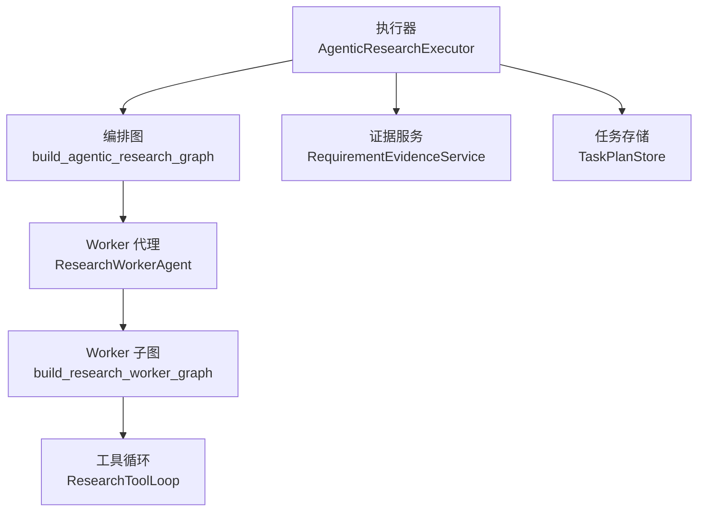
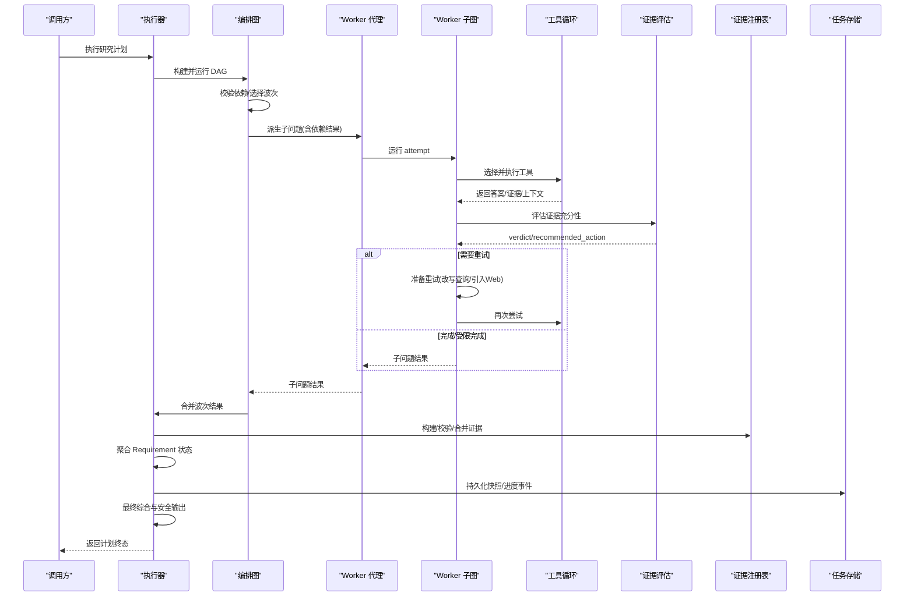
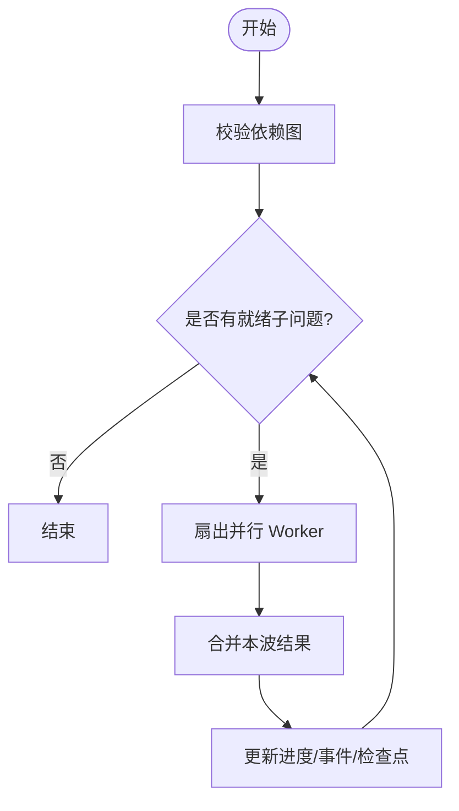
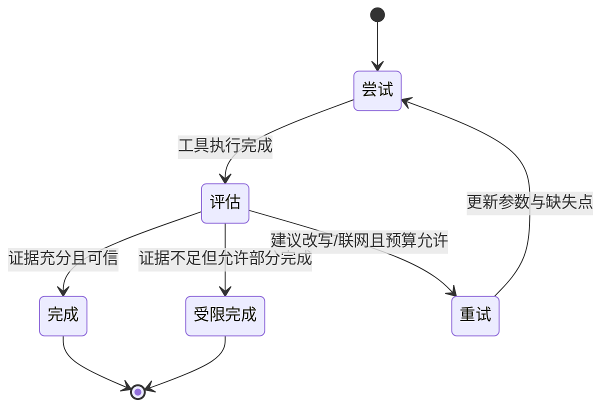
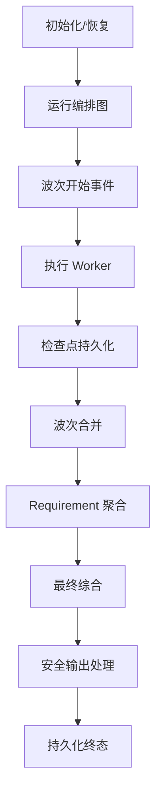
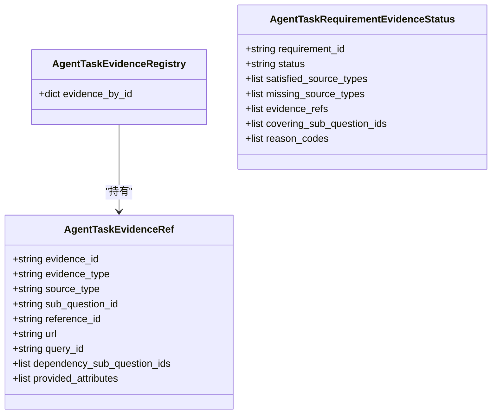
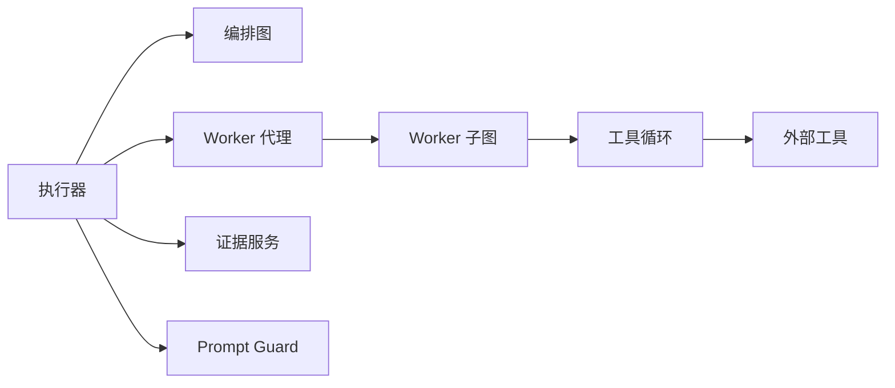

# Research 工作流状态机

<cite>
**本文引用的文件**
- [research_task_plan.py](file://python-agent-study/src/fast_app/domain/research_task_plan.py)
- [agent_task_plan.py](file://python-agent-study/src/fast_app/domain/agent_task_plan.py)
- [agentic_research_graph.py](file://python-agent-study/src/fast_app/graph/research/agentic_research_graph.py)
- [research_worker_graph.py](file://python-agent-study/src/fast_app/graph/research/research_worker_graph.py)
- [agentic_research_executor.py](file://python-agent-study/src/fast_app/services/research/agentic_research_executor.py)
- [requirement_evidence_service.py](file://python-agent-study/src/fast_app/services/research/requirement_evidence_service.py)
- [research_worker_agent.py](file://python-agent-study/src/fast_app/services/research/research_worker_agent.py)
- [research_tool_loop.py](file://python-agent-study/src/fast_app/services/research/research_tool_loop.py)
</cite>

## 目录
1. [简介](#简介)
2. [项目结构](#项目结构)
3. [核心组件](#核心组件)
4. [架构总览](#架构总览)
5. [详细组件分析](#详细组件分析)
6. [依赖关系分析](#依赖关系分析)
7. [性能与并发特性](#性能与并发特性)
8. [故障排查指南](#故障排查指南)
9. [结论](#结论)
10. [附录：研究 Agent 定制指南](#附录研究-agent-定制指南)

## 简介
本文件系统化说明 Research 工作流的状态机设计，覆盖需求分析、证据收集、多步骤推理、结果验证、最终综合与安全输出等关键节点。重点解释 ResearchState 状态模型、子任务分解机制、按依赖波次的并行执行策略、长周期任务的检查点保存与中断恢复，以及研究 Agent 的定制方式、外部工具集成与质量保证措施。

## 项目结构
Research 工作流由“编排层 + Worker 子图 + 执行器 + 证据服务”构成：
- 编排层：基于 LangGraph 的子图负责依赖校验、波次选择、扇出并行、合并收敛。
- Worker 子图：封装单个子问题的“尝试-评估-路由-重试/完成/受限完成”纠正循环。
- 执行器：负责任务计划生命周期管理、波次回调、进度事件、证据注册、最终综合与安全输出。
- 证据服务：负责 Typed Evidence 构建、校验、幂等合并与 Requirement 级聚合判定。

**图表来源**
- [agentic_research_graph.py:111-276](file://python-agent-study/src/fast_app/graph/research/agentic_research_graph.py#L111-L276)
- [research_worker_graph.py:45-79](file://python-agent-study/src/fast_app/graph/research/research_worker_graph.py#L45-L79)
- [agentic_research_executor.py:86-519](file://python-agent-study/src/fast_app/services/research/agentic_research_executor.py#L86-L519)
- [requirement_evidence_service.py:41-352](file://python-agent-study/src/fast_app/services/research/requirement_evidence_service.py#L41-L352)

**章节来源**
- [agentic_research_graph.py:1-294](file://python-agent-study/src/fast_app/graph/research/agentic_research_graph.py#L1-L294)
- [research_worker_graph.py:1-83](file://python-agent-study/src/fast_app/graph/research/research_worker_graph.py#L1-L83)
- [agentic_research_executor.py:1-736](file://python-agent-study/src/fast_app/services/research/agentic_research_executor.py#L1-L736)
- [requirement_evidence_service.py:1-352](file://python-agent-study/src/fast_app/services/research/requirement_evidence_service.py#L1-L352)

## 核心组件
- 任务与状态模型
  - 任务计划、子问题、证据引用、证据注册表、Requirement 证据状态、Worker 阶段与检查点等，均通过 Pydantic 模型严格约束，确保可序列化、可校验、可追溯。
  - 关键类型包括：ResearchTaskSubQuestion、ResearchTaskSubQuestionResult、AgentTaskEvidenceRef、AgentTaskEvidenceRegistry、AgentTaskRequirementEvidenceStatus、ResearchWorkerCheckpoint、ResearchProgressEvent 等。
- 编排图（DAG 波次）
  - 使用 Kahn 算法对子问题依赖进行拓扑排序，按波次并行派发；失败或跳过会级联影响下游。
  - 支持取消信号、最大并发限制、稳定顺序展示。
- Worker 子图（纠正循环）
  - 显式节点：run_attempt → evaluate_evidence → route_evaluation → prepare_retry → complete/finalize_limited。
  - 路由决策依据 Evaluator 结论、Web 策略、预算（轮次与工具调用次数）。
- 执行器
  - 维护 TaskPlan 全生命周期：启动、波次回调、进度事件、检查点持久化、证据合并、Requirement 聚合、最终综合与安全输出。
  - 提供超时保护、取消传播、错误分类与恢复语义。
- 证据服务
  - 将历史证据摘要转换为 Typed Evidence，校验来源与依赖，幂等合并到 Registry，并按 Requirement 契约计算满足状态。

**章节来源**
- [research_task_plan.py:18-785](file://python-agent-study/src/fast_app/domain/research_task_plan.py#L18-L785)
- [agent_task_plan.py:10-200](file://python-agent-study/src/fast_app/domain/agent_task_plan.py#L10-L200)
- [agentic_research_graph.py:56-108](file://python-agent-study/src/fast_app/graph/research/agentic_research_graph.py#L56-L108)
- [research_worker_graph.py:18-79](file://python-agent-study/src/fast_app/graph/research/research_worker_graph.py#L18-L79)
- [agentic_research_executor.py:86-519](file://python-agent-study/src/fast_app/services/research/agentic_research_executor.py#L86-L519)
- [requirement_evidence_service.py:41-352](file://python-agent-study/src/fast_app/services/research/requirement_evidence_service.py#L41-L352)

## 架构总览
Research 工作流采用分层状态机：
- 外层：按依赖波次的 DAG 执行图，控制全局并发与收敛。
- 内层：每个子问题的独立 Worker 子图，实现“尝试-评估-路由-重试/完成/受限完成”的闭环。
- 横向：证据服务在波次合并阶段统一做 Typed Evidence 校验与 Requirement 聚合；执行器负责最终综合与安全输出。

**图表来源**
- [agentic_research_graph.py:111-276](file://python-agent-study/src/fast_app/graph/research/agentic_research_graph.py#L111-L276)
- [research_worker_graph.py:45-79](file://python-agent-study/src/fast_app/graph/research/research_worker_graph.py#L45-L79)
- [research_worker_agent.py:83-121](file://python-agent-study/src/fast_app/services/research/research_worker_agent.py#L83-L121)
- [agentic_research_executor.py:251-320](file://python-agent-study/src/fast_app/services/research/agentic_research_executor.py#L251-L320)
- [requirement_evidence_service.py:44-183](file://python-agent-study/src/fast_app/services/research/requirement_evidence_service.py#L44-L183)

## 详细组件分析

### 外层编排图：依赖波次与并行调度
- 依赖校验：检测重复 ID、缺失依赖、自依赖与循环依赖，保证合法 DAG。
- 波次选择：根据已完成结果动态计算下一批可并行执行的子问题；失败/跳过会级联标记下游为 skipped。
- 扇出与合并：使用 Send 为每个子问题创建独立 Worker 实例；结果通过 operator.add 安全汇总；合并时按规划顺序稳定排序。
- 取消与限流：每次派发前检查取消信号；max_parallel_workers 限制外部工具并发。

**图表来源**
- [agentic_research_graph.py:56-108](file://python-agent-study/src/fast_app/graph/research/agentic_research_graph.py#L56-L108)
- [agentic_research_graph.py:131-199](file://python-agent-study/src/fast_app/graph/research/agentic_research_graph.py#L131-L199)
- [agentic_research_graph.py:201-251](file://python-agent-study/src/fast_app/graph/research/agentic_research_graph.py#L201-L251)

**章节来源**
- [agentic_research_graph.py:56-276](file://python-agent-study/src/fast_app/graph/research/agentic_research_graph.py#L56-L276)

### 内层 Worker 子图：纠正循环与终止条件
- run_attempt：调用工具循环生成候选答案与证据，累积工具调用与上下文分组。
- evaluate_evidence：调用 Evaluator 评估证据充分性，记录置信度、覆盖率、权威性与缺失点。
- route_evaluation：根据 verdict、confidence、recommended_action、Web 策略与预算决定下一步。
- prepare_retry：构造下一次尝试，可能改写本地查询、引入 Web 搜索或组合两者。
- complete / finalize_limited：分别产出完整或部分完成的结果；若无可信证据则降级为失败。

**图表来源**
- [research_worker_graph.py:45-79](file://python-agent-study/src/fast_app/graph/research/research_worker_graph.py#L45-L79)
- [research_worker_agent.py:123-427](file://python-agent-study/src/fast_app/services/research/research_worker_agent.py#L123-L427)

**章节来源**
- [research_worker_graph.py:1-83](file://python-agent-study/src/fast_app/graph/research/research_worker_graph.py#L1-L83)
- [research_worker_agent.py:61-483](file://python-agent-study/src/fast_app/services/research/research_worker_agent.py#L61-L483)

### 执行器：长周期任务、检查点与恢复
- 任务初始化：校验版本与类型，清理未完成的中间状态，保留已完成的子问题结果。
- 进度事件：统一追加结构化事件，包含 wave、attempt、stage、active_operations、tool_call_count、evidence_count、last_tool_name 等。
- 检查点：Worker 内部阶段变化通过 ResearchWorkerCheckpointUpdate 上报，执行器原子写入检查点与进度快照，支持超时后恢复。
- 波次合并：构建 Typed Evidence，校验来源与依赖，幂等合并到 Registry，更新 Requirement 证据状态。
- 最终综合：仅使用满足或部分满足的 Requirement 对应的合法证据生成答案，并通过 Prompt Guard 进行安全处理。

**图表来源**
- [agentic_research_executor.py:86-519](file://python-agent-study/src/fast_app/services/research/agentic_research_executor.py#L86-L519)
- [research_task_plan.py:631-785](file://python-agent-study/src/fast_app/domain/research_task_plan.py#L631-L785)

**章节来源**
- [agentic_research_executor.py:86-736](file://python-agent-study/src/fast_app/services/research/agentic_research_executor.py#L86-L736)
- [research_task_plan.py:631-785](file://python-agent-study/src/fast_app/domain/research_task_plan.py#L631-L785)

### 证据服务：Typed Evidence、校验与聚合
- 构建候选证据：从历史证据摘要映射为 knowledge_chunk、web_citation、sql_query_result、derived_synthesis 四种类型，并生成稳定 evidence_id。
- 校验证据：检查 sub_question 归属、依赖完整性、来源合法性（必须来自成功工具），过滤无效证据。
- 幂等合并：同 evidence_id 不同内容视为损坏并报错，避免重复写入冲突。
- Requirement 聚合：按 source_policy(mode=all_of/any_of/none)、expected_evidence(minimum_count、required_attributes、requires_query_id) 计算 satisfied/partially_satisfied/pending/failed，并区分 security_blocked。

**图表来源**
- [research_task_plan.py:299-370](file://python-agent-study/src/fast_app/domain/research_task_plan.py#L299-L370)
- [requirement_evidence_service.py:44-352](file://python-agent-study/src/fast_app/services/research/requirement_evidence_service.py#L44-L352)

**章节来源**
- [requirement_evidence_service.py:41-352](file://python-agent-study/src/fast_app/services/research/requirement_evidence_service.py#L41-L352)
- [research_task_plan.py:299-400](file://python-agent-study/src/fast_app/domain/research_task_plan.py#L299-L400)

### 工具循环：外部工具集成与质量控制
- 工具选择：LLM 在受控 schema 下选择知识检索、网络搜索、NL2SQL 查询、MCP Fetch 等只读工具；同一轮可并行选择互不依赖的工具。
- 执行与上下文：执行工具后生成结构化证据摘要与文档上下文分组，供后续评估与综合使用。
- 安全与权限：工具调用受权限与 ACL 控制；拒绝访问会被记录为安全失败原因码，影响 Requirement 聚合。
- 质量保障：通过 Prompt Guard 与结构化输入校验，防止注入与越权；工具输出被规范化为证据摘要。

**章节来源**
- [research_tool_loop.py:1-200](file://python-agent-study/src/fast_app/services/research/research_tool_loop.py#L1-L200)
- [research_worker_agent.py:123-205](file://python-agent-study/src/fast_app/services/research/research_worker_agent.py#L123-L205)

## 依赖关系分析
- 耦合与内聚
  - 编排图与 Worker 子图解耦：前者专注 DAG 与并发，后者专注单子问题纠正循环。
  - 执行器与证据服务解耦：执行器负责流程与持久化，证据服务专注数据契约与聚合。
  - 工具循环与上层隔离：工具细节不暴露给 Worker 子图，仅通过结构化结果交互。
- 直接/间接依赖
  - 执行器依赖编排图、Worker 代理、证据服务、任务存储、Prompt Guard。
  - Worker 代理依赖 Worker 子图、工具循环、证据评估。
  - 证据服务依赖领域模型与异常类型。
- 外部依赖
  - 知识库检索、网络搜索、NL2SQL、MCP Fetch 等外部工具通过工具循环接入。
  - LLM 客户端用于工具选择、证据评估、最终综合。

**图表来源**
- [agentic_research_executor.py:86-519](file://python-agent-study/src/fast_app/services/research/agentic_research_executor.py#L86-L519)
- [research_worker_agent.py:61-121](file://python-agent-study/src/fast_app/services/research/research_worker_agent.py#L61-L121)
- [research_tool_loop.py:172-200](file://python-agent-study/src/fast_app/services/research/research_tool_loop.py#L172-L200)

**章节来源**
- [agentic_research_executor.py:86-519](file://python-agent-study/src/fast_app/services/research/agentic_research_executor.py#L86-L519)
- [research_worker_agent.py:61-483](file://python-agent-study/src/fast_app/services/research/research_worker_agent.py#L61-L483)
- [research_tool_loop.py:172-200](file://python-agent-study/src/fast_app/services/research/research_tool_loop.py#L172-L200)

## 性能与并发特性
- 依赖波次并行：按拓扑序分批派发，最大化利用外部工具并发能力，同时保证依赖正确性。
- 并发上限：max_parallel_workers 限制每波并发数，避免资源争用与外部服务过载。
- 稳定顺序：合并结果按 order 与 id 排序，便于 SSE 展示与测试复现。
- 超时与取消：Worker 执行设置超时；取消信号在各派发点检查，避免无效外部调用。
- 检查点粒度：以操作级别记录 active_operations、tool_calls、evidence 摘要，降低恢复成本。

[本节为通用性能讨论，无需特定文件来源]

## 故障排查指南
- 常见错误与定位
  - 依赖图非法：重复 ID、缺失依赖、自依赖或循环依赖会导致启动失败。
  - 证据来源非法：非成功工具产生的证据将被拒绝；需检查工具权限与返回字段。
  - 安全阻断：权限拒绝、提示注入拦截、源不可用等安全失败会影响 Requirement 聚合。
  - 超时与取消：Worker 超时会记录最后阶段与已完成调用；取消会中止后续派发。
- 诊断信息
  - 进度事件：包含 event、wave、attempt、stage、reason_code、active_operations、tool_call_count、evidence_count、last_tool_name。
  - 检查点：stage、attempt、active_operations、tool_calls、evidence、last_tool_name。
  - Requirement 状态：satisfied/partially_satisfied/pending/failed，附带 missing_source_types 与 reason_codes。
- 恢复策略
  - 恢复时保留 completed 子问题结果，清空未完成证据与检查点；重新执行剩余波次。
  - 若证据注册表损坏（同 ID 不同内容），需回滚至最近一致快照。

**章节来源**
- [agentic_research_graph.py:56-108](file://python-agent-study/src/fast_app/graph/research/agentic_research_graph.py#L56-L108)
- [requirement_evidence_service.py:123-183](file://python-agent-study/src/fast_app/services/research/requirement_evidence_service.py#L123-L183)
- [agentic_research_executor.py:123-227](file://python-agent-study/src/fast_app/services/research/agentic_research_executor.py#L123-L227)
- [research_task_plan.py:631-785](file://python-agent-study/src/fast_app/domain/research_task_plan.py#L631-L785)

## 结论
Research 工作流通过“DAG 波次编排 + Worker 纠正循环 + 证据契约校验 + 安全输出”的分层状态机，实现了复杂研究任务的可观测、可恢复、可验证执行。其核心优势在于：
- 严格的证据契约与来源校验，确保结论可追溯。
- 依赖驱动的并行执行，兼顾效率与正确性。
- 细粒度的检查点与进度事件，支持长周期任务的中断恢复。
- 安全输出与权限控制，保障企业级使用场景。

[本节为总结性内容，无需特定文件来源]

## 附录：研究 Agent 定制指南
- 证据评估定制
  - 调整 Evaluator 阈值与置信度，控制“充分/部分/不足/冲突”的判定。
  - 自定义 missing_points 生成逻辑，指导下一轮查询改写或联网补充。
- 结论生成定制
  - 修改最终综合提示词，强调仅使用合法 Evidence，并在部分满足时明确限制。
  - 结合业务领域知识，增强综合输出的可读性与可审计性。
- 引用管理定制
  - 扩展 Typed Evidence 类型与字段，适配新的数据来源（如 API 响应、文件哈希）。
  - 强化引用去重与溯源，确保引用链完整可查。
- 外部工具集成
  - 新增只读工具时，需在工具循环中注册并限定权限范围；确保输出可转换为证据摘要。
  - 对敏感工具增加人工确认与二次鉴权，避免误操作。
- 质量保证措施
  - 启用 Prompt Guard 对输入输出进行安全分类与清洗。
  - 配置工具调用上限与重试预算，防止无限循环与资源耗尽。
  - 定期回归测试依赖图、证据契约与聚合逻辑，确保稳定性。

**章节来源**
- [research_worker_agent.py:207-427](file://python-agent-study/src/fast_app/services/research/research_worker_agent.py#L207-L427)
- [agentic_research_executor.py:521-649](file://python-agent-study/src/fast_app/services/research/agentic_research_executor.py#L521-L649)
- [research_tool_loop.py:172-200](file://python-agent-study/src/fast_app/services/research/research_tool_loop.py#L172-L200)
- [requirement_evidence_service.py:44-352](file://python-agent-study/src/fast_app/services/research/requirement_evidence_service.py#L44-L352)