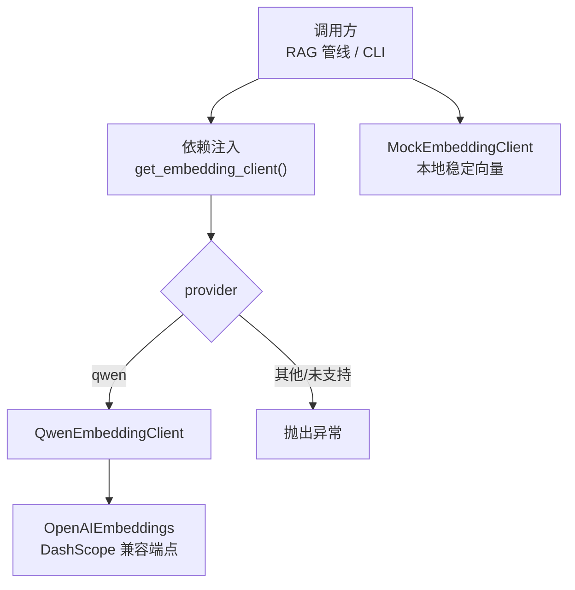
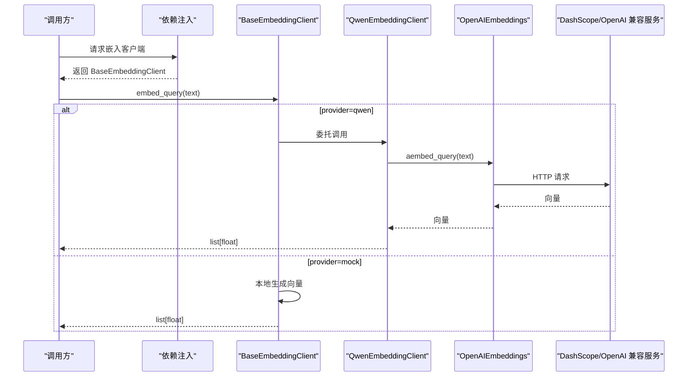
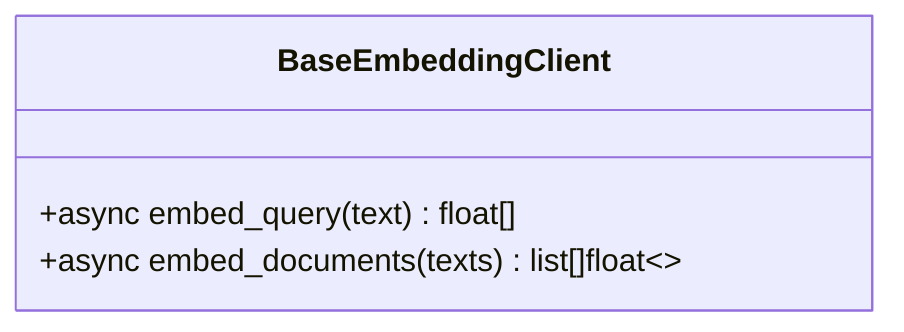
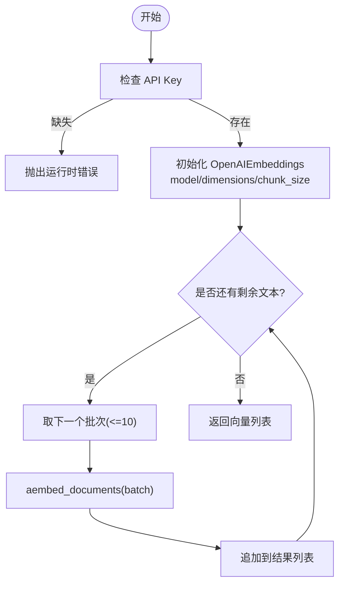
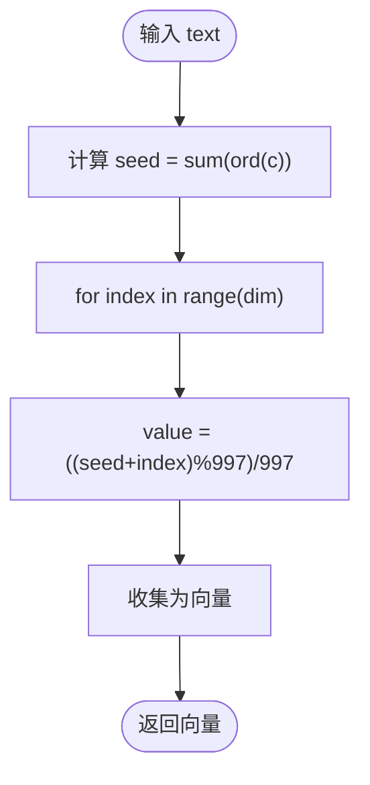
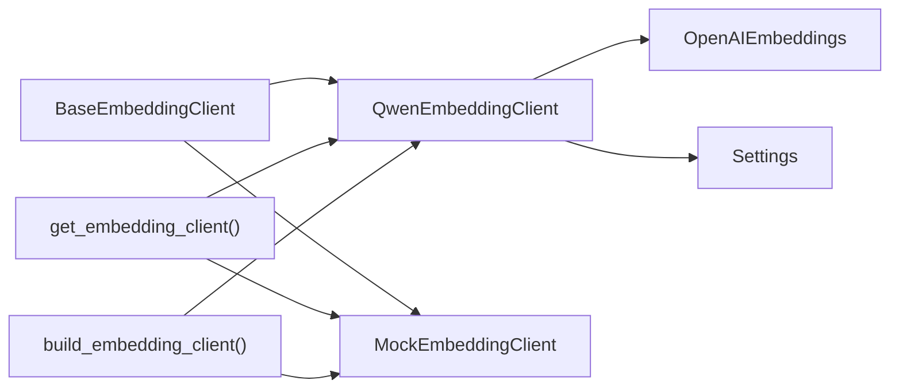

# 嵌入模型

<cite>
**本文引用的文件**
- [base.py](file://src/fast_app/components/embeddings/base.py)
- [qwen_embedding_client.py](file://src/fast_app/components/embeddings/qwen_embedding_client.py)
- [mock_embedding_client.py](file://src/fast_app/components/embeddings/mock_embedding_client.py)
- [config.py](file://src/fast_app/core/config.py)
- [rag_dependencies.py](file://src/fast_app/dependencies/rag_dependencies.py)
- [cli.py](file://src/fast_app/ingestion/cli.py)
- [embedding_minimal_demo.py](file://src/app/embedding_minimal_demo.py)
</cite>

## 目录
1. [简介](#简介)
2. [项目结构](#项目结构)
3. [核心组件](#核心组件)
4. [架构总览](#架构总览)
5. [详细组件分析](#详细组件分析)
6. [依赖关系分析](#依赖关系分析)
7. [性能与内存优化](#性能与内存优化)
8. [故障排查指南](#故障排查指南)
9. [结论](#结论)
10. [附录：自定义嵌入模型集成指南](#附录自定义嵌入模型集成指南)

## 简介
本章节面向“嵌入模型”这一核心能力，系统说明抽象接口、Qwen 嵌入客户端与 Mock 嵌入客户端的实现要点，覆盖文本向量化流程、批量处理策略、维度配置、选择策略、性能调优与内存管理，并给出自定义嵌入模型的接入方法、错误处理与缓存机制建议，以及与检索系统的配合和数据预处理要求。

## 项目结构
嵌入模型相关代码位于 fast_app 的 components/embeddings 目录下，提供统一抽象 BaseEmbeddingClient，以及两种实现：QwenEmbeddingClient（对接 DashScope/OpenAI 兼容接口）和 MockEmbeddingClient（本地稳定向量生成）。配置集中在 core/config.py，通过 Settings 暴露 embedding_provider、embedding_model_name、embedding_dim 等关键参数。依赖注入在 dependencies/rag_dependencies.py 中完成，CLI 工具在 ingestion/cli.py 中也提供了构建嵌入客户端的能力。

图表来源
- [rag_dependencies.py:83-93](file://src/fast_app/dependencies/rag_dependencies.py#L83-L93)
- [qwen_embedding_client.py:15-29](file://src/fast_app/components/embeddings/qwen_embedding_client.py#L15-L29)
- [mock_embedding_client.py:4-15](file://src/fast_app/components/embeddings/mock_embedding_client.py#L4-L15)

章节来源
- [base.py:1-13](file://src/fast_app/components/embeddings/base.py#L1-L13)
- [config.py:597-604](file://src/fast_app/core/config.py#L597-L604)
- [rag_dependencies.py:83-93](file://src/fast_app/dependencies/rag_dependencies.py#L83-L93)
- [cli.py:126-135](file://src/fast_app/ingestion/cli.py#L126-L135)

## 核心组件
- 抽象基类 BaseEmbeddingClient：定义两个异步接口
  - embed_query(text) -> list[float]：将查询文本转为向量
  - embed_documents(texts) -> list[list[float]]：将文档列表批量转为向量
- QwenEmbeddingClient：基于 langchain_openai.OpenAIEmbeddings，使用 DashScope 兼容端点；内部按供应商限制进行分批调用；失败时统一转换为外部服务错误
- MockEmbeddingClient：不依赖外部服务，根据文本内容以确定性方式生成固定维度的向量，用于本地验证链路

章节来源
- [base.py:4-13](file://src/fast_app/components/embeddings/base.py#L4-L13)
- [qwen_embedding_client.py:15-54](file://src/fast_app/components/embeddings/qwen_embedding_client.py#L15-L54)
- [mock_embedding_client.py:4-30](file://src/fast_app/components/embeddings/mock_embedding_client.py#L4-L30)

## 架构总览
嵌入模型在系统中的位置如下：
- 上层 RAG 管线或 CLI 通过依赖注入获取 BaseEmbeddingClient 实例
- 若 provider 为 qwen，则返回 QwenEmbeddingClient，其内部封装 OpenAIEmbeddings 并设置 dimensions、chunk_size 等
- 若 provider 为 mock（当前仅 CLI 显式启用），则返回 MockEmbeddingClient
- 配置项 embedding_provider、embedding_model_name、embedding_dim、openai_base_url、openai_api_key 控制行为
- 错误处理统一为 ExternalServiceError，便于 Pipeline 层做重试/降级

图表来源
- [rag_dependencies.py:83-93](file://src/fast_app/dependencies/rag_dependencies.py#L83-L93)
- [qwen_embedding_client.py:31-37](file://src/fast_app/components/embeddings/qwen_embedding_client.py#L31-L37)
- [mock_embedding_client.py:17-18](file://src/fast_app/components/embeddings/mock_embedding_client.py#L17-L18)

## 详细组件分析

### 抽象接口 BaseEmbeddingClient
- 职责：定义统一的嵌入接口，屏蔽底层实现差异
- 复杂度：O(1) 接口定义；实际复杂度由实现决定
- 扩展性：新增实现只需实现两个异步方法

图表来源
- [base.py:4-13](file://src/fast_app/components/embeddings/base.py#L4-L13)

章节来源
- [base.py:1-13](file://src/fast_app/components/embeddings/base.py#L1-L13)

### QwenEmbeddingClient
- 初始化
  - 校验 openai_api_key，缺失直接抛出运行时错误
  - 构造 OpenAIEmbeddings，传入 model、api_key、base_url、dimensions、check_embedding_ctx_length=False、chunk_size=10
- 向量化 Query
  - 调用 aembed_query，捕获异常并记录日志，抛出 ExternalServiceError
- 向量化 Documents
  - 按最大批次大小 10 切分 texts，循环调用 aembed_documents，拼接结果保持原始顺序
  - 捕获异常并记录日志，抛出 ExternalServiceError
- 数据流与批处理
  - 输入：texts: list[str]
  - 输出：vectors: list[list[float]]，长度与输入一致
  - 批大小：10（受供应商限制）
- 维度配置
  - dimensions 来自 settings.embedding_dim，默认 1024
- 错误处理
  - 统一包装为 ExternalServiceError，便于上层重试/降级

图表来源
- [qwen_embedding_client.py:15-54](file://src/fast_app/components/embeddings/qwen_embedding_client.py#L15-L54)

章节来源
- [qwen_embedding_client.py:15-54](file://src/fast_app/components/embeddings/qwen_embedding_client.py#L15-L54)
- [config.py:230-235](file://src/fast_app/core/config.py#L230-L235)
- [config.py:597-604](file://src/fast_app/core/config.py#L597-L604)

### MockEmbeddingClient
- 设计目标：本地稳定生成固定维度向量，不调用外部服务
- 向量生成策略
  - seed = sum(ord(char) for char in text) or 1
  - 每个维度值 = ((seed + index) % 997) / 997，范围在 (0,1)
- 适用场景：本地验证 ingestion/retrieval/evaluation 的工程链路
- 注意：不代表真实语义相似度，仅保证同文本同向量

图表来源
- [mock_embedding_client.py:23-30](file://src/fast_app/components/embeddings/mock_embedding_client.py#L23-L30)

章节来源
- [mock_embedding_client.py:4-30](file://src/fast_app/components/embeddings/mock_embedding_client.py#L4-L30)

### 配置与选择策略
- 配置项
  - embedding_provider：选择嵌入提供者（如 qwen）
  - embedding_model_name：模型名称（如 text-embedding-v4）
  - embedding_dim：向量维度（默认 1024）
  - openai_api_key/openai_base_url：DashScope/OpenAI 兼容端点凭据与地址
- 选择策略
  - 依赖注入 get_embedding_client 根据 settings.embedding_provider 返回对应实现
  - 当前仅支持 qwen；如需 mock 可在 CLI 中通过参数切换
- 最小化示例
  - embedding_minimal_demo.py 展示了直接使用 OpenAIEmbeddings 的配置与调用方式

章节来源
- [config.py:597-604](file://src/fast_app/core/config.py#L597-L604)
- [config.py:230-235](file://src/fast_app/core/config.py#L230-L235)
- [rag_dependencies.py:83-93](file://src/fast_app/dependencies/rag_dependencies.py#L83-L93)
- [embedding_minimal_demo.py:8-20](file://src/app/embedding_minimal_demo.py#L8-L20)

## 依赖关系分析
- BaseEmbeddingClient 被 QwenEmbeddingClient 与 MockEmbeddingClient 继承
- QwenEmbeddingClient 依赖 langchain_openai.OpenAIEmbeddings 与 Settings
- 依赖注入模块 rag_dependencies.py 负责根据配置创建具体实现
- CLI 工具 ingestion/cli.py 提供 build_embedding_client，支持 --mock-embeddings 切换为 MockEmbeddingClient

图表来源
- [base.py:4-13](file://src/fast_app/components/embeddings/base.py#L4-L13)
- [qwen_embedding_client.py:1-7](file://src/fast_app/components/embeddings/qwen_embedding_client.py#L1-L7)
- [rag_dependencies.py:83-93](file://src/fast_app/dependencies/rag_dependencies.py#L83-L93)
- [cli.py:126-135](file://src/fast_app/ingestion/cli.py#L126-L135)

章节来源
- [rag_dependencies.py:83-93](file://src/fast_app/dependencies/rag_dependencies.py#L83-L93)
- [cli.py:126-135](file://src/fast_app/ingestion/cli.py#L126-L135)

## 性能与内存优化
- 批量大小
  - QwenEmbeddingClient 使用 chunk_size=10 分批调用，避免超过供应商限制
  - 建议在 ingestion 层尽量合并 chunks 后一次性传入，减少往返次数
- 并发与超时
  - 可结合上层 pipeline 对 embedding 调用设置超时与重试策略（参考配置中的 external_call_* 与 embedding_timeout_seconds）
- 内存管理
  - 大文本列表应避免一次性加载过多文本；必要时分页处理
  - 向量结果及时写入存储，避免长时间驻留内存
- 维度与精度
  - 合理设置 embedding_dim；过高会增加存储与计算成本
- 本地开发
  - 使用 MockEmbeddingClient 降低网络开销，加速端到端验证

[本节为通用指导，不直接引用具体文件]

## 故障排查指南
- 常见错误
  - OPENAI_API_KEY 为空：初始化阶段即抛出运行时错误
  - 外部服务调用失败：记录异常日志并抛出 ExternalServiceError，上层可做重试/降级
- 定位步骤
  - 检查 .env 中 OPENAI_API_KEY、OPENAI_BASE_URL、EMBEDDING_MODEL_NAME、EMBEDDING_DIM
  - 确认 embedding_provider 是否为 qwen
  - 查看日志中的 Embedding query/documents 调用失败信息
- 快速恢复
  - 临时切换到 MockEmbeddingClient（CLI 支持 --mock-embeddings）
  - 调整 batch size 或降低并发，观察是否因限流导致失败

章节来源
- [qwen_embedding_client.py:17-18](file://src/fast_app/components/embeddings/qwen_embedding_client.py#L17-L18)
- [qwen_embedding_client.py:31-37](file://src/fast_app/components/embeddings/qwen_embedding_client.py#L31-L37)
- [qwen_embedding_client.py:39-54](file://src/fast_app/components/embeddings/qwen_embedding_client.py#L39-L54)

## 结论
本项目通过抽象接口统一了嵌入模型的使用方式，QwenEmbeddingClient 适配 DashScope/OpenAI 兼容端点并按供应商限制进行批量处理，MockEmbeddingClient 提供稳定的本地向量生成能力。配合 Settings 的配置与依赖注入，实现了灵活的选择策略与良好的可扩展性。生产环境建议关注批量大小、超时重试、内存占用与维度配置，以获得更好的性能与稳定性。

[本节为总结性内容，不直接引用具体文件]

## 附录：自定义嵌入模型集成指南
- API 适配
  - 新建一个类继承 BaseEmbeddingClient，实现 embed_query 与 embed_documents 两个异步方法
  - 确保返回类型为 list[float] 与 list[list[float]]，维度与配置保持一致
- 错误处理
  - 对外部服务异常进行捕获，记录日志，并抛出合适的业务异常（如 ExternalServiceError）
  - 对于配置缺失（如 API Key）应在初始化阶段尽早失败
- 缓存机制（可选）
  - 可按文本哈希建立本地缓存（如内存 dict 或 Redis），命中则直接返回向量
  - 注意缓存失效策略与一致性，避免脏读
- 与检索系统配合
  - 确保生成的向量维度与检索存储（如 Milvus/ES）一致
  - 在 ingestion 阶段将向量与元数据一起写入，查询阶段先向量化再检索
- 数据预处理要求
  - 清理不可打印字符、截断超长文本、标准化编码
  - 对多语言文本进行必要的清洗与归一化，提升向量质量
- 集成步骤
  - 在 dependencies/rag_dependencies.py 中添加新的 provider 分支，返回新实现
  - 在 Settings 中增加必要配置项（如 endpoint、timeout、batch_size）
  - 在 CLI 中提供开关或参数，便于本地测试

[本节为通用指导，不直接引用具体文件]