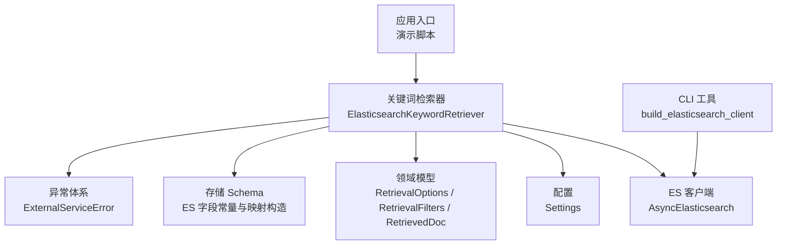
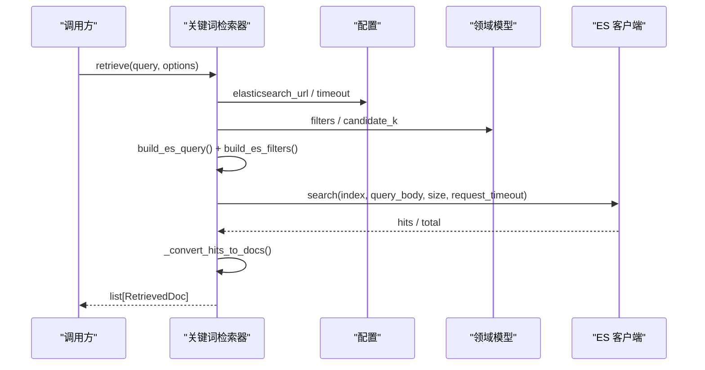
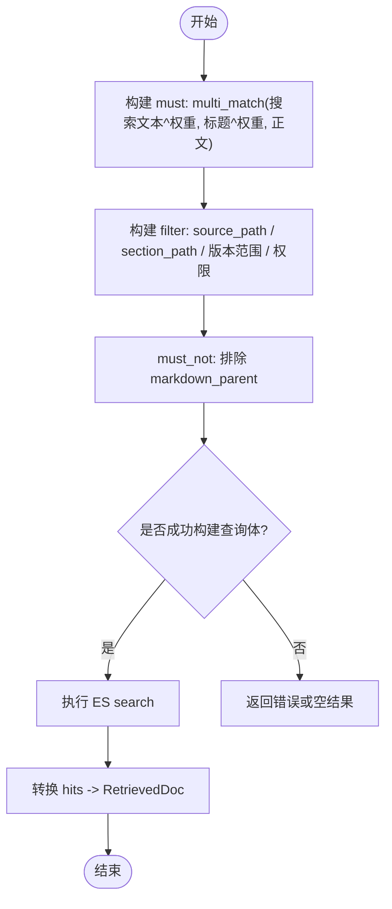
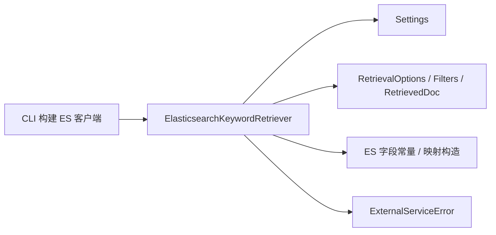

# Elasticsearch 关键词检索器

<cite>
**本文引用的文件**
- [elasticsearch_keyword_retriever.py](file://src/fast_app/components/retrievers/elasticsearch_keyword_retriever.py)
- [rag_store_schema.py](file://src/fast_app/ingestion/stores/rag_store_schema.py)
- [config.py](file://src/fast_app/core/config.py)
- [rag_models.py](file://src/fast_app/domain/rag_models.py)
- [exceptions.py](file://src/fast_app/services/exceptions.py)
- [cli.py](file://src/fast_app/ingestion/cli.py)
- [9-8-超时重试降级与fallback.md](file://learning-docs/phase-9/9-8-超时重试降级与fallback.md)
- [9-7-Milvus ES查询参数显式化.md](file://learning-docs/phase-9/9-7-Milvus ES查询参数显式化.md)
- [elasticsearch_keyword_retriever_demo.py](file://src/app/elasticsearch_keyword_retriever_demo.py)
- [ingest_elasticsearch_docs.py](file://src/app/ingest_elasticsearch_docs.py)
</cite>

## 目录
1. [简介](#简介)
2. [项目结构](#项目结构)
3. [核心组件](#核心组件)
4. [架构总览](#架构总览)
5. [详细组件分析](#详细组件分析)
6. [依赖关系分析](#依赖关系分析)
7. [性能考虑](#性能考虑)
8. [故障排查指南](#故障排查指南)
9. [结论](#结论)
10. [附录：配置与示例](#附录配置与示例)

## 简介
本文件面向 Elasticsearch 关键词检索器的实现与使用，围绕分词器配置、索引映射设计、查询条件构建、权限下推、相关性评分、错误处理与性能调优展开。该检索器基于多字段加权匹配（标题、搜索文本、正文）并结合业务过滤与权限过滤，将 ES 返回结果统一转换为内部领域模型，便于后续混合检索、RRF 融合与重排序阶段复用原始分数。

## 项目结构
关键词检索能力位于 FastAPI 应用的检索组件层，配合配置中心、领域模型、存储 schema 定义以及异常体系共同工作。演示脚本用于快速验证连接、索引创建、批量写入与基础搜索。

图表来源
- [elasticsearch_keyword_retriever.py:210-345](file://src/fast_app/components/retrievers/elasticsearch_keyword_retriever.py#L210-L345)
- [config.py:71-82](file://src/fast_app/core/config.py#L71-L82)
- [rag_models.py:10-37](file://src/fast_app/domain/rag_models.py#L10-L37)
- [rag_store_schema.py:25-140](file://src/fast_app/ingestion/stores/rag_store_schema.py#L25-L140)
- [cli.py:79-106](file://src/fast_app/ingestion/cli.py#L79-L106)
- [exceptions.py:136-142](file://src/fast_app/services/exceptions.py#L136-L142)

章节来源
- [elasticsearch_keyword_retriever.py:210-345](file://src/fast_app/components/retrievers/elasticsearch_keyword_retriever.py#L210-L345)
- [config.py:71-82](file://src/fast_app/core/config.py#L71-L82)
- [rag_store_schema.py:25-140](file://src/fast_app/ingestion/stores/rag_store_schema.py#L25-L140)
- [cli.py:79-106](file://src/fast_app/ingestion/cli.py#L79-L106)
- [rag_models.py:10-37](file://src/fast_app/domain/rag_models.py#L10-L37)
- [exceptions.py:136-142](file://src/fast_app/services/exceptions.py#L136-L142)

## 核心组件
- 关键词检索器：负责构建 ES 查询体、执行搜索、转换命中结果为 RetrievedDoc，并记录耗时、跳过数量等可观测信息。
- 过滤与权限下推：将 source_path、section_path、知识版本、可见性、部门与用户白名单等条件编译为 ES filter，避免召回后再在 Python 侧裁剪。
- 索引与分词：通过统一的 text 字段映射，指定中文分词器 ik_max_word 与 ik_smart，保证索引与搜索一致性。
- 配置与客户端：从 Settings 读取 ES URL、索引名、请求超时；支持可选 basic_auth；提供 close 生命周期管理。
- 领域模型：统一封装检索选项、过滤条件与返回文档，包含多阶段分数明细，便于后续 RRF 与 rerank 复用。

章节来源
- [elasticsearch_keyword_retriever.py:47-207](file://src/fast_app/components/retrievers/elasticsearch_keyword_retriever.py#L47-L207)
- [rag_store_schema.py:58-140](file://src/fast_app/ingestion/stores/rag_store_schema.py#L58-L140)
- [config.py:71-82](file://src/fast_app/core/config.py#L71-L82)
- [rag_models.py:10-69](file://src/fast_app/domain/rag_models.py#L10-L69)

## 架构总览
关键词检索器作为检索管线的一个分支，接收 query 与检索选项，生成 ES 查询体并调用 ES 服务，最终返回统一文档列表。其关键路径包括：查询构建、权限过滤、搜索执行、结果转换、慢操作告警与异常包装。

图表来源
- [elasticsearch_keyword_retriever.py:227-345](file://src/fast_app/components/retrievers/elasticsearch_keyword_retriever.py#L227-L345)
- [config.py:71-82](file://src/fast_app/core/config.py#L71-L82)
- [rag_models.py:10-37](file://src/fast_app/domain/rag_models.py#L10-L37)

## 详细组件分析

### 查询构建与过滤逻辑
- 多字段加权匹配：对搜索文本、标题、正文进行 multi_match，并对标题和搜索文本设置权重，提升相关度。
- 业务过滤：source_path 精确匹配、section_path 多值匹配、知识版本范围过滤。
- 权限过滤：根据 can_read_all、allow_public、allowed_departments、allowed_users 组合 bool should 子句，最小匹配数为 1；若无任何可访问范围则构造必定不命中的 term 以安全兜底。
- 父块排除：初始召回阶段排除 markdown_parent 类型记录，避免父块干扰关键词召回。

图表来源
- [elasticsearch_keyword_retriever.py:47-207](file://src/fast_app/components/retrievers/elasticsearch_keyword_retriever.py#L47-L207)

章节来源
- [elasticsearch_keyword_retriever.py:47-207](file://src/fast_app/components/retrievers/elasticsearch_keyword_retriever.py#L47-L207)

### 权限过滤与下推
- 管理员或高权限用户直接跳过权限过滤。
- 普通用户按“公开文档 OR 部门授权 OR 用户白名单”的 or 语义命中，任一满足即可。
- 若没有任何可访问范围，强制构造不可能命中的 term，防止误放行。

章节来源
- [elasticsearch_keyword_retriever.py:93-133](file://src/fast_app/components/retrievers/elasticsearch_keyword_retriever.py#L93-L133)

### 结果转换与可观测性
- 安全提取 hits，缺失 id 或 content 的 hit 会被跳过并记录日志，避免脏数据进入上下文。
- 保留 keyword_score（即 ES _score），供后续 RRF 与 rerank 复用。
- 记录 start/finish/slow/failed 事件，包含 index、size、filter_count、hit_count、total_value、latency_ms、top_doc_ids 等关键字段。

章节来源
- [elasticsearch_keyword_retriever.py:136-173](file://src/fast_app/components/retrievers/elasticsearch_keyword_retriever.py#L136-L173)
- [elasticsearch_keyword_retriever.py:227-345](file://src/fast_app/components/retrievers/elasticsearch_keyword_retriever.py#L227-L345)

### 分词器与索引映射
- 文本字段统一使用 ik_max_word 作为索引分词器，ik_smart 作为搜索分词器，兼顾切分粒度与搜索效率。
- title 字段额外提供 keyword 子字段，便于需要精确匹配的聚合或过滤场景。
- metadata 子对象包含 source_path、section_path、visibility、allowed_departments、allowed_users 等权限与元数据字段，均为 keyword 类型，利于高效过滤。
- 索引设置默认单分片、零副本，适合本地或测试环境；生产可按需调整。

章节来源
- [rag_store_schema.py:58-140](file://src/fast_app/ingestion/stores/rag_store_schema.py#L58-L140)

### 连接配置与认证
- 检索器默认从 Settings 读取 ES URL 并创建 AsyncElasticsearch；也可由上层注入复用 client。
- CLI 工具集中处理 hosts、request_timeout 与 basic_auth 校验，确保用户名与密码成对出现。
- 请求级超时通过 settings.elasticsearch_request_timeout 传入 search，避免慢查询阻塞链路。

章节来源
- [elasticsearch_keyword_retriever.py:210-225](file://src/fast_app/components/retrievers/elasticsearch_keyword_retriever.py#L210-L225)
- [config.py:71-82](file://src/fast_app/core/config.py#L71-L82)
- [cli.py:79-106](file://src/fast_app/ingestion/cli.py#L79-L106)

### 高级查询能力说明
- 模糊匹配：可通过 ES fuzzy 查询扩展；当前实现未内置，可在 must 中替换 match 为 fuzzy 或添加 fuzzy 子句。
- 短语查询：可使用 ES match_phrase 或 phrase_prefix；当前实现未内置，可在 must 中替换 multi_match 为 match_phrase。
- 布尔逻辑组合：当前已使用 bool.must/filter/must_not 组合业务与权限条件；如需更复杂逻辑，可扩展 must_should 子句。

注意：上述高级语法属于扩展建议，当前代码未直接实现，需在查询构建函数中按需替换或追加子句。

章节来源
- [elasticsearch_keyword_retriever.py:176-207](file://src/fast_app/components/retrievers/elasticsearch_keyword_retriever.py#L176-L207)

## 依赖关系分析
- 检索器依赖配置中心获取 ES 地址与超时；依赖领域模型传递检索选项与过滤条件；依赖存储 schema 提供的字段常量与映射构造；异常体系对外暴露外部服务失败。
- CLI 工具提供独立的 ES 客户端构建逻辑，便于离线任务或运维脚本使用。

图表来源
- [elasticsearch_keyword_retriever.py:210-345](file://src/fast_app/components/retrievers/elasticsearch_keyword_retriever.py#L210-L345)
- [config.py:71-82](file://src/fast_app/core/config.py#L71-L82)
- [rag_models.py:10-69](file://src/fast_app/domain/rag_models.py#L10-L69)
- [rag_store_schema.py:25-140](file://src/fast_app/ingestion/stores/rag_store_schema.py#L25-L140)
- [cli.py:79-106](file://src/fast_app/ingestion/cli.py#L79-L106)
- [exceptions.py:136-142](file://src/fast_app/services/exceptions.py#L136-L142)

章节来源
- [elasticsearch_keyword_retriever.py:210-345](file://src/fast_app/components/retrievers/elasticsearch_keyword_retriever.py#L210-L345)
- [config.py:71-82](file://src/fast_app/core/config.py#L71-L82)
- [rag_models.py:10-69](file://src/fast_app/domain/rag_models.py#L10-L69)
- [rag_store_schema.py:25-140](file://src/fast_app/ingestion/stores/rag_store_schema.py#L25-L140)
- [cli.py:79-106](file://src/fast_app/ingestion/cli.py#L79-L106)
- [exceptions.py:136-142](file://src/fast_app/services/exceptions.py#L136-L142)

## 性能考虑
- 请求级超时：通过 settings.elasticsearch_request_timeout 限制单次 ES 查询时间，避免长尾拖垮整体链路。
- 过滤下推：将 source_path、section_path、版本范围与权限条件放入 filter，不参与评分，减少不必要计算。
- 候选规模控制：通过 options.candidate_k 控制召回数量，平衡召回质量与下游处理成本。
- 慢操作告警：当检索耗时超过阈值时记录 slow 事件，便于定位热点查询或集群压力。
- 索引优化建议：
  - 分片与副本：测试环境使用单分片零副本；生产按数据量与并发调整 number_of_shards 与 number_of_replicas。
  - 分词器：保持索引与搜索分词器一致，避免查询与索引切分不一致导致召回下降。
  - 字段类型：权限与维度字段使用 keyword，提高过滤与聚合性能。
- 缓存策略：ES 本身具备查询缓存；可在网关或上游引入结果缓存以降低重复查询压力。
- 分页策略：关键词检索通常返回 top-k；如需深度分页，建议使用 search_after 或滚动游标，避免 deep pagination 带来的性能问题。

章节来源
- [elasticsearch_keyword_retriever.py:227-345](file://src/fast_app/components/retrievers/elasticsearch_keyword_retriever.py#L227-L345)
- [rag_store_schema.py:71-75](file://src/fast_app/ingestion/stores/rag_store_schema.py#L71-L75)
- [9-8-超时重试降级与fallback.md:146-162](file://learning-docs/phase-9/9-8-超时重试降级与fallback.md#L146-L162)

## 故障排查指南
- 连接与认证：
  - 确认 ELASTICSEARCH_URL 正确；如需认证，ELASTICSEARCH_USERNAME 与 ELASTICSEARCH_PASSWORD 必须同时配置。
  - CLI 会校验用户名与密码是否为空且成对，否则抛出运行时错误。
- 查询失败：
  - 检索器捕获底层异常后记录 failed 事件并包装为 ExternalServiceError，便于上层统一处理。
  - 检查 ES 响应结构是否包含 hits 与 total，缺失时不影响主链路但会影响观测指标。
- 数据质量问题：
  - 若命中结果缺少 id 或 content，会被跳过并记录 skipped_hit_count，提示索引数据可能存在脏数据。
- 慢查询与超时：
  - 关注 slow 事件与 latency_ms；必要时调整 candidate_k、request_timeout 或优化索引与查询。

章节来源
- [cli.py:79-106](file://src/fast_app/ingestion/cli.py#L79-L106)
- [elasticsearch_keyword_retriever.py:227-345](file://src/fast_app/components/retrievers/elasticsearch_keyword_retriever.py#L227-L345)
- [exceptions.py:136-142](file://src/fast_app/services/exceptions.py#L136-L142)

## 结论
该关键词检索器以多字段加权匹配为核心，结合严格的业务与权限过滤，实现了稳定、可观测、可扩展的 ES 关键词检索能力。通过统一的领域模型与异常体系，检索结果可无缝接入混合检索、RRF 与重排序流程。在生产环境中，建议结合索引优化、请求超时、候选规模控制与慢查询告警，保障大规模文档检索的性能与稳定性。

## 附录：配置与示例
- 配置项
  - ELASTICSEARCH_URL：ES 服务地址
  - ELASTICSEARCH_INDEX_NAME：ES 索引名
  - ELASTICSEARCH_USERNAME / ELASTICSEARCH_PASSWORD：可选认证凭据
  - ELASTICSEARCH_REQUEST_TIMEOUT：请求级超时秒数
  - SLOW_RETRIEVAL_THRESHOLD_MS：检索慢操作阈值毫秒
- 运行示例
  - 演示脚本展示了如何初始化检索器、执行检索并打印结果。
  - 导入脚本展示了如何创建索引、批量写入与基础搜索验证。

章节来源
- [config.py:71-82](file://src/fast_app/core/config.py#L71-L82)
- [elasticsearch_keyword_retriever_demo.py:9-34](file://src/app/elasticsearch_keyword_retriever_demo.py#L9-L34)
- [ingest_elasticsearch_docs.py:12-159](file://src/app/ingest_elasticsearch_docs.py#L12-L159)