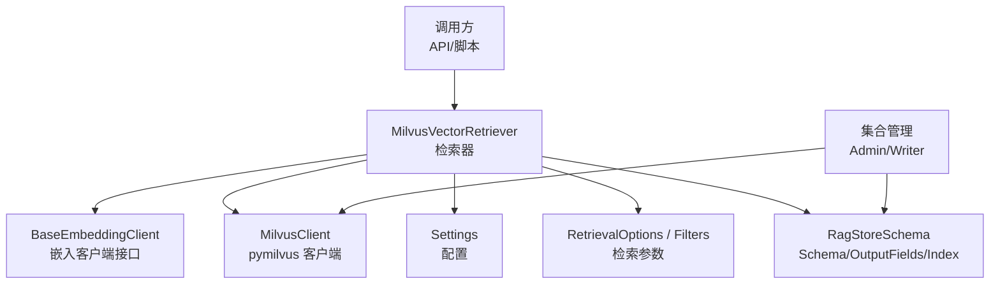
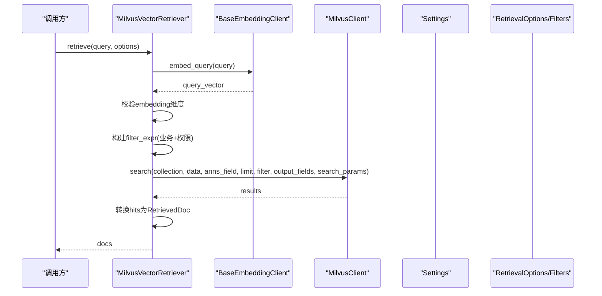
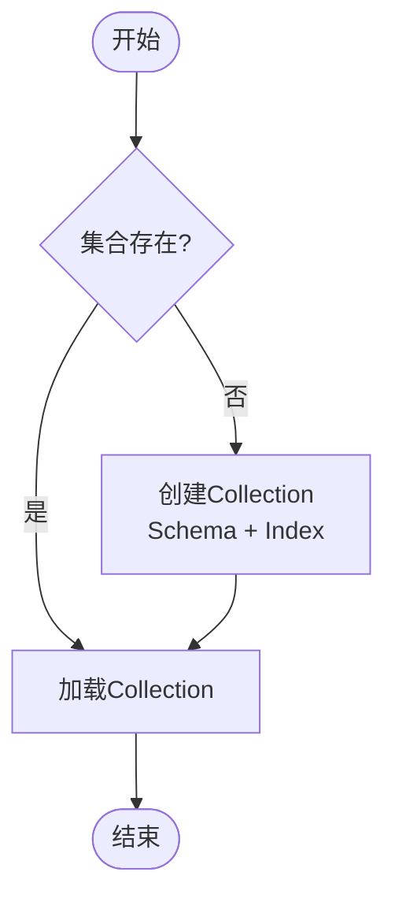
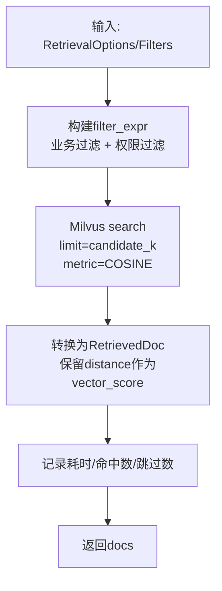
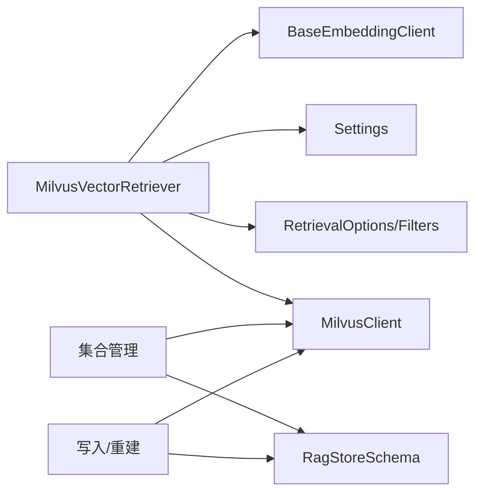

# Milvus 向量检索器

<cite>
**本文引用的文件**
- [milvus_vector_retriever.py](file://src/fast_app/components/retrievers/milvus_vector_retriever.py)
- [rag_store_schema.py](file://src/fast_app/ingestion/stores/rag_store_schema.py)
- [rag_store_admin.py](file://src/fast_app/ingestion/stores/rag_store_admin.py)
- [rag_store_writer.py](file://src/fast_app/ingestion/stores/rag_store_writer.py)
- [config.py](file://src/fast_app/core/config.py)
- [rag_models.py](file://src/fast_app/domain/rag_models.py)
- [base.py](file://src/fast_app/components/embeddings/base.py)
- [rebuild_rag_demo_stores.py](file://scripts/rebuild_rag_demo_stores.py)
- [test_gitlab_enterprise_sync.py](file://scripts/tests/integrations/test_gitlab_enterprise_sync.py)
- [milvus_vector_retriever_demo.py](file://src/app/milvus_vector_retriever_demo.py)
</cite>

## 目录
1. [简介](#简介)
2. [项目结构](#项目结构)
3. [核心组件](#核心组件)
4. [架构总览](#架构总览)
5. [详细组件分析](#详细组件分析)
6. [依赖关系分析](#依赖关系分析)
7. [性能考虑](#性能考虑)
8. [故障排查指南](#故障排查指南)
9. [结论](#结论)
10. [附录：配置与示例](#附录配置与示例)

## 简介
本文件面向使用 Milvus 作为向量存储的 RAG 系统，系统化说明 Milvus 向量检索器的实现原理、连接与集合管理、索引类型选择、查询参数配置、高维向量处理、性能优化策略以及常见问题的排查方法。文档基于仓库中的实际代码进行解读，并提供可追溯的文件路径以便进一步定位实现细节。

## 项目结构
Milvus 向量检索相关能力分布在以下模块：
- 检索器实现：负责将自然语言查询转为向量并执行相似度召回，同时应用业务过滤与权限过滤。
- 集合与索引定义：集中定义 Milvus Collection 的 Schema、输出字段和索引参数。
- 集合管理：提供创建、重建、加载集合等运维能力。
- 配置中心：统一维护 Milvus 连接信息、集合名、字段名、嵌入维度、超时与慢操作阈值等。
- 数据模型：抽象检索选项、过滤条件、返回结果等内部数据结构。
- 嵌入客户端接口：定义向量化 Query 与 Documents 的统一接口。
- 脚本与演示：包含集合重建、插入、冒烟测试及最小化调用示例。

图表来源
- [milvus_vector_retriever.py:155-337](file://src/fast_app/components/retrievers/milvus_vector_retriever.py#L155-L337)
- [rag_store_schema.py:147-279](file://src/fast_app/ingestion/stores/rag_store_schema.py#L147-L279)
- [config.py:58-68](file://src/fast_app/core/config.py#L58-L68)
- [rag_models.py:8-37](file://src/fast_app/domain/rag_models.py#L8-L37)
- [base.py:4-13](file://src/fast_app/components/embeddings/base.py#L4-L13)

章节来源
- [milvus_vector_retriever.py:155-337](file://src/fast_app/components/retrievers/milvus_vector_retriever.py#L155-L337)
- [rag_store_schema.py:147-279](file://src/fast_app/ingestion/stores/rag_store_schema.py#L147-L279)
- [config.py:58-68](file://src/fast_app/core/config.py#L58-L68)
- [rag_models.py:8-37](file://src/fast_app/domain/rag_models.py#L8-L37)
- [base.py:4-13](file://src/fast_app/components/embeddings/base.py#L4-L13)

## 核心组件
- MilvusVectorRetriever：封装“文本转向量 + 过滤构造 + 相似度搜索 + 结果转换”的完整流程，记录关键指标并统一异常包装。
- RagStoreSchema：集中定义 Milvus 集合字段、输出字段列表与索引参数，确保写入与查询一致。
- Settings：集中管理 Milvus 地址、集合名、向量字段名、内容字段名、嵌入维度、慢检索阈值等。
- RetrievalOptions/RetrievalFilters：表达候选数量、输出字段、业务过滤（来源路径、章节）、权限过滤（可见性、部门、用户）与知识版本。
- BaseEmbeddingClient：抽象嵌入客户端，支持异步 embed_query/embed_documents。

章节来源
- [milvus_vector_retriever.py:155-337](file://src/fast_app/components/retrievers/milvus_vector_retriever.py#L155-L337)
- [rag_store_schema.py:147-279](file://src/fast_app/ingestion/stores/rag_store_schema.py#L147-L279)
- [config.py:58-68](file://src/fast_app/core/config.py#L58-L68)
- [rag_models.py:8-37](file://src/fast_app/domain/rag_models.py#L8-L37)
- [base.py:4-13](file://src/fast_app/components/embeddings/base.py#L4-L13)

## 架构总览
下图展示一次向量检索请求从进入检索器到返回结果的完整时序，包括嵌入、过滤、搜索、结果转换与日志埋点。

图表来源
- [milvus_vector_retriever.py:182-337](file://src/fast_app/components/retrievers/milvus_vector_retriever.py#L182-L337)
- [rag_store_schema.py:247-279](file://src/fast_app/ingestion/stores/rag_store_schema.py#L247-L279)
- [config.py:58-68](file://src/fast_app/core/config.py#L58-L68)
- [rag_models.py:8-37](file://src/fast_app/domain/rag_models.py#L8-L37)
- [base.py:4-13](file://src/fast_app/components/embeddings/base.py#L4-L13)

## 详细组件分析

### Milvus 连接与初始化
- 连接 URI：由 host 与 port 拼接得到 HTTP URI，供 pymilvus 客户端使用。
- Client 复用：可在 FastAPI lifespan 中注入共享 MilvusClient；否则检索器根据配置自行创建。
- 配置项：host、port、collection_name、vector_field、id_field、content_field、embedding_dim 等均来自 Settings。

章节来源
- [milvus_vector_retriever.py:40-43](file://src/fast_app/components/retrievers/milvus_vector_retriever.py#L40-L43)
- [milvus_vector_retriever.py:155-179](file://src/fast_app/components/retrievers/milvus_vector_retriever.py#L155-L179)
- [config.py:58-68](file://src/fast_app/core/config.py#L58-L68)

### 集合管理与 Schema
- Schema：定义主键 id、向量字段 embedding、内容 content、标题 title、source、metadata(JSON) 等字段，并设置向量维度。
- Index：对向量字段创建 AUTOINDEX，相似度度量使用 COSINE。
- 输出字段：检索时显式指定需要返回的字段，避免冗余传输。
- 集合生命周期：支持检查是否存在、创建、删除重建、加载集合等。

图表来源
- [rag_store_schema.py:147-279](file://src/fast_app/ingestion/stores/rag_store_schema.py#L147-L279)
- [rag_store_admin.py:95-129](file://src/fast_app/ingestion/stores/rag_store_admin.py#L95-L129)
- [rag_store_writer.py:557-572](file://src/fast_app/ingestion/stores/rag_store_writer.py#L557-L572)
- [rebuild_rag_demo_stores.py:272-319](file://scripts/rebuild_rag_demo_stores.py#L272-L319)

章节来源
- [rag_store_schema.py:147-279](file://src/fast_app/ingestion/stores/rag_store_schema.py#L147-L279)
- [rag_store_admin.py:95-129](file://src/fast_app/ingestion/stores/rag_store_admin.py#L95-L129)
- [rag_store_writer.py:557-572](file://src/fast_app/ingestion/stores/rag_store_writer.py#L557-L572)
- [rebuild_rag_demo_stores.py:272-319](file://scripts/rebuild_rag_demo_stores.py#L272-L319)

### 向量相似度计算与索引类型
- 相似度度量：COSINE，适用于归一化后的向量或关注方向一致性的场景。
- 索引类型：AUTOINDEX，适合快速上手与通用场景；生产可根据数据规模与延迟要求评估其他索引类型。
- 向量维度：由 embedding_dim 决定，必须与写入数据的向量维度一致。

章节来源
- [rag_store_schema.py:271-279](file://src/fast_app/ingestion/stores/rag_store_schema.py#L271-L279)
- [rebuild_rag_demo_stores.py:307-312](file://scripts/rebuild_rag_demo_stores.py#L307-L312)
- [config.py:597-603](file://src/fast_app/core/config.py#L597-L603)

### 查询参数配置与过滤表达式
- 候选数量：candidate_k 控制单次召回的上限。
- 输出字段：output_fields 用于精确控制返回字段，减少网络与序列化开销。
- 业务过滤：source_path、section_path（通过 metadata JSON 数组匹配）。
- 权限过滤：visibility、allowed_departments、allowed_users 等，下推到 Milvus 侧执行，避免无权限数据进入候选集。
- 知识版本：valid_from_version/valid_to_version 控制当前版本可见范围。

图表来源
- [milvus_vector_retriever.py:56-133](file://src/fast_app/components/retrievers/milvus_vector_retriever.py#L56-L133)
- [milvus_vector_retriever.py:182-337](file://src/fast_app/components/retrievers/milvus_vector_retriever.py#L182-L337)
- [rag_models.py:8-37](file://src/fast_app/domain/rag_models.py#L8-L37)

章节来源
- [milvus_vector_retriever.py:56-133](file://src/fast_app/components/retrievers/milvus_vector_retriever.py#L56-L133)
- [milvus_vector_retriever.py:182-337](file://src/fast_app/components/retrievers/milvus_vector_retriever.py#L182-L337)
- [rag_models.py:8-37](file://src/fast_app/domain/rag_models.py#L8-L37)

### 向量嵌入处理
- 嵌入客户端：通过 BaseEmbeddingClient 抽象，支持异步 embed_query。
- 维度校验：检索前校验 query embedding 维度与配置的 embedding_dim 是否一致，不一致直接抛出外部服务错误。
- 日志埋点：记录 embedding 耗时、实际维度、查询长度等，便于定位问题。

章节来源
- [base.py:4-13](file://src/fast_app/components/embeddings/base.py#L4-L13)
- [milvus_vector_retriever.py:198-233](file://src/fast_app/components/retrievers/milvus_vector_retriever.py#L198-L233)
- [config.py:597-603](file://src/fast_app/core/config.py#L597-L603)

### 结果转换与分数
- 原始距离：COSINE 下的 distance 作为 vector_score 保留，便于后续 RRF/精排阶段使用。
- 元数据补齐：将 doc_id、source_path、document_type、chunk_index 等顶层字段回填至 metadata，便于上层溯源。
- 脏数据防护：若缺失 id 或 content，则跳过该 hit 并记录警告，统计 skipped_hit_count。

章节来源
- [milvus_vector_retriever.py:339-409](file://src/fast_app/components/retrievers/milvus_vector_retriever.py#L339-L409)
- [rag_store_schema.py:247-268](file://src/fast_app/ingestion/stores/rag_store_schema.py#L247-L268)

## 依赖关系分析
- 检索器依赖嵌入客户端、配置、数据模型与 Milvus 客户端。
- 集合 Schema 与索引参数由 schema 模块统一管理，写入与查询保持一致。
- 集合管理模块提供创建、重建、加载等操作，保证集合处于可用状态。
- 配置模块集中管理连接、集合、字段、维度、超时与慢操作阈值。

图表来源
- [milvus_vector_retriever.py:155-337](file://src/fast_app/components/retrievers/milvus_vector_retriever.py#L155-L337)
- [rag_store_schema.py:147-279](file://src/fast_app/ingestion/stores/rag_store_schema.py#L147-L279)
- [rag_store_admin.py:95-129](file://src/fast_app/ingestion/stores/rag_store_admin.py#L95-L129)
- [rag_store_writer.py:528-572](file://src/fast_app/ingestion/stores/rag_store_writer.py#L528-L572)
- [config.py:58-68](file://src/fast_app/core/config.py#L58-L68)

章节来源
- [milvus_vector_retriever.py:155-337](file://src/fast_app/components/retrievers/milvus_vector_retriever.py#L155-L337)
- [rag_store_schema.py:147-279](file://src/fast_app/ingestion/stores/rag_store_schema.py#L147-L279)
- [rag_store_admin.py:95-129](file://src/fast_app/ingestion/stores/rag_store_admin.py#L95-L129)
- [rag_store_writer.py:528-572](file://src/fast_app/ingestion/stores/rag_store_writer.py#L528-L572)
- [config.py:58-68](file://src/fast_app/core/config.py#L58-L68)

## 性能考虑
- 批量查询：当前检索器每次传入单个 query vector；如需提升吞吐，可在上层聚合多个查询并发调用或采用批量化策略（注意内存与延迟权衡）。
- 分页检索：Milvus 原生不支持传统 offset 分页，可通过游标或时间戳/ID 区间进行翻页；当前实现未内置分页逻辑，需在上层扩展。
- 超时设置：当前 Milvus 检索未显式设置请求级 timeout；建议结合外部重试与降级策略，避免长尾请求阻塞。
- 慢操作告警：通过 slow_retrieval_threshold_ms 记录慢检索事件，便于定位瓶颈。
- 输出字段精简：仅返回必要字段，降低网络与序列化成本。
- 索引选择：AUTOINDEX 适合通用场景；大规模数据可评估更高效的索引类型与参数。

章节来源
- [milvus_vector_retriever.py:253-265](file://src/fast_app/components/retrievers/milvus_vector_retriever.py#L253-L265)
- [milvus_vector_retriever.py:288-301](file://src/fast_app/components/retrievers/milvus_vector_retriever.py#L288-L301)
- [config.py:41-48](file://src/fast_app/core/config.py#L41-L48)
- [config.py:620-634](file://src/fast_app/core/config.py#L620-L634)

## 故障排查指南
- 连接失败
  - 检查 MILVUS_HOST/MILVUS_PORT 是否正确，URI 拼接是否符合预期。
  - 确认 Milvus 服务可达且端口开放。
  - 参考 URI 构建与客户端初始化位置。
- 集合不存在或未加载
  - 使用集合管理工具检查集合是否存在，必要时重建并加载。
  - 确认 Schema 与 Index 已正确创建。
- 向量维度不匹配
  - 检查 embedding_dim 与嵌入模型输出维度是否一致。
  - 查看检索日志中的维度信息与错误提示。
- 权限过滤导致无结果
  - 检查 filters 中的 department_codes、user_id、allow_public 等是否合理。
  - 确认 metadata 中的 visibility、allowed_departments、allowed_users 是否与权限策略一致。
- 查询性能差
  - 调整 candidate_k、output_fields，减少不必要字段。
  - 评估索引类型与参数，必要时更换索引。
  - 开启慢检索告警，定位热点查询。
- 脏数据导致命中被跳过
  - 关注 skipped_hit_count，检查是否存在缺少 id 或 content 的记录。
  - 修复写入逻辑，确保必填字段完整。

章节来源
- [milvus_vector_retriever.py:40-43](file://src/fast_app/components/retrievers/milvus_vector_retriever.py#L40-L43)
- [milvus_vector_retriever.py:198-233](file://src/fast_app/components/retrievers/milvus_vector_retriever.py#L198-L233)
- [milvus_vector_retriever.py:339-409](file://src/fast_app/components/retrievers/milvus_vector_retriever.py#L339-L409)
- [rag_store_admin.py:95-129](file://src/fast_app/ingestion/stores/rag_store_admin.py#L95-L129)
- [rag_store_schema.py:147-279](file://src/fast_app/ingestion/stores/rag_store_schema.py#L147-L279)

## 结论
Milvus 向量检索器在本项目中实现了“嵌入 + 过滤 + 相似度搜索 + 结果转换”的完整链路，并通过统一的配置与数据模型保障可扩展性与可观测性。集合与索引的定义集中在 schema 模块，便于一致性维护。生产环境建议关注索引选型、超时与重试、慢检索告警与脏数据治理，以提升稳定性与性能。

## 附录：配置与示例
- 连接与集合配置
  - 环境变量：MILVUS_HOST、MILVUS_PORT、MILVUS_COLLECTION_NAME、MILVUS_VECTOR_FIELD、MILVUS_ID_FIELD、MILVUS_CONTENT_FIELD、EMBEDDING_DIM。
  - 用途：构建 URI、确定集合与字段、校验向量维度。
- 索引与相似度
  - 索引类型：AUTOINDEX；相似度：COSINE。
  - 适用场景：通用向量检索；生产可按规模评估其他索引。
- 查询参数
  - top_k：最终返回文档数。
  - candidate_k：候选召回数量。
  - output_fields：显式返回字段。
  - filters：source_path、section_path、department_codes、user_id、allow_public、knowledge_version。
- 示例调用
  - 最小化示例：通过 Qwen 嵌入客户端与 Milvus 检索器执行一次检索，打印命中文档。
  - 集合重建与冒烟测试：创建集合、插入数据、flush/load 后执行 search 验证。

章节来源
- [config.py:58-68](file://src/fast_app/core/config.py#L58-L68)
- [config.py:597-603](file://src/fast_app/core/config.py#L597-L603)
- [rag_store_schema.py:271-279](file://src/fast_app/ingestion/stores/rag_store_schema.py#L271-L279)
- [rag_models.py:27-37](file://src/fast_app/domain/rag_models.py#L27-L37)
- [milvus_vector_retriever_demo.py:8-34](file://src/app/milvus_vector_retriever_demo.py#L8-L34)
- [rebuild_rag_demo_stores.py:272-366](file://scripts/rebuild_rag_demo_stores.py#L272-L366)