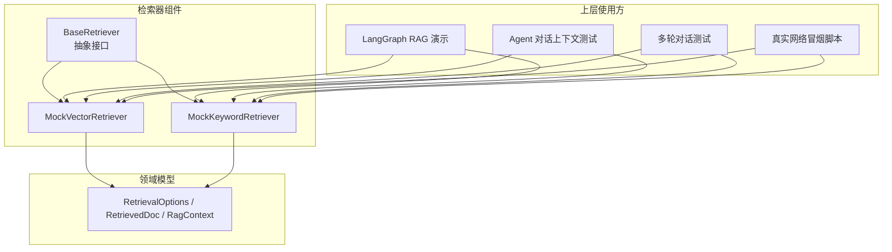
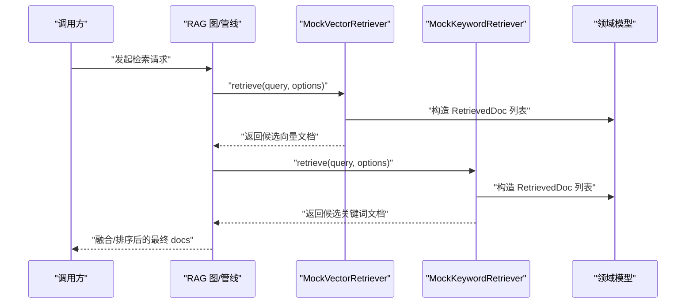
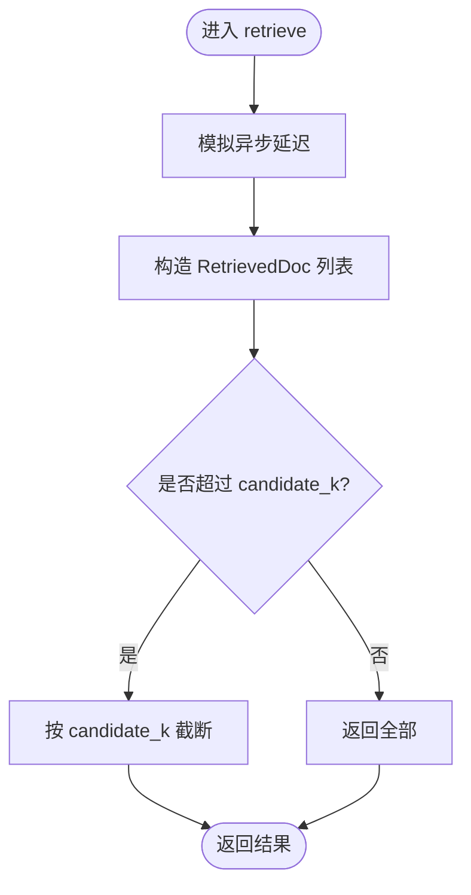
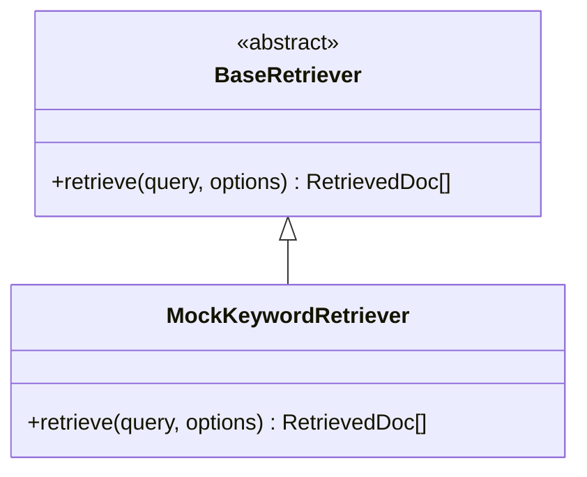
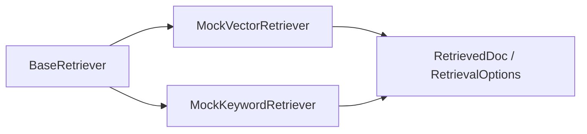

# Mock 检索器实现

<cite>
**本文引用的文件**
- [mock_vector_retriever.py](file://src/fast_app/components/retrievers/mock_vector_retriever.py)
- [mock_keyword_retriever.py](file://src/fast_app/components/retrievers/mock_keyword_retriever.py)
- [base.py](file://src/fast_app/components/retrievers/base.py)
- [rag_models.py](file://src/fast_app/domain/rag_models.py)
- [langgraph_rag_demo.py](file://src/app/langgraph_rag_demo.py)
- [test_agent_conversation_context.py](file://scripts/tests/agent_research/test_agent_conversation_context.py)
- [test_multiturn_rag_agent.py](file://scripts/tests/rag_memory/test_multiturn_rag_agent.py)
- [real_network_enhanced_web_smoke.py](file://.tmp/real_network_enhanced_web_smoke.py)
</cite>

## 目录
1. [简介](#简介)
2. [项目结构](#项目结构)
3. [核心组件](#核心组件)
4. [架构总览](#架构总览)
5. [详细组件分析](#详细组件分析)
6. [依赖关系分析](#依赖关系分析)
7. [性能与稳定性考量](#性能与稳定性考量)
8. [测试与断言指南](#测试与断言指南)
9. [故障排查](#故障排查)
10. [结论](#结论)
11. [附录](#附录)

## 简介
本文件围绕 Mock 检索器的设计与使用进行系统化说明，重点覆盖以下目标：
- 解释 MockVectorRetriever 与 MockKeywordRetriever 的设计目的、适用场景（单元测试、开发调试、端到端冒烟）。
- 说明 Mock 数据的生成策略、模拟响应格式、以及如何在不同链路中注入这些检索器。
- 给出集成测试中的使用方法、如何验证检索结果的格式与结构。
- 提供测试最佳实践：断言策略、边界情况、性能基准建议。

## 项目结构
Mock 检索器位于检索器组件层，遵循统一的抽象基类接口；数据模型定义在领域层；示例与测试用例分布在演示脚本与测试目录中。

图表来源
- [base.py:1-13](file://src/fast_app/components/retrievers/base.py#L1-L13)
- [mock_vector_retriever.py:1-30](file://src/fast_app/components/retrievers/mock_vector_retriever.py#L1-L30)
- [mock_keyword_retriever.py:1-30](file://src/fast_app/components/retrievers/mock_keyword_retriever.py#L1-L30)
- [rag_models.py:1-80](file://src/fast_app/domain/rag_models.py#L1-L80)
- [langgraph_rag_demo.py:1-77](file://src/app/langgraph_rag_demo.py#L1-L77)
- [test_agent_conversation_context.py:190-386](file://scripts/tests/agent_research/test_agent_conversation_context.py#L190-L386)
- [test_multiturn_rag_agent.py:90-289](file://scripts/tests/rag_memory/test_multiturn_rag_agent.py#L90-L289)
- [real_network_enhanced_web_smoke.py:60-181](file://.tmp/real_network_enhanced_web_smoke.py#L60-L181)

章节来源
- [base.py:1-13](file://src/fast_app/components/retrievers/base.py#L1-L13)
- [rag_models.py:1-80](file://src/fast_app/domain/rag_models.py#L1-L80)

## 核心组件
- BaseRetriever：定义统一的异步检索接口 retrieve(query, options) -> list[RetrievedDoc]，所有检索器必须实现该接口。
- MockVectorRetriever：模拟向量检索源（如 Milvus），返回固定候选文档列表，并按 options.candidate_k 截断。
- MockKeywordRetriever：模拟关键词检索源（如 ElasticSearch），返回固定候选文档列表，并按 options.candidate_k 截断。
- 数据模型：RetrievalOptions 控制 top_k/candidate_k/filters/output_fields；RetrievedDoc 描述单条命中结果（id/content/score/source/title/metadata/retrieval_sources/scores）；RagContext 用于构建 LLM 上下文。

章节来源
- [base.py:1-13](file://src/fast_app/components/retrievers/base.py#L1-L13)
- [mock_vector_retriever.py:1-30](file://src/fast_app/components/retrievers/mock_vector_retriever.py#L1-L30)
- [mock_keyword_retriever.py:1-30](file://src/fast_app/components/retrievers/mock_keyword_retriever.py#L1-L30)
- [rag_models.py:1-80](file://src/fast_app/domain/rag_models.py#L1-L80)

## 架构总览
Mock 检索器通过依赖注入的方式接入 LangGraph RAG 图或 Agent Pipeline，使上层流程无需关心真实存储是否可用，即可稳定运行并产出结构化检索结果。

图表来源
- [langgraph_rag_demo.py:14-49](file://src/app/langgraph_rag_demo.py#L14-L49)
- [mock_vector_retriever.py:7-30](file://src/fast_app/components/retrievers/mock_vector_retriever.py#L7-L30)
- [mock_keyword_retriever.py:7-30](file://src/fast_app/components/retrievers/mock_keyword_retriever.py#L7-L30)
- [rag_models.py:27-80](file://src/fast_app/domain/rag_models.py#L27-L80)

## 详细组件分析

### MockVectorRetriever
- 设计目的：在无外部向量库时，快速提供稳定的语义召回结果，便于端到端联调与回归。
- 行为特征：
  - 异步实现，内部包含固定延迟以模拟网络/IO 耗时。
  - 返回固定数量的 RetrievedDoc，其中包含向量源标识与分数。
  - 严格依据 RetrievalOptions.candidate_k 对结果进行截断，保证上游融合逻辑可预期。
- 典型用途：
  - 单元测试：隔离下游向量库异常，专注验证融合与排序逻辑。
  - 开发调试：快速验证 RAG 图节点组合是否正确。
  - 集成测试：配合真实 LLM/Reranker，验证混合检索链路。

图表来源
- [mock_vector_retriever.py:7-30](file://src/fast_app/components/retrievers/mock_vector_retriever.py#L7-L30)
- [rag_models.py:27-37](file://src/fast_app/domain/rag_models.py#L27-L37)

章节来源
- [mock_vector_retriever.py:1-30](file://src/fast_app/components/retrievers/mock_vector_retriever.py#L1-L30)
- [rag_models.py:27-37](file://src/fast_app/domain/rag_models.py#L27-L37)

### MockKeywordRetriever
- 设计目的：在无外部关键词检索服务时，提供稳定的 BM25 风格召回结果，用于混合检索的对比与融合验证。
- 行为特征：
  - 异步实现，包含固定延迟。
  - 返回固定数量的 RetrievedDoc，标注关键词源标识与分数。
  - 同样依据 RetrievalOptions.candidate_k 截断。
- 典型用途：
  - 与 MockVectorRetriever 配对，验证 RRF/精排等融合策略。
  - 在真实网络冒烟脚本中替换外部搜索，确保主流程稳定。

图表来源
- [base.py:1-13](file://src/fast_app/components/retrievers/base.py#L1-L13)
- [mock_keyword_retriever.py:1-30](file://src/fast_app/components/retrievers/mock_keyword_retriever.py#L1-L30)

章节来源
- [mock_keyword_retriever.py:1-30](file://src/fast_app/components/retrievers/mock_keyword_retriever.py#L1-L30)
- [base.py:1-13](file://src/fast_app/components/retrievers/base.py#L1-L13)

### 数据模型与响应格式
- RetrievalOptions：控制 top_k（最终返回数量）、candidate_k（每路候选数）、filters（来源/章节/权限范围）、output_fields（额外字段）。
- RetrievedDoc：包含 id、content、score、source、title、metadata、retrieval_sources、scores 等字段，用于统一表达各阶段结果。
- RagContext：封装 query、docs、context_text，供后续 LLM 生成上下文。

章节来源
- [rag_models.py:1-80](file://src/fast_app/domain/rag_models.py#L1-L80)

### 在演示与测试中的使用方式
- LangGraph 演示：通过 build_rag_graph 注入 Mock 检索器，直接执行图并打印最终状态与来源文档。
- Agent 对话上下文测试：在构建 RagAgentPipeline 时注入 Mock 检索器，验证历史窗口、摘要、路由与安全边界等。
- 多轮对话测试：构建 pipeline 后执行 run/stream/stream_events，验证消息持久化与流式契约。
- 真实网络冒烟：在主图与 Research 工具循环中注入 Mock 检索器，结合真实 LLM 与 Web 工具进行端到端验证。

章节来源
- [langgraph_rag_demo.py:14-49](file://src/app/langgraph_rag_demo.py#L14-L49)
- [test_agent_conversation_context.py:190-386](file://scripts/tests/agent_research/test_agent_conversation_context.py#L190-L386)
- [test_multiturn_rag_agent.py:90-289](file://scripts/tests/rag_memory/test_multiturn_rag_agent.py#L90-L289)
- [real_network_enhanced_web_smoke.py:60-181](file://.tmp/real_network_enhanced_web_smoke.py#L60-L181)

## 依赖关系分析
- 组件耦合：Mock 检索器仅依赖抽象基类与领域模型，不耦合任何外部存储，具备高内聚低耦合特性。
- 直接依赖：
  - BaseRetriever 抽象接口
  - RetrievalOptions、RetrievedDoc 等数据模型
- 间接依赖：
  - 上层 RAG 图/管线负责调用 retrieve 并进行融合、排序、去重等处理。
- 外部依赖：无外部服务依赖，适合离线与 CI 环境。

图表来源
- [base.py:1-13](file://src/fast_app/components/retrievers/base.py#L1-L13)
- [mock_vector_retriever.py:1-30](file://src/fast_app/components/retrievers/mock_vector_retriever.py#L1-L30)
- [mock_keyword_retriever.py:1-30](file://src/fast_app/components/retrievers/mock_keyword_retriever.py#L1-L30)
- [rag_models.py:1-80](file://src/fast_app/domain/rag_models.py#L1-L80)

章节来源
- [base.py:1-13](file://src/fast_app/components/retrievers/base.py#L1-L13)
- [rag_models.py:1-80](file://src/fast_app/domain/rag_models.py#L1-L80)

## 性能与稳定性考量
- 固定延迟：两个 Mock 检索器均包含固定异步延迟，可用于模拟 IO 开销与超时边界测试。
- 结果规模：返回固定数量的候选文档，并通过 candidate_k 控制规模，避免下游压力放大。
- 稳定性：无外部依赖，适合在 CI/CD 中稳定运行，不受网络波动影响。
- 扩展性：如需更复杂场景，可在子类中扩展随机种子、权重分布、错误注入等能力。

## 测试与断言指南

### 单元测试要点
- 接口一致性：验证 retrieve 返回类型为 list[RetrievedDoc]，且长度不超过 options.candidate_k。
- 字段完整性：断言 RetrievedDoc 的 id、content、score、source 等关键字段存在且类型正确。
- 过滤与截断：调整 options.candidate_k，验证返回结果被正确截断。
- 异常路径：若上层期望异常，可通过自定义子类抛出异常以验证容错逻辑。

### 集成测试要点
- 注入方式：在构建 RAG 图或 Pipeline 时注入 MockVectorRetriever 与 MockKeywordRetriever。
- 混合模式：设置 mode="hybrid"，验证向量与关键词两条路径均被调用并参与融合。
- 流式契约：使用 stream/stream_events 验证 token/event 类型与顺序，确保下游消费方兼容。
- 会话隔离：在多用户/多会话场景下，验证 session_id 与 user_id 的隔离效果。

### 断言策略
- 结构断言：检查最终 state 中的 docs 列表结构与字段。
- 内容断言：根据业务需求断言 context 或 answer 中包含关键信息片段。
- 指标断言：统计 sources 数量、平均分数、top_k 命中率等。
- 时序断言：在流式场景中，断言事件序列与 token 输出顺序。

### 边界情况测试
- 空查询：传入空字符串或空白字符，验证检索器与上游处理逻辑的健壮性。
- 极小/极大 top_k：验证 top_k 与 candidate_k 的组合行为。
- 权限过滤：通过 RetrievalFilters 设置部门/版本/公共文档等条件，验证过滤生效。
- 超时与重试：利用固定延迟模拟慢响应，验证超时与重试策略。

### 性能基准测试
- 吞吐：批量并发调用 retrieve，统计 QPS 与 P95/P99 延迟。
- 资源：监控内存与 CPU 占用，评估大规模候选集下的表现。
- 回归：将基准纳入 CI，防止引入性能退化。

章节来源
- [test_agent_conversation_context.py:190-386](file://scripts/tests/agent_research/test_agent_conversation_context.py#L190-L386)
- [test_multiturn_rag_agent.py:90-289](file://scripts/tests/rag_memory/test_multiturn_rag_agent.py#L90-L289)
- [real_network_enhanced_web_smoke.py:60-181](file://.tmp/real_network_enhanced_web_smoke.py#L60-L181)
- [langgraph_rag_demo.py:14-49](file://src/app/langgraph_rag_demo.py#L14-L49)

## 故障排查
- 问题：检索结果为空
  - 检查 options.candidate_k 是否过小或被上游截断。
  - 确认检索器是否被正确注入到图中。
- 问题：分数异常
  - 核对 RetrievedDoc.score 的来源与排序逻辑。
  - 检查融合算法（RRF/精排）是否覆盖了 Mock 分数。
- 问题：流式输出不符合预期
  - 校验 stream/stream_events 的契约，确认下游消费者类型断言。
- 问题：会话污染
  - 验证 session_id/user_id 的隔离机制，确保每次请求独立。

章节来源
- [test_agent_conversation_context.py:190-386](file://scripts/tests/agent_research/test_agent_conversation_context.py#L190-L386)
- [test_multiturn_rag_agent.py:90-289](file://scripts/tests/rag_memory/test_multiturn_rag_agent.py#L90-L289)

## 结论
MockVectorRetriever 与 MockKeywordRetriever 提供了稳定、可控的检索模拟能力，适用于单元、集成与端到端测试。通过统一的抽象接口与清晰的数据模型，它们能够无缝融入 RAG 图与 Agent 管线，帮助团队在不依赖外部存储的情况下高效开发与回归。结合合理的断言策略与边界测试，可以显著提升系统的可靠性与可维护性。

## 附录

### 快速上手：在演示中注入 Mock 检索器
- 步骤：
  - 导入 MockVectorRetriever 与 MockKeywordRetriever。
  - 在构建 RAG 图时注入两者，并可选注入 MockLLMClient。
  - 准备初始 state，调用图的 ainvoke 获取最终状态。
  - 打印 docs 与 answer，验证结构与内容。

章节来源
- [langgraph_rag_demo.py:14-49](file://src/app/langgraph_rag_demo.py#L14-L49)

### 快速上手：在 Agent Pipeline 中使用
- 步骤：
  - 构建 RagAgentPipeline，注入 MockVectorRetriever、MockKeywordRetriever、MockLLMClient、MockReranker。
  - 设置 conversation_memory_store 与 query_rewriter。
  - 调用 run/stream/stream_events，验证消息持久化与流式契约。

章节来源
- [test_agent_conversation_context.py:190-386](file://scripts/tests/agent_research/test_agent_conversation_context.py#L190-L386)
- [test_multiturn_rag_agent.py:90-289](file://scripts/tests/rag_memory/test_multiturn_rag_agent.py#L90-L289)