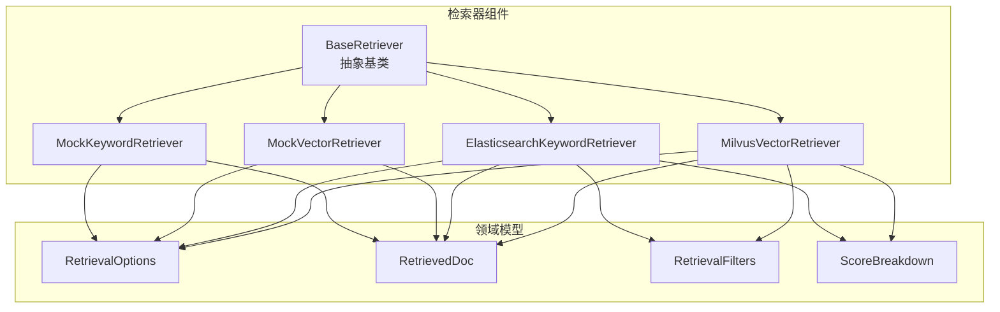
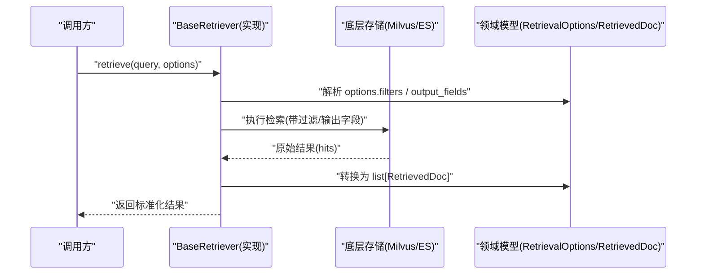
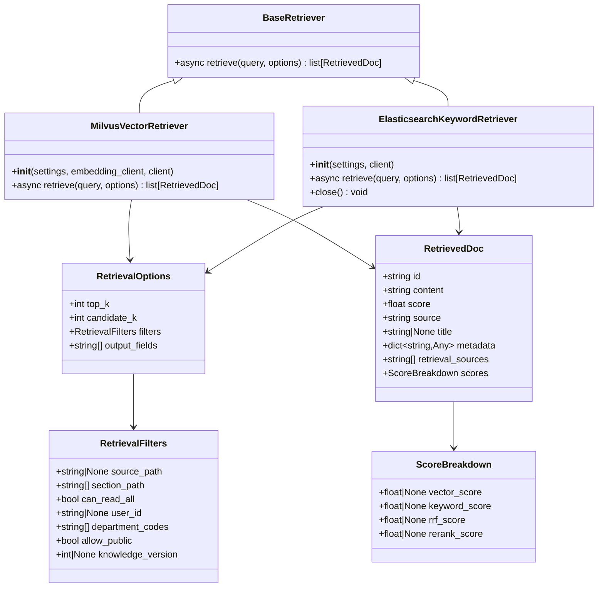
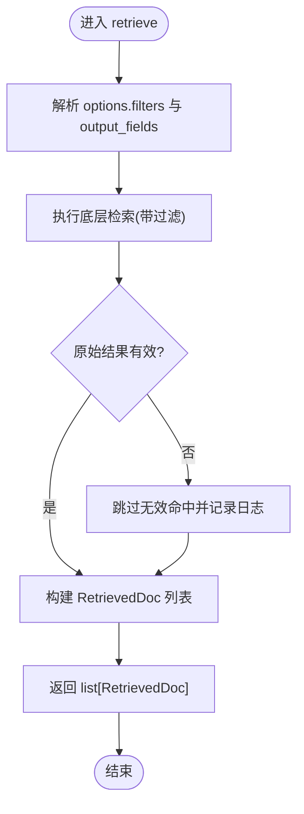

# 检索器抽象基类

<cite>
**本文引用的文件**
- [base.py](file://python-agent-study/src/fast_app/components/retrievers/base.py)
- [rag_models.py](file://python-agent-study/src/fast_app/domain/rag_models.py)
- [milvus_vector_retriever.py](file://python-agent-study/src/fast_app/components/retrievers/milvus_vector_retriever.py)
- [elasticsearch_keyword_retriever.py](file://python-agent-study/src/fast_app/components/retrievers/elasticsearch_keyword_retriever.py)
- [mock_vector_retriever.py](file://python-agent-study/src/fast_app/components/retrievers/mock_vector_retriever.py)
- [mock_keyword_retriever.py](file://python-agent-study/src/fast_app/components/retrievers/mock_keyword_retriever.py)
</cite>

## 目录
1. [简介](#简介)
2. [项目结构](#项目结构)
3. [核心组件](#核心组件)
4. [架构总览](#架构总览)
5. [详细组件分析](#详细组件分析)
6. [依赖关系分析](#依赖关系分析)
7. [性能与可观测性](#性能与可观测性)
8. [故障排查指南](#故障排查指南)
9. [结论](#结论)
10. [附录：自定义检索器开发指南](#附录：自定义检索器开发指南)

## 简介
本文件围绕检索器抽象基类 BaseRetriever 的设计与使用进行系统化说明，重点包括：
- BaseRetriever 的接口规范：retrieve 方法的参数 query、options 与返回值 list[RetrievedDoc]。
- RetrievalOptions 配置项的作用与用法。
- RetrievedDoc 数据模型的结构与字段含义。
- 如何基于 BaseRetriever 实现自定义检索器（含错误处理与异常策略）。
- 结合 Milvus 向量检索器与 Elasticsearch 关键词检索器的实际实现，给出端到端调用流程与排错要点。

## 项目结构
检索器相关代码位于 components/retrievers 目录，抽象基类定义在 base.py；领域数据模型集中在 domain/rag_models.py；具体检索器实现包括 Milvus 向量检索器、Elasticsearch 关键词检索器以及用于测试的 Mock 检索器。

图表来源
- [base.py:1-13](file://python-agent-study/src/fast_app/components/retrievers/base.py#L1-L13)
- [rag_models.py:27-69](file://python-agent-study/src/fast_app/domain/rag_models.py#L27-L69)
- [milvus_vector_retriever.py:155-337](file://python-agent-study/src/fast_app/components/retrievers/milvus_vector_retriever.py#L155-L337)
- [elasticsearch_keyword_retriever.py:210-340](file://python-agent-study/src/fast_app/components/retrievers/elasticsearch_keyword_retriever.py#L210-L340)
- [mock_vector_retriever.py:7-30](file://python-agent-study/src/fast_app/components/retrievers/mock_vector_retriever.py#L7-L30)
- [mock_keyword_retriever.py:7-30](file://python-agent-study/src/fast_app/components/retrievers/mock_keyword_retriever.py#L7-L30)

章节来源
- [base.py:1-13](file://python-agent-study/src/fast_app/components/retrievers/base.py#L1-L13)
- [rag_models.py:27-69](file://python-agent-study/src/fast_app/domain/rag_models.py#L27-L69)

## 核心组件
- BaseRetriever：定义统一的异步检索接口 retrieve(query, options) -> list[RetrievedDoc]，所有检索器必须实现该方法。
- RetrievalOptions：封装检索请求的配置，包括 top_k、candidate_k、filters、output_fields。
- RetrievedDoc：统一返回的命中文档模型，包含 id、content、score、source、title、metadata、retrieval_sources、scores。
- RetrievalFilters：过滤条件，支持 source_path、section_path、权限控制、用户上下文、知识版本等。
- ScoreBreakdown：多阶段分数明细，便于后续融合与精排。

章节来源
- [base.py:6-13](file://python-agent-study/src/fast_app/components/retrievers/base.py#L6-L13)
- [rag_models.py:27-69](file://python-agent-study/src/fast_app/domain/rag_models.py#L27-L69)

## 架构总览
检索器通过统一的 BaseRetriever 抽象，屏蔽底层存储差异（向量库、搜索引擎），上层服务只需面向接口调用 retrieve 方法，即可获取标准化的 RetrievedDoc 列表。

图表来源
- [milvus_vector_retriever.py:182-337](file://python-agent-study/src/fast_app/components/retrievers/milvus_vector_retriever.py#L182-L337)
- [elasticsearch_keyword_retriever.py:227-340](file://python-agent-study/src/fast_app/components/retrievers/elasticsearch_keyword_retriever.py#L227-L340)
- [rag_models.py:27-69](file://python-agent-study/src/fast_app/domain/rag_models.py#L27-L69)

## 详细组件分析

### BaseRetriever 抽象基类
- 设计目标：为不同检索后端提供统一异步接口，确保上层调用一致性与可替换性。
- 接口规范：
  - 方法名：retrieve
  - 参数：
    - query: str，用户查询文本
    - options: RetrievalOptions，检索配置
  - 返回值：list[RetrievedDoc]，标准化命中文档列表
- 扩展点：子类负责将底层存储结果映射到 RetrievedDoc，并处理错误与日志。

章节来源
- [base.py:6-13](file://python-agent-study/src/fast_app/components/retrievers/base.py#L6-L13)

### RetrievalOptions 配置选项
- top_k: int，最终返回给上游的文档数量。
- candidate_k: int，每个召回源或融合前取的候选数量。
- filters: RetrievalFilters，业务与权限过滤条件。
- output_fields: list[str]，底层引擎需要返回的额外字段名。

使用建议：
- 当需要更精细的候选集时，设置 candidate_k >= top_k。
- 通过 filters 限定 source_path、section_path、部门与用户可见范围。
- 通过 output_fields 指定下游需要的元数据字段，减少二次读取。

章节来源
- [rag_models.py:27-36](file://python-agent-study/src/fast_app/domain/rag_models.py#L27-L36)

### RetrievedDoc 数据模型
- id: str，命中的 chunk ID。
- content: str，chunk 完整文本内容。
- score: float，当前阶段用于排序的最终分数。
- source: str，主要检索来源（如 milvus、elasticsearch）。
- title: str | None，chunk 所属标题。
- metadata: dict[str, Any]，结构化元数据（如 source_path、section_path、department_codes）。
- retrieval_sources: list[str]，实际命中过该 chunk 的召回来源列表。
- scores: ScoreBreakdown，多阶段检索和排序分数明细（vector_score、keyword_score、rrf_score、rerank_score）。

用途：
- 作为检索链路的标准产物，供融合、重排、上下文构建等后续环节消费。
- 保留多阶段分数与来源信息，便于评测与调试。

章节来源
- [rag_models.py:52-69](file://python-agent-study/src/fast_app/domain/rag_models.py#L52-L69)

### Milvus 向量检索器实现要点
- 职责：生成 query embedding、构造 Milvus filter、执行 search、转换 hits 为 RetrievedDoc。
- 关键逻辑：
  - 校验 embedding 维度与配置是否匹配，不匹配则抛出外部服务错误。
  - 将 RetrievalFilters 转为 Milvus filter 表达式，包含业务过滤与权限过滤。
  - 记录 embedding 耗时、filter_expr、output_fields、命中数、跳过数等日志。
  - 对缺失 id 或 content 的 hit 进行跳过并计数，避免脏数据进入上下文。
- 错误处理：捕获外部服务异常并包装为 ExternalServiceError，同时记录慢操作日志。

章节来源
- [milvus_vector_retriever.py:155-337](file://python-agent-study/src/fast_app/components/retrievers/milvus_vector_retriever.py#L155-L337)

### Elasticsearch 关键词检索器实现要点
- 职责：构造 ES 查询体、执行 search、转换 hits 为 RetrievedDoc。
- 关键逻辑：
  - 将 RetrievalFilters 转为 ES bool.filter，包含业务过滤与权限过滤。
  - 使用 multi_match 在搜索文本、标题、内容上进行关键词匹配。
  - 记录请求体、filter 数量、耗时、命中总数、跳过数等日志。
  - 对缺失 id 或 content 的 hit 进行跳过并计数。
- 错误处理：捕获异常并包装为 ExternalServiceError，记录慢操作日志。

章节来源
- [elasticsearch_keyword_retriever.py:210-340](file://python-agent-study/src/fast_app/components/retrievers/elasticsearch_keyword_retriever.py#L210-L340)

### Mock 检索器（测试用）
- MockVectorRetriever/MockKeywordRetriever：模拟异步检索，返回固定 RetrievedDoc 列表，便于单元测试与集成测试。
- 特点：遵循 BaseRetriever 接口，按 options.candidate_k 截断返回结果。

章节来源
- [mock_vector_retriever.py:7-30](file://python-agent-study/src/fast_app/components/retrievers/mock_vector_retriever.py#L7-L30)
- [mock_keyword_retriever.py:7-30](file://python-agent-study/src/fast_app/components/retrievers/mock_keyword_retriever.py#L7-L30)

## 依赖关系分析
- BaseRetriever 依赖领域模型 RetrievalOptions、RetrievedDoc。
- MilvusVectorRetriever 依赖 Settings、EmbeddingClient、MilvusClient 及 RAG 存储 schema 常量。
- ElasticsearchKeywordRetriever 依赖 Settings、AsyncElasticsearch 及 RAG 存储 schema 常量。
- 两者均通过 RetrievalFilters 下推权限与业务过滤至存储层，提升召回效率与安全性。

图表来源
- [base.py:6-13](file://python-agent-study/src/fast_app/components/retrievers/base.py#L6-L13)
- [milvus_vector_retriever.py:155-337](file://python-agent-study/src/fast_app/components/retrievers/milvus_vector_retriever.py#L155-L337)
- [elasticsearch_keyword_retriever.py:210-340](file://python-agent-study/src/fast_app/components/retrievers/elasticsearch_keyword_retriever.py#L210-L340)
- [rag_models.py:27-69](file://python-agent-study/src/fast_app/domain/rag_models.py#L27-L69)

章节来源
- [milvus_vector_retriever.py:155-337](file://python-agent-study/src/fast_app/components/retrievers/milvus_vector_retriever.py#L155-L337)
- [elasticsearch_keyword_retriever.py:210-340](file://python-agent-study/src/fast_app/components/retrievers/elasticsearch_keyword_retriever.py#L210-L340)
- [rag_models.py:27-69](file://python-agent-study/src/fast_app/domain/rag_models.py#L27-L69)

## 性能与可观测性
- 延迟监控：检索器在开始与结束时记录耗时，并通过 log_slow_operation 标记慢操作。
- 指标记录：embedding 耗时、filter_expr、output_fields、命中数、跳过数、top_doc_ids 等。
- 降级与保护：外部服务异常统一包装为 ExternalServiceError，避免污染上层调用栈。
- 资源管理：ES 检索器提供 close 方法以关闭客户端连接。

章节来源
- [milvus_vector_retriever.py:194-337](file://python-agent-study/src/fast_app/components/retrievers/milvus_vector_retriever.py#L194-L337)
- [elasticsearch_keyword_retriever.py:239-340](file://python-agent-study/src/fast_app/components/retrievers/elasticsearch_keyword_retriever.py#L239-L340)

## 故障排查指南
常见问题与定位要点：
- 向量维度不匹配：检查 embedding_dim 与实际向量长度，查看 milvus.embedding.finish 与 milvus.search.failed 日志。
- 无命中或命中数异常：核对 RetrievalFilters 是否正确下推（source_path、section_path、权限），观察 filter_expr 与 total_value。
- 脏数据导致跳过：关注 skipped_hit_count 与 hit.skipped 日志，确认 id/content 是否存在。
- 慢查询：根据 slow_retrieval_threshold_ms 阈值与事件名称定位慢操作，优化 candidate_k、filter 复杂度或索引。

章节来源
- [milvus_vector_retriever.py:215-337](file://python-agent-study/src/fast_app/components/retrievers/milvus_vector_retriever.py#L215-L337)
- [elasticsearch_keyword_retriever.py:260-340](file://python-agent-study/src/fast_app/components/retrievers/elasticsearch_keyword_retriever.py#L260-L340)

## 结论
BaseRetriever 提供了稳定、可扩展的检索接口，配合 RetrievalOptions 与 RetrievedDoc 实现了检索过程与结果的标准化。Milvus 与 Elasticsearch 的具体实现展示了如何将业务与权限过滤下推到存储层，并通过完善的日志与异常处理保障可观测性与稳定性。基于此抽象，开发者可以便捷地实现自定义检索器，满足多样化检索需求。

## 附录：自定义检索器开发指南

### 步骤概览
1. 继承 BaseRetriever 并实现异步 retrieve 方法。
2. 接收 query 与 options，解析 RetrievalFilters 与 output_fields。
3. 调用底层存储执行检索，并将原始结果转换为 RetrievedDoc。
4. 记录必要的日志与指标，处理异常并统一包装为外部服务错误。
5. 返回 list[RetrievedDoc]，必要时按 options.candidate_k 截断。

### 参考流程图

图表来源
- [milvus_vector_retriever.py:339-409](file://python-agent-study/src/fast_app/components/retrievers/milvus_vector_retriever.py#L339-L409)
- [elasticsearch_keyword_retriever.py:347-399](file://python-agent-study/src/fast_app/components/retrievers/elasticsearch_keyword_retriever.py#L347-L399)

### 示例：最小化自定义检索器
以下为一个概念性示例，展示如何基于 BaseRetriever 实现一个简单检索器（仅示意，非仓库内代码）：
- 继承 BaseRetriever。
- 实现 async def retrieve(self, query: str, options: RetrievalOptions) -> list[RetrievedDoc]。
- 根据 options.candidate_k 返回若干 RetrievedDoc。
- 若底层调用失败，抛出 ExternalServiceError 并记录日志。

注意：请勿直接复制仓库中任何实现细节，应依据自身存储与业务需求编写。

章节来源
- [base.py:6-13](file://python-agent-study/src/fast_app/components/retrievers/base.py#L6-L13)
- [mock_vector_retriever.py:7-30](file://python-agent-study/src/fast_app/components/retrievers/mock_vector_retriever.py#L7-L30)
- [mock_keyword_retriever.py:7-30](file://python-agent-study/src/fast_app/components/retrievers/mock_keyword_retriever.py#L7-L30)