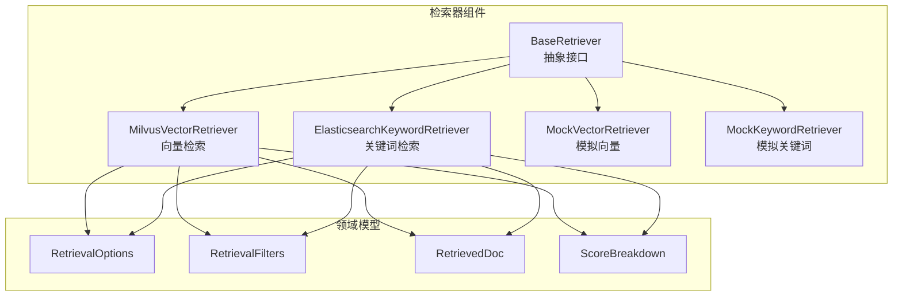
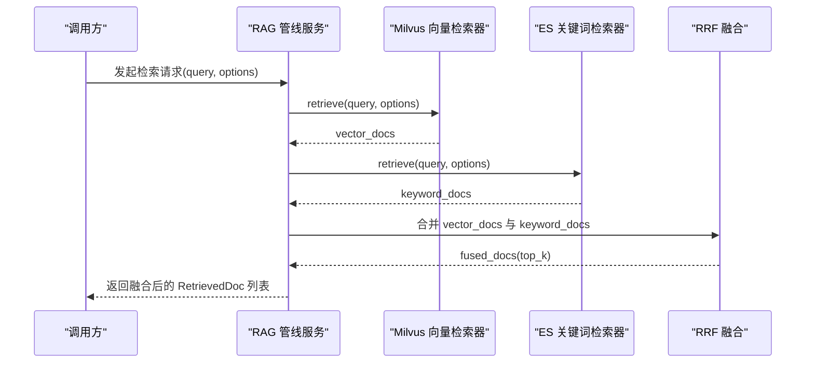
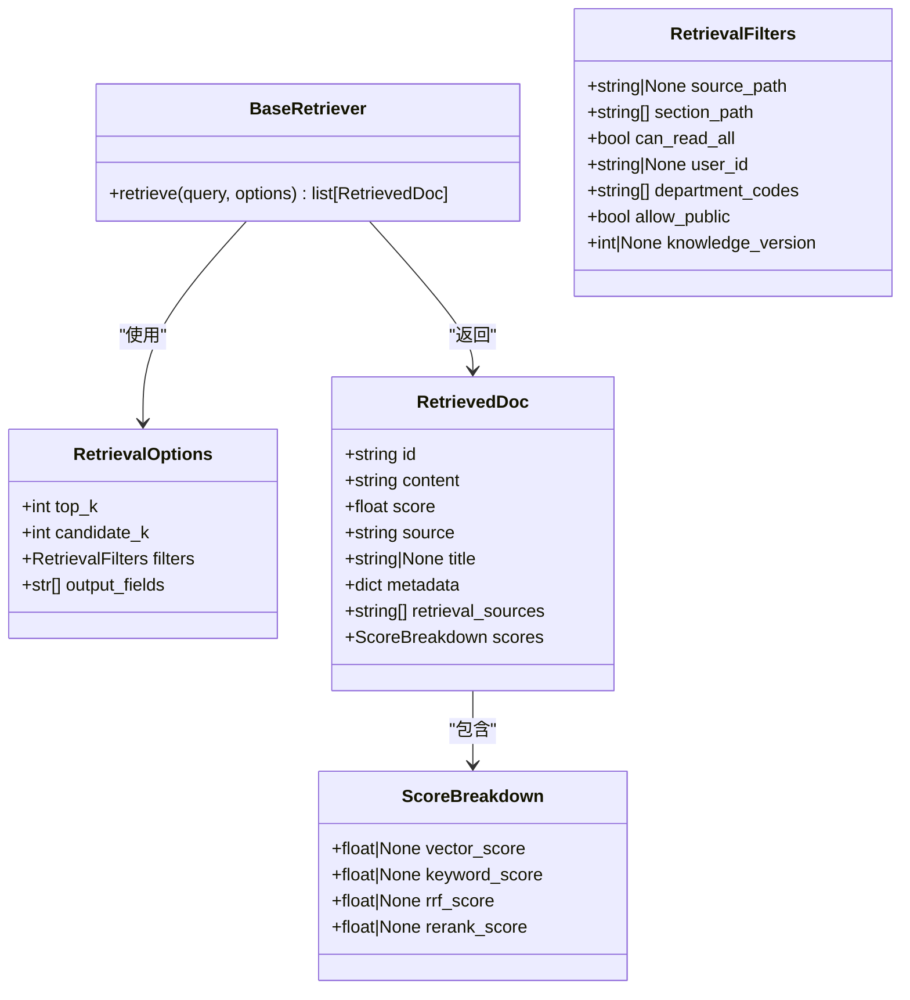
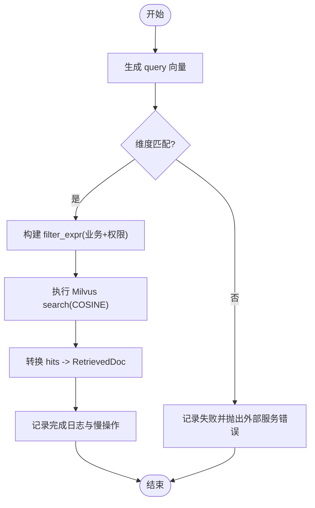
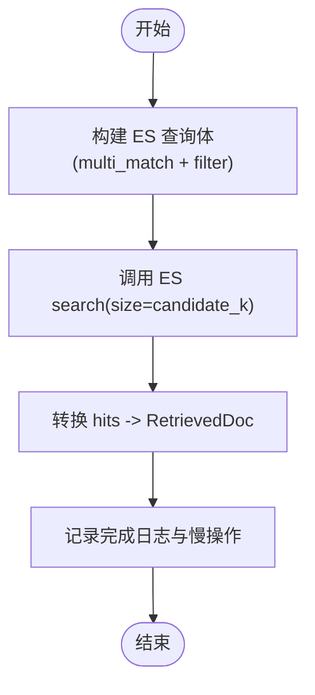
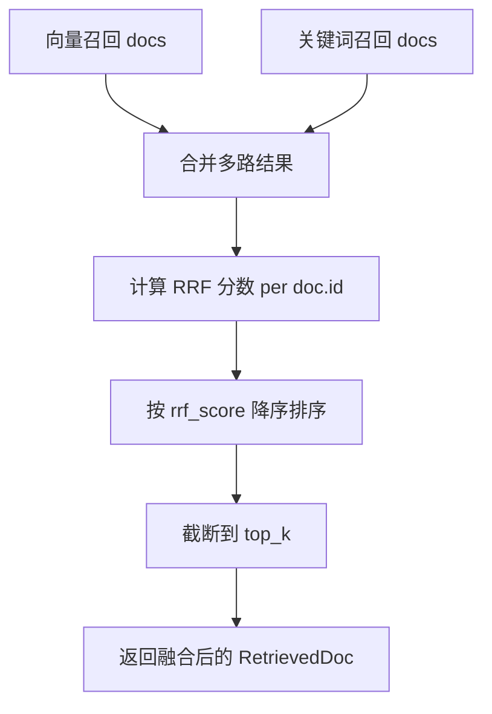
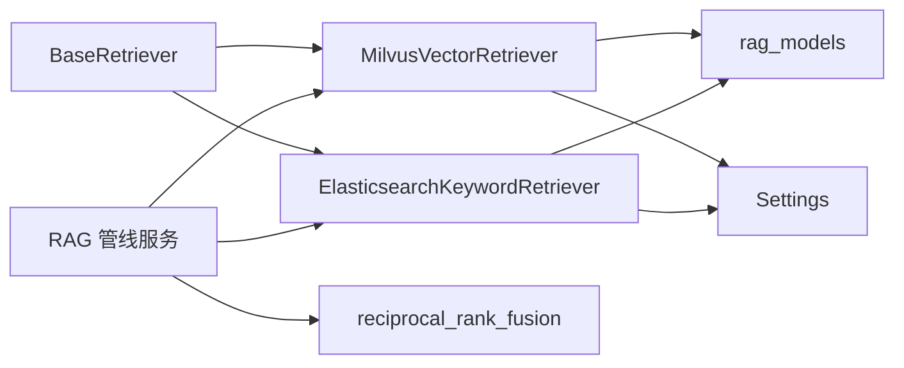

# 检索器组件

<cite>
**本文引用的文件**
- [base.py](file://src/fast_app/components/retrievers/base.py)
- [milvus_vector_retriever.py](file://src/fast_app/components/retrievers/milvus_vector_retriever.py)
- [elasticsearch_keyword_retriever.py](file://src/fast_app/components/retrievers/elasticsearch_keyword_retriever.py)
- [mock_vector_retriever.py](file://src/fast_app/components/retrievers/mock_vector_retriever.py)
- [mock_keyword_retriever.py](file://src/fast_app/components/retrievers/mock_keyword_retriever.py)
- [rag_models.py](file://src/fast_app/domain/rag_models.py)
- [config.py](file://src/fast_app/core/config.py)
- [retrieval_fusion.py](file://src/fast_app/services/rag/retrieval_fusion.py)
- [rag_pipeline_service.py](file://src/fast_app/services/rag/rag_pipeline_service.py)
</cite>

## 目录
1. [简介](#简介)
2. [项目结构](#项目结构)
3. [核心组件](#核心组件)
4. [架构总览](#架构总览)
5. [详细组件分析](#详细组件分析)
6. [依赖关系分析](#依赖关系分析)
7. [性能与优化](#性能与优化)
8. [故障排查指南](#故障排查指南)
9. [结论](#结论)
10. [附录：配置、查询语法与自定义开发](#附录：配置查询语法与自定义开发)

## 简介
本组件文档聚焦于 RAG 系统中的检索层，围绕统一抽象基类与 Provider 模式，说明 Milvus 向量检索器与 Elasticsearch 关键词检索器的实现差异、权限下推、日志与慢操作告警、以及混合检索的 RRF 融合策略。同时提供配置参数、查询语法、性能优化建议与自定义检索器的开发指南。

## 项目结构
检索器位于 fast_app/components/retrievers 目录下，采用“抽象基类 + 多实现”的结构：
- BaseRetriever：定义统一的异步 retrieve(query, options) 接口。
- MilvusVectorRetriever：基于 pymilvus 的向量相似度检索。
- ElasticsearchKeywordRetriever：基于 elasticsearch 的关键词匹配检索。
- Mock 实现：用于测试与演示。

图表来源
- [base.py:5-13](file://src/fast_app/components/retrievers/base.py#L5-L13)
- [milvus_vector_retriever.py:155-186](file://src/fast_app/components/retrievers/milvus_vector_retriever.py#L155-L186)
- [elasticsearch_keyword_retriever.py:210-231](file://src/fast_app/components/retrievers/elasticsearch_keyword_retriever.py#L210-L231)
- [rag_models.py:8-80](file://src/fast_app/domain/rag_models.py#L8-L80)

章节来源
- [base.py:5-13](file://src/fast_app/components/retrievers/base.py#L5-L13)
- [rag_models.py:8-80](file://src/fast_app/domain/rag_models.py#L8-L80)

## 核心组件
- 抽象基类 BaseRetriever
  - 定义异步方法 retrieve(query, options)，返回 RetrievedDoc 列表。
  - 通过 RetrievalOptions 传入 top_k、candidate_k、filters、output_fields 等控制参数。
  - 通过 RetrievalFilters 注入 source_path、section_path、权限范围、知识版本等业务过滤条件。

- Milvus 向量检索器
  - 使用 embedding_client 将 query 转为向量，校验维度后调用 MilvusClient.search。
  - 构建 filter_expr 包含业务过滤与权限过滤，并在搜索阶段下推。
  - 将原始 hits 转换为 RetrievedDoc，保留 vector_score 并记录 skipped_hit_count。

- Elasticsearch 关键词检索器
  - 构造 multi_match 查询，结合 IK 分词字段权重，并通过 bool.filter 注入业务与权限过滤。
  - 将 ES hits 转换为 RetrievedDoc，保留 keyword_score，同样统计 skipped_hit_count。

- 混合检索与 RRF 融合
  - 并行或顺序执行向量与关键词召回，收集成功结果后调用 reciprocal_rank_fusion 进行融合排序。
  - 融合后更新 RetrievedDoc.scores.rrf_score 与 retrieval_sources。

章节来源
- [base.py:5-13](file://src/fast_app/components/retrievers/base.py#L5-L13)
- [milvus_vector_retriever.py:155-186](file://src/fast_app/components/retrievers/milvus_vector_retriever.py#L155-L186)
- [elasticsearch_keyword_retriever.py:210-231](file://src/fast_app/components/retrievers/elasticsearch_keyword_retriever.py#L210-L231)
- [retrieval_fusion.py:8-79](file://src/fast_app/services/rag/retrieval_fusion.py#L8-L79)
- [rag_pipeline_service.py:1387-1420](file://src/fast_app/services/rag/rag_pipeline_service.py#L1387-L1420)

## 架构总览
检索层通过 Provider 模式解耦后端存储，上层仅依赖 BaseRetriever 接口；具体后端由配置决定（mock、milvus、elasticsearch）。混合检索在管线服务中组合多个 retriever 的结果，并使用 RRF 融合。

图表来源
- [milvus_vector_retriever.py:182-303](file://src/fast_app/components/retrievers/milvus_vector_retriever.py#L182-L303)
- [elasticsearch_keyword_retriever.py:227-340](file://src/fast_app/components/retrievers/elasticsearch_keyword_retriever.py#L227-L340)
- [retrieval_fusion.py:8-79](file://src/fast_app/services/rag/retrieval_fusion.py#L8-L79)
- [rag_pipeline_service.py:1387-1420](file://src/fast_app/services/rag/rag_pipeline_service.py#L1387-L1420)

## 详细组件分析

### 抽象基类与数据模型
- BaseRetriever 定义统一异步检索接口，屏蔽后端差异。
- RetrievalOptions 控制候选数量、输出字段与过滤条件。
- RetrievalFilters 承载业务与权限过滤，如 source_path、section_path、department_codes、user_id、knowledge_version、allow_public、can_read_all。
- RetrievedDoc 与 ScoreBreakdown 统一封装命中结果与多阶段分数明细。

图表来源
- [base.py:5-13](file://src/fast_app/components/retrievers/base.py#L5-L13)
- [rag_models.py:8-80](file://src/fast_app/domain/rag_models.py#L8-L80)

章节来源
- [base.py:5-13](file://src/fast_app/components/retrievers/base.py#L5-L13)
- [rag_models.py:8-80](file://src/fast_app/domain/rag_models.py#L8-L80)

### Milvus 向量检索器
- 初始化：可注入复用 MilvusClient，否则根据 Settings 创建 URI 连接。
- 检索流程：
  - 生成 query embedding 并校验维度，不匹配则抛出外部服务错误。
  - 构建 filter_expr：source_path、section_path、knowledge_version 与权限表达式组合。
  - 调用 search 并记录 metric_type=COSINE、limit=candidate_k、output_fields。
  - 转换 hits 为 RetrievedDoc，记录 skipped_hit_count 与 top_doc_ids。
  - 记录慢操作与异常事件，统一包装为 ExternalServiceError。

图表来源
- [milvus_vector_retriever.py:155-186](file://src/fast_app/components/retrievers/milvus_vector_retriever.py#L155-L186)
- [milvus_vector_retriever.py:182-303](file://src/fast_app/components/retrievers/milvus_vector_retriever.py#L182-L303)
- [milvus_vector_retriever.py:339-410](file://src/fast_app/components/retrievers/milvus_vector_retriever.py#L339-L410)

章节来源
- [milvus_vector_retriever.py:155-186](file://src/fast_app/components/retrievers/milvus_vector_retriever.py#L155-L186)
- [milvus_vector_retriever.py:182-303](file://src/fast_app/components/retrievers/milvus_vector_retriever.py#L182-L303)
- [milvus_vector_retriever.py:339-410](file://src/fast_app/components/retrievers/milvus_vector_retriever.py#L339-L410)

### Elasticsearch 关键词检索器
- 初始化：可注入复用 AsyncElasticsearch，否则根据 Settings 创建客户端。
- 查询构造：
  - multi_match 对搜索文本、标题、内容加权匹配。
  - bool.filter 注入 source_path、section_path、knowledge_version 与权限过滤。
  - must_not 排除父块类型，避免初始召回污染。
- 检索流程：
  - 记录 start 日志（含 analyzer、size、timeout、filter_count）。
  - 调用 ES search，转换 hits 为 RetrievedDoc，记录 skipped_hit_count。
  - 记录 finish 与慢操作，异常时统一包装为 ExternalServiceError。

图表来源
- [elasticsearch_keyword_retriever.py:176-207](file://src/fast_app/components/retrievers/elasticsearch_keyword_retriever.py#L176-L207)
- [elasticsearch_keyword_retriever.py:227-340](file://src/fast_app/components/retrievers/elasticsearch_keyword_retriever.py#L227-L340)
- [elasticsearch_keyword_retriever.py:347-399](file://src/fast_app/components/retrievers/elasticsearch_keyword_retriever.py#L347-L399)

章节来源
- [elasticsearch_keyword_retriever.py:176-207](file://src/fast_app/components/retrievers/elasticsearch_keyword_retriever.py#L176-L207)
- [elasticsearch_keyword_retriever.py:227-340](file://src/fast_app/components/retrievers/elasticsearch_keyword_retriever.py#L227-L340)
- [elasticsearch_keyword_retriever.py:347-399](file://src/fast_app/components/retrievers/elasticsearch_keyword_retriever.py#L347-L399)

### 混合检索与 RRF 融合算法
- 管线服务在成功召回后调用 reciprocal_rank_fusion，输入为各路 RetrievedDoc 列表。
- RRF 计算：对每路 rank 位置 i 的文档累加 1/(k+i)，按 doc.id 去重合并，取最高原始 score 的文档对象，更新 rrf_score 与 retrieval_sources。
- 最终按 rrf_score 降序截断到 top_k。

图表来源
- [retrieval_fusion.py:8-79](file://src/fast_app/services/rag/retrieval_fusion.py#L8-L79)
- [rag_pipeline_service.py:1387-1420](file://src/fast_app/services/rag/rag_pipeline_service.py#L1387-L1420)

章节来源
- [retrieval_fusion.py:8-79](file://src/fast_app/services/rag/retrieval_fusion.py#L8-L79)
- [rag_pipeline_service.py:1387-1420](file://src/fast_app/services/rag/rag_pipeline_service.py#L1387-L1420)

## 依赖关系分析
- 检索器依赖领域模型 rag_models，统一输入输出契约。
- Milvus 检索器依赖 embeddings 客户端与 Settings；ES 检索器依赖 Settings 与 AsyncElasticsearch。
- 混合检索依赖 services/rag/retrieval_fusion 与管线服务编排。

图表来源
- [base.py:5-13](file://src/fast_app/components/retrievers/base.py#L5-L13)
- [milvus_vector_retriever.py:155-186](file://src/fast_app/components/retrievers/milvus_vector_retriever.py#L155-L186)
- [elasticsearch_keyword_retriever.py:210-231](file://src/fast_app/components/retrievers/elasticsearch_keyword_retriever.py#L210-L231)
- [rag_models.py:8-80](file://src/fast_app/domain/rag_models.py#L8-L80)
- [config.py:58-82](file://src/fast_app/core/config.py#L58-L82)
- [retrieval_fusion.py:8-79](file://src/fast_app/services/rag/retrieval_fusion.py#L8-L79)
- [rag_pipeline_service.py:1387-1420](file://src/fast_app/services/rag/rag_pipeline_service.py#L1387-L1420)

章节来源
- [rag_models.py:8-80](file://src/fast_app/domain/rag_models.py#L8-L80)
- [config.py:58-82](file://src/fast_app/core/config.py#L58-L82)
- [retrieval_fusion.py:8-79](file://src/fast_app/services/rag/retrieval_fusion.py#L8-L79)
- [rag_pipeline_service.py:1387-1420](file://src/fast_app/services/rag/rag_pipeline_service.py#L1387-L1420)

## 性能与优化
- 向量检索
  - 确保 embedding_dim 与 collection 一致，避免维度不匹配导致的失败。
  - 合理设置 candidate_k，平衡召回质量与延迟。
  - 使用 COSINE 度量，配合合适的索引与分区策略。
  - 利用 filter 下推减少无效候选集。

- 关键词检索
  - 使用 IK 分词器，针对中文场景提升召回率。
  - 通过 multi_match 字段权重提高标题与正文相关性。
  - 控制 request_timeout，防止慢查询拖垮链路。

- 混合检索
  - 并行召回可降低端到端延迟。
  - RRF 参数 k 影响融合敏感度，可按数据集调优。
  - 关注 skipped_hit_count，及时修复脏数据。

- 慢操作与监控
  - 统一通过 log_slow_operation 记录慢检索事件，便于阈值告警。
  - 记录 hit_count、doc_count、top_doc_ids 辅助定位问题。

[本节为通用性能指导，无需特定文件引用]

## 故障排查指南
- 维度不匹配
  - 现象：Milvus 检索失败，提示 embedding 维度不一致。
  - 处理：检查 embedding_dim 与 collection 配置是否一致。

- 权限过滤过严
  - 现象：无命中或大量跳过。
  - 处理：检查 RetrievalFilters 中的 department_codes、user_id、allow_public、can_read_all 是否正确设置。

- 脏数据导致跳过
  - 现象：skipped_hit_count > 0。
  - 处理：检查缺失 id 或 content 的记录，修复 ingestion 或索引。

- 超时与慢查询
  - 现象：ES/Milvus 请求耗时过长。
  - 处理：调整 candidate_k、request_timeout、索引结构与查询条件。

章节来源
- [milvus_vector_retriever.py:215-233](file://src/fast_app/components/retrievers/milvus_vector_retriever.py#L215-L233)
- [milvus_vector_retriever.py:309-337](file://src/fast_app/components/retrievers/milvus_vector_retriever.py#L309-L337)
- [elasticsearch_keyword_retriever.py:311-340](file://src/fast_app/components/retrievers/elasticsearch_keyword_retriever.py#L311-L340)

## 结论
检索器组件通过抽象基类与 Provider 模式实现了向量与关键词检索的统一接口，支持权限下推、细粒度日志与慢操作告警。混合检索借助 RRF 融合提升召回互补性，结合多阶段分数便于后续精排。通过合理的配置与优化策略，可在保证安全性的前提下获得稳定高效的检索体验。

[本节为总结性内容，无需特定文件引用]

## 附录：配置、查询语法与自定义开发

### 配置参数（节选）
- 检索提供者
  - vector_retriever_provider：选择 mock/milvus 等。
  - keyword_retriever_provider：选择 mock/elasticsearch 等。
- Milvus
  - milvus_host、milvus_port、milvus_collection_name、milvus_vector_field、milvus_id_field、milvus_content_field。
- Elasticsearch
  - elasticsearch_url、elasticsearch_index_name、elasticsearch_request_timeout。
- 通用
  - slow_retrieval_threshold_ms：慢检索阈值。
  - rag_default_top_k、rag_default_min_score：默认召回数量与最低分。

章节来源
- [config.py:58-82](file://src/fast_app/core/config.py#L58-L82)
- [config.py:610-633](file://src/fast_app/core/config.py#L610-L633)

### 查询语法要点
- Milvus filter_expr
  - source_path 精确匹配。
  - section_path 使用 array_contains 匹配最后一级章节。
  - knowledge_version 区间过滤。
  - 权限表达式：public、allowed_departments、allowed_users 的 or 组合。
- ES query body
  - multi_match 对搜索文本、标题、内容加权。
  - bool.filter 注入业务与权限过滤。
  - must_not 排除父块类型。

章节来源
- [milvus_vector_retriever.py:56-93](file://src/fast_app/components/retrievers/milvus_vector_retriever.py#L56-L93)
- [milvus_vector_retriever.py:96-133](file://src/fast_app/components/retrievers/milvus_vector_retriever.py#L96-L133)
- [elasticsearch_keyword_retriever.py:47-90](file://src/fast_app/components/retrievers/elasticsearch_keyword_retriever.py#L47-L90)
- [elasticsearch_keyword_retriever.py:93-133](file://src/fast_app/components/retrievers/elasticsearch_keyword_retriever.py#L93-L133)
- [elasticsearch_keyword_retriever.py:176-207](file://src/fast_app/components/retrievers/elasticsearch_keyword_retriever.py#L176-L207)

### 自定义检索器开发指南
- 实现步骤
  - 继承 BaseRetriever，实现 async retrieve(query, options) -> list[RetrievedDoc]。
  - 使用 RetrievalFilters 构建后端过滤条件，尽量将权限与业务条件下推到后端。
  - 将后端结果映射为 RetrievedDoc，填充 source、title、metadata、scores。
  - 记录关键日志：start、finish、slow、failed，以及 skipped_hit_count。
  - 异常处理：对外部服务错误进行统一包装，避免重复包层。

- 错误处理
  - 区分业务错误与系统错误，优先抛出明确的外部服务错误。
  - 对于脏数据或缺失字段，记录警告并跳过，不影响主链路。

- 测试方法
  - 使用 MockVectorRetriever / MockKeywordRetriever 验证上层逻辑。
  - 针对权限过滤与版本过滤编写用例，确保 filter 下推正确。
  - 覆盖维度不匹配、超时、空结果等边界情况。

章节来源
- [base.py:5-13](file://src/fast_app/components/retrievers/base.py#L5-L13)
- [mock_vector_retriever.py:7-30](file://src/fast_app/components/retrievers/mock_vector_retriever.py#L7-L30)
- [mock_keyword_retriever.py:7-30](file://src/fast_app/components/retrievers/mock_keyword_retriever.py#L7-L30)
- [milvus_vector_retriever.py:309-337](file://src/fast_app/components/retrievers/milvus_vector_retriever.py#L309-L337)
- [elasticsearch_keyword_retriever.py:311-340](file://src/fast_app/components/retrievers/elasticsearch_keyword_retriever.py#L311-L340)