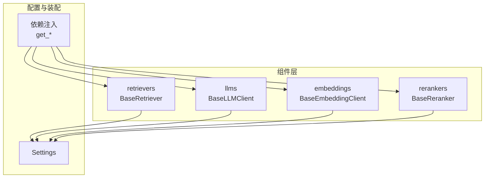
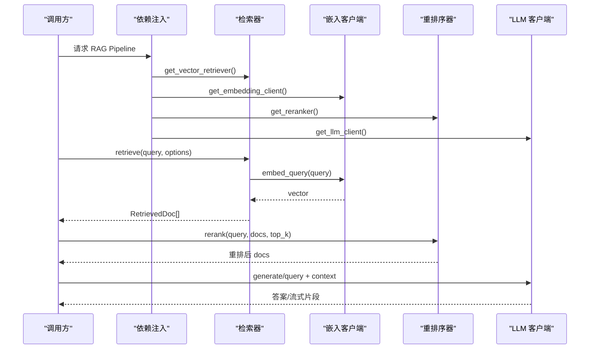
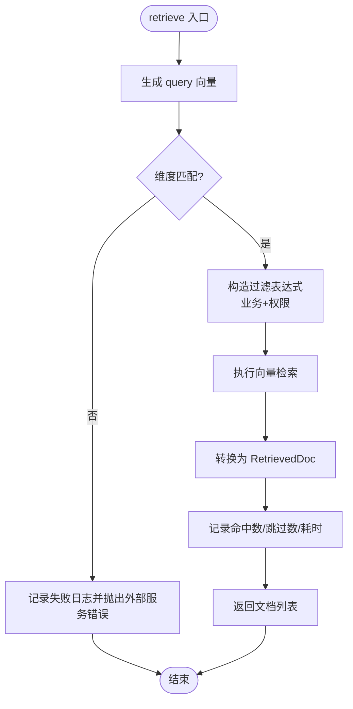
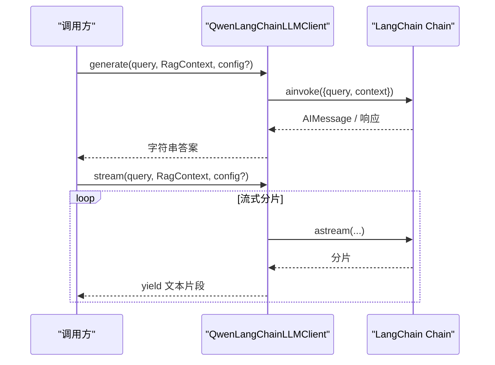
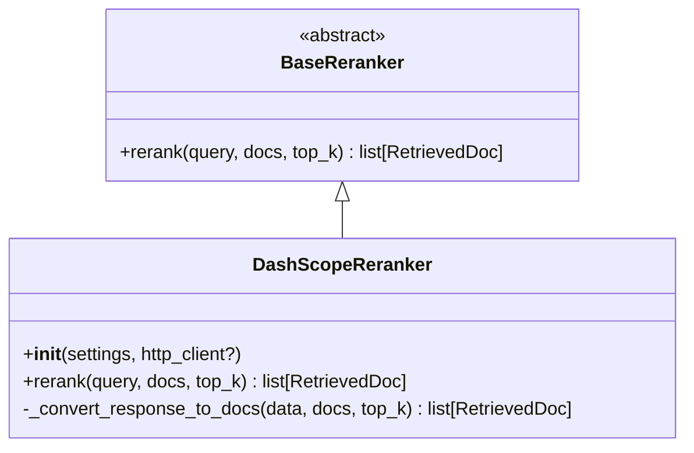
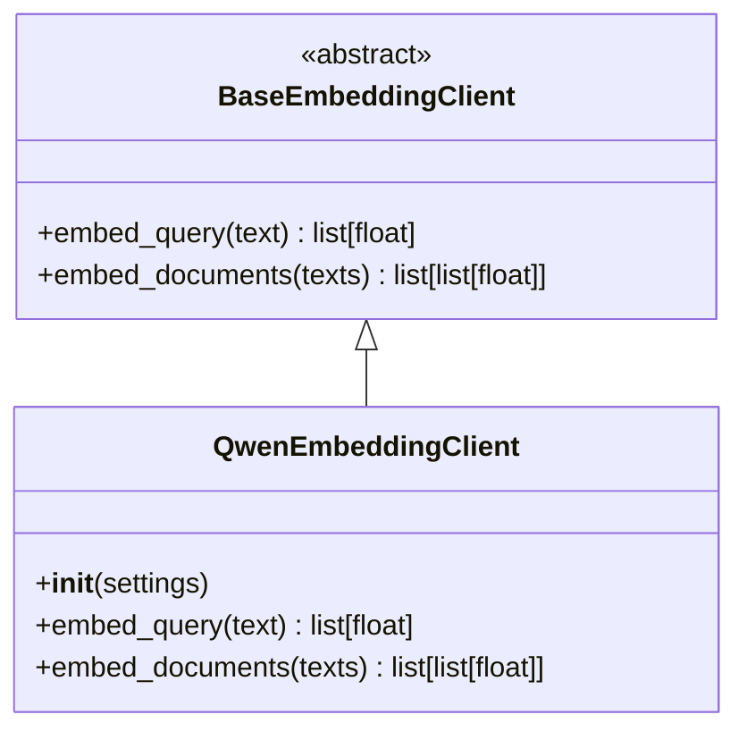
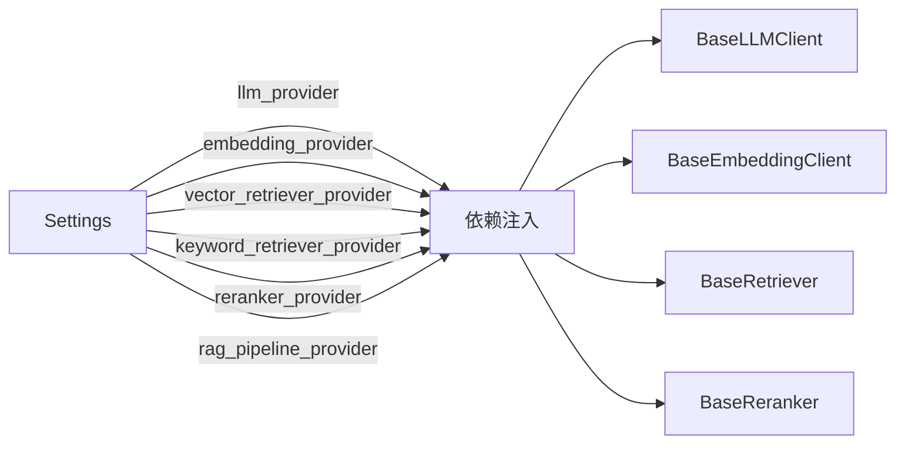

# 组件层设计

<cite>
**本文引用的文件**
- [base.py](file://src/fast_app/components/retrievers/base.py)
- [milvus_vector_retriever.py](file://src/fast_app/components/retrievers/milvus_vector_retriever.py)
- [base.py](file://src/fast_app/components/llms/base.py)
- [qwen_langchain_llm_client.py](file://src/fast_app/components/llms/qwen_langchain_llm_client.py)
- [base.py](file://src/fast_app/components/rerankers/base.py)
- [dashscope_reranker.py](file://src/fast_app/components/rerankers/dashscope_reranker.py)
- [base.py](file://src/fast_app/components/embeddings/base.py)
- [qwen_embedding_client.py](file://src/fast_app/components/embeddings/qwen_embedding_client.py)
- [config.py](file://src/fast_app/core/config.py)
- [rag_dependencies.py](file://src/fast_app/dependencies/rag_dependencies.py)
</cite>

## 目录
1. [简介](#简介)
2. [项目结构](#项目结构)
3. [核心组件](#核心组件)
4. [架构总览](#架构总览)
5. [详细组件分析](#详细组件分析)
6. [依赖关系分析](#依赖关系分析)
7. [性能与可观测性](#性能与可观测性)
8. [故障排查指南](#故障排查指南)
9. [结论](#结论)
10. [附录：扩展开发指南](#附录：扩展开发指南)

## 简介
本文件面向“可插拔组件架构”的组件层设计与实现，围绕检索器、LLM 客户端、重排序器、嵌入客户端四大抽象，系统阐述 Provider 模式、接口契约、生命周期管理、配置注入、错误处理与扩展方式。文档提供架构图、接口定义图与关键流程时序图，帮助开发者快速理解并安全地扩展新的后端实现。

## 项目结构
组件层位于 fast_app/components 下，按能力划分为 retrievers、llms、rerankers、embeddings 四个子模块；每个子模块包含一个抽象基类 base.py 以及若干具体 Provider 实现。配置集中在 core/config.py 的 Settings 中，通过 dependencies/rag_dependencies.py 统一装配到服务层。

图表来源
- [base.py:6-13](file://src/fast_app/components/retrievers/base.py#L6-L13)
- [base.py:9-27](file://src/fast_app/components/llms/base.py#L9-L27)
- [base.py:4-13](file://src/fast_app/components/embeddings/base.py#L4-L13)
- [base.py:6-14](file://src/fast_app/components/rerankers/base.py#L6-L14)
- [config.py:58-63](file://src/fast_app/core/config.py#L58-L63)
- [rag_dependencies.py:69-163](file://src/fast_app/dependencies/rag_dependencies.py#L69-L163)

章节来源
- [base.py:6-13](file://src/fast_app/components/retrievers/base.py#L6-L13)
- [base.py:9-27](file://src/fast_app/components/llms/base.py#L9-L27)
- [base.py:4-13](file://src/fast_app/components/embeddings/base.py#L4-L13)
- [base.py:6-14](file://src/fast_app/components/rerankers/base.py#L6-L14)
- [config.py:58-63](file://src/fast_app/core/config.py#L58-L63)
- [rag_dependencies.py:69-163](file://src/fast_app/dependencies/rag_dependencies.py#L69-L163)

## 核心组件
- 检索器 BaseRetriever：统一异步 retrieve(query, options) -> list[RetrievedDoc] 接口，屏蔽底层向量/关键词存储差异。
- LLM 客户端 BaseLLMClient：统一 generate/stream(query, context, config) 接口，支持同步与流式输出。
- 重排序器 BaseReranker：统一 rerank(query, docs, top_k) -> list[RetrievedDoc] 接口，对召回结果进行二次排序。
- 嵌入客户端 BaseEmbeddingClient：统一 embed_query/embed_documents 接口，将文本转为向量。

这些抽象使上层 RAG Pipeline 仅依赖接口，而不关心具体后端实现，从而具备强可插拔性。

章节来源
- [base.py:6-13](file://src/fast_app/components/retrievers/base.py#L6-L13)
- [base.py:9-27](file://src/fast_app/components/llms/base.py#L9-L27)
- [base.py:6-14](file://src/fast_app/components/rerankers/base.py#L6-L14)
- [base.py:4-13](file://src/fast_app/components/embeddings/base.py#L4-L13)

## 架构总览
组件层通过 Provider 模式在运行时根据配置选择具体实现，并由依赖注入函数集中装配。

图表来源
- [rag_dependencies.py:69-163](file://src/fast_app/dependencies/rag_dependencies.py#L69-L163)
- [milvus_vector_retriever.py:155-180](file://src/fast_app/components/retrievers/milvus_vector_retriever.py#L155-L180)
- [qwen_embedding_client.py:15-29](file://src/fast_app/components/embeddings/qwen_embedding_client.py#L15-L29)
- [dashscope_reranker.py:24-35](file://src/fast_app/components/rerankers/dashscope_reranker.py#L24-L35)
- [qwen_langchain_llm_client.py:107-134](file://src/fast_app/components/llms/qwen_langchain_llm_client.py#L107-L134)

## 详细组件分析

### 检索器组件（BaseRetriever 与 MilvusVectorRetriever）
- 抽象接口：BaseRetriever.retrieve(query, RetrievalOptions) -> list[RetrievedDoc]
- 典型实现：MilvusVectorRetriever
  - 初始化时接收 Settings 与 BaseEmbeddingClient，可选择注入外部 MilvusClient
  - retrieve 流程：生成 query embedding -> 校验维度 -> 构造过滤表达式（业务+权限）-> 执行搜索 -> 转换结果为 RetrievedDoc -> 记录耗时与指标 -> 异常包装为 ExternalServiceError
  - 过滤表达式构建：组合 source_path、section_path、knowledge_version、权限条件（public/部门/用户白名单），并将权限条件下推到存储侧
  - 结果转换：从原始 hit 提取 id/content/score/title/metadata，补齐 doc_id/source_path/document_type/chunk_index 等追溯字段

图表来源
- [milvus_vector_retriever.py:182-337](file://src/fast_app/components/retrievers/milvus_vector_retriever.py#L182-L337)
- [milvus_vector_retriever.py:56-133](file://src/fast_app/components/retrievers/milvus_vector_retriever.py#L56-L133)
- [milvus_vector_retriever.py:339-409](file://src/fast_app/components/retrievers/milvus_vector_retriever.py#L339-L409)

章节来源
- [base.py:6-13](file://src/fast_app/components/retrievers/base.py#L6-L13)
- [milvus_vector_retriever.py:155-180](file://src/fast_app/components/retrievers/milvus_vector_retriever.py#L155-L180)
- [milvus_vector_retriever.py:182-337](file://src/fast_app/components/retrievers/milvus_vector_retriever.py#L182-L337)
- [milvus_vector_retriever.py:56-133](file://src/fast_app/components/retrievers/milvus_vector_retriever.py#L56-L133)
- [milvus_vector_retriever.py:339-409](file://src/fast_app/components/retrievers/milvus_vector_retriever.py#L339-L409)

### LLM 客户端组件（BaseLLMClient 与 QwenLangChainLLMClient）
- 抽象接口：generate 与 stream，均接受 query、RagContext 与可选 LangChain RunnableConfig
- 典型实现：QwenLangChainLLMClient
  - 初始化时校验 API Key，创建 ChatOpenAI 模型与 Prompt 模板，组装 chain
  - generate：调用 chain.ainvoke，提取内容、统计 token 用量、记录慢操作与失败日志，异常包装为 LLMCallError
  - stream：astream 逐块产出 content，累计 chunk 数量与输出长度，失败时同样包装为 LLMCallError

图表来源
- [base.py:9-27](file://src/fast_app/components/llms/base.py#L9-L27)
- [qwen_langchain_llm_client.py:107-134](file://src/fast_app/components/llms/qwen_langchain_llm_client.py#L107-L134)
- [qwen_langchain_llm_client.py:136-238](file://src/fast_app/components/llms/qwen_langchain_llm_client.py#L136-L238)
- [qwen_langchain_llm_client.py:241-340](file://src/fast_app/components/llms/qwen_langchain_llm_client.py#L241-L340)

章节来源
- [base.py:9-27](file://src/fast_app/components/llms/base.py#L9-L27)
- [qwen_langchain_llm_client.py:107-134](file://src/fast_app/components/llms/qwen_langchain_llm_client.py#L107-L134)
- [qwen_langchain_llm_client.py:136-238](file://src/fast_app/components/llms/qwen_langchain_llm_client.py#L136-L238)
- [qwen_langchain_llm_client.py:241-340](file://src/fast_app/components/llms/qwen_langchain_llm_client.py#L241-L340)

### 重排序器组件（BaseReranker 与 DashScopeReranker）
- 抽象接口：rerank(query, docs, top_k) -> list[RetrievedDoc]
- 典型实现：DashScopeReranker
  - 初始化时校验 API Key，使用 httpx.AsyncClient 发起 HTTP 请求
  - 调用重排序 API，携带 model、query、documents、top_n 等参数
  - 解析返回结果，按 index 映射回原始文档，更新 score 与 scores.rerank_score
  - 网络错误与状态码错误统一包装为 ExternalServiceError

图表来源
- [base.py:6-14](file://src/fast_app/components/rerankers/base.py#L6-L14)
- [dashscope_reranker.py:24-35](file://src/fast_app/components/rerankers/dashscope_reranker.py#L24-L35)
- [dashscope_reranker.py:36-100](file://src/fast_app/components/rerankers/dashscope_reranker.py#L36-L100)
- [dashscope_reranker.py:102-139](file://src/fast_app/components/rerankers/dashscope_reranker.py#L102-L139)

章节来源
- [base.py:6-14](file://src/fast_app/components/rerankers/base.py#L6-L14)
- [dashscope_reranker.py:24-35](file://src/fast_app/components/rerankers/dashscope_reranker.py#L24-L35)
- [dashscope_reranker.py:36-100](file://src/fast_app/components/rerankers/dashscope_reranker.py#L36-L100)
- [dashscope_reranker.py:102-139](file://src/fast_app/components/rerankers/dashscope_reranker.py#L102-L139)

### 嵌入客户端组件（BaseEmbeddingClient 与 QwenEmbeddingClient）
- 抽象接口：embed_query(text) -> list[float]；embed_documents(texts) -> list[list[float]]
- 典型实现：QwenEmbeddingClient
  - 初始化时校验 API Key，创建 OpenAIEmbeddings，设置 dimensions、chunk_size 等
  - embed_query：直接调用 aembed_query，异常包装为 ExternalServiceError
  - embed_documents：按供应商限制分批调用，合并结果并保持顺序，异常包装为 ExternalServiceError

图表来源
- [base.py:4-13](file://src/fast_app/components/embeddings/base.py#L4-L13)
- [qwen_embedding_client.py:15-29](file://src/fast_app/components/embeddings/qwen_embedding_client.py#L15-L29)
- [qwen_embedding_client.py:31-55](file://src/fast_app/components/embeddings/qwen_embedding_client.py#L31-L55)

章节来源
- [base.py:4-13](file://src/fast_app/components/embeddings/base.py#L4-L13)
- [qwen_embedding_client.py:15-29](file://src/fast_app/components/embeddings/qwen_embedding_client.py#L15-L29)
- [qwen_embedding_client.py:31-55](file://src/fast_app/components/embeddings/qwen_embedding_client.py#L31-L55)

## 依赖关系分析
Provider 模式通过配置项驱动实例化，所有 Provider 选择集中在依赖注入层：
- LLM：llm_provider -> mock | qwen
- 嵌入：embedding_provider -> qwen
- 向量检索：vector_retriever_provider -> mock | milvus
- 关键词检索：keyword_retriever_provider -> mock | elasticsearch
- 重排序：reranker_provider -> none | mock | dashscope
- RAG Pipeline：rag_pipeline_provider -> classic | langgraph | rag_agent

图表来源
- [config.py:237-239](file://src/fast_app/core/config.py#L237-L239)
- [config.py:598-618](file://src/fast_app/core/config.py#L598-L618)
- [config.py:605-608](file://src/fast_app/core/config.py#L605-L608)
- [config.py:285](file://src/fast_app/core/config.py#L285)
- [rag_dependencies.py:69-163](file://src/fast_app/dependencies/rag_dependencies.py#L69-L163)

章节来源
- [config.py:237-239](file://src/fast_app/core/config.py#L237-L239)
- [config.py:598-618](file://src/fast_app/core/config.py#L598-L618)
- [config.py:605-608](file://src/fast_app/core/config.py#L605-L608)
- [config.py:285](file://src/fast_app/core/config.py#L285)
- [rag_dependencies.py:69-163](file://src/fast_app/dependencies/rag_dependencies.py#L69-L163)

## 性能与可观测性
- 延迟追踪：各组件内部使用 perf_counter 计算耗时，并通过 log_slow_operation 记录慢操作阈值（如 slow_retrieval_threshold_ms、slow_llm_threshold_ms、slow_rerank_threshold_ms）。
- 结构化日志：format_log_fields 输出事件名、组件名、模型名、超时、token 用量、命中率等关键字段，便于定位瓶颈。
- 重试与降级：重排序器使用 call_with_retry 对可重试的网络错误进行指数退避重试；检索器对维度不匹配等配置错误立即报错，避免无效搜索。
- 资源复用：MilvusClient、httpx.AsyncClient 等外部客户端建议在应用生命周期内复用，减少连接开销。

章节来源
- [milvus_vector_retriever.py:288-337](file://src/fast_app/components/retrievers/milvus_vector_retriever.py#L288-L337)
- [qwen_langchain_llm_client.py:188-238](file://src/fast_app/components/llms/qwen_langchain_llm_client.py#L188-L238)
- [qwen_langchain_llm_client.py:296-340](file://src/fast_app/components/llms/qwen_langchain_llm_client.py#L296-L340)
- [dashscope_reranker.py:64-100](file://src/fast_app/components/rerankers/dashscope_reranker.py#L64-L100)
- [config.py:41-52](file://src/fast_app/core/config.py#L41-L52)

## 故障排查指南
- 向量维度不匹配：检索器在 embedding 完成后校验维度，若不匹配则记录 milvus.search.failed 并抛出外部服务错误。检查 embedding_dim 与模型实际维度是否一致。
- 权限过滤导致无命中：若权限表达式过严或为空，可能返回空结果。检查 filters.can_read_all、allow_public、department_codes、user_id 是否正确传入。
- LLM 调用失败：generate/stream 捕获异常并包装为 LLMCallError，同时记录 llm.generate.failed / llm.stream.failed。检查 API Key、模型名称、超时与网络连通性。
- 重排序失败：HTTP 状态错误或网络抖动会触发重试，仍失败则包装为 ExternalServiceError。检查 rerank_model_name、timeout、API Key 与网络。
- 嵌入失败：embedding 调用失败统一包装为 ExternalServiceError。检查 embedding_model_name、dimensions、batch size 与网络。

章节来源
- [milvus_vector_retriever.py:215-233](file://src/fast_app/components/retrievers/milvus_vector_retriever.py#L215-L233)
- [milvus_vector_retriever.py:305-337](file://src/fast_app/components/retrievers/milvus_vector_retriever.py#L305-L337)
- [qwen_langchain_llm_client.py:205-238](file://src/fast_app/components/llms/qwen_langchain_llm_client.py#L205-L238)
- [qwen_langchain_llm_client.py:309-340](file://src/fast_app/components/llms/qwen_langchain_llm_client.py#L309-L340)
- [dashscope_reranker.py:92-100](file://src/fast_app/components/rerankers/dashscope_reranker.py#L92-L100)
- [qwen_embedding_client.py:31-55](file://src/fast_app/components/embeddings/qwen_embedding_client.py#L31-L55)

## 结论
组件层通过清晰的抽象接口与 Provider 模式实现了高度解耦与可插拔。依赖注入层集中管理配置到实现的映射，使得切换后端无需改动上层逻辑。各组件内置完善的日志、慢操作告警与错误包装，便于在生产环境进行性能监控与问题定位。遵循本文规范扩展新 Provider 时，只需实现对应抽象接口并在依赖注入层注册即可。

## 附录：扩展开发指南
- 新增检索器
  - 在 components/retrievers 下新建实现类，继承 BaseRetriever 并实现 retrieve
  - 在 dependencies/rag_dependencies.py 的 get_vector_retriever 中添加 provider 分支，返回新实现
  - 在 Settings 中增加或复用相应配置项（如 host/port/collection）
  - 参考 MilvusVectorRetriever 的错误处理、日志与慢操作记录模式

- 新增 LLM 客户端
  - 在 components/llms 下新建实现类，继承 BaseLLMClient 并实现 generate/stream
  - 在 dependencies/rag_dependencies.py 的 get_llm_client 中添加 provider 分支
  - 在 Settings 中配置 llm_provider、llm_model_name、openai_base_url 等
  - 参考 QwenLangChainLLMClient 的 prompt 组装、token 统计与异常包装

- 新增重排序器
  - 在 components/rerankers 下新建实现类，继承 BaseReranker 并实现 rerank
  - 在 dependencies/rag_dependencies.py 的 get_reranker 中添加 provider 分支
  - 在 Settings 中配置 reranker_provider、rerank_model_name、timeout
  - 参考 DashScopeReranker 的重试策略与响应解析

- 新增嵌入客户端
  - 在 components/embeddings 下新建实现类，继承 BaseEmbeddingClient 并实现 embed_query/embed_documents
  - 在 dependencies/rag_dependencies.py 的 get_embedding_client 中添加 provider 分支
  - 在 Settings 中配置 embedding_provider、embedding_model_name、embedding_dim
  - 参考 QwenEmbeddingClient 的分批策略与异常包装

- 生命周期与配置注入
  - 组件通常以构造函数注入 Settings 与外部客户端（如 MilvusClient、httpx.AsyncClient）
  - 外部客户端建议在应用启动时创建并复用，避免重复连接
  - 所有 Provider 的选择由 Settings 中的 *_provider 字段控制，修改配置即可切换后端

- 错误处理最佳实践
  - 对外部服务错误统一包装为 ExternalServiceError 或 LLMCallError
  - 记录结构化日志，包含事件名、组件名、耗时、关键参数与错误类型
  - 对可重试的网络错误采用重试策略，对配置错误立即失败

章节来源
- [base.py:6-13](file://src/fast_app/components/retrievers/base.py#L6-L13)
- [base.py:9-27](file://src/fast_app/components/llms/base.py#L9-L27)
- [base.py:6-14](file://src/fast_app/components/rerankers/base.py#L6-L14)
- [base.py:4-13](file://src/fast_app/components/embeddings/base.py#L4-L13)
- [rag_dependencies.py:69-163](file://src/fast_app/dependencies/rag_dependencies.py#L69-L163)
- [config.py:237-239](file://src/fast_app/core/config.py#L237-L239)
- [config.py:598-618](file://src/fast_app/core/config.py#L598-L618)
- [config.py:605-608](file://src/fast_app/core/config.py#L605-L608)
- [milvus_vector_retriever.py:155-180](file://src/fast_app/components/retrievers/milvus_vector_retriever.py#L155-L180)
- [qwen_langchain_llm_client.py:107-134](file://src/fast_app/components/llms/qwen_langchain_llm_client.py#L107-L134)
- [dashscope_reranker.py:24-35](file://src/fast_app/components/rerankers/dashscope_reranker.py#L24-L35)
- [qwen_embedding_client.py:15-29](file://src/fast_app/components/embeddings/qwen_embedding_client.py#L15-L29)