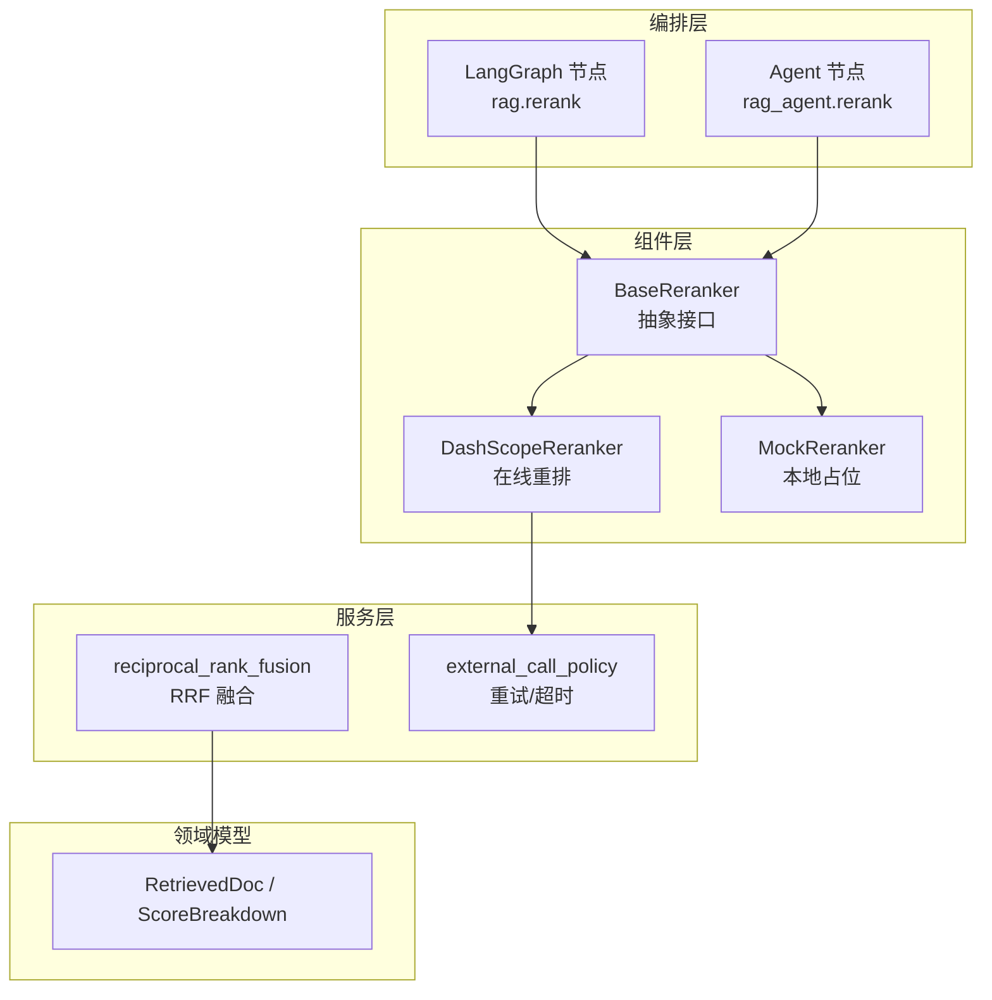
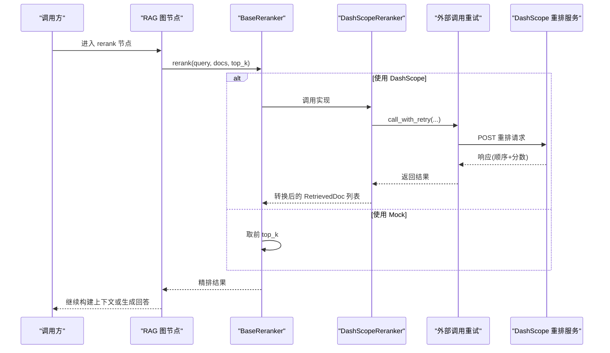
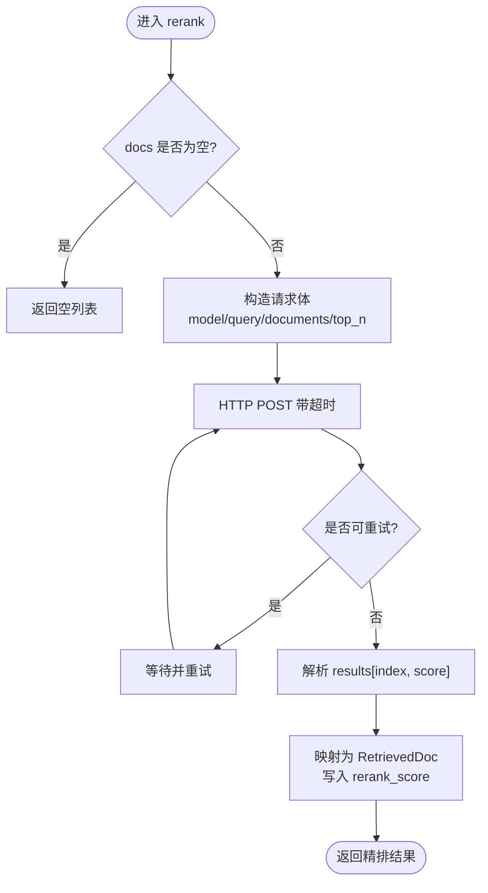
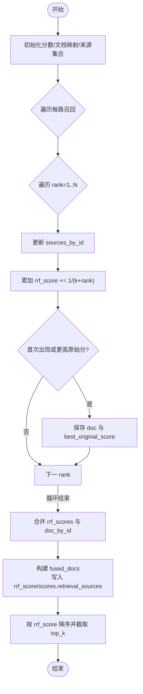
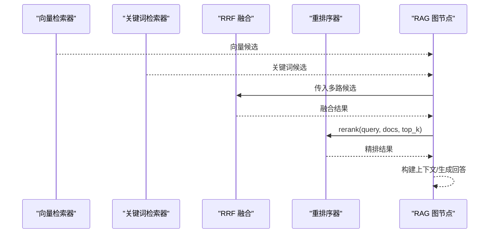
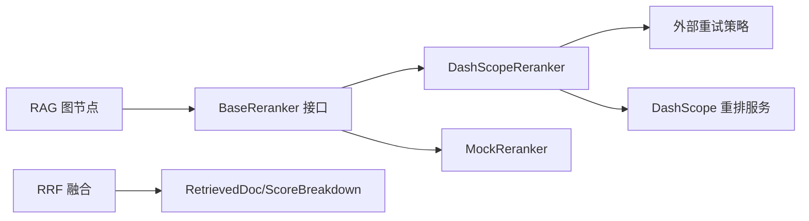

# 重排序器

<cite>
**本文引用的文件**
- [base.py](file://src/fast_app/components/rerankers/base.py)
- [dashscope_reranker.py](file://src/fast_app/components/rerankers/dashscope_reranker.py)
- [mock_reranker.py](file://src/fast_app/components/rerankers/mock_reranker.py)
- [retrieval_fusion.py](file://src/fast_app/services/rag/retrieval_fusion.py)
- [rag_models.py](file://src/fast_app/domain/rag_models.py)
- [config.py](file://src/fast_app/core/config.py)
- [external_call_policy.py](file://src/fast_app/services/external_call_policy.py)
- [rag_graph_nodes.py](file://src/fast_app/graph/rag/rag_graph_nodes.py)
- [rag_agent_nodes.py](file://src/fast_app/graph/rag_agent/rag_agent_nodes.py)
</cite>

## 目录
1. [简介](#简介)
2. [项目结构](#项目结构)
3. [核心组件](#核心组件)
4. [架构总览](#架构总览)
5. [详细组件分析](#详细组件分析)
6. [依赖关系分析](#依赖关系分析)
7. [性能与批量处理](#性能与批量处理)
8. [故障排查指南](#故障排查指南)
9. [结论](#结论)
10. [附录：自定义重排序器开发指南](#附录自定义重排序器开发指南)

## 简介
本文件围绕检索后重排序（Rerank）能力，系统梳理抽象接口、DashScope 实现、Mock 实现、RRF 融合算法、配置参数、批处理与性能优化、错误降级策略，以及与检索器的协作模式和质量评估方法。目标是帮助读者在不深入代码细节的情况下，理解并扩展重排序体系。

## 项目结构
重排序相关代码主要分布在以下位置：
- 抽象接口与实现：components/rerankers
- RRF 融合：services/rag/retrieval_fusion.py
- 数据模型：domain/rag_models.py
- 配置项：core/config.py
- 外部调用重试策略：services/external_call_policy.py
- 图节点集成：graph/rag 与 graph/rag_agent

图表来源
- [base.py:6-14](file://src/fast_app/components/rerankers/base.py#L6-L14)
- [dashscope_reranker.py:24-139](file://src/fast_app/components/rerankers/dashscope_reranker.py#L24-L139)
- [mock_reranker.py:5-12](file://src/fast_app/components/rerankers/mock_reranker.py#L5-L12)
- [retrieval_fusion.py:8-79](file://src/fast_app/services/rag/retrieval_fusion.py#L8-L79)
- [rag_models.py:41-79](file://src/fast_app/domain/rag_models.py#L41-L79)
- [external_call_policy.py:39-74](file://src/fast_app/services/external_call_policy.py#L39-L74)
- [rag_graph_nodes.py:295-339](file://src/fast_app/graph/rag/rag_graph_nodes.py#L295-L339)
- [rag_agent_nodes.py:1157-1279](file://src/fast_app/graph/rag_agent/rag_agent_nodes.py#L1157-L1279)

章节来源
- [base.py:6-14](file://src/fast_app/components/rerankers/base.py#L6-L14)
- [dashscope_reranker.py:24-139](file://src/fast_app/components/rerankers/dashscope_reranker.py#L24-L139)
- [mock_reranker.py:5-12](file://src/fast_app/components/rerankers/mock_reranker.py#L5-L12)
- [retrieval_fusion.py:8-79](file://src/fast_app/services/rag/retrieval_fusion.py#L8-L79)
- [rag_models.py:41-79](file://src/fast_app/domain/rag_models.py#L41-L79)
- [external_call_policy.py:39-74](file://src/fast_app/services/external_call_policy.py#L39-L74)
- [rag_graph_nodes.py:295-339](file://src/fast_app/graph/rag/rag_graph_nodes.py#L295-L339)
- [rag_agent_nodes.py:1157-1279](file://src/fast_app/graph/rag_agent/rag_agent_nodes.py#L1157-L1279)

## 核心组件
- BaseReranker：定义统一的异步 rerank(query, docs, top_k) 接口，屏蔽具体实现差异。
- DashScopeReranker：通过 HTTP 调用 DashScope 文本重排接口，返回按相关性得分排序的文档列表，并将分数写回 RetrievedDoc。
- MockReranker：直接返回候选前 top_k 条，用于开发与测试。
- RRF 融合：将多路召回结果按秩次加权融合，输出统一排序与分数。
- 数据模型：RetrievedDoc 携带 id、content、score、source、metadata、scores 等；ScoreBreakdown 记录 vector_score、keyword_score、rrf_score、rerank_score。
- 配置：reranker_provider、rerank_model_name、rerank_top_k、rerank_timeout_seconds 等。
- 外部调用策略：对网络抖动、超时、限流、服务端错误进行有限重试。

章节来源
- [base.py:6-14](file://src/fast_app/components/rerankers/base.py#L6-L14)
- [dashscope_reranker.py:24-139](file://src/fast_app/components/rerankers/dashscope_reranker.py#L24-L139)
- [mock_reranker.py:5-12](file://src/fast_app/components/rerankers/mock_reranker.py#L5-L12)
- [retrieval_fusion.py:8-79](file://src/fast_app/services/rag/retrieval_fusion.py#L8-L79)
- [rag_models.py:41-79](file://src/fast_app/domain/rag_models.py#L41-L79)
- [config.py:605-633](file://src/fast_app/core/config.py#L605-L633)
- [external_call_policy.py:39-74](file://src/fast_app/services/external_call_policy.py#L39-L74)

## 架构总览
重排序在 RAG 管线中位于“多路召回 + RRF 融合”之后，作为精排阶段，提升最终上下文质量。

图表来源
- [rag_graph_nodes.py:295-339](file://src/fast_app/graph/rag/rag_graph_nodes.py#L295-L339)
- [rag_agent_nodes.py:1157-1279](file://src/fast_app/graph/rag_agent/rag_agent_nodes.py#L1157-L1279)
- [dashscope_reranker.py:36-139](file://src/fast_app/components/rerankers/dashscope_reranker.py#L36-L139)
- [external_call_policy.py:39-74](file://src/fast_app/services/external_call_policy.py#L39-L74)

## 详细组件分析

### 抽象接口 BaseReranker
- 职责：定义统一的异步 rerank 接口，输入 query、候选文档列表、期望输出数量 top_k，输出精排后的文档列表。
- 设计要点：
  - 异步接口便于与图节点并发编排。
  - 以 RetrievedDoc 为数据契约，保证上下游一致。
  - 不暴露具体实现细节，利于替换与测试。

章节来源
- [base.py:6-14](file://src/fast_app/components/rerankers/base.py#L6-L14)
- [rag_models.py:52-79](file://src/fast_app/domain/rag_models.py#L52-L79)

### DashScope 重排序器
- 职责：将候选文档内容提交到 DashScope 文本重排服务，获取按相关性排序的结果，并映射回内部 RetrievedDoc。
- 关键流程：
  - 构造请求体：包含模型名、query、documents、top_n 等。
  - 设置鉴权头与超时。
  - 通过 call_with_retry 进行有限重试，覆盖超时、限流、5xx 等可重试场景。
  - 解析响应中的 index 与 relevance_score，重建 RetrievedDoc 并写入 rerank_score。
- 错误处理：
  - HTTP 状态异常转换为 ExternalServiceError。
  - 其他异常统一包装为 ExternalServiceError，便于上层降级。

图表来源
- [dashscope_reranker.py:36-139](file://src/fast_app/components/rerankers/dashscope_reranker.py#L36-L139)
- [external_call_policy.py:39-74](file://src/fast_app/services/external_call_policy.py#L39-L74)

章节来源
- [dashscope_reranker.py:24-139](file://src/fast_app/components/rerankers/dashscope_reranker.py#L24-L139)
- [external_call_policy.py:39-74](file://src/fast_app/services/external_call_policy.py#L39-L74)

### Mock 重排序器
- 职责：开发/测试时直接返回候选前 top_k 条，避免外部依赖。
- 行为：保持与真实实现一致的接口签名，便于无缝替换。

章节来源
- [mock_reranker.py:5-12](file://src/fast_app/components/rerankers/mock_reranker.py#L5-L12)

### RRF 融合算法
- 目标：合并多路召回结果，消除单一召回源偏差，得到更稳健的排序。
- 原理：对每路召回中的每个文档，按其排名 rank 计算贡献 1/(k+rank)，累加得到 rrf_score；随后按 rrf_score 降序排列并截断 top_k。
- 数据增强：
  - 保留原始最佳 score 对应的文档对象。
  - 聚合 retrieval_sources，记录该文档被哪些召回源命中过。
  - 将 rrf_score 写入 scores.rrf_score。

图表来源
- [retrieval_fusion.py:8-79](file://src/fast_app/services/rag/retrieval_fusion.py#L8-L79)
- [rag_models.py:41-79](file://src/fast_app/domain/rag_models.py#L41-L79)

章节来源
- [retrieval_fusion.py:8-79](file://src/fast_app/services/rag/retrieval_fusion.py#L8-L79)
- [rag_models.py:41-79](file://src/fast_app/domain/rag_models.py#L41-L79)

### 与检索器的协作模式
- 典型链路：向量检索 + 关键词检索 → RRF 融合 → 可选重排序（DashScope/Mock）。
- 图节点集成：
  - LangGraph 节点负责调用 reranker，记录耗时、日志与追踪信息。
  - Agent 节点在外部服务异常时自动降级为候选前 top_k，并记录降级原因。

图表来源
- [rag_graph_nodes.py:295-339](file://src/fast_app/graph/rag/rag_graph_nodes.py#L295-L339)
- [rag_agent_nodes.py:1157-1279](file://src/fast_app/graph/rag_agent/rag_agent_nodes.py#L1157-L1279)
- [retrieval_fusion.py:8-79](file://src/fast_app/services/rag/retrieval_fusion.py#L8-L79)

章节来源
- [rag_graph_nodes.py:295-339](file://src/fast_app/graph/rag/rag_graph_nodes.py#L295-L339)
- [rag_agent_nodes.py:1157-1279](file://src/fast_app/graph/rag_agent/rag_agent_nodes.py#L1157-L1279)

## 依赖关系分析
- 组件耦合：
  - 图节点仅依赖 BaseReranker 抽象，降低与实现的耦合度。
  - DashScopeReranker 依赖 Settings、httpx、外部重试策略。
  - RRF 融合依赖 RetrievedDoc 与 ScoreBreakdown。
- 外部依赖：
  - DashScope 文本重排 API。
  - httpx 网络库与超时/重试策略。
- 潜在风险：
  - 外部服务不可用或限流时的降级路径已内置。
  - 大 top_k 会增加网络与解析开销，需结合业务预算控制。

图表来源
- [base.py:6-14](file://src/fast_app/components/rerankers/base.py#L6-L14)
- [dashscope_reranker.py:24-139](file://src/fast_app/components/rerankers/dashscope_reranker.py#L24-L139)
- [external_call_policy.py:39-74](file://src/fast_app/services/external_call_policy.py#L39-L74)
- [retrieval_fusion.py:8-79](file://src/fast_app/services/rag/retrieval_fusion.py#L8-L79)
- [rag_models.py:41-79](file://src/fast_app/domain/rag_models.py#L41-L79)

章节来源
- [base.py:6-14](file://src/fast_app/components/rerankers/base.py#L6-L14)
- [dashscope_reranker.py:24-139](file://src/fast_app/components/rerankers/dashscope_reranker.py#L24-L139)
- [external_call_policy.py:39-74](file://src/fast_app/services/external_call_policy.py#L39-L74)
- [retrieval_fusion.py:8-79](file://src/fast_app/services/rag/retrieval_fusion.py#L8-L79)
- [rag_models.py:41-79](file://src/fast_app/domain/rag_models.py#L41-L79)

## 性能与批量处理
- 单次批量请求：
  - DashScopeReranker 将候选文档内容打包为一次请求，减少往返次数。
  - top_n 限制为 min(top_k, len(docs))，避免无效请求。
- 超时与重试：
  - 通过 call_with_retry 对超时、限流、5xx 等进行有限重试，提高鲁棒性。
  - 超时时间由 rerank_timeout_seconds 控制。
- 慢操作监控：
  - 图节点记录 rerank 耗时，超过阈值触发慢操作告警。
- 建议优化：
  - 合理设置 candidate_k 与 top_k，平衡召回覆盖率与重排成本。
  - 在低延迟要求场景下，优先使用 MockReranker 或缓存策略。
  - 对热点查询可考虑结果缓存（见附录）。

章节来源
- [dashscope_reranker.py:36-139](file://src/fast_app/components/rerankers/dashscope_reranker.py#L36-L139)
- [external_call_policy.py:39-74](file://src/fast_app/services/external_call_policy.py#L39-L74)
- [rag_graph_nodes.py:295-339](file://src/fast_app/graph/rag/rag_graph_nodes.py#L295-L339)
- [rag_agent_nodes.py:1157-1279](file://src/fast_app/graph/rag_agent/rag_agent_nodes.py#L1157-L1279)
- [config.py:605-633](file://src/fast_app/core/config.py#L605-L633)

## 故障排查指南
- 常见问题定位：
  - 外部服务错误：查看 ExternalServiceError 日志，确认状态码与响应体。
  - 超时：检查 rerank_timeout_seconds 与网络状况。
  - 限流：关注 429 重试次数与退避策略。
- 降级行为：
  - 当外部重排失败时，Agent 节点会降级为候选前 top_k，并记录降级原因与指标。
- 观测点：
  - 事件 rag.rerank.finish / rag_agent.rerank.finish 表示成功。
  - 事件 rag_agent.rerank.fallback 表示降级。
  - 事件 rag.rerank.slow / rag_agent.rerank.slow 表示慢操作。

章节来源
- [dashscope_reranker.py:92-100](file://src/fast_app/components/rerankers/dashscope_reranker.py#L92-L100)
- [rag_agent_nodes.py:1226-1279](file://src/fast_app/graph/rag_agent/rag_agent_nodes.py#L1226-L1279)
- [rag_graph_nodes.py:295-339](file://src/fast_app/graph/rag/rag_graph_nodes.py#L295-L339)

## 结论
本项目的重排序体系通过抽象接口隔离实现差异，提供 DashScope 在线重排与 Mock 占位两种模式；配合 RRF 融合在多路召回基础上进一步提升排序质量。通过配置化与重试/降级机制，兼顾了效果与稳定性。后续可按附录指南扩展自定义重排序器，并结合评测体系持续优化。

## 附录：自定义重排序器开发指南
- 实现步骤：
  - 继承 BaseReranker，实现异步 rerank(query, docs, top_k)。
  - 在方法内实现你的排序算法，例如基于规则、轻量模型或本地相似度计算。
  - 将最终分数写入 RetrievedDoc.score，并在 scores 中记录对应阶段的分数（如 local_score）。
- 结果评分建议：
  - 若使用外部模型，尽量归一化分数至稳定区间，便于与 RRF 或其他阶段分数对比。
  - 若使用本地算法，注意分数分布与阈值设定，避免极端值影响下游。
- 缓存策略：
  - 可在 rerank 前后增加缓存键（如 query 哈希 + 候选摘要），命中则直接返回，减少重复计算。
  - 缓存粒度建议以 (query, top_k) 为主，必要时加入过滤条件与版本标识。
- 与检索器协作：
  - 确保输入 docs 来自 RRF 融合或上游候选集，保持数据结构一致。
  - 在图节点中注册你的实现，复用现有的日志、追踪与降级逻辑。
- 结果质量评估：
  - 使用现有评测框架，比较不同重排策略下的 mean_recall_at_k、mean_mrr 等指标。
  - 结合人工抽检与样例回归，验证排序稳定性与可解释性。

章节来源
- [base.py:6-14](file://src/fast_app/components/rerankers/base.py#L6-L14)
- [rag_models.py:41-79](file://src/fast_app/domain/rag_models.py#L41-L79)
- [rag_graph_nodes.py:295-339](file://src/fast_app/graph/rag/rag_graph_nodes.py#L295-L339)
- [rag_agent_nodes.py:1157-1279](file://src/fast_app/graph/rag_agent/rag_agent_nodes.py#L1157-L1279)