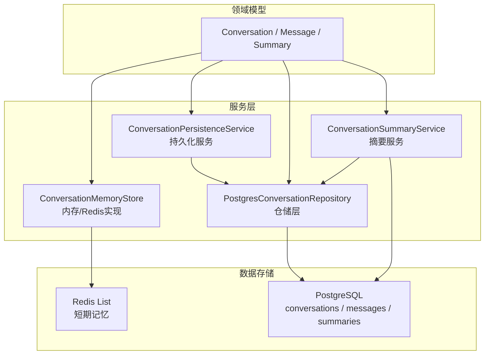
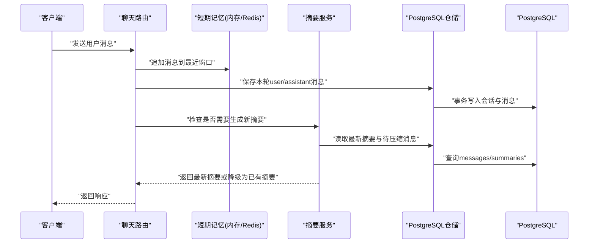
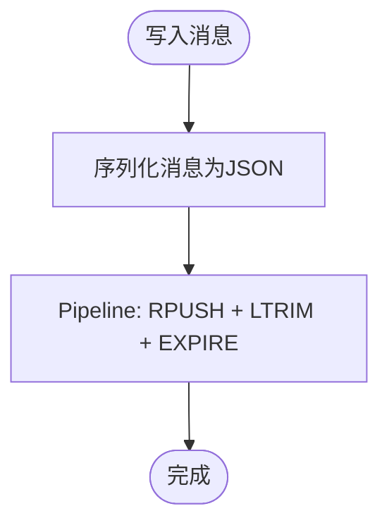
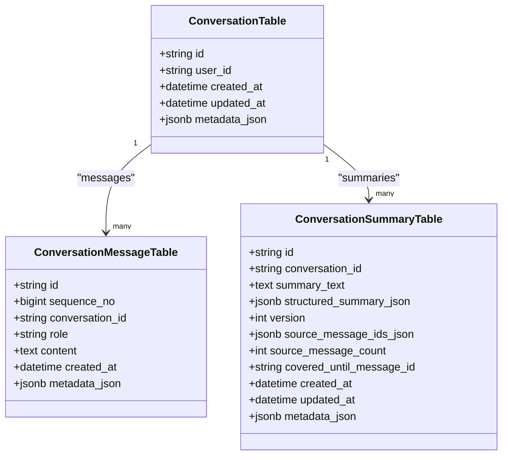
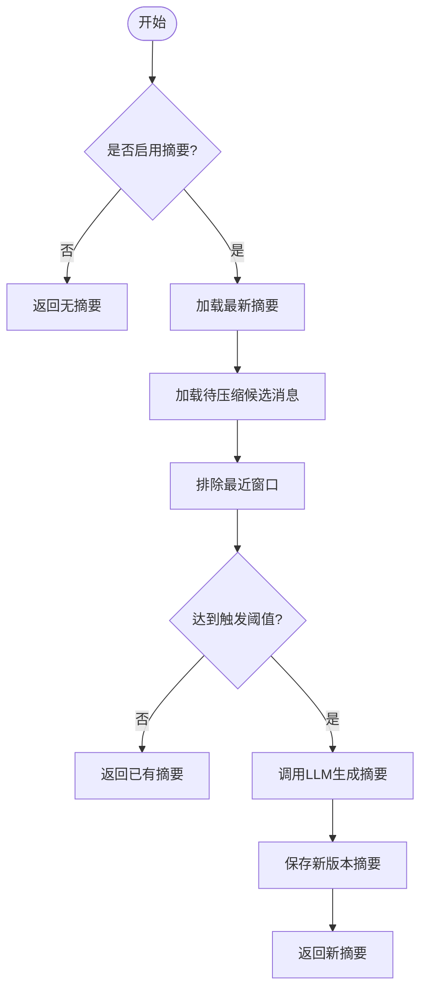
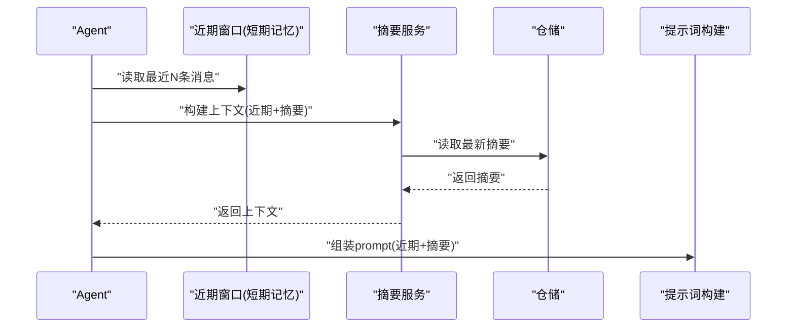
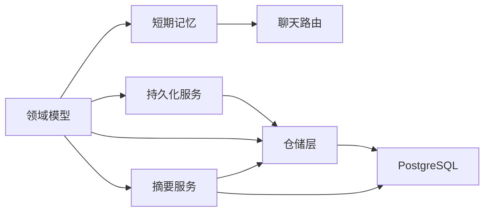

# 对话记忆管理

<cite>
**本文引用的文件**
- [conversation_memory.py](file://src/fast_app/services/conversation/conversation_memory.py)
- [conversation_persistence.py](file://src/fast_app/services/conversation/conversation_persistence.py)
- [conversation_repository.py](file://src/fast_app/services/conversation/conversation_repository.py)
- [conversation_summary.py](file://src/fast_app/services/conversation/conversation_summary.py)
- [conversation_models.py](file://src/fast_app/domain/conversation_models.py)
- [conversation_tables.py](file://src/fast_app/db/conversation_tables.py)
- [chat_routes.py](file://src/fast_app/api/chat_routes.py)
- [14-2-Redis短期会话记忆-最近消息-TTL-会话状态.md](file://learning-docs/phase-14/14-2-Redis短期会话记忆-最近消息-TTL-会话状态.md)
- [14-11-PostgreSQL会话持久化接入RAG主链路.md](file://learning-docs/phase-14/14-11-PostgreSQL会话持久化接入RAG主链路.md)
</cite>

## 目录
1. [简介](#简介)
2. [项目结构](#项目结构)
3. [核心组件](#核心组件)
4. [架构总览](#架构总览)
5. [详细组件分析](#详细组件分析)
6. [依赖关系分析](#依赖关系分析)
7. [性能考量](#性能考量)
8. [故障排查指南](#故障排查指南)
9. [结论](#结论)
10. [附录](#附录)

## 简介
本文件面向开发者，系统化说明对话记忆管理的短期与长期存储设计、数据流、查询优化、清理策略、摘要生成与上下文压缩机制，以及多轮对话的上下文构建与消息窗口管理。文档同时提供架构图、数据流向图与调试监控建议，帮助快速定位问题并优化系统性能。

## 项目结构
对话记忆相关代码集中在 services/conversation 层，领域模型在 domain，数据库表定义在 db，API 入口在 api。学习文档 phase-14 提供了 Redis 短期记忆与 PostgreSQL 持久化的演进说明。

图表来源
- [conversation_memory.py:10-113](file://src/fast_app/services/conversation/conversation_memory.py#L10-L113)
- [conversation_persistence.py:10-64](file://src/fast_app/services/conversation/conversation_persistence.py#L10-L64)
- [conversation_repository.py:18-314](file://src/fast_app/services/conversation/conversation_repository.py#L18-L314)
- [conversation_summary.py:72-394](file://src/fast_app/services/conversation/conversation_summary.py#L72-L394)
- [conversation_models.py:39-129](file://src/fast_app/domain/conversation_models.py#L39-L129)
- [conversation_tables.py:24-171](file://src/fast_app/db/conversation_tables.py#L24-L171)

章节来源
- [conversation_memory.py:10-113](file://src/fast_app/services/conversation/conversation_memory.py#L10-L113)
- [conversation_persistence.py:10-64](file://src/fast_app/services/conversation/conversation_persistence.py#L10-L64)
- [conversation_repository.py:18-314](file://src/fast_app/services/conversation/conversation_repository.py#L18-L314)
- [conversation_summary.py:72-394](file://src/fast_app/services/conversation/conversation_summary.py#L72-L394)
- [conversation_models.py:39-129](file://src/fast_app/domain/conversation_models.py#L39-L129)
- [conversation_tables.py:24-171](file://src/fast_app/db/conversation_tables.py#L24-L171)

## 核心组件
- 短期记忆存储：通过 ConversationMemoryStore 协议统一抽象，提供 InMemory 与 Redis 两种实现，负责追加消息与读取最近 N 条消息。
- 长期持久化服务：ConversationPersistenceService 将一轮 user/assistant 对话写入 PostgreSQL，保证会话容器与消息原子落库。
- 仓储层：PostgresConversationRepository 封装 SQLAlchemy 操作，提供 upsert_conversation、save_conversation_turn、list_messages、append_summary、get_latest_summary 等能力。
- 摘要服务：ConversationSummaryService 基于 LLM 对窗口外旧消息进行增量压缩，生成带版本和来源的可追溯摘要，并支持结构化输出。
- 领域模型：Conversation、ConversationMessage、ConversationSummary 及其结构化字段，用于跨层传递与校验。
- 数据库表：conversations、conversation_messages、conversation_summaries，包含索引与 JSONB 元数据字段。

章节来源
- [conversation_memory.py:10-113](file://src/fast_app/services/conversation/conversation_memory.py#L10-L113)
- [conversation_persistence.py:10-64](file://src/fast_app/services/conversation/conversation_persistence.py#L10-L64)
- [conversation_repository.py:18-314](file://src/fast_app/services/conversation/conversation_repository.py#L18-L314)
- [conversation_summary.py:72-394](file://src/fast_app/services/conversation/conversation_summary.py#L72-L394)
- [conversation_models.py:39-129](file://src/fast_app/domain/conversation_models.py#L39-L129)
- [conversation_tables.py:24-171](file://src/fast_app/db/conversation_tables.py#L24-L171)

## 架构总览
短期记忆（Redis）用于高频读写的最近消息窗口；长期记忆（PostgreSQL）用于完整会话历史与可追溯摘要。摘要服务按阈值触发，对窗口外旧消息进行压缩，避免上下文膨胀。

图表来源
- [chat_routes.py:10-32](file://src/fast_app/api/chat_routes.py#L10-L32)
- [conversation_memory.py:60-113](file://src/fast_app/services/conversation/conversation_memory.py#L60-L113)
- [conversation_persistence.py:20-64](file://src/fast_app/services/conversation/conversation_persistence.py#L20-L64)
- [conversation_repository.py:52-105](file://src/fast_app/services/conversation/conversation_repository.py#L52-L105)
- [conversation_summary.py:140-218](file://src/fast_app/services/conversation/conversation_summary.py#L140-L218)

## 详细组件分析

### 短期记忆（Redis）设计与实现
- 数据结构：每个 conversation_id 对应一个 Redis List，键名为 conversation:{conversation_id}:messages，元素为 ConversationMessage 的 JSON 字符串。
- 写入流程：RPUSH 追加消息，LTRIM 裁剪保留最近 max_messages 条，EXPIRE 设置 TTL，使用 pipeline 批量执行减少网络往返。
- 读取流程：LRANGE key -limit -1 获取最近 limit 条，反序列化为 ConversationMessage 列表，保持创建顺序。
- 清理策略：TTL 控制会话生命周期；每次 append_message 刷新 TTL，仅读取不续期，避免旧会话被无意延长。
- 并发与一致性：Redis 单命令原子性保障；应用侧通过 pipeline 保证追加、裁剪、过期的一致性。

图表来源
- [conversation_memory.py:80-105](file://src/fast_app/services/conversation/conversation_memory.py#L80-L105)
- [14-2-Redis短期会话记忆-最近消息-TTL-会话状态.md:280-365](file://learning-docs/phase-14/14-2-Redis短期会话记忆-最近消息-TTL-会话状态.md#L280-L365)

章节来源
- [conversation_memory.py:60-113](file://src/fast_app/services/conversation/conversation_memory.py#L60-L113)
- [14-2-Redis短期会话记忆-最近消息-TTL-会话状态.md:280-466](file://learning-docs/phase-14/14-2-Redis短期会话记忆-最近消息-TTL-会话状态.md#L280-L466)

### 长期记忆（PostgreSQL）设计与实现
- 表结构：
  - conversations：会话容器，含 user_id、时间戳、JSONB 元数据。
  - conversation_messages：消息记录，含 role、content、created_at、JSONB 元数据，按 sequence_no 排序。
  - conversation_summaries：摘要记录，含 summary_text、structured_summary_json、version、source_message_ids_json、covered_until_message_id 等。
- 索引优化：
  - idx_conversation_messages_conversation_created_at：按会话与创建时间查询。
  - idx_conversation_messages_conversation_sequence：按会话与序列号查询。
  - idx_conversation_summaries_conversation_version：按会话与版本号查询最新摘要。
- 写入流程：save_conversation_turn 在一个事务中 upsert 会话并追加本轮消息，失败时回滚，避免半成功状态。
- 读取流程：list_messages 按 sequence_no 升序分页读取；list_messages_for_user 结合 user_id 防止越权访问。
- 摘要读取：get_latest_summary 按 version desc、created_at desc、id desc 取最新；list_messages_after_summary 用于增量压缩。

图表来源
- [conversation_tables.py:24-171](file://src/fast_app/db/conversation_tables.py#L24-L171)

章节来源
- [conversation_repository.py:52-223](file://src/fast_app/services/conversation/conversation_repository.py#L52-L223)
- [conversation_tables.py:24-171](file://src/fast_app/db/conversation_tables.py#L24-L171)

### 对话摘要生成算法与上下文压缩
- 触发条件：当“待压缩消息数”达到配置阈值且排除最近窗口后，触发摘要生成。
- 输入构造：
  - 已有摘要文本（如有）。
  - 窗口外旧消息（排除最近 memory_history_max_turns * 2 条）。
- 模型调用：优先使用结构化输出（json_mode），失败则降级为普通文本链，最后解析 JSON。
- 输出结构：包含 summary_text 与结构化字段 goals/constraints/decisions/open_questions/user_preferences/important_entities。
- 版本管理：每次生成新版本 summary，记录 source_message_ids、source_message_count、covered_until_message_id，便于追溯。
- 降级策略：若模型不可用或异常，返回已有最新摘要，不影响主链路。

图表来源
- [conversation_summary.py:140-218](file://src/fast_app/services/conversation/conversation_summary.py#L140-L218)
- [conversation_summary.py:238-318](file://src/fast_app/services/conversation/conversation_summary.py#L238-L318)

章节来源
- [conversation_summary.py:72-394](file://src/fast_app/services/conversation/conversation_summary.py#L72-L394)

### 多轮对话上下文构建与消息窗口管理
- 近期窗口：从短期记忆（内存/Redis）读取最近 N 条消息，作为 query rewrite 的直接上下文。
- 历史摘要：从 PostgreSQL 读取最新摘要，补充窗口外信息，形成“近期+历史”的复合上下文。
- 组合方式：build_conversation_memory_context 将 recent_window 与 summary 合并，供上层 prompt 使用。
- 窗口大小：memory_history_max_turns 控制近期窗口大小；summary_memory_trigger_messages 控制摘要触发频率。

图表来源
- [conversation_summary.py:220-235](file://src/fast_app/services/conversation/conversation_summary.py#L220-L235)
- [conversation_memory.py:47-58](file://src/fast_app/services/conversation/conversation_memory.py#L47-L58)

章节来源
- [conversation_summary.py:220-235](file://src/fast_app/services/conversation/conversation_summary.py#L220-L235)
- [conversation_memory.py:30-58](file://src/fast_app/services/conversation/conversation_memory.py#L30-L58)

## 依赖关系分析
- 短期记忆与长期记忆解耦：短期记忆只负责最近窗口读写；长期持久化服务负责完整会话落库；摘要服务依赖仓储层读取历史与保存摘要。
- 仓储层屏蔽数据库细节：上层服务通过 Repository 接口操作数据库，避免直接耦合 SQLAlchemy 表结构。
- 领域模型贯穿各层：Pydantic 模型用于请求/响应校验与对象转换，ORM 映射函数负责表与模型互转。

图表来源
- [conversation_memory.py:10-113](file://src/fast_app/services/conversation/conversation_memory.py#L10-L113)
- [conversation_persistence.py:10-64](file://src/fast_app/services/conversation/conversation_persistence.py#L10-L64)
- [conversation_repository.py:18-314](file://src/fast_app/services/conversation/conversation_repository.py#L18-L314)
- [conversation_summary.py:72-394](file://src/fast_app/services/conversation/conversation_summary.py#L72-L394)
- [conversation_models.py:39-129](file://src/fast_app/domain/conversation_models.py#L39-L129)

章节来源
- [conversation_memory.py:10-113](file://src/fast_app/services/conversation/conversation_memory.py#L10-L113)
- [conversation_persistence.py:10-64](file://src/fast_app/services/conversation/conversation_persistence.py#L10-L64)
- [conversation_repository.py:18-314](file://src/fast_app/services/conversation/conversation_repository.py#L18-L314)
- [conversation_summary.py:72-394](file://src/fast_app/services/conversation/conversation_summary.py#L72-L394)
- [conversation_models.py:39-129](file://src/fast_app/domain/conversation_models.py#L39-L129)

## 性能考量
- 短期记忆（Redis）
  - 使用 pipeline 批量执行 RPUSH/LTRIM/EXPIRE，降低网络开销。
  - LTRIM 控制列表长度，避免无限增长；TTL 自动清理过期会话。
  - LRANGE 负索引高效读取最近 N 条，保持顺序。
- 长期记忆（PostgreSQL）
  - 使用 sequence_no 排序保证消息顺序稳定。
  - 索引覆盖 conversation_id + created_at/sequence_no/version，提升查询效率。
  - save_conversation_turn 事务内写入，避免部分成功导致的数据不一致。
- 摘要服务
  - 排除最近窗口，减少 LLM 输入长度，降低成本与延迟。
  - 结构化输出优先，失败降级为文本解析，提高鲁棒性。
  - 增量更新摘要，避免重复压缩已处理消息。

[本节为通用性能指导，不直接分析具体文件]

## 故障排查指南
- 短期记忆问题
  - 现象：读取不到最近消息或顺序错误。
  - 排查：确认 Redis key 是否存在、TTL 是否过期、max_messages 是否过小导致裁剪过早。
  - 参考：Redis 短期记忆设计与行为说明。
- 长期持久化问题
  - 现象：消息未落库或顺序错乱。
  - 排查：检查事务是否提交、sequence_no 是否递增、索引是否生效。
  - 参考：仓储层事务写入与排序逻辑。
- 摘要生成问题
  - 现象：摘要未生成或内容异常。
  - 排查：确认模型可用、触发阈值配置、最近窗口排除逻辑、结构化输出解析是否成功。
  - 参考：摘要服务降级策略与日志事件。

章节来源
- [conversation_memory.py:80-105](file://src/fast_app/services/conversation/conversation_memory.py#L80-L105)
- [conversation_repository.py:52-105](file://src/fast_app/services/conversation/conversation_repository.py#L52-L105)
- [conversation_summary.py:140-218](file://src/fast_app/services/conversation/conversation_summary.py#L140-L218)
- [14-2-Redis短期会话记忆-最近消息-TTL-会话状态.md:426-466](file://learning-docs/phase-14/14-2-Redis短期会话记忆-最近消息-TTL-会话状态.md#L426-L466)

## 结论
该对话记忆管理系统通过短期记忆（Redis）与长期记忆（PostgreSQL）的分层设计，实现了高吞吐的消息窗口管理与可追溯的历史摘要。摘要服务以阈值触发与增量更新为核心，有效压缩上下文并降低 LLM 成本。仓储层屏蔽数据库细节，领域模型贯穿各层，确保一致性与可维护性。整体架构清晰、可扩展性强，适合多轮对话场景下的记忆管理需求。

[本节为总结性内容，不直接分析具体文件]

## 附录
- 关键配置项（概念性说明）
  - MEMORY_TTL_SECONDS：短期记忆会话存活时间。
  - MEMORY_MAX_MESSAGES：短期记忆保留的最大消息数。
  - SUMMARY_MEMORY_ENABLED：是否启用摘要功能。
  - SUMMARY_MEMORY_TRIGGER_MESSAGES：触发摘要生成的消息数量阈值。
  - MEMORY_HISTORY_MAX_TURNS：近期窗口保留的轮数。
- 调试与监控建议
  - 短期记忆：监控 Redis key 数量、TTL 命中率、LRANGE 耗时。
  - 长期记忆：监控事务提交成功率、索引扫描效率、消息插入延迟。
  - 摘要服务：监控模型调用成功率、结构化输出解析成功率、摘要版本增长速率。
  - 日志事件：关注 conversation_summary.generate_failed、conversation_summary.saved 等事件。

[本节为通用指导，不直接分析具体文件]