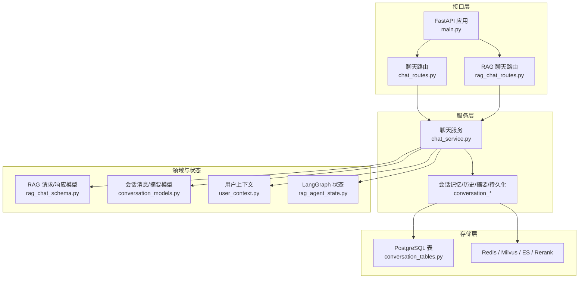
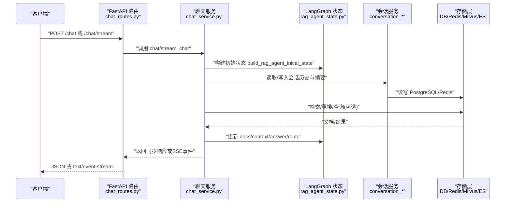
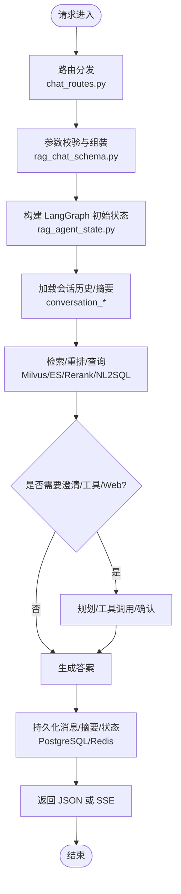
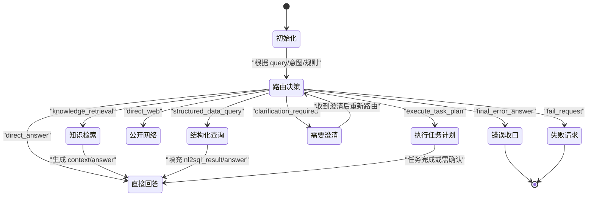
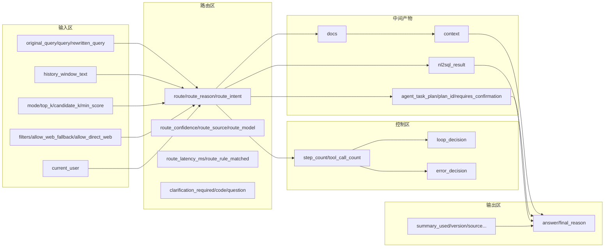
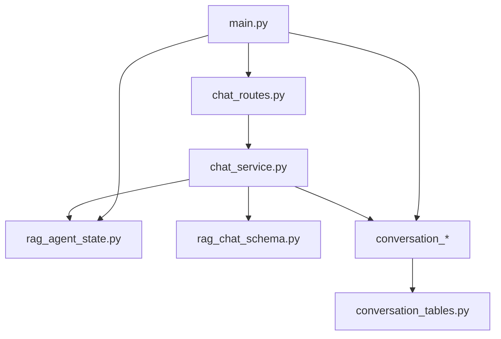

# 数据流与状态管理

<cite>
**本文引用的文件**
- [src/fast_app/main.py](file://python-agent-study/src/fast_app/main.py)
- [src/fast_app/api/chat_routes.py](file://python-agent-study/src/fast_app/api/chat_routes.py)
- [src/fast_app/services/chat_service.py](file://python-agent-study/src/fast_app/services/chat_service.py)
- [src/fast_app/schemas/rag_chat_schema.py](file://python-agent-study/src/fast_app/schemas/rag_chat_schema.py)
- [src/fast_app/graph/rag_agent/rag_agent_state.py](file://python-agent-study/src/fast_app/graph/rag_agent/rag_agent_state.py)
- [src/fast_app/domain/conversation_models.py](file://python-agent-study/src/fast_app/domain/conversation_models.py)
- [src/fast_app/db/conversation_tables.py](file://python-agent-study/src/fast_app/db/conversation_tables.py)
- [src/fast_app/services/conversation/conversation_history.py](file://python-agent-study/src/fast_app/services/conversation/conversation_history.py)
- [src/fast_app/services/conversation/conversation_memory.py](file://python-agent-study/src/fast_app/services/conversation/conversation_memory.py)
- [src/fast_app/services/conversation/conversation_persistence.py](file://python-agent-study/src/fast_app/services/conversation/conversation_persistence.py)
- [src/fast_app/services/conversation/conversation_repository.py](file://python-agent-study/src/fast_app/services/conversation/conversation_repository.py)
- [src/fast_app/services/conversation/conversation_scope.py](file://python-agent-study/src/fast_app/services/conversation/conversation_scope.py)
- [src/fast_app/services/conversation/conversation_summary.py](file://python-agent-study/src/fast_app/services/conversation/conversation_summary.py)
- [src/fast_app/domain/user_context.py](file://python-agent-study/src/fast_app/domain/user_context.py)
</cite>

## 目录
1. [简介](#简介)
2. [项目结构](#项目结构)
3. [核心组件](#核心组件)
4. [架构总览](#架构总览)
5. [详细组件分析](#详细组件分析)
6. [依赖关系分析](#依赖关系分析)
7. [性能考虑](#性能考虑)
8. [故障排查指南](#故障排查指南)
9. [结论](#结论)
10. [附录](#附录)

## 简介
本文面向开发者，系统化梳理从 HTTP 请求进入 API 到返回响应的完整数据流转过程，重点解释 LangGraph 状态机中状态的定义、转换条件与持久化策略，并说明用户上下文、会话状态与对话历史的管理机制。同时给出缓存策略、数据一致性保证与并发控制建议，并提供数据流图、状态转换图和内存布局图，帮助定位瓶颈与优化数据路径。

## 项目结构
本仓库采用分层组织：API 路由层负责接收请求与响应；服务层封装业务逻辑；领域模型定义数据结构；存储层提供数据库与缓存访问；LangGraph Agent 状态在 graph 层集中定义并通过服务层驱动执行。应用启动时通过 lifespan 初始化外部客户端（向量检索、关键词检索、重排、Redis、PostgreSQL）并注册中间件与路由。



图表来源
- [src/fast_app/main.py:41-129](file://python-agent-study/src/fast_app/main.py#L41-L129)
- [src/fast_app/api/chat_routes.py:10-32](file://python-agent-study/src/fast_app/api/chat_routes.py#L10-L32)
- [src/fast_app/services/chat_service.py:7-24](file://python-agent-study/src/fast_app/services/chat_service.py#L7-L24)
- [src/fast_app/schemas/rag_chat_schema.py:17-134](file://python-agent-study/src/fast_app/schemas/rag_chat_schema.py#L17-L134)
- [src/fast_app/domain/conversation_models.py:39-115](file://python-agent-study/src/fast_app/domain/conversation_models.py#L39-L115)
- [src/fast_app/db/conversation_tables.py](file://python-agent-study/src/fast_app/db/conversation_tables.py)
- [src/fast_app/domain/user_context.py:9-54](file://python-agent-study/src/fast_app/domain/user_context.py#L9-L54)
- [src/fast_app/graph/rag_agent/rag_agent_state.py:32-203](file://python-agent-study/src/fast_app/graph/rag_agent/rag_agent_state.py#L32-L203)

章节来源
- [src/fast_app/main.py:41-129](file://python-agent-study/src/fast_app/main.py#L41-L129)
- [src/fast_app/api/chat_routes.py:10-32](file://python-agent-study/src/fast_app/api/chat_routes.py#L10-L32)

## 核心组件
- 应用生命周期与资源管理：在 lifespan 中创建并复用 Milvus、Elasticsearch、Rerank HTTP 客户端、Redis、PostgreSQL 引擎与 NL2SQL 数据集注册表，并在关闭时统一释放。
- API 路由：统一挂载健康、认证、知识导入、Agent 任务计划、聊天、RAG、流式、调试、GitLab、NL2SQL 等路由。
- 聊天服务：示例实现回显与流式输出，演示 SSE 事件包装。
- RAG 请求/响应模型：严格校验输入参数，携带检索模式、阈值、过滤条件、是否允许 Web 兜底、NL2SQL 绑定等。
- 会话模型：定义会话、消息、结构化摘要及版本追溯字段。
- 用户上下文：承载认证来源、角色与权限快照、部门范围等，用于检索 ACL 与工具权限。
- LangGraph 状态：集中定义一次 Agent 执行的完整状态，包括输入、路由、控制、中间产物与最终答案。

章节来源
- [src/fast_app/main.py:41-129](file://python-agent-study/src/fast_app/main.py#L41-L129)
- [src/fast_app/api/chat_routes.py:10-32](file://python-agent-study/src/fast_app/api/chat_routes.py#L10-L32)
- [src/fast_app/services/chat_service.py:7-24](file://python-agent-study/src/fast_app/services/chat_service.py#L7-L24)
- [src/fast_app/schemas/rag_chat_schema.py:17-134](file://python-agent-study/src/fast_app/schemas/rag_chat_schema.py#L17-L134)
- [src/fast_app/domain/conversation_models.py:39-115](file://python-agent-study/src/fast_app/domain/conversation_models.py#L39-L115)
- [src/fast_app/domain/user_context.py:9-54](file://python-agent-study/src/fast_app/domain/user_context.py#L9-L54)
- [src/fast_app/graph/rag_agent/rag_agent_state.py:32-203](file://python-agent-study/src/fast_app/graph/rag_agent/rag_agent_state.py#L32-L203)

## 架构总览
下图展示一次典型请求从进入 FastAPI 到返回响应的主要路径，以及 LangGraph 状态在各阶段的作用。



图表来源
- [src/fast_app/api/chat_routes.py:13-32](file://python-agent-study/src/fast_app/api/chat_routes.py#L13-L32)
- [src/fast_app/services/chat_service.py:7-24](file://python-agent-study/src/fast_app/services/chat_service.py#L7-L24)
- [src/fast_app/graph/rag_agent/rag_agent_state.py:142-203](file://python-agent-study/src/fast_app/graph/rag_agent/rag_agent_state.py#L142-L203)
- [src/fast_app/services/conversation/conversation_history.py](file://python-agent-study/src/fast_app/services/conversation/conversation_history.py)
- [src/fast_app/services/conversation/conversation_memory.py](file://python-agent-study/src/fast_app/services/conversation/conversation_memory.py)
- [src/fast_app/services/conversation/conversation_persistence.py](file://python-agent-study/src/fast_app/services/conversation/conversation_persistence.py)
- [src/fast_app/services/conversation/conversation_repository.py](file://python-agent-study/src/fast_app/services/conversation/conversation_repository.py)

## 详细组件分析

### 请求到响应数据流
- 入口：FastAPI 在 lifespan 中初始化外部客户端与数据库连接，注册中间件与路由。
- 路由：/chat 提供同步与流式两种接口，流式通过 SSE 将 token 逐步推送。
- 服务：示例服务演示了等待与流式生成；实际 RAG/Agent 链路会基于 RagChatRequest 构造 LangGraph 状态，驱动检索、路由、回答与持久化。
- 状态：每次请求新建独立状态，避免跨请求污染；状态包含输入、路由、控制计数、中间产物与最终答案。
- 会话：会话历史与摘要由会话服务统一管理，短期窗口使用 Redis，长期落库 PostgreSQL，支持版本与溯源。



图表来源
- [src/fast_app/api/chat_routes.py:13-32](file://python-agent-study/src/fast_app/api/chat_routes.py#L13-L32)
- [src/fast_app/schemas/rag_chat_schema.py:17-134](file://python-agent-study/src/fast_app/schemas/rag_chat_schema.py#L17-L134)
- [src/fast_app/graph/rag_agent/rag_agent_state.py:32-203](file://python-agent-study/src/fast_app/graph/rag_agent/rag_agent_state.py#L32-L203)
- [src/fast_app/services/conversation/conversation_history.py](file://python-agent-study/src/fast_app/services/conversation/conversation_history.py)
- [src/fast_app/services/conversation/conversation_memory.py](file://python-agent-study/src/fast_app/services/conversation/conversation_memory.py)
- [src/fast_app/services/conversation/conversation_persistence.py](file://python-agent-study/src/fast_app/services/conversation/conversation_persistence.py)

章节来源
- [src/fast_app/main.py:41-129](file://python-agent-study/src/fast_app/main.py#L41-L129)
- [src/fast_app/api/chat_routes.py:13-32](file://python-agent-study/src/fast_app/api/chat_routes.py#L13-L32)
- [src/fast_app/services/chat_service.py:7-24](file://python-agent-study/src/fast_app/services/chat_service.py#L7-L24)
- [src/fast_app/schemas/rag_chat_schema.py:17-134](file://python-agent-study/src/fast_app/schemas/rag_chat_schema.py#L17-L134)

### LangGraph 状态机：状态定义、转换与持久化
- 状态定义：RagAgentState 集中描述一次 Agent 执行所需的全部字段，包括输入、路由、控制、中间产物与最终答案。
- 初始状态：build_rag_agent_initial_state 根据 RagChatRequest 与当前用户上下文构造，确保每个请求隔离。
- 转换条件：route 字段决定下一步节点（直接回答、知识检索、结构化数据查询、公开网络、执行任务计划、需要澄清、错误收口、失败请求）。
- 控制字段：step_count、tool_call_count、loop_decision、error_decision 用于循环上限与错误决策。
- 持久化：状态本身不直接落库，但其中的 session_id、answer、docs、nl2sql_result 等会被会话服务与下游服务持久化为消息、摘要与结果。



图表来源
- [src/fast_app/graph/rag_agent/rag_agent_state.py:16-140](file://python-agent-study/src/fast_app/graph/rag_agent/rag_agent_state.py#L16-L140)
- [src/fast_app/graph/rag_agent/rag_agent_state.py:142-203](file://python-agent-study/src/fast_app/graph/rag_agent/rag_agent_state.py#L142-L203)

章节来源
- [src/fast_app/graph/rag_agent/rag_agent_state.py:16-203](file://python-agent-study/src/fast_app/graph/rag_agent/rag_agent_state.py#L16-L203)

### 用户上下文与会话状态、对话历史
- 用户上下文：CurrentUserContext 提供认证来源、全局角色与权限快照、部门范围，用于知识库检索 ACL 与工具权限控制。
- 会话模型：ConversationMessage 表示单条消息；Conversation 表示会话容器；ConversationSummary 表示压缩后的摘要，含结构化摘要、版本与溯源信息。
- 会话服务：conversation_history/memory/persistence/repository/scope/summary 共同实现最近消息窗口、短期记忆（Redis）、长期持久化（PostgreSQL）、作用域与摘要生成。
- 数据一致性：通过版本号与 source_message_ids 保证摘要可追溯；会话 ID 与消息 ID 稳定，便于审计与问题定位。

```mermaid
classDiagram
class CurrentUserContext {
+string user_id
+bool is_authenticated
+string auth_source
+string[] global_role_codes
+string[] global_permission_codes
+string[] department_codes
+has_global_role(role_code) bool
+has_global_permission(permission_code) bool
}
class ConversationMessage {
+string id
+string conversation_id
+string role
+string content
+datetime created_at
+dict metadata
}
class Conversation {
+string id
+string user_id
+datetime created_at
+datetime updated_at
+dict metadata
}
class ConversationSummary {
+string id
+string conversation_id
+string summary_text
+StructuredSummary structured_summary
+int version
+string[] source_message_ids
+int source_message_count
+string covered_until_message_id
+datetime created_at
+datetime updated_at
+dict metadata
}
CurrentUserContext <.. Conversation : "归属用户"
Conversation ||--o{ ConversationMessage : "包含"
Conversation ||--o| ConversationSummary : "生成/关联"
```

图表来源
- [src/fast_app/domain/user_context.py:9-54](file://python-agent-study/src/fast_app/domain/user_context.py#L9-L54)
- [src/fast_app/domain/conversation_models.py:39-115](file://python-agent-study/src/fast_app/domain/conversation_models.py#L39-L115)

章节来源
- [src/fast_app/domain/user_context.py:9-54](file://python-agent-study/src/fast_app/domain/user_context.py#L9-L54)
- [src/fast_app/domain/conversation_models.py:39-115](file://python-agent-study/src/fast_app/domain/conversation_models.py#L39-L115)
- [src/fast_app/services/conversation/conversation_history.py](file://python-agent-study/src/fast_app/services/conversation/conversation_history.py)
- [src/fast_app/services/conversation/conversation_memory.py](file://python-agent-study/src/fast_app/services/conversation/conversation_memory.py)
- [src/fast_app/services/conversation/conversation_persistence.py](file://python-agent-study/src/fast_app/services/conversation/conversation_persistence.py)
- [src/fast_app/services/conversation/conversation_repository.py](file://python-agent-study/src/fast_app/services/conversation/conversation_repository.py)
- [src/fast_app/services/conversation/conversation_scope.py](file://python-agent-study/src/fast_app/services/conversation/conversation_scope.py)
- [src/fast_app/services/conversation/conversation_summary.py](file://python-agent-study/src/fast_app/services/conversation/conversation_summary.py)

### 缓存策略、数据一致性与并发控制
- 缓存策略：
  - 短期会话记忆：Redis 作为最近消息窗口与临时状态，具备 TTL，适合高频读写的多轮上下文。
  - 检索缓存：Milvus/ES 的索引命中即为“数据缓存”，结合候选数 candidate_k 与阈值 min_score 控制召回质量与开销。
  - 重排缓存：Rerank 前对候选集排序，减少 LLM 上下文长度。
- 数据一致性：
  - 会话摘要版本化：version 与 source_message_ids 保证摘要可追溯与增量更新。
  - 知识版本冻结：RagChatResponse.knowledge_version 与 stale/stale_doc_ids 标识响应期间知识变更。
  - 权限范围合并：filters 在服务端合并用户权限范围，防止客户端伪造。
- 并发控制：
  - 应用级资源：lifespan 内创建共享客户端与连接池，避免重复建立连接。
  - 会话隔离：每次请求新建 LangGraph 状态，避免跨请求共享 mutable 数据。
  - 数据库事务：通过 SQLAlchemy 异步会话工厂管理事务边界（由具体服务实现）。
  - 限流与大小限制：RequestSizeLimitMiddleware 限制请求体大小，保护后端资源。

章节来源
- [src/fast_app/main.py:41-129](file://python-agent-study/src/fast_app/main.py#L41-L129)
- [src/fast_app/schemas/rag_chat_schema.py:17-134](file://python-agent-study/src/fast_app/schemas/rag_chat_schema.py#L17-L134)
- [src/fast_app/domain/conversation_models.py:88-115](file://python-agent-study/src/fast_app/domain/conversation_models.py#L88-L115)

### 内存布局图（LangGraph 状态）
下图展示一次请求中 LangGraph 状态的内存布局与关键字段分组，便于理解数据流向与占用。



图表来源
- [src/fast_app/graph/rag_agent/rag_agent_state.py:32-203](file://python-agent-study/src/fast_app/graph/rag_agent/rag_agent_state.py#L32-L203)

## 依赖关系分析
- 路由依赖服务：chat_routes 依赖 chat_service；stream 接口通过 SSE 包装异步生成器。
- 服务依赖状态与模型：chat_service 依赖 rag_chat_schema 进行参数校验，依赖 rag_agent_state 构建状态。
- 会话服务依赖存储：conversation_* 模块依赖 PostgreSQL 表结构与 Redis 客户端，实现历史、摘要与持久化。
- 应用依赖外部客户端：main.py 在 lifespan 中初始化 Milvus、ES、Rerank、Redis、PostgreSQL，供各层复用。



图表来源
- [src/fast_app/main.py:41-129](file://python-agent-study/src/fast_app/main.py#L41-L129)
- [src/fast_app/api/chat_routes.py:10-32](file://python-agent-study/src/fast_app/api/chat_routes.py#L10-L32)
- [src/fast_app/services/chat_service.py:7-24](file://python-agent-study/src/fast_app/services/chat_service.py#L7-L24)
- [src/fast_app/graph/rag_agent/rag_agent_state.py:32-203](file://python-agent-study/src/fast_app/graph/rag_agent/rag_agent_state.py#L32-L203)
- [src/fast_app/schemas/rag_chat_schema.py:17-134](file://python-agent-study/src/fast_app/schemas/rag_chat_schema.py#L17-L134)
- [src/fast_app/db/conversation_tables.py](file://python-agent-study/src/fast_app/db/conversation_tables.py)

章节来源
- [src/fast_app/main.py:41-129](file://python-agent-study/src/fast_app/main.py#L41-L129)
- [src/fast_app/api/chat_routes.py:10-32](file://python-agent-study/src/fast_app/api/chat_routes.py#L10-L32)
- [src/fast_app/services/chat_service.py:7-24](file://python-agent-study/src/fast_app/services/chat_service.py#L7-L24)
- [src/fast_app/graph/rag_agent/rag_agent_state.py:32-203](file://python-agent-study/src/fast_app/graph/rag_agent/rag_agent_state.py#L32-L203)
- [src/fast_app/schemas/rag_chat_schema.py:17-134](file://python-agent-study/src/fast_app/schemas/rag_chat_schema.py#L17-L134)
- [src/fast_app/db/conversation_tables.py](file://python-agent-study/src/fast_app/db/conversation_tables.py)

## 性能考虑
- 减少不必要检索：合理设置 top_k、candidate_k、min_score，降低后续重排与 LLM 上下文长度。
- 复用连接与客户端：lifespan 内创建并复用 Milvus、ES、Rerank、Redis、PostgreSQL 连接，避免频繁握手。
- 会话窗口裁剪：仅保留最近 N 条消息作为 history_window_text，降低提示词体积。
- 流式响应：SSE 提升首字延迟体验，适合长文本生成。
- 降级与超时：为外部服务配置超时与重试策略，避免阻塞主链路。

[本节为通用指导，不直接分析具体文件]

## 故障排查指南
- 路由与状态：检查 route、route_reason、route_intent、route_confidence 以定位路由决策原因；若 clarification_required 为真，前端应引导用户补充信息。
- 会话与摘要：核对 summary_version、source_message_ids、covered_until_message_id，确认摘要覆盖范围与版本一致性。
- 检索与重排：查看 docs 中的 scores 明细（vector/keyword/RRF/rerank），定位召回或精排问题。
- 错误与终止：关注 error_decision、final_reason、tool_error，判断是否应恢复回答或终止请求。
- 资源泄漏：确认 lifespan 关闭流程是否正确释放客户端与连接池。

章节来源
- [src/fast_app/graph/rag_agent/rag_agent_state.py:76-140](file://python-agent-study/src/fast_app/graph/rag_agent/rag_agent_state.py#L76-L140)
- [src/fast_app/domain/conversation_models.py:88-115](file://python-agent-study/src/fast_app/domain/conversation_models.py#L88-L115)
- [src/fast_app/schemas/rag_chat_schema.py:137-186](file://python-agent-study/src/fast_app/schemas/rag_chat_schema.py#L137-L186)
- [src/fast_app/main.py:91-129](file://python-agent-study/src/fast_app/main.py#L91-L129)

## 结论
本系统通过清晰的 API 路由、服务层编排、领域模型与 LangGraph 状态机，实现了从请求到响应的可控数据流。会话历史与摘要通过 Redis 与 PostgreSQL 协同管理，配合版本化与溯源字段保障一致性。状态机以 route 字段驱动节点选择，结合 step_count、tool_call_count 与控制决策实现安全循环与错误处理。建议在开发中优先关注路由决策、检索参数与会话窗口裁剪，以提升性能与稳定性。

[本节为总结性内容，不直接分析具体文件]

## 附录
- 关键路径参考：
  - 应用启动与资源管理：[src/fast_app/main.py:41-129](file://python-agent-study/src/fast_app/main.py#L41-L129)
  - 聊天接口与流式：[src/fast_app/api/chat_routes.py:13-32](file://python-agent-study/src/fast_app/api/chat_routes.py#L13-L32)
  - 聊天服务示例：[src/fast_app/services/chat_service.py:7-24](file://python-agent-study/src/fast_app/services/chat_service.py#L7-L24)
  - RAG 请求/响应模型：[src/fast_app/schemas/rag_chat_schema.py:17-134](file://python-agent-study/src/fast_app/schemas/rag_chat_schema.py#L17-L134)
  - LangGraph 状态定义与初始化：[src/fast_app/graph/rag_agent/rag_agent_state.py:32-203](file://python-agent-study/src/fast_app/graph/rag_agent/rag_agent_state.py#L32-L203)
  - 会话模型与摘要：[src/fast_app/domain/conversation_models.py:39-115](file://python-agent-study/src/fast_app/domain/conversation_models.py#L39-L115)
  - 用户上下文：[src/fast_app/domain/user_context.py:9-54](file://python-agent-study/src/fast_app/domain/user_context.py#L9-L54)
  - 会话服务模块：conversation_history、conversation_memory、conversation_persistence、conversation_repository、conversation_scope、conversation_summary

[本节为索引性内容，不直接分析具体文件]