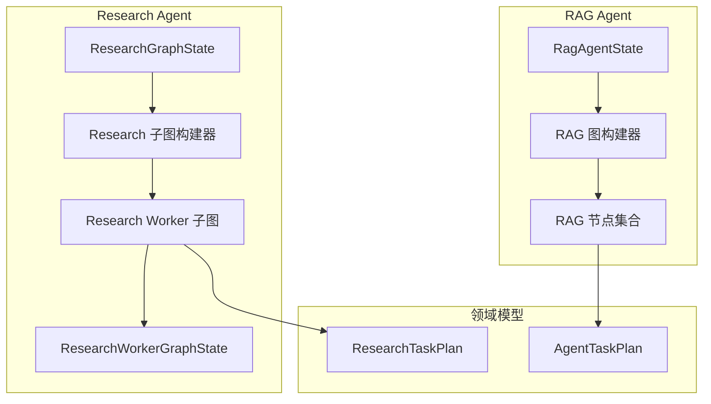
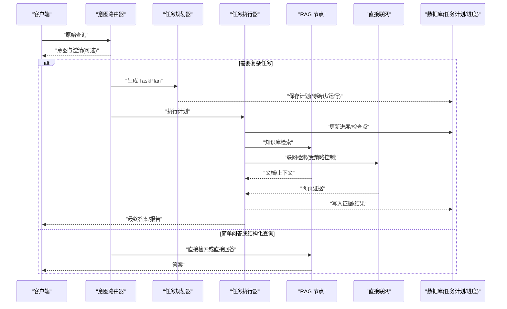
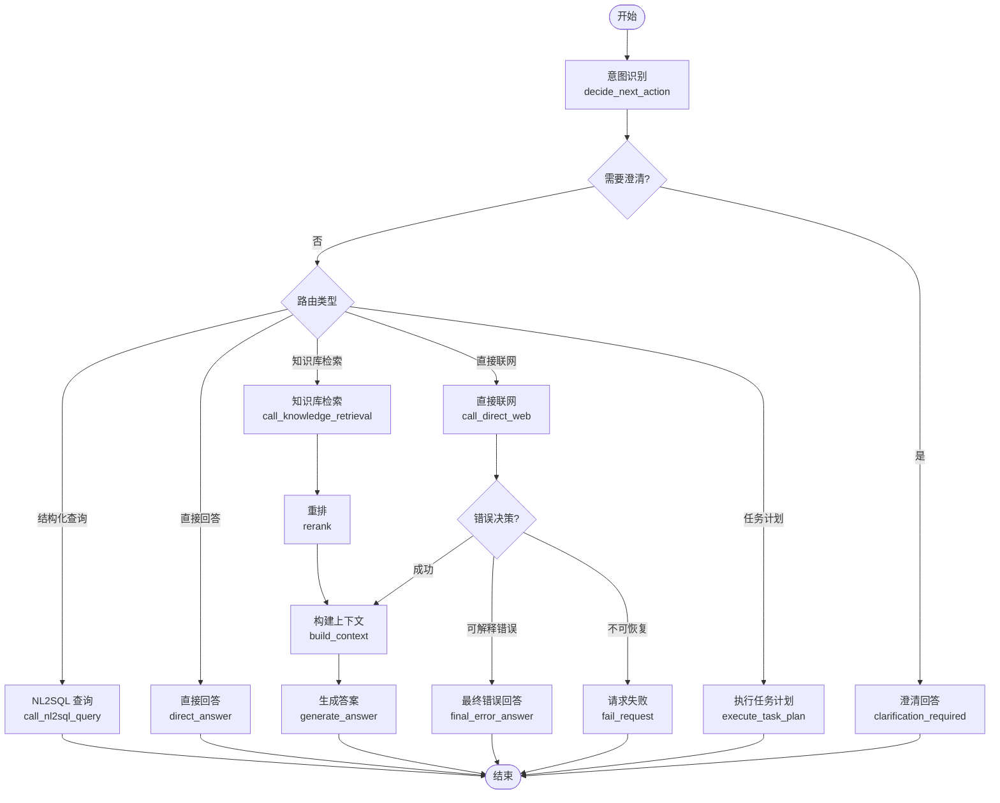
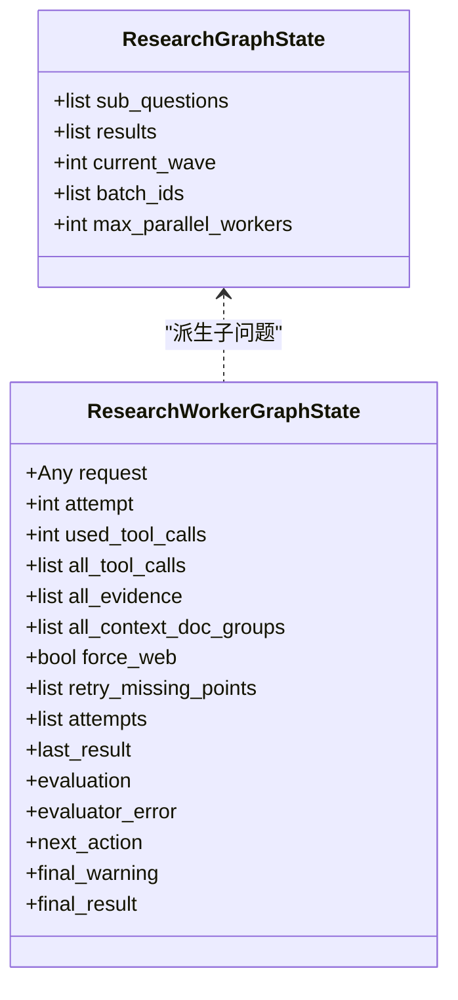
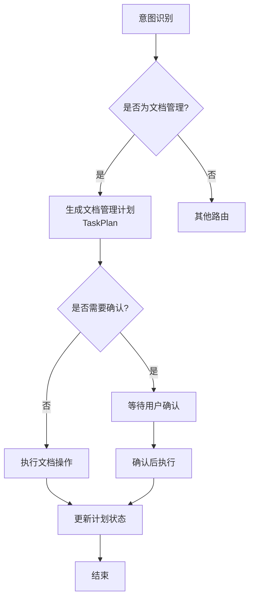
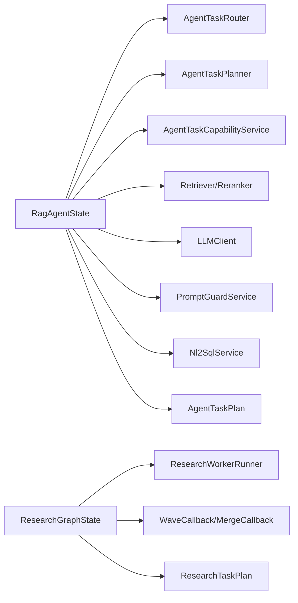

# Agent 工作流状态

<cite>
**本文引用的文件**
- [rag_agent_state.py](file://src/fast_app/graph/rag_agent/rag_agent_state.py)
- [rag_agent_builder.py](file://src/fast_app/graph/rag_agent/rag_agent_builder.py)
- [rag_agent_nodes.py](file://src/fast_app/graph/rag_agent/rag_agent_nodes.py)
- [rag_graph_state.py](file://src/fast_app/graph/rag/rag_graph_state.py)
- [agentic_research_graph.py](file://src/fast_app/graph/research/agentic_research_graph.py)
- [research_worker_graph.py](file://src/fast_app/graph/research/research_worker_graph.py)
- [agent_task_plan.py](file://src/fast_app/domain/agent_task_plan.py)
- [research_task_plan.py](file://src/fast_app/domain/research_task_plan.py)
</cite>

## 目录
1. [简介](#简介)
2. [项目结构](#项目结构)
3. [核心组件](#核心组件)
4. [架构总览](#架构总览)
5. [详细组件分析](#详细组件分析)
6. [依赖关系分析](#依赖关系分析)
7. [性能与可观测性](#性能与可观测性)
8. [故障排查指南](#故障排查指南)
9. [结论](#结论)
10. [附录：自定义 Agent 状态设计与迁移指导](#附录自定义-agent-状态设计与迁移指导)

## 简介
本文件系统化梳理 Agent 工作流的状态模型、状态转换条件、持久化策略以及监控调试方法，覆盖三类 Agent：
- RAG Agent：面向问答、结构化数据查询、直接联网检索的通用 Agent。
- Research Agent：面向复杂问题拆解、按依赖波次并行执行研究 Worker 的多步研究链路。
- Document Management Agent：面向知识库文档创建、修改、删除等高风险操作的计划确认与执行。

重点包括：
- 不同 Agent 的状态结构与字段含义。
- 基于意图识别、任务分解、执行进度和错误策略的状态转换。
- 内存状态（LangGraph State）与数据库状态（TaskPlan、Worker Checkpoint、进度事件）的同步机制。
- 状态快照、追踪与错误归因方法。
- 为开发者提供扩展新 Agent 状态与迁移路径的实践建议。

## 项目结构
Agent 状态与图编排主要分布在以下模块：
- RAG Agent 状态与图：RAG Agent 的 TypedDict 状态定义、节点实现与图构建。
- Research Agent 状态与图：Research Graph 子图负责依赖波次调度；Research Worker Graph 负责单个子问题的多轮工具调用与证据评估。
- 领域模型：AgentTaskPlan、ResearchTaskPlan 等用于跨请求持久化的任务计划、证据与进度。
- 基础 RAG Graph：轻量 RAG 流程的状态定义，作为 RAG Agent 的复用能力来源。

图表来源
- [rag_agent_state.py:32-140](file://src/fast_app/graph/rag_agent/rag_agent_state.py#L32-L140)
- [rag_agent_builder.py:37-199](file://src/fast_app/graph/rag_agent/rag_agent_builder.py#L37-L199)
- [agentic_research_graph.py:34-54](file://src/fast_app/graph/research/agentic_research_graph.py#L34-L54)
- [research_worker_graph.py:18-37](file://src/fast_app/graph/research/research_worker_graph.py#L18-L37)
- [agent_task_plan.py:26-324](file://src/fast_app/domain/agent_task_plan.py#L26-L324)
- [research_task_plan.py:787-800](file://src/fast_app/domain/research_task_plan.py#L787-L800)

章节来源
- [rag_agent_state.py:32-140](file://src/fast_app/graph/rag_agent/rag_agent_state.py#L32-L140)
- [rag_agent_builder.py:37-199](file://src/fast_app/graph/rag_agent/rag_agent_builder.py#L37-L199)
- [agentic_research_graph.py:34-54](file://src/fast_app/graph/research/agentic_research_graph.py#L34-L54)
- [research_worker_graph.py:18-37](file://src/fast_app/graph/research/research_worker_graph.py#L18-L37)
- [agent_task_plan.py:26-324](file://src/fast_app/domain/agent_task_plan.py#L26-L324)
- [research_task_plan.py:787-800](file://src/fast_app/domain/research_task_plan.py#L787-L800)

## 核心组件
- RagAgentState：RAG Agent 的运行时状态，包含用户输入、路由决策、循环控制、工具调用、检索结果、答案生成、权限上下文与任务计划引用。
- GraphRagState：基础 RAG 流程的状态，用于简单检索与回答路径。
- ResearchGraphState：Research 子图的运行状态，维护子问题列表、结果合并、当前波次与并发限制。
- ResearchWorkerGraphState：单个 Research Worker 的多轮工具调用与证据评估状态。
- AgentTaskPlan / ResearchTaskPlan：跨请求持久化的任务计划、证据、进度与最终输出。

章节来源
- [rag_agent_state.py:32-140](file://src/fast_app/graph/rag_agent/rag_agent_state.py#L32-L140)
- [rag_graph_state.py:15-37](file://src/fast_app/graph/rag/rag_graph_state.py#L15-L37)
- [agentic_research_graph.py:34-54](file://src/fast_app/graph/research/agentic_research_graph.py#L34-L54)
- [research_worker_graph.py:18-37](file://src/fast_app/graph/research/research_worker_graph.py#L18-L37)
- [agent_task_plan.py:26-324](file://src/fast_app/domain/agent_task_plan.py#L26-L324)
- [research_task_plan.py:787-800](file://src/fast_app/domain/research_task_plan.py#L787-L800)

## 架构总览
下图展示三类 Agent 的状态流转与关键节点交互：

图表来源
- [rag_agent_nodes.py:416-691](file://src/fast_app/graph/rag_agent/rag_agent_nodes.py#L416-L691)
- [rag_agent_builder.py:140-199](file://src/fast_app/graph/rag_agent/rag_agent_builder.py#L140-L199)
- [agentic_research_graph.py:111-276](file://src/fast_app/graph/research/agentic_research_graph.py#L111-L276)
- [research_worker_graph.py:45-79](file://src/fast_app/graph/research/research_worker_graph.py#L45-L79)
- [agent_task_plan.py:26-324](file://src/fast_app/domain/agent_task_plan.py#L26-L324)
- [research_task_plan.py:787-800](file://src/fast_app/domain/research_task_plan.py#L787-L800)

## 详细组件分析

### RAG Agent 状态与转换
RAG Agent 的核心状态是 RagAgentState，它承载：
- 输入与改写：original_query、query、rewritten_query、history_window_text、summary_text 等。
- 路由与意图：route、route_intent、route_confidence、route_source、clarification_required 等。
- 控制与预算：step_count、tool_call_count、loop_decision、error_decision。
- 工具与检索：tool_name、tool_error、docs、context、nl2sql_result。
- 权限与计划：current_user、agent_task_plan、agent_task_plan_id、requires_confirmation。

典型转换流程：
- 意图识别：decide_next_action 根据 Router 返回的意图决定下一步。
- 澄清分支：若意图不明确，进入 clarification_required 并结束。
- 直接回答：若无需外部事实，直接进入 direct_answer。
- 知识库检索：进入 call_knowledge_retrieval -> rerank -> build_context -> generate_answer。
- 结构化数据查询：进入 call_nl2sql_query 并结束。
- 直接联网：进入 call_direct_web，成功后进入 build_context。
- 任务执行：若生成 TaskPlan，进入 execute_task_plan 并结束（等待确认或异步执行）。

图表来源
- [rag_agent_builder.py:140-199](file://src/fast_app/graph/rag_agent/rag_agent_builder.py#L140-L199)
- [rag_agent_nodes.py:380-413](file://src/fast_app/graph/rag_agent/rag_agent_nodes.py#L380-L413)
- [rag_agent_nodes.py:416-691](file://src/fast_app/graph/rag_agent/rag_agent_nodes.py#L416-L691)
- [rag_agent_nodes.py:694-743](file://src/fast_app/graph/rag_agent/rag_agent_nodes.py#L694-L743)
- [rag_agent_nodes.py:746-776](file://src/fast_app/graph/rag_agent/rag_agent_nodes.py#L746-L776)

章节来源
- [rag_agent_state.py:32-140](file://src/fast_app/graph/rag_agent/rag_agent_state.py#L32-L140)
- [rag_agent_builder.py:140-199](file://src/fast_app/graph/rag_agent/rag_agent_builder.py#L140-L199)
- [rag_agent_nodes.py:380-413](file://src/fast_app/graph/rag_agent/rag_agent_nodes.py#L380-L413)
- [rag_agent_nodes.py:416-691](file://src/fast_app/graph/rag_agent/rag_agent_nodes.py#L416-L691)
- [rag_agent_nodes.py:694-743](file://src/fast_app/graph/rag_agent/rag_agent_nodes.py#L694-L743)
- [rag_agent_nodes.py:746-776](file://src/fast_app/graph/rag_agent/rag_agent_nodes.py#L746-L776)

### Research Agent 状态与转换
Research Agent 由两个子图组成：
- ResearchGraphState：管理子问题依赖、波次派发、结果合并与终止。
- ResearchWorkerGraphState：单个工作者在“尝试执行 -> 证据评估 -> 路由选择 -> 重试/完成/受限”之间循环。

依赖校验与波次派发：
- validate_dependencies：拒绝重复、缺失或循环依赖。
- select_ready_wave：根据已完成结果计算下一批可并行执行的子问题。
- dispatch_wave：使用 Send 扇出多个 research_worker。
- merge_wave_results：收集本波结果，持久化进度后清空批次标记。
- finish：所有子问题终态时结束。

Worker 内部循环：
- run_attempt：执行一次工具调用。
- evaluate_evidence：评估证据充分性。
- route_evaluation：根据评估结果选择 complete、retry 或 limited。
- prepare_retry：准备重试参数。
- finalize_limited：在受限情况下完成。

图表来源
- [agentic_research_graph.py:34-54](file://src/fast_app/graph/research/agentic_research_graph.py#L34-L54)
- [research_worker_graph.py:18-37](file://src/fast_app/graph/research/research_worker_graph.py#L18-L37)

章节来源
- [agentic_research_graph.py:56-276](file://src/fast_app/graph/research/agentic_research_graph.py#L56-L276)
- [research_worker_graph.py:45-79](file://src/fast_app/graph/research/research_worker_graph.py#L45-L79)

### Document Management Agent 状态与转换
Document Management Agent 属于 RAG Agent 的一种意图分支，对应 knowledge_document_management。其状态体现在：
- 路由阶段：decide_next_action 将意图识别为文档管理，并生成 TaskPlan。
- 计划阶段：TaskPlan 包含步骤、风险等级、是否需要人工确认等。
- 执行阶段：execute_task_plan 触发高风险动作，可能需要用户确认后再真实执行。
- 持久化：TaskPlan 状态（created、running、waiting_confirmation、completed、failed、cancelled）记录在数据库中。

图表来源
- [rag_agent_nodes.py:597-605](file://src/fast_app/graph/rag_agent/rag_agent_nodes.py#L597-L605)
- [agent_task_plan.py:26-324](file://src/fast_app/domain/agent_task_plan.py#L26-L324)

章节来源
- [rag_agent_nodes.py:597-605](file://src/fast_app/graph/rag_agent/rag_agent_nodes.py#L597-L605)
- [agent_task_plan.py:26-324](file://src/fast_app/domain/agent_task_plan.py#L26-L324)

### 基础 RAG Graph 状态
GraphRagState 是轻量 RAG 流程的状态，用于简单检索与回答：
- 输入：query、mode、top_k、candidate_k、min_score、filters。
- 运行上下文：operation、need_retrieval、route、route_reason、tool_name、tool_result_count、tool_error。
- 结果：docs、context、answer。

章节来源
- [rag_graph_state.py:15-37](file://src/fast_app/graph/rag/rag_graph_state.py#L15-L37)

## 依赖关系分析
- RAG Agent 依赖 Router、Planner、CapabilityService、Retriever、Reranker、LLMClient、PromptGuard、MarkdownParentContextExpander、Nl2SqlService。
- Research Agent 依赖 WorkerRunner、WaveCallback、MergeCallback、StopChecker。
- 领域模型被多处引用，确保状态与持久化一致。

图表来源
- [rag_agent_builder.py:37-51](file://src/fast_app/graph/rag_agent/rag_agent_builder.py#L37-L51)
- [agentic_research_graph.py:18-24](file://src/fast_app/graph/research/agentic_research_graph.py#L18-L24)
- [agent_task_plan.py:26-324](file://src/fast_app/domain/agent_task_plan.py#L26-L324)
- [research_task_plan.py:787-800](file://src/fast_app/domain/research_task_plan.py#L787-L800)

章节来源
- [rag_agent_builder.py:37-51](file://src/fast_app/graph/rag_agent/rag_agent_builder.py#L37-L51)
- [agentic_research_graph.py:18-24](file://src/fast_app/graph/research/agentic_research_graph.py#L18-L24)
- [agent_task_plan.py:26-324](file://src/fast_app/domain/agent_task_plan.py#L26-L324)
- [research_task_plan.py:787-800](file://src/fast_app/domain/research_task_plan.py#L787-L800)

## 性能与可观测性
- 循环控制：check_loop_limits 通过配置限制 step_count 与 tool_call_count，防止无限循环。
- 错误策略：classify_agent_error 将异常分类为 AgentErrorDecision，统一走 final_answer 或 fail_request。
- 追踪与快照：每个节点通过 LangSmith 子 run 记录 step_index、inputs、outputs，便于端到端回溯。
- 并发控制：Research Graph 通过 max_parallel_workers 限制外部工具并发，避免资源耗尽。
- 进度事件：Research Worker 通过 checkpoint 与 progress event 上报阶段变化，支持 SSE 实时展示。

章节来源
- [rag_agent_nodes.py:779-800](file://src/fast_app/graph/rag_agent/rag_agent_nodes.py#L779-L800)
- [rag_agent_nodes.py:333-353](file://src/fast_app/graph/rag_agent/rag_agent_nodes.py#L333-L353)
- [agentic_research_graph.py:111-276](file://src/fast_app/graph/research/agentic_research_graph.py#L111-L276)
- [research_worker_graph.py:45-79](file://src/fast_app/graph/research/research_worker_graph.py#L45-L79)

## 故障排查指南
- 意图识别失败：检查 decide_next_action 的 route_intent、route_confidence、route_source，确认 Router 是否可用。
- 澄清分支：查看 clarification_code 与 clarification_question，确认用户输入是否足够明确。
- 工具调用错误：读取 tool_error 与 error_decision，判断是可解释错误还是不可恢复错误。
- 循环上限：若达到 loop limit，检查 settings 中的 AgentLoopLimits 配置。
- Research 依赖失败：查看 skipped 原因与级联跳过逻辑，确认前置子问题状态。
- 证据不足：关注 evaluation 的 verdict、missing_points 与 recommended_action，决定是否重试或升级联网。

章节来源
- [rag_agent_nodes.py:416-691](file://src/fast_app/graph/rag_agent/rag_agent_nodes.py#L416-L691)
- [rag_agent_nodes.py:779-800](file://src/fast_app/graph/rag_agent/rag_agent_nodes.py#L779-L800)
- [agentic_research_graph.py:131-199](file://src/fast_app/graph/research/agentic_research_graph.py#L131-L199)

## 结论
本工作流以 TypedDict 状态为核心，结合 LangGraph 的条件边与回调，实现了 RAG Agent、Research Agent 与 Document Management Agent 的可观测、可控、可恢复的执行路径。通过统一的错误策略、循环控制与进度事件，系统在复杂任务场景下具备较强的稳定性与可调试性。开发者可基于现有状态模型扩展新的 Agent 分支，并通过 TaskPlan 与 Worker Checkpoint 实现跨请求的持久化与恢复。

## 附录：自定义 Agent 状态设计与迁移指导
- 新增状态字段：
  - 在 RagAgentState 或 ResearchWorkerGraphState 中增加必要字段，保持向后兼容（使用 NotRequired）。
  - 为新路由添加枚举值并在 conditional_edges 中注册。
- 新增节点与边：
  - 在 rag_agent_builder.py 中添加节点与条件边，遵循“判断与执行分离”的原则。
  - 在 Research Graph 中扩展 Worker 子图，确保依赖波次与并发控制不受影响。
- 持久化策略：
  - 将关键状态投影到 AgentTaskPlan 或 ResearchTaskPlan，确保跨请求可恢复。
  - 使用 Worker Checkpoint 与 Progress Event 记录中间状态，支持中断与恢复。
- 迁移指导：
  - 旧状态缺失时提供默认值，保证兼容性。
  - 逐步替换硬编码路由为配置化路由，提升可维护性。
  - 通过 LangSmith 追踪验证新路径的正确性与性能。

章节来源
- [rag_agent_state.py:142-203](file://src/fast_app/graph/rag_agent/rag_agent_state.py#L142-L203)
- [rag_agent_builder.py:140-199](file://src/fast_app/graph/rag_agent/rag_agent_builder.py#L140-L199)
- [research_worker_graph.py:45-79](file://src/fast_app/graph/research/research_worker_graph.py#L45-L79)
- [agent_task_plan.py:26-324](file://src/fast_app/domain/agent_task_plan.py#L26-L324)
- [research_task_plan.py:734-785](file://src/fast_app/domain/research_task_plan.py#L734-L785)