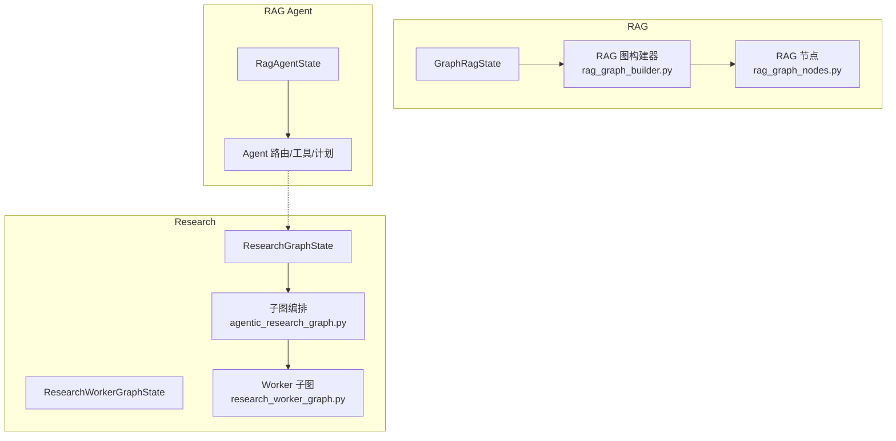
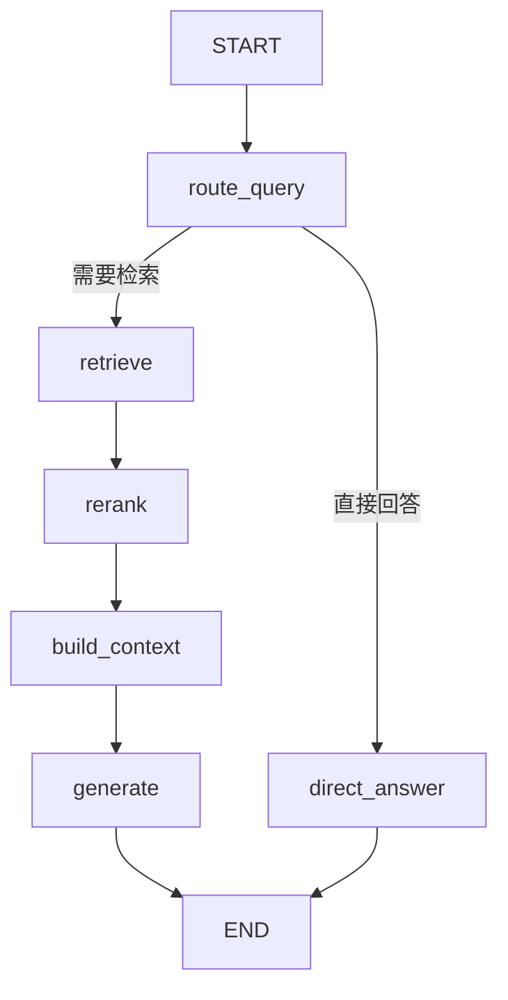
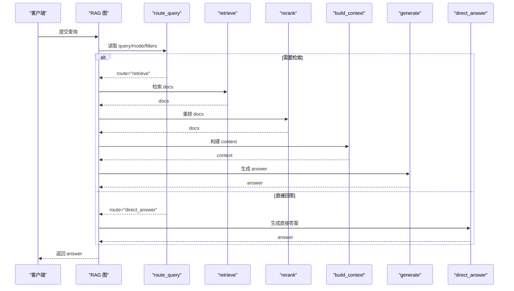
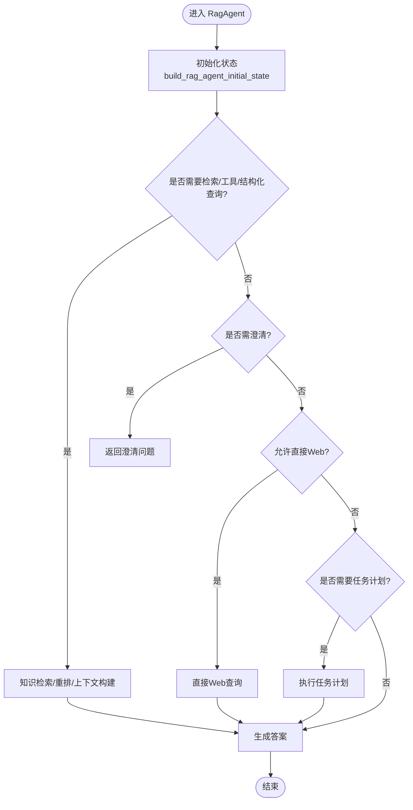
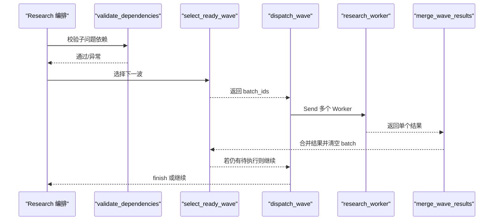
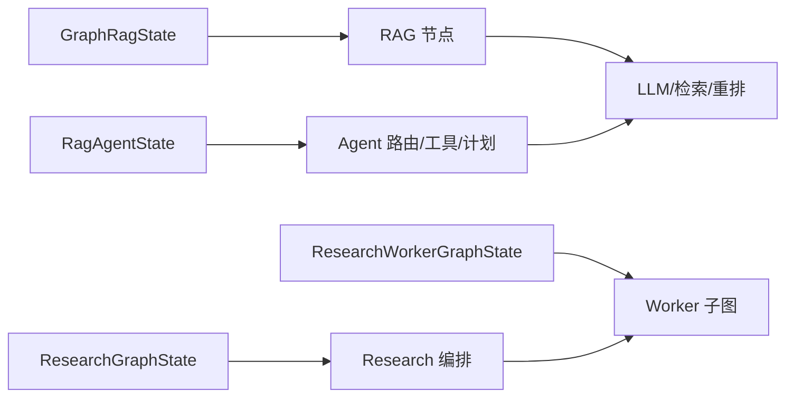

# LangGraph 状态机设计

<cite>
**本文引用的文件**
- [src/fast_app/graph/rag/rag_state.py](file://python-agent-study/src/fast_app/graph/rag/rag_state.py)
- [src/fast_app/graph/rag/rag_graph_state.py](file://python-agent-study/src/fast_app/graph/rag/rag_graph_state.py)
- [src/fast_app/graph/rag/rag_graph_builder.py](file://python-agent-study/src/fast_app/graph/rag/rag_graph_builder.py)
- [src/fast_app/graph/rag_agent/rag_agent_state.py](file://python-agent-study/src/fast_app/graph/rag_agent/rag_agent_state.py)
- [src/fast_app/graph/research/agentic_research_graph.py](file://python-agent-study/src/fast_app/graph/research/agentic_research_graph.py)
- [src/fast_app/graph/research/research_worker_graph.py](file://python-agent-study/src/fast_app/graph/research/research_worker_graph.py)
- [src/app/graph/rag_state.py](file://python-agent-study/src/app/graph/rag_state.py)
</cite>

## 目录
1. [简介](#简介)
2. [项目结构](#项目结构)
3. [核心组件](#核心组件)
4. [架构总览](#架构总览)
5. [详细组件分析](#详细组件分析)
6. [依赖关系分析](#依赖关系分析)
7. [性能考虑](#性能考虑)
8. [故障排查指南](#故障排查指南)
9. [结论](#结论)
10. [附录](#附录)

## 简介
本文件面向使用 LangGraph 构建 RAG、RAG Agent 与 Research 工作流的开发者，系统性梳理状态机设计：包括 RagState、RagAgentState、GraphRagState、ResearchExecution 相关状态的定义、字段类型、约束与默认值；解释节点间状态传递机制、状态更新规则与验证逻辑；对比不同 Agent 类型的状态差异；提供状态转换图与数据流图，并给出自定义扩展与调试建议。

## 项目结构
本项目在 fast_app 中实现了三类与状态机相关的模块：
- RAG Graph：基于 GraphRagState 的检索增强生成流程，包含路由、检索、重排、上下文构建、生成与直接回答等节点。
- RAG Agent：在 RAG 基础上扩展了意图路由、澄清、工具调用、任务计划、权限过滤、多入口（run/stream/stream_events）等能力，使用 RagAgentState。
- Research：将复杂研究任务拆分为子问题，按依赖波次并行执行，使用 ResearchGraphState 与 ResearchWorkerGraphState。

图表来源
- [src/fast_app/graph/rag/rag_graph_builder.py:21-89](file://python-agent-study/src/fast_app/graph/rag/rag_graph_builder.py#L21-L89)
- [src/fast_app/graph/research/agentic_research_graph.py:111-276](file://python-agent-study/src/fast_app/graph/research/agentic_research_graph.py#L111-L276)
- [src/fast_app/graph/research/research_worker_graph.py:45-79](file://python-agent-study/src/fast_app/graph/research/research_worker_graph.py#L45-L79)

章节来源
- [src/fast_app/graph/rag/rag_graph_builder.py:21-89](file://python-agent-study/src/fast_app/graph/rag/rag_graph_builder.py#L21-L89)
- [src/fast_app/graph/research/agentic_research_graph.py:111-276](file://python-agent-study/src/fast_app/graph/research/agentic_research_graph.py#L111-L276)
- [src/fast_app/graph/research/research_worker_graph.py:45-79](file://python-agent-study/src/fast_app/graph/research/research_worker_graph.py#L45-L79)

## 核心组件
本节聚焦状态定义、初始构造与关键约束。

- RagState（简化版，用于早期或示例）
  - 字段：query、docs、context、answer
  - 用途：最小化 RAG 状态，便于演示或轻量场景
  - 参考路径：[src/app/graph/rag_state.py:8-19](file://python-agent-study/src/app/graph/rag_state.py#L8-L19)

- RagState（fast_app 中的轻量版本）
  - 字段：query、docs、context、answer
  - 说明：与 app 版本一致，作为后续扩展的基础
  - 参考路径：[src/fast_app/graph/rag/rag_state.py:7-11](file://python-agent-study/src/fast_app/graph/rag/rag_state.py#L7-L11)

- GraphRagState（LangGraph 图状态）
  - 输入字段：query、mode、top_k、candidate_k、min_score、filters
  - 运行上下文：operation、need_retrieval、route、route_reason、tool_name、tool_result_count、tool_error
  - 中间产物：docs、context、answer
  - 初始构造：build_graph_initial_state 会合并权限范围到 filters，并设置默认空集合
  - 参考路径：
    - [src/fast_app/graph/rag/rag_graph_state.py:15-37](file://python-agent-study/src/fast_app/graph/rag/rag_graph_state.py#L15-L37)
    - [src/fast_app/graph/rag/rag_graph_state.py:39-65](file://python-agent-study/src/fast_app/graph/rag/rag_graph_state.py#L39-L65)

- RagAgentState（RAG Agent 扩展状态）
  - 用户请求与上下文：session_id、original_query、query、rewritten_query、history_window_text、planning_history、query_rewrite_reason、summary_text、summary_used、summary_version、summary_source_message_count、summary_source_message_ids
  - 检索策略与权限：mode、top_k、candidate_k、min_score、filters、allow_web_fallback、allow_direct_web、dataset_id、nl2sql_action
  - Agent 控制：operation、route、route_reason、route_intent、route_confidence、route_source、route_model、route_latency_ms、route_rule_matched、clarification_required、clarification_code、clarification_question、final_reason
  - 循环与错误控制：step_count、tool_call_count、loop_decision、error_decision
  - 工具与 RAG 产物：tool_name、tool_error、docs、context、nl2sql_result、answer
  - 权限与任务计划：current_user、agent_task_plan、agent_task_plan_id、requires_confirmation
  - 初始构造：build_rag_agent_initial_state 集中初始化所有字段，确保跨请求隔离与可观测性
  - 参考路径：
    - [src/fast_app/graph/rag_agent/rag_agent_state.py:16-140](file://python-agent-study/src/fast_app/graph/rag_agent/rag_agent_state.py#L16-L140)
    - [src/fast_app/graph/rag_agent/rag_agent_state.py:142-203](file://python-agent-study/src/fast_app/graph/rag_agent/rag_agent_state.py#L142-L203)

- Research 状态
  - ResearchGraphState：sub_questions、results（带 reducer）、current_wave、batch_ids、max_parallel_workers
  - ResearchWorkerGraphState：request、attempt、used_tool_calls、all_tool_calls、all_evidence、all_context_doc_groups、force_web、retry_missing_points、attempts、last_result、evaluation、evaluator_error、next_action、final_warning、final_result
  - 参考路径：
    - [src/fast_app/graph/research/agentic_research_graph.py:34-45](file://python-agent-study/src/fast_app/graph/research/agentic_research_graph.py#L34-L45)
    - [src/fast_app/graph/research/research_worker_graph.py:18-37](file://python-agent-study/src/fast_app/graph/research/research_worker_graph.py#L18-L37)

章节来源
- [src/app/graph/rag_state.py:8-19](file://python-agent-study/src/app/graph/rag_state.py#L8-L19)
- [src/fast_app/graph/rag/rag_state.py:7-11](file://python-agent-study/src/fast_app/graph/rag/rag_state.py#L7-L11)
- [src/fast_app/graph/rag/rag_graph_state.py:15-65](file://python-agent-study/src/fast_app/graph/rag/rag_graph_state.py#L15-L65)
- [src/fast_app/graph/rag_agent/rag_agent_state.py:16-203](file://python-agent-study/src/fast_app/graph/rag_agent/rag_agent_state.py#L16-L203)
- [src/fast_app/graph/research/agentic_research_graph.py:34-45](file://python-agent-study/src/fast_app/graph/research/agentic_research_graph.py#L34-L45)
- [src/fast_app/graph/research/research_worker_graph.py:18-37](file://python-agent-study/src/fast_app/graph/research/research_worker_graph.py#L18-L37)

## 架构总览
下图展示 RAG Graph 的核心节点与条件边，体现“先判断是否需要检索”的设计思想。

图表来源
- [src/fast_app/graph/rag/rag_graph_builder.py:21-89](file://python-agent-study/src/fast_app/graph/rag/rag_graph_builder.py#L21-L89)

章节来源
- [src/fast_app/graph/rag/rag_graph_builder.py:21-89](file://python-agent-study/src/fast_app/graph/rag/rag_graph_builder.py#L21-L89)

## 详细组件分析

### RAG 状态机：GraphRagState 与节点流转
- 状态字段与职责
  - query/mode/top_k/candidate_k/min_score/filters：决定检索策略与权限过滤
  - operation/need_retrieval/route/route_reason：描述当前执行入口与下一步动作
  - docs/context/answer：节点间共享的中间产物与最终输出
- 节点顺序与数据流
  - route_query：根据 query 与配置判断是否需要检索
  - retrieve：执行向量/关键词/混合检索
  - rerank：对候选结果进行重排
  - build_context：结合 docs 与提示词安全策略构建上下文
  - generate：调用 LLM 生成答案
  - direct_answer：当无需检索时直接返回预设或简单答案
- 状态更新规则
  - 每个节点返回增量字典，由 LangGraph 合并到全局 state
  - 条件边读取 route 字段决定下一节点
- 验证逻辑
  - 路由决策写入 route 与 route_reason，供 trace 与前端展示
  - 权限过滤通过 filters 注入，避免下游绕过

图表来源
- [src/fast_app/graph/rag/rag_graph_builder.py:21-89](file://python-agent-study/src/fast_app/graph/rag/rag_graph_builder.py#L21-L89)

章节来源
- [src/fast_app/graph/rag/rag_graph_builder.py:21-89](file://python-agent-study/src/fast_app/graph/rag/rag_graph_builder.py#L21-L89)

### RAG Agent 状态机：RagAgentState 与多入口
- 状态差异
  - 相比 GraphRagState，RagAgentState 增加了意图路由、澄清、工具调用、任务计划、权限上下文、多入口操作模式等字段
  - 支持 run/stream/stream_events 三种入口，统一复用同一套节点
- 路由与控制
  - route：内部下一步动作（如 knowledge_retrieval、structured_data_query、direct_web、execute_task_plan 等）
  - clarification_*：当证据不足时要求用户澄清
  - step_count/tool_call_count：限制循环与工具预算
  - loop_decision/error_decision：控制继续或终止
- 数据流
  - 从原始 query 开始，可能经过 rewrite、摘要融合、检索、结构化查询、Web 兜底、任务计划执行等路径
  - 最终 answer 由所选路径生成，同时记录 final_reason 用于归因

图表来源
- [src/fast_app/graph/rag_agent/rag_agent_state.py:16-203](file://python-agent-study/src/fast_app/graph/rag_agent/rag_agent_state.py#L16-L203)

章节来源
- [src/fast_app/graph/rag_agent/rag_agent_state.py:16-203](file://python-agent-study/src/fast_app/graph/rag_agent/rag_agent_state.py#L16-L203)

### Research 状态机：依赖波次与 Worker 纠正循环
- 依赖校验与波次派发
  - validate_dependencies：检查重复 ID、缺失依赖、循环依赖
  - select_ready_wave：基于已完成结果选择下一批可并行执行的子问题
  - dispatch_wave：使用 Send 扇出多个 research_worker
  - merge_wave_results：收集本轮结果，持久化进度后清空 batch 标记
- Worker 纠正循环
  - run_attempt：尝试一次执行
  - evaluate_evidence：评估证据质量
  - route_evaluation：根据评估结果决定 complete/retry/limited
  - prepare_retry：准备重试参数
  - finalize_limited：有限完成
- 状态字段
  - ResearchGraphState：维护 sub_questions、results（reducer 追加）、current_wave、batch_ids、max_parallel_workers
  - ResearchWorkerGraphState：记录 attempt、工具调用轨迹、证据、上下文分组、评估结果、最终结果等

图表来源
- [src/fast_app/graph/research/agentic_research_graph.py:111-276](file://python-agent-study/src/fast_app/graph/research/agentic_research_graph.py#L111-L276)
- [src/fast_app/graph/research/research_worker_graph.py:45-79](file://python-agent-study/src/fast_app/graph/research/research_worker_graph.py#L45-L79)

章节来源
- [src/fast_app/graph/research/agentic_research_graph.py:111-276](file://python-agent-study/src/fast_app/graph/research/agentic_research_graph.py#L111-L276)
- [src/fast_app/graph/research/research_worker_graph.py:45-79](file://python-agent-study/src/fast_app/graph/research/research_worker_graph.py#L45-L79)

## 依赖关系分析
- 组件耦合
  - RAG Graph 依赖 retriever、reranker、llm_client、prompt_guard、parent_expander 等外部组件
  - RAG Agent 依赖路由、工具、权限策略、任务计划模型
  - Research 编排与 Worker 解耦：编排只负责调度，业务动作通过回调注入
- 直接/间接依赖
  - GraphRagState 与 RagAgentState 都引用 RetrievedDoc/RagContext，保证产物一致性
  - ResearchGraphState 使用 Annotated[list, operator.add] 实现结果聚合
- 潜在循环
  - Research 图存在“select_ready_wave -> dispatch_wave -> research_worker -> merge_wave_results -> select_ready_wave”的循环，但通过 should_stop 与空 batch 终止
- 外部集成点
  - 权限策略：merge_permission_scope_into_filter_dict 注入 filters
  - LLM/检索/重排：通过接口抽象，便于替换与测试

图表来源
- [src/fast_app/graph/rag/rag_graph_builder.py:21-89](file://python-agent-study/src/fast_app/graph/rag/rag_graph_builder.py#L21-L89)
- [src/fast_app/graph/research/agentic_research_graph.py:111-276](file://python-agent-study/src/fast_app/graph/research/agentic_research_graph.py#L111-L276)
- [src/fast_app/graph/research/research_worker_graph.py:45-79](file://python-agent-study/src/fast_app/graph/research/research_worker_graph.py#L45-L79)

章节来源
- [src/fast_app/graph/rag/rag_graph_builder.py:21-89](file://python-agent-study/src/fast_app/graph/rag/rag_graph_builder.py#L21-L89)
- [src/fast_app/graph/research/agentic_research_graph.py:111-276](file://python-agent-study/src/fast_app/graph/research/agentic_research_graph.py#L111-L276)
- [src/fast_app/graph/research/research_worker_graph.py:45-79](file://python-agent-study/src/fast_app/graph/research/research_worker_graph.py#L45-L79)

## 性能考虑
- 并发与限流
  - Research 通过 max_parallel_workers 限制每波并发，避免外部工具过载
  - RAG Agent 通过 tool_call_count 与 step_count 控制工具与循环预算
- 缓存与降级
  - candidate_k 与 min_score 可调节候选数量与阈值，平衡召回与延迟
  - allow_web_fallback/allow_direct_web 提供网络兜底策略
- 可观测性
  - route_latency_ms、route_rule_matched、route_source 等字段便于追踪路由性能与来源
  - planning_history、all_tool_calls、all_evidence 等用于深度调试

## 故障排查指南
- 路由与澄清
  - 检查 route、route_reason、clarification_required、clarification_code、clarification_question
  - 若频繁澄清，审查 route_intent 与 route_confidence
- 工具与错误
  - 查看 tool_name、tool_error、tool_call_count
  - 关注 error_decision 与 loop_decision，确认是否应恢复或终止
- 权限与过滤
  - 核对 filters 是否正确合并权限范围，避免越权或漏检
- Research 依赖
  - 使用 validate_dependencies 检查重复 ID、缺失依赖、循环依赖
  - 观察 skipped 原因（DEPENDENCY_FAILED），定位失败前置子问题
- 取消与超时
  - Research 在执行前检查 should_stop，抛出 ResearchExecutionCancelled 以安全终止

章节来源
- [src/fast_app/graph/rag_agent/rag_agent_state.py:16-203](file://python-agent-study/src/fast_app/graph/rag_agent/rag_agent_state.py#L16-L203)
- [src/fast_app/graph/research/agentic_research_graph.py:56-108](file://python-agent-study/src/fast_app/graph/research/agentic_research_graph.py#L56-L108)
- [src/fast_app/graph/research/agentic_research_graph.py:124-199](file://python-agent-study/src/fast_app/graph/research/agentic_research_graph.py#L124-L199)

## 结论
本项目围绕 LangGraph 的状态机设计，提供了从基础 RAG 到复杂 RAG Agent 与研究任务的完整状态模型与执行流程。通过 TypedDict 明确状态契约，借助条件边与 reducer 实现可控的状态流转与聚合。开发者可在现有状态基础上扩展新字段与新节点，同时利用内置的可观测性与控制字段进行调试与优化。

## 附录
- 自定义状态扩展建议
  - 新增字段时保持向后兼容，优先使用 NotRequired 标注可选字段
  - 在初始构造函数中集中设置默认值，避免节点内隐式补全
  - 为新增字段添加注释与约束说明，便于团队协作
- 调试技巧
  - 打印 route、route_reason、final_reason 快速定位路径
  - 记录 tool_error、evaluator_error 辅助定位外部服务问题
  - 使用 planning_history、all_tool_calls、all_evidence 回溯执行细节