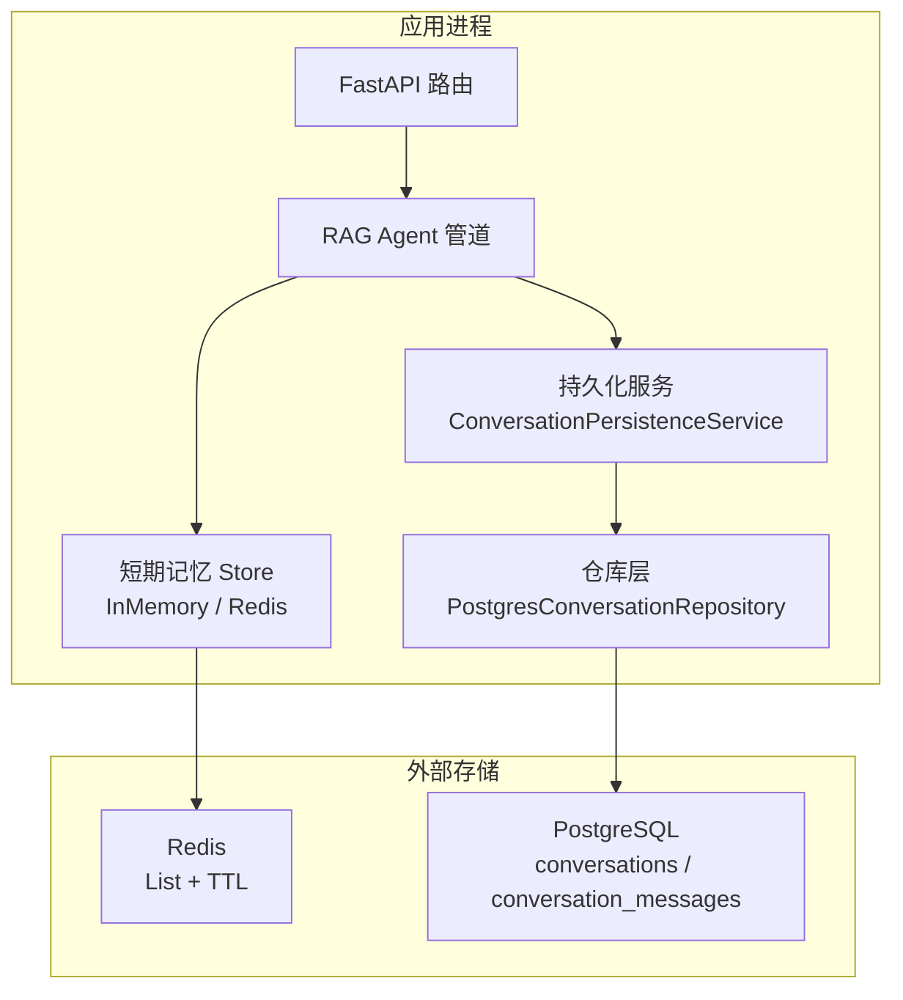
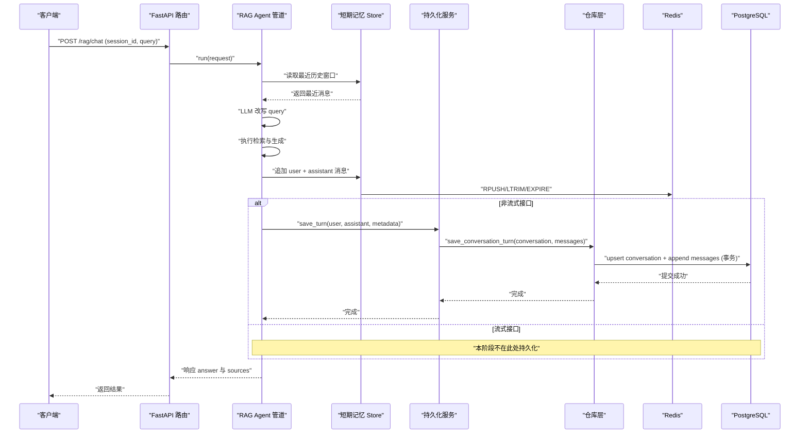
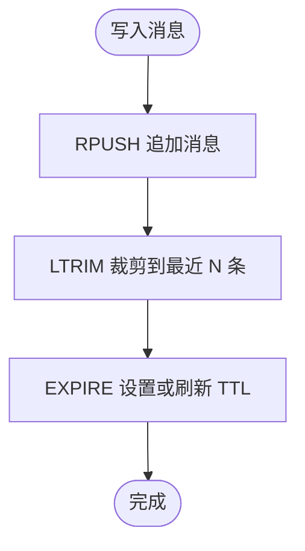
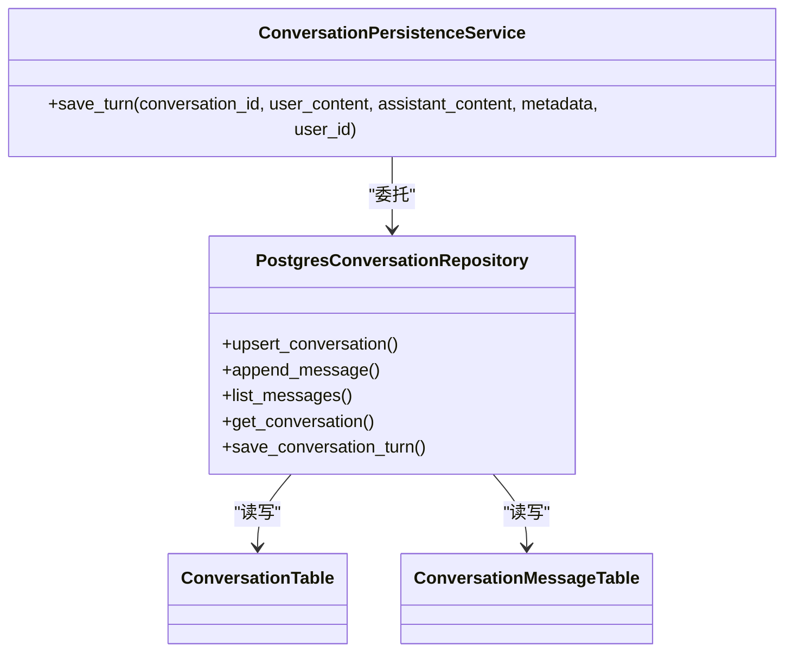
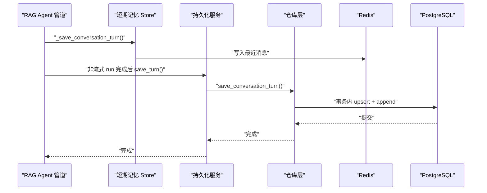
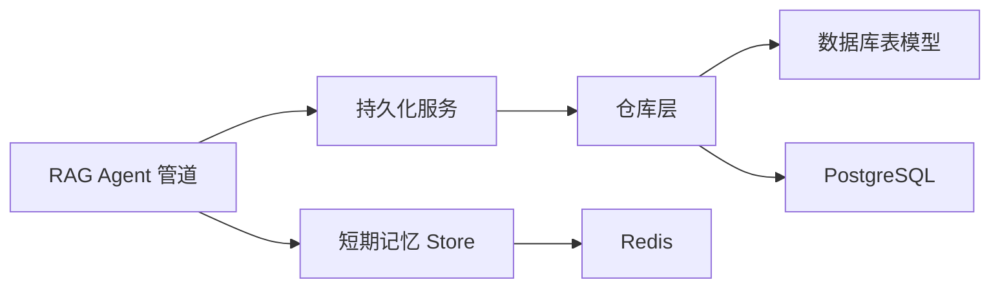

# 状态持久化与同步

<cite>
**本文引用的文件**
- [14-2-Redis短期会话记忆-最近消息-TTL-会话状态.md](file://python-agent-study/learning-docs/phase-14/14-2-Redis短期会话记忆-最近消息-TTL-会话状态.md)
- [14-11-PostgreSQL会话持久化接入RAG主链路.md](file://python-agent-study/learning-docs/phase-14/14-11-PostgreSQL会话持久化接入RAG主链路.md)
- [conversation_memory.py](file://python-agent-study/src/fast_app/services/conversation/conversation_memory.py)
- [conversation_repository.py](file://python-agent-study/src/fast_app/services/conversation/conversation_repository.py)
- [conversation_tables.py](file://python-agent-study/src/fast_app/db/conversation_tables.py)
- [rag_agent_pipeline_service.py](file://python-agent-study/src/fast_app/services/rag/rag_agent_pipeline_service.py)
- [rag_dependencies.py](file://python-agent-study/src/fast_app/dependencies/rag_dependencies.py)
</cite>

## 目录
1. [引言](#引言)
2. [项目结构](#项目结构)
3. [核心组件](#核心组件)
4. [架构总览](#架构总览)
5. [详细组件分析](#详细组件分析)
6. [依赖关系分析](#依赖关系分析)
7. [性能考虑](#性能考虑)
8. [故障排查指南](#故障排查指南)
9. [结论](#结论)
10. [附录](#附录)

## 引言
本文件围绕“状态持久化与同步”展开，聚焦于：
- 短期记忆（Redis）与长期存储（PostgreSQL）的职责边界与使用场景
- 内存状态与数据库状态的同步时机、一致性与事务边界
- 状态版本管理与冲突解决策略
- 备份与恢复机制、数据迁移与回滚操作
- 状态同步流程图与数据一致性模型
- 面向开发者的性能优化与故障处理指导

## 项目结构
本项目在阶段 14 中逐步补齐了多轮对话的状态能力：
- 短期记忆：通过 Redis List 保存最近若干条消息，支持 TTL 自动过期与快速读取
- 长期存储：通过 PostgreSQL 表持久化 Conversation 与 Message，提供可审计、可查询的完整会话记录
- 管道层：RAG Agent Pipeline 在完成回答后，将本轮写入短期记忆；非流式接口完成后再写入长期存储
- 依赖注入：统一装配 Redis client、数据库会话与仓库服务，避免每次请求临时创建连接

图表来源
- [14-2-Redis短期会话记忆-最近消息-TTL-会话状态.md:151-176](file://python-agent-study/learning-docs/phase-14/14-2-Redis短期会话记忆-最近消息-TTL-会话状态.md#L151-L176)
- [14-11-PostgreSQL会话持久化接入RAG主链路.md:225-243](file://python-agent-study/learning-docs/phase-14/14-11-PostgreSQL会话持久化接入RAG主链路.md#L225-L243)

章节来源
- [14-2-Redis短期会话记忆-最近消息-TTL-会话状态.md:121-149](file://python-agent-study/learning-docs/phase-14/14-2-Redis短期会话记忆-最近消息-TTL-会话状态.md#L121-L149)
- [14-11-PostgreSQL会话持久化接入RAG主链路.md:188-223](file://python-agent-study/learning-docs/phase-14/14-11-PostgreSQL会话持久化接入RAG主链路.md#L188-L223)

## 核心组件
- 短期记忆 Store 协议与实现
  - InMemoryConversationMemoryStore：用于本地开发与测试
  - RedisConversationMemoryStore：用于生产短期会话缓存，基于 Redis List 与 TTL
- 长期存储仓库与服务
  - PostgresConversationRepository：封装数据库表操作，提供 upsert、append、list、get 等方法
  - ConversationPersistenceService：聚合一轮对话的持久化逻辑，保证一次 turn 的原子性
- 管道与依赖注入
  - RagAgentPipeline：负责 RAG 执行流程，完成后写入短期记忆；非流式 run 完成后调用持久化服务
  - rag_dependencies：装配 Redis client、DB session、仓库与持久化服务

章节来源
- [conversation_memory.py](file://python-agent-study/src/fast_app/services/conversation/conversation_memory.py)
- [conversation_repository.py](file://python-agent-study/src/fast_app/services/conversation/conversation_repository.py)
- [conversation_tables.py](file://python-agent-study/src/fast_app/db/conversation_tables.py)
- [rag_agent_pipeline_service.py](file://python-agent-study/src/fast_app/services/rag/rag_agent_pipeline_service.py)
- [rag_dependencies.py](file://python-agent-study/src/fast_app/dependencies/rag_dependencies.py)

## 架构总览
整体状态流转遵循“先短期、后长期”的原则：
- 读路径：从短期记忆加载最近历史窗口，供 query rewrite 使用
- 写路径：本轮回答完成后，先写入短期记忆；非流式接口再写入长期存储
- 一致性：一轮对话的持久化尽量在一个事务边界内完成，避免半成功状态

图表来源
- [14-11-PostgreSQL会话持久化接入RAG主链路.md:225-243](file://python-agent-study/learning-docs/phase-14/14-11-PostgreSQL会话持久化接入RAG主链路.md#L225-L243)
- [14-2-Redis短期会话记忆-最近消息-TTL-会话状态.md:151-176](file://python-agent-study/learning-docs/phase-14/14-2-Redis短期会话记忆-最近消息-TTL-会话状态.md#L151-L176)

## 详细组件分析

### 短期记忆：Redis 会话缓存
- 数据结构选择
  - 使用 Redis List 保存每条 ConversationMessage 的 JSON
  - key 设计为 conversation:{id}:messages，便于按会话隔离
- 写入策略
  - RPUSH 追加消息
  - LTRIM 保留最近 N 条，控制列表长度
  - EXPIRE 设置 TTL，仅写入时刷新，避免只读续期
- 读取策略
  - LRANGE 读取最近 limit 条，保持原始顺序
  - 反序列化为 ConversationMessage 供后续使用
- 适用场景
  - 多轮对话的最近上下文窗口
  - 跨请求、跨进程的短期会话状态
  - 为 query rewrite 提供数据来源

图表来源
- [14-2-Redis短期会话记忆-最近消息-TTL-会话状态.md:298-320](file://python-agent-study/learning-docs/phase-14/14-2-Redis短期会话记忆-最近消息-TTL-会话状态.md#L298-L320)
- [14-2-Redis短期会话记忆-最近消息-TTL-会话状态.md:330-364](file://python-agent-study/learning-docs/phase-14/14-2-Redis短期会话记忆-最近消息-TTL-会话状态.md#L330-L364)

章节来源
- [14-2-Redis短期会话记忆-最近消息-TTL-会话状态.md:121-149](file://python-agent-study/learning-docs/phase-14/14-2-Redis短期会话记忆-最近消息-TTL-会话状态.md#L121-L149)
- [14-2-Redis短期会话记忆-最近消息-TTL-会话状态.md:298-320](file://python-agent-study/learning-docs/phase-14/14-2-Redis短期会话记忆-最近消息-TTL-会话状态.md#L298-L320)
- [14-2-Redis短期会话记忆-最近消息-TTL-会话状态.md:330-364](file://python-agent-study/learning-docs/phase-14/14-2-Redis短期会话记忆-最近消息-TTL-会话状态.md#L330-L364)

### 长期存储：PostgreSQL 会话持久化
- 表结构与职责
  - conversations：会话元信息
  - conversation_messages：消息明细，包含 role、content、metadata 等
- 仓库方法
  - upsert_conversation：更新或创建会话
  - append_message：追加消息
  - list_messages：查询会话消息
  - get_conversation：获取会话
- 事务边界
  - 建议新增 save_conversation_turn，将 upsert conversation 与 append user/assistant messages 合并为一个事务，避免半成功状态

图表来源
- [conversation_repository.py](file://python-agent-study/src/fast_app/services/conversation/conversation_repository.py)
- [conversation_tables.py](file://python-agent-study/src/fast_app/db/conversation_tables.py)
- [14-11-PostgreSQL会话持久化接入RAG主链路.md:283-325](file://python-agent-study/learning-docs/phase-14/14-11-PostgreSQL会话持久化接入RAG主链路.md#L283-L325)

章节来源
- [14-11-PostgreSQL会话持久化接入RAG主链路.md:161-186](file://python-agent-study/learning-docs/phase-14/14-11-PostgreSQL会话持久化接入RAG主链路.md#L161-L186)
- [14-11-PostgreSQL会话持久化接入RAG主链路.md:283-325](file://python-agent-study/learning-docs/phase-14/14-11-PostgreSQL会话持久化接入RAG主链路.md#L283-L325)

### 管道与同步时机
- 短期记忆写入时机
  - 管道在执行完一轮问答后，立即写入短期记忆，供下一轮 query rewrite 使用
- 长期存储写入时机
  - 非流式 run 完成后，调用持久化服务保存完整一轮对话
  - 流式接口在本阶段不改变 token-only 协议，持久化延后至后续阶段
- 一致性保证
  - 一轮对话的持久化尽量在一个事务边界内完成
  - 短期记忆与长期存储是互补角色：短期用于低延迟上下文，长期用于事实记录

图表来源
- [rag_agent_pipeline_service.py](file://python-agent-study/src/fast_app/services/rag/rag_agent_pipeline_service.py)
- [conversation_repository.py](file://python-agent-study/src/fast_app/services/conversation/conversation_repository.py)
- [14-11-PostgreSQL会话持久化接入RAG主链路.md:327-364](file://python-agent-study/learning-docs/phase-14/14-11-PostgreSQL会话持久化接入RAG主链路.md#L327-L364)

章节来源
- [rag_agent_pipeline_service.py](file://python-agent-study/src/fast_app/services/rag/rag_agent_pipeline_service.py)
- [conversation_repository.py](file://python-agent-study/src/fast_app/services/conversation/conversation_repository.py)
- [14-11-PostgreSQL会话持久化接入RAG主链路.md:327-364](file://python-agent-study/learning-docs/phase-14/14-11-PostgreSQL会话持久化接入RAG主链路.md#L327-L364)

### 依赖注入与配置
- Redis 客户端生命周期管理
  - 由 FastAPI lifespan 创建与关闭，避免每次请求新建连接
- 配置项
  - memory_store_provider：选择 in_memory 或 redis
  - redis_url：Redis 地址
  - memory_ttl_seconds：会话 TTL
  - memory_max_messages：单会话最大消息数
- 依赖装配
  - 在 rag_dependencies 中装配 Redis client、DB session、仓库与持久化服务
  - 在 get_rag_pipeline 的 rag_agent 分支中注入持久化服务

章节来源
- [14-2-Redis短期会话记忆-最近消息-TTL-会话状态.md:202-274](file://python-agent-study/learning-docs/phase-14/14-2-Redis短期会话记忆-最近消息-TTL-会话状态.md#L202-L274)
- [14-11-PostgreSQL会话持久化接入RAG主链路.md:374-401](file://python-agent-study/learning-docs/phase-14/14-11-PostgreSQL会话持久化接入RAG主链路.md#L374-L401)
- [rag_dependencies.py](file://python-agent-study/src/fast_app/dependencies/rag_dependencies.py)

## 依赖关系分析
- 组件耦合
  - Pipeline 依赖短期记忆 Store 与持久化服务
  - 持久化服务依赖仓库层
  - 仓库层依赖数据库表模型
- 外部依赖
  - Redis：短期记忆、TTL、快速读取
  - PostgreSQL：长期存储、事务、审计
- 潜在循环依赖
  - 当前分层清晰，未发现循环依赖
- 接口契约
  - ConversationMemoryStore 协议定义 append_message 与 list_recent_messages
  - PostgresConversationRepository 定义 upsert、append、list、get 等方法

图表来源
- [conversation_memory.py](file://python-agent-study/src/fast_app/services/conversation/conversation_memory.py)
- [conversation_repository.py](file://python-agent-study/src/fast_app/services/conversation/conversation_repository.py)
- [conversation_tables.py](file://python-agent-study/src/fast_app/db/conversation_tables.py)
- [rag_agent_pipeline_service.py](file://python-agent-study/src/fast_app/services/rag/rag_agent_pipeline_service.py)
- [rag_dependencies.py](file://python-agent-study/src/fast_app/dependencies/rag_dependencies.py)

章节来源
- [conversation_memory.py](file://python-agent-study/src/fast_app/services/conversation/conversation_memory.py)
- [conversation_repository.py](file://python-agent-study/src/fast_app/services/conversation/conversation_repository.py)
- [conversation_tables.py](file://python-agent-study/src/fast_app/db/conversation_tables.py)
- [rag_agent_pipeline_service.py](file://python-agent-study/src/fast_app/services/rag/rag_agent_pipeline_service.py)
- [rag_dependencies.py](file://python-agent-study/src/fast_app/dependencies/rag_dependencies.py)

## 性能考虑
- 短期记忆优化
  - 使用 Redis List 的 RPUSH/LRANGE/LTRIM，时间复杂度接近 O(1)
  - 合理设置 TTL 与 max_messages，避免内存膨胀
  - 仅写入时刷新 TTL，减少不必要续期
- 长期存储优化
  - 将一轮对话的持久化合并为单次事务，减少 commit 次数
  - 批量写入时注意分页与索引，避免全表扫描
- 连接池与生命周期
  - Redis client 与 DB session 由 lifespan 统一管理，复用连接
- 降级与容错
  - 短期记忆失败时，可降级为 in-memory store（开发环境）
  - 长期存储失败时，记录日志并告警，必要时重试或异步补偿

[本节为通用性能指导，不直接分析具体文件]

## 故障排查指南
- Redis 相关
  - 检查 Redis 地址、端口与网络连通性
  - 确认 key 是否存在且 TTL 正常
  - 验证 LTRIM 是否按预期裁剪消息数量
- PostgreSQL 相关
  - 检查数据库连接、权限与表结构
  - 确认事务是否提交成功，避免半成功状态
  - 通过查询 conversation_messages 验证消息写入
- 管道与依赖
  - 确认 pipeline provider 是否正确装配
  - 检查依赖注入是否传入持久化服务
  - 查看日志定位异常位置

章节来源
- [14-2-Redis短期会话记忆-最近消息-TTL-会话状态.md:426-479](file://python-agent-study/learning-docs/phase-14/14-2-Redis短期会话记忆-最近消息-TTL-会话状态.md#L426-L479)
- [14-11-PostgreSQL会话持久化接入RAG主链路.md:567-638](file://python-agent-study/learning-docs/phase-14/14-11-PostgreSQL会话持久化接入RAG主链路.md#L567-L638)

## 结论
- 短期记忆与长期存储各司其职：Redis 提供低延迟、可过期的最近上下文；PostgreSQL 提供完整、可审计的事实记录
- 同步时机明确：短期记忆在每轮问答后立即写入；长期存储在非流式接口完成后以事务方式写入
- 一致性保障：通过事务边界与合理的写入策略，避免半成功状态
- 可扩展性：依赖注入与分层设计使新增存储或替换实现更简单
- 运维友好：TTL、裁剪、连接池与日志为系统稳定性提供基础

[本节为总结性内容，不直接分析具体文件]

## 附录

### 状态版本管理与冲突解决策略
- 版本字段
  - 建议在 conversation 或 message 中引入版本号或时间戳，用于乐观锁或冲突检测
- 冲突检测
  - 写入前比较版本号，若不一致则拒绝或合并
- 冲突解决
  - 采用“最新写入优先”或“业务规则合并”策略
  - 对关键业务字段进行幂等写入，避免重复

[本节为概念性说明，不直接分析具体文件]

### 备份与恢复机制
- 备份策略
  - 定期备份 PostgreSQL 数据库，保留增量与全量备份
  - 对 Redis 启用 AOF/RDB 持久化，确保数据不丢失
- 恢复流程
  - 先恢复 PostgreSQL，再恢复 Redis（如需）
  - 校验数据完整性与一致性
- 数据迁移与回滚
  - 使用 Alembic 管理数据库迁移，支持回滚
  - 迁移前备份数据，迁移后验证

[本节为通用运维指导，不直接分析具体文件]

### 数据一致性模型
- 最终一致性
  - 短期记忆与长期存储可能短暂不一致，但最终会收敛
- 事务一致性
  - 长期存储内部通过事务保证一轮对话的原子性
- 可读性
  - 短期记忆用于读路径，提供低延迟上下文
  - 长期存储用于审计与查询，提供事实记录

[本节为概念性说明，不直接分析具体文件]