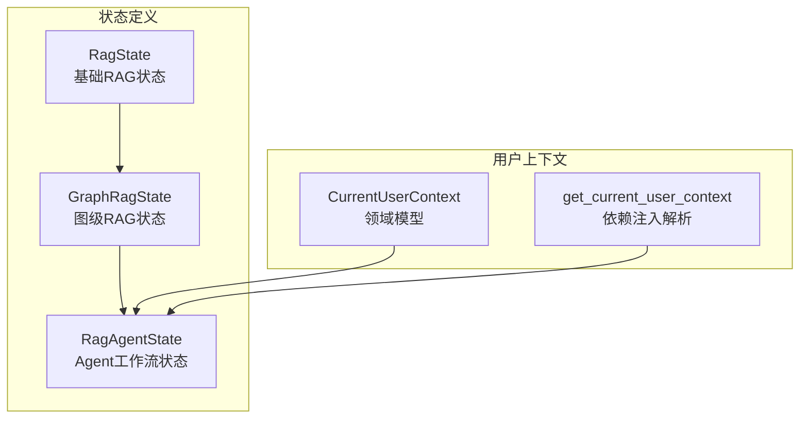
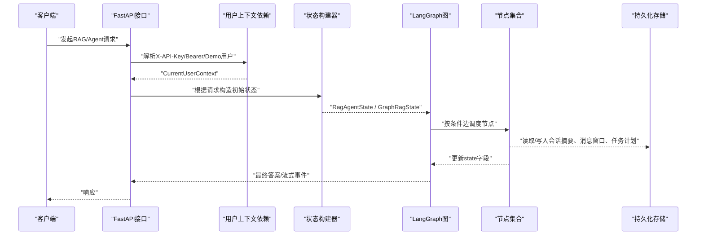
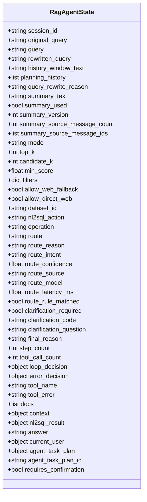
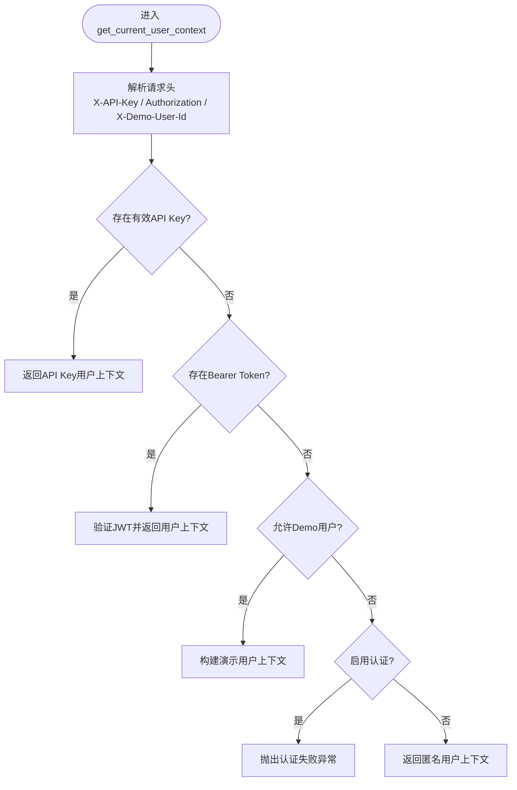
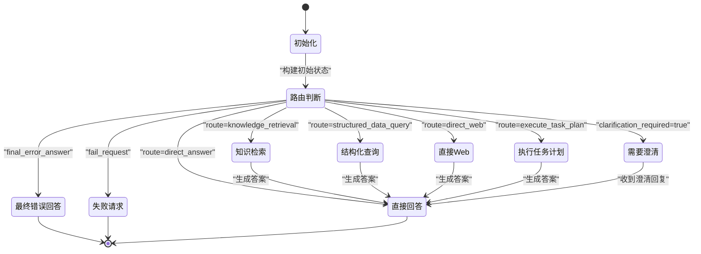
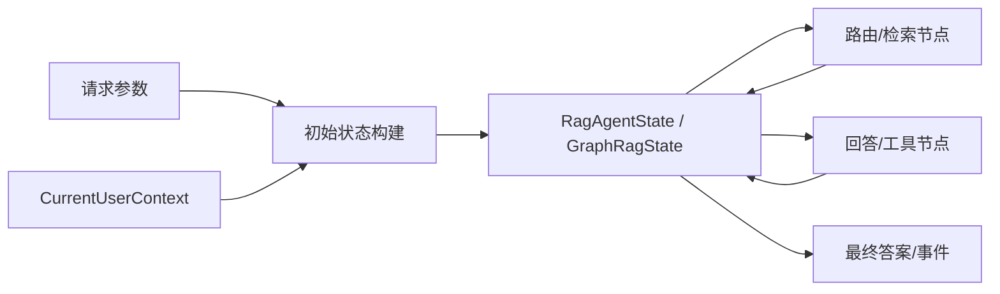
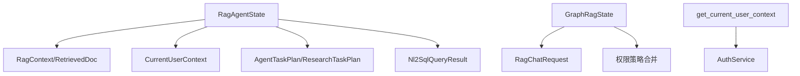

# 状态管理机制

<cite>
**本文引用的文件**
- [rag_state.py](file://src/fast_app/graph/rag/rag_state.py)
- [rag_graph_state.py](file://src/fast_app/graph/rag/rag_graph_state.py)
- [rag_agent_state.py](file://src/fast_app/graph/rag_agent/rag_agent_state.py)
- [user_context.py](file://src/fast_app/domain/user_context.py)
- [user_context.py](file://src/fast_app/dependencies/user_context.py)
</cite>

## 目录
1. [简介](#简介)
2. [项目结构](#项目结构)
3. [核心组件](#核心组件)
4. [架构总览](#架构总览)
5. [详细组件分析](#详细组件分析)
6. [依赖关系分析](#依赖关系分析)
7. [性能考虑](#性能考虑)
8. [故障排查指南](#故障排查指南)
9. [结论](#结论)
10. [附录](#附录)

## 简介
本文件系统性梳理 LangGraph 状态机在本项目中的设计与实现，覆盖三类状态：
- 基础 RAG 状态（轻量、通用）
- Graph RAG 状态（图级执行上下文）
- Agent RAG 状态（复杂工作流与权限、计划、澄清等）

重点说明：
- 状态定义、字段类型与约束条件
- 用户上下文在状态中的维护方式（身份、权限、会话标识）
- Agent 工作流的状态转换条件与持久化策略
- 状态同步机制与数据一致性保证
- 状态调试与性能调优建议

## 项目结构
围绕状态管理的代码主要分布在 graph 与 domain/dependencies 层：
- graph/rag：基础 RAG 状态定义与初始化
- graph/rag_agent：Agent 工作流状态定义与初始化
- domain/user_context：当前用户上下文模型
- dependencies/user_context：请求级用户上下文解析与注入

图表来源
- [rag_state.py:7-11](file://src/fast_app/graph/rag/rag_state.py#L7-L11)
- [rag_graph_state.py:15-37](file://src/fast_app/graph/rag/rag_graph_state.py#L15-L37)
- [rag_agent_state.py:32-140](file://src/fast_app/graph/rag_agent/rag_agent_state.py#L32-L140)
- [user_context.py:9-42](file://src/fast_app/domain/user_context.py#L9-L42)
- [user_context.py:16-62](file://src/fast_app/dependencies/user_context.py#L16-L62)

章节来源
- [rag_state.py:7-11](file://src/fast_app/graph/rag/rag_state.py#L7-L11)
- [rag_graph_state.py:15-65](file://src/fast_app/graph/rag/rag_graph_state.py#L15-L65)
- [rag_agent_state.py:32-203](file://src/fast_app/graph/rag_agent/rag_agent_state.py#L32-L203)
- [user_context.py:9-55](file://src/fast_app/domain/user_context.py#L9-L55)
- [user_context.py:16-149](file://src/fast_app/dependencies/user_context.py#L16-L149)

## 核心组件
- RagState：最简 RAG 状态，包含查询、检索文档、上下文与答案。
- GraphRagState：图级状态，扩展了检索模式、阈值、过滤条件、路由标记与工具结果计数等。
- RagAgentState：完整 Agent 工作流状态，涵盖多轮对话快照、查询改写、路由决策、澄清流程、循环与错误控制、工具调用、NL2SQL、任务规划、权限上下文等。
- CurrentUserContext：当前请求的用户上下文，包含身份、认证来源、全局角色与权限快照、部门范围、令牌与 API Key 标识等。
- get_current_user_context：从请求头解析并校验用户身份，返回 CurrentUserContext。

章节来源
- [rag_state.py:7-11](file://src/fast_app/graph/rag/rag_state.py#L7-L11)
- [rag_graph_state.py:15-65](file://src/fast_app/graph/rag/rag_graph_state.py#L15-L65)
- [rag_agent_state.py:32-203](file://src/fast_app/graph/rag_agent/rag_agent_state.py#L32-L203)
- [user_context.py:9-55](file://src/fast_app/domain/user_context.py#L9-L55)
- [user_context.py:16-149](file://src/fast_app/dependencies/user_context.py#L16-L149)

## 架构总览
LangGraph 状态机由“输入请求 → 初始状态 → 节点处理 → 条件边路由 → 输出”构成。不同层级状态承担不同职责：
- 基础 RAG 状态用于简单检索问答链路。
- Graph RAG 状态承载图级执行上下文，便于统一入口（run/stream/stream_events）。
- Agent RAG 状态承载复杂业务意图识别、澄清、工具调用、任务规划与权限控制。

图表来源
- [user_context.py:16-62](file://src/fast_app/dependencies/user_context.py#L16-L62)
- [rag_agent_state.py:142-203](file://src/fast_app/graph/rag_agent/rag_agent_state.py#L142-L203)
- [rag_graph_state.py:39-65](file://src/fast_app/graph/rag/rag_graph_state.py#L39-L65)

## 详细组件分析

### 基础 RAG 状态（RagState）
- 字段与类型
  - query：字符串，用户原始问题
  - docs：检索文档列表
  - context：可选的提示词上下文
  - answer：可选的最终答案
- 设计要点
  - 最小可用状态，适合简单检索问答场景
  - 通过 TypedDict 明确字段类型，便于静态检查

章节来源
- [rag_state.py:7-11](file://src/fast_app/graph/rag/rag_state.py#L7-L11)

### 图级 RAG 状态（GraphRagState）
- 字段与类型
  - 输入：query、mode、top_k、candidate_k、min_score、filters
  - 运行上下文：operation、need_retrieval、route、route_reason、tool_name、tool_result_count、tool_error
  - 结果：docs、context、answer
- 设计要点
  - 将检索策略、阈值、过滤条件显式化，避免隐式配置
  - 以 route/need_retrieval 表达图内下一步动作，非 HTTP 路由
  - 提供统一的初始状态构建函数，确保字段完整性

章节来源
- [rag_graph_state.py:15-65](file://src/fast_app/graph/rag/rag_graph_state.py#L15-L65)

### Agent 工作流状态（RagAgentState）
- 字段分组与职责
  - 请求输入：session_id、original_query、query、rewritten_query、history_window_text、planning_history、summary_*、mode、top_k、candidate_k、min_score、filters、allow_web_fallback、allow_direct_web、dataset_id、nl2sql_action
  - 执行上下文：operation、route、route_reason、route_intent、route_confidence、route_source、route_model、route_latency_ms、route_rule_matched、clarification_required、clarification_code、clarification_question、final_reason
  - 控制状态：step_count、tool_call_count、loop_decision、error_decision
  - 中间产物：tool_name、tool_error、docs、context、nl2sql_result、answer
  - 权限与计划：current_user、agent_task_plan、agent_task_plan_id、requires_confirmation
- 设计要点
  - 所有字段集中初始化，避免跨节点临时补默认值导致的不一致
  - 使用 NotRequired 标注可选字段，保持向后兼容
  - 通过 filters 合并权限范围，防止节点绕过权限事实
  - 通过 clarification_* 字段支持“需要澄清”的业务分支
  - 通过 step_count/tool_call_count/loop_decision/error_decision 限制循环与错误恢复

图表来源
- [rag_agent_state.py:32-140](file://src/fast_app/graph/rag_agent/rag_agent_state.py#L32-L140)

章节来源
- [rag_agent_state.py:32-203](file://src/fast_app/graph/rag_agent/rag_agent_state.py#L32-L203)

### 用户上下文管理（CurrentUserContext 与依赖注入）
- CurrentUserContext
  - 字段：user_id、is_authenticated、auth_source、global_role_codes、global_permission_codes、department_codes、primary_department_code、email、display_name、token_id、api_key_id
  - 方法：has_global_role、has_global_permission
- 依赖注入 get_current_user_context
  - 优先级：X-API-Key → Authorization Bearer → X-Demo-User-Id（受配置控制）→ 匿名
  - 异常：认证失败时抛出 AuthenticationError；演示用户长度与空白校验
  - 返回值：CurrentUserContext，供下游节点消费

图表来源
- [user_context.py:16-62](file://src/fast_app/dependencies/user_context.py#L16-L62)
- [user_context.py:96-124](file://src/fast_app/dependencies/user_context.py#L96-L124)

章节来源
- [user_context.py:9-55](file://src/fast_app/domain/user_context.py#L9-L55)
- [user_context.py:16-149](file://src/fast_app/dependencies/user_context.py#L16-L149)

### 状态转换条件与生命周期
- 初始状态构建
  - GraphRagState：build_graph_initial_state 将请求参数映射为图级状态，合并权限过滤条件
  - RagAgentState：build_rag_agent_initial_state 将请求参数、操作类型、用户上下文映射为 Agent 状态，并预置控制字段
- 转换条件
  - route：由 conditional_edges 决定下一步节点（如 direct_answer、knowledge_retrieval、structured_data_query、direct_web、execute_task_plan、clarification_required、final_error_answer、fail_request）
  - need_retrieval：图级是否需要检索
  - clarification_required：是否需要向用户追问
  - loop_decision/error_decision：是否继续循环或终止
- 生命周期
  - 创建：接口层解析请求与用户上下文，构建初始状态
  - 执行：节点逐步更新 state 字段（docs/context/answer/route/clarification_*等）
  - 结束：生成 final_reason 并返回结果；必要时持久化摘要、任务计划、消息窗口

图表来源
- [rag_agent_state.py:20-29](file://src/fast_app/graph/rag_agent/rag_agent_state.py#L20-L29)
- [rag_agent_state.py:142-203](file://src/fast_app/graph/rag_agent/rag_agent_state.py#L142-L203)

章节来源
- [rag_graph_state.py:39-65](file://src/fast_app/graph/rag/rag_graph_state.py#L39-L65)
- [rag_agent_state.py:142-203](file://src/fast_app/graph/rag_agent/rag_agent_state.py#L142-L203)

### 内存布局与数据流
- 内存布局
  - 每个请求独立一份 state，避免跨请求共享 docs/context/answer
  - 用户上下文作为 current_user 注入到 RagAgentState，供权限节点消费
  - 过滤条件 filters 在初始状态中合并权限范围，后续节点不得绕过
- 数据流
  - 请求 → 用户上下文 → 初始状态 → 节点处理 → 状态更新 → 输出
  - 中间产物（docs/context/answer/nl2sql_result/agent_task_plan）在节点间传递

图表来源
- [rag_agent_state.py:142-203](file://src/fast_app/graph/rag_agent/rag_agent_state.py#L142-L203)
- [rag_graph_state.py:39-65](file://src/fast_app/graph/rag/rag_graph_state.py#L39-L65)
- [user_context.py:16-62](file://src/fast_app/dependencies/user_context.py#L16-L62)

章节来源
- [rag_agent_state.py:142-203](file://src/fast_app/graph/rag_agent/rag_agent_state.py#L142-L203)
- [rag_graph_state.py:39-65](file://src/fast_app/graph/rag/rag_graph_state.py#L39-L65)
- [user_context.py:16-62](file://src/fast_app/dependencies/user_context.py#L16-L62)

## 依赖关系分析
- 模块耦合
  - RagAgentState 依赖领域模型（RagContext、RetrievedDoc、CurrentUserContext、AgentTaskPlan、ResearchTaskPlan、Nl2SqlQueryResult）
  - GraphRagState 依赖 RagChatRequest 与权限策略合并函数
  - 用户上下文依赖 AuthService 进行 API Key/JWT 校验
- 外部依赖
  - FastAPI 依赖注入（Depends、Header）
  - Pydantic 模型校验（extra="forbid"）
  - 权限策略合并（merge_permission_scope_into_filter_dict）

图表来源
- [rag_agent_state.py:1-14](file://src/fast_app/graph/rag_agent/rag_agent_state.py#L1-L14)
- [rag_graph_state.py:1-7](file://src/fast_app/graph/rag/rag_graph_state.py#L1-L7)
- [user_context.py:16-62](file://src/fast_app/dependencies/user_context.py#L16-L62)

章节来源
- [rag_agent_state.py:1-14](file://src/fast_app/graph/rag_agent/rag_agent_state.py#L1-L14)
- [rag_graph_state.py:1-7](file://src/fast_app/graph/rag/rag_graph_state.py#L1-L7)
- [user_context.py:16-62](file://src/fast_app/dependencies/user_context.py#L16-L62)

## 性能考虑
- 状态初始化成本
  - 集中初始化减少节点内默认值补齐逻辑，降低分支复杂度
- 检索与 rerank
  - 通过 top_k/candidate_k/min_score 控制候选集规模，平衡召回与延迟
- 循环与工具预算
  - 使用 step_count/tool_call_count/loop_decision 限制循环次数，避免无限执行
- 权限过滤
  - 在初始状态合并 filters，减少下游重复计算
- 流式与事件
  - 通过 operation 区分 run/stream/stream_events，优化传输与展示

[本节为通用指导，不直接分析具体文件]

## 故障排查指南
- 认证失败
  - 检查 X-API-Key 或 Authorization: Bearer 是否正确
  - 若启用认证且未提供有效凭据，会抛出认证异常
- 演示用户限制
  - X-Demo-User-Id 不能为空或过长；仅用于本地测试
- 权限绕过
  - 确保 filters 在初始状态已合并权限范围，节点不得重新构造
- 澄清流程
  - 若 clarification_required=true，需等待用户补充信息后再继续
- 循环与错误
  - 检查 loop_decision/error_decision 是否允许继续或应终止

章节来源
- [user_context.py:16-62](file://src/fast_app/dependencies/user_context.py#L16-L62)
- [user_context.py:96-124](file://src/fast_app/dependencies/user_context.py#L96-L124)
- [rag_agent_state.py:105-140](file://src/fast_app/graph/rag_agent/rag_agent_state.py#L105-L140)

## 结论
本项目通过分层状态设计实现了清晰的状态边界与职责分离：
- 基础 RAG 状态满足简单检索问答
- Graph RAG 状态统一图级执行上下文
- Agent RAG 状态承载复杂工作流、权限控制与任务规划
用户上下文在请求入口处解析并注入状态，确保权限与身份贯穿整个工作流。通过集中初始化、显式路由与控制字段，提升了可观测性与可维护性。结合持久化策略（摘要、消息窗口、任务计划），实现了状态的生命周期管理与一致性保障。

[本节为总结，不直接分析具体文件]

## 附录
- 状态调试建议
  - 打印 route/route_reason/final_reason 定位路径
  - 记录 step_count/tool_call_count 检测循环与工具消耗
  - 查看 summary_* 字段确认摘要版本与覆盖范围
- 性能调优建议
  - 调整 top_k/candidate_k/min_score 平衡召回与延迟
  - 使用 stream/stream_events 降低首包延迟
  - 合理设置 filters 减少无效检索

[本节为通用指导，不直接分析具体文件]