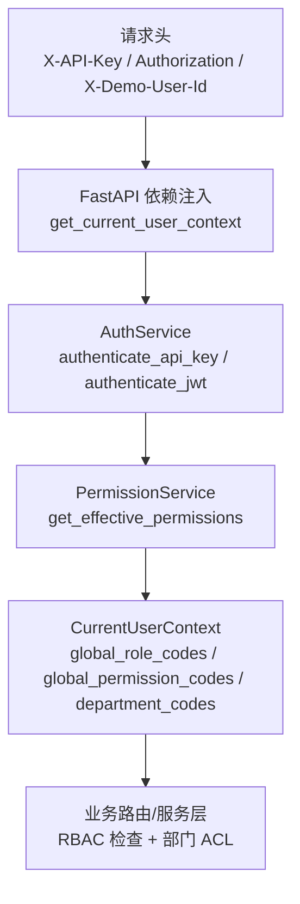
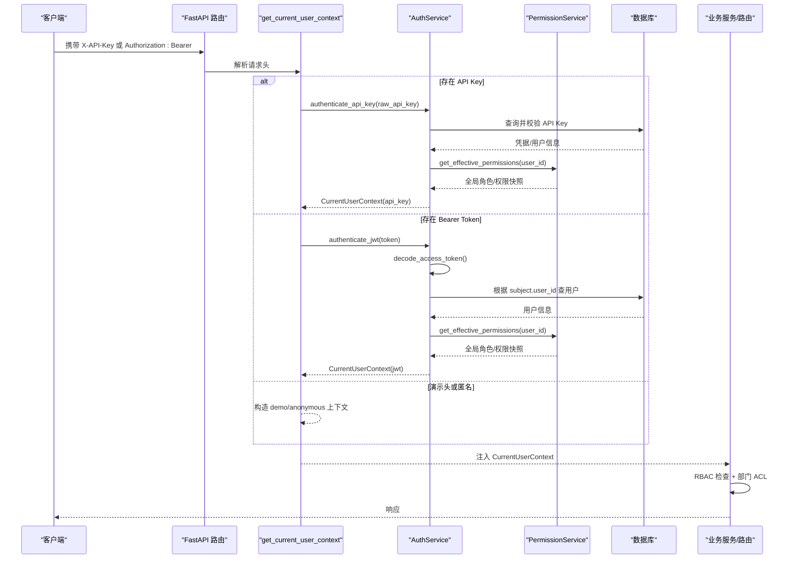
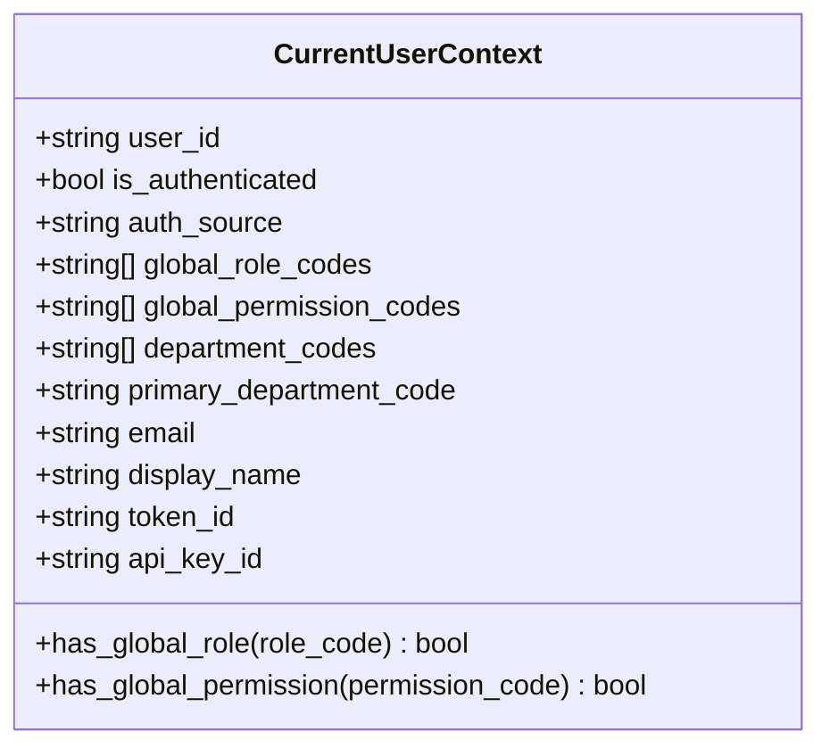
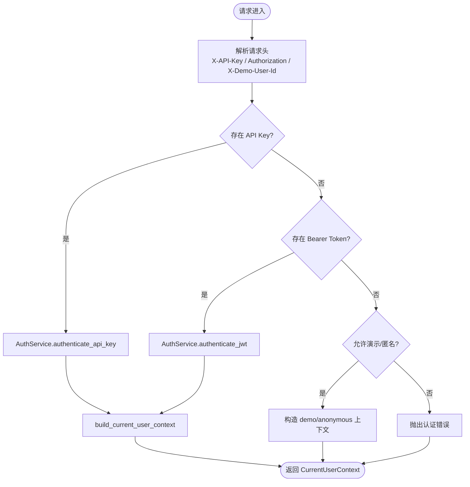
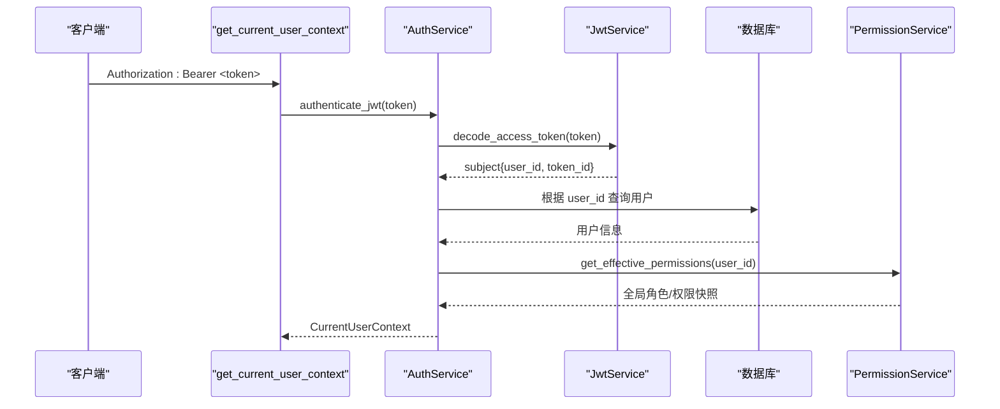
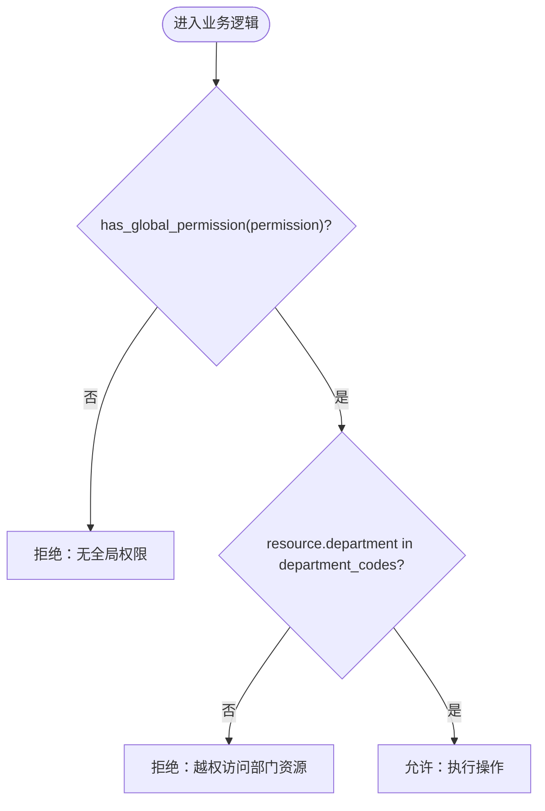
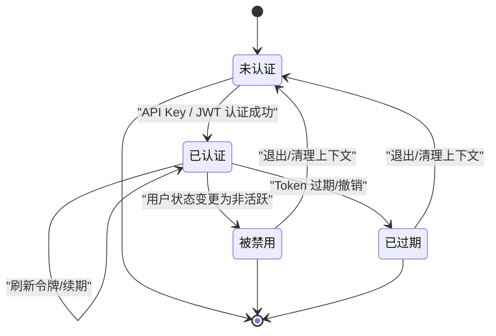
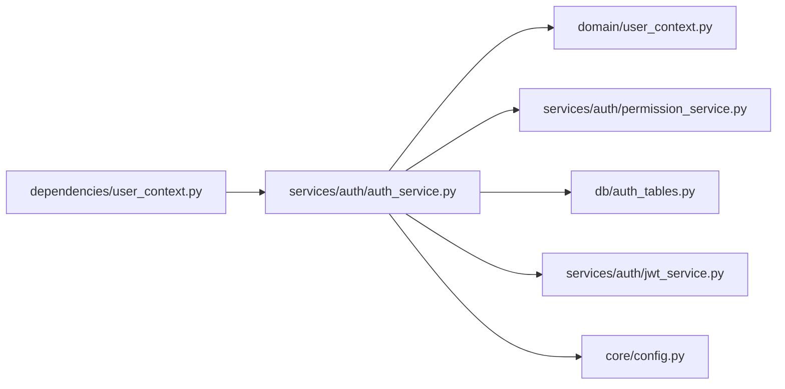

# 用户上下文管理

<cite>
**本文引用的文件**
- [src/fast_app/domain/user_context.py](file://src/fast_app/domain/user_context.py)
- [src/fast_app/dependencies/user_context.py](file://src/fast_app/dependencies/user_context.py)
- [src/fast_app/services/auth/auth_service.py](file://src/fast_app/services/auth/auth_service.py)
- [src/fast_app/db/auth_tables.py](file://src/fast_app/db/auth_tables.py)
- [src/fast_app/domain/knowledge_permissions.py](file://src/fast_app/domain/knowledge_permissions.py)
- [src/fast_app/domain/agent_tool_permissions.py](file://src/fast_app/domain/agent_tool_permissions.py)
</cite>

## 目录
1. [简介](#简介)
2. [项目结构](#项目结构)
3. [核心组件](#核心组件)
4. [架构总览](#架构总览)
5. [详细组件分析](#详细组件分析)
6. [依赖关系分析](#依赖关系分析)
7. [性能考虑](#性能考虑)
8. [故障排查指南](#故障排查指南)
9. [结论](#结论)
10. [附录](#附录)

## 简介
本文件面向开发者，系统化说明“用户上下文管理”的设计与实现，重点围绕 CurrentUserContext 的数据模型、认证来源、权限快照、部门级访问控制以及在不同服务层之间的传递方式。文档覆盖：
- 用户上下文的创建、更新与销毁流程
- JWT Token 解析与用户会话绑定
- RBAC 全局权限验证与部门级 ACL 控制
- 跨服务层的上下文传递机制
- 用户生命周期图与权限验证流程图
- 扩展点与安全最佳实践

## 项目结构
与用户上下文相关的代码主要分布在以下模块：
- 领域模型：CurrentUserContext 定义当前请求的用户身份、认证来源、角色与权限快照、部门信息、令牌标识等。
- 依赖注入：get_current_user_context 从请求头解析 API Key 或 Bearer Token，调用 AuthService 完成认证并返回上下文。
- 认证服务：AuthService 负责 API Key/JWT 校验、刷新令牌、构建统一上下文，并通过 PermissionService 获取实时权限快照。
- 数据表：auth_tables 提供用户、API Key、JWT Refresh Token 等持久化模型（用于支撑认证与授权）。
- 权限域：knowledge_permissions、agent_tool_permissions 定义知识库与 Agent 工具的权限语义，供 ACL 与工具调用策略使用。

图表来源
- [src/fast_app/dependencies/user_context.py:16-62](file://src/fast_app/dependencies/user_context.py#L16-L62)
- [src/fast_app/services/auth/auth_service.py:114-170](file://src/fast_app/services/auth/auth_service.py#L114-L170)
- [src/fast_app/domain/user_context.py:9-51](file://src/fast_app/domain/user_context.py#L9-L51)

章节来源
- [src/fast_app/domain/user_context.py:1-55](file://src/fast_app/domain/user_context.py#L1-L55)
- [src/fast_app/dependencies/user_context.py:1-149](file://src/fast_app/dependencies/user_context.py#L1-L149)
- [src/fast_app/services/auth/auth_service.py:1-327](file://src/fast_app/services/auth/auth_service.py#L1-L327)
- [src/fast_app/db/auth_tables.py](file://src/fast_app/db/auth_tables.py)
- [src/fast_app/domain/knowledge_permissions.py](file://src/fast_app/domain/knowledge_permissions.py)
- [src/fast_app/domain/agent_tool_permissions.py](file://src/fast_app/domain/agent_tool_permissions.py)

## 核心组件
- CurrentUserContext：承载当前请求的“可信用户身份+权限快照+部门范围”。包含 user_id、is_authenticated、auth_source、global_role_codes、global_permission_codes、department_codes、primary_department_code、email、display_name、token_id、api_key_id，并提供 has_global_role、has_global_permission 便捷方法。
- get_current_user_context：FastAPI 依赖注入函数，按优先级处理 API Key、Bearer Token、演示用户头，最终返回 CurrentUserContext；在开启认证且无有效凭据时抛出认证错误。
- AuthService：封装认证与上下文构建逻辑，支持登录、刷新令牌、API Key 认证、JWT 认证，并通过 PermissionService 获取实时权限快照，输出统一的 CurrentUserContext。
- 权限相关域模型：knowledge_permissions、agent_tool_permissions 为后续 ACL 和工具调用策略提供权限枚举与规则基础。

章节来源
- [src/fast_app/domain/user_context.py:9-51](file://src/fast_app/domain/user_context.py#L9-L51)
- [src/fast_app/dependencies/user_context.py:16-62](file://src/fast_app/dependencies/user_context.py#L16-L62)
- [src/fast_app/services/auth/auth_service.py:35-51](file://src/fast_app/services/auth/auth_service.py#L35-L51)
- [src/fast_app/domain/knowledge_permissions.py](file://src/fast_app/domain/knowledge_permissions.py)
- [src/fast_app/domain/agent_tool_permissions.py](file://src/fast_app/domain/agent_tool_permissions.py)

## 架构总览
下图展示了从请求进入 FastAPI 到生成 CurrentUserContext，再到业务层进行 RBAC 与部门 ACL 控制的完整链路。

图表来源
- [src/fast_app/dependencies/user_context.py:16-62](file://src/fast_app/dependencies/user_context.py#L16-L62)
- [src/fast_app/services/auth/auth_service.py:114-170](file://src/fast_app/services/auth/auth_service.py#L114-L170)
- [src/fast_app/domain/user_context.py:9-51](file://src/fast_app/domain/user_context.py#L9-L51)

## 详细组件分析

### CurrentUserContext 设计
- 字段职责
  - 身份与会话：user_id、token_id、api_key_id、email、display_name
  - 认证状态：is_authenticated、auth_source（anonymous/demo_header/api_key/jwt）
  - 权限快照：global_role_codes、global_permission_codes
  - 部门范围：department_codes、primary_department_code
- 行为
  - has_global_role(role_code)：基于快照判断是否拥有指定全局角色
  - has_global_permission(permission_code)：基于快照判断是否拥有指定全局权限
- 设计要点
  - 通过“快照”避免每次鉴权都重复计算角色与权限，提升性能
  - 明确区分“认证来源”，便于审计与降级策略
  - 将部门范围纳入上下文，便于后续 ACL 过滤

图表来源
- [src/fast_app/domain/user_context.py:9-51](file://src/fast_app/domain/user_context.py#L9-L51)

章节来源
- [src/fast_app/domain/user_context.py:9-51](file://src/fast_app/domain/user_context.py#L9-L51)

### 用户上下文创建、更新与销毁流程
- 创建
  - API Key 认证：从请求头读取 X-API-Key，调用 AuthService.authenticate_api_key，成功后构建 CurrentUserContext，并记录 api_key_id。
  - JWT 认证：从 Authorization 头提取 Bearer Token，调用 AuthService.authenticate_jwt，解码后获取用户并构建上下文，记录 token_id。
  - 演示/匿名：当未启用认证或允许演示头时，可构造 demo 或 anonymous 上下文。
- 更新
  - 上下文本身不可变（Pydantic 默认禁止额外字段），如需更新应重新生成新的 CurrentUserContext。
  - 刷新令牌：通过 AuthService.refresh 轮换 refresh token 并签发新 token pair，后续请求使用新 token 重建上下文。
- 销毁
  - 服务端不维护长连接会话，上下文随请求结束而失效。
  - 撤销 API Key：通过 AuthService.revoke_api_key 标记无效，后续认证失败。
  - 注销/禁用：用户状态变更会影响后续认证结果（例如 _ensure_active_user 会拒绝非活跃用户）。

图表来源
- [src/fast_app/dependencies/user_context.py:16-62](file://src/fast_app/dependencies/user_context.py#L16-L62)
- [src/fast_app/services/auth/auth_service.py:114-170](file://src/fast_app/services/auth/auth_service.py#L114-L170)

章节来源
- [src/fast_app/dependencies/user_context.py:16-62](file://src/fast_app/dependencies/user_context.py#L16-L62)
- [src/fast_app/services/auth/auth_service.py:75-112](file://src/fast_app/services/auth/auth_service.py#L75-L112)
- [src/fast_app/services/auth/auth_service.py:172-234](file://src/fast_app/services/auth/auth_service.py#L172-L234)
- [src/fast_app/services/auth/auth_service.py:236-267](file://src/fast_app/services/auth/auth_service.py#L236-L267)

### JWT Token 解析与用户会话绑定
- 解析流程
  - 从 Authorization 头提取 Bearer Token
  - JwtService.decode_access_token 解码出 subject（包含 user_id、token_id）
  - 根据 user_id 查询用户并校验状态
  - 通过 PermissionService 获取实时权限快照，构建 CurrentUserContext
- 会话绑定
  - 服务端无状态，不保存会话；token_id 仅用于审计与追踪
  - Refresh Token 用于轮换 access token，刷新后会撤销旧 refresh token 并写入新记录

图表来源
- [src/fast_app/dependencies/user_context.py:38-46](file://src/fast_app/dependencies/user_context.py#L38-L46)
- [src/fast_app/services/auth/auth_service.py:153-170](file://src/fast_app/services/auth/auth_service.py#L153-L170)

章节来源
- [src/fast_app/services/auth/auth_service.py:153-170](file://src/fast_app/services/auth/auth_service.py#L153-L170)
- [src/fast_app/services/auth/auth_service.py:269-292](file://src/fast_app/services/auth/auth_service.py#L269-L292)

### 权限检查机制：RBAC 与部门级 ACL
- RBAC 全局权限
  - 认证阶段通过 PermissionService.get_effective_permissions 获取用户的“全局角色 code 快照”和“全局权限 code 快照”
  - 业务层使用 require_permission 或 CurrentUserContext.has_global_permission 进行快速判定
- 部门级 ACL
  - CurrentUserContext.department_codes 表示当前用户可访问的部门集合
  - 知识检索/文档操作可在服务层依据 department_codes 进行资源过滤，确保跨部门隔离
- 工具调用权限
  - agent_tool_permissions 为 Agent 工具调用提供细粒度权限语义，结合 RBAC 与 ACL 共同决策

图表来源
- [src/fast_app/services/auth/auth_service.py:314-323](file://src/fast_app/services/auth/auth_service.py#L314-L323)
- [src/fast_app/domain/user_context.py:22-37](file://src/fast_app/domain/user_context.py#L22-L37)
- [src/fast_app/domain/knowledge_permissions.py](file://src/fast_app/domain/knowledge_permissions.py)
- [src/fast_app/domain/agent_tool_permissions.py](file://src/fast_app/domain/agent_tool_permissions.py)

章节来源
- [src/fast_app/services/auth/auth_service.py:314-323](file://src/fast_app/services/auth/auth_service.py#L314-L323)
- [src/fast_app/domain/user_context.py:22-37](file://src/fast_app/domain/user_context.py#L22-L37)
- [src/fast_app/domain/knowledge_permissions.py](file://src/fast_app/domain/knowledge_permissions.py)
- [src/fast_app/domain/agent_tool_permissions.py](file://src/fast_app/domain/agent_tool_permissions.py)

### 用户上下文在不同服务层之间的传递方式
- FastAPI 依赖注入：路由与服务通过 Depends(get_current_user_context) 获取当前用户上下文，天然跨层传递
- 服务内部：将 CurrentUserContext 作为方法参数显式传入，保证调用链清晰、可测试
- 异步任务/后台作业：需显式序列化上下文关键字段（如 user_id、权限快照、部门范围）并在目标进程重建上下文对象
- 日志与追踪：利用 token_id、api_key_id、user_id 关联请求轨迹，便于审计

章节来源
- [src/fast_app/dependencies/user_context.py:16-62](file://src/fast_app/dependencies/user_context.py#L16-L62)
- [src/fast_app/domain/user_context.py:19-41](file://src/fast_app/domain/user_context.py#L19-L41)

### 用户生命周期图

图表来源
- [src/fast_app/services/auth/auth_service.py:294-312](file://src/fast_app/services/auth/auth_service.py#L294-L312)
- [src/fast_app/services/auth/auth_service.py:172-234](file://src/fast_app/services/auth/auth_service.py#L172-L234)

## 依赖关系分析
- 组件耦合
  - dependencies/user_context.py 依赖 services/auth/auth_service.py 完成认证
  - auth_service.py 依赖 domain/user_context.py 输出统一上下文，并依赖 permission_service 获取权限快照
  - 数据层通过 db/auth_tables.py 提供用户、凭据、刷新令牌等持久化能力
- 外部依赖
  - JWT 服务：JwtService 负责 access token 与 refresh token 的签发与校验
  - 配置：Settings 控制认证开关、演示头策略、JWT 过期时间等
- 潜在循环依赖
  - 当前结构以领域模型为中心，服务层单向依赖领域模型，未见明显循环依赖

图表来源
- [src/fast_app/dependencies/user_context.py:1-7](file://src/fast_app/dependencies/user_context.py#L1-L7)
- [src/fast_app/services/auth/auth_service.py:1-33](file://src/fast_app/services/auth/auth_service.py#L1-L33)

章节来源
- [src/fast_app/dependencies/user_context.py:1-7](file://src/fast_app/dependencies/user_context.py#L1-L7)
- [src/fast_app/services/auth/auth_service.py:1-33](file://src/fast_app/services/auth/auth_service.py#L1-L33)

## 性能考虑
- 权限快照：在认证阶段一次性计算并缓存到 CurrentUserContext.global_role_codes/global_permission_codes，减少后续鉴权开销
- 头部解析：对请求头进行规范化与严格格式校验，避免异常值进入认证分支造成额外开销
- 无状态会话：服务端不维护会话，降低内存占用与跨实例共享复杂度
- 批量权限：PermissionService 建议对同一用户的多次权限查询做本地缓存（若尚未实现，可作为优化方向）

[本节为通用指导，无需特定文件引用]

## 故障排查指南
- 常见错误
  - 认证失败：缺少 API Key 或 Bearer Token，或 Token 格式不正确
  - 凭据无效/过期：API Key 被撤销或过期，Refresh Token 无效
  - 用户不存在/被禁用：JWT subject 对应用户不存在或状态为非活跃
- 定位步骤
  - 检查请求头是否正确设置（X-API-Key、Authorization）
  - 查看 AuthService 抛出的 AuthenticationError 消息
  - 确认数据库中用户状态、凭据状态与过期时间
  - 检查 PermissionService 返回的权限快照是否符合预期
- 调试建议
  - 在开发环境启用 AUTH_ENABLED=false 并使用 X-Demo-User-Id 进行多用户隔离测试
  - 记录 token_id、api_key_id、user_id 到日志，便于追踪请求链路

章节来源
- [src/fast_app/dependencies/user_context.py:48-62](file://src/fast_app/dependencies/user_context.py#L48-L62)
- [src/fast_app/services/auth/auth_service.py:75-112](file://src/fast_app/services/auth/auth_service.py#L75-L112)
- [src/fast_app/services/auth/auth_service.py:294-312](file://src/fast_app/services/auth/auth_service.py#L294-L312)

## 结论
本方案通过 CurrentUserContext 将“身份、权限快照、部门范围”聚合到单次请求中，配合 AuthService 的统一认证入口与 PermissionService 的实时权限计算，实现了高效、可扩展的用户上下文管理。RBAC 与部门级 ACL 相结合，既能满足全局权限控制，又能实现资源级别的细粒度隔离。建议在后续迭代中完善权限缓存、增强审计日志，并持续优化认证路径的性能与安全性。

[本节为总结性内容，无需特定文件引用]

## 附录
- 安全最佳实践
  - 始终使用 HTTPS 传输 API Key 与 Bearer Token
  - 最小权限原则：按需授予全局角色与权限，定期审查
  - 限制演示头仅在开发/测试环境启用，生产环境关闭
  - 定期轮换 API Key 与 Refresh Token，及时撤销不再使用的凭据
  - 对敏感操作增加二次确认与审计日志
- 扩展指引
  - 新增认证源：在 get_current_user_context 中添加分支，复用 AuthService 的 build_current_user_context
  - 新增权限维度：在 knowledge_permissions/agent_tool_permissions 中扩展权限枚举，并在服务层集成 ACL 过滤
  - 引入组织/租户：在 CurrentUserContext 中扩展 tenant_id，并在 ACL 中增加租户隔离

[本节为通用指导，无需特定文件引用]