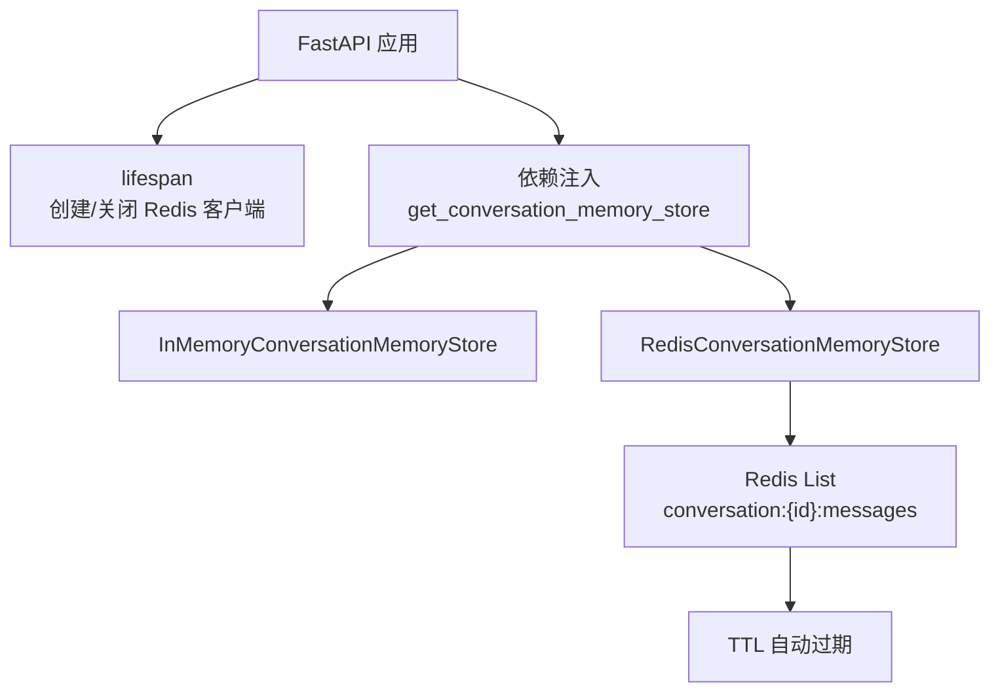
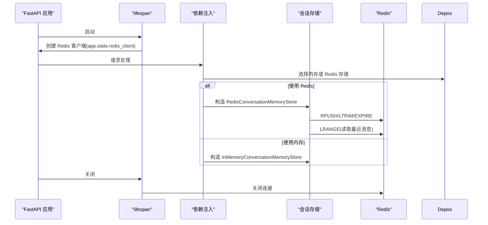
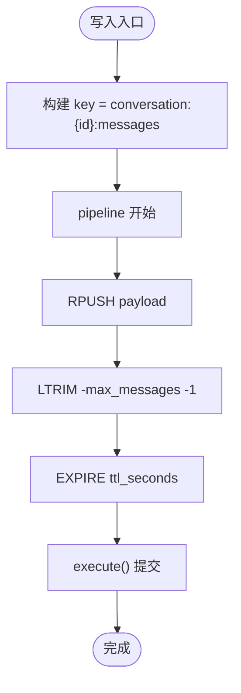
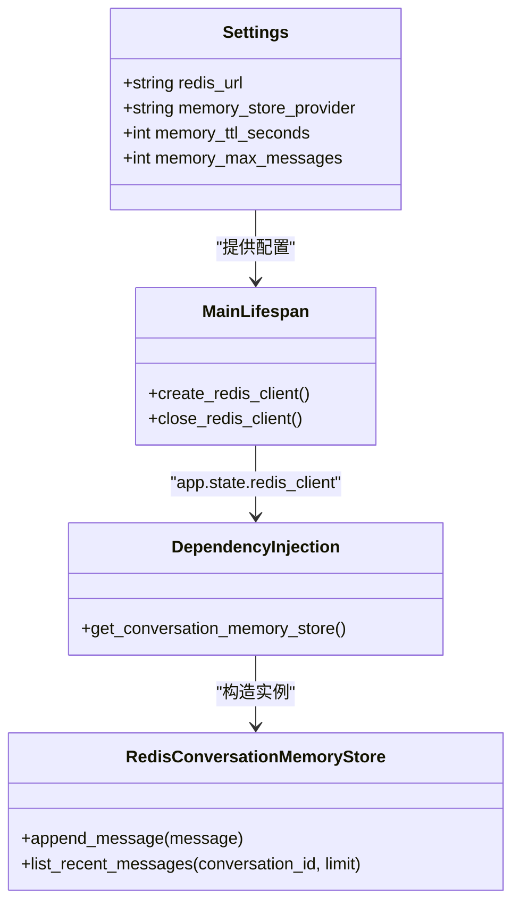
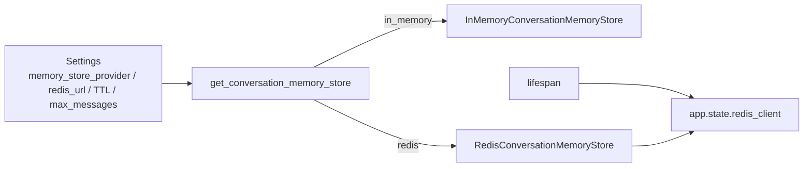

# 缓存策略

<cite>
**本文引用的文件**
- [main.py](file://src/fast_app/main.py)
- [config.py](file://src/fast_app/core/config.py)
- [conversation_memory.py](file://src/fast_app/services/conversation/conversation_memory.py)
- [rag_dependencies.py](file://src/fast_app/dependencies/rag_dependencies.py)
- [14-2-Redis短期会话记忆-最近消息-TTL-会话状态.md](file://learning-docs/phase-14/14-2-Redis短期会话记忆-最近消息-TTL-会话状态.md)
</cite>

## 目录
1. [简介](#简介)
2. [项目结构](#项目结构)
3. [核心组件](#核心组件)
4. [架构总览](#架构总览)
5. [详细组件分析](#详细组件分析)
6. [依赖关系分析](#依赖关系分析)
7. [性能考虑](#性能考虑)
8. [故障排查指南](#故障排查指南)
9. [结论](#结论)
10. [附录](#附录)

## 简介
本文件围绕 Redis 在系统中的缓存策略进行系统化说明，重点覆盖：
- 检索结果缓存、LLM 响应缓存与配置缓存的使用场景与落地建议
- 缓存键设计、过期策略与失效机制
- 多级缓存架构与一致性保证
- 缓存预热、批量操作与监控统计
- 架构图、命中率优化策略与故障恢复方案
- 面向开发者的性能调优与问题排查指导

当前仓库已实现“短期会话记忆”的 Redis 缓存（基于 List + TTL），并提供了应用级 Redis 客户端生命周期管理。检索结果缓存与 LLM 响应缓存在本仓库中尚未以独立模块落地，但可在现有依赖注入与配置体系上扩展。

## 项目结构
与缓存相关的代码主要分布在以下位置：
- 应用启动与资源生命周期：FastAPI lifespan 中创建/关闭 Redis 客户端
- 配置中心：统一读取 Redis URL、TTL、最大消息数等参数
- 会话记忆存储：内存与 Redis 两种实现，通过协议抽象解耦
- 依赖注入：根据配置选择内存或 Redis 会话存储，并装配到 RAG Agent 链路

图表来源
- [main.py:41-129](file://src/fast_app/main.py#L41-L129)
- [rag_dependencies.py:166-193](file://src/fast_app/dependencies/rag_dependencies.py#L166-L193)
- [conversation_memory.py:60-105](file://src/fast_app/services/conversation/conversation_memory.py#L60-L105)

章节来源
- [main.py:41-129](file://src/fast_app/main.py#L41-L129)
- [config.py:457-484](file://src/fast_app/core/config.py#L457-L484)
- [conversation_memory.py:60-105](file://src/fast_app/services/conversation/conversation_memory.py#L60-L105)
- [rag_dependencies.py:166-193](file://src/fast_app/dependencies/rag_dependencies.py#L166-L193)

## 核心组件
- 应用级 Redis 客户端
  - 在 FastAPI lifespan 中按配置创建异步 Redis 客户端，并在关闭时释放连接
  - 通过 app.state.redis_client 暴露给后续依赖注入使用
- 会话记忆存储接口与实现
  - ConversationMemoryStore 协议定义最小能力：追加消息、读取最近 N 条
  - InMemoryConversationMemoryStore：进程内临时存储，适合开发与测试
  - RedisConversationMemoryStore：基于 Redis List 的短期会话记忆，支持 TTL 与长度裁剪
- 依赖注入与装配
  - get_conversation_memory_store 根据 memory_store_provider 选择内存或 Redis 实现
  - 当选择 Redis 时，从 app.state 获取已初始化的 Redis 客户端并构造 store

章节来源
- [main.py:70-112](file://src/fast_app/main.py#L70-L112)
- [conversation_memory.py:10-27](file://src/fast_app/services/conversation/conversation_memory.py#L10-L27)
- [conversation_memory.py:30-58](file://src/fast_app/services/conversation/conversation_memory.py#L30-L58)
- [conversation_memory.py:60-105](file://src/fast_app/services/conversation/conversation_memory.py#L60-L105)
- [rag_dependencies.py:166-193](file://src/fast_app/dependencies/rag_dependencies.py#L166-L193)

## 架构总览
下图展示当前仓库中的缓存相关架构：应用启动时创建 Redis 客户端，依赖注入层根据配置选择会话存储实现；Redis 作为短期会话记忆的持久化后端，提供快速读写与自动过期能力。

图表来源
- [main.py:70-112](file://src/fast_app/main.py#L70-L112)
- [rag_dependencies.py:166-193](file://src/fast_app/dependencies/rag_dependencies.py#L166-L193)
- [conversation_memory.py:80-105](file://src/fast_app/services/conversation/conversation_memory.py#L80-L105)

## 详细组件分析

### 组件A：会话记忆存储（Redis）
- 数据结构
  - Key：conversation:{conversation_id}:messages
  - Value：List[str]，每条元素为 ConversationMessage 的 JSON 字符串
- 写入流程
  - 使用 pipeline 原子执行：RPUSH 追加、LTRIM 保留最近 N 条、EXPIRE 设置 TTL
- 读取流程
  - 使用 LRANGE key -limit -1 读取最近 limit 条，反序列化为 ConversationMessage
- 过期策略
  - 每次写入后刷新 TTL；读取不刷新 TTL，避免无意延长旧会话存活时间
- 复杂度
  - RPUSH/LRANGE/LTRIM/EXPIRE 均为 O(1) 或 O(N)（N 为返回条目数），整体高效
- 一致性
  - 单会话 List 顺序天然保持消息时序；跨会话隔离由 key 前缀保障
- 可观测性
  - 可通过日志记录写入/读取次数、延迟、key 命中情况，便于后续接入监控

图表来源
- [conversation_memory.py:80-88](file://src/fast_app/services/conversation/conversation_memory.py#L80-L88)

章节来源
- [conversation_memory.py:60-105](file://src/fast_app/services/conversation/conversation_memory.py#L60-L105)
- [14-2-Redis短期会话记忆-最近消息-TTL-会话状态.md:330-365](file://learning-docs/phase-14/14-2-Redis短期会话记忆-最近消息-TTL-会话状态.md#L330-L365)

### 组件B：应用级 Redis 客户端生命周期
- 启动阶段
  - 根据 memory_store_provider 决定是否创建 Redis 客户端
  - 使用 from_url(settings.redis_url, decode_responses=True) 创建异步客户端
- 关闭阶段
  - 在 finally 块中安全关闭 Redis 客户端，避免连接泄漏
- 依赖注入
  - get_conversation_memory_store 在 provider=redis 时从 app.state 获取 redis_client
  - 若未初始化则抛出明确错误，便于快速定位配置或启动问题

图表来源
- [config.py:457-484](file://src/fast_app/core/config.py#L457-L484)
- [main.py:70-112](file://src/fast_app/main.py#L70-L112)
- [rag_dependencies.py:166-193](file://src/fast_app/dependencies/rag_dependencies.py#L166-L193)

章节来源
- [main.py:70-112](file://src/fast_app/main.py#L70-L112)
- [config.py:457-484](file://src/fast_app/core/config.py#L457-L484)
- [rag_dependencies.py:166-193](file://src/fast_app/dependencies/rag_dependencies.py#L166-L193)

### 组件C：检索结果缓存（建议方案）
- 使用场景
  - 向量检索与关键词检索结果在高并发下重复度高，适合缓存
  - 结合 top_k、min_score、retriever_name 等维度降低缓存污染
- 键设计
  - 建议格式：retrieval:{retriever}:{query_hash}:{top_k}:{min_score}
  - 可选加入 user_id/knowledge_base_id 做权限隔离
- 过期策略
  - 短 TTL（如 5-15 分钟），配合索引更新事件主动失效
- 一致性
  - 写路径：索引重建/增量同步后，按 knowledge_base_id 或全文前缀批量删除
  - 读路径：缓存命中直接返回；未命中回源检索并回填
- 监控
  - 记录 hit/miss、延迟、key 分布、命中率趋势

[本节为概念性设计，未直接引用具体源码文件]

### 组件D：LLM 响应缓存（建议方案）
- 使用场景
  - 相同 prompt + 上下文 + 模型参数的生成结果可缓存
  - 适用于离线评测、批处理、固定问答场景
- 键设计
  - 建议格式：llm:{model}:{prompt_hash}:{context_hash}:{params_hash}
  - 敏感字段需哈希或脱敏后再参与键计算
- 过期策略
  - 较短 TTL（如 10-30 分钟），或按 prompt 版本变更失效
- 一致性
  - 模型升级/prompt 版本变化时，按前缀批量失效
  - 流式输出不适合强一致缓存，建议仅缓存最终结构化结果
- 监控
  - 记录调用次数、命中次数、平均延迟、失败率

[本节为概念性设计，未直接引用具体源码文件]

### 组件E：配置缓存（建议方案）
- 使用场景
  - 频繁读取的配置项（如知识库元数据、权限规则、模型路由表）
- 键设计
  - 建议格式：cfg:{scope}:{version}
  - scope 可为 tenant/kb/user；version 用于灰度与回滚
- 过期策略
  - 长 TTL（如 1-24 小时），配合配置变更事件主动失效
- 一致性
  - 配置变更后广播失效；多实例共享同一 Redis 集群
- 监控
  - 记录配置加载次数、缓存命中率、失效次数

[本节为概念性设计，未直接引用具体源码文件]

## 依赖关系分析
- 配置到实现的映射
  - memory_store_provider=in_memory → InMemoryConversationMemoryStore
  - memory_store_provider=redis → RedisConversationMemoryStore
- 客户端生命周期
  - main.py lifespan 负责创建/关闭 Redis 客户端
  - dependencies 层从 app.state 获取客户端并构造 store
- 与 RAG Agent 的集成点
  - get_rag_pipeline(provider="rag_agent") 会注入 conversation_memory_store
  - 后续历史窗口与 query rewrite 将基于该 store 读取最近消息

图表来源
- [config.py:457-484](file://src/fast_app/core/config.py#L457-L484)
- [main.py:70-112](file://src/fast_app/main.py#L70-L112)
- [rag_dependencies.py:166-193](file://src/fast_app/dependencies/rag_dependencies.py#L166-L193)

章节来源
- [config.py:457-484](file://src/fast_app/core/config.py#L457-L484)
- [main.py:70-112](file://src/fast_app/main.py#L70-L112)
- [rag_dependencies.py:166-193](file://src/fast_app/dependencies/rag_dependencies.py#L166-L193)

## 性能考虑
- 写入优化
  - 使用 pipeline 合并 RPUSH/LTRIM/EXPIRE，减少网络往返
  - 控制 max_messages，避免 List 过长导致内存与序列化开销
- 读取优化
  - 限制 limit，避免一次性拉取过多消息
  - 合理设置 TTL，平衡命中率与内存占用
- 热点保护
  - 对高频 key 采用分片或加盐，避免单 key 成为热点
- 监控指标
  - 命中率、P95/P99 延迟、错误率、连接池使用率
- 容量规划
  - 预估会话数 × 每会话消息数 × 单条大小，评估 Redis 内存需求

[本节为通用性能建议，未直接引用具体源码文件]

## 故障排查指南
- 常见问题
  - Redis 客户端未初始化：依赖注入层会抛出明确错误，检查 memory_store_provider 与 lifespan 是否创建客户端
  - TTL 未生效：确认写入 pipeline 包含 EXPIRE，且 key 未被其他逻辑覆盖
  - 消息丢失：检查 LTRIM 的 max_messages 是否过小；确认写入成功
  - 连接泄漏：确保 lifespan 的 finally 块正确关闭 Redis 客户端
- 诊断步骤
  - 查看应用日志中的 Redis 创建/关闭信息
  - 检查 Redis 中 conversation:*:messages 的 key 是否存在与 TTL
  - 使用 LRANGE 验证最近消息数量与顺序
- 回退策略
  - 将 memory_store_provider 切换为 in_memory，快速恢复服务
  - 对关键路径增加超时与降级逻辑，避免阻塞主链路

章节来源
- [rag_dependencies.py:166-193](file://src/fast_app/dependencies/rag_dependencies.py#L166-L193)
- [conversation_memory.py:80-105](file://src/fast_app/services/conversation/conversation_memory.py#L80-L105)
- [main.py:70-112](file://src/fast_app/main.py#L70-L112)

## 结论
- 当前仓库已具备 Redis 短期会话记忆的完整实现：键设计清晰、TTL 可控、批量写入原子化、生命周期统一管理
- 检索结果缓存与 LLM 响应缓存可作为后续扩展点，复用现有依赖注入与配置体系
- 建议在多租户/多知识库场景下引入更细粒度的键空间隔离与失效策略，并结合监控持续优化命中率与延迟

[本节为总结性内容，未直接引用具体源码文件]

## 附录
- 配置项参考
  - MEMORY_STORE_PROVIDER：选择 in_memory 或 redis
  - REDIS_URL：Redis 连接地址
  - MEMORY_TTL_SECONDS：会话 TTL
  - MEMORY_MAX_MESSAGES：单会话最大消息数
  - MEMORY_HISTORY_MAX_TURNS：历史窗口读取上限（业务侧使用）
- 验收要点
  - append 两条消息后，list_recent_messages(limit=1) 返回最后一条
  - Redis key 存在 TTL
  - 超过 max_messages 后旧消息被 LTRIM 裁掉
  - 未启用 Redis 时仍可使用内存存储

章节来源
- [config.py:457-484](file://src/fast_app/core/config.py#L457-L484)
- [14-2-Redis短期会话记忆-最近消息-TTL-会话状态.md:459-477](file://learning-docs/phase-14/14-2-Redis短期会话记忆-最近消息-TTL-会话状态.md#L459-L477)