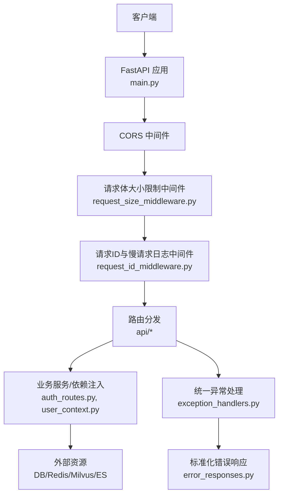
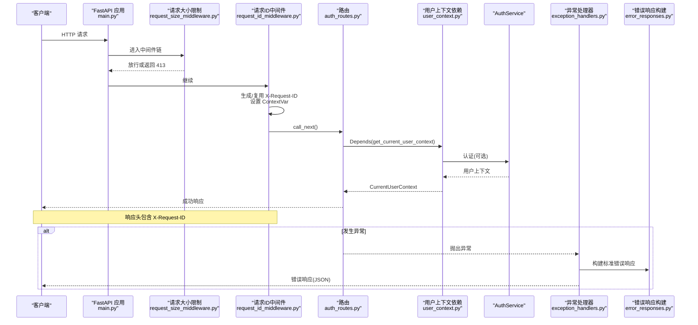
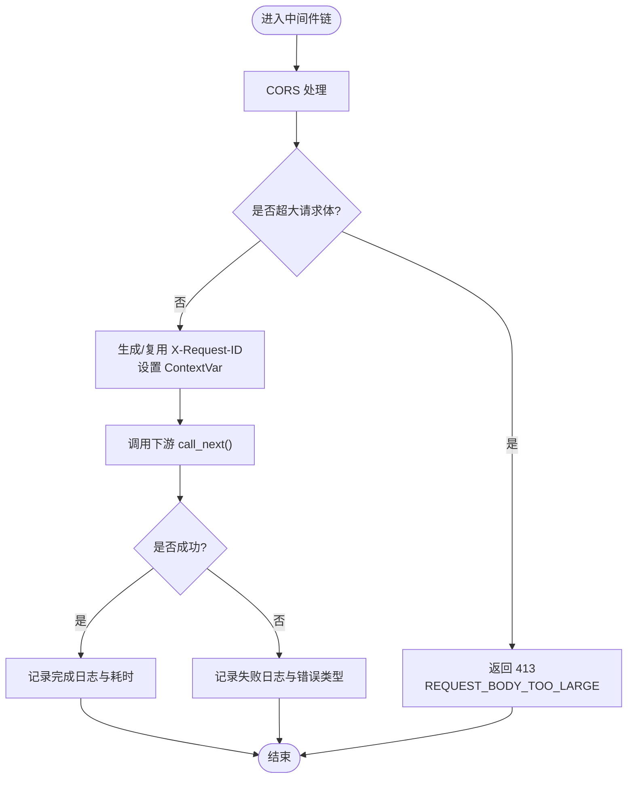
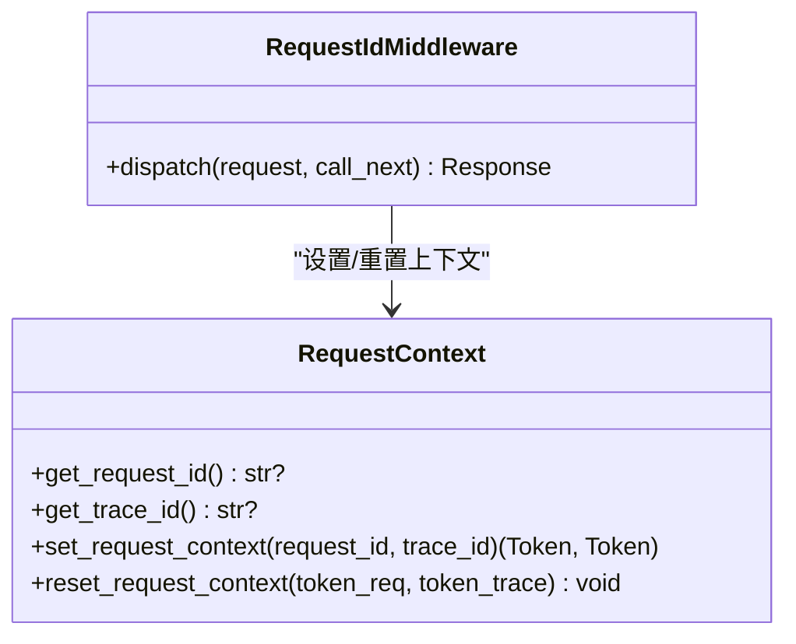
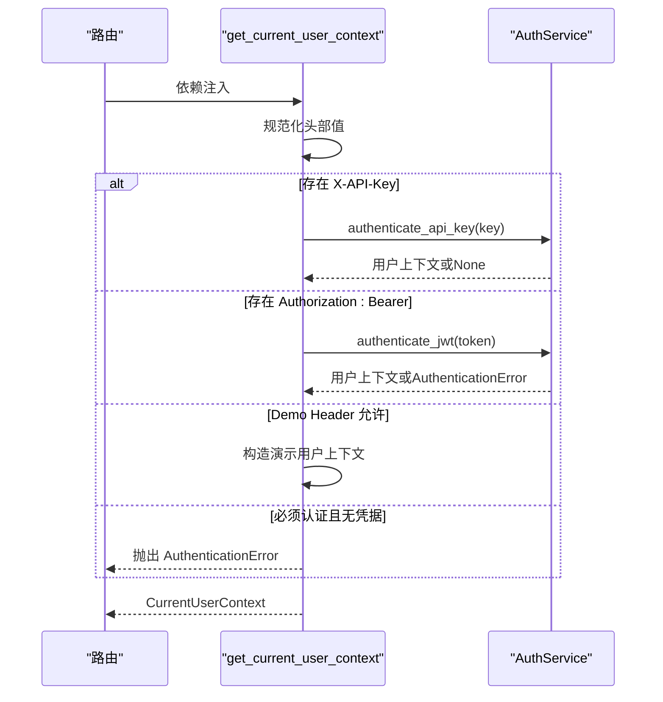
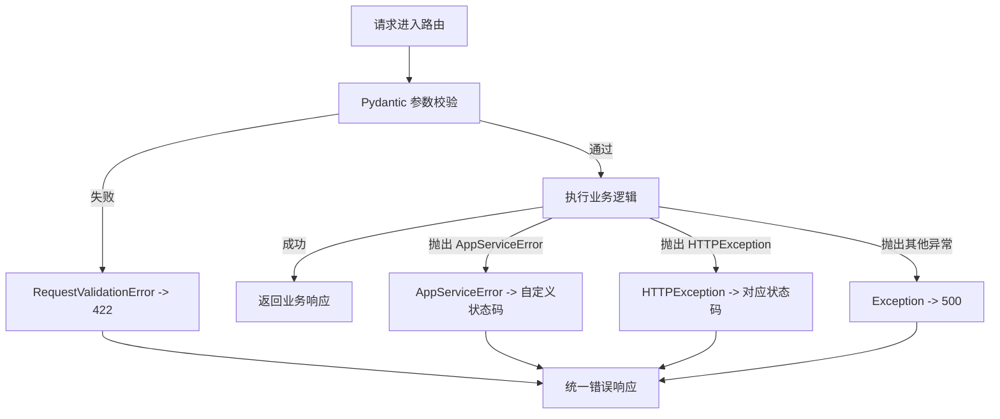
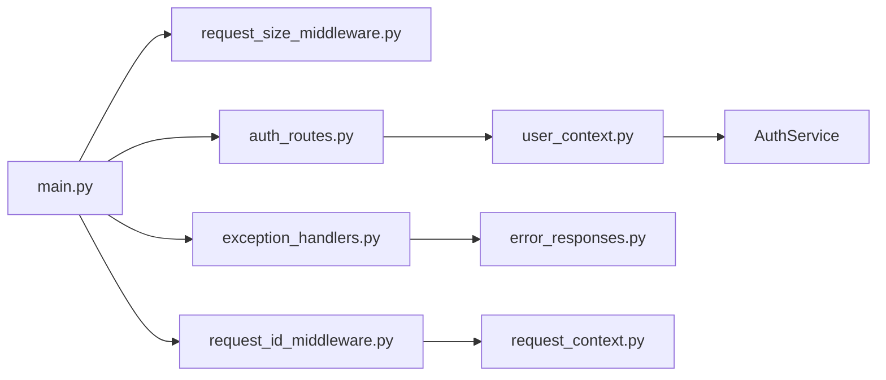

# 请求处理流程

<cite>
**本文引用的文件**
- [src/fast_app/main.py](file://src/fast_app/main.py)
- [src/fast_app/middlewares/request_id_middleware.py](file://src/fast_app/middlewares/request_id_middleware.py)
- [src/fast_app/middlewares/request_size_middleware.py](file://src/fast_app/middlewares/request_size_middleware.py)
- [src/fast_app/core/request_context.py](file://src/fast_app/core/request_context.py)
- [src/fast_app/core/exception_handlers.py](file://src/fast_app/core/exception_handlers.py)
- [src/fast_app/core/error_responses.py](file://src/fast_app/core/error_responses.py)
- [src/fast_app/api/auth_routes.py](file://src/fast_app/api/auth_routes.py)
- [src/fast_app/dependencies/user_context.py](file://src/fast_app/dependencies/user_context.py)
</cite>

## 目录
1. [简介](#简介)
2. [项目结构](#项目结构)
3. [核心组件](#核心组件)
4. [架构总览](#架构总览)
5. [详细组件分析](#详细组件分析)
6. [依赖关系分析](#依赖关系分析)
7. [性能考虑](#性能考虑)
8. [故障排查指南](#故障排查指南)
9. [结论](#结论)
10. [附录](#附录)

## 简介
本文面向开发者，系统化说明从 HTTP 请求进入 FastAPI 到业务逻辑处理的完整数据流转过程。重点覆盖：
- 中间件链执行顺序与作用：请求 ID 生成与透传、请求体大小限制、CORS、异常统一处理等。
- 请求参数验证、转换与错误处理机制（Pydantic + FastAPI 校验）。
- 认证授权流程（API Key / Bearer Token / Demo Header / 匿名模式）及用户上下文注入。
- 异步请求处理模式与并发控制策略（基于事件循环与异步 I/O）。
- 请求处理时序图与错误传播路径。
- 调试与性能优化建议。

## 项目结构
FastAPI 应用入口在 main.py 中创建并配置中间件、注册路由与全局异常处理器；中间件位于 middlewares 目录；认证与用户上下文通过 dependencies 与 api 层协作；错误响应与上下文变量集中在 core 目录。

图表来源
- [src/fast_app/main.py:132-169](file://src/fast_app/main.py#L132-L169)
- [src/fast_app/middlewares/request_size_middleware.py:20-85](file://src/fast_app/middlewares/request_size_middleware.py#L20-L85)
- [src/fast_app/middlewares/request_id_middleware.py:19-98](file://src/fast_app/middlewares/request_id_middleware.py#L19-L98)
- [src/fast_app/core/exception_handlers.py:26-153](file://src/fast_app/core/exception_handlers.py#L26-L153)
- [src/fast_app/core/error_responses.py:7-64](file://src/fast_app/core/error_responses.py#L7-L64)

章节来源
- [src/fast_app/main.py:132-169](file://src/fast_app/main.py#L132-L169)

## 核心组件
- 应用生命周期与资源管理：在 lifespan 中初始化 Milvus、Elasticsearch、httpx、Redis、数据库引擎与 NL2SQL 数据集注册表，并在关闭时安全释放。
- 中间件链：
  - CORS：允许跨域并暴露请求 ID 头。
  - 请求体大小限制：按方法+路径选择上限，仅读取 Content-Length 快速拦截，避免破坏后续 body 流式读取。
  - 请求 ID 与慢请求日志：生成或复用 X-Request-ID，写入 request.state 和 ContextVar，记录耗时与慢请求告警。
- 认证与用户上下文：支持 API Key、Bearer Token、Demo Header、匿名模式，返回统一的 CurrentUserContext。
- 参数校验与错误处理：Pydantic 模型自动校验；统一异常处理器将不同异常转换为标准 JSON 错误响应，附带 request_id 与 trace_id。

章节来源
- [src/fast_app/main.py:41-129](file://src/fast_app/main.py#L41-L129)
- [src/fast_app/middlewares/request_size_middleware.py:20-85](file://src/fast_app/middlewares/request_size_middleware.py#L20-L85)
- [src/fast_app/middlewares/request_id_middleware.py:19-98](file://src/fast_app/middlewares/request_id_middleware.py#L19-L98)
- [src/fast_app/dependencies/user_context.py:16-62](file://src/fast_app/dependencies/user_context.py#L16-L62)
- [src/fast_app/core/exception_handlers.py:26-153](file://src/fast_app/core/exception_handlers.py#L26-L153)

## 架构总览
下图展示一次典型请求的端到端流程，包括中间件、路由、认证依赖、业务服务与异常处理。

图表来源
- [src/fast_app/main.py:138-169](file://src/fast_app/main.py#L138-L169)
- [src/fast_app/middlewares/request_size_middleware.py:39-85](file://src/fast_app/middlewares/request_size_middleware.py#L39-L85)
- [src/fast_app/middlewares/request_id_middleware.py:28-98](file://src/fast_app/middlewares/request_id_middleware.py#L28-L98)
- [src/fast_app/api/auth_routes.py:22-53](file://src/fast_app/api/auth_routes.py#L22-L53)
- [src/fast_app/dependencies/user_context.py:16-62](file://src/fast_app/dependencies/user_context.py#L16-L62)
- [src/fast_app/core/exception_handlers.py:26-153](file://src/fast_app/core/exception_handlers.py#L26-L153)
- [src/fast_app/core/error_responses.py:7-64](file://src/fast_app/core/error_responses.py#L7-L64)

## 详细组件分析

### 中间件链与执行顺序
- 执行顺序（由外到内）：
  1) CORS 中间件：允许跨域并暴露 X-Request-ID。
  2) 请求体大小限制中间件：根据 method+path 选择上限，仅检查 Content-Length，避免读取 body。
  3) 请求 ID 中间件：生成/复用 X-Request-ID，设置 request.state 与 ContextVar，记录耗时与慢请求。
- 关键行为：
  - 请求大小限制：对知识导入相关 POST 放宽上限；非法或超限直接返回 413。
  - 请求 ID：若请求未携带 X-Request-ID，则生成 UUID；响应头回写；失败路径也记录慢请求与错误类型。

图表来源
- [src/fast_app/middlewares/request_size_middleware.py:39-85](file://src/fast_app/middlewares/request_size_middleware.py#L39-L85)
- [src/fast_app/middlewares/request_id_middleware.py:28-98](file://src/fast_app/middlewares/request_id_middleware.py#L28-L98)

章节来源
- [src/fast_app/middlewares/request_size_middleware.py:20-110](file://src/fast_app/middlewares/request_size_middleware.py#L20-L110)
- [src/fast_app/middlewares/request_id_middleware.py:19-98](file://src/fast_app/middlewares/request_id_middleware.py#L19-L98)

### 请求 ID 与上下文传播
- 请求 ID 来源：优先使用请求头 X-Request-ID，否则生成新 UUID。
- 上下文传播：通过 ContextVar 将 request_id 与 trace_id 注入到当前协程上下文，供日志与追踪使用。
- 清理：finally 块中重置 ContextVar，防止上下文污染。

图表来源
- [src/fast_app/core/request_context.py:1-39](file://src/fast_app/core/request_context.py#L1-L39)
- [src/fast_app/middlewares/request_id_middleware.py:19-98](file://src/fast_app/middlewares/request_id_middleware.py#L19-L98)

章节来源
- [src/fast_app/core/request_context.py:1-39](file://src/fast_app/core/request_context.py#L1-L39)
- [src/fast_app/middlewares/request_id_middleware.py:19-98](file://src/fast_app/middlewares/request_id_middleware.py#L19-L98)

### 认证与授权流程
- 支持的认证方式：
  - API Key：通过 X-API-Key 头解析并校验。
  - Bearer Token：从 Authorization 头提取 Bearer token 并校验。
  - Demo Header：本地测试用 X-Demo-User-Id，不视为已认证。
  - 匿名模式：当 AUTH_ENABLED=false 或未提供凭证时，返回匿名用户上下文。
- 用户上下文：统一返回 CurrentUserContext，包含 user_id、is_authenticated、auth_source。

图表来源
- [src/fast_app/dependencies/user_context.py:16-62](file://src/fast_app/dependencies/user_context.py#L16-L62)
- [src/fast_app/api/auth_routes.py:22-53](file://src/fast_app/api/auth_routes.py#L22-L53)

章节来源
- [src/fast_app/dependencies/user_context.py:16-149](file://src/fast_app/dependencies/user_context.py#L16-L149)
- [src/fast_app/api/auth_routes.py:22-112](file://src/fast_app/api/auth_routes.py#L22-L112)

### 请求参数验证、转换与错误处理
- 参数验证：使用 Pydantic 模型进行请求体验证，FastAPI 自动解析并校验字段类型、必填项等。
- 错误处理：
  - 参数校验失败：RequestValidationError -> 422，返回 REQUEST_VALIDATION_ERROR。
  - HTTP 异常：StarletteHTTPException -> 对应状态码，返回 HTTP_XXX。
  - 应用服务异常：AppServiceError -> 自定义状态码与消息，保留 error_category。
  - 未预期异常：捕获 Exception -> 500 INTERNAL_SERVER_ERROR。
- 错误响应：统一封装为包含 code、message、error_category、request_id、trace_id 的结构。

图表来源
- [src/fast_app/core/exception_handlers.py:26-153](file://src/fast_app/core/exception_handlers.py#L26-L153)
- [src/fast_app/core/error_responses.py:7-64](file://src/fast_app/core/error_responses.py#L7-L64)

章节来源
- [src/fast_app/core/exception_handlers.py:26-153](file://src/fast_app/core/exception_handlers.py#L26-L153)
- [src/fast_app/core/error_responses.py:7-64](file://src/fast_app/core/error_responses.py#L7-L64)

### 异步请求处理与并发控制
- 异步模型：所有中间件、路由与服务均使用 async/await，依托事件循环实现高并发 I/O。
- 并发控制策略：
  - 无显式信号量/队列限制，依赖 Python 事件循环与底层库的异步能力。
  - 外部资源连接池（如 httpx.AsyncClient、AsyncElasticsearch、Redis、MilvusClient）在 lifespan 中创建并复用，减少连接开销。
  - 慢请求阈值：RequestIdMiddleware 记录耗时并触发慢请求告警，便于定位瓶颈。

章节来源
- [src/fast_app/main.py:41-129](file://src/fast_app/main.py#L41-L129)
- [src/fast_app/middlewares/request_id_middleware.py:28-98](file://src/fast_app/middlewares/request_id_middleware.py#L28-L98)

## 依赖关系分析
- 模块耦合：
  - main.py 聚合中间件、路由与异常处理器，形成应用装配中心。
  - 中间件依赖 core.request_context 与 core.logging，低侵入地增强请求处理。
  - 认证依赖 services.auth 与 domain.user_context，解耦业务与身份解析。
  - 异常处理器依赖 core.error_responses，保证错误格式一致。
- 外部依赖：
  - Milvus、Elasticsearch、httpx、Redis 等通过 app.state 共享实例，生命周期受 lifespan 管理。

图表来源
- [src/fast_app/main.py:132-169](file://src/fast_app/main.py#L132-L169)
- [src/fast_app/middlewares/request_size_middleware.py:20-85](file://src/fast_app/middlewares/request_size_middleware.py#L20-L85)
- [src/fast_app/middlewares/request_id_middleware.py:19-98](file://src/fast_app/middlewares/request_id_middleware.py#L19-L98)
- [src/fast_app/core/exception_handlers.py:26-153](file://src/fast_app/core/exception_handlers.py#L26-L153)
- [src/fast_app/core/error_responses.py:7-64](file://src/fast_app/core/error_responses.py#L7-L64)
- [src/fast_app/api/auth_routes.py:22-53](file://src/fast_app/api/auth_routes.py#L22-L53)
- [src/fast_app/dependencies/user_context.py:16-62](file://src/fast_app/dependencies/user_context.py#L16-L62)
- [src/fast_app/core/request_context.py:1-39](file://src/fast_app/core/request_context.py#L1-L39)

章节来源
- [src/fast_app/main.py:132-169](file://src/fast_app/main.py#L132-L169)

## 性能考虑
- 中间件优化：
  - 请求大小限制仅读取 Content-Length，避免阻塞读取 body，降低延迟。
  - 请求 ID 中间件记录耗时与慢请求，便于性能监控与定位。
- 资源复用：
  - 外部客户端（httpx、ES、Redis、Milvus）在 lifespan 中创建并复用，减少连接建立开销。
- 异步 I/O：
  - 全链路异步，充分利用事件循环并发能力，适合高吞吐场景。
- 建议：
  - 合理设置慢请求阈值与请求体上限，平衡用户体验与系统保护。
  - 关注外部服务超时与重试策略，避免级联失败。

[本节为通用指导，不直接分析具体文件]

## 故障排查指南
- 常见错误与定位：
  - 413 请求体过大：检查请求路径与方法对应的上限设置，确认 Content-Length 是否正确。
  - 422 参数校验失败：查看 Pydantic 模型定义与入参，核对必填字段与类型。
  - 认证失败：确认 X-API-Key 或 Authorization: Bearer 是否正确传递；检查 AUTH_ENABLED 与 demo header 配置。
  - 500 内部错误：查看异常堆栈与日志中的 error_type，结合 request_id 与 trace_id 追踪。
- 日志与追踪：
  - 使用 X-Request-ID 关联同一请求的全链路日志。
  - 关注 slow_http_request_threshold_ms 触发的慢请求告警。
- 调试步骤：
  - 在路由或服务层打印 request_id 与 trace_id，确认上下文传播正确。
  - 逐步缩小范围至具体服务调用，定位外部依赖问题。

章节来源
- [src/fast_app/middlewares/request_size_middleware.py:61-85](file://src/fast_app/middlewares/request_size_middleware.py#L61-L85)
- [src/fast_app/core/exception_handlers.py:26-153](file://src/fast_app/core/exception_handlers.py#L26-L153)
- [src/fast_app/core/error_responses.py:7-64](file://src/fast_app/core/error_responses.py#L7-L64)
- [src/fast_app/middlewares/request_id_middleware.py:28-98](file://src/fast_app/middlewares/request_id_middleware.py#L28-L98)

## 结论
本项目的请求处理流程以 FastAPI 为核心，通过中间件链实现横切关注点（CORS、请求大小限制、请求 ID 与慢请求日志），配合统一的异常处理器与标准化错误响应，确保可观测性与一致性。认证授权灵活支持多种凭据形式，并通过依赖注入将用户上下文传递给业务层。全链路异步设计提升了并发处理能力，结合外部资源连接池复用，进一步优化了性能。开发者可依据本文提供的时序图与排查指南，快速定位问题并进行性能调优。

[本节为总结性内容，不直接分析具体文件]

## 附录
- 关键配置项参考：
  - CORS 允许源、认证开关、慢请求阈值、请求体上限等，均在应用启动时加载并生效。
- 扩展建议：
  - 可增加限流中间件（如基于 IP 或用户维度）以增强系统稳定性。
  - 引入分布式追踪（如 OpenTelemetry）与集中式日志平台，提升可观测性。

[本节为补充信息，不直接分析具体文件]