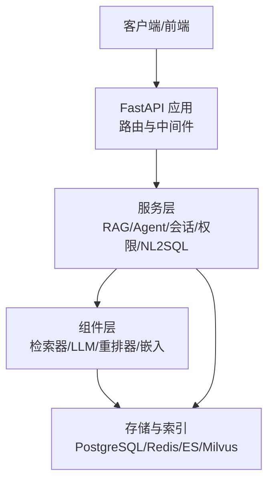
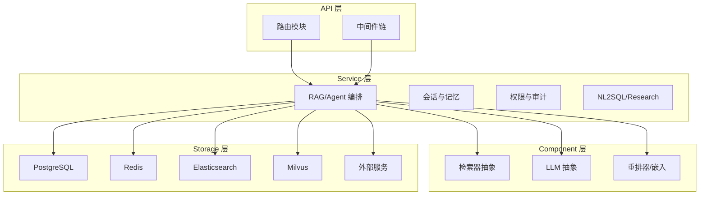
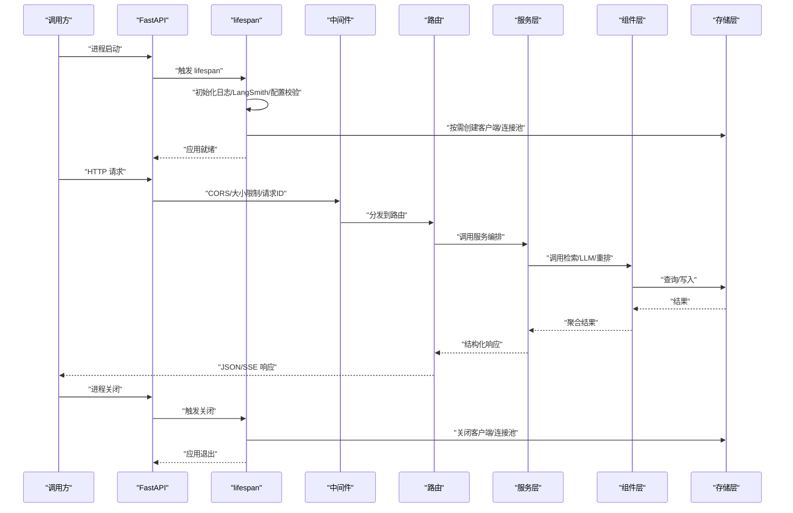
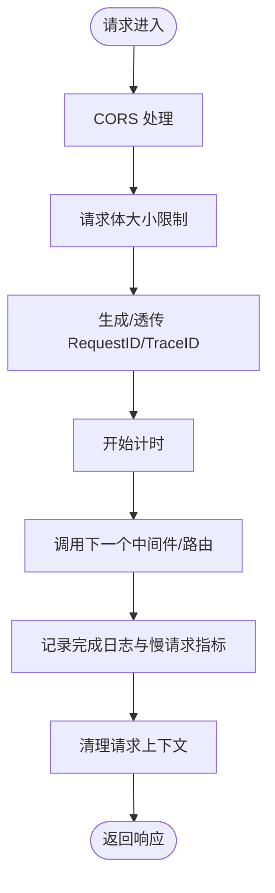
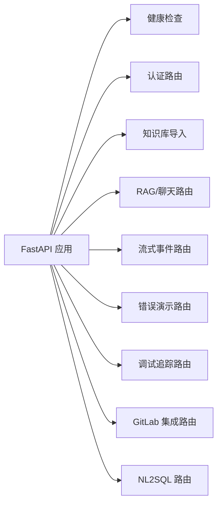
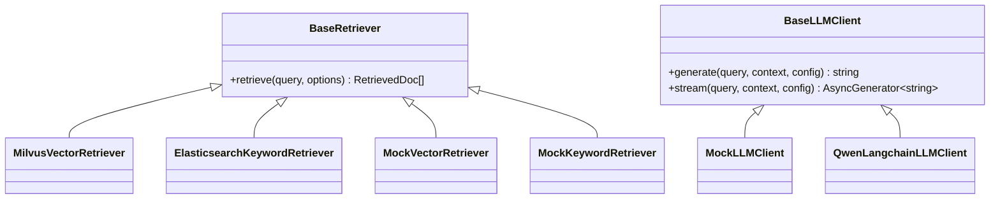
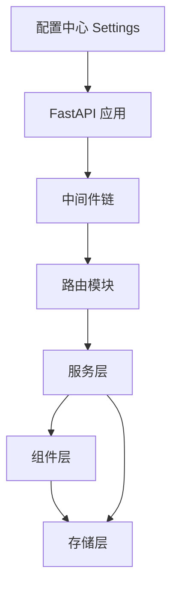
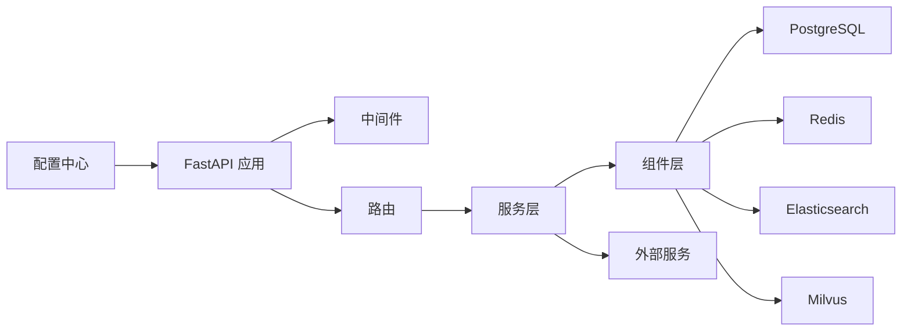

# 整体架构概览

<cite>
**本文引用的文件**
- [src/fast_app/main.py](file://src/fast_app/main.py)
- [src/fast_app/core/config.py](file://src/fast_app/core/config.py)
- [src/fast_app/middlewares/request_id_middleware.py](file://src/fast_app/middlewares/request_id_middleware.py)
- [src/fast_app/components/retrievers/base.py](file://src/fast_app/components/retrievers/base.py)
- [src/fast_app/components/llms/base.py](file://src/fast_app/components/llms/base.py)
- [README.md](file://README.md)
</cite>

## 目录
1. [引言](#引言)
2. [项目结构](#项目结构)
3. [核心组件](#核心组件)
4. [架构总览](#架构总览)
5. [详细组件分析](#详细组件分析)
6. [依赖关系分析](#依赖关系分析)
7. [性能与可观测性](#性能与可观测性)
8. [故障排查指南](#故障排查指南)
9. [结论](#结论)
10. [附录：部署拓扑与配置要点](#附录：部署拓扑与配置要点)

## 引言
本文件面向企业级 RAG Agent 系统的架构师，提供系统分层架构、组件职责、Provider 插件化机制、FastAPI 生命周期与中间件、路由组织方式的整体说明。系统以 FastAPI 为 API 层，通过 Service Layer 编排 RAG/Agent 流程，借助 Component Layer 的检索器、LLM、重排器等抽象接口接入多种后端（Milvus、Elasticsearch、Redis、各类 LLM），并以 PostgreSQL/Redis/ES/Milvus 作为存储与索引层。系统支持结构化路由到简单 RAG、问题分解研究、知识文档管理、Web 检索与受控 NL2SQL 等能力，并通过 SSE 与 JSON 向客户端返回稳定状态。

## 项目结构
仓库采用按领域与层次组织的工程结构：
- API 层：FastAPI 路由与 SSE 边界，负责请求入口、参数校验、响应封装。
- Service 层：RAG/Agent 业务编排、会话记忆、认证授权、NL2SQL、知识导入、Research 工作流等。
- Component 层：可插拔 Provider 抽象（检索器、LLM、重排器、嵌入模型）。
- Storage 层：PostgreSQL、Redis、Elasticsearch、Milvus 等外部存储与搜索引擎。
- Core：配置、日志、异常处理、请求上下文、延迟统计、LangSmith 集成。
- Domain/Schemas：领域模型与 OpenAPI 公共模型。
- Ingestion/Integrations/Evaluation：数据入库、外部系统集成、离线评测。

图表来源
- [src/fast_app/main.py:132-169](file://src/fast_app/main.py#L132-L169)
- [README.md:29-59](file://README.md#L29-L59)

章节来源
- [README.md:99-124](file://README.md#L99-L124)

## 核心组件
- 配置中心 Settings：集中管理所有运行时开关、超时、重试、Provider 选择、安全策略与外部服务连接参数。
- 生命周期管理器 lifespan：在应用启动时创建并缓存 Milvus、Elasticsearch、httpx、Redis、数据库引擎、NL2SQL 注册表与 Deep Document Runtime；在关闭时统一释放资源。
- 中间件链：CORS、请求体大小限制、请求 ID 与慢请求追踪、全局异常处理器。
- 路由组织：健康检查、认证、知识库导入、RAG/聊天、流式事件、错误演示、调试追踪、GitLab 集成、NL2SQL 等路由模块化挂载。
- 组件抽象：BaseRetriever/BaseLLMClient 等抽象类定义统一接口，便于替换不同 Provider。

章节来源
- [src/fast_app/core/config.py:18-800](file://src/fast_app/core/config.py#L18-L800)
- [src/fast_app/main.py:41-129](file://src/fast_app/main.py#L41-L129)
- [src/fast_app/main.py:138-169](file://src/fast_app/main.py#L138-L169)
- [src/fast_app/components/retrievers/base.py:1-13](file://src/fast_app/components/retrievers/base.py#L1-L13)
- [src/fast_app/components/llms/base.py:1-27](file://src/fast_app/components/llms/base.py#L1-L27)

## 架构总览
系统采用四层架构：
- API 层：FastAPI 暴露 REST/SSE 接口，承载认证、限流、追踪、错误处理。
- Service 层：实现 RAG Pipeline、Agent 路由、会话记忆、权限控制、NL2SQL、Research 工作流等。
- Component 层：通过抽象接口接入多种 Provider（向量检索、关键词检索、LLM、重排器、嵌入模型）。
- Storage 层：持久化与索引（PostgreSQL、Redis、Elasticsearch、Milvus）以及外部服务（GitLab、Bocha、OpenAI-compatible）。

图表来源
- [README.md:29-59](file://README.md#L29-L59)
- [src/fast_app/main.py:41-129](file://src/fast_app/main.py#L41-L129)

## 详细组件分析

### FastAPI 应用生命周期与资源管理
- 启动阶段：加载配置、初始化日志、配置 LangSmith、校验 Agent Router 配置；根据配置按需创建 Milvus、Elasticsearch、httpx、Redis、数据库引擎、NL2SQL 数据集注册表与 Deep Document Runtime。
- 运行阶段：将客户端请求经中间件处理后进入路由与服务层；所有外部客户端均复用连接池或单例，避免重复建立连接。
- 关闭阶段：按顺序关闭 Milvus、Elasticsearch、httpx、Redis、Deep Document Runtime、数据库引擎与 NL2SQL 注册表，确保资源释放与日志记录。

图表来源
- [src/fast_app/main.py:41-129](file://src/fast_app/main.py#L41-L129)
- [src/fast_app/main.py:132-169](file://src/fast_app/main.py#L132-L169)

章节来源
- [src/fast_app/main.py:41-129](file://src/fast_app/main.py#L41-L129)

### 中间件机制与请求上下文
- CORS 中间件：允许跨域访问，暴露请求 ID 头以便客户端回显。
- 请求体大小限制：在进入 Pydantic/RAG Pipeline 前拒绝超大请求，保护下游服务。
- 请求 ID 与慢请求追踪：为每个请求生成或透传 request_id/trace_id，记录耗时与慢请求告警，并在 finally 中清理上下文，避免污染后续任务。
- 全局异常处理器：统一捕获并格式化异常，输出结构化错误信息。

图表来源
- [src/fast_app/main.py:138-156](file://src/fast_app/main.py#L138-L156)
- [src/fast_app/middlewares/request_id_middleware.py:19-98](file://src/fast_app/middlewares/request_id_middleware.py#L19-L98)

章节来源
- [src/fast_app/middlewares/request_id_middleware.py:19-98](file://src/fast_app/middlewares/request_id_middleware.py#L19-L98)

### 路由组织方式
- 健康检查：/health 用于存活探针。
- 认证：/auth/* 提供登录、刷新、当前用户上下文。
- 知识库导入：/knowledge-documents/* 支持异步导入任务。
- RAG/聊天：/rag/chat、/rag/search、/rag/chat/stream/events 为主链路。
- 流式事件：/stream/* 提供 SSE 事件流。
- 错误演示与调试：/error-demo/*、/debug/* 用于开发与诊断。
- GitLab 集成：/integrations/gitlab/* 接收 Webhook 与同步。
- NL2SQL：/nl2sql/* 提供数据集列表与受控查询。

图表来源
- [src/fast_app/main.py:158-169](file://src/fast_app/main.py#L158-L169)

章节来源
- [src/fast_app/main.py:158-169](file://src/fast_app/main.py#L158-L169)

### 多 Provider 插件化架构
- 检索器抽象：BaseRetriever 定义 retrieve(query, options) 接口，Milvus 向量检索、Elasticsearch 关键词检索、Mock 检索均可实现该接口。
- LLM 抽象：BaseLLMClient 定义 generate/stream 接口，支持 mock、Qwen LangChain 等实现。
- 重排器/嵌入：reranker_provider/embedding_provider 等配置项决定具体实现。
- 运行时选择：Settings 中的 provider 字段驱动 lifespan 创建对应客户端，服务层通过依赖注入使用已实例化的 Provider。

图表来源
- [src/fast_app/components/retrievers/base.py:1-13](file://src/fast_app/components/retrievers/base.py#L1-L13)
- [src/fast_app/components/llms/base.py:1-27](file://src/fast_app/components/llms/base.py#L1-L27)

章节来源
- [src/fast_app/components/retrievers/base.py:1-13](file://src/fast_app/components/retrievers/base.py#L1-L13)
- [src/fast_app/components/llms/base.py:1-27](file://src/fast_app/components/llms/base.py#L1-L27)
- [src/fast_app/core/config.py:597-633](file://src/fast_app/core/config.py#L597-L633)

### 系统上下文图与组件依赖关系
- 上下文：请求级 request_id/trace_id 贯穿中间件、路由、服务、组件与存储，便于全链路追踪。
- 依赖：API 层依赖 Service 层；Service 层依赖 Component 层；Component 层依赖 Storage 层；配置中心驱动 Provider 选择与行为开关。

图表来源
- [src/fast_app/core/config.py:18-800](file://src/fast_app/core/config.py#L18-L800)
- [src/fast_app/main.py:132-169](file://src/fast_app/main.py#L132-L169)

## 依赖关系分析
- 直接依赖：
  - FastAPI 应用依赖中间件、路由、异常处理器。
  - 生命周期依赖配置、日志、LangSmith、外部客户端与数据库引擎。
  - 服务层依赖组件抽象与存储客户端。
- 间接依赖：
  - Provider 选择由配置驱动，影响运行时创建的客户端类型。
  - 中间件对请求上下文与延迟统计有强依赖。
- 潜在循环：
  - 通过抽象解耦，避免组件与服务之间的循环依赖。
- 外部集成点：
  - Milvus、Elasticsearch、Redis、PostgreSQL、OpenAI-compatible LLM、GitLab、Bocha、LangSmith。

图表来源
- [src/fast_app/main.py:41-129](file://src/fast_app/main.py#L41-L129)
- [src/fast_app/core/config.py:18-800](file://src/fast_app/core/config.py#L18-L800)

章节来源
- [src/fast_app/main.py:41-129](file://src/fast_app/main.py#L41-L129)
- [src/fast_app/core/config.py:18-800](file://src/fast_app/core/config.py#L18-L800)

## 性能与可观测性
- 性能特性：
  - 连接复用：Milvus、Elasticsearch、httpx、Redis、数据库引擎在 lifespan 内复用，减少握手开销。
  - 超时与重试：外部调用具备超时与重试配置，避免雪崩。
  - 慢请求阈值：HTTP、RAG、检索、重排、LLM 各层均有阈值配置，便于定位瓶颈。
- 可观测性：
  - 请求 ID/Trace ID：贯穿全链路，便于关联日志与追踪。
  - 慢操作日志：记录方法、路径、状态码、耗时与错误类型。
  - LangSmith：可选开启 tracing，默认不上传敏感数据。

章节来源
- [src/fast_app/main.py:41-129](file://src/fast_app/main.py#L41-L129)
- [src/fast_app/middlewares/request_id_middleware.py:19-98](file://src/fast_app/middlewares/request_id_middleware.py#L19-L98)
- [src/fast_app/core/config.py:28-52](file://src/fast_app/core/config.py#L28-L52)
- [src/fast_app/core/config.py:86-102](file://src/fast_app/core/config.py#L86-L102)

## 故障排查指南
- 启动失败：
  - 检查配置是否完整（数据库 URL、Provider 地址、密钥）。
  - 确认外部服务可达（Milvus、ES、Redis、PostgreSQL）。
  - 查看 lifespan 日志，定位客户端创建失败原因。
- 请求超时/失败：
  - 调整超时与重试配置，关注慢请求阈值。
  - 检查中间件是否拦截（请求体过大、CORS）。
  - 查看请求 ID 对应的日志与错误类型。
- 检索/生成质量：
  - 切换 Provider 进行对比（mock vs 真实）。
  - 调整 top_k、min_score、父块扩展、重排策略。
  - 启用 LangSmith tracing 对齐 Classic 与 LangGraph Pipeline 的 trace。

章节来源
- [src/fast_app/main.py:41-129](file://src/fast_app/main.py#L41-L129)
- [src/fast_app/middlewares/request_id_middleware.py:19-98](file://src/fast_app/middlewares/request_id_middleware.py#L19-L98)
- [src/fast_app/core/config.py:597-633](file://src/fast_app/core/config.py#L597-L633)

## 结论
该系统以分层架构与 Provider 抽象为核心，实现了高内聚、低耦合的企业级 RAG Agent 后端。FastAPI 的生命周期管理确保了外部资源的统一创建与释放；中间件提供了安全、追踪与性能监控能力；路由组织清晰，便于扩展新能力。通过配置驱动的 Provider 选择，系统可灵活适配 Milvus、Elasticsearch、Redis、LLM 等多种后端，满足企业场景的可扩展性与稳定性要求。

## 附录：部署拓扑与配置要点
- 部署拓扑：
  - 应用进程：FastAPI 主进程，承载 API 与中间件。
  - 独立 Worker：GitLab 同步 Worker 常驻处理队列。
  - 外部服务：PostgreSQL、Redis、Elasticsearch、Milvus、OpenAI-compatible LLM、GitLab、Bocha。
- 配置要点：
  - 最小启动基线：classic pipeline + mock retriever + mock LLM，降低本地依赖。
  - 生产环境：启用 AUTH、Prompt Guard、LangSmith 脱敏模式，收紧 CORS 与超时。
  - 关键开关：RAG_PIPELINE_PROVIDER、MEMORY_STORE_PROVIDER、AGENT_DOCUMENT_TOOLS_ENABLED、NL2SQL_ENABLED、GITLAB_INTEGRATION_ENABLED。

章节来源
- [README.md:126-193](file://README.md#L126-L193)
- [README.md:241-273](file://README.md#L241-L273)
- [src/fast_app/core/config.py:18-800](file://src/fast_app/core/config.py#L18-L800)