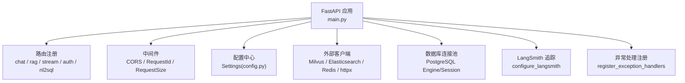
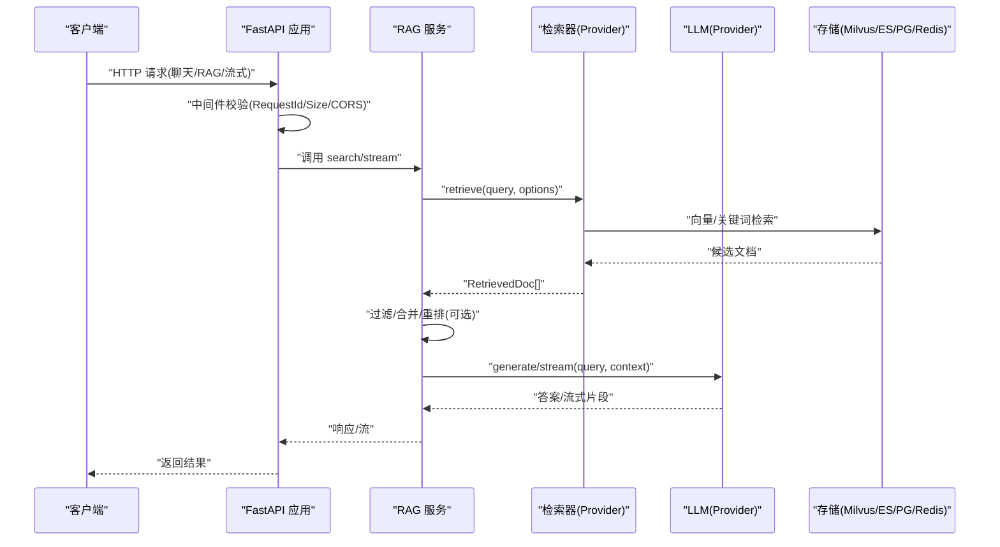
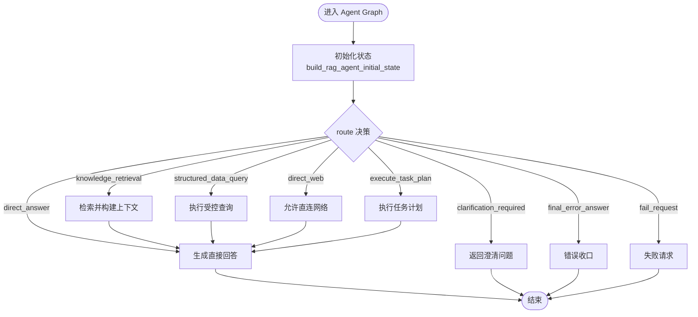
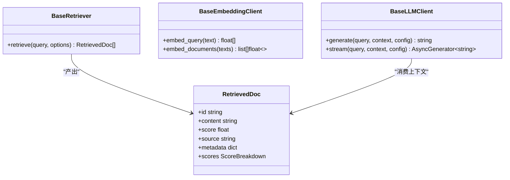
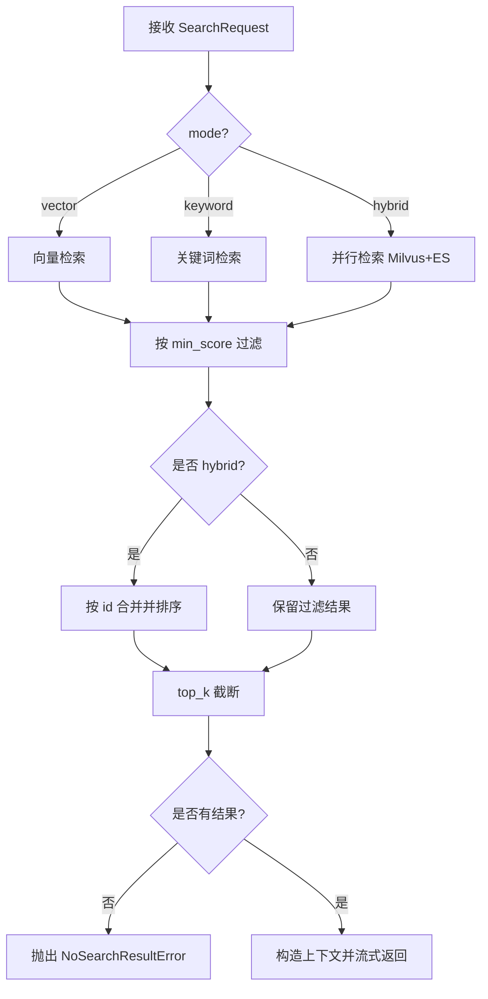
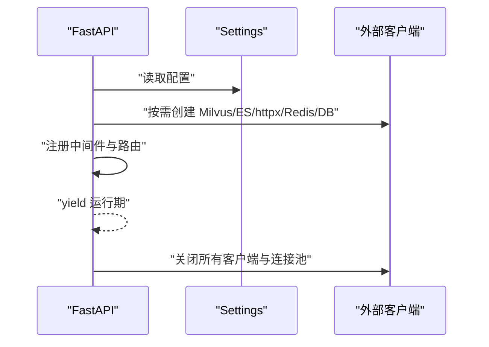
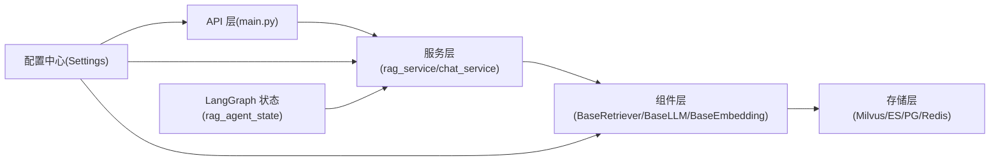

# 架构设计

<cite>
**本文引用的文件**
- [src/fast_app/main.py](file://src/fast_app/main.py)
- [src/fast_app/core/config.py](file://src/fast_app/core/config.py)
- [src/fast_app/graph/rag_agent/rag_agent_state.py](file://src/fast_app/graph/rag_agent/rag_agent_state.py)
- [src/fast_app/services/rag/rag_service.py](file://src/fast_app/services/rag/rag_service.py)
- [src/fast_app/components/retrievers/base.py](file://src/fast_app/components/retrievers/base.py)
- [src/fast_app/domain/rag_models.py](file://src/fast_app/domain/rag_models.py)
- [src/fast_app/components/embeddings/base.py](file://src/fast_app/components/embeddings/base.py)
- [src/fast_app/components/llms/base.py](file://src/fast_app/components/llms/base.py)
- [src/fast_app/services/chat_service.py](file://src/fast_app/services/chat_service.py)
</cite>

## 目录
1. [简介](#简介)
2. [项目结构](#项目结构)
3. [核心组件](#核心组件)
4. [架构总览](#架构总览)
5. [详细组件分析](#详细组件分析)
6. [依赖关系分析](#依赖关系分析)
7. [性能与可扩展性](#性能与可扩展性)
8. [故障排查指南](#故障排查指南)
9. [结论](#结论)
10. [附录](#附录)

## 简介
本架构设计文档面向企业级 RAG Agent 系统，围绕分层架构（API Layer → Service Layer → Component Layer → Storage）展开，重点说明 LangGraph 状态机模式、Provider 模式与事件驱动架构的设计决策。文档提供系统边界图、组件关系图与部署拓扑，并覆盖安全、监控、可观测性与可扩展性等跨领域关注点，帮助架构师与高级开发者快速把握整体设计与落地要点。

## 项目结构
系统采用 FastAPI 作为 API 层入口，通过 lifespan 管理外部资源生命周期；服务层编排检索、重排、生成等流程；组件层以 Provider 抽象隔离不同实现；存储层对接向量库、关键词检索、关系型数据库与缓存。

**图表来源**
- [src/fast_app/main.py:41-129](file://src/fast_app/main.py#L41-L129)
- [src/fast_app/core/config.py:18-634](file://src/fast_app/core/config.py#L18-L634)

**章节来源**
- [src/fast_app/main.py:1-170](file://src/fast_app/main.py#L1-L170)
- [src/fast_app/core/config.py:1-800](file://src/fast_app/core/config.py#L1-L800)

## 核心组件
- API 层：统一路由注册、请求体大小限制、请求 ID 透传、CORS 与全局异常处理。
- 服务层：RAG 检索服务、聊天服务、流式输出封装。
- 组件层：检索器、嵌入模型、大语言模型、重排器的 Provider 抽象与具体实现。
- 存储层：Milvus 向量检索、Elasticsearch 关键词检索、PostgreSQL 会话与元数据、Redis 短期记忆。
- 状态机：基于 TypedDict 的 LangGraph 状态定义，承载路由、上下文、工具调用、计划与答案等全链路信息。

**章节来源**
- [src/fast_app/services/rag/rag_service.py:84-173](file://src/fast_app/services/rag/rag_service.py#L84-L173)
- [src/fast_app/services/chat_service.py:7-24](file://src/fast_app/services/chat_service.py#L7-L24)
- [src/fast_app/components/retrievers/base.py:1-13](file://src/fast_app/components/retrievers/base.py#L1-L13)
- [src/fast_app/components/embeddings/base.py:1-13](file://src/fast_app/components/embeddings/base.py#L1-L13)
- [src/fast_app/components/llms/base.py:1-27](file://src/fast_app/components/llms/base.py#L1-L27)
- [src/fast_app/graph/rag_agent/rag_agent_state.py:16-203](file://src/fast_app/graph/rag_agent/rag_agent_state.py#L16-L203)

## 架构总览
下图展示从 HTTP 请求到检索、重排、生成的端到端流程，以及 LangGraph 状态在节点间的流转。

**图表来源**
- [src/fast_app/main.py:138-169](file://src/fast_app/main.py#L138-L169)
- [src/fast_app/services/rag/rag_service.py:84-173](file://src/fast_app/services/rag/rag_service.py#L84-L173)
- [src/fast_app/components/retrievers/base.py:6-13](file://src/fast_app/components/retrievers/base.py#L6-L13)
- [src/fast_app/components/llms/base.py:9-27](file://src/fast_app/components/llms/base.py#L9-L27)

## 详细组件分析

### LangGraph 状态机模式
- 状态类型：使用 TypedDict 定义 RagAgentState，集中承载查询改写、检索策略、权限过滤、路由决策、工具调用、任务计划与最终答案等字段。
- 初始状态构建：通过 build_rag_agent_initial_state 将请求参数、用户上下文与权限范围冻结为一次请求的不可变快照，避免跨请求污染。
- 路由与终止：route 字段决定下一步动作（直接回答、知识检索、结构化查询、Web 兜底、执行任务计划、澄清、错误收口等），配合 step_count、tool_call_count、loop_decision、error_decision 控制循环与终止。

**图表来源**
- [src/fast_app/graph/rag_agent/rag_agent_state.py:16-140](file://src/fast_app/graph/rag_agent/rag_agent_state.py#L16-L140)
- [src/fast_app/graph/rag_agent/rag_agent_state.py:142-203](file://src/fast_app/graph/rag_agent/rag_agent_state.py#L142-L203)

**章节来源**
- [src/fast_app/graph/rag_agent/rag_agent_state.py:16-203](file://src/fast_app/graph/rag_agent/rag_agent_state.py#L16-L203)

### Provider 模式（检索、嵌入、LLM、重排）
- 检索器：BaseRetriever 定义 retrieve(query, options) 接口，支持 Milvus、Elasticsearch、Mock 等多种实现。
- 嵌入模型：BaseEmbeddingClient 定义 embed_query/embed_documents，屏蔽不同厂商差异。
- 大语言模型：BaseLLMClient 定义 generate/stream，统一输入 RagContext，支持同步与流式。
- 重排器：通过配置选择 dashscope/mock/none，并在启动时创建对应客户端。

**图表来源**
- [src/fast_app/components/retrievers/base.py:1-13](file://src/fast_app/components/retrievers/base.py#L1-L13)
- [src/fast_app/components/embeddings/base.py:1-13](file://src/fast_app/components/embeddings/base.py#L1-L13)
- [src/fast_app/components/llms/base.py:1-27](file://src/fast_app/components/llms/base.py#L1-L27)
- [src/fast_app/domain/rag_models.py:40-80](file://src/fast_app/domain/rag_models.py#L40-L80)

**章节来源**
- [src/fast_app/components/retrievers/base.py:1-13](file://src/fast_app/components/retrievers/base.py#L1-L13)
- [src/fast_app/components/embeddings/base.py:1-13](file://src/fast_app/components/embeddings/base.py#L1-L13)
- [src/fast_app/components/llms/base.py:1-27](file://src/fast_app/components/llms/base.py#L1-L27)
- [src/fast_app/domain/rag_models.py:1-80](file://src/fast_app/domain/rag_models.py#L1-L80)

### 检索与服务编排
- 检索模式：vector、keyword、hybrid，支持并行召回与分数过滤、按 id 合并与 top_k 截断。
- 流式输出：search 结果转换为上下文文本，逐字符流式返回，便于前端增量渲染。
- 错误处理：无命中时抛出 NoSearchResultError，便于上层统一降级或提示。

**图表来源**
- [src/fast_app/services/rag/rag_service.py:84-173](file://src/fast_app/services/rag/rag_service.py#L84-L173)

**章节来源**
- [src/fast_app/services/rag/rag_service.py:84-173](file://src/fast_app/services/rag/rag_service.py#L84-L173)

### 应用生命周期与外部资源管理
- 启动阶段：根据配置动态创建 Milvus、Elasticsearch、httpx、Redis、PostgreSQL 引擎与 NL2SQL DatasetRegistry，并加载 Deep Document Runtime（可选）。
- 关闭阶段：有序关闭所有外部客户端与连接池，确保资源释放与日志记录。
- 中间件：CORS、请求大小限制、请求 ID 透传与慢请求阈值告警。

**图表来源**
- [src/fast_app/main.py:41-129](file://src/fast_app/main.py#L41-L129)
- [src/fast_app/core/config.py:18-634](file://src/fast_app/core/config.py#L18-L634)

**章节来源**
- [src/fast_app/main.py:41-129](file://src/fast_app/main.py#L41-L129)
- [src/fast_app/core/config.py:18-634](file://src/fast_app/core/config.py#L18-L634)

## 依赖关系分析
- API 层依赖服务层进行业务编排，服务层依赖组件层的 Provider 抽象，组件层依赖存储层的具体实现。
- 配置中心贯穿各层，决定启用哪些 Provider、超时与重试策略、安全开关与可观测性开关。
- LangGraph 状态在各节点间传递，保证一次请求内上下文一致且可审计。

**图表来源**
- [src/fast_app/main.py:138-169](file://src/fast_app/main.py#L138-L169)
- [src/fast_app/services/rag/rag_service.py:84-173](file://src/fast_app/services/rag/rag_service.py#L84-L173)
- [src/fast_app/components/retrievers/base.py:1-13](file://src/fast_app/components/retrievers/base.py#L1-L13)
- [src/fast_app/components/llms/base.py:1-27](file://src/fast_app/components/llms/base.py#L1-L27)
- [src/fast_app/core/config.py:18-634](file://src/fast_app/core/config.py#L18-L634)
- [src/fast_app/graph/rag_agent/rag_agent_state.py:16-203](file://src/fast_app/graph/rag_agent/rag_agent_state.py#L16-L203)

**章节来源**
- [src/fast_app/main.py:138-169](file://src/fast_app/main.py#L138-L169)
- [src/fast_app/services/rag/rag_service.py:84-173](file://src/fast_app/services/rag/rag_service.py#L84-L173)
- [src/fast_app/core/config.py:18-634](file://src/fast_app/core/config.py#L18-L634)
- [src/fast_app/graph/rag_agent/rag_agent_state.py:16-203](file://src/fast_app/graph/rag_agent/rag_agent_state.py#L16-L203)

## 性能与可扩展性
- 并行检索：hybrid 模式下并发调用向量与关键词检索，降低端到端延迟。
- 超时与重试：通过 Settings 配置外部调用最大重试次数与基础退避延迟，避免雪崩。
- 流式输出：对检索上下文与 LLM 输出进行流式传输，提升用户体验与吞吐。
- Provider 切换：通过配置项 vector_retriever_provider、keyword_retriever_provider、reranker_provider、embedding_provider、llm_provider 灵活切换实现，便于灰度与回滚。
- 资源复用：应用启动时创建并复用客户端连接池，减少握手开销。

[本节为通用指导，不直接分析具体文件]

## 故障排查指南
- 无检索结果：当过滤后无命中时抛出 NoSearchResultError，建议检查 min_score、filters、权限范围与索引健康。
- 外部服务异常：通过 external_call_max_retries 与外部超时配置控制重试与熔断；结合 LangSmith 追踪定位瓶颈。
- 流式中断：检查网络与下游服务超时；确认流式缓冲与 chunk 大小配置合理。
- 资源泄漏：确保 lifespan finally 分支正确关闭 Milvus、ES、httpx、Redis、DB 引擎与 Deep Document Runtime。

**章节来源**
- [src/fast_app/services/rag/rag_service.py:113-149](file://src/fast_app/services/rag/rag_service.py#L113-L149)
- [src/fast_app/main.py:91-129](file://src/fast_app/main.py#L91-L129)
- [src/fast_app/core/config.py:620-634](file://src/fast_app/core/config.py#L620-L634)

## 结论
本架构以 FastAPI 为入口，结合 LangGraph 状态机与 Provider 模式，实现了高内聚、低耦合的企业级 RAG Agent 系统。通过配置驱动的 Provider 切换、并行检索与流式输出，系统在性能与可扩展性上具备良好基础。同时，借助中间件、异常处理与可观测性配置，系统在安全、监控与运维方面满足企业化要求。建议在后续迭代中持续完善权限审计、降级策略与容量规划，以支撑更大规模的生产场景。

## 附录
- 系统边界图：API 层暴露聊天、RAG、流式、认证、知识库导入、GitLab 集成、NL2SQL 等能力；内部通过服务层与组件层协调外部存储与模型服务。
- 部署拓扑：建议将 FastAPI 服务与 Milvus、Elasticsearch、PostgreSQL、Redis 分域部署，使用独立命名空间与网络策略隔离；通过环境变量注入敏感配置，启用 LangSmith 追踪用于生产可观测性。

[本节为概念性内容，不直接分析具体文件]