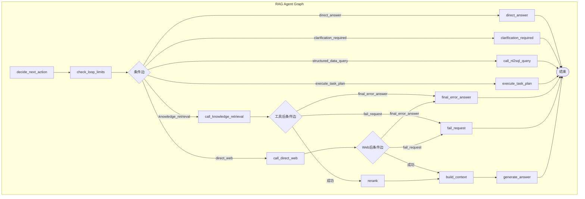
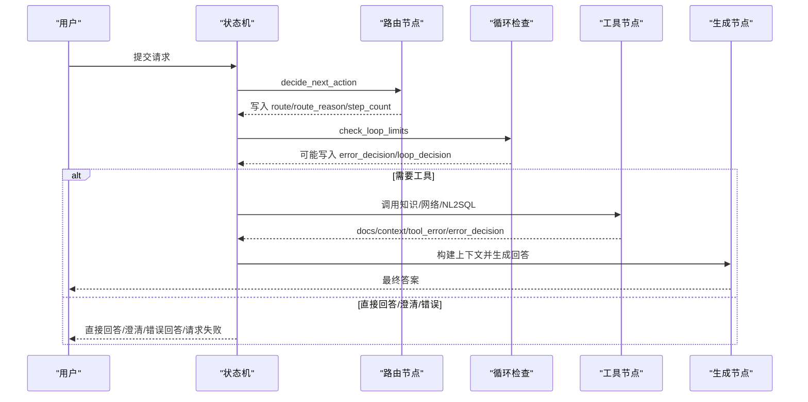
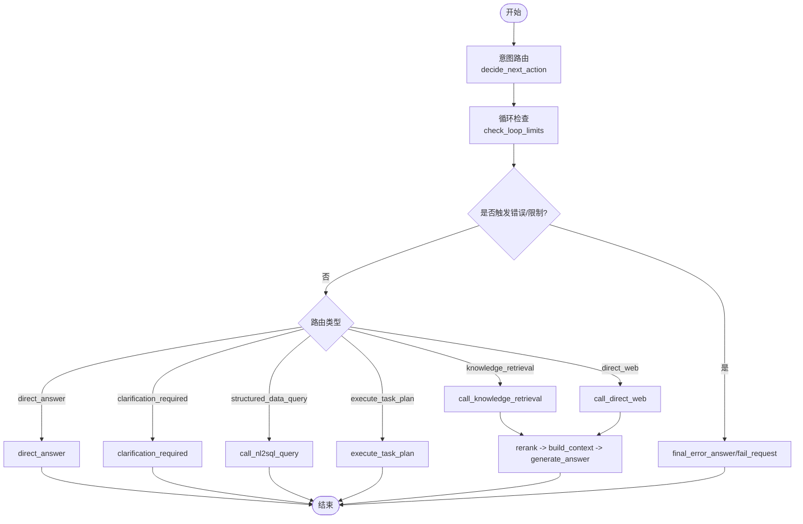
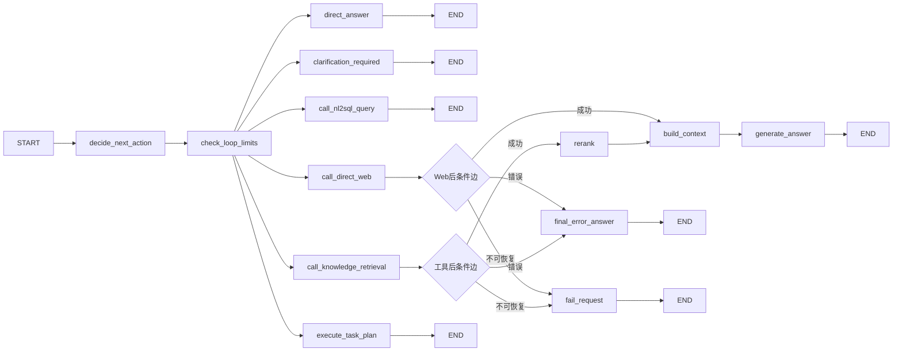
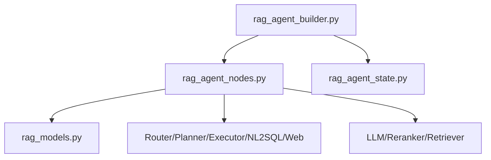

# LangGraph 状态机模式

<cite>
**本文引用的文件**
- [rag_agent_state.py](file://src/fast_app/graph/rag_agent/rag_agent_state.py)
- [rag_agent_nodes.py](file://src/fast_app/graph/rag_agent/rag_agent_nodes.py)
- [rag_agent_builder.py](file://src/fast_app/graph/rag_agent/rag_agent_builder.py)
- [rag_graph_state.py](file://src/fast_app/graph/rag/rag_graph_state.py)
- [rag_models.py](file://src/app/domain/rag_models.py)
</cite>

## 目录
1. [简介](#简介)
2. [项目结构](#项目结构)
3. [核心组件](#核心组件)
4. [架构总览](#架构总览)
5. [详细组件分析](#详细组件分析)
6. [依赖关系分析](#依赖关系分析)
7. [性能考虑](#性能考虑)
8. [故障排查指南](#故障排查指南)
9. [结论](#结论)
10. [附录](#附录)

## 简介
本文件系统性梳理并文档化基于 LangGraph 的状态机模式在 RAG Agent 工作流中的应用。重点包括：
- 状态机模式在 Agent 中的角色：以 TypedDict 定义状态，以节点封装执行逻辑，以条件边根据业务规则动态决定下一步。
- RagAgentState 的状态结构设计：覆盖查询上下文、检索结果、生成结果、路由决策、循环与错误控制等字段管理。
- 条件边（ConditionalEdges）的实现方式：通过函数读取 state 返回目标节点名，实现“判断”与“执行”分离。
- RAG Agent 的完整状态流转图：从意图识别到最终回答生成的全过程。
- 状态调试与监控最佳实践：状态快照、错误恢复、性能分析与可观测性。
- 自定义状态机与节点扩展指导：如何新增路由、工具调用和分支。

## 项目结构
本项目将 RAG 相关能力拆分为两个 Graph：
- 通用 RAG Graph：用于基础检索、重排、上下文构建与回答生成。
- RAG Agent Graph：在通用 RAG 之上增加意图路由、任务规划、工具调用、澄清与错误处理等 Agent 能力。

图表来源
- [rag_agent_builder.py:54-199](file://src/fast_app/graph/rag_agent/rag_agent_builder.py#L54-L199)

章节来源
- [rag_agent_builder.py:54-199](file://src/fast_app/graph/rag_agent/rag_agent_builder.py#L54-L199)

## 核心组件
- 状态定义
  - RagAgentState：Agent 级状态，包含用户请求、会话上下文、路由决策、工具调用计数、检索结果、上下文、答案、权限与计划等。
  - GraphRagState：通用 RAG 级状态，聚焦检索参数、中间产物与答案。
  - 领域模型：RetrievedDoc、RagContext 描述检索文档与上下文。
- 节点与条件边
  - decide_next_action：意图路由与任务规划入口。
  - check_loop_limits：循环与工具调用上限检查。
  - call_knowledge_retrieval / call_direct_web / call_nl2sql_query：工具调用节点。
  - rerank / build_context / generate_answer：检索后处理与回答生成。
  - direct_answer / clarification_required / final_error_answer / fail_request：终止路径。
  - 条件边：route_after_loop_check、route_after_tool_call、route_after_direct_web。

章节来源
- [rag_agent_state.py:32-203](file://src/fast_app/graph/rag_agent/rag_agent_state.py#L32-L203)
- [rag_graph_state.py:15-65](file://src/fast_app/graph/rag/rag_graph_state.py#L15-L65)
- [rag_models.py:6-27](file://src/app/domain/rag_models.py#L6-L27)
- [rag_agent_nodes.py:88-800](file://src/fast_app/graph/rag_agent/rag_agent_nodes.py#L88-L800)
- [rag_agent_builder.py:54-199](file://src/fast_app/graph/rag_agent/rag_agent_builder.py#L54-L199)

## 架构总览
RAG Agent 的状态机由“判断”与“执行”两层组成：
- 判断层：decide_next_action 负责意图识别、任务规划、是否需要检索或联网；check_loop_limits 负责循环与工具调用预算控制。
- 执行层：根据路由进入具体工具节点（知识库检索、结构化数据查询、直接 Web 搜索），随后进行重排、上下文构建与回答生成。
- 终止路径：直接回答、澄清、错误回答、请求失败等。

图表来源
- [rag_agent_builder.py:140-199](file://src/fast_app/graph/rag_agent/rag_agent_builder.py#L140-L199)
- [rag_agent_nodes.py:416-800](file://src/fast_app/graph/rag_agent/rag_agent_nodes.py#L416-L800)

## 详细组件分析

### RagAgentState 状态结构
RagAgentState 是 Agent 图的唯一共享状态，按职责分组：
- 输入与上下文
  - session_id、original_query、query、rewritten_query、history_window_text、summary_text、summary_used、summary_version、summary_source_message_count、summary_source_message_ids
- 检索配置
  - mode、top_k、candidate_k、min_score、filters、allow_web_fallback、allow_direct_web、dataset_id、nl2sql_action
- 路由与决策
  - operation、route、route_reason、route_intent、route_confidence、route_source、route_model、route_latency_ms、route_rule_matched、clarification_required、clarification_code、clarification_question、final_reason
- 控制与资源
  - step_count、tool_call_count、loop_decision、error_decision
- 工具与中间产物
  - tool_name、tool_error、docs、context、nl2sql_result、answer
- 权限与计划
  - current_user、agent_task_plan、agent_task_plan_id、requires_confirmation

初始化函数集中设置默认值，避免跨请求共享状态，便于追踪与调试。

章节来源
- [rag_agent_state.py:32-203](file://src/fast_app/graph/rag_agent/rag_agent_state.py#L32-L203)

### 节点执行与条件边
- 意图路由节点
  - 读取 query 与冻结后的对话上下文，调用 Router 得到意图与置信度；对复杂任务调用 Planner 生成 TaskPlan；对简单任务判断是否需要检索或直接回答。
  - 输出：route、route_reason、step_count、路由元信息。
- 循环检查节点
  - 计算当前步骤与工具调用次数，若达到上限则写入 error_decision 并引导至错误回答。
- 工具节点
  - call_knowledge_retrieval：复用检索器，产出 docs。
  - call_direct_web：执行增强型公开网络检索，产出 docs。
  - call_nl2sql_query：执行受控结构化数据查询，产出 answer 与 nl2sql_result。
- 后处理节点
  - rerank：对候选文档重排。
  - build_context：组装提示词上下文。
  - generate_answer：基于上下文生成最终答案。
- 条件边
  - route_after_loop_check：根据 error_decision 与 route 选择下一节点。
  - route_after_tool_call：根据 error_decision 选择错误回答或继续检索。
  - route_after_direct_web：根据 Web 工具的错误决策分流。

图表来源
- [rag_agent_builder.py:140-199](file://src/fast_app/graph/rag_agent/rag_agent_builder.py#L140-L199)
- [rag_agent_nodes.py:416-800](file://src/fast_app/graph/rag_agent/rag_agent_nodes.py#L416-L800)

章节来源
- [rag_agent_nodes.py:88-800](file://src/fast_app/graph/rag_agent/rag_agent_nodes.py#L88-L800)
- [rag_agent_builder.py:54-199](file://src/fast_app/graph/rag_agent/rag_agent_builder.py#L54-L199)

### 条件边实现细节
- route_after_loop_check
  - 若存在 error_decision，进入 final_error_answer。
  - 否则根据 state.route 选择 direct_answer、clarification_required、knowledge_retrieval、structured_data_query、direct_web、execute_task_plan。
  - 未命中时回退到 knowledge_retrieval。
- route_after_tool_call
  - 若存在 error_decision，根据 action 选择 final_error_answer 或 fail_request。
  - 否则继续 knowledge_retrieval（用于后续 rerank）。
- route_after_direct_web
  - 若存在 error_decision，根据 action 选择 final_error_answer 或 fail_request。
  - 否则进入 build_context。

章节来源
- [rag_agent_nodes.py:213-413](file://src/fast_app/graph/rag_agent/rag_agent_nodes.py#L213-L413)

### RAG Agent 完整状态流转图
从意图识别到最终回答的全过程如下：
- 入口：START -> decide_next_action
- 判断：check_loop_limits
- 分支：
  - direct_answer -> END
  - clarification_required -> END
  - structured_data_query -> END
  - direct_web -> 条件边 -> build_context -> generate_answer -> END
  - knowledge_retrieval -> 条件边 -> rerank -> build_context -> generate_answer -> END
  - execute_task_plan -> END
  - final_error_answer -> END
  - fail_request -> END

图表来源
- [rag_agent_builder.py:140-199](file://src/fast_app/graph/rag_agent/rag_agent_builder.py#L140-L199)
- [rag_agent_nodes.py:213-413](file://src/fast_app/graph/rag_agent/rag_agent_nodes.py#L213-L413)

## 依赖关系分析
- 组件耦合
  - rag_agent_builder 依赖 nodes 提供的工厂函数与条件边函数，以及 StateGraph 构建图。
  - nodes 依赖 domain 模型、服务层（Router、Planner、Executor、NL2SQL、Web Search）、组件（LLM、Reranker、Retriever）。
  - state 定义被 builder 与 nodes 共同消费，保证状态一致性。
- 外部依赖
  - LangGraph：StateGraph、START、END、add_node、add_edge、add_conditional_edges。
  - 可观测性：LangSmith 子 run 与 trace 注入。
- 潜在循环依赖
  - 通过“判断”与“执行”分离，避免节点间强耦合；条件边仅读取 state，不引入额外副作用。

图表来源
- [rag_agent_builder.py:1-35](file://src/fast_app/graph/rag_agent/rag_agent_builder.py#L1-L35)
- [rag_agent_nodes.py:1-84](file://src/fast_app/graph/rag_agent/rag_agent_nodes.py#L1-L84)
- [rag_agent_state.py:1-14](file://src/fast_app/graph/rag_agent/rag_agent_state.py#L1-L14)
- [rag_models.py:1-27](file://src/app/domain/rag_models.py#L1-L27)

章节来源
- [rag_agent_builder.py:1-35](file://src/fast_app/graph/rag_agent/rag_agent_builder.py#L1-L35)
- [rag_agent_nodes.py:1-84](file://src/fast_app/graph/rag_agent/rag_agent_nodes.py#L1-L84)

## 性能考虑
- 控制点前置
  - check_loop_limits 尽早拦截超限调用，减少无效工具消耗。
- 条件边无副作用
  - 条件边只读 state，降低分支判断开销。
- 可观测性与慢操作日志
  - 每个节点使用统一 trace 包装，记录 step_index、inputs、outputs，便于定位瓶颈。
- 检索与重排
  - 合理设置 top_k、candidate_k、min_score，平衡召回与延迟。
- 流式与非流式
  - operation 区分 run/stream/stream_events，影响 trace 与生成行为。

[本节为通用性能建议，不直接分析具体文件]

## 故障排查指南
- 常见错误分类
  - 工具异常：在节点内捕获并转换为 error_decision，后续条件边据此分流。
  - 循环上限：check_loop_limits 主动构造 loop_limit_error，进入 final_error_answer。
  - 不可恢复错误：fail_request 终止请求。
- 调试要点
  - 查看 state 中 route、route_reason、tool_name、tool_error、error_decision、final_reason。
  - 检查 LangSmith trace 的 step_index 与 inputs/outputs，确认节点执行顺序与数据变化。
- 恢复策略
  - 对于可恢复错误，final_error_answer 提供用户可读解释。
  - 对于不可恢复错误，fail_request 快速失败，避免长时间等待。

章节来源
- [rag_agent_nodes.py:88-800](file://src/fast_app/graph/rag_agent/rag_agent_nodes.py#L88-L800)
- [rag_agent_builder.py:140-199](file://src/fast_app/graph/rag_agent/rag_agent_builder.py#L140-L199)

## 结论
本仓库通过 LangGraph 的状态机模式实现了 RAG Agent 的可扩展工作流：
- 以 TypedDict 明确状态契约，确保节点间数据一致。
- 以条件边实现动态路由，支持多工具、多分支与错误恢复。
- 以统一的 trace 与日志提升可观测性，便于调试与性能分析。
- 通过“判断”与“执行”分离，保持高内聚低耦合，便于扩展新路由与新工具。

[本节为总结性内容，不直接分析具体文件]

## 附录
- 自定义状态机扩展建议
  - 新增路由：在 RagAgentRoute 中添加枚举值，并在 decide_next_action 与条件边中处理。
  - 新增节点：在 builder 中 add_node 与 add_edge/add_conditional_edges，遵循“判断-执行”分离原则。
  - 状态字段：在 RagAgentState 中新增字段，并在初始化工厂中设置默认值。
- 调试清单
  - 确认 initial_state 所有必填字段已正确初始化。
  - 检查条件边返回值是否与 builder 中映射一致。
  - 验证工具节点是否正确更新 tool_name、tool_call_count、tool_error、error_decision。
  - 使用 LangSmith 查看 step_index 与子 run，定位问题节点。

[本节为通用指导，不直接分析具体文件]