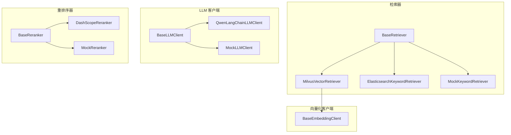
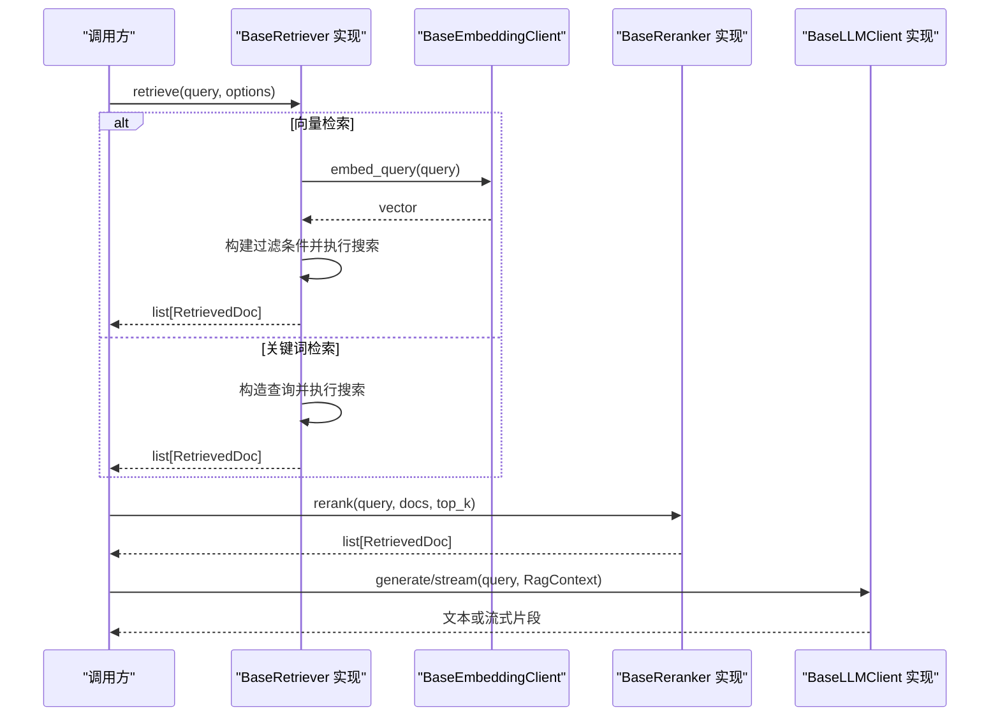
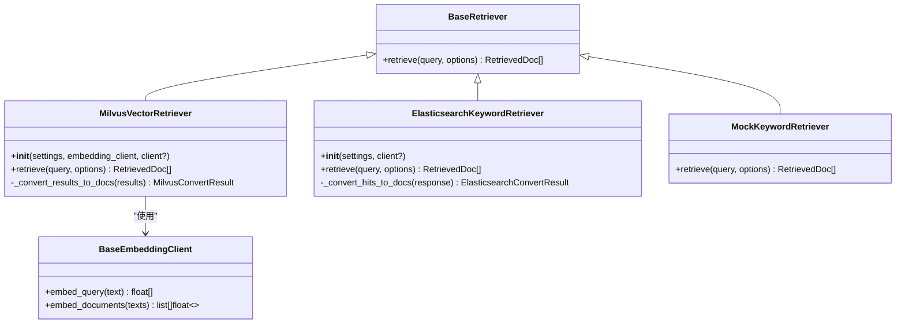
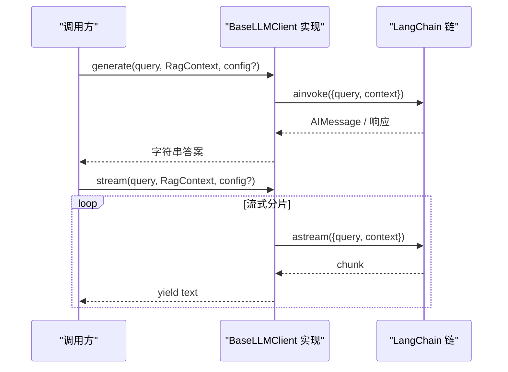
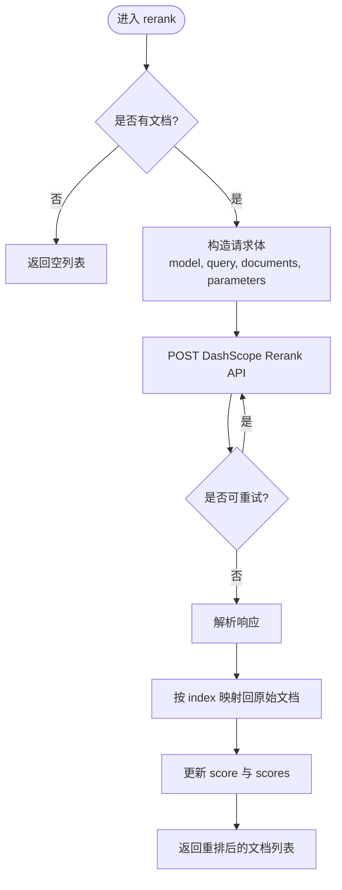
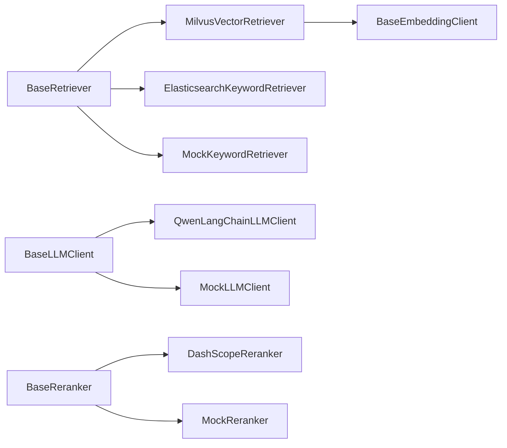

# Provider 模式

<cite>
**本文引用的文件**
- [base.py](file://src/fast_app/components/retrievers/base.py)
- [milvus_vector_retriever.py](file://src/fast_app/components/retrievers/milvus_vector_retriever.py)
- [elasticsearch_keyword_retriever.py](file://src/fast_app/components/retrievers/elasticsearch_keyword_retriever.py)
- [mock_keyword_retriever.py](file://src/fast_app/components/retrievers/mock_keyword_retriever.py)
- [base.py](file://src/fast_app/components/llms/base.py)
- [qwen_langchain_llm_client.py](file://src/fast_app/components/llms/qwen_langchain_llm_client.py)
- [mock_llm_client.py](file://src/fast_app/components/llms/mock_llm_client.py)
- [base.py](file://src/fast_app/components/rerankers/base.py)
- [dashscope_reranker.py](file://src/fast_app/components/rerankers/dashscope_reranker.py)
- [mock_reranker.py](file://src/fast_app/components/rerankers/mock_reranker.py)
- [base.py](file://src/fast_app/components/embeddings/base.py)
</cite>

## 目录
1. [简介](#简介)
2. [项目结构](#项目结构)
3. [核心组件](#核心组件)
4. [架构总览](#架构总览)
5. [详细组件分析](#详细组件分析)
6. [依赖关系分析](#依赖关系分析)
7. [性能考量](#性能考量)
8. [故障排查指南](#故障排查指南)
9. [结论](#结论)
10. [附录：自定义 Provider 与配置注入示例](#附录自定义-provider-与配置注入示例)

## 简介
本仓库采用 Provider 模式对检索器、LLM 客户端、重排序器等外部能力进行抽象与解耦。通过统一的抽象基类，系统可以在运行时根据配置或上下文切换不同的具体实现（例如 Milvus 向量检索器、Elasticsearch 关键词检索器、OpenAI/DashScope LLM 客户端、DashScope 重排序器等）。该模式的核心价值在于：
- 统一接口：上层业务只依赖抽象基类，不感知底层实现差异。
- 可插拔替换：新增或更换 Provider 无需改动调用方。
- 可测试性：提供 Mock 实现便于单元测试和集成测试。
- 可观测性：各 Provider 内部记录结构化日志、慢操作告警与错误分类。

## 项目结构
Provider 相关代码集中在 fast_app/components 下，按能力域划分为 retrievers、llms、rerankers、embeddings 四个子模块，每个子模块包含抽象基类与若干具体实现。

图表来源
- [base.py:6-13](file://src/fast_app/components/retrievers/base.py#L6-L13)
- [milvus_vector_retriever.py:155-180](file://src/fast_app/components/retrievers/milvus_vector_retriever.py#L155-L180)
- [elasticsearch_keyword_retriever.py:210-225](file://src/fast_app/components/retrievers/elasticsearch_keyword_retriever.py#L210-L225)
- [mock_keyword_retriever.py:7-12](file://src/fast_app/components/retrievers/mock_keyword_retriever.py#L7-L12)
- [base.py:9-26](file://src/fast_app/components/llms/base.py#L9-L26)
- [qwen_langchain_llm_client.py:107-134](file://src/fast_app/components/llms/qwen_langchain_llm_client.py#L107-L134)
- [mock_llm_client.py:17-26](file://src/fast_app/components/llms/mock_llm_client.py#L17-L26)
- [base.py:6-13](file://src/fast_app/components/rerankers/base.py#L6-L13)
- [dashscope_reranker.py:24-35](file://src/fast_app/components/rerankers/dashscope_reranker.py#L24-L35)
- [mock_reranker.py:5-12](file://src/fast_app/components/rerankers/mock_reranker.py#L5-L12)
- [base.py:4-12](file://src/fast_app/components/embeddings/base.py#L4-L12)

章节来源
- [base.py:6-13](file://src/fast_app/components/retrievers/base.py#L6-L13)
- [base.py:9-26](file://src/fast_app/components/llms/base.py#L9-L26)
- [base.py:6-13](file://src/fast_app/components/rerankers/base.py#L6-L13)
- [base.py:4-12](file://src/fast_app/components/embeddings/base.py#L4-L12)

## 核心组件
- BaseRetriever：定义检索器的统一异步接口 retrieve(query, options) -> list[RetrievedDoc]。所有检索实现必须遵循该契约。
- BaseLLMClient：定义生成与流式接口 generate/query/context -> str 与 stream(query, context) -> AsyncGenerator[str]。
- BaseReranker：定义重排序接口 rerank(query, docs, top_k) -> list[RetrievedDoc]。
- BaseEmbeddingClient：定义 query/document 向量化接口，供向量检索器使用。

这些抽象基类将“做什么”与“怎么做”解耦，使上层编排逻辑仅依赖稳定契约。

章节来源
- [base.py:6-13](file://src/fast_app/components/retrievers/base.py#L6-L13)
- [base.py:9-26](file://src/fast_app/components/llms/base.py#L9-L26)
- [base.py:6-13](file://src/fast_app/components/rerankers/base.py#L6-L13)
- [base.py:4-12](file://src/fast_app/components/embeddings/base.py#L4-L12)

## 架构总览
下图展示了 RAG 主链路中 Provider 的协作方式：检索器召回候选文档，可选地经过重排序器精排，最后由 LLM 基于上下文生成回答。

图表来源
- [milvus_vector_retriever.py:182-303](file://src/fast_app/components/retrievers/milvus_vector_retriever.py#L182-L303)
- [elasticsearch_keyword_retriever.py:227-340](file://src/fast_app/components/retrievers/elasticsearch_keyword_retriever.py#L227-L340)
- [dashscope_reranker.py:36-100](file://src/fast_app/components/rerankers/dashscope_reranker.py#L36-L100)
- [qwen_langchain_llm_client.py:136-238](file://src/fast_app/components/llms/qwen_langchain_llm_client.py#L136-L238)
- [base.py:4-12](file://src/fast_app/components/embeddings/base.py#L4-L12)

## 详细组件分析

### 检索器 Provider
- 抽象契约：BaseRetriever.retrieve(query, RetrievalOptions) -> list[RetrievedDoc]。
- Milvus 向量检索器：
  - 负责将 query 向量化、校验维度、构建过滤表达式（含权限下推）、执行 search、转换 hits 为 RetrievedDoc，并记录耗时与慢操作。
  - 支持输出字段白名单、跳过脏命中计数、异常包装为外部服务错误。
- Elasticsearch 关键词检索器：
  - 负责构造 bool 查询（must/filter/must_not），执行 search，转换 hits，记录 total/value/relation 等观测指标。
  - 同样具备权限下推、脏数据跳过与慢操作告警。
- Mock 关键词检索器：
  - 用于测试与演示，返回固定结果集并按 candidate_k 截断。

图表来源
- [base.py:6-13](file://src/fast_app/components/retrievers/base.py#L6-L13)
- [milvus_vector_retriever.py:155-180](file://src/fast_app/components/retrievers/milvus_vector_retriever.py#L155-L180)
- [milvus_vector_retriever.py:339-409](file://src/fast_app/components/retrievers/milvus_vector_retriever.py#L339-L409)
- [elasticsearch_keyword_retriever.py:210-225](file://src/fast_app/components/retrievers/elasticsearch_keyword_retriever.py#L210-L225)
- [elasticsearch_keyword_retriever.py:347-399](file://src/fast_app/components/retrievers/elasticsearch_keyword_retriever.py#L347-L399)
- [mock_keyword_retriever.py:7-12](file://src/fast_app/components/retrievers/mock_keyword_retriever.py#L7-L12)
- [base.py:4-12](file://src/fast_app/components/embeddings/base.py#L4-L12)

章节来源
- [milvus_vector_retriever.py:182-337](file://src/fast_app/components/retrievers/milvus_vector_retriever.py#L182-L337)
- [elasticsearch_keyword_retriever.py:227-340](file://src/fast_app/components/retrievers/elasticsearch_keyword_retriever.py#L227-L340)
- [mock_keyword_retriever.py:7-30](file://src/fast_app/components/retrievers/mock_keyword_retriever.py#L7-L30)

### LLM 客户端 Provider
- 抽象契约：BaseLLMClient.generate(query, RagContext, RunnableConfig|None) -> str；stream(...) -> AsyncGenerator[str]。
- Qwen LangChain 客户端：
  - 基于 ChatOpenAI 封装 prompt 链，支持 generate 与 stream 两种模式。
  - 记录 token 用量、finish_reason、模型名、慢操作与失败事件，并将异常包装为 LLMCallError。
- Mock LLM 客户端：
  - 模拟延迟与流式输出，便于端到端流程验证与压测。

图表来源
- [base.py:9-26](file://src/fast_app/components/llms/base.py#L9-L26)
- [qwen_langchain_llm_client.py:136-238](file://src/fast_app/components/llms/qwen_langchain_llm_client.py#L136-L238)
- [qwen_langchain_llm_client.py:241-340](file://src/fast_app/components/llms/qwen_langchain_llm_client.py#L241-L340)
- [mock_llm_client.py:21-108](file://src/fast_app/components/llms/mock_llm_client.py#L21-L108)
- [mock_llm_client.py:110-204](file://src/fast_app/components/llms/mock_llm_client.py#L110-L204)

章节来源
- [qwen_langchain_llm_client.py:107-134](file://src/fast_app/components/llms/qwen_langchain_llm_client.py#L107-L134)
- [qwen_langchain_llm_client.py:136-238](file://src/fast_app/components/llms/qwen_langchain_llm_client.py#L136-L238)
- [qwen_langchain_llm_client.py:241-340](file://src/fast_app/components/llms/qwen_langchain_llm_client.py#L241-L340)
- [mock_llm_client.py:17-204](file://src/fast_app/components/llms/mock_llm_client.py#L17-L204)

### 重排序器 Provider
- 抽象契约：BaseReranker.rerank(query, docs, top_k) -> list[RetrievedDoc]。
- DashScope 重排序器：
  - 通过 HTTP 调用 DashScope Rerank 接口，支持重试策略与超时控制。
  - 将返回的 index 与 relevance_score 映射回原始文档顺序，更新 score 与 scores 字段。
- Mock 重排序器：
  - 直接按 top_k 截断，用于无外部依赖场景。

图表来源
- [base.py:6-13](file://src/fast_app/components/rerankers/base.py#L6-L13)
- [dashscope_reranker.py:36-100](file://src/fast_app/components/rerankers/dashscope_reranker.py#L36-L100)
- [dashscope_reranker.py:103-139](file://src/fast_app/components/rerankers/dashscope_reranker.py#L103-L139)
- [mock_reranker.py:5-12](file://src/fast_app/components/rerankers/mock_reranker.py#L5-L12)

章节来源
- [dashscope_reranker.py:24-100](file://src/fast_app/components/rerankers/dashscope_reranker.py#L24-L100)
- [dashscope_reranker.py:103-139](file://src/fast_app/components/rerankers/dashscope_reranker.py#L103-L139)
- [mock_reranker.py:5-12](file://src/fast_app/components/rerankers/mock_reranker.py#L5-L12)

## 依赖关系分析
- 低耦合高内聚：各 Provider 仅依赖自身领域 SDK（如 pymilvus、elasticsearch、httpx、langchain_openai）与通用配置 Settings。
- 共享领域模型：RetrievedDoc、RetrievalOptions、RagContext 等作为跨组件契约，确保数据流转一致。
- 外部服务错误分层：检索器与重排序器将外部服务异常统一包装为 ExternalServiceError；LLM 客户端包装为 LLMCallError，便于上层区分处理。
- 可观测性：通过 log_slow_operation 与结构化日志字段，记录关键路径耗时、阈值告警与错误类型。

图表来源
- [base.py:6-13](file://src/fast_app/components/retrievers/base.py#L6-L13)
- [milvus_vector_retriever.py:155-180](file://src/fast_app/components/retrievers/milvus_vector_retriever.py#L155-L180)
- [elasticsearch_keyword_retriever.py:210-225](file://src/fast_app/components/retrievers/elasticsearch_keyword_retriever.py#L210-L225)
- [mock_keyword_retriever.py:7-12](file://src/fast_app/components/retrievers/mock_keyword_retriever.py#L7-L12)
- [base.py:9-26](file://src/fast_app/components/llms/base.py#L9-L26)
- [qwen_langchain_llm_client.py:107-134](file://src/fast_app/components/llms/qwen_langchain_llm_client.py#L107-L134)
- [mock_llm_client.py:17-26](file://src/fast_app/components/llms/mock_llm_client.py#L17-L26)
- [base.py:6-13](file://src/fast_app/components/rerankers/base.py#L6-L13)
- [dashscope_reranker.py:24-35](file://src/fast_app/components/rerankers/dashscope_reranker.py#L24-L35)
- [mock_reranker.py:5-12](file://src/fast_app/components/rerankers/mock_reranker.py#L5-L12)
- [base.py:4-12](file://src/fast_app/components/embeddings/base.py#L4-L12)

章节来源
- [milvus_vector_retriever.py:182-337](file://src/fast_app/components/retrievers/milvus_vector_retriever.py#L182-L337)
- [elasticsearch_keyword_retriever.py:227-340](file://src/fast_app/components/retrievers/elasticsearch_keyword_retriever.py#L227-L340)
- [dashscope_reranker.py:36-100](file://src/fast_app/components/rerankers/dashscope_reranker.py#L36-L100)
- [qwen_langchain_llm_client.py:136-238](file://src/fast_app/components/llms/qwen_langchain_llm_client.py#L136-L238)

## 性能考量
- 向量检索：
  - 在 Milvus 侧进行权限与业务过滤下推，减少无效候选集。
  - 记录 embedding 耗时与搜索耗时，设置慢检索阈值触发告警。
  - 避免日志输出完整文档内容，仅记录少量 doc id。
- 关键词检索：
  - 使用 filter 不参与评分，保证相关性不受硬约束影响。
  - 设置请求级超时，防止慢查询阻塞链路。
- LLM 调用：
  - 区分 generate 与 stream 的慢操作阈值，分别统计 token 用量与流式分片数。
  - 对网络抖动与 429/5xx 等错误进行重试与降级。
- 重排序：
  - 限制 top_n 与超时，避免长尾请求拖慢整体时延。
  - 使用重试策略提高鲁棒性。

[本节为通用性能建议，不直接分析具体文件]

## 故障排查指南
- 检索阶段
  - 维度不匹配：当 query embedding 维度与配置不一致时，会抛出外部服务错误并记录详细日志。
  - 脏数据跳过：缺少 id 或 content 的 hit 会被跳过并记录告警，便于定位索引质量问题。
  - 权限问题：若无任何可访问范围，会构造必定不命中的条件，避免误放开权限。
- LLM 阶段
  - 配置缺失：如 API Key 为空，会在初始化时抛出 LLMCallError。
  - 调用失败：捕获异常后记录 provider、模型名、错误类型与耗时，并包装为 LLMCallError。
- 重排序阶段
  - HTTP 状态错误：记录状态码与响应体，抛出 ExternalServiceError。
  - 参数错误：非可重试错误不会盲目重试，避免放大副作用。

章节来源
- [milvus_vector_retriever.py:215-233](file://src/fast_app/components/retrievers/milvus_vector_retriever.py#L215-L233)
- [milvus_vector_retriever.py:359-370](file://src/fast_app/components/retrievers/milvus_vector_retriever.py#L359-L370)
- [elasticsearch_keyword_retriever.py:124-127](file://src/fast_app/components/retrievers/elasticsearch_keyword_retriever.py#L124-L127)
- [qwen_langchain_llm_client.py:108-119](file://src/fast_app/components/llms/qwen_langchain_llm_client.py#L108-L119)
- [qwen_langchain_llm_client.py:205-238](file://src/fast_app/components/llms/qwen_langchain_llm_client.py#L205-L238)
- [dashscope_reranker.py:92-100](file://src/fast_app/components/rerankers/dashscope_reranker.py#L92-L100)

## 结论
通过 Provider 模式，本项目实现了检索、生成、重排序等能力的标准化接入与灵活替换。抽象基类确保了稳定的调用契约，具体实现则专注于各自领域的细节与优化。配合结构化日志、慢操作告警与错误分层，系统在可维护性、可观测性与可扩展性方面达到了工程化要求。

[本节为总结性内容，不直接分析具体文件]

## 附录：自定义 Provider 与配置注入示例
- 自定义检索器
  - 继承 BaseRetriever 并实现 retrieve 方法，返回 RetrievedDoc 列表。
  - 参考路径：[检索器基类:6-13](file://src/fast_app/components/retrievers/base.py#L6-L13)、[Milvus 实现:155-180](file://src/fast_app/components/retrievers/milvus_vector_retriever.py#L155-L180)。
- 自定义 LLM 客户端
  - 继承 BaseLLMClient 并实现 generate 与 stream。
  - 参考路径：[LLM 基类:9-26](file://src/fast_app/components/llms/base.py#L9-L26)、[Qwen 实现:107-134](file://src/fast_app/components/llms/qwen_langchain_llm_client.py#L107-L134)。
- 自定义重排序器
  - 继承 BaseReranker 并实现 rerank，保持输入输出契约。
  - 参考路径：[重排序基类:6-13](file://src/fast_app/components/rerankers/base.py#L6-L13)、[DashScope 实现:24-35](file://src/fast_app/components/rerankers/dashscope_reranker.py#L24-L35)。
- 配置注入与运行时切换
  - 通过 Settings 注入连接信息、模型名称、超时与阈值等参数。
  - 在应用启动时根据环境变量或配置文件选择具体 Provider 实例（例如 Milvus vs ES、Qwen vs Mock）。
  - 参考路径：[Settings 使用示例:155-180](file://src/fast_app/components/retrievers/milvus_vector_retriever.py#L155-L180)、[LLM 初始化:107-134](file://src/fast_app/components/llms/qwen_langchain_llm_client.py#L107-L134)。
- 最佳实践
  - 错误处理：对外部服务异常进行分类包装，保留原始错误上下文。
  - 性能优化：启用过滤下推、设置超时与慢操作阈值、避免大对象入日志。
  - 测试策略：优先使用 Mock 实现进行单元与集成测试，再逐步替换为真实 Provider。

章节来源
- [milvus_vector_retriever.py:155-180](file://src/fast_app/components/retrievers/milvus_vector_retriever.py#L155-L180)
- [qwen_langchain_llm_client.py:107-134](file://src/fast_app/components/llms/qwen_langchain_llm_client.py#L107-L134)
- [dashscope_reranker.py:24-35](file://src/fast_app/components/rerankers/dashscope_reranker.py#L24-L35)
- [base.py:6-13](file://src/fast_app/components/retrievers/base.py#L6-L13)
- [base.py:9-26](file://src/fast_app/components/llms/base.py#L9-L26)
- [base.py:6-13](file://src/fast_app/components/rerankers/base.py#L6-L13)