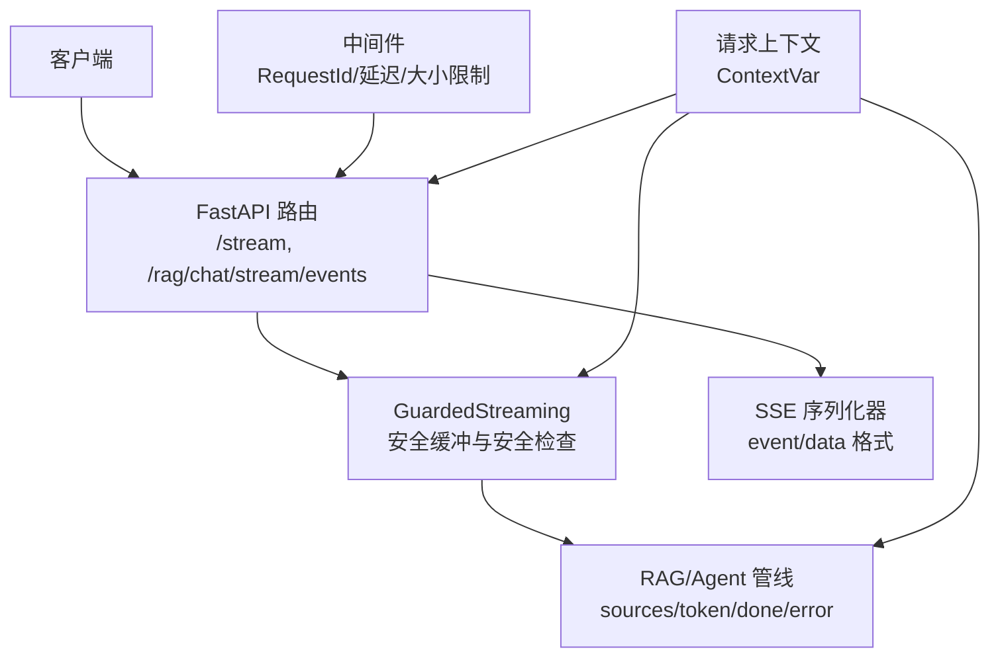
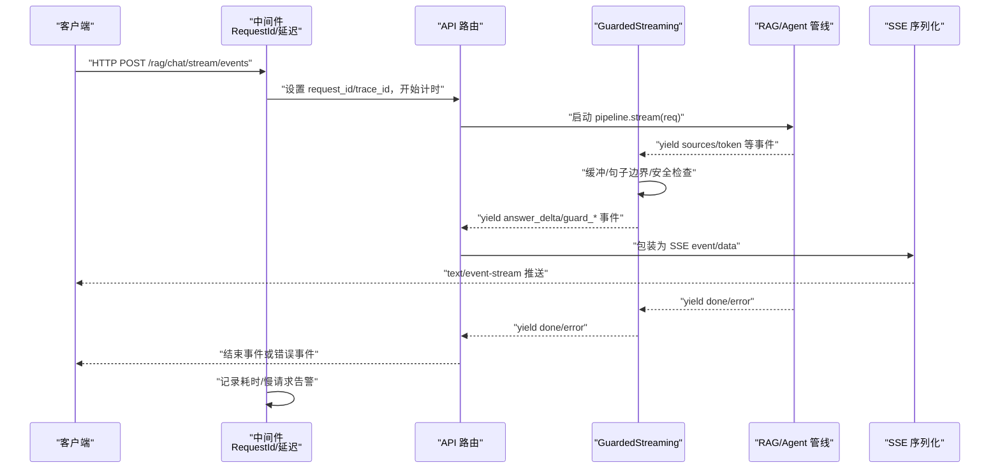
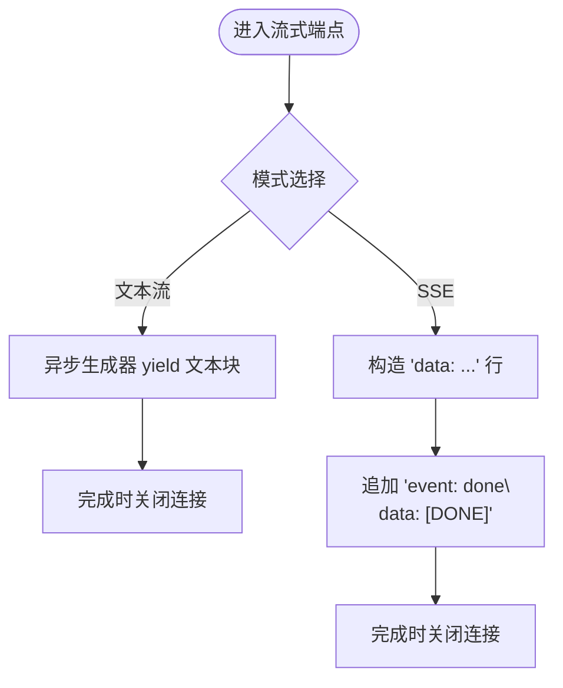
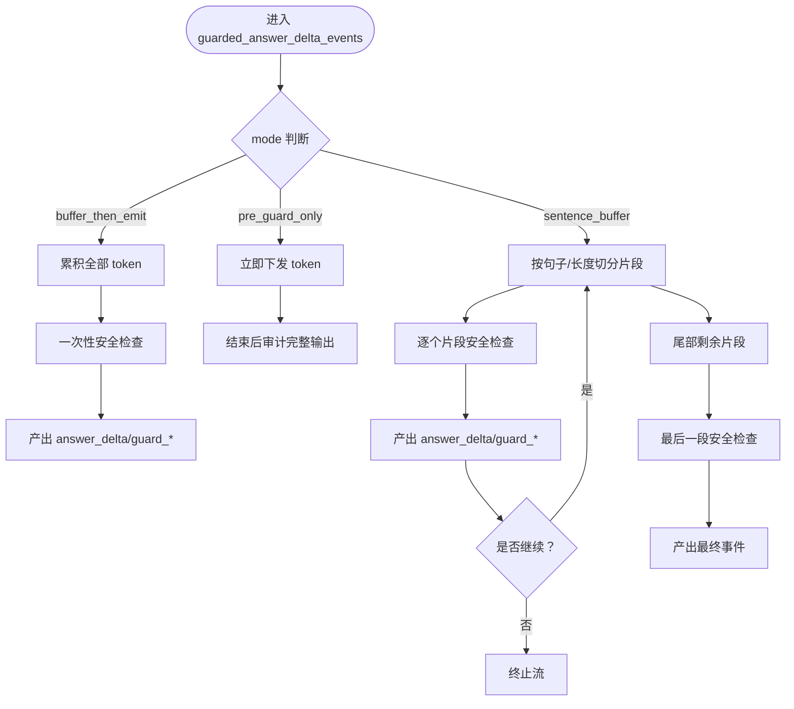
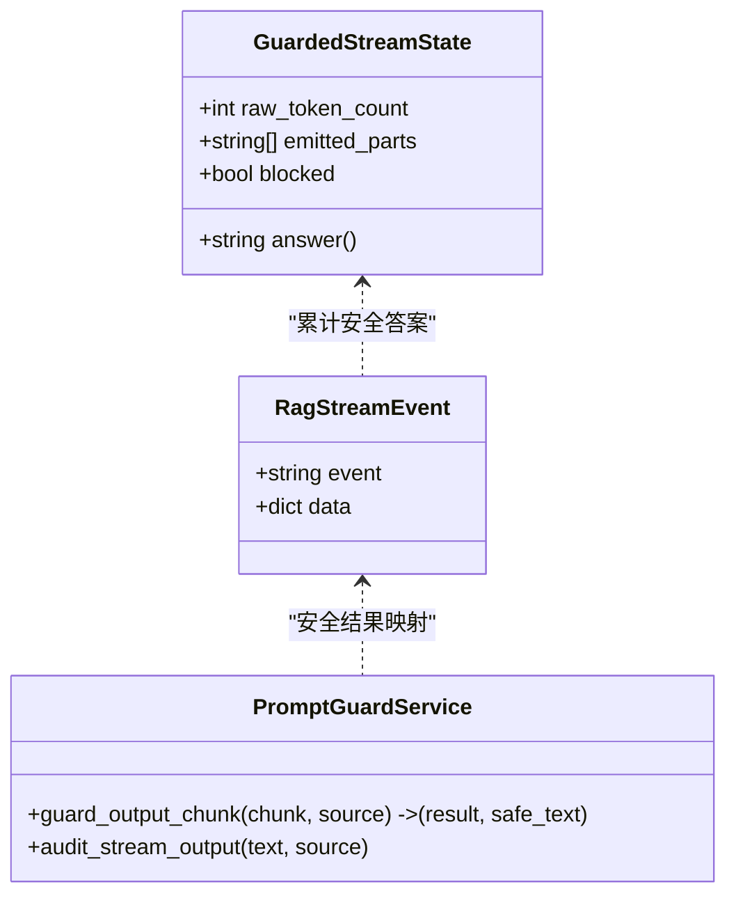
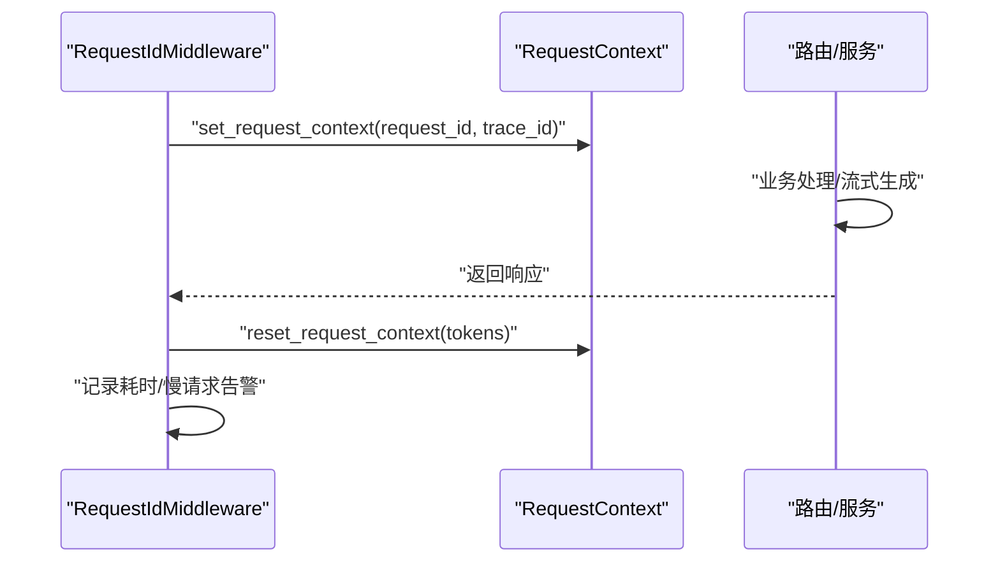
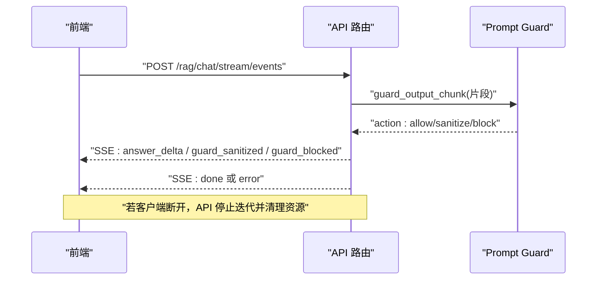
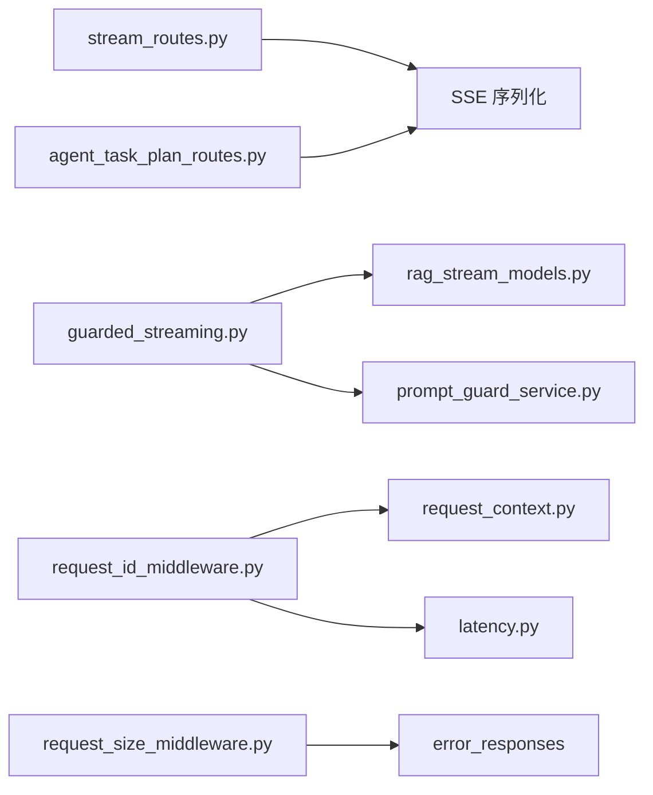

# 事件驱动架构

<cite>
**本文引用的文件**
- [stream_routes.py](file://src/fast_app/api/stream_routes.py)
- [guarded_streaming.py](file://src/fast_app/services/rag/guarded_streaming.py)
- [rag_stream_models.py](file://src/fast_app/domain/rag_stream_models.py)
- [request_context.py](file://src/fast_app/core/request_context.py)
- [request_id_middleware.py](file://src/fast_app/middlewares/request_id_middleware.py)
- [latency.py](file://src/fast_app/core/latency.py)
- [agent_task_plan_routes.py](file://src/fast_app/api/agent_task_plan_routes.py)
- [20-3-接口文档整理.md](file://learning-docs/phase-20/20-3-接口文档整理.md)
</cite>

## 目录
1. [简介](#简介)
2. [项目结构](#项目结构)
3. [核心组件](#核心组件)
4. [架构总览](#架构总览)
5. [详细组件分析](#详细组件分析)
6. [依赖关系分析](#依赖关系分析)
7. [性能考虑](#性能考虑)
8. [故障排查指南](#故障排查指南)
9. [结论](#结论)
10. [附录](#附录)

## 简介
本文件围绕事件驱动架构，系统性说明 Server-Sent Events（SSE）在流式响应中的应用、GuardedStreaming 的安全流式输出机制、请求上下文的事件传播方式，以及面向开发者的中间件与自定义事件处理器实践。内容基于仓库中的 FastAPI 路由、服务层安全过滤、领域事件模型和中间件实现进行梳理，帮助读者理解从 HTTP 入口到 AI 生成内容输出的完整事件链路。

## 项目结构
本项目采用分层组织：HTTP 路由负责协议与 SSE 封装；服务层提供业务逻辑与安全边界；领域层定义结构化事件；中间件负责横切关注点（请求追踪、耗时统计、大小限制等）。

图表来源
- [stream_routes.py:1-38](file://src/fast_app/api/stream_routes.py#L1-L38)
- [guarded_streaming.py:1-222](file://src/fast_app/services/rag/guarded_streaming.py#L1-L222)
- [rag_stream_models.py:1-46](file://src/fast_app/domain/rag_stream_models.py#L1-L46)
- [request_id_middleware.py:1-76](file://src/fast_app/middlewares/request_id_middleware.py#L1-L76)
- [latency.py:1-37](file://src/fast_app/core/latency.py#L1-L37)

章节来源
- [stream_routes.py:1-38](file://src/fast_app/api/stream_routes.py#L1-L38)
- [20-3-接口文档整理.md:212-290](file://learning-docs/phase-20/20-3-接口文档整理.md#L212-L290)

## 核心组件
- 流式路由与 SSE 示例：提供基础文本流与 SSE 流端点，演示 StreamingResponse 与 event-stream 媒体类型的使用。
- GuardedStreaming：对 LLM token 流进行安全缓冲、句子边界切分、Prompt Guard 检查，产出 answer_delta、guard_sanitized、guard_blocked 等结构化事件。
- 结构化事件模型：统一 RagStreamEvent 名称空间，涵盖 sources、answer_delta、done、error、任务计划事件等。
- 请求上下文：通过 ContextVar 在异步环境中传递 request_id、trace_id，贯穿中间件、路由与服务。
- 中间件：RequestId 中间件注入上下文并记录耗时；请求大小限制中间件在 HTTP 边界拦截超大请求体。

章节来源
- [stream_routes.py:1-38](file://src/fast_app/api/stream_routes.py#L1-L38)
- [guarded_streaming.py:1-222](file://src/fast_app/services/rag/guarded_streaming.py#L1-L222)
- [rag_stream_models.py:1-46](file://src/fast_app/domain/rag_stream_models.py#L1-L46)
- [request_context.py:1-39](file://src/fast_app/core/request_context.py#L1-L39)
- [request_id_middleware.py:1-76](file://src/fast_app/middlewares/request_id_middleware.py#L1-L76)
- [latency.py:1-37](file://src/fast_app/core/latency.py#L1-L37)

## 架构总览
下图展示一次典型 RAG 流式对话的端到端流程：客户端发起请求，中间件注入上下文与计时；路由将请求转发至服务层；服务层调用 RAG/Agent 管线产生结构化事件；GuardedStreaming 对 token 流进行安全检查并转换为前端可消费事件；最终由 API 层序列化为 SSE 返回。

图表来源
- [request_id_middleware.py:19-76](file://src/fast_app/middlewares/request_id_middleware.py#L19-L76)
- [latency.py:7-37](file://src/fast_app/core/latency.py#L7-L37)
- [guarded_streaming.py:36-134](file://src/fast_app/services/rag/guarded_streaming.py#L36-L134)
- [rag_stream_models.py:5-46](file://src/fast_app/domain/rag_stream_models.py#L5-L46)
- [20-3-接口文档整理.md:212-290](file://learning-docs/phase-20/20-3-接口文档整理.md#L212-L290)

## 详细组件分析

### SSE 流式响应与示例
- 文本流：使用 StreamingResponse 与异步生成器逐块发送文本片段。
- SSE 流：以 text/event-stream 媒体类型推送 data 行，并在结束时发送 event: done。
- 结构化 SSE：主流式接口遵循“Pipeline 层只产生业务事件，API 层补充 done/error”的契约，token 默认无显式 event 字段，结构化事件则包含明确 event 名。

图表来源
- [stream_routes.py:11-38](file://src/fast_app/api/stream_routes.py#L11-L38)
- [20-3-接口文档整理.md:212-290](file://learning-docs/phase-20/20-3-接口文档整理.md#L212-L290)

章节来源
- [stream_routes.py:1-38](file://src/fast_app/api/stream_routes.py#L1-L38)
- [20-3-接口文档整理.md:212-290](file://learning-docs/phase-20/20-3-接口文档整理.md#L212-L290)

### GuardedStreaming 安全流式输出
- 状态管理：GuardedStreamState 累计原始 token 数量、已允许发送的安全文本片段，以及是否被阻断。
- 处理模式：
  - buffer_then_emit：先缓冲完整回答再一次性安全检查，安全性最强但首包延迟最高。
  - pre_guard_only：兼容旧接口的“先发后审”，仅用于观察或兼容场景。
  - sentence_buffer（默认主线）：按句子边界或最大长度切分片段，交给 Prompt Guard 检查后再下发。
- 事件产出：
  - answer_delta：安全片段，直接下发。
  - guard_sanitized：已脱敏片段，附带脱敏信息。
  - guard_blocked：高风险片段，停止后续输出。
- 尾部处理：流结束时若仍有未检查片段，必须再次经过安全检查。

图表来源
- [guarded_streaming.py:14-134](file://src/fast_app/services/rag/guarded_streaming.py#L14-L134)
- [guarded_streaming.py:148-222](file://src/fast_app/services/rag/guarded_streaming.py#L148-L222)

章节来源
- [guarded_streaming.py:1-222](file://src/fast_app/services/rag/guarded_streaming.py#L1-L222)

### 结构化事件模型与事件传播
- RagStreamEventName：统一定义 sources、answer_delta、guard_sanitized、guard_blocked、token、done、error 及大量 Agent/TaskPlan 相关事件。
- RagStreamEvent：携带 event 名称与数据载荷，作为 Pipeline 与 API 之间的契约对象。
- 事件传播：
  - Pipeline 层产生业务事件（如 sources、token）。
  - API 层补充系统事件（done、error），并负责 SSE 序列化。
  - TaskPlan 进度事件通过专用函数格式化并推送到 SSE。

图表来源
- [rag_stream_models.py:5-46](file://src/fast_app/domain/rag_stream_models.py#L5-L46)
- [guarded_streaming.py:14-27](file://src/fast_app/services/rag/guarded_streaming.py#L14-L27)
- [guarded_streaming.py:148-222](file://src/fast_app/services/rag/guarded_streaming.py#L148-L222)

章节来源
- [rag_stream_models.py:1-46](file://src/fast_app/domain/rag_stream_models.py#L1-L46)
- [agent_task_plan_routes.py:436-583](file://src/fast_app/api/agent_task_plan_routes.py#L436-L583)

### 请求上下文与异步环境传播
- ContextVar：request_id_var、trace_id_var 用于跨异步任务传播请求标识与追踪标识。
- 中间件注入：RequestIdMiddleware 在请求开始时设置上下文，并在响应中回写 request_id，同时记录耗时与慢请求告警。
- 清理策略：使用 Token 重置上下文，避免跨请求污染。

图表来源
- [request_context.py:1-39](file://src/fast_app/core/request_context.py#L1-L39)
- [request_id_middleware.py:19-76](file://src/fast_app/middlewares/request_id_middleware.py#L19-L76)
- [latency.py:7-37](file://src/fast_app/core/latency.py#L7-L37)

章节来源
- [request_context.py:1-39](file://src/fast_app/core/request_context.py#L1-L39)
- [request_id_middleware.py:1-76](file://src/fast_app/middlewares/request_id_middleware.py#L1-L76)
- [latency.py:1-37](file://src/fast_app/core/latency.py#L1-L37)

### 流式 API 实现示例与异常处理
- 基础示例：/stream/text 与 /stream/sse 展示了 StreamingResponse 的基本用法与 SSE 事件格式。
- 主流式接口契约：Pipeline 层只 yield str token；API 层负责包装 SSE，并补充 done/error。
- 异常与错误事件：错误事件包含 code、message、error_category、request_id、trace_id 等字段，便于前端与日志定位。
- 客户端断开与超时重试：
  - 客户端断开：服务端应尽快检测到并停止生成，GuardedStreaming 在 guard_blocked 时主动终止流。
  - 超时重试：建议在网关或上游代理层配置超时与重试；应用层可通过中间件记录慢请求并告警。
- 资源清理：中间件确保上下文重置；流式响应完成后释放生成器与外部资源。

图表来源
- [stream_routes.py:25-38](file://src/fast_app/api/stream_routes.py#L25-L38)
- [guarded_streaming.py:148-222](file://src/fast_app/services/rag/guarded_streaming.py#L148-L222)
- [20-3-接口文档整理.md:212-290](file://learning-docs/phase-20/20-3-接口文档整理.md#L212-L290)

章节来源
- [stream_routes.py:1-38](file://src/fast_app/api/stream_routes.py#L1-L38)
- [20-3-接口文档整理.md:212-290](file://learning-docs/phase-20/20-3-接口文档整理.md#L212-L290)

### 事件驱动的中间件开发指南
- 日志记录：在中间件中记录 http.request.finish、http.request.failed、http.request.slow 等事件，结合 format_log_fields 统一字段。
- 性能监控：使用 start_timer/elapsed_ms/is_slow_latency/log_slow_operation 记录耗时与慢请求告警。
- 安全检查：在 HTTP 边界做请求体大小限制，避免恶意大请求影响服务稳定性。
- 最佳实践：
  - 保持中间件职责单一：请求追踪、耗时统计、大小限制分别实现。
  - 不侵入业务逻辑：通过装饰器或包装器增强节点能力，而非修改核心流程。
  - 可观测性优先：所有关键路径输出结构化日志，便于检索与分析。

章节来源
- [request_id_middleware.py:1-76](file://src/fast_app/middlewares/request_id_middleware.py#L1-L76)
- [latency.py:1-37](file://src/fast_app/core/latency.py#L1-L37)
- [request_size_middleware.py:1-110](file://src/fast_app/middlewares/request_size_middleware.py#L1-L110)

### 自定义事件处理器与订阅者
- 事件生产者：
  - Pipeline 层产生 sources、token 等业务事件。
  - GuardedStreaming 将 token 转换为 answer_delta、guard_sanitized、guard_blocked。
  - API 层补充 done、error 等系统事件。
- 事件消费者：
  - 前端订阅 SSE，解析 event 与 data，渲染 sources、增量回答、任务步骤状态等。
  - 后端可订阅 TaskPlan 进度事件，用于 UI 更新或下游集成。
- 扩展建议：
  - 新增事件类型时，先在 RagStreamEventName 中声明，再在服务层与 API 层同步支持。
  - 保持事件契约稳定：Pipeline 层与 API 层职责清晰，避免越界修改。

章节来源
- [rag_stream_models.py:5-46](file://src/fast_app/domain/rag_stream_models.py#L5-L46)
- [agent_task_plan_routes.py:436-583](file://src/fast_app/api/agent_task_plan_routes.py#L436-L583)

## 依赖关系分析
- 路由依赖：
  - stream_routes 依赖 FastAPI 的 StreamingResponse 与异步生成器。
  - agent_task_plan_routes 依赖 _format_sse_event 将快照与步骤状态转为 SSE。
- 服务依赖：
  - guarded_streaming 依赖 PromptGuardService 进行输出安全检查。
  - 依赖 RagStreamEvent 统一事件模型。
- 中间件依赖：
  - request_id_middleware 依赖 request_context 与 latency 工具。
  - request_size_middleware 依赖错误响应构建与日志格式化。

图表来源
- [stream_routes.py:1-38](file://src/fast_app/api/stream_routes.py#L1-L38)
- [agent_task_plan_routes.py:436-583](file://src/fast_app/api/agent_task_plan_routes.py#L436-L583)
- [guarded_streaming.py:1-222](file://src/fast_app/services/rag/guarded_streaming.py#L1-L222)
- [rag_stream_models.py:1-46](file://src/fast_app/domain/rag_stream_models.py#L1-L46)
- [request_id_middleware.py:1-76](file://src/fast_app/middlewares/request_id_middleware.py#L1-L76)
- [latency.py:1-37](file://src/fast_app/core/latency.py#L1-L37)
- [request_size_middleware.py:1-110](file://src/fast_app/middlewares/request_size_middleware.py#L1-L110)

章节来源
- [stream_routes.py:1-38](file://src/fast_app/api/stream_routes.py#L1-L38)
- [agent_task_plan_routes.py:436-583](file://src/fast_app/api/agent_task_plan_routes.py#L436-L583)
- [guarded_streaming.py:1-222](file://src/fast_app/services/rag/guarded_streaming.py#L1-L222)
- [rag_stream_models.py:1-46](file://src/fast_app/domain/rag_stream_models.py#L1-L46)
- [request_id_middleware.py:1-76](file://src/fast_app/middlewares/request_id_middleware.py#L1-L76)
- [latency.py:1-37](file://src/fast_app/core/latency.py#L1-L37)
- [request_size_middleware.py:1-110](file://src/fast_app/middlewares/request_size_middleware.py#L1-L110)

## 性能考虑
- 首包延迟：buffer_then_emit 模式会引入较大首包延迟，适合高安全要求场景；sentence_buffer 平衡了延迟与安全。
- 缓冲区大小：合理设置 max_chars 与句子边界检测，减少不必要的 Prompt Guard 调用。
- 慢请求告警：通过中间件记录耗时，识别瓶颈路径。
- 资源释放：流式响应需确保生成器及时关闭，避免内存泄漏。

[本节为通用指导，不直接分析具体文件]

## 故障排查指南
- 常见错误：
  - 请求体过大：RequestSizeLimitMiddleware 返回 413，并记录 REQUEST_BODY_TOO_LARGE。
  - 慢请求：中间件记录 slow_operation 告警，便于定位性能问题。
  - 流中断：客户端断开导致生成器无法继续迭代，需在 API 层检测并清理。
- 调试建议：
  - 查看 request_id/trace_id 关联日志，定位请求全链路。
  - 检查 GuardedStreaming 产出的 guard_blocked 事件，确认安全风险类别。
  - 核对 SSE 事件顺序：sources → answer_delta* → done/error。

章节来源
- [request_size_middleware.py:20-85](file://src/fast_app/middlewares/request_size_middleware.py#L20-L85)
- [request_id_middleware.py:40-76](file://src/fast_app/middlewares/request_id_middleware.py#L40-L76)
- [guarded_streaming.py:148-222](file://src/fast_app/services/rag/guarded_streaming.py#L148-L222)

## 结论
本项目的事件驱动架构以 FastAPI 路由为入口，结合中间件、服务层安全过滤与结构化事件模型，实现了高效、安全的流式 AI 输出。GuardedStreaming 在保证安全的前提下优化了用户体验；请求上下文在异步环境中可靠传播；中间件提供了完善的可观测性与保护机制。开发者可基于此架构扩展自定义事件处理器与订阅者，满足多样化前端与集成需求。

[本节为总结，不直接分析具体文件]

## 附录
- 主流式接口契约参考：Pipeline 层只 yield str token；API 层负责 SSE 包装与系统事件补充。
- 事件命名规范：新事件应在 RagStreamEventName 中声明，并保持向后兼容。
- 中间件扩展点：可在现有中间件基础上增加认证、限流、审计等能力。

[本节为补充说明，不直接分析具体文件]